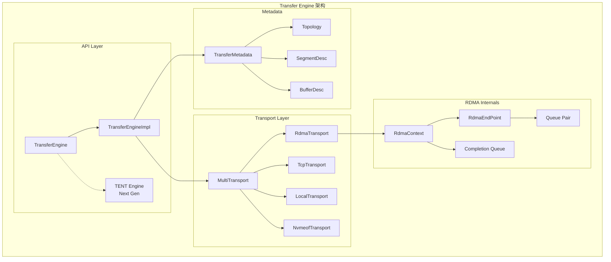
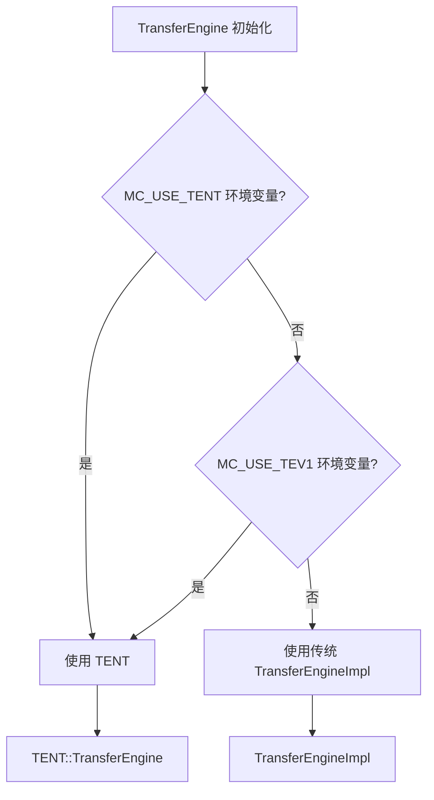
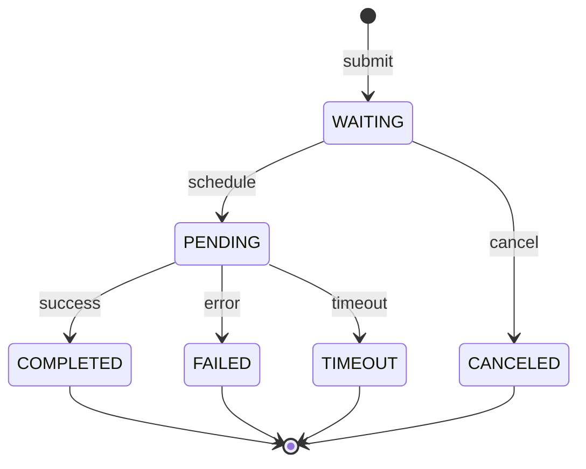
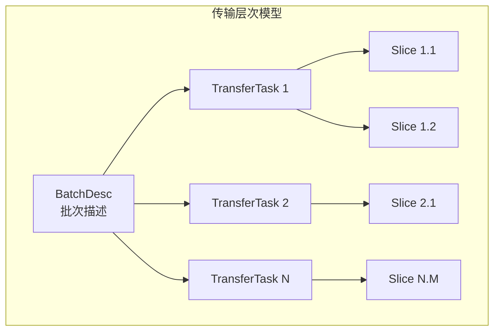
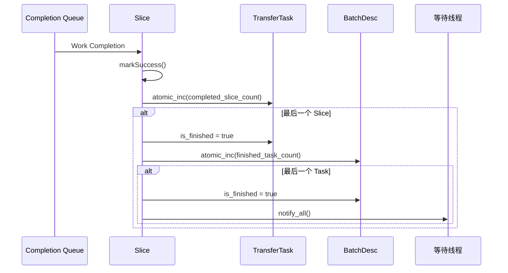
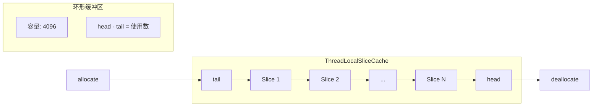

[上一篇](../03-mooncake-store/06-code-debug-traces.md) | [目录](../README.md) | [下一篇](02-rdma-transport.md)

# Transfer Engine 架构

## 8.1 整体架构

Transfer Engine 是 Mooncake 的高性能数据传输引擎，专为大规模 GPU 集群设计：



## 8.2 核心 API

### 8.2.1 TransferEngine 类

```cpp
class TransferEngine {
public:
    // 构造函数
    TransferEngine(bool auto_discover = false);
    TransferEngine(bool auto_discover, const std::vector<std::string>& filter);

    // 初始化
    int init(const std::string& metadata_conn_string,
             const std::string& local_server_name,
             const std::string& ip_or_host_name = "",
             uint64_t rpc_port = 12345);

    // Transport 管理
    Transport* installTransport(const std::string& proto, void** args);
    int uninstallTransport(const std::string& proto);

    // Segment 操作
    SegmentHandle openSegment(const std::string& segment_name);
    int closeSegment(SegmentHandle handle);

    // 内存注册
    int registerLocalMemory(void* addr, size_t length,
                            const std::string& location = kWildcardLocation,
                            bool remote_accessible = true,
                            bool update_metadata = true);
    int unregisterLocalMemory(void* addr, bool update_metadata = true);

    // 批量传输
    BatchID allocateBatchID(size_t batch_size);
    Status freeBatchID(BatchID batch_id);
    Status submitTransfer(BatchID batch_id,
                          const std::vector<TransferRequest>& entries);
    Status getTransferStatus(BatchID batch_id, size_t task_id,
                             TransferStatus& status);

private:
    std::shared_ptr<TransferEngineImpl> impl_;
    std::shared_ptr<mooncake::tent::TransferEngine> impl_tent_;
    bool use_tent_{false};  // 是否使用新一代引擎
};
```

### 8.2.2 TENT（Next Generation Transfer Engine）

Mooncake 支持两代 Transfer Engine：

```cpp
int TransferEngine::init(const std::string& metadata_conn_string,
                         const std::string& local_server_name,
                         const std::string& ip_or_host_name,
                         uint64_t rpc_port) {
    if (!use_tent_) {
        // 使用传统实现
        return impl_->init(metadata_conn_string, local_server_name,
                           ip_or_host_name, rpc_port);
    } else {
        // 使用 TENT（新一代）
        auto config = std::make_shared<mooncake::tent::Config>();
        config->set("local_segment_name", local_server_name);

        if (metadata_conn_string == P2PHANDSHAKE) {
            config->set("metadata_type", "p2p");
        } else {
            auto [type, servers] = parseConnectionString(metadata_conn_string);
            config->set("metadata_type", type);
            config->set("metadata_servers", servers);
        }

        impl_tent_ = std::make_shared<mooncake::tent::TransferEngine>(config);
        return impl_tent_->available();
    }
}
```

选择引擎的方式：



## 8.3 传输请求模型

### 8.3.1 TransferRequest 结构

```cpp
struct TransferRequest {
    enum OpCode {
        READ,   // 从远程读取到本地
        WRITE   // 从本地写入到远程
    };

    OpCode opcode;         // 操作类型
    void* source;          // 本地地址
    SegmentID target_id;   // 目标 Segment ID
    uint64_t target_offset; // 目标偏移量
    size_t length;         // 传输长度
    int advise_retry_cnt = 0; // 建议重试次数
};
```

### 8.3.2 传输状态

```cpp
enum TransferStatusEnum {
    WAITING,    // 等待调度
    PENDING,    // 已提交，等待完成
    INVALID,    // 无效
    CANCELED,   // 已取消
    COMPLETED,  // 完成
    TIMEOUT,    // 超时
    FAILED      // 失败
};

struct TransferStatus {
    TransferStatusEnum s;
    size_t transferred_bytes;  // 已传输字节数
};
```

传输状态转换：



## 8.4 Batch 与 Task 模型

### 8.4.1 层次结构



### 8.4.2 BatchDesc 结构

```cpp
struct BatchDesc {
    BatchID id;
    size_t batch_size;                    // 批次大小
    std::vector<TransferTask> task_list;  // Task 列表
    void* context;                        // Transport 上下文
    int64_t start_timestamp;

    // 批次级别状态跟踪
    std::atomic<bool> has_failure{false};
    std::atomic<bool> is_finished{false};
    std::atomic<uint64_t> finished_transfer_bytes{0};

#ifdef USE_EVENT_DRIVEN_COMPLETION
    // 事件驱动完成机制
    std::atomic<uint64_t> finished_task_count{0};
    std::mutex completion_mutex;
    std::condition_variable completion_cv;
#endif
};

// BatchID 到 BatchDesc 的快速转换
// 直接将 BatchID 解释为指针，避免查表开销
static inline BatchDesc& toBatchDesc(BatchID id) {
    return *reinterpret_cast<BatchDesc*>(id);
}
```

### 8.4.3 TransferTask 结构

```cpp
struct TransferTask {
    volatile uint64_t slice_count = 0;        // 总 Slice 数
    volatile uint64_t success_slice_count = 0; // 成功 Slice 数
    volatile uint64_t failed_slice_count = 0;  // 失败 Slice 数
    volatile uint64_t transferred_bytes = 0;   // 已传输字节
    volatile bool is_finished = false;
    uint64_t total_bytes = 0;
    BatchID batch_id = 0;

#ifdef USE_EVENT_DRIVEN_COMPLETION
    volatile uint64_t completed_slice_count = 0;
#endif

    const TransferRequest* request = nullptr;
    std::vector<Slice*> slice_list;  // Slice 列表

    ~TransferTask() {
        // 归还 Slice 到线程本地缓存
        for (auto& slice : slice_list) {
            Transport::getSliceCache().deallocate(slice);
        }
    }
};
```

## 8.5 Slice 分片机制

### 8.5.1 Slice 结构

Slice 是传输的最小单元，每个 Slice 对应一次 RDMA 操作：

```cpp
struct Slice {
    enum SliceStatus { PENDING, POSTED, SUCCESS, TIMEOUT, FAILED };

    void* source_addr;                     // 源地址
    size_t length;                         // 长度
    TransferRequest::OpCode opcode;        // 操作类型
    SegmentID target_id;                   // 目标 Segment
    std::string peer_nic_path;             // 对端网卡路径
    SliceStatus status;                    // 状态
    TransferTask* task;                    // 所属 Task
    std::vector<uint32_t> dest_rkeys;      // 远程 key 列表
    bool from_cache;                       // 是否来自缓存

    // RDMA 特定字段
    union {
        struct {
            uint64_t dest_addr;            // 远程地址
            uint32_t source_lkey;          // 本地 lkey
            uint32_t dest_rkey;            // 远程 rkey
            int lkey_index;
            int rkey_index;
            volatile int* qp_depth;        // QP 深度计数
            uint32_t retry_cnt;            // 重试次数
            uint32_t max_retry_cnt;        // 最大重试次数
        } rdma;

        struct {
            void* dest_addr;
        } local;

        struct {
            uint64_t dest_addr;
        } tcp;

        struct {
            uint64_t offset;
            int cufile_desc;
            uint64_t start;
            const char* file_path;
        } nvmeof;
    };

    // 标记成功
    void markSuccess() {
        status = Slice::SUCCESS;
        __atomic_fetch_add(&task->transferred_bytes, length, __ATOMIC_RELAXED);
        __atomic_fetch_add(&task->success_slice_count, 1, __ATOMIC_RELAXED);
        check_batch_completion(false);
    }

    // 标记失败
    void markFailed() {
        status = Slice::FAILED;
        __atomic_fetch_add(&task->failed_slice_count, 1, __ATOMIC_RELAXED);
        check_batch_completion(true);
    }

private:
    void check_batch_completion(bool is_failed);
};
```

### 8.5.2 事件驱动完成机制

```cpp
void Slice::check_batch_completion(bool is_failed) {
#ifdef USE_EVENT_DRIVEN_COMPLETION
    auto& batch_desc = toBatchDesc(task->batch_id);

    if (is_failed) {
        batch_desc.has_failure.store(true, std::memory_order_relaxed);
    }

    // 原子递增完成计数
    uint64_t prev_completed = __atomic_fetch_add(
        &task->completed_slice_count, 1, __ATOMIC_RELAXED);

    // 最后一个 Slice 完成时
    if (prev_completed + 1 == task->slice_count) {
        __atomic_store_n(&task->is_finished, true, __ATOMIC_RELAXED);

        // 递增批次完成任务计数
        auto prev = batch_desc.finished_task_count.fetch_add(
            1, std::memory_order_relaxed);

        // 批次中最后一个任务完成
        if (prev + 1 == batch_desc.batch_size) {
            {
                std::lock_guard<std::mutex> lock(batch_desc.completion_mutex);
                batch_desc.is_finished.store(true, std::memory_order_release);
            }
            // 唤醒等待线程
            batch_desc.completion_cv.notify_all();
        }
    }
#endif
}
```

完成通知流程：



### 8.5.3 线程本地 Slice 缓存

为了减少内存分配开销，使用线程本地缓存复用 Slice 对象：

```cpp
struct ThreadLocalSliceCache {
    static const size_t kLazyDeleteSliceCapacity = 4096;

    std::vector<Slice*> lazy_delete_slices_;
    uint64_t head_, tail_;
    uint64_t allocated_ = 0, freed_ = 0;

    ThreadLocalSliceCache() : head_(0), tail_(0) {
        lazy_delete_slices_.resize(kLazyDeleteSliceCapacity);
    }

    ~ThreadLocalSliceCache() {
        // 清理剩余 Slice
        for (uint64_t i = tail_; i != head_; i++) {
            delete lazy_delete_slices_[i % kLazyDeleteSliceCapacity];
            freed_++;
        }
        if (allocated_ != freed_) {
            LOG(WARNING) << "detected slice leak: allocated " << allocated_
                         << " freed " << freed_;
        }
    }

    Slice* allocate() {
        Slice* slice;
        if (head_ - tail_ == 0) {
            // 缓存为空，分配新对象
            allocated_++;
            slice = new Slice();
            slice->from_cache = false;
        } else {
            // 从缓存获取
            slice = lazy_delete_slices_[tail_ % kLazyDeleteSliceCapacity];
            tail_++;
            slice->from_cache = true;
        }
        return slice;
    }

    void deallocate(Slice* slice) {
        if (head_ - tail_ == kLazyDeleteSliceCapacity) {
            // 缓存满，直接删除
            delete slice;
            freed_++;
            return;
        }
        // 放入缓存
        lazy_delete_slices_[head_ % kLazyDeleteSliceCapacity] = slice;
        head_++;
    }
};
```

Slice 缓存原理：


