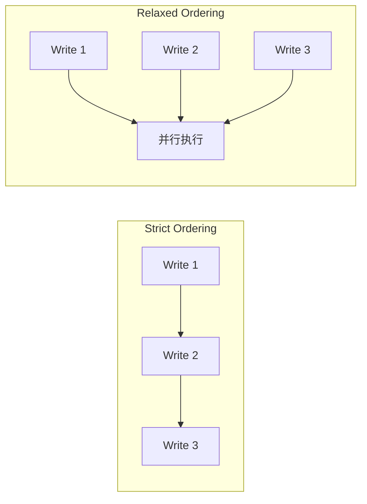
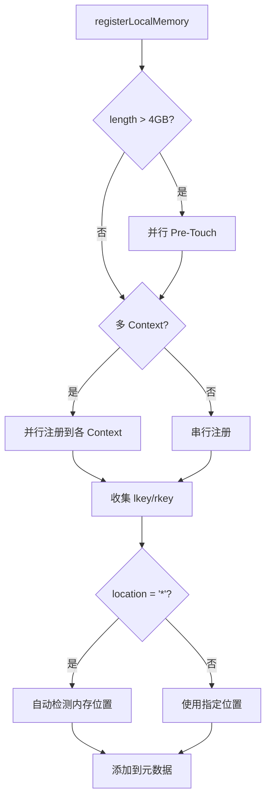

[上一篇](01-architecture-overview.md) | [目录](../README.md) | [下一篇](03-data-transfer-impl.md)

# RDMA Transport 实现

#### 9.1 RdmaTransport 初始化

```cpp
int RdmaTransport::install(std::string& local_server_name,
                           std::shared_ptr<TransferMetadata> meta,
                           std::shared_ptr<Topology> topo) {
    if (topo == nullptr) {
        LOG(ERROR) << "RdmaTransport: missing topology";
        return ERR_INVALID_ARGUMENT;
    }

    metadata_ = meta;
    local_server_name_ = local_server_name;
    local_topology_ = topo;

    // 1. 初始化 RDMA 资源
    auto ret = initializeRdmaResources();
    if (ret) return ret;

    // 2. 分配本地 Segment ID
    ret = allocateLocalSegmentID();
    if (ret) return ret;

    // 3. 启动握手守护进程
    ret = startHandshakeDaemon(local_server_name);
    if (ret) return ret;

    // 4. 更新元数据
    ret = metadata_->updateLocalSegmentDesc();
    return ret;
}
```

##### 9.1.1 Relaxed Ordering 优化

```cpp
RdmaTransport::RdmaTransport() {
    MCIbRelaxedOrderingMode = getIbRelaxedOrderingMode();

    if (MCIbRelaxedOrderingMode == 0) {
        LOG(INFO) << "[RDMA] Relaxed ordering disabled";
        MCIbRelaxedOrderingEnabled = false;
        return;
    }

    // 检查是否支持 ibv_reg_mr_iova2（IBVERBS_1.8+）
    MCIbRelaxedOrderingEnabled = has_ibv_reg_mr_iova2();

    if (MCIbRelaxedOrderingEnabled) {
        LOG(INFO) << "[RDMA] Relaxed ordering supported; "
                     "IBV_ACCESS_RELAXED_ORDERING will be requested";
    }
}

// 检测函数
bool has_ibv_reg_mr_iova2(void) {
    void* sym = dlsym(RTLD_DEFAULT, "ibv_reg_mr_iova2");
    return sym != NULL;
}
```

Relaxed Ordering 是 PCIe 的一项优化特性，允许 NIC 重排序写操作以提高吞吐量：



#### 9.2 内存注册

##### 9.2.1 并行内存注册

```cpp
int RdmaTransport::registerLocalMemory(void* addr, size_t length,
                                       const std::string& name,
                                       bool remote_accessible,
                                       bool update_metadata) {
    const int kBaseAccessRights = IBV_ACCESS_LOCAL_WRITE |
                                  IBV_ACCESS_REMOTE_WRITE |
                                  IBV_ACCESS_REMOTE_READ;

    static int access_rights = kBaseAccessRights;
    if (MCIbRelaxedOrderingEnabled) {
        access_rights |= IBV_ACCESS_RELAXED_ORDERING;
    }

    // 大内存区域（>4GB）进行预触摸
    bool do_pre_touch = context_list_.size() > 0 &&
                        std::thread::hardware_concurrency() >= 4 &&
                        length >= (size_t)4 * 1024 * 1024 * 1024;

    if (do_pre_touch) {
        preTouchMemory(addr, length);
    }

    // 决定是否并行注册
    int use_parallel_reg = globalConfig().parallel_reg_mr;
    if (use_parallel_reg == -1) {
        use_parallel_reg = context_list_.size() > 1 && do_pre_touch;
    }

    if (use_parallel_reg) {
        // 并行注册到所有 RDMA Context
        std::vector<std::thread> reg_threads;
        std::vector<int> ret_codes(context_list_.size(), 0);

        for (size_t i = 0; i < context_list_.size(); ++i) {
            reg_threads.emplace_back([this, &ret_codes, i, addr, length,
                                      access_rights]() {
                ret_codes[i] =
                    context_list_[i]->registerMemoryRegion(addr, length,
                                                           access_rights);
            });
        }

        for (auto& thread : reg_threads) {
            thread.join();
        }
    } else {
        // 串行注册
        for (size_t i = 0; i < context_list_.size(); ++i) {
            context_list_[i]->registerMemoryRegion(addr, length, access_rights);
        }
    }

    // 收集 lkey/rkey
    BufferDesc buffer_desc;
    for (auto& context : context_list_) {
        buffer_desc.lkey.push_back(context->lkey(addr));
        buffer_desc.rkey.push_back(context->rkey(addr));
    }

    // 自动检测内存位置
    if (name == kWildcardLocation) {
        auto entries = getMemoryLocation(addr, length, true);
        buffer_desc.name = entries[0].location;
    } else {
        buffer_desc.name = name;
    }

    buffer_desc.addr = (uint64_t)addr;
    buffer_desc.length = length;
    return metadata_->addLocalMemoryBuffer(buffer_desc, update_metadata);
}
```

##### 9.2.2 内存预触摸（Pre-Touch）

```cpp
int RdmaTransport::preTouchMemory(void* addr, size_t length) {
    // 限制最大预触摸大小
    if (length > (size_t)globalConfig().max_mr_size) {
        length = (size_t)globalConfig().max_mr_size;
    }

    auto hwc = std::thread::hardware_concurrency();
    auto num_threads = hwc > 64 ? 16 : std::min(hwc, 8u);
    size_t block_size = length / num_threads;

    std::vector<std::thread> threads;
    std::vector<int> thread_results(num_threads, 0);

    for (size_t thread_i = 0; thread_i < num_threads; ++thread_i) {
        void* block_addr = static_cast<char*>(addr) + thread_i * block_size;
        threads.emplace_back([this, thread_i, block_addr, block_size,
                              &thread_results]() {
            thread_results[thread_i] =
                context_list_[0]->preTouchMemory(block_addr, block_size);
        });
    }

    for (auto& thread : threads) {
        thread.join();
    }

    return 0;
}
```

内存注册流程：



#### 9.3 Segment 描述符

```cpp
int RdmaTransport::allocateLocalSegmentID() {
    auto desc = std::make_shared<SegmentDesc>();
    desc->name = local_server_name_;
    desc->protocol = "rdma";

    // 收集所有设备信息
    for (auto& entry : context_list_) {
        TransferMetadata::DeviceDesc device_desc;
        device_desc.name = entry->deviceName();  // 如 "mlx5_0"
        device_desc.lid = entry->lid();           // Local ID
        device_desc.gid = entry->gid();           // Global ID
        desc->devices.push_back(device_desc);
    }

    desc->topology = *(local_topology_.get());
    metadata_->addLocalSegment(LOCAL_SEGMENT_ID, local_server_name_,
                               std::move(desc));
    return 0;
}
```

#### 9.4 批量内存注册

```cpp
int RdmaTransport::registerLocalMemoryBatch(
    const std::vector<BufferEntry>& buffer_list,
    const std::string& location) {

#if !defined(WITH_NVIDIA_PEERMEM) && defined(USE_CUDA)
    // 无 peermem 时串行注册
    for (auto& buffer : buffer_list) {
        registerLocalMemory(buffer.addr, buffer.length, location, true, false);
    }
#else
    // 并行注册多个缓冲区
    std::vector<std::future<int>> results;

    for (auto& buffer : buffer_list) {
        results.emplace_back(
            std::async(std::launch::async, [this, buffer, location]() {
                // force_sequential=true 避免嵌套并行
                return registerLocalMemoryInternal(
                    buffer.addr, buffer.length, location, true, false, true);
            }));
    }

    for (size_t i = 0; i < buffer_list.size(); ++i) {
        results[i].get();
    }
#endif

    return metadata_->updateLocalSegmentDesc();
}
```
