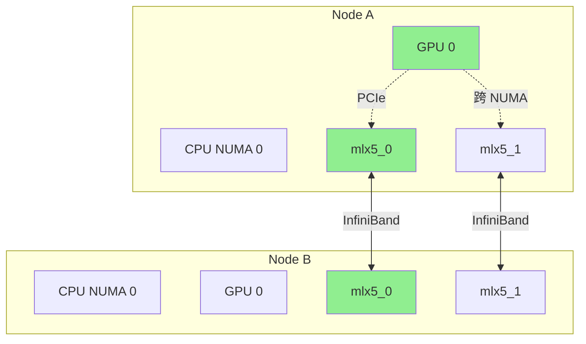
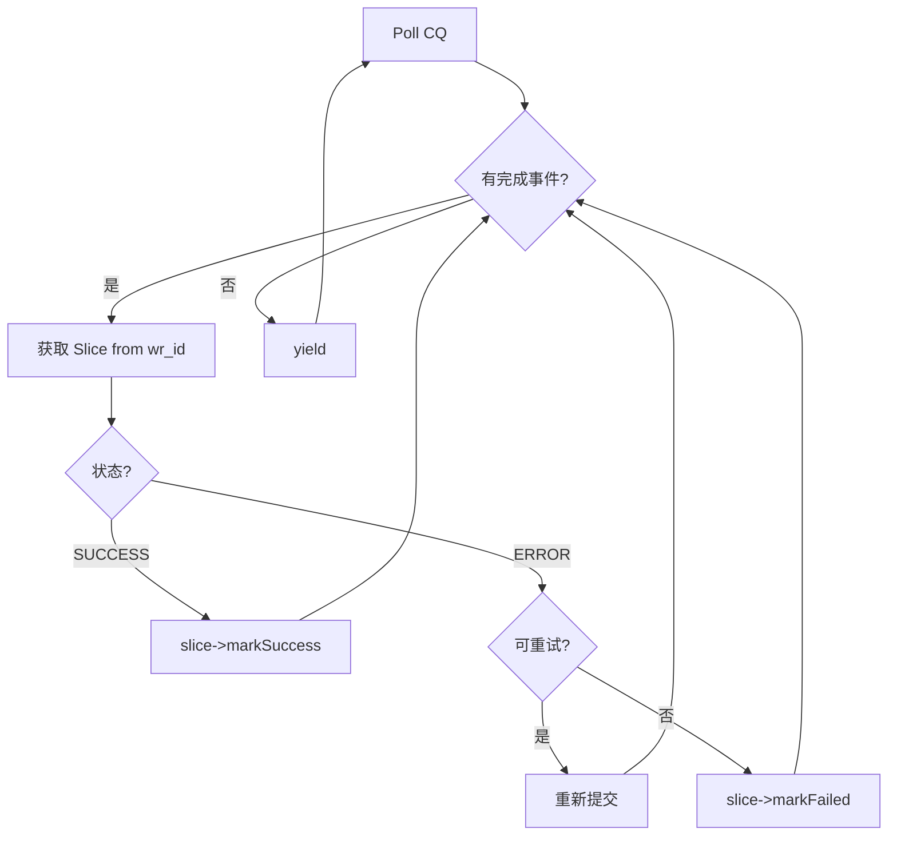

[上一篇](02-rdma-transport.md) | [目录](../README.md) | [下一篇](04-transport-protocols.md)

# 数据传输实现

#### 10.1 传输提交流程

```cpp
Status RdmaTransport::submitTransfer(
    BatchID batch_id, const std::vector<TransferRequest>& entries) {

    auto& batch_desc = toBatchDesc(batch_id);

    for (size_t i = 0; i < entries.size(); i++) {
        auto& task = batch_desc.task_list[i];
        const auto& request = entries[i];

        task.request = &request;
        task.total_bytes = request.length;
        task.batch_id = batch_id;

        // 获取目标 Segment 信息
        auto segment_desc = metadata_->getSegmentDesc(request.target_id);
        if (!segment_desc) {
            return Status::InvalidArgument("Segment not found");
        }

        // 分片：将大传输拆分为多个 Slice
        std::vector<Slice*> slices = createSlices(request, segment_desc);
        task.slice_count = slices.size();
        task.slice_list = std::move(slices);
    }

    // 提交到 RDMA 层
    return submitToRdma(batch_desc);
}
```

#### 10.2 Slice 创建

```cpp
std::vector<Slice*> RdmaTransport::createSlices(
    const TransferRequest& request,
    const std::shared_ptr<SegmentDesc>& segment_desc) {

    std::vector<Slice*> slices;
    size_t offset = 0;
    size_t remaining = request.length;

    while (remaining > 0) {
        // 确定本次 Slice 大小
        size_t slice_size = std::min(remaining, kMaxSliceSize);

        // 从线程本地缓存分配 Slice
        Slice* slice = getSliceCache().allocate();

        slice->source_addr = (char*)request.source + offset;
        slice->length = slice_size;
        slice->opcode = request.opcode;
        slice->target_id = request.target_id;
        slice->status = Slice::PENDING;

        // 选择最优路径
        auto path = selectOptimalPath(request.source, segment_desc);
        slice->peer_nic_path = path.peer_nic_path;
        slice->rdma.dest_addr = request.target_offset + offset;
        slice->rdma.source_lkey = path.source_lkey;
        slice->rdma.dest_rkey = path.dest_rkey;
        slice->rdma.retry_cnt = 0;
        slice->rdma.max_retry_cnt = kDefaultMaxRetry;

        slices.push_back(slice);
        offset += slice_size;
        remaining -= slice_size;
    }

    return slices;
}
```

#### 10.3 拓扑感知路径选择

```cpp
struct TransferPath {
    std::string peer_nic_path;
    uint32_t source_lkey;
    uint32_t dest_rkey;
    int context_index;
};

TransferPath RdmaTransport::selectOptimalPath(
    void* source_addr,
    const std::shared_ptr<SegmentDesc>& segment_desc) {

    TransferPath best_path;
    int min_distance = INT_MAX;

    // 获取源地址的 NUMA 节点
    int source_numa = getNumaNode(source_addr);

    for (size_t i = 0; i < context_list_.size(); ++i) {
        auto& context = context_list_[i];

        // 计算本地 NIC 到源地址的距离
        int local_distance = context->getNumaDistance(source_numa);

        // 遍历远程设备
        for (const auto& device : segment_desc->devices) {
            // 计算到远程 NIC 的网络距离（同交换机、跨交换机等）
            int network_distance = getNetworkDistance(
                context->deviceName(), device.name);

            int total_distance = local_distance + network_distance;

            if (total_distance < min_distance) {
                min_distance = total_distance;
                best_path.peer_nic_path = device.name;
                best_path.source_lkey = context->lkey(source_addr);
                best_path.dest_rkey = device.rkey;
                best_path.context_index = i;
            }
        }
    }

    return best_path;
}
```

路径选择示意图：



#### 10.4 RDMA 操作提交

```cpp
int RdmaEndPoint::submitPostSend(
    std::vector<Slice*>& slice_list,
    std::vector<Slice*>& failed_slice_list) {

    RWSpinlock::ReadGuard guard(lock_);

    if (!connected()) {
        for (auto slice : slice_list) {
            failed_slice_list.push_back(slice);
        }
        return -1;
    }

    int submitted = 0;
    for (auto slice : slice_list) {
        // 选择 QP（负载均衡）
        int qp_index = submitted % qp_list_.size();
        ibv_qp* qp = qp_list_[qp_index];

        // 检查 QP 深度
        if (wr_depth_list_[qp_index] >= max_wr_depth_) {
            failed_slice_list.push_back(slice);
            continue;
        }

        // 构建 Work Request
        ibv_send_wr wr = {};
        ibv_sge sge = {};

        sge.addr = (uint64_t)slice->source_addr;
        sge.length = slice->length;
        sge.lkey = slice->rdma.source_lkey;

        wr.wr_id = (uint64_t)slice;
        wr.next = nullptr;
        wr.sg_list = &sge;
        wr.num_sge = 1;
        wr.opcode = (slice->opcode == TransferRequest::WRITE)
                        ? IBV_WR_RDMA_WRITE
                        : IBV_WR_RDMA_READ;
        wr.send_flags = IBV_SEND_SIGNALED;

        wr.wr.rdma.remote_addr = slice->rdma.dest_addr;
        wr.wr.rdma.rkey = slice->rdma.dest_rkey;

        // 提交
        ibv_send_wr* bad_wr;
        int ret = ibv_post_send(qp, &wr, &bad_wr);

        if (ret == 0) {
            slice->status = Slice::POSTED;
            wr_depth_list_[qp_index]++;
            submitted++;
        } else {
            failed_slice_list.push_back(slice);
        }
    }

    return submitted;
}
```

#### 10.5 Completion Queue 处理

```cpp
void RdmaContext::pollCompletionQueue() {
    ibv_wc wc[kPollBatchSize];

    while (running_) {
        int num_completions = ibv_poll_cq(cq_, kPollBatchSize, wc);

        for (int i = 0; i < num_completions; ++i) {
            Slice* slice = (Slice*)wc[i].wr_id;

            // 递减 QP 深度
            __atomic_fetch_sub(slice->rdma.qp_depth, 1, __ATOMIC_RELAXED);

            if (wc[i].status == IBV_WC_SUCCESS) {
                slice->markSuccess();
            } else {
                LOG(WARNING) << "RDMA completion error: "
                            << ibv_wc_status_str(wc[i].status);

                // 重试逻辑
                if (slice->rdma.retry_cnt < slice->rdma.max_retry_cnt) {
                    slice->rdma.retry_cnt++;
                    slice->status = Slice::PENDING;
                    resubmitSlice(slice);
                } else {
                    slice->markFailed();
                }
            }
        }

        if (num_completions == 0) {
            // 短暂休眠避免忙等
            std::this_thread::yield();
        }
    }
}
```

CQ 轮询流程：



#### 10.6 本章小结

本章深入分析了 Transfer Engine 的传输实现：

1. **层次模型**：Batch -> Task -> Slice 三层结构
2. **Slice 缓存**：线程本地缓存减少分配开销
3. **事件驱动**：高效的批次完成通知机制
4. **并行注册**：多 Context 并行内存注册
5. **拓扑感知**：选择最优 NIC 路径
6. **CQ 处理**：批量轮询与重试机制

这些设计使 Transfer Engine 能够充分利用 RDMA 硬件能力，实现接近线速的数据传输。
