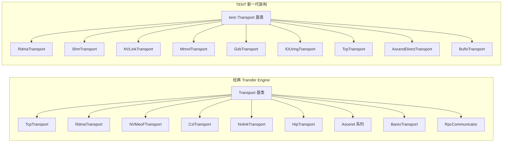
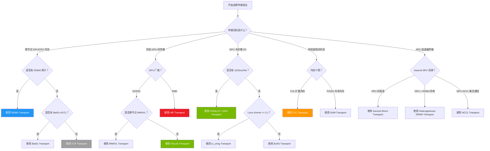
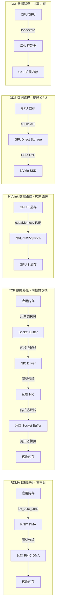
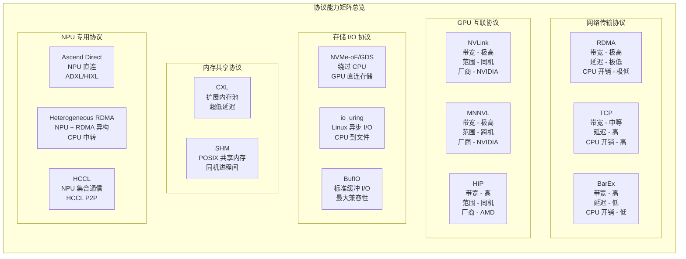

# 传输协议全面对比与深度解析

[上一篇](03-data-transfer-impl.md) | [目录](../README.md) | [下一篇](05-code-debug-traces.md)

---

## 1. 概述

Mooncake Transfer Engine 是一个高度可扩展的数据传输框架，其核心设计理念之一是**传输协议的可插拔性**。系统通过统一的 `Transport` 基类接口，将具体的硬件传输细节抽象化，使得上层应用可以透明地使用不同的物理传输通道。

目前，Mooncake 支持两套传输协议体系：

- **经典 Transfer Engine 协议**：基于 `mooncake::Transport` 基类，包含 TCP、RDMA、NVMe-oF、CXL、NVLink、HIP、Ascend(HCCL/Heterogeneous RDMA/Direct)、BarEx、RPC 等 10+ 种协议实现
- **TENT (Transfer ENgine Two) 协议**：基于 `mooncake::tent::Transport` 基类的新一代架构，包含 RDMA、SHM、NVLink、MNNVL、GDS、io_uring、TCP、Ascend Direct、BufIO 等 9 种协议实现



---

## 2. 经典 Transfer Engine 协议详解

### 2.1 TCP Transport

| 属性 | 说明 |
|------|------|
| **名称标识** | `"tcp"` |
| **适用场景** | 通用网络传输，无 RDMA 硬件环境下的兼容方案 |
| **硬件要求** | 仅需标准 TCP/IP 网络栈 |
| **支持内存类型** | CPU DRAM、GPU 显存（通过中转拷贝） |
| **传输方式** | 基于 ASIO 异步 I/O 的全双工 TCP 连接 |

**核心类与文件**：

| 文件路径 | 说明 |
|---------|------|
| `include/transport/tcp_transport/tcp_transport.h` | 头文件定义 |
| `src/transport/tcp_transport/tcp_transport.cpp` | 实现逻辑 |

**工作原理**：

TCP Transport 采用 ASIO 异步 I/O 框架实现数据传输。每次传输建立独立的 TCP 连接，通过 `Session` 对象管理传输生命周期。传输流程包括：

1. **连接建立**：通过 `asio::ip::tcp::resolver` 解析目标地址，建立 TCP 连接
2. **协议头发送**：发送 `SessionHeader`（包含 size、addr、opcode）
3. **数据分片传输**：以 64KB（`kDefaultBufferSize`）为单位进行分片异步读写
4. **GPU 内存支持**：若源/目标为 GPU 显存，会通过 `cudaMemcpy` 做 CPU 中转

**性能特征**：

- 延迟较高（毫秒级），受 TCP 协议栈开销影响
- 吞吐量受限于 TCP 窗口大小与网络带宽
- 适合作为 fallback 方案或开发调试使用

---

### 2.2 RDMA Transport

| 属性 | 说明 |
|------|------|
| **名称标识** | `"rdma"` |
| **适用场景** | 高性能跨节点数据传输，LLM 推理 KVCache 分布式传输 |
| **硬件要求** | InfiniBand/RoCE 网卡（ibverbs 支持） |
| **支持内存类型** | CPU DRAM、GPU 显存（需 GPUDirect RDMA / nvidia_peermem） |
| **传输方式** | 零拷贝 RDMA READ/WRITE，内核旁路 |

**核心类与文件**：

| 文件路径 | 说明 |
|---------|------|
| `include/transport/rdma_transport/rdma_transport.h` | 主传输类 |
| `include/transport/rdma_transport/rdma_context.h` | RDMA 设备上下文 |
| `include/transport/rdma_transport/rdma_endpoint.h` | QP 连接端点 |
| `include/transport/rdma_transport/endpoint_store.h` | 端点连接池 |
| `include/transport/rdma_transport/worker_pool.h` | CQ 轮询工作线程池 |
| `src/transport/rdma_transport/rdma_transport.cpp` | 核心实现 |

**工作原理**：

RDMA Transport 是 Mooncake 最核心的高性能传输协议。其架构包含多层组件：

1. **RdmaContext**：封装 `ibv_context`，管理 PD、CQ、MR 等 RDMA 资源。一个 Transport 实例可持有多个 Context（多网卡场景）
2. **RdmaEndPoint**：基于 RC（Reliable Connection）模式的 QP 对，支持多 QP per endpoint 配置
3. **EndpointStore**：连接池管理，实现按需建连与连接复用
4. **WorkerPool**：CQ 完成事件轮询线程池，负责异步回收完成的 Slice
5. **Slice 切片机制**：大请求按 `slice_size` 切分为多个 Slice，并行提交到不同 QP

**关键特性**：

- **Relaxed Ordering 支持**：自动检测 `ibv_reg_mr_iova2` 可用性，启用 `IBV_ACCESS_RELAXED_ORDERING` 提升 PCIe 性能
- **并行 MR 注册**：大内存区域可并行注册到多个 RDMA Context
- **拓扑感知选路**：基于 Topology 信息选择最优 RNIC 设备
- **Handshake 机制**：通过 RPC 进行 QP 信息交换

**性能特征**：

- 延迟极低（微秒级），零拷贝
- 吞吐量接近线速（100Gbps+）
- 支持多网卡聚合，线性扩展

---

### 2.3 NVMe-oF Transport

| 属性 | 说明 |
|------|------|
| **名称标识** | `"nvmeof"` |
| **适用场景** | GPU 与远程 NVMe 存储之间的直接数据传输 |
| **硬件要求** | NVIDIA GPU + cuFile/GDS 支持 + NVMe-oF 存储 |
| **支持内存类型** | GPU 显存（通过 cuFile 接口） |
| **传输方式** | GPUDirect Storage，绕过 CPU 直接在 GPU 与 NVMe 之间传输 |

**核心类与文件**：

| 文件路径 | 说明 |
|---------|------|
| `include/transport/nvmeof_transport/nvmeof_transport.h` | 主传输类 |
| `include/transport/nvmeof_transport/cufile_context.h` | cuFile 文件句柄管理 |
| `include/transport/nvmeof_transport/cufile_desc_pool.h` | cuFile 批量描述符池 |
| `src/transport/nvmeof_transport/nvmeof_transport.cpp` | 核心实现 |

**工作原理**：

NVMe-oF Transport 利用 NVIDIA GPUDirect Storage (GDS) 技术，通过 cuFile API 实现 GPU 显存与 NVMe-oF 存储之间的直接数据通路：

1. **cuFile 驱动初始化**：`cuFileDriverOpen()` 启动 GDS 运行时
2. **文件映射**：为每个远程 NVMe-oF 卷创建 `CuFileContext`，管理 `CUfileHandle_t`
3. **批量 I/O**：使用 `CUFileDescPool` 管理 `CUFILE_BATCH` 模式的描述符，支持批量提交
4. **异步状态查询**：通过 `CUfileIOEvents_t` 查询 I/O 完成状态

**性能特征**：

- 绕过 CPU bounce buffer，减少数据拷贝
- 适合大模型 checkpoint 加载/保存场景
- 受 NVMe SSD 带宽限制（单盘约 3-7 GB/s）

---

### 2.4 CXL Transport

| 属性 | 说明 |
|------|------|
| **名称标识** | `"cxl"` |
| **适用场景** | CXL 扩展内存池化，低延迟共享内存访问 |
| **硬件要求** | CXL 设备（如 CXL Type 2/3 内存扩展器），Linux DAX 设备 |
| **支持内存类型** | CXL 扩展内存（通过 DAX 设备 mmap 映射） |
| **传输方式** | 直接 memcpy + 内存屏障 |

**核心类与文件**：

| 文件路径 | 说明 |
|---------|------|
| `include/transport/cxl_transport/cxl_transport.h` | 头文件定义 |
| `src/transport/cxl_transport/cxl_transport.cpp` | 核心实现 |

**工作原理**：

CXL Transport 通过 Linux DAX（Direct Access）设备接口访问 CXL 扩展内存：

1. **设备初始化**：通过 `MC_CXL_DEV_PATH` 环境变量指定 DAX 设备路径（如 `/dev/dax0.0`）
2. **内存映射**：使用 `mmap()` 将 CXL 设备映射到进程地址空间
3. **数据传输**：通过 `std::memcpy` 实现数据拷贝
4. **内存一致性**：CXL 地址范围内的操作后执行 `__sync_synchronize()` 内存屏障
5. **地址验证**：`isAddressInCxlRange()` 检查地址是否在合法 CXL 范围内

**配置环境变量**：

| 环境变量 | 说明 |
|---------|------|
| `MC_CXL_DEV_PATH` | CXL DAX 设备路径 |
| `MC_CXL_DEV_SIZE` | CXL 设备大小（字节），可选，默认从 sysfs 读取 |

**性能特征**：

- 延迟极低（接近本地 DRAM，通常 < 500ns）
- 同步操作，提交即完成
- 带宽受 CXL 总线限制

---

### 2.5 NVLink Transport

| 属性 | 说明 |
|------|------|
| **名称标识** | `"nvlink"` |
| **适用场景** | 同机多 GPU 之间的高速 P2P 数据传输 |
| **硬件要求** | NVIDIA GPU + NVLink/NVSwitch 互联 |
| **支持内存类型** | GPU 显存（CUDA Device Memory） |
| **传输方式** | CUDA IPC / CUDA Fabric Memory + cudaMemcpy |

**核心类与文件**：

| 文件路径 | 说明 |
|---------|------|
| `include/transport/nvlink_transport/nvlink_transport.h` | 头文件定义 |
| `src/transport/nvlink_transport/nvlink_transport.cpp` | 核心实现 |

**工作原理**：

NVLink Transport 支持两种内存共享模式，在初始化时自动检测并选择：

1. **CUDA Fabric Memory 模式（优先）**：
   - 检测 `CU_DEVICE_ATTRIBUTE_HANDLE_TYPE_FABRIC_SUPPORTED` 属性
   - 使用 `cuMemCreate` + `CU_MEM_HANDLE_TYPE_FABRIC` 分配 Pinned 内存
   - 通过 `cuMemExportToShareableHandle` / `cuMemImportFromShareableHandle` 跨进程共享
   - 支持 `cuMemMap` + `cuMemSetAccess` 设置多 GPU 读写权限

2. **CUDA IPC 模式（Fallback）**：
   - 通过 `cudaIpcGetMemHandle` / `cudaIpcOpenMemHandle` 共享 GPU 显存
   - 需要 `cudaDeviceEnablePeerAccess` 开启 P2P 访问

**地址重映射**：`relocateSharedMemoryAddress()` 方法负责将远程 GPU 地址映射到本地进程地址空间。

**性能特征**：

- 极高带宽（NVLink 4.0 单链路 900 GB/s 双向）
- 同步操作，数据拷贝完成即返回
- 仅限同机 GPU 间通信

---

### 2.6 HIP Transport

| 属性 | 说明 |
|------|------|
| **名称标识** | `"hip"` |
| **适用场景** | AMD GPU 之间的 P2P 数据传输 |
| **硬件要求** | AMD GPU + ROCm / HIP 运行时 |
| **支持内存类型** | GPU 显存（HIP Device Memory） |
| **传输方式** | HIP IPC / HIP Fabric Memory + hipMemcpy |

**核心类与文件**：

| 文件路径 | 说明 |
|---------|------|
| `include/transport/hip_transport/hip_transport.h` | 头文件定义 |
| `src/transport/hip_transport/hip_transport.cpp` | 核心实现 |

**工作原理**：

HIP Transport 是 NVLink Transport 的 AMD 对等实现，遵循相同的架构设计：

1. **Fabric Memory 模式**：使用 `hipMemCreate` + `hipMemHandleTypePosixFileDescriptor` 分配可共享内存
2. **IPC 模式**：使用 `hipIpcGetMemHandle` / `hipIpcOpenMemHandle` 跨进程共享

**与 NVLink Transport 的差异**：

- 使用 `pidfd_open` / `pidfd_getfd` 系统调用进行跨进程 FD 传递（HIP Fabric 特有）
- `hipStreamSynchronize` 确保每次拷贝完成（显式同步）
- 自动检测设备上下文并设置 `hipSetDevice`

**性能特征**：

- 带宽取决于 AMD Infinity Fabric 互联
- 同步操作模型
- 支持 AMD MI 系列加速器

---

### 2.7 Ascend Transport 系列

Ascend Transport 包含三个子类型，针对华为 Ascend NPU 的不同传输场景。

#### 2.7.1 HCCL Transport

| 属性 | 说明 |
|------|------|
| **名称标识** | `"hccl"` |
| **适用场景** | Ascend NPU 之间基于 HCCL 集合通信的数据传输 |
| **硬件要求** | 华为 Ascend NPU + HCCL 运行时 |
| **传输方式** | 基于 HCCL P2P 通信接口 |

**核心文件**：
- `include/transport/ascend_transport/hccl_transport/hccl_transport.h`
- `src/transport/ascend_transport/hccl_transport/hccl_transport.cpp`

#### 2.7.2 Heterogeneous RDMA Transport

| 属性 | 说明 |
|------|------|
| **名称标识** | `"ascend"` |
| **适用场景** | Ascend NPU 通过 RDMA 与其他设备进行异构通信 |
| **硬件要求** | 华为 Ascend NPU + RDMA 网卡 + ACL 运行时 |
| **传输方式** | NPU->CPU->RDMA 中转传输，支持聚合/非聚合模式 |

**核心文件**：
- `include/transport/ascend_transport/heterogeneous_rdma_transport.h`
- `src/transport/ascend_transport/heterogeneous_rdma_transport/heterogeneous_rdma_transport.cpp`

**工作原理**：

由于 Ascend NPU 不直接支持 RDMA，此协议通过 CPU 中转实现跨节点传输：

1. **聚合传输模式**：将多个小请求聚合后通过 `aclrtMemcpy` 拷贝到 CPU 中转 buffer，再通过内部 `RdmaTransport` 发送
2. **非聚合传输模式**：每个请求独立进行 NPU->CPU->RDMA 传输
3. **内存管理**：预分配 3GB CPU hugepage buffer + 多个 8MB 设备 buffer 块

#### 2.7.3 Ascend Direct Transport

| 属性 | 说明 |
|------|------|
| **名称标识** | `"ascend_direct"` |
| **适用场景** | Ascend NPU 之间的直接高速传输（跳过 CPU 中转） |
| **硬件要求** | 华为 Ascend NPU + ADXL 引擎支持 |
| **传输方式** | 基于 ADXL (Ascend Direct eXchange Link) 引擎的直接通信 |

**核心文件**：
- `include/transport/ascend_transport/ascend_direct_transport/ascend_direct_transport.h`
- `src/transport/ascend_transport/ascend_direct_transport/ascend_direct_transport.cpp`

**关键特性**：

- 基于 `adxl::AdxlEngine` 实现 NPU 间直接数据交换
- 支持同步/异步两种传输模式
- 内建连接管理和线程池
- 支持 short connection 模式（用后断开）

---

### 2.8 BarEx Transport

| 属性 | 说明 |
|------|------|
| **名称标识** | `"barex"` |
| **适用场景** | 基于 BarEx ACCL 库的高性能加速器互联传输 |
| **硬件要求** | 支持 BarEx/ACCL 的加速器设备及网络 |
| **支持内存类型** | CPU DRAM、GPU 显存 |
| **传输方式** | 基于 ACCL BarEx 的 XChannel 通信 |

**核心类与文件**：

| 文件路径 | 说明 |
|---------|------|
| `include/transport/barex_transport/barex_transport.h` | 主传输类 |
| `include/transport/barex_transport/barex_context.h` | BarEx 上下文与通道缓存 |
| `src/transport/barex_transport/barex_transport.cpp` | 核心实现 |
| `src/transport/barex_transport/barex_context.cpp` | 上下文实现 |

**工作原理**：

BarEx Transport 基于 ACCL (Accelerated Communication Library) 的 BarEx 子系统：

1. **资源管理**：使用 `XContext`、`XThreadpool`、`XSimpleMempool` 等 ACCL 原语
2. **通道建立**：通过 `XConnector` / `XListener` 建立 `XChannel` 连接
3. **通道缓存**：`ChannelCache` 实现基于 SegmentID 的通道复用与健康检查
4. **Handshake 流程**：与 RDMA Transport 类似的连接建立机制

**关键特性**：

- 支持 `OpenChannel` / `CheckStatus` 主动通道管理
- 内置通道健康检查（`RemoveInvalidChannels`）
- 支持 CPU 模式与 GPU 模式切换

---

### 2.9 RPC Communicator

| 属性 | 说明 |
|------|------|
| **名称标识** | N/A（独立通信组件） |
| **适用场景** | 轻量级 RPC 数据/张量传输，Python 友好的高层接口 |
| **硬件要求** | 标准 TCP/IP 网络 |
| **传输方式** | 基于 coro_rpc 的协程 RPC 调用 |

**核心类与文件**：

| 文件路径 | 说明 |
|---------|------|
| `include/transport/rpc_communicator/rpc_communicator.h` | RPC 通信器 |
| `include/transport/rpc_communicator/rpc_interface.h` | Python 绑定接口 |
| `src/transport/rpc_communicator/rpc_communicator.cpp` | 实现 |
| `src/transport/rpc_communicator/rpc_interface.cpp` | 接口实现 |

**工作原理**：

RPC Communicator 是一个独立于 Transport 基类体系的高层通信组件：

1. **协程 RPC 框架**：基于 yalantinglibs (ylt) 的 `coro_rpc` 框架
2. **连接池管理**：使用 `coro_io::client_pools` 管理到各节点的连接
3. **Tensor 传输**：直接支持 PyTorch Tensor 的序列化发送
4. **回调机制**：支持注册数据接收回调（`setDataReceiveCallback`）

**与 Transport 体系的区别**：

RPC Communicator 不继承 `Transport` 基类，适用于控制面通信（如元数据同步、通知消息）而非大规模数据面传输。

---

## 3. TENT 新一代协议详解

TENT (Transfer ENgine Two) 是 Mooncake 的新一代传输引擎架构，采用重新设计的 `tent::Transport` 基类，引入了以下改进：

- **Capabilities 声明**：每个协议声明其能力矩阵（DRAM-DRAM、DRAM-GPU、GPU-GPU、DRAM-File 等）
- **SubBatch 机制**：替代经典的 BatchID/BatchDesc，使用更轻量的 SubBatch 引用
- **Notification 支持**：可选的消息通知机制
- **内存分配接口**：Transport 可提供专属的内存分配/释放方法

### 3.1 TENT RDMA Transport

| 属性 | 说明 |
|------|------|
| **名称标识** | `"rdma"` |
| **命名空间** | `mooncake::tent` |
| **改进要点** | 重新设计的 Slice/Quota 管理、独立 Workers 线程模型 |

**核心文件**：

| 文件路径 | 说明 |
|---------|------|
| `tent/include/tent/transport/rdma/rdma_transport.h` | 主传输类 |
| `tent/include/tent/transport/rdma/context.h` | RDMA 上下文 |
| `tent/include/tent/transport/rdma/endpoint.h` | 端点管理 |
| `tent/include/tent/transport/rdma/slice.h` | Slice 定义 |
| `tent/include/tent/transport/rdma/quota.h` | QP 配额管理 |
| `tent/include/tent/transport/rdma/workers.h` | CQ 轮询 Worker |
| `tent/include/tent/transport/rdma/buffers.h` | 本地 Buffer 管理 |
| `tent/include/tent/transport/rdma/params.h` | RDMA 参数配置 |
| `tent/include/tent/transport/rdma/rail_monitor.h` | 多网卡监控 |

**与经典版本的区别**：

- 引入 `RdmaParams` 统一配置管理
- `SharedQuota` 实现跨 QP 的发送配额共享
- `RailMonitor` 监控多网卡链路状态
- `LocalBufferManager` 管理本地注册内存

### 3.2 TENT SHM Transport

| 属性 | 说明 |
|------|------|
| **名称标识** | `"shm"` |
| **命名空间** | `mooncake::tent` |
| **适用场景** | 同机进程间共享内存传输 |
| **支持内存类型** | CPU DRAM（POSIX 共享内存 / CXL 挂载路径） |

**核心文件**：`tent/include/tent/transport/shm/shm_transport.h`

**关键特性**：

- 支持 POSIX 共享内存（`/dev/shm`）和 CXL 挂载路径
- `createSharedMemory` 创建可跨进程共享的内存段
- `relocateSharedMemoryAddress` 实现远程地址到本地的映射
- 支持 `allocateLocalMemory` / `freeLocalMemory` 专属内存管理

### 3.3 TENT NVLink Transport

| 属性 | 说明 |
|------|------|
| **名称标识** | `"nvlink"` |
| **命名空间** | `mooncake::tent` |
| **适用场景** | 同机 GPU 间 P2P 传输（CUDA IPC） |

**核心文件**：`tent/include/tent/transport/nvlink/nvlink_transport.h`

**关键特性**：

- 支持异步 memcpy 阈值配置（`async_memcpy_threshold_`）
- Host 内存注册选项（`host_register_`）
- 基于 CUDA Stream 的异步传输

### 3.4 TENT MNNVL Transport

| 属性 | 说明 |
|------|------|
| **名称标识** | `"mnnvl"` |
| **命名空间** | `mooncake::tent` |
| **适用场景** | 跨节点 Multi-Node NVLink (MNNVL) GPU 直传 |
| **硬件要求** | NVIDIA Grace Hopper / Blackwell + NVLink Switch + CUDA Fabric Memory |

**核心文件**：`tent/include/tent/transport/mnnvl/mnnvl_transport.h`

**关键特性**：

- 支持 `CU_MEM_HANDLE_TYPE_FABRIC` 跨节点 GPU 内存共享
- 自动检测 MNNVL 支持能力（`supported_`）
- 可动态选择 handle 类型（`handle_type_`）
- 支持 `allocateLocalMemory` / `freeLocalMemory` 专属 GPU 内存管理

### 3.5 TENT GDS Transport

| 属性 | 说明 |
|------|------|
| **名称标识** | `"gds"` |
| **命名空间** | `mooncake::tent` |
| **适用场景** | GPU 与本地/远程存储间的高速 I/O |
| **硬件要求** | NVIDIA GPU + cuFile/GDS 支持 |

**核心文件**：`tent/include/tent/transport/gds/gds_transport.h`

**关键特性**：

- 使用 `CUfileBatchHandle_t` 实现批量 I/O
- `GdsFileContext` 管理文件句柄的生命周期
- 可配置 I/O 批量深度（`io_batch_depth_`）

### 3.6 TENT io_uring Transport

| 属性 | 说明 |
|------|------|
| **名称标识** | `"io-uring"` |
| **命名空间** | `mooncake::tent` |
| **适用场景** | Linux 原生异步文件 I/O，CPU 到本地文件系统的传输 |
| **硬件要求** | Linux Kernel 5.1+（io_uring 支持） |

**核心文件**：`tent/include/tent/transport/io_uring/io_uring_transport.h`

**关键特性**：

- 基于 `liburing` 的 Linux 原生异步 I/O
- `probeCapabilities()` 运行时探测内核支持的 io_uring 操作
- 每个 SubBatch 独立持有一个 `io_uring` 实例
- 支持 `async_memcpy_threshold_` 配置

### 3.7 TENT TCP Transport

| 属性 | 说明 |
|------|------|
| **名称标识** | `"tcp"` |
| **命名空间** | `mooncake::tent` |
| **适用场景** | 无 RDMA 环境下的跨节点通信 + 通知消息 |

**核心文件**：`tent/include/tent/transport/tcp/tcp_transport.h`

**独特能力**：

- **支持 Notification 机制**：`supportNotification()` 返回 `true`
- 提供 `sendNotification` / `receiveNotification` 接口
- 适合作为控制面通信通道

### 3.8 TENT Ascend Direct Transport

| 属性 | 说明 |
|------|------|
| **名称标识** | `"ascend_direct"` |
| **命名空间** | `mooncake::tent` |
| **适用场景** | Ascend NPU 间基于 HIXL 的直接传输 |
| **硬件要求** | 华为 Ascend NPU + HIXL 库 |

**核心文件**：`tent/include/tent/transport/ascend/ascend_direct_transport.h`

**与经典版本的区别**：

- 使用 `hixl::Hixl` 替代经典版的 `adxl::AdxlEngine`
- 内建 Worker Thread 异步处理传输请求
- 简化的连接管理模型

### 3.9 TENT BufIO Transport

| 属性 | 说明 |
|------|------|
| **名称标识** | `"buf-io"` |
| **命名空间** | `mooncake::tent` |
| **适用场景** | 基于标准缓冲 I/O 的文件传输，兼容性最佳 |
| **硬件要求** | 无特殊要求 |

**核心文件**：`tent/include/tent/transport/bufio/bufio_transport.h`

**关键特性**：

- 最简化的文件 I/O 传输实现
- 基于标准 C/C++ 文件 I/O（不依赖 io_uring 或 cuFile）
- 适合在不支持高级 I/O 的环境中作为 fallback

---

## 4. 协议选择决策树

根据部署环境和需求，下图展示了协议选择的推荐流程：



---

## 5. 数据路径对比

不同传输协议的数据路径差异显著，直接影响延迟和吞吐量。



---

## 6. 协议能力矩阵

下表综合对比各协议在不同维度的能力：



### 详细对比表

| 协议 | 传输范围 | 带宽级别 | 延迟级别 | CPU 开销 | 零拷贝 | 异步 | GPU 直传 |
|------|---------|---------|---------|---------|-------|------|---------|
| **RDMA** | 跨节点 | 100+ Gbps | 微秒级 | 极低 | 是 | 是 | 是 (GPUDirect) |
| **TCP** | 跨节点 | 10-25 Gbps | 毫秒级 | 高 | 否 | 是 | 否 (CPU 中转) |
| **NVLink** | 同机 GPU | 900 GB/s | 亚微秒 | 低 | 是 | 同步 | 是 |
| **MNNVL** | 跨节点 GPU | 900 GB/s | 微秒级 | 低 | 是 | 是 | 是 |
| **HIP** | 同机 GPU | Infinity Fabric | 亚微秒 | 低 | 是 | 同步 | 是 |
| **NVMe-oF/GDS** | GPU-存储 | 3-28 GB/s | 微秒级 | 极低 | 是 | 是 | 是 |
| **io_uring** | CPU-文件 | SSD 带宽 | 微秒级 | 低 | 否 | 是 | 否 |
| **BufIO** | CPU-文件 | SSD 带宽 | 百微秒 | 中 | 否 | 同步 | 否 |
| **CXL** | 同机内存 | DDR 带宽 | < 500ns | 极低 | 是 | 同步 | 否 |
| **SHM** | 同机进程 | memcpy | 纳秒级 | 低 | 是 | 同步 | 否 |
| **BarEx** | 跨节点 | 高 | 低 | 低 | 是 | 是 | 是 |
| **Ascend Direct** | NPU 间 | ADXL/HIXL | 微秒级 | 低 | 是 | 是 | 是 |
| **Heterogeneous RDMA** | NPU-跨节点 | RDMA | 毫秒级 | 高 | 否 | 是 | 否 (CPU 中转) |
| **HCCL** | NPU 间 | HCCL P2P | 微秒级 | 低 | 是 | 是 | 是 |

---

## 7. 经典 vs TENT 协议架构对比

| 维度 | 经典 Transfer Engine | TENT |
|------|---------------------|------|
| **基类** | `mooncake::Transport` | `mooncake::tent::Transport` |
| **批量管理** | `BatchID` / `BatchDesc`（全局 map） | `SubBatch`（轻量指针引用） |
| **Slice 管理** | `ThreadLocalSliceCache` 线程本地缓存 | 协议内部管理 |
| **能力声明** | 无（隐式） | `Capabilities` 结构体（显式声明） |
| **通知机制** | 无 | 可选 `sendNotification` / `receiveNotification` |
| **内存分配** | TransferEngine 层统一管理 | Transport 可提供专属分配器 |
| **完成通知** | 轮询 + 可选事件驱动 | 轮询为主 |
| **配置管理** | 全局 `globalConfig()` | 可注入 `Config` 对象 |

---

## 8. 最佳实践与选型指南

### 8.1 LLM 推理 KVCache 分发场景

**推荐配置**：RDMA (跨节点) + NVLink/MNNVL (同机/跨机 GPU)

- 使用 RDMA 进行 Prefill -> Decode 节点间的 KVCache 传输
- 同机多 GPU 使用 NVLink 实现低延迟共享
- 存储层使用 NVMe-oF/GDS 实现 checkpoint 快速加载

### 8.2 异构加速器集群

**推荐配置**：Ascend Direct (NPU 直连) + Heterogeneous RDMA (NPU-GPU 异构)

- NPU 间优先使用 Ascend Direct Transport
- NPU 与 RDMA 网卡的异构场景使用 Heterogeneous RDMA
- 开发调试阶段可用 TCP 作为 fallback

### 8.3 存储分级系统

**推荐配置**：GDS/NVMe-oF (GPU-SSD) + io_uring (CPU-SSD) + SHM/CXL (内存层)

- 热数据使用 CXL/SHM 共享内存
- 温数据使用 GDS 直接 GPU-SSD 传输
- 冷数据使用 io_uring 或 BufIO 异步文件 I/O

### 8.4 无特殊硬件的通用部署

**推荐配置**：TCP + SHM + BufIO

- 跨节点使用 TCP Transport
- 同机共享使用 SHM Transport
- 文件 I/O 使用 BufIO（兼容性最佳）

---

## 9. 源码目录索引

### 经典 Transfer Engine 协议

```
mooncake-transfer-engine/
  include/transport/
    transport.h                               # Transport 基类
    tcp_transport/tcp_transport.h             # TCP 传输
    rdma_transport/
      rdma_transport.h                        # RDMA 主类
      rdma_context.h                          # RDMA 设备上下文
      rdma_endpoint.h                         # QP 端点
      endpoint_store.h                        # 端点连接池
      worker_pool.h                           # CQ 轮询线程池
    nvmeof_transport/
      nvmeof_transport.h                      # NVMe-oF 传输
      cufile_context.h                        # cuFile 文件句柄
      cufile_desc_pool.h                      # 批量描述符池
    cxl_transport/cxl_transport.h             # CXL 传输
    nvlink_transport/nvlink_transport.h       # NVLink 传输
    hip_transport/hip_transport.h             # HIP (AMD) 传输
    ascend_transport/
      hccl_transport/hccl_transport.h         # HCCL 传输
      heterogeneous_rdma_transport.h          # 异构 RDMA 传输
      ascend_direct_transport/
        ascend_direct_transport.h             # Ascend 直连传输
    barex_transport/
      barex_transport.h                       # BarEx 传输
      barex_context.h                         # BarEx 上下文
    rpc_communicator/
      rpc_communicator.h                      # RPC 通信器
      rpc_interface.h                         # Python 绑定接口
```

### TENT 新一代协议

```
mooncake-transfer-engine/tent/
  include/tent/
    runtime/transport.h                       # tent::Transport 基类
    transport/
      rdma/
        rdma_transport.h                      # RDMA 传输
        context.h / endpoint.h / slice.h      # RDMA 子组件
        quota.h / shared_quota.h              # 配额管理
        workers.h / buffers.h                 # Worker 与 Buffer
      shm/shm_transport.h                    # SHM 共享内存传输
      nvlink/nvlink_transport.h              # NVLink GPU P2P
      mnnvl/mnnvl_transport.h               # MNNVL 跨节点 GPU
      gds/gds_transport.h                    # GDS 存储传输
      io_uring/io_uring_transport.h          # io_uring 异步 I/O
      tcp/tcp_transport.h                    # TCP 网络传输
      ascend/ascend_direct_transport.h       # Ascend NPU 直连
      bufio/bufio_transport.h               # 标准缓冲 I/O
```

---

[上一篇](03-data-transfer-impl.md) | [目录](../README.md) | [下一篇](05-code-debug-traces.md)
