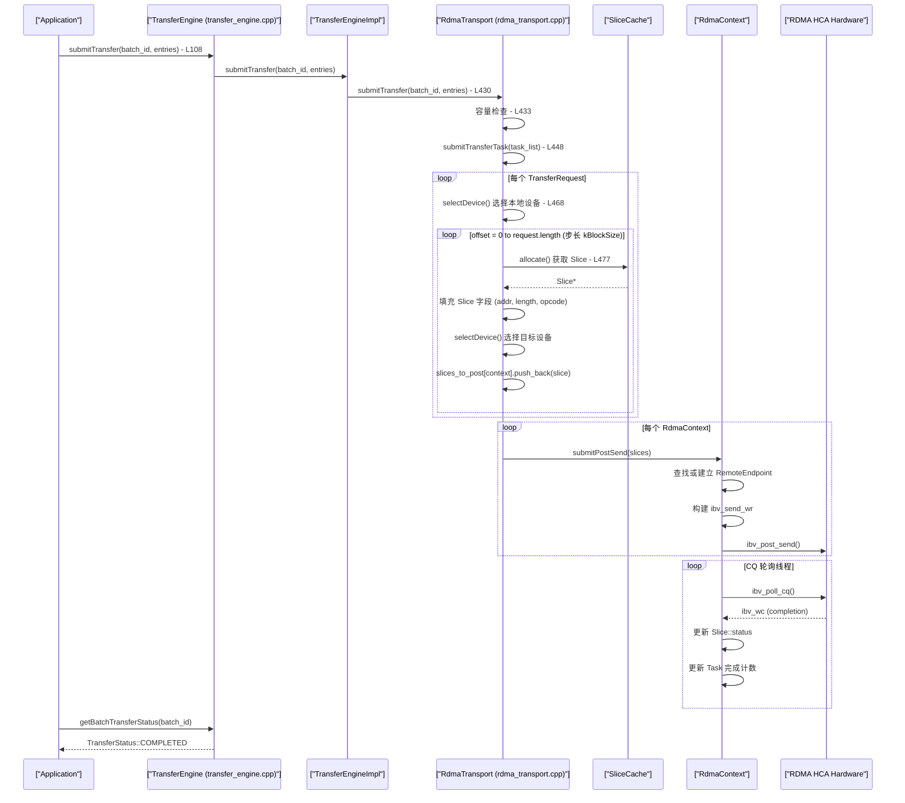
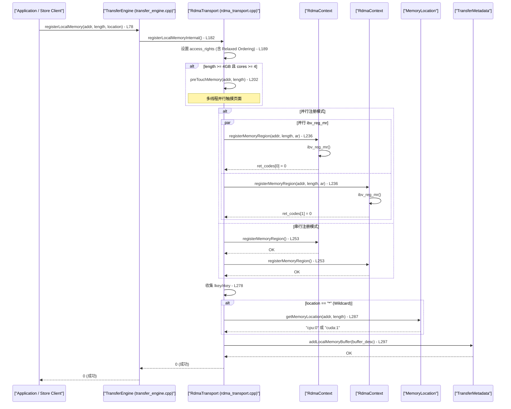
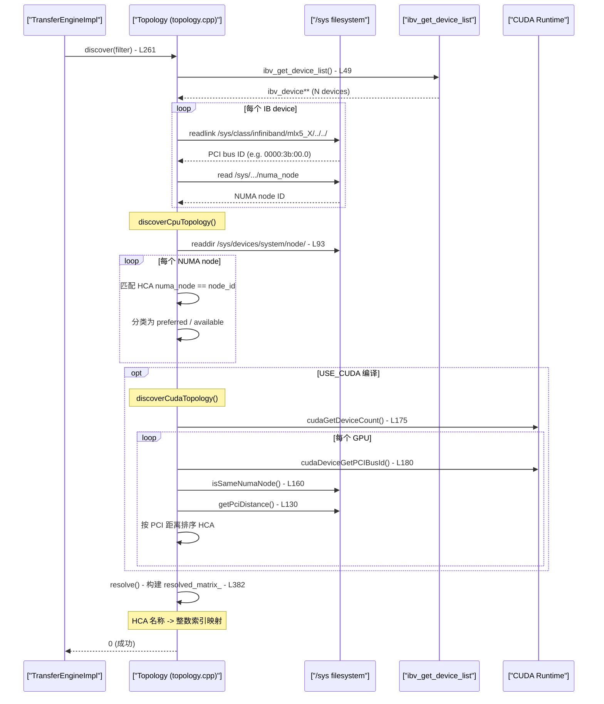

# Transfer Engine 代码调试追踪

本文档提供 Mooncake Transfer Engine (TE) 核心操作的端到端代码调试追踪,涵盖 RDMA Write 完整链路、内存注册流程和拓扑发现机制。每个追踪包含文件/行号引用、GDB 断点、日志配置和 Mermaid 序列图。

---

## 目录

- [调试环境准备](#调试环境准备)
- [Debug Trace 1 - RDMA Write 端到端追踪](#debug-trace-1---rdma-write-端到端追踪)
- [Debug Trace 2 - 内存注册流程](#debug-trace-2---内存注册流程)
- [Debug Trace 3 - 拓扑发现机制](#debug-trace-3---拓扑发现机制)

---

## 调试环境准备

### 编译配置

```bash
# Debug 模式编译,启用 RDMA
cmake -DCMAKE_BUILD_TYPE=Debug -DWITH_RDMA=ON -B build
cmake --build build -j$(nproc)
```

### glog 日志配置

```bash
# 全局 VLOG 级别
export GLOG_v=1
export GLOG_logtostderr=1

# 模块级别精细控制
export GLOG_vmodule="rdma_transport=2,transfer_engine_impl=2,topology=2"
```

### Transfer Engine 特有环境变量

| 环境变量 | 用途 | 默认值 |
|---------|------|--------|
| `MC_GID_INDEX` | RDMA GID 索引 | `0` |
| `MC_IB_PCI_RELAXED_ORDERING` | PCI Relaxed Ordering 模式 | `2` (auto) |
| `MC_ENABLE_PARALLEL_REG_MR` | 并行内存注册 | `-1` (auto) |
| `MC_SLICE_SIZE` | RDMA 传输分片大小 | `65536` |
| `MC_NUM_QP_PER_EP` | 每个 Endpoint 的 QP 数量 | `1` |
| `MC_MAX_WR` | 每个 QP 最大 WR 数量 | 取决于硬件 |
| `MC_RETRY_CNT` | 传输重试次数 | `3` |
| `MC_PATH_ROUNDROBIN` | 是否启用路径轮询 | `false` |
| `MC_TRACE` | 启用详细追踪日志 | `0` |

---

## Debug Trace 1 - RDMA Write 端到端追踪

### 概述

RDMA Write 的完整路径: `TransferEngine::submitTransfer` -> `TransferEngineImpl::submitTransfer` -> `RdmaTransport::submitTransfer` -> 将请求分割为 Slice -> 按设备分组 -> `ibv_post_send` -> CQ 轮询完成。

### 调用链路详解

#### 步骤 1 - TransferEngine::submitTransfer 入口

**文件**: `mooncake-transfer-engine/src/transfer_engine.cpp:108-111`

```cpp
Status TransferEngine::submitTransfer(
    BatchID batch_id, const std::vector<TransferRequest>& entries) {
    return impl_->submitTransfer(batch_id, entries);
}
```

`TransferEngine` 是一个 Pimpl 包装层,所有调用转发到 `TransferEngineImpl`。在 TENT 模式下 (`USE_TENT` 编译宏),请求会被转换为 `mooncake::tent::Request` 格式 (参见 `transfer_engine.cpp:403-424`)。

**GDB 断点**:
```gdb
b transfer_engine.cpp:109
# 查看 batch 信息
p batch_id
p entries.size()
p entries[0].opcode
p entries[0].length
```

#### 步骤 2 - RdmaTransport::submitTransfer 任务分解

**文件**: `mooncake-transfer-engine/src/transport/rdma_transport/rdma_transport.cpp:430-446`

```cpp
Status RdmaTransport::submitTransfer(
    BatchID batch_id, const std::vector<TransferRequest>& entries) {
    auto& batch_desc = *((BatchDesc*)(batch_id));

    // 容量检查
    if (batch_desc.task_list.size() + entries.size() > batch_desc.batch_size) {
        return Status::InvalidArgument("Exceed capacity");
    }

    size_t task_id = batch_desc.task_list.size();
    batch_desc.task_list.resize(task_id + entries.size());
    std::vector<TransferTask*> task_list;
    for (auto& task : batch_desc.task_list)
        task_list.push_back(&task);
    return submitTransferTask(task_list);
}
```

**GDB 断点**:
```gdb
b rdma_transport.cpp:431
p batch_desc.batch_size
p batch_desc.task_list.size()
```

#### 步骤 3 - submitTransferTask Slice 分割与设备选择

**文件**: `mooncake-transfer-engine/src/transport/rdma_transport/rdma_transport.cpp:448-500+`

```cpp
Status RdmaTransport::submitTransferTask(
    const std::vector<TransferTask*>& task_list) {
    const size_t kBlockSize = globalConfig().slice_size;    // 默认 64KB
    const int kMaxRetryCount = globalConfig().retry_cnt;
    const size_t kFragmentSize = globalConfig().fragment_limit;

    for (size_t index = 0; index < task_list.size(); ++index) {
        auto& task = *task_list[index];
        auto& request = *task.request;

        // 为本地源地址选择设备
        auto request_buffer_id = -1, request_device_id = -1;
        selectDevice(local_segment_desc.get(), (uint64_t)request.source,
                     request.length, request_buffer_id, request_device_id);

        // 将大请求分割为固定大小的 Slice
        for (uint64_t offset = 0; offset < request.length; offset += kBlockSize) {
            Slice* slice = getSliceCache().allocate();

            // 最后一个 slice 可能合并尾部碎片
            bool merge_final_slice =
                request.length - offset <= kBlockSize + kFragmentSize;

            slice->source_addr = (char*)request.source + offset;
            slice->length = merge_final_slice ?
                request.length - offset : kBlockSize;
            slice->opcode = request.opcode;
            slice->rdma.dest_addr = request.target_offset + offset;
            slice->rdma.retry_cnt = request.advise_retry_cnt;
            slice->rdma.max_retry_cnt = kMaxRetryCount;
            slice->task = &task;
            slice->target_id = request.target_id;
            slice->status = Slice::PENDING;

            task.slice_list.push_back(slice);

            // 为目标地址选择 RDMA 设备
            // ...selectDevice for target...
            // 按 context 分组: slices_to_post[context].push_back(slice)
        }
    }

    // 批量提交到各 RdmaContext
    for (auto& [context, slices] : slices_to_post) {
        context->submitPostSend(slices);
    }
}
```

**关键概念 - Slice 分割**:
- 每个 `TransferRequest` 被分割为多个 `Slice`,每个 Slice 大小为 `kBlockSize` (默认 64KB)
- 最后一个 Slice 可以合并尾部碎片 (当剩余部分 < kBlockSize + kFragmentSize 时)
- Slice 从 `SliceCache` 分配以避免频繁内存分配

**GDB 断点**:
```gdb
# Slice 创建
b rdma_transport.cpp:477
p slice->length
p slice->opcode
p offset
p request.length

# 设备选择
b rdma_transport.cpp:468
p request_buffer_id
p request_device_id
```

#### 步骤 4 - RdmaContext::submitPostSend 发送 RDMA 请求

每个 `RdmaContext` 对应一个 RDMA 设备 (HCA)。`submitPostSend` 为每个 Slice 构建 Work Request 并调用 `ibv_post_send`。

**关键流程**:
1. 为 Slice 查找远端 Endpoint (如果需要,建立 QP 连接)
2. 构建 `ibv_send_wr` (包含 remote addr, rkey, local addr, lkey)
3. 调用 `ibv_post_send` 提交到硬件队列
4. 当提交数量达到 `kSubmitWatermark` 时,先轮询 CQ 以避免 SQ 溢出

#### 步骤 5 - CQ 轮询与完成通知

RdmaContext 使用独立的轮询线程持续调用 `ibv_poll_cq` 检查完成状态:

1. CQ 返回 `IBV_WC_SUCCESS` -> Slice 状态设为 `COMPLETE`
2. CQ 返回错误 -> 根据 `retry_cnt` 决定是否重试
3. 所有 Slice 完成 -> Task 完成,通知上层 `getBatchTransferStatus`

**GDB 断点 - 完成路径**:
```gdb
# 在 TransferEngine 层检查状态
b transfer_engine.cpp:139
# getBatchTransferStatus
```

### RDMA Write 序列图



---

## Debug Trace 2 - 内存注册流程

### 概述

内存注册是 RDMA 操作的前提: 必须先将本地内存区域注册到 RDMA 硬件,获取 `lkey/rkey` 后才能进行远程读写。完整路径: `TransferEngine::registerLocalMemory` -> `RdmaTransport::registerLocalMemory` -> 为每个 RdmaContext 调用 `ibv_reg_mr` -> 收集 lkey/rkey -> 更新元数据。

### 调用链路详解

#### 步骤 1 - TransferEngine::registerLocalMemory 入口

**文件**: `mooncake-transfer-engine/src/transfer_engine.cpp:78-84`

```cpp
int TransferEngine::registerLocalMemory(void* addr, size_t length,
                                        const std::string& location,
                                        bool remote_accessible,
                                        bool update_metadata) {
    return impl_->registerLocalMemory(addr, length, location, remote_accessible,
                                      update_metadata);
}
```

在 TENT 模式下,会转换为 `tent::MemoryOptions` 并调用 `impl_tent_->registerLocalMemory` (参见 `transfer_engine.cpp:330-343`)。

#### 步骤 2 - RdmaTransport::registerLocalMemoryInternal

**文件**: `mooncake-transfer-engine/src/transport/rdma_transport/rdma_transport.cpp:182-300`

```cpp
int RdmaTransport::registerLocalMemoryInternal(void* addr, size_t length,
                                               const std::string& name,
                                               bool remote_accessible,
                                               bool update_metadata,
                                               bool force_sequential) {
    BufferDesc buffer_desc;
    const int kBaseAccessRights = IBV_ACCESS_LOCAL_WRITE |
                                  IBV_ACCESS_REMOTE_WRITE |
                                  IBV_ACCESS_REMOTE_READ;
    static int access_rights = kBaseAccessRights;
    if (MCIbRelaxedOrderingEnabled) {
        access_rights |= IBV_ACCESS_RELAXED_ORDERING;
    }
```

**访问权限标志**:
- `IBV_ACCESS_LOCAL_WRITE`: 本地写权限
- `IBV_ACCESS_REMOTE_WRITE`: 远程写权限
- `IBV_ACCESS_REMOTE_READ`: 远程读权限
- `IBV_ACCESS_RELAXED_ORDERING`: PCI Relaxed Ordering (提升性能,需要硬件支持)

Relaxed Ordering 在 `RdmaTransport` 构造函数 (`rdma_transport.cpp:60-80`) 中检测:
```cpp
MCIbRelaxedOrderingEnabled = has_ibv_reg_mr_iova2();
```

#### 步骤 3 - 大内存预触摸 (Pre-touch)

**文件**: `mooncake-transfer-engine/src/transport/rdma_transport/rdma_transport.cpp:197-206`

```cpp
// 当内存 >= 4GB 且 CPU 核心数 >= 4 时执行并行预触摸
bool do_pre_touch = context_list_.size() > 0 &&
                    std::thread::hardware_concurrency() >= 4 &&
                    length >= (size_t)4 * 1024 * 1024 * 1024;
if (do_pre_touch) {
    int ret = preTouchMemory(addr, length);
    // ...
}
```

`preTouchMemory` (`rdma_transport.cpp:132-172`) 将内存分块,使用多线程并行触摸页面,确保物理页已分配。这可以显著加速后续的 `ibv_reg_mr` 调用。

#### 步骤 4 - 并行/串行 MR 注册

**文件**: `mooncake-transfer-engine/src/transport/rdma_transport/rdma_transport.cpp:217-261`

```cpp
// 并行注册判断
int use_parallel_reg = 0;
if (!force_sequential) {
    use_parallel_reg = globalConfig().parallel_reg_mr;
    if (use_parallel_reg == -1) {
        // 自动模式: 多 context 且已 pre-touch 时并行
        use_parallel_reg = context_list_.size() > 1 && do_pre_touch;
    }
}

if (use_parallel_reg) {
    // 为每个 RdmaContext 启动独立线程
    std::vector<std::thread> reg_threads;
    for (size_t i = 0; i < context_list_.size(); ++i) {
        reg_threads.emplace_back([this, &ret_codes, i, addr, length, ar]() {
            ret_codes[i] = context_list_[i]->registerMemoryRegion(addr, length, ar);
        });
    }
    // 等待所有线程完成
} else {
    // 串行注册
    for (size_t i = 0; i < context_list_.size(); ++i) {
        int ret = context_list_[i]->registerMemoryRegion(addr, length, access_rights);
    }
}
```

`RdmaContext::registerMemoryRegion` 内部调用 `ibv_reg_mr` 创建 Memory Region。

**GDB 断点**:
```gdb
# 查看注册参数
b rdma_transport.cpp:225
p addr
p length
p access_rights
p context_list_.size()
p use_parallel_reg

# 注册耗时
b rdma_transport.cpp:269
p reg_duration_ms
```

**详细追踪日志** (需设置 `MC_TRACE=1`):
```
LOG(INFO): registerMemoryRegion: addr=0x..., length=..., contexts=4, parallel=true, duration=523ms
```

#### 步骤 5 - 收集 lkey/rkey 并更新元数据

**文件**: `mooncake-transfer-engine/src/transport/rdma_transport/rdma_transport.cpp:278-298`

```cpp
// 收集所有 context 的 lkey/rkey
for (auto& context : context_list_) {
    buffer_desc.lkey.push_back(context->lkey(addr));
    buffer_desc.rkey.push_back(context->rkey(addr));
}

// 自动检测内存位置 (CPU NUMA 节点或 GPU 设备)
if (name == kWildcardLocation) {
    bool only_first_page = true;
    const std::vector<MemoryLocationEntry> entries =
        getMemoryLocation(addr, length, only_first_page);
    buffer_desc.name = entries[0].location;  // 如 "cpu:0" 或 "cuda:1"
} else {
    buffer_desc.name = name;
}

buffer_desc.addr = (uint64_t)addr;
buffer_desc.length = length;
// 注册到元数据服务
int rc = metadata_->addLocalMemoryBuffer(buffer_desc, update_metadata);
```

### 内存注册序列图



---

## Debug Trace 3 - 拓扑发现机制

### 概述

拓扑发现用于建立内存位置 (CPU NUMA 节点 / GPU 设备) 与 RDMA 网卡 (HCA) 之间的亲和关系。这对于选择最优传输路径至关重要: 优先使用与源/目标内存位于同一 NUMA 节点或 PCI 交换机下的 HCA,可以显著降低延迟。

### 调用链路详解

#### 步骤 1 - Topology::discover 入口

**文件**: `mooncake-transfer-engine/src/topology.cpp:261-273`

```cpp
int Topology::discover(const std::vector<std::string>& filter) {
    matrix_.clear();

    // 1. 列举所有 InfiniBand 设备
    auto all_hca = listInfiniBandDevices(filter);

    // 2. CPU 拓扑发现
    for (auto& ent : discoverCpuTopology(all_hca)) {
        matrix_[ent.name] = ent;
    }

    // 3. GPU 拓扑发现 (如果编译了 CUDA/MUSA/HIP)
#if defined(USE_CUDA) || defined(USE_MUSA) || defined(USE_HIP)
    for (auto& ent : discoverCudaTopology(all_hca)) {
        matrix_[ent.name] = ent;
    }
#endif

    // 4. 解析为索引化的 resolved_matrix_
    return resolve();
}
```

`discover` 被调用的位置有两个:
1. **自动发现模式**: `TransferEngineImpl::installTransport` 内部自动调用
2. **手动指定设备**: `Client::InitTransferEngine` (`client_service.cpp:299-305`) 中显式调用

**GDB 断点**:
```gdb
b topology.cpp:261
p filter.size()
# 查看发现的所有 HCA
b topology.cpp:272
p matrix_.size()
```

#### 步骤 2 - listInfiniBandDevices 枚举 RDMA 设备

**文件**: `mooncake-transfer-engine/src/topology.cpp:44-89`

```cpp
static std::vector<InfinibandDevice> listInfiniBandDevices(
    const std::vector<std::string>& filter) {
    int num_devices = 0;
    struct ibv_device** device_list = ibv_get_device_list(&num_devices);
    // ...

    for (int i = 0; i < num_devices; ++i) {
        std::string device_name = ibv_get_device_name(device_list[i]);

        // 如果提供了 filter,只保留指定设备
        if (!filter.empty() && std::find(...) == filter.end())
            continue;

        // 通过 sysfs 解析 PCI 总线地址
        // /sys/class/infiniband/mlx5_X -> /sys/devices/pciXXXX:XX/...
        snprintf(path, sizeof(path), "/sys/class/infiniband/%s/../..",
                 device_name.c_str());
        realpath(path, resolved_path);
        std::string pci_bus_id = basename(resolved_path);

        // 读取 NUMA 节点号
        snprintf(path, sizeof(path), "%s/numa_node", resolved_path);
        std::ifstream(path) >> numa_node;

        devices.push_back(InfinibandDevice{
            .name = device_name,
            .pci_bus_id = pci_bus_id,
            .numa_node = numa_node
        });
    }
}
```

**关键路径**: `/sys/class/infiniband/<device_name>` -> sysfs 符号链接 -> PCI 设备路径 -> 提取 PCI Bus ID 和 NUMA 节点。

**GDB 断点**:
```gdb
b topology.cpp:61
p device_name
p pci_bus_id
p numa_node
```

#### 步骤 3 - discoverCpuTopology CPU NUMA 亲和性

**文件**: `mooncake-transfer-engine/src/topology.cpp:91-126`

```cpp
static std::vector<TopologyEntry> discoverCpuTopology(
    const std::vector<InfinibandDevice>& all_hca) {
    DIR* dir = opendir("/sys/devices/system/node");
    // 遍历 /sys/devices/system/node/nodeN

    while ((entry = readdir(dir))) {
        int node_id = atoi(entry->d_name + strlen("node"));

        // HCA 与 CPU NUMA 节点同节点 -> preferred
        // HCA 与 CPU NUMA 节点不同节点 -> available
        for (const auto& hca : all_hca) {
            if (hca.numa_node == node_id) {
                preferred_hca.push_back(hca.name);
            } else {
                avail_hca.push_back(hca.name);
            }
        }

        topology.push_back(TopologyEntry{
            .name = "cpu:" + std::to_string(node_id),
            .preferred_hca = preferred_hca,
            .avail_hca = avail_hca
        });
    }
}
```

**拓扑条目命名规则**: `"cpu:0"`, `"cpu:1"` 等,其中数字对应 NUMA 节点 ID。

#### 步骤 4 - discoverCudaTopology GPU PCI 亲和性

**文件**: `mooncake-transfer-engine/src/topology.cpp:171-231`

```cpp
static std::vector<TopologyEntry> discoverCudaTopology(
    const std::vector<InfinibandDevice>& all_hca) {
    int device_count;
    cudaGetDeviceCount(&device_count);

    for (int i = 0; i < device_count; i++) {
        char pci_bus_id[20];
        cudaDeviceGetPCIBusId(pci_bus_id, sizeof(pci_bus_id), i);

        // 1. 首先筛选同 NUMA 节点的 HCA
        for (const auto& hca : all_hca) {
            if (isSameNumaNode(hca.pci_bus_id.c_str(), pci_bus_id)) {
                sameNuma_hca.push_back(hca);
            }
        }

        // 2. 在同 NUMA 候选中,按 PCI 拓扑距离排序
        for (const auto& hca : candidate_preferred_hca) {
            int distance = getPciDistance(hca.pci_bus_id.c_str(), pci_bus_id);
            // 距离最小的 HCA 为 preferred
        }

        topology.push_back(TopologyEntry{
            .name = "cuda:" + std::to_string(i),
            .preferred_hca = preferred_hca,
            .avail_hca = avail_hca
        });
    }
}
```

**PCI 距离计算** (`topology.cpp:130-158`): 通过 `/sys/bus/pci/devices/` 下的 sysfs 路径,对比两个 PCI 设备的拓扑路径,计算公共前缀之后的路径深度差。距离越小,说明设备越"近"(可能共享 PCI Switch)。

**NUMA 节点判断** (`topology.cpp:160-169`): 读取 `/sys/bus/pci/devices/<bus_id>/numa_node` 比较两个设备是否在同一 NUMA 节点。

#### 步骤 5 - Topology::resolve 构建索引矩阵

**文件**: `mooncake-transfer-engine/src/topology.cpp:382-419`

```cpp
int Topology::resolve() {
    resolved_matrix_.clear();
    hca_list_.clear();
    std::map<std::string, int> hca_id_map;
    int next_hca_map_index = 0;

    for (auto& entry : matrix_) {
        for (auto& hca : entry.second.preferred_hca) {
            if (!hca_id_map.count(hca)) {
                hca_list_.push_back(hca);
                hca_id_map[hca] = next_hca_map_index++;

                // 通配符位置 "*" 包含所有 HCA 作为 preferred
                resolved_matrix_[kWildcardLocation].preferred_hca.push_back(
                    hca_id_map[hca]);
            }
            resolved_matrix_[entry.first].preferred_hca.push_back(hca_id_map[hca]);
        }
        // avail_hca 同理处理...
    }
    return 0;
}
```

`resolved_matrix_` 将设备名称替换为整数索引,用于快速的运行时设备选择。

#### 步骤 6 - Topology::selectDevice 运行时设备选择

**文件**: `mooncake-transfer-engine/src/topology.cpp:334-380`

```cpp
int Topology::selectDevice(const std::string storage_type, int retry_count) {
    auto& entry = resolved_matrix_[storage_type];

    if (retry_count == 0) {
        int rand_value;
        if (use_round_robin_) {
            thread_local int tl_counter = 0;
            rand_value = tl_counter;
            tl_counter = (tl_counter + 1) % 10000;
        } else {
            rand_value = SimpleRandom::Get().next();
        }

        // 优先从 preferred_hca 中选择
        if (!entry.preferred_hca.empty())
            return entry.preferred_hca[rand_value % entry.preferred_hca.size()];
        else
            return entry.avail_hca[rand_value % entry.avail_hca.size()];
    } else {
        // 重试时按序选择不同设备
        size_t index = (retry_count - 1) %
                       (entry.preferred_hca.size() + entry.avail_hca.size());
        // ...
    }
}
```

**设备选择策略**:
- **首次选择 (retry_count=0)**: 从 preferred HCA 中随机选择 (或轮询)
- **重试选择 (retry_count>0)**: 按顺序依次尝试 preferred 和 available HCA

**GDB 断点**:
```gdb
b topology.cpp:354
p storage_type
p entry.preferred_hca.size()
p entry.avail_hca.size()
```

### 拓扑发现序列图


