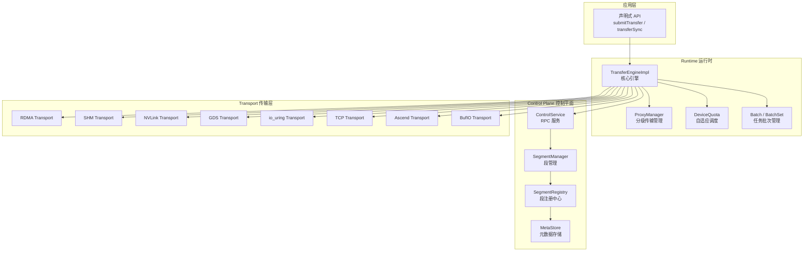
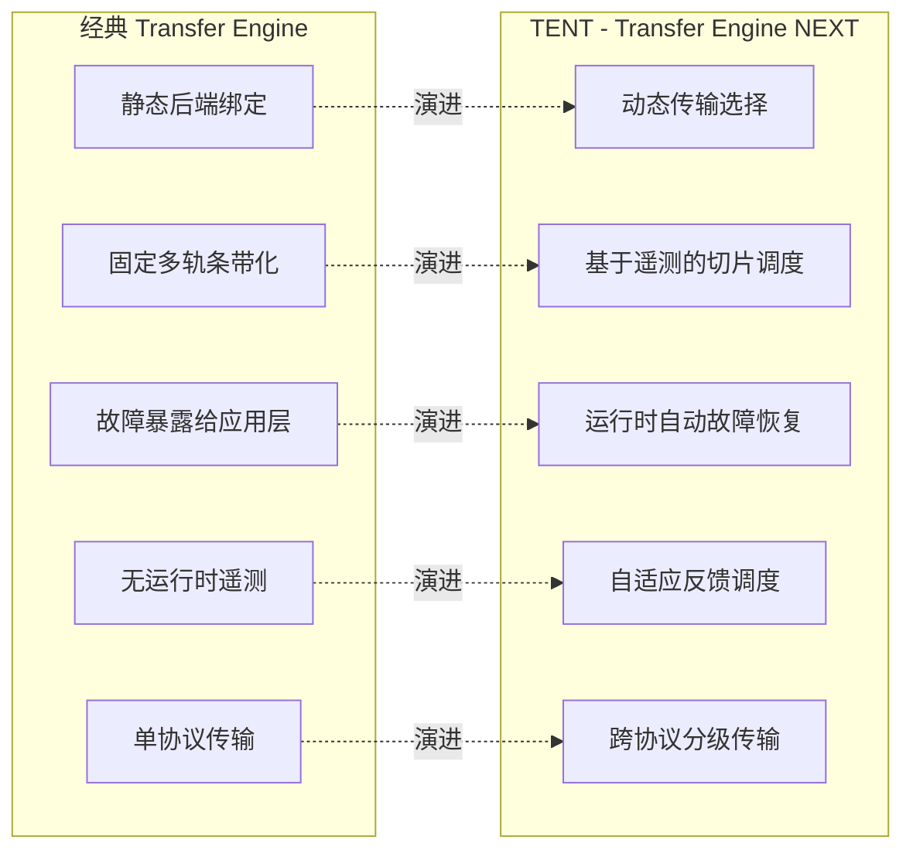
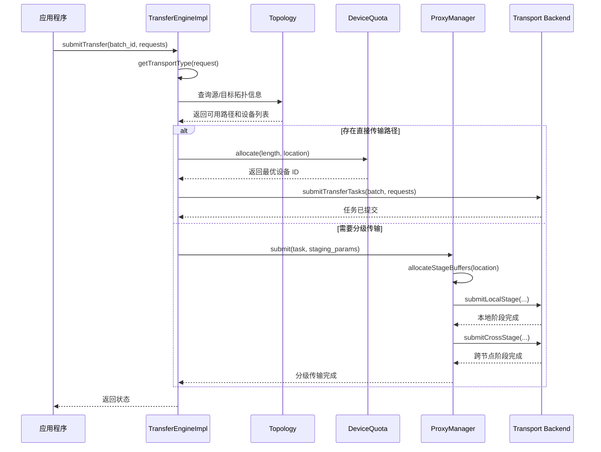

# TENT 设计概述

[上一篇](../04-transfer-engine/03-data-transfer-impl.md) | [目录](../README.md) | [下一篇](02-runtime-internals.md)

---

TENT (Transfer Engine NEXT) 是 Mooncake 项目的下一代数据传输运行时，用于替代经典的 TransferEngine 实现。它专门为异构 AI 集群中的点对点数据移动而设计，目标是在不要求应用程序管理传输协议细节的前提下，高效且可靠地完成数据搬运。

---

## 1. 设计背景与动机

### 1.1 经典 TransferEngine 的局限

在 Mooncake 的早期部署中，经典 Transfer Engine (TE) 采用了一种相对静态的设计模型 -- 一个进程绑定到单一传输后端（如 RDMA 或 NVLink），并用它完成所有传输任务。这种模型在同构环境中运作良好，但在现代异构集群中面临以下核心局限：

| 局限类别 | 具体问题 |
|---------|---------|
| **静态传输选择** | 进程启动时绑定单一传输后端，无法根据运行时条件切换协议。同一作业中不同对等节点可能通过 NVLink、RDMA 或仅通过主机内存互连，静态选择无法覆盖所有场景。 |
| **有限的故障处理** | 链路质量因拥塞、硬件重置或瞬时故障动态变化时，经典 TE 缺乏运行时自动恢复能力，故障直接暴露给应用层。 |
| **静态多轨条带化** | 多轨 (multi-rail) 场景下采用固定的条带化策略，慢速或退化链路主导尾部延迟，有效带宽显著下降。 |
| **缺乏遥测反馈** | 没有运行时遥测机制来观测路径性能，无法基于实际完成时间进行智能调度。 |

### 1.2 TENT 的设计目标

TENT 的核心目标可以概括为一句话：**让数据高效可靠地移动，而应用无需管理传输细节**。

具体而言，TENT 追求：
- 应用层只声明"搬什么数据"，而非"怎么搬"
- 运行时自动适应拓扑变化和链路退化
- 在不牺牲吞吐量的前提下降低尾部延迟

---

## 2. 三大设计支柱

TENT 的架构建立在三个核心设计决策之上：

### 2.1 动态传输选择 (Dynamic Transport Selection)

应用程序使用 TENT 时**不直接选择传输后端**。它们提交的传输请求只描述需要移动的数据（源地址、目标 Segment、偏移量、长度），而非如何移动。

对于每个请求，TENT 运行时会：
1. 确定源和目的地之间有哪些传输后端和路径可用
2. 在运行时选择执行计划
3. 如果条件变化，可以为后续请求变更决策

当直接路径不可用时，TENT 自动构建**分级传输 (staged transfer)**，例如通过主机内存中转数据。这一逻辑完全在运行时内部处理，不需要应用层修改。

### 2.2 基于遥测的细粒度调度 (Fine-Grained Scheduling with Telemetry)

当多条路径或多个轨道可用时，TENT **不依赖静态条带化**。大传输被分割成更小的切片 (slice)，每个切片独立调度。

运行时使用简单的遥测指标（如观测到的完成时间和队列深度）来决定每个切片的发送路径。具体机制基于 `DeviceQuota` 的自适应反馈算法：

```
predicted_time = (active_bytes / bandwidth) + avg_service_time
```

较慢或拥塞的路径自然接收更少的切片，较快的路径接收更多。这使得 TENT 能够在避免单条慢路径造成的队头阻塞的同时，高效利用多轨资源。

### 2.3 运行时内故障处理 (In-Runtime Failure Handling)

大规模集群中部分故障很常见。TENT **在数据通路内部处理这些故障**，而不是将它们暴露给应用层：

- 如果一条路径变慢或不可用，运行时暂时停止在该路径上调度切片，继续使用其他可用路径
- 如果整个后端不可用，自动选择另一个后端
- 切片在必要时自动重试
- 恢复的路径在稳定后重新加入可用池

从应用层视角看，传输持续工作，可能在短时间内性能下降。

---

## 3. 架构总览

TENT 的整体架构由四个主要层次组成：



### 3.1 各层职责

- **应用层 (Application Layer)**：通过声明式 API 提交传输请求，只描述"搬什么"而非"怎么搬"
- **Runtime 运行时**：核心决策引擎，负责路径选择、切片调度、故障处理和分级传输
- **Control Plane 控制平面**：管理 Segment 元数据、跨节点发现和 RPC 通信
- **Transport 传输层**：可插拔的传输后端集合，每个后端专注于数据移动本身

---

## 4. TENT vs 经典 TE 对比表



下表详细对比了两代引擎的核心特性：

| 特性维度 | 经典 Transfer Engine | TENT |
|---------|---------------------|------|
| **传输选择** | 静态绑定单一后端 | 运行时动态选择，按请求决策 |
| **多轨调度** | 固定条带化 (static striping) | 细粒度切片调度，基于遥测反馈 |
| **故障处理** | 故障暴露给应用层 | 运行时自动重试、降级和恢复 |
| **跨协议传输** | 不支持 | ProxyManager 自动构建分级传输路径 |
| **遥测机制** | 无 | DeviceQuota 基于指数平滑的自适应带宽估计 |
| **拓扑感知** | 有限 | 完整拓扑发现 (NIC/Memory/NUMA 亲和性) |
| **设备管理** | 手动配置 | 自动探测 + 配置白名单/黑名单 |
| **内存管理** | 基础分配/注册 | 插件化 MemoryProber + 设备插件系统 |
| **并发模型** | 标准线程/锁 | Lock-free MPSC 队列 + Worker 线程 + TLS BatchSet |
| **Segment 发现** | 中心化 (etcd) | 支持中心化 (etcd/redis) 和 P2P 直连 |
| **配置方式** | 代码级配置 | JSON 配置文件 + 环境变量 |

---

## 5. 配置系统

TENT 采用 JSON 配置文件驱动，通过 `Config` 类以分层 key-path 方式访问配置项。

### 5.1 transfer-engine.json 格式

这是 TENT 的核心配置文件，定义了本地段名称、元数据服务、拓扑约束和各传输后端参数：

```json
{
    "local_segment_name": "",
    "metadata_type": "p2p",
    "metadata_servers": "127.0.0.1:2379",
    "rpc_server_hostname": "127.0.0.1",
    "rpc_server_port": 0,
    "topology": {
        "rdma_whitelist": ["mlx5_0", "mlx5_2"],
        "rdma_blacklist": []
    },
    "log_level": "warning",
    "transports": {
        "rdma": {
            "enable": true,
            "shared_quota_shm_path": "mooncake_quota_shm",
            "max_timeout_ns": 10000000000,
            "device": {
                "num_cq_list": 1,
                "num_comp_channels": 1,
                "port": 1,
                "gid_index": 0,
                "max_cqe": 4096
            },
            "endpoint": {
                "endpoint_store_cap": 256,
                "qp_mul_factor": 1,
                "max_sge": 4,
                "max_qp_wr": 256,
                "max_inline_bytes": 64,
                "path_mtu": 4096
            },
            "workers": {
                "num_workers": 1,
                "max_retry_count": 8,
                "block_size": 65536,
                "grace_period_ns": 50000,
                "rail_topo_path": "/path/to/rail_topo.json"
            }
        },
        "gds": {
            "enable": true
        },
        "shm": {
            "enable": true,
            "cxl_mount_path": "",
            "async_memcpy_threshold": 4
        },
        "mnnvl": {
            "enable": false
        }
    }
}
```

### 5.2 配置项说明

| 配置项 | 说明 |
|-------|------|
| `local_segment_name` | 本节点的段标识符，用于跨节点发现 |
| `metadata_type` | 元数据服务类型，支持 `"p2p"` (点对点直连) 和 `"etcd"` (中心化注册) |
| `metadata_servers` | 元数据服务地址，P2P 模式下为对端地址，etcd 模式下为 etcd 集群地址 |
| `rpc_server_hostname` | 本节点 RPC 服务监听地址 |
| `rpc_server_port` | RPC 服务端口，设为 0 表示自动分配 |
| `topology.rdma_whitelist` | RDMA 设备白名单，仅使用列表中的 NIC |
| `topology.rdma_blacklist` | RDMA 设备黑名单，排除列表中的 NIC |
| `transports.<name>.enable` | 是否启用对应的传输后端 |

### 5.3 RDMA 配置详解

RDMA 传输后端的配置分为三个子类别：

- **device** -- IB 设备参数：CQ 数量、完成通道数、端口号、GID 索引等
- **endpoint** -- QP (Queue Pair) 参数：最大 SGE 数、最大 WR 数、内联字节数、MTU 等
- **workers** -- Worker 线程参数：线程数量、最大重试次数、块大小、优雅退出等待时间等

### 5.4 环境变量支持

除 JSON 配置文件外，`ConfigHelper::loadFromEnv()` 支持从环境变量加载配置，便于容器化部署场景中灵活覆盖配置项。

---

## 6. 动态传输选择流程

以下时序图展示了 TENT 运行时如何为一个传输请求动态选择传输后端：



---

## 7. 典型使用场景

TENT 面向数据传输处于关键路径的场景，包括：

- **KVCache 迁移** -- 大语言模型推理中的 KVCache 在节点间移动
- **流水线阶段间数据交换** -- 训练/推理流水线中相邻阶段的中间结果传递
- **模型参数频繁更新** -- 分布式训练中的参数同步和模型检查点
- **异构加速器与内存配置间的传输** -- GPU、NPU、CPU 内存和 NVMe 存储之间的混合传输

---

## 8. 小结

TENT 通过将传输选择、调度和故障处理下沉到运行时层，扩展了经典 Mooncake Transfer Engine 的能力边界。这使得应用程序能够在异构且动态变化的硬件环境中高效运行，而无需嵌入任何传输协议特定的逻辑。

其设计哲学倾向于**可预测的行为和运维简洁性**，而非手动调优和静态配置。

---

[上一篇](../04-transfer-engine/03-data-transfer-impl.md) | [目录](../README.md) | [下一篇](02-runtime-internals.md)
