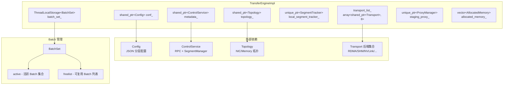
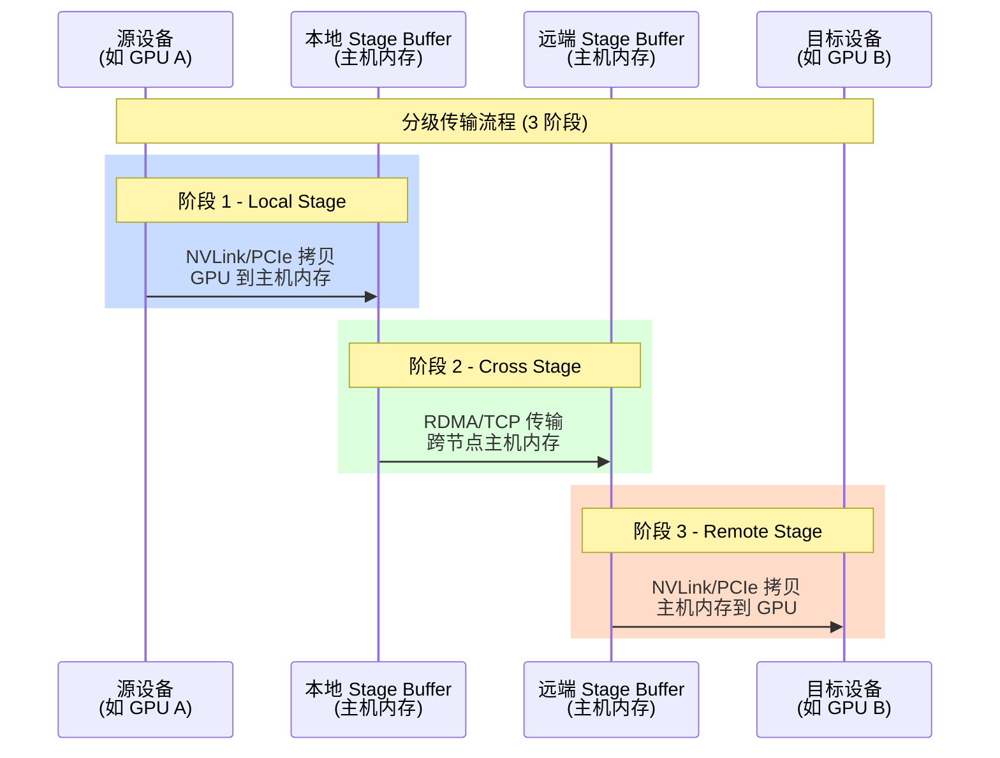
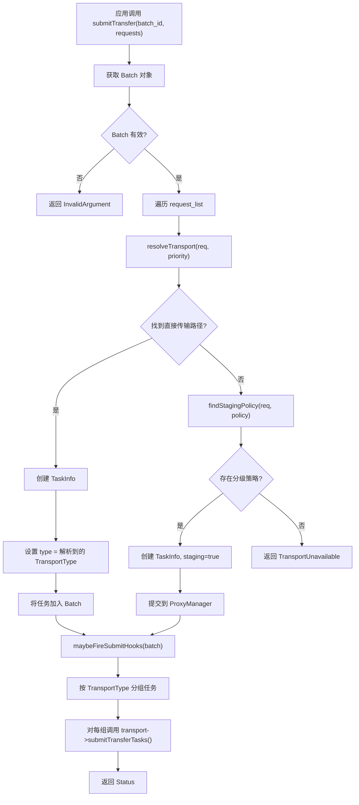

# TENT 运行时内部机制

[上一篇](01-design-overview.md) | [目录](../README.md) | [下一篇](03-transport-backends.md)

---

本文深入分析 TENT 运行时的内部实现，覆盖核心类 `TransferEngineImpl` 的初始化与传输提交流程、控制平面的元数据管理、Segment 抽象体系、ProxyManager 分级传输机制、MemoryProber 设备探测，以及底层并发基础设施。

---

## 1. TransferEngineImpl 核心运行时

`TransferEngineImpl` 是 TENT 的中枢类，位于 `tent/runtime/transfer_engine_impl.h`。它协调所有传输后端、管理 Segment 生命周期、并提供面向应用的完整 API。

### 1.1 核心数据结构



### 1.2 关键成员说明

| 成员 | 类型 | 职责 |
|------|------|------|
| `conf_` | `shared_ptr<Config>` | 分层 JSON 配置管理，支持 key-path 访问 |
| `metadata_` | `shared_ptr<ControlService>` | 控制平面服务，包含 RPC 和 SegmentManager |
| `topology_` | `shared_ptr<Topology>` | 本地拓扑描述 -- NIC 列表、Memory 列表和亲和关系 |
| `transport_list_` | `array<shared_ptr<Transport>, 8>` | 按 `TransportType` 枚举索引的传输后端数组 |
| `local_segment_tracker_` | `unique_ptr<SegmentTracker>` | 本地内存缓冲区追踪器 |
| `batch_set_` | `ThreadLocalStorage<BatchSet>` | 线程本地的 Batch 集合，避免锁竞争 |
| `staging_proxy_` | `unique_ptr<ProxyManager>` | 分级传输管理器 |

### 1.3 初始化流程

`TransferEngineImpl` 的初始化通过 `construct()` 私有方法完成，主要步骤包括：

1. **加载配置** -- 从 `Config` 对象读取段名称、RPC 地址、拓扑约束等
2. **拓扑发现** -- 通过 `Topology::discover()` 自动探测本地 NIC 和 Memory 设备，结合白名单/黑名单过滤
3. **启动控制平面** -- 初始化 `ControlService`，启动 RPC 服务器，建立 `SegmentManager`
4. **加载传输后端** -- `loadTransports()` 依据配置中 `transports.<name>.enable` 标志创建并安装各 Transport
5. **设置本地段** -- `setupLocalSegment()` 注册本节点的 Segment 描述到元数据服务

### 1.4 API 分层

TransferEngineImpl 的公开 API 可以分为四个功能域：

| 功能域 | 主要方法 | 说明 |
|-------|---------|------|
| **Segment 操作** | `openSegment`, `closeSegment`, `exportLocalSegment`, `importRemoteSegment`, `getSegmentInfo` | 管理远端段发现和本地段导出 |
| **内存管理** | `allocateLocalMemory`, `freeLocalMemory`, `registerLocalMemory`, `unregisterLocalMemory` | 分配和注册本地内存缓冲区 |
| **传输操作** | `allocateBatch`, `freeBatch`, `submitTransfer`, `getTransferStatus`, `waitTransferCompletion`, `transferSync` | 提交和管理传输任务 |
| **通知机制** | `sendNotification`, `receiveNotification` | 跨节点轻量级消息通知 |

---

## 2. Control Plane 控制平面

控制平面由 `ControlService` 和 `ControlClient` 两个类组成，位于 `tent/runtime/control_plane.h`。

### 2.1 ControlService

`ControlService` 运行在每个 TENT 节点上，提供以下 RPC 服务：

| RPC 方法 | 功能 |
|---------|------|
| `onGetSegmentDesc` | 返回本节点的 Segment 描述信息 |
| `onBootstrapRdma` | 处理 RDMA QP 连接建立请求 |
| `onSendData` / `onRecvData` | 通过 RPC 通道传输小块数据 |
| `onNotify` | 接收跨节点通知消息 |
| `onDelegate` | 接受远端委托的传输任务 |
| `onPinStageBuffer` / `onUnpinStageBuffer` | 远端分级缓冲区锁定/释放 |

### 2.2 ControlClient

`ControlClient` 是纯静态类，封装了与远端 `ControlService` 通信的所有客户端方法。所有方法均为 `static`，无需实例化即可使用。

### 2.3 Segment 元数据同步

元数据同步支持两种模式，通过配置项 `metadata_type` 控制：

- **中心化模式 (`etcd` / `redis`)** -- Segment 描述存储在外部 KV 存储中，适合大规模集群
- **P2P 模式 (`p2p`)** -- 节点间直接通过 RPC 交换 Segment 描述，无需外部依赖

---

## 3. Segment 管理

TENT 使用三层 Segment 管理体系来实现灵活且高效的数据位置管理。

### 3.1 SegmentDesc -- 段描述

`SegmentDesc` 是段的核心数据结构，包含：

```cpp
struct SegmentDesc {
    std::string name;          // 段的唯一名称
    SegmentType type;          // Memory 或 File
    std::string machine_id;    // 所在机器标识
    std::variant<MemorySegmentDesc, FileSegmentDesc> detail;  // 详细描述
};
```

其中 `MemorySegmentDesc` 进一步包含：
- `Topology topology` -- 远端节点的拓扑信息
- `vector<BufferDesc> buffers` -- 注册的内存缓冲区列表
- `vector<DeviceDesc> devices` -- 设备描述列表
- `string rpc_server_addr` -- RPC 服务地址

每个 `BufferDesc` 描述一块注册的内存：
- `addr` / `length` -- 基址和长度
- `location` -- 内存位置标识 (如 `"cuda:0"`, `"cpu:0"`)
- `transports` -- 支持的传输类型列表
- `transport_attrs` -- 传输特定属性 (如 RDMA rkey)

### 3.2 SegmentManager -- 段管理器

`SegmentManager` 统一管理本地段和远端段的缓存：

- **本地段管理** -- `getLocal()` 返回本地段描述，`synchronizeLocal()` 将本地段信息同步到注册中心
- **远端段缓存** -- 使用 `ThreadLocalStorage<RemoteSegmentCache>` 实现线程本地缓存，避免频繁的远程查询。缓存具有 TTL 机制 (默认 10 秒)
- **段的打开/关闭** -- `openRemote()` 分配 SegmentID 并建立名称到 ID 的映射，`closeRemote()` 释放映射

### 3.3 SegmentRegistry -- 段注册中心

`SegmentRegistry` 是抽象基类，定义了段描述的 CRUD 接口。TENT 提供两个实现：

| 实现类 | 说明 |
|-------|------|
| `CentralSegmentRegistry` | 通过 MetaStore (etcd/redis) 存取段描述 |
| `PeerSegmentRegistry` | P2P 模式，通过 RPC 直连对端获取段描述 |

### 3.4 SegmentTracker -- 本地段追踪器

`SegmentTracker` 追踪本地注册的内存缓冲区，提供：
- `add()` / `remove()` -- 添加或移除内存缓冲区，通过回调函数允许传输后端注册额外信息
- `query()` -- 根据地址范围查找对应的 BufferDesc
- `addInBatch()` -- 批量添加多个缓冲区，支持原子化注册
- `forEach()` -- 遍历所有已注册缓冲区

---

## 4. ProxyManager 分级传输

`ProxyManager` 是 TENT 实现跨协议传输的核心组件，位于 `tent/runtime/proxy_manager.h`。当源和目的地之间没有直接传输路径时（例如 GPU 到远端 GPU 需要经过主机内存中转），ProxyManager 自动构建分级传输路径。

### 4.1 设计原理

分级传输将一个逻辑传输拆分为多个阶段：



### 4.2 核心组件

| 组件 | 说明 |
|------|------|
| `StageBuffers` | 预分配的中间缓冲区池，含 chunks 数组和 bitmap 位图管理 |
| `WorkerShard` | 8 个分片 Worker，每个有独立的线程、互斥锁、条件变量和任务队列 |
| `StagingTask` | 封装原始 TaskInfo 和分级参数 |
| `ThreadPool delegate_pool_` | 用于异步委托远端阶段的线程池 |

### 4.3 工作流程

1. 运行时通过 `findStagingPolicy()` 确定分级策略
2. 调用 `ProxyManager::submit()` 提交分级任务
3. 任务按哈希分配到 8 个 WorkerShard 之一
4. Worker 线程执行 `transferEventLoop()`：
   - `submitLocalStage()` -- 本地阶段，将数据从源设备拷贝到本地 stage buffer
   - `submitCrossStage()` -- 跨节点阶段，通过 RDMA/TCP 传输到远端 stage buffer
   - `waitRemoteStage()` -- 等待远端阶段完成，远端将数据从 stage buffer 拷贝到目标设备

### 4.4 缓冲区管理

ProxyManager 使用 chunk 机制管理 stage buffer：
- 默认 chunk 大小为 8 MB，共 32 个 chunk
- 使用 `atomic_flag` 位图进行无锁分配
- 支持 `pinStageBuffer()` / `unpinStageBuffer()` 接口，允许远端节点锁定和释放 stage buffer

---

## 5. Memory Prober 内存探测

`MemoryProber` 是 TENT 的设备内存探测器，采用插件化架构实现平台无关的内存管理。位于 `tent/runtime/memory_prober.h`。

### 5.1 设计特点

- **单例模式** -- 通过 `MemoryProber::Instance()` 全局访问
- **动态插件加载** -- 通过 `dlopen` 加载 `.so` 插件，每个插件实现 `device_plugin_t` 接口
- **平台无关** -- 同一 API 适用于 CUDA、ROCm、Ascend 等加速器

### 5.2 插件接口 (device_plugin_t)

每个设备插件需要实现以下 C ABI 函数：

```c
typedef struct device_plugin_t {
    const char* class_name;
    void* (*create_plugin)();
    int (*destroy_plugin)(void* handle);
    int (*alloc)(void* ctx, void** pptr, size_t size, const char* location);
    int (*free)(void* ctx, void* ptr, size_t size);
    int (*memcpy_sync)(void* ctx, void* dst, void* src, size_t length);
    int (*query_location)(void* ctx, void* addr, size_t size,
                          location_t* buf, size_t buf_count);
    int (*get_device_count)(void* ctx);
    int (*get_device_pci_bus_id)(void* ctx, int device_index,
                                 char* pci_bus_id, size_t len);
} device_plugin_t;
```

### 5.3 核心功能

| 方法 | 功能 |
|------|------|
| `loadPlugins(path)` | 扫描指定目录，加载所有设备插件 |
| `probe(nic_list, mem_list)` | 探测所有设备内存，构建 Memory 拓扑 |
| `locate(addr, size)` | 识别给定地址所在的设备和位置 |
| `alloc(pptr, size, location)` | 在指定位置分配内存 |
| `type(addr)` | 返回地址的内存类型标识 |

---

## 6. 传输请求处理流水线

以下流程图展示了一个传输请求从应用层提交到最终完成的完整处理路径：



### 6.1 传输类型解析

`resolveTransport()` 的解析逻辑：

1. 检查请求中是否显式指定了 `TransportType`
2. 查询目标 Segment 的 BufferDesc，获取其支持的传输类型列表
3. 按优先级 (MNNVL > SHM > NVLink > RDMA > TCP > ...) 逐一检查本地是否安装了对应后端
4. 验证该后端的 `Capabilities` 是否匹配源/目标的内存类型组合 (如 GPU-to-GPU, DRAM-to-GPU 等)
5. 返回第一个满足条件的传输类型

### 6.2 Batch 与 TaskInfo

每个传输请求在运行时被封装为 `TaskInfo`：

```cpp
struct TaskInfo {
    TransportType type{UNSPEC};     // 选定的传输类型
    int sub_task_id{-1};            // 后端 SubBatch 中的任务索引
    bool derived{false};            // 是否由请求合并产生
    int xport_priority{0};          // 传输优先级
    Request request;                // 原始请求
    bool staging{false};            // 是否为分级传输
    TransferStatusEnum status;      // 当前状态
    volatile TransferStatusEnum staging_status;  // 分级传输状态
};
```

`BatchSet` 使用 `ThreadLocalStorage` 实现线程本地管理，每个线程维护独立的活跃 Batch 集合和空闲列表，避免锁竞争。

---

## 7. 并发基础设施

TENT 运行时大量依赖高性能并发原语，以下是核心组件：

### 7.1 BoundedMPSCQueue -- 有界多生产者单消费者队列

位于 `tent/common/concurrent/bounded_mpsc_queue.h`，这是 RDMA Worker 线程的核心数据结构。

**设计特点：**
- 基于环形缓冲区，容量固定 (默认 8192)
- 每个 Cell 按 64 字节对齐，避免伪共享
- 使用 sequence number 实现无锁的生产者竞争
- 生产者 (`push`) 通过 CAS 竞争尾部位置，支持多生产者并发
- 消费者 (`pop`) 无竞争，单线程读取头部
- `pop` 支持批量弹出到 vector，减少同步开销

### 7.2 RWSpinlock -- 读写自旋锁

用于 Segment 缓存、Buffer 映射表等读多写少的场景，提供比 `std::shared_mutex` 更低的开销。

### 7.3 ThreadLocalStorage

泛型线程本地存储模板，用于 BatchSet 和 RemoteSegmentCache 等需要避免线程间竞争的数据结构。

### 7.4 ThreadPool -- 线程池

通用线程池实现，用于 ProxyManager 的委托任务执行和其他异步操作。

### 7.5 TicketLock -- 票据锁

公平锁实现，保证请求按到达顺序获得锁，用于 NVLink 传输等需要严格顺序的场景。

---

## 8. 小结

TENT 运行时的内部机制围绕以下核心设计展开：

- **TransferEngineImpl** 作为中枢，协调配置、拓扑、控制平面和传输后端
- **Control Plane** 提供跨节点的元数据同步和 RPC 通信能力
- **三层 Segment 管理** (SegmentTracker -> SegmentManager -> SegmentRegistry) 实现灵活的数据位置抽象
- **ProxyManager** 透明地解决跨协议传输需求
- **MemoryProber** 通过插件机制实现平台无关的设备探测
- **高性能并发原语** (lock-free queue, spinlock, TLS) 保障数据通路的低延迟

这些组件共同构成了 TENT "声明式传输、运行时决策" 的技术基础。

---

[上一篇](01-design-overview.md) | [目录](../README.md) | [下一篇](03-transport-backends.md)
