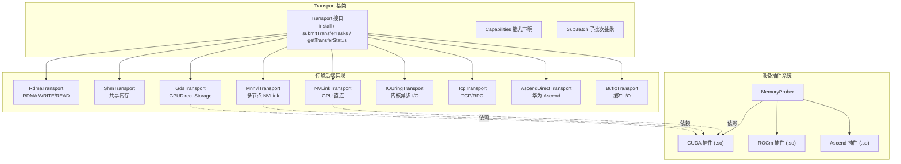
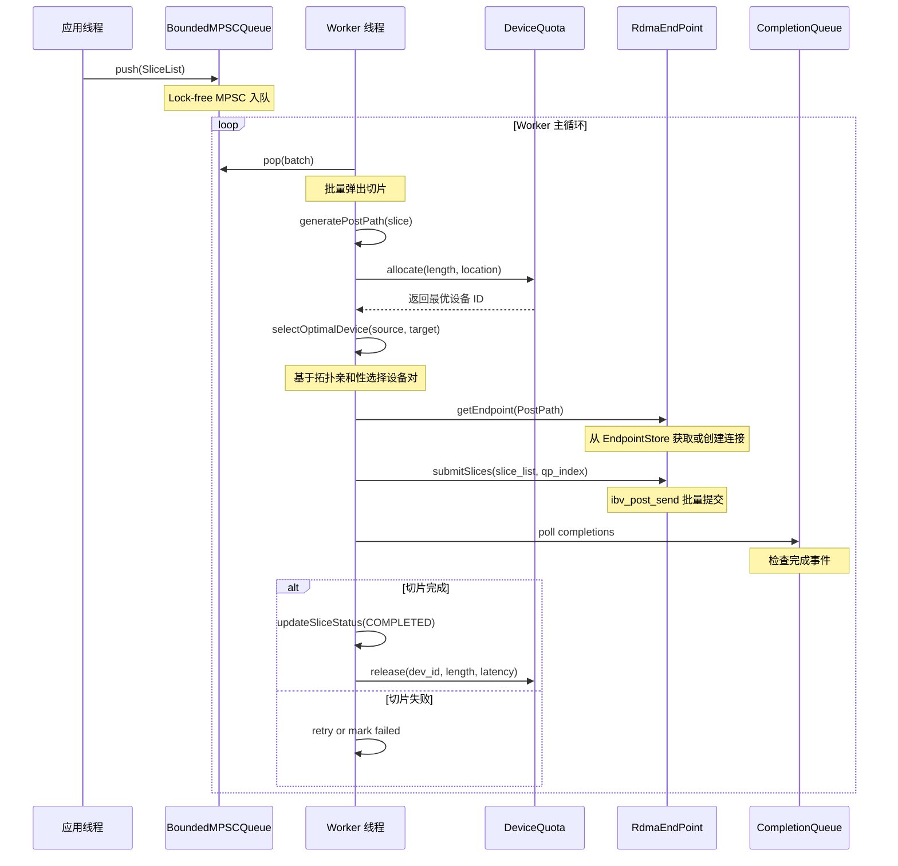

# TENT 传输后端

[上一篇](02-runtime-internals.md) | [目录](../README.md) | [下一篇](../06-p2p-store/01-overview-and-api.md)

---

TENT 支持 8 种可插拔的传输后端，每个后端专注于特定互连技术的数据移动。本文详细分析每个传输后端的设计、核心类结构和工作机制，以及 TENT 的插件系统架构。

---

## 1. Transport 抽象接口

所有传输后端继承自 `Transport` 基类，位于 `tent/runtime/transport.h`。该基类定义了统一的传输接口和能力声明机制。

### 1.1 基类设计

```cpp
class Transport {
public:
    // 子批次抽象 -- 每个后端实现自己的 SubBatch
    struct SubBatch {
        virtual size_t size() const = 0;
    };

    // 生命周期管理
    virtual Status install(...);    // 安装后端，绑定拓扑和控制平面
    virtual Status uninstall();     // 卸载后端

    // 传输核心操作
    virtual Status allocateSubBatch(SubBatchRef& batch, size_t max_size);
    virtual Status freeSubBatch(SubBatchRef& batch);
    virtual Status submitTransferTasks(SubBatchRef batch, const vector<Request>& request_list);
    virtual Status getTransferStatus(SubBatchRef batch, int task_id, TransferStatus& status);

    // 内存管理
    virtual Status allocateLocalMemory(void** addr, size_t size, MemoryOptions& options);
    virtual Status freeLocalMemory(void* addr, size_t size);
    virtual Status addMemoryBuffer(BufferDesc& desc, const MemoryOptions& options);
    virtual Status removeMemoryBuffer(BufferDesc& desc);

    // 通知支持 (可选)
    virtual bool supportNotification() const;
    virtual Status sendNotification(SegmentID target_id, const Notification& notify);
    virtual Status receiveNotification(vector<Notification>& notify_list);

    // 能力声明
    virtual const Capabilities capabilities() const;
    virtual const char* getName() const;
};
```

### 1.2 Capabilities 能力声明

每个后端通过 `Capabilities` 结构体声明其支持的内存类型组合：

```cpp
struct Capabilities {
    bool dram_to_dram = false;   // 主机内存 -> 主机内存
    bool dram_to_gpu = false;    // 主机内存(本地) -> GPU(远端)
    bool gpu_to_dram = false;    // GPU(本地) -> 主机内存(远端)
    bool gpu_to_gpu = false;     // GPU -> GPU
    bool dram_to_file = false;   // 主机内存 -> 文件
    bool gpu_to_file = false;    // GPU -> 文件
};
```

运行时通过 `Capabilities` 在 `resolveTransport()` 中判断某个后端是否能处理特定请求的源/目标内存类型组合。

### 1.3 传输后端插件架构



---

## 2. 协议能力对比表

| 传输后端 | 名称标识 | DRAM-DRAM | DRAM-GPU | GPU-DRAM | GPU-GPU | DRAM-File | GPU-File | 通知支持 | 典型场景 |
|---------|---------|-----------|----------|----------|---------|-----------|----------|---------|---------|
| **RDMA** | `rdma` | Y | Y | Y | Y | - | - | - | 跨节点高性能内存传输 |
| **SHM** | `shm` | Y | - | - | - | - | - | - | 节点内进程间零拷贝 |
| **NVLink** | `nvlink` | - | - | - | Y | - | - | - | 节点内 GPU 间直连 |
| **MNNVL** | `mnnvl` | - | - | - | Y | - | - | - | 多节点 NVLink 域 GPU 直连 |
| **GDS** | `gds` | - | - | - | - | - | Y | - | GPU 直接访问 NVMe |
| **io_uring** | `io-uring` | - | - | - | - | Y | - | - | 内核异步文件 I/O |
| **TCP** | `tcp` | Y | - | - | - | - | - | Y | 跨节点通用回退传输 |
| **Ascend** | `ascend_direct` | Y | Y | Y | Y | - | - | - | 华为昇腾 NPU 传输 |
| **BufIO** | `buf-io` | - | - | - | - | Y | - | - | 缓冲文件 I/O 回退 |

---

## 3. RDMA 传输 (最复杂)

RDMA 传输是 TENT 中最复杂也是最核心的传输后端，位于 `tent/transport/rdma/` 目录下，由多个协作组件组成。

### 3.1 组件架构

| 组件 | 头文件 | 职责 |
|------|--------|------|
| **RdmaTransport** | `rdma_transport.h` | 传输后端主类，管理生命周期和对外接口 |
| **RdmaContext** | `context.h` | 封装 IB 设备上下文、PD、内存注册 |
| **RdmaEndPoint** | `endpoint.h` | 管理 QP 连接、数据发送和接收 |
| **EndpointStore** | `endpoint_store.h` | 缓存和复用 Endpoint 连接 |
| **RdmaCQ** | `cq.h` | Completion Queue 管理 |
| **Workers** | `workers.h` | Worker 线程池，驱动数据传输 |
| **RdmaSlice** | `slice.h` | 传输切片 -- 最小调度单元 |
| **DeviceQuota** | `quota.h` | 自适应 NIC 选择和负载均衡 |
| **RailMonitor** | `rail_monitor.h` | 轨道健康监控和故障恢复 |
| **RdmaParams** | `params.h` | RDMA 参数配置封装 |
| **LocalBufferManager** | `buffers.h` | 本地缓冲区管理 |
| **IbvLoader** | `ibv_loader.h` | IB Verbs 符号动态加载 |

### 3.2 RdmaContext -- IB 设备上下文

每个 RDMA NIC 对应一个 `RdmaContext` 实例，管理：

- **IB 设备资源** -- `ibv_context`, `ibv_pd` (Protection Domain)
- **内存注册** -- `registerMemReg()` / `unregisterMemReg()` 管理 Memory Region
- **CQ 列表** -- 可配置数量的 Completion Queue
- **Endpoint Store** -- 缓存已建立的 QP 连接
- **设备状态** -- 支持 `UNINIT -> DISABLED -> ENABLED` 状态转换

### 3.3 RdmaEndPoint -- QP 管理

`RdmaEndPoint` 封装了 RDMA QP (Queue Pair) 的完整生命周期：

- **状态机** -- `EP_UNINIT -> EP_HANDSHAKING -> EP_READY -> EP_RESET`
- **多 QP 支持** -- 通过 `qp_mul_factor` 配置，每个 Endpoint 可持有多个 QP
- **WR 深度控制** -- 每个 QP 维护独立的 `WrDepthBlock` 计数器，防止提交过多 WR
- **切片队列** -- 每个 QP 有一个 `BoundedSliceQueue`，追踪 in-flight 的切片
- **连接建立** -- 通过 RPC bootstrap 机制交换 QP 参数 (LID, GID, QP Number)

### 3.4 RdmaSlice -- 传输切片

```cpp
struct RdmaSlice {
    void* source_addr;        // 源地址
    uint64_t target_addr;     // 目标地址
    size_t length;            // 切片长度
    RdmaTask* task;           // 所属任务
    RdmaSlice* next;          // 链表指针
    uint32_t source_lkey;     // 本地 LKEY
    uint32_t target_rkey;     // 远端 RKEY
    int source_dev_id;        // 源设备 ID
    int target_dev_id;        // 目标设备 ID
    RdmaEndPoint* ep_weak_ptr;// 关联的 Endpoint
    int retry_count;          // 重试计数
    uint64_t enqueue_ts;      // 入队时间戳
    uint64_t submit_ts;       // 提交时间戳
};
```

切片是 RDMA 传输的最小调度单元。大传输被切分为固定大小的切片 (默认 64KB，由 `block_size` 配置)，每个切片独立调度和重试。

`RdmaTask` 追踪一个完整请求的所有切片状态，使用原子操作 (`__sync_fetch_and_add`) 更新完成进度。

### 3.5 Workers -- 传输工作线程

Workers 是 RDMA 数据通路的核心驱动引擎：



#### Worker 线程内部结构

每个 Worker 线程维护独立的 `WorkerContext`：

- **BoundedSliceQueue** -- 接收来自应用线程的切片列表 (容量 8192)
- **GroupedRequests** -- 按 `PostPath` (本地设备, 远端段, 远端设备) 分组切片
- **inflight_slice_set** -- 追踪当前 in-flight 的切片
- **RailMonitor** -- 每个远端段的轨道健康状态
- **PerfMetricSummary** -- 性能指标 (入队延迟、in-flight 延迟的 p50/p95/p99/p999)

#### 设备选择算法

Worker 在 `generatePostPath()` 中选择最优设备对：

1. **获取路由提示** -- `getRouteHint()` 查找源和目标的 BufferDesc 和拓扑条目
2. **优先选择** -- `selectOptimalDevice()` 优先使用亲和性最高的设备对 (同 NUMA / 直连轨道)
3. **回退选择** -- `selectFallbackDevice()` 在最优路径不可用时选择次优路径

### 3.6 DeviceQuota -- 自适应 NIC 选择

`DeviceQuota` 实现了基于反馈的 NIC 负载均衡：

**核心算法：**

```
predicted_time = active_bytes * beta1 / bandwidth + beta0
```

- `beta0` -- 固定延迟估计 (PCIe 开销、连接建立等)
- `beta1` -- 有效带宽修正因子
- 两个参数通过指数平滑更新：`param <- (1 - alpha) * param + alpha * observed`

**特性：**
- NUMA 感知 -- 默认优先选择同 NUMA 域的 NIC
- 共享配额 -- 通过共享内存 (`SharedQuotaManager`) 实现多进程间的 NIC 负载协调
- 跨 NUMA 降级 -- `allow_cross_numa_` 控制是否允许跨 NUMA 域访问

### 3.7 RailMonitor -- 轨道健康监控

`RailMonitor` 监控 NIC 对之间的链路健康状态：

- **错误计数** -- 在时间窗口 (`error_window_`) 内累计错误次数
- **自动暂停** -- 超过阈值 (`error_threshold_`) 后暂停该轨道
- **冷却恢复** -- 经过 `cooldown_` 时间后自动恢复
- **最优映射更新** -- 轨道状态变化时重新计算 `findBestRemoteDevice()` 映射

---

## 4. 共享内存传输 (SHM)

`ShmTransport` 实现节点内进程间的零拷贝数据传输，位于 `tent/transport/shm/shm_transport.h`。

### 4.1 工作原理

- 使用 POSIX 共享内存 (`shm_open` / `mmap`) 在进程间共享内存区域
- 发送端和接收端通过映射同一共享内存对象实现零拷贝
- 支持 CXL 内存 -- 通过 `cxl_mount_path` 配置 CXL 设备的挂载路径

### 4.2 地址重定位

由于不同进程的虚拟地址空间不同，SHM 传输需要地址重定位：
- `relocateSharedMemoryAddress()` 将远端 Segment 中的地址转换为本地进程可访问的地址
- 使用 `relocate_map_` (按 SegmentID 和基址索引) 缓存已打开的共享内存映射

### 4.3 关键特性

- **machine_id 校验** -- 只能在同一机器上的 Segment 间传输
- **自定义内存分配** -- 覆盖 `allocateLocalMemory()` 以在共享内存中分配
- **异步拷贝阈值** -- `async_memcpy_threshold` 控制何时使用异步内存拷贝

---

## 5. NVLink / MNNVL 传输

### 5.1 NVLink 传输

`NVLinkTransport` 实现节点内 GPU 之间的直接数据传输，利用 CUDA IPC 和 NVLink 互连。

**工作流程：**
1. 源 GPU 的内存通过 CUDA IPC Handle 导出
2. 目标 GPU 通过 `cudaIpcOpenMemHandle()` 映射源 GPU 的内存
3. 使用 `cudaMemcpyAsync()` 在 CUDA Stream 上执行异步拷贝
4. `setPeerAccess()` 建立 GPU 间的 P2P 访问权限

**特殊处理：**
- 支持 `host_register_` 选项 -- 对主机内存执行 `cudaHostRegister()` 以启用 GPU 直接访问
- 地址重定位机制与 SHM 类似，但基于 CUDA IPC

### 5.2 MNNVL 传输

`MnnvlTransport` 扩展了 NVLink 传输到多节点场景，利用 NVIDIA Multi-Node NVLink 技术。

**与 NVLink 的区别：**
- 支持跨节点的 GPU 直连传输 (NVSwitch 互连)
- 使用 CUDA Virtual Memory Management API (`cuMemCreate` / `cuMemExportToShareableHandle`)
- 支持两种 handle 类型 -- `CU_MEM_HANDLE_TYPE_FABRIC` (首选) 和 `CU_MEM_HANDLE_TYPE_POSIX_FILE_DESCRIPTOR` (回退)
- 运行时检测硬件是否支持 MNNVL (`supported_` 标志)
- 通过 `allocate_set_` 追踪以 MNNVL API 分配的内存

---

## 6. GDS 传输

`GdsTransport` 实现 GPUDirect Storage，允许 GPU 直接与 NVMe 存储交换数据，绕过 CPU 和系统内存。位于 `tent/transport/gds/gds_transport.h`。

### 6.1 工作原理

- 使用 NVIDIA cuFile API (`CUfileBatchHandle_t`) 提交批量 I/O 操作
- 每个 `GdsSubBatch` 包含一组 `CUfileIOParams_t`，描述 I/O 参数
- 通过 `CUfileIOEvents_t` 异步查询 I/O 完成状态

### 6.2 文件上下文管理

- `GdsFileContext` 封装每个 Segment 对应的文件上下文
- `FileContextMap` 按 SegmentID 缓存已打开的文件上下文
- 使用 `RWSpinlock` 保护文件上下文映射表

### 6.3 适用场景

- KVCache 持久化到 NVMe SSD
- 模型检查点的高速存储和恢复
- GPU 内存与高速存储之间的直接数据交换

---

## 7. io_uring 传输

`IOUringTransport` 利用 Linux 内核的 `io_uring` 异步 I/O 接口实现高效的文件传输。位于 `tent/transport/io_uring/io_uring_transport.h`。

### 7.1 设计特点

- 每个 `IOUringSubBatch` 维护独立的 `struct io_uring ring` 实例
- 使用 `probeCapabilities()` 在安装时检测内核 io_uring 支持
- `IOUringFileContext` 管理每个 Segment 对应的文件描述符

### 7.2 与 GDS 的区别

| 维度 | GDS | io_uring |
|------|-----|----------|
| 数据路径 | GPU -> NVMe (绕过 CPU) | CPU -> NVMe (内核异步) |
| 硬件要求 | NVIDIA GPU + cuFile | Linux 内核 5.1+ |
| 内存类型 | GPU 内存 | 主机内存 |
| 典型延迟 | 更低 (DMA 直连) | 稍高 (内核参与) |

---

## 8. TCP / Ascend / BufIO 传输

### 8.1 TCP 传输

`TcpTransport` 是基于 RPC 的通用传输后端，作为无 RDMA 环境的回退方案。

**特性：**
- 基于 `ControlClient::sendData()` / `recvData()` 实现数据传输
- **唯一支持 Notification 的后端** -- `supportNotification()` 返回 `true`
- 通过 RPC 通道发送小块数据，适合低带宽或无 RDMA 的场景
- 使用 `notify_list_` (配合 `RWSpinlock`) 存储接收到的通知

### 8.2 Ascend 传输

`AscendDirectTransport` 为华为昇腾 (Ascend) NPU 设计，使用 HIXL (华为互联库) 实现高速传输。

**特性：**
- 使用 ACL (Ascend Computing Language) 运行时管理设备上下文
- 通过 `hixl::Hixl` 实例管理传输请求
- 支持同步和异步传输模式
- 连接管理 -- 使用 `connected_segments_` 集合追踪已连接的远端段
- Worker 线程模型 -- 独立线程处理异步任务队列
- 支持批量拷贝 (`copyWithBatch`) 优化大量小请求

### 8.3 BufIO 传输

`BufIoTransport` 是基于标准缓冲 I/O 的文件传输后端，作为 GDS 和 io_uring 的回退方案。

**特性：**
- 使用标准 POSIX `read()` / `write()` 系统调用
- 无特殊硬件要求，适用于所有 Linux 平台
- `BufIoFileContext` 管理文件描述符的打开和缓存

---

## 9. 插件系统

TENT 的设备插件系统允许在不修改核心代码的情况下添加新的加速器支持。

### 9.1 插件 ABI

每个设备插件是一个共享库 (`.so`)，必须导出以下符号：

```c
// 注册入口点
#define TENT_DEVICE_PLUGIN_REGISTER_SYMBOL "tent_register_device_plugin"
typedef int (*tent_register_device_plugin_fn)(device_plugin_t* out);
```

插件通过 `device_plugin_t` 结构体提供完整的设备操作接口：

| 函数指针 | 功能 |
|---------|------|
| `create_plugin` | 创建插件实例 |
| `destroy_plugin` | 销毁插件实例 |
| `alloc` | 在指定设备上分配内存 |
| `free` | 释放设备内存 |
| `memcpy_sync` | 同步内存拷贝 |
| `query_location` | 查询内存地址所在的设备位置 |
| `get_device_count` | 获取设备数量 |
| `get_device_pci_bus_id` | 获取设备的 PCI Bus ID |

### 9.2 插件加载流程

1. `MemoryProber::loadPlugins(path)` 扫描指定目录
2. 对每个 `.so` 文件调用 `dlopen()` 加载
3. 通过 `dlsym()` 查找 `tent_register_device_plugin` 符号
4. 调用注册函数填充 `device_plugin_t` 结构体
5. 调用 `create_plugin()` 创建插件实例
6. 将 `LoadedPlugin` 存入 `plugins_` 列表

### 9.3 CUDA 插件

CUDA 插件是目前最成熟的设备插件实现，位于 `tent/plugins/` 目录。它提供：

- CUDA 内存分配和释放 (`cudaMalloc` / `cudaFree`)
- 设备间内存拷贝 (`cudaMemcpy`)
- GPU 位置查询 (基于 `cudaPointerGetAttributes`)
- PCI Bus ID 查询 (基于 `cudaDeviceGetPCIBusId`)
- GPU 数量检测 (基于 `cudaGetDeviceCount`)

---

## 10. 后端选择决策树

运行时在 `resolveTransport()` 中按以下优先级选择传输后端：

```
1. MNNVL  -- 跨节点 GPU-GPU，且硬件支持 Multi-Node NVLink
2. SHM    -- 同机 DRAM-DRAM，进程间零拷贝
3. NVLink -- 同机 GPU-GPU，CUDA IPC
4. RDMA   -- 跨节点高性能传输，最通用
5. TCP    -- 跨节点回退传输
6. GDS    -- GPU-File，GPUDirect Storage
7. IOURING -- DRAM-File，内核异步 I/O
8. BufIO  -- DRAM-File，标准缓冲 I/O 回退
```

具体选择取决于：
- 源和目标的内存类型 (DRAM/GPU/File)
- 是否在同一机器 (machine_id 比较)
- 后端是否已启用 (配置中 `enable: true`)
- 后端的 Capabilities 是否匹配请求

---

## 11. 小结

TENT 的传输后端体系通过统一的 `Transport` 抽象接口和可插拔架构，实现了以下设计目标：

- **协议透明** -- 应用层无需感知底层使用了哪个传输协议
- **灵活扩展** -- 新增传输后端只需实现 Transport 接口并注册
- **自适应选择** -- 运行时根据拓扑、能力和遥测自动选择最优后端
- **故障隔离** -- 每个后端独立管理错误状态，RailMonitor 提供链路级健康监控
- **设备无关** -- 通过插件系统支持 NVIDIA GPU、华为 Ascend 等多种加速器

在所有后端中，RDMA 传输是最复杂的实现，包含完整的切片调度、自适应 NIC 选择、连接池化和轨道监控机制。其他后端在设计上更为精简，专注于特定互连场景的高效实现。

---

[上一篇](02-runtime-internals.md) | [目录](../README.md) | [下一篇](../06-p2p-store/01-overview-and-api.md)
