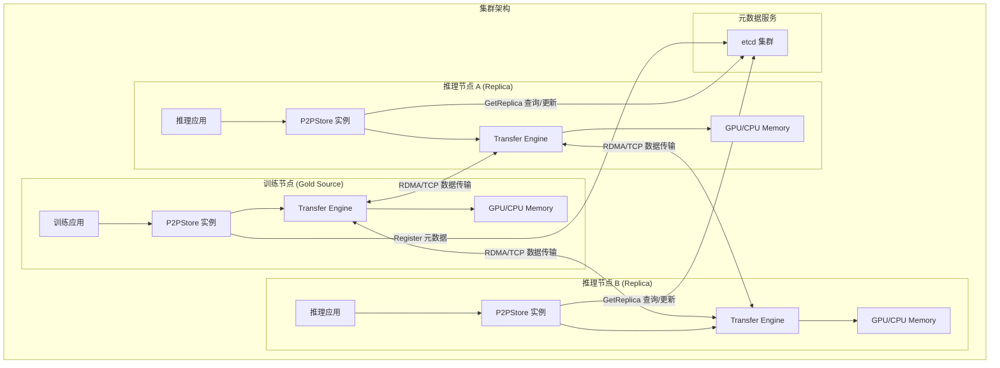
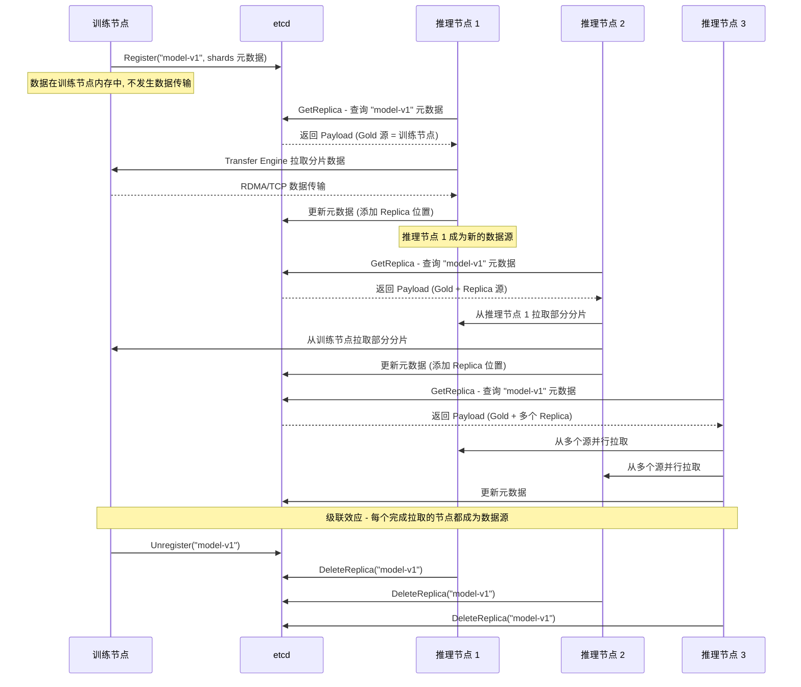

# P2P Store - 概述与 API 详解

## 1. 模块定位

P2P Store 是 Mooncake 项目中构建在 Transfer Engine 之上的**分布式对象分发层**，专为大规模集群中节点间的临时数据共享而设计。其核心应用场景是**大模型训练 Checkpoint 的高效分发** -- 在 Moonshot AI 的 Kimi K1.5 / K2 训练流水线中，P2P Store 作为 Checkpoint 传输引擎承担了生产级工作负载。

### 1.1 BitTorrent 式分发模型

P2P Store 借鉴了 BitTorrent 协议的核心思想：

| 概念 | BitTorrent | P2P Store |
|------|-----------|-----------|
| 做种（Seed） | 做种者共享文件给其他节点 | `Register` 注册本地数据到集群元数据 |
| 下载（Leech） | 下载者从多个做种者获取分片 | `GetReplica` 从多个数据源并行拉取分片 |
| 成为做种者 | 下载完成后自动做种 | `GetReplica` 完成后自动注册为 Replica 源 |
| 停止做种 | 停止共享 | `Unregister` / `DeleteReplica` 移除数据源 |
| 元数据服务 | Tracker 服务器 | etcd 分布式键值存储 |

这种设计使得数据分发带宽随参与节点数量线性增长，避免了传统中心化方案中单一源节点的出口带宽瓶颈。

### 1.2 与传统方案的对比

```
传统中心化方案：
  训练节点 ──────> 推理节点 1
  训练节点 ──────> 推理节点 2
  训练节点 ──────> 推理节点 3     ← 出口带宽饱和
  训练节点 ──────> 推理节点 N

P2P Store 方案：
  训练节点 ──────> 推理节点 1 ──────> 推理节点 3
  训练节点 ──────> 推理节点 2 ──────> 推理节点 4
                   推理节点 1 ──────> 推理节点 5   ← 带宽线性扩展
```

## 2. 整体架构

### 2.1 架构设计原则

P2P Store 采用**纯客户端架构**，没有中心化的 Master 节点。这意味着：

- **无单点故障**：任何一个 P2P Store 实例的崩溃不会影响其他实例
- **横向可扩展**：新增节点只需连接到同一个 etcd 集群
- **低运维复杂度**：唯一的基础设施依赖是 etcd 集群

每个 P2P Store 实例内部由四个核心组件构成：

| 组件 | 源文件 | 职责 |
|------|--------|------|
| **Catalog** | `catalog.go` | 本地 Payload 注册表，线程安全的 map 结构 |
| **Metadata** | `metadata.go` | etcd 客户端封装，全局元数据 CRUD |
| **RegisteredMemory** | `registered_memory.go` | 本地内存注册管理，引用计数机制 |
| **TransferEngine** | `transfer_engine.go` | CGo 封装层，调用 C++ Transfer Engine |

### 2.2 架构全景图



### 2.3 P2PStore 结构体

```go
// core.go
type P2PStore struct {
    metadataConnString string           // etcd 连接字符串
    localServerName    string           // 本节点唯一标识 (host:port)
    catalog            *Catalog         // 本地 Payload 注册表
    memory             *RegisteredMemory // 内存注册管理器
    metadata           *Metadata        // etcd 元数据客户端
    transfer           *TransferEngine  // Transfer Engine CGo 封装
}
```

## 3. 生产应用场景

### 3.1 Kimi K1.5 / K2 Checkpoint 分发

在大模型训练场景中，Checkpoint 分发是一个典型的"一对多"数据传输问题：

1. **训练完成**：训练节点将模型参数保存在 GPU/CPU 内存中
2. **注册 Checkpoint**：训练节点调用 `Register` 将 Checkpoint 元数据注册到 etcd
3. **推理节点拉取**：大量推理节点调用 `GetReplica` 并行拉取 Checkpoint
4. **级联加速**：先完成拉取的推理节点自动成为数据源，加速后续节点的拉取
5. **清理**：训练节点调用 `Unregister`，推理节点按需调用 `DeleteReplica`

### 3.2 典型工作流



## 4. API 详解

### 4.1 NewP2PStore - 创建实例

```go
func NewP2PStore(metadataConnString string, localServerName string, nicPriorityMatrix string) (*P2PStore, error)
```

**参数说明**：

| 参数 | 类型 | 说明 |
|------|------|------|
| `metadataConnString` | `string` | etcd 服务的连接地址，如 `"10.0.0.1:2379"` |
| `localServerName` | `string` | 本地节点标识，格式为 `"host:port"`，必须在集群中唯一 |
| `nicPriorityMatrix` | `string` | NIC 优先级矩阵配置，为空时使用 TCP 协议，非空时使用 RDMA |

**初始化流程**：

```go
func NewP2PStore(metadataConnString string, localServerName string, nicPriorityMatrix string) (*P2PStore, error) {
    // 1. 创建 etcd 元数据客户端
    metadata, err := NewMetadata(metadataConnString, METADATA_KEY_PREFIX)

    // 2. 解析本地服务器地址
    localIpAddressCStr, rpcPort := parseServerName(localServerName)

    // 3. 创建 Transfer Engine (CGo 调用 C++ 引擎)
    transfer, err := NewTransferEngine(metadataConnString, localServerName, localIpAddressCStr, rpcPort)

    // 4. 安装传输协议 (RDMA 或 TCP)
    if len(nicPriorityMatrix) == 0 {
        err = transfer.installTransport("tcp", nicPriorityMatrix)
    } else {
        err = transfer.installTransport("rdma", nicPriorityMatrix)
    }

    // 5. 组装 P2PStore 实例
    store := &P2PStore{
        metadataConnString: metadataConnString,
        localServerName:    localServerName,
        catalog:            NewCatalog(),
        memory:             NewRegisteredMemory(transfer, MAX_CHUNK_SIZE),
        metadata:           metadata,
        transfer:           transfer,
    }
    return store, nil
}
```

**使用示例**：

```go
// 使用 TCP 协议
store, err := NewP2PStore("10.0.0.1:2379", "10.0.0.2:12345", "")

// 使用 RDMA 协议
store, err := NewP2PStore("10.0.0.1:2379", "10.0.0.2:12345", nicMatrix)
defer store.Close()
```

### 4.2 Register - 注册数据到集群

```go
func (store *P2PStore) Register(ctx context.Context,
    name string,
    addrList []uintptr,
    sizeList []uint64,
    maxShardSize uint64,
    location string,
    forceCreate bool) error
```

**参数说明**：

| 参数 | 类型 | 说明 |
|------|------|------|
| `ctx` | `context.Context` | 上下文，支持超时和取消 |
| `name` | `string` | 全局唯一的 Payload 名称 |
| `addrList` | `[]uintptr` | 内存区域起始地址列表 |
| `sizeList` | `[]uint64` | 对应的内存区域大小列表 |
| `maxShardSize` | `uint64` | 分片粒度，推荐 64MB |
| `location` | `string` | 内存设备位置，如 `"cuda:0"` 或 `"cpu:0"` |
| `forceCreate` | `bool` | 是否覆盖已有元数据 |

**内部流程**：

1. **参数校验**：确保 `addrList` 和 `sizeList` 长度一致且非空
2. **重复检查**：通过 Catalog 检查本地是否已注册同名 Payload
3. **内存注册**：将每段内存区域注册到 Transfer Engine
4. **分片构建**：将数据按 `maxShardSize` 粒度切分为 Shard 列表
5. **元数据写入**：将 Payload 信息写入 etcd

```go
// 核心分片逻辑
for i := 0; i < len(addrList); i++ {
    addr, size := addrList[i], sizeList[i]
    var offset uint64 = 0
    for ; offset < size; offset += maxShardSize {
        shardLength := maxShardSize
        if shardLength > size-offset {
            shardLength = size - offset
        }
        goldLocation := Location{
            SegmentName: store.localServerName,
            Offset:      uint64(addr) + offset,
        }
        shard := Shard{
            Length:      shardLength,
            Gold:        []Location{goldLocation},
            ReplicaList: nil,
        }
        payload.Shards = append(payload.Shards, shard)
    }
}
```

**使用示例**：

```go
ctx := context.Background()
addrList := []uintptr{uintptr(unsafe.Pointer(&data[0]))}
sizeList := []uint64{uint64(len(data))}

err := store.Register(ctx, "checkpoint-v1", addrList, sizeList,
    64*1024*1024, // 64MB 分片
    "cpu:0",
    false)        // 不覆盖已有数据
```

### 4.3 Unregister - 取消注册

```go
func (store *P2PStore) Unregister(ctx context.Context, name string) error
```

**行为**：通过乐观锁（etcd ModRevision）将该 Payload 所有 Shard 的 `Gold` 列表清空。如果更新过程中元数据被其他节点修改，则重试。

```go
func (store *P2PStore) Unregister(ctx context.Context, name string) error {
    params, exist := store.catalog.Get(name)
    if !exist {
        return ErrPayloadNotOpened
    }
    for {
        payload, revision, err := store.metadata.Get(ctx, name)
        // ... 错误处理
        for index := range payload.Shards {
            payload.Shards[index].Gold = nil  // 清空 Gold 源
        }
        success, err := store.metadata.Update(ctx, name, payload, revision)
        if success {
            store.catalog.Remove(name)
            // 反注册内存区域
            return nil
        }
        // CAS 失败，重试
    }
}
```

### 4.4 List - 列出已注册的 Payload

```go
func (store *P2PStore) List(ctx context.Context, namePrefix string) ([]PayloadInfo, error)
```

**返回类型**：

```go
type PayloadInfo struct {
    Name         string    // Payload 名称
    MaxShardSize uint64    // 分片大小
    TotalSize    uint64    // 总数据大小
    SizeList     []uint64  // 各内存段的大小列表
}
```

**使用示例**：

```go
// 列出所有以 "checkpoint-" 开头的 Payload
payloads, err := store.List(ctx, "checkpoint-")
for _, p := range payloads {
    fmt.Printf("Name: %s, Size: %d\n", p.Name, p.TotalSize)
}
```

### 4.5 GetReplica - 拉取数据副本

```go
func (store *P2PStore) GetReplica(ctx context.Context, name string, addrList []uintptr, sizeList []uint64) error
```

这是 P2P Store 最核心的 API，实现了分布式数据拉取。

**工作流程**：

1. **查询元数据**：从 etcd 获取 Payload 信息及版本号（revision）
2. **并行拉取**：为每个 Shard 启动 goroutine，从随机选择的源节点拉取数据
3. **一致性校验**：拉取完成后重新检查元数据版本，确保数据源未被删除
4. **注册为 Replica**：将本地副本位置更新到 etcd 元数据中

```go
func (store *P2PStore) GetReplica(ctx context.Context, name string, addrList []uintptr, sizeList []uint64) error {
    // 1. 获取元数据和版本号
    payload, revision, err := store.metadata.Get(ctx, name)

    for {
        // 2. 执行数据拉取
        err = store.doGetReplica(ctx, payload, addrList, sizeList)

        // 3. 一致性校验
        newPayload, recheckRevision, err := store.metadata.Get(ctx, name)
        if revision == recheckRevision {
            break  // 元数据未变更，数据有效
        }
        if isSubsetOf(payload, newPayload) {
            break  // 数据源只增不减，数据仍然有效
        }
        // 元数据变更且数据源减少，需要重新拉取
    }

    // 4. 将本节点注册为 Replica 源
    return store.updatePayloadMetadata(ctx, name, addrList, sizeList, payload, revision)
}
```

**关键设计 - 源节点选择策略**：

```go
// metadata.go - 首次尝试随机选择（负载均衡）
func (s *Shard) getRandomLocation() *Location {
    r := rand.New(rand.NewSource(time.Now().UnixNano()))
    if len(s.ReplicaList) > 0 {
        index := r.Intn(len(s.ReplicaList))
        return &s.ReplicaList[index]       // 优先从 Replica 拉取
    } else if len(s.Gold) > 0 {
        index := r.Intn(len(s.Gold))
        return &s.Gold[index]              // 其次从 Gold 源拉取
    }
    return nil
}

// 重试时按序遍历（容错）
func (s *Shard) getRetryLocation(retryTimes int) *Location {
    if len(s.ReplicaList) > retryTimes {
        return &s.ReplicaList[retryTimes]
    }
    retryTimes -= len(s.ReplicaList)
    if len(s.Gold) > retryTimes {
        return &s.Gold[retryTimes]
    }
    return nil
}
```

**使用示例**：

```go
ctx := context.Background()
buf := make([]byte, totalSize)
addrList := []uintptr{uintptr(unsafe.Pointer(&buf[0]))}
sizeList := []uint64{uint64(totalSize)}

err := store.GetReplica(ctx, "checkpoint-v1", addrList, sizeList)
// 拉取完成后，本节点自动成为该 Checkpoint 的数据源
```

### 4.6 DeleteReplica - 删除本地副本

```go
func (store *P2PStore) DeleteReplica(ctx context.Context, name string) error
```

**行为**：从 etcd 元数据中移除本节点作为 Replica 的位置信息，然后反注册本地内存。同样采用乐观锁机制确保并发安全。

```go
func (store *P2PStore) DeleteReplica(ctx context.Context, name string) error {
    // ...
    for idx, shard := range payload.Shards {
        var newReplicaList []Location
        for _, replica := range shard.ReplicaList {
            if replica.SegmentName != store.localServerName {
                newReplicaList = append(newReplicaList, replica)
            }
        }
        payload.Shards[idx].ReplicaList = newReplicaList
    }
    // CAS 更新到 etcd
}
```

## 5. 错误处理

P2P Store 定义了一组明确的错误类型：

```go
// error.go
var ErrInvalidArgument   = errors.New("error: invalid argument")        // 参数非法
var ErrAddressOverlapped = errors.New("error: address overlapped")      // 内存地址重叠
var ErrPayloadOpened     = errors.New("error: payload has been replicated")  // Payload 已注册
var ErrPayloadNotOpened  = errors.New("error: payload does not replicated")  // Payload 未注册
var ErrPayloadNotFound   = errors.New("error: payload not found in metadata") // 元数据中无此 Payload
var ErrTooManyRetries    = errors.New("error: too many retries")        // 传输重试次数过多
var ErrTransferEngine    = errors.New("error: transfer engine core")    // Transfer Engine 底层错误
```

## 6. 使用示例 - 完整的训练推理场景

```go
// ====== 训练节点 ======
store, _ := NewP2PStore("10.0.0.1:2379", "10.0.0.2:12345", nicMatrix)
defer store.Close()

// 训练完成，注册 Checkpoint
ctx := context.Background()
err := store.Register(ctx, "model-epoch-100",
    []uintptr{modelAddr, optimizerAddr},
    []uint64{modelSize, optimizerSize},
    64*1024*1024,  // 64MB 分片
    "cuda:0",
    false)

// 等待推理节点完成拉取...

// 清理
store.Unregister(ctx, "model-epoch-100")


// ====== 推理节点 ======
store, _ := NewP2PStore("10.0.0.1:2379", "10.0.0.3:12345", nicMatrix)
defer store.Close()

// 查询可用 Checkpoint
payloads, _ := store.List(ctx, "model-")

// 拉取 Checkpoint
buf := allocateMemory(payloads[0].TotalSize)
err := store.GetReplica(ctx, "model-epoch-100",
    []uintptr{uintptr(buf)},
    []uint64{payloads[0].TotalSize})

// 使用数据进行推理...

// 使用完毕，释放副本
store.DeleteReplica(ctx, "model-epoch-100")
```

## 7. 小结

P2P Store 通过以下设计实现了高效的大规模数据分发：

| 设计要点 | 实现方式 | 收益 |
|----------|----------|------|
| 去中心化 | 纯客户端架构 + etcd 元数据 | 无单点故障，易于扩展 |
| 级联分发 | GetReplica 完成后自动注册为数据源 | 分发带宽随节点数线性增长 |
| 分片并行 | 数据切分为固定大小的 Shard | 多源并行传输，充分利用带宽 |
| 负载均衡 | 随机选择数据源 | 避免单节点过载 |
| 容错重试 | 多源重试机制 | 节点故障时自动切换 |
| 乐观并发控制 | etcd ModRevision CAS | 无锁并发元数据更新 |
