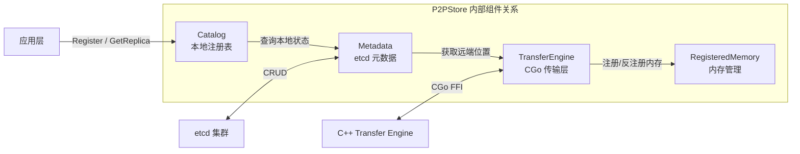
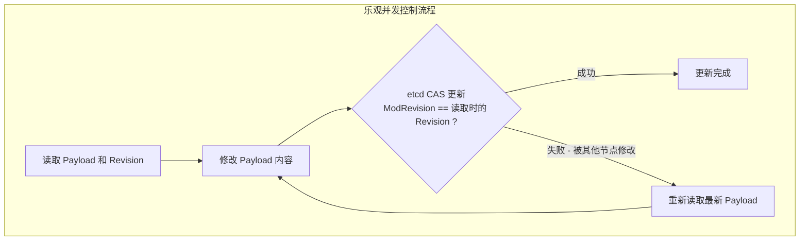
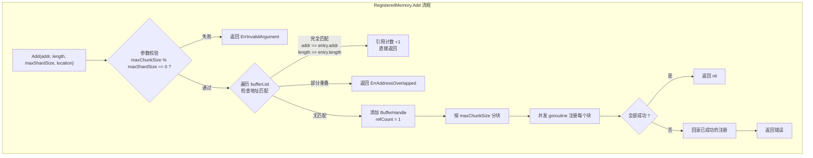

# P2P Store - 实现原理深度分析

## 1. 核心数据结构与分片机制

### 1.1 P2PStore 结构体

P2P Store 的核心实现位于 `core.go`，其结构体设计清晰地体现了**关注点分离**的原则：

```go
// core.go
type P2PStore struct {
    metadataConnString string           // etcd 连接字符串
    localServerName    string           // 本节点标识 (host:port)
    catalog            *Catalog         // 本地 Payload 注册表
    memory             *RegisteredMemory // 内存注册管理器
    metadata           *Metadata        // etcd 元数据客户端
    transfer           *TransferEngine  // C++ Transfer Engine 的 Go 封装
}
```

四个内部组件各自承担独立的职责：



### 1.2 数据分片策略

P2P Store 将连续的内存区域按固定大小 (`maxShardSize`) 切分为多个 Shard。这是实现并行传输和多源拉取的基础。

**分片常量**：

```go
// core.go
// 单次内存注册的最大块大小 (4GB)
const MAX_CHUNK_SIZE uint64 = 4096 * 1024 * 1024

// etcd 键前缀
const METADATA_KEY_PREFIX string = "mooncake/checkpoint/"
```

**分片过程详解**：

假设用户注册了两段内存 `[addr0, size0]` 和 `[addr1, size1]`，`maxShardSize = 64MB`：

```
addrList[0]: |-------- size0 = 192MB --------|
             |  Shard 0  |  Shard 1  |  Shard 2  |
             |   64MB    |   64MB    |   64MB    |

addrList[1]: |---- size1 = 100MB ----|
             |  Shard 3  |  Shard 4  |
             |   64MB    |   36MB    |
```

对应的 Register 代码实现：

```go
// core.go - Register 中的分片逻辑
for i := 0; i < len(addrList); i++ {
    addr, size := addrList[i], sizeList[i]
    payload.Size += size
    // 注册内存到 Transfer Engine
    err := store.memory.Add(addr, size, maxShardSize, location)
    // ...
    var offset uint64 = 0
    for ; offset < size; offset += maxShardSize {
        shardLength := maxShardSize
        if shardLength > size-offset {
            shardLength = size - offset  // 最后一个分片可能不足 maxShardSize
        }
        goldLocation := Location{
            SegmentName: store.localServerName,
            Offset:      uint64(addr) + offset,
        }
        shard := Shard{
            Length:      shardLength,
            Gold:        []Location{goldLocation},
            ReplicaList: nil,
        }
        payload.Shards = append(payload.Shards, shard)
    }
}
```

**设计要点**：

- `maxShardSize` 必须是 2 的整数幂，推荐值为 64MB
- `MAX_CHUNK_SIZE` (4GB) 必须能被 `maxShardSize` 整除
- 最后一个 Shard 的大小可能小于 `maxShardSize`
- 每个 Shard 的 `Offset` 字段记录的是绝对内存地址偏移

### 1.3 数据源选择与重试机制

P2P Store 的数据源选择策略分为两个阶段：

**阶段一 - 随机选择（负载均衡）**：

首次尝试时，从可用源中随机选择一个。优先选择 Replica（已拉取完成的副本），其次选择 Gold（原始注册源）：

```go
// metadata.go
func (s *Shard) getRandomLocation() *Location {
    r := rand.New(rand.NewSource(time.Now().UnixNano()))
    if len(s.ReplicaList) > 0 {
        index := r.Intn(len(s.ReplicaList))
        return &s.ReplicaList[index]       // 优先从 Replica 拉取
    } else if len(s.Gold) > 0 {
        index := r.Intn(len(s.Gold))
        return &s.Gold[index]              // 其次从 Gold 源拉取
    }
    return nil
}
```

**阶段二 - 顺序遍历（容错）**：

重试时按序遍历所有可用源，确保每个源都被尝试到：

```go
// metadata.go
func (s *Shard) getRetryLocation(retryTimes int) *Location {
    if len(s.ReplicaList) > retryTimes {
        return &s.ReplicaList[retryTimes]
    }
    retryTimes -= len(s.ReplicaList)
    if len(s.Gold) > retryTimes {
        return &s.Gold[retryTimes]
    }
    return nil
}
```

**统一入口**：

```go
// metadata.go
func (s *Shard) GetLocation(retryTimes int) *Location {
    if retryTimes == 0 {
        return s.getRandomLocation()       // 第一次随机选
    } else {
        return s.getRetryLocation(retryTimes - 1)  // 重试时顺序遍历
    }
}
```

**传输重试逻辑**：

```go
// core.go
func (store *P2PStore) performTransfer(ctx context.Context, source uintptr, shard Shard) error {
    retryCount := 0
    maxRetryCount := max(3, shard.Count())  // 至少重试 3 次，或可用源数量
    for retryCount < maxRetryCount {
        batchID, _ := store.transfer.allocateBatchID(1)
        location := shard.GetLocation(retryCount)
        if location == nil {
            break
        }
        targetID, _ := store.transfer.openSegment(location.SegmentName, retryCount == 0)

        request := TransferRequest{
            Opcode:       OPCODE_READ,
            Source:       uint64(source),
            TargetID:     targetID,
            TargetOffset: location.Offset,
            Length:       shard.Length,
        }
        store.transfer.submitTransfer(batchID, []TransferRequest{request})

        // 轮询等待传输完成（支持 context 取消）
        var status int
        for status == STATUS_WAITING || status == STATUS_PENDING {
            select {
            case <-ctx.Done():
                return ctx.Err()
            default:
                status, _, _ = store.transfer.getTransferStatus(batchID, 0)
            }
        }

        store.transfer.freeBatchID(batchID)
        if status == STATUS_COMPLETED {
            return nil
        }
        retryCount++
    }
    return ErrTooManyRetries
}
```

## 2. 元数据管理 - etcd Catalog

### 2.1 元数据模型

P2P Store 使用 etcd 作为全局元数据存储，所有键都以 `mooncake/checkpoint/` 为前缀。

**etcd 中存储的 JSON 格式**：

```go
// metadata.go - 数据结构定义
type Location struct {
    SegmentName string `json:"segment_name"`  // Transfer Engine segment 标识
    Offset      uint64 `json:"offset"`        // 内存偏移地址
}

type Shard struct {
    Length      uint64     `json:"size"`         // 分片数据大小
    Gold        []Location `json:"gold"`         // 原始数据源列表
    ReplicaList []Location `json:"replica_list"` // 副本数据源列表
}

type Payload struct {
    Name         string   `json:"name"`           // Payload 名称
    Size         uint64   `json:"size"`           // 总数据大小
    SizeList     []uint64 `json:"size_list"`      // 各段的大小
    MaxShardSize uint64   `json:"max_shard_size"` // 分片粒度
    Shards       []Shard  `json:"shards"`         // 分片列表
}
```

**实际存储示例**：

```json
{
  "name": "checkpoint-v1",
  "size": 134217728,
  "size_list": [134217728],
  "max_shard_size": 67108864,
  "shards": [
    {
      "size": 67108864,
      "gold": [{"segment_name": "10.0.0.2:12345", "offset": 140234567890}],
      "replica_list": [
        {"segment_name": "10.0.0.3:12345", "offset": 140567890123},
        {"segment_name": "10.0.0.4:12345", "offset": 140890123456}
      ]
    },
    {
      "size": 67108864,
      "gold": [{"segment_name": "10.0.0.2:12345", "offset": 140234635254}],
      "replica_list": [
        {"segment_name": "10.0.0.3:12345", "offset": 140567957487}
      ]
    }
  ]
}
```

### 2.2 元数据操作与乐观并发控制

Metadata 组件封装了 etcd 客户端的所有操作，核心设计是利用 etcd 的 **ModRevision** 实现乐观并发控制（CAS - Compare And Swap）。



**Create - 创建新 Payload（事务保证唯一性）**：

```go
// metadata.go
func (metadata *Metadata) Create(ctx context.Context, name string, payload *Payload) error {
    jsonData, _ := json.Marshal(payload)
    key := metadata.keyPrefix + name
    // etcd 事务：仅当 key 不存在时创建
    txnResp, err := metadata.etcdClient.Txn(ctx).
        If(clientv3.Compare(clientv3.Version(key), "=", 0)).
        Then(clientv3.OpPut(key, string(jsonData))).
        Commit()
    if !txnResp.Succeeded {
        return fmt.Errorf("error: key '%s' already exists", key)
    }
    return nil
}
```

**Update - 基于 Revision 的 CAS 更新**：

```go
// metadata.go
func (metadata *Metadata) Update(ctx context.Context, name string, payload *Payload, revision int64) (bool, error) {
    key := metadata.keyPrefix + name
    if payload.IsEmpty() {
        // 所有数据源都已移除，删除 key
        txnResp, _ := metadata.etcdClient.Txn(ctx).
            If(clientv3.Compare(clientv3.ModRevision(key), "=", revision)).
            Then(clientv3.OpDelete(key)).
            Commit()
        return txnResp.Succeeded, nil
    } else {
        // 更新 Payload
        jsonData, _ := json.Marshal(payload)
        txnResp, _ := metadata.etcdClient.Txn(ctx).
            If(clientv3.Compare(clientv3.ModRevision(key), "=", revision)).
            Then(clientv3.OpPut(key, string(jsonData))).
            Commit()
        return txnResp.Succeeded, nil
    }
}
```

**关键设计 - Payload 自动清理**：当 `IsEmpty()` 返回 `true`（所有 Shard 的 Gold 和 ReplicaList 均为空），Update 操作会自动从 etcd 中删除该 key，避免元数据残留。

```go
// metadata.go
func (s *Payload) IsEmpty() bool {
    for _, shard := range s.Shards {
        if len(shard.Gold) != 0 || len(shard.ReplicaList) != 0 {
            return false
        }
    }
    return true
}
```

**List - 前缀范围查询**：

```go
// metadata.go
func (metadata *Metadata) List(ctx context.Context, namePrefix string) ([]*Payload, error) {
    startRange := metadata.keyPrefix + namePrefix
    stopRange := metadata.keyPrefix + namePrefix + string([]byte{0xFF})
    response, _ := metadata.etcdClient.Get(ctx, startRange, clientv3.WithRange(stopRange))
    // 反序列化每条记录...
}
```

### 2.3 本地 Catalog - 线程安全注册表

Catalog 是一个简单但关键的组件，它维护了当前 P2PStore 实例已注册（或已拉取）的 Payload 信息：

```go
// catalog.go
type CatalogParams struct {
    IsGold       bool       // true = 通过 Register 注册, false = 通过 GetReplica 获取
    AddrList     []uintptr  // 内存地址列表
    SizeList     []uint64   // 大小列表
    MaxShardSize uint64     // 分片粒度
}

type Catalog struct {
    entries map[string]CatalogParams
    mu      sync.Mutex  // 互斥锁保证并发安全
}
```

Catalog 的作用包括：
- **防止重复操作**：Register 和 GetReplica 前检查 `Contains(name)`
- **记录本地状态**：Unregister 和 DeleteReplica 需要知道本地内存地址以进行反注册
- **区分角色**：`IsGold` 标识区分 Gold 源和 Replica

## 3. Transfer Engine Go 绑定

### 3.1 CGo 封装层设计

P2P Store 使用 Go 实现业务逻辑，但底层数据传输依赖 C++ 实现的 Transfer Engine。`transfer_engine.go` 通过 CGo 实现了 Go 到 C 的 FFI（Foreign Function Interface）调用。

```go
// transfer_engine.go
/*
 * All memory pointed to by the "char *" parameters will not be used
 * after the C function returns.
 */

//#include "../../../mooncake-transfer-engine/include/transfer_engine_c.h"
//#include <stdlib.h>
import "C"
import "unsafe"
```

**TransferEngine 结构体**：

```go
type TransferEngine struct {
    engine C.transfer_engine_t  // C 层引擎句柄
}
```

### 3.2 CGo 接口映射

| Go 方法 | C 函数 | 用途 |
|---------|--------|------|
| `NewTransferEngine()` | `createTransferEngine()` | 创建引擎实例 |
| `Close()` | `destroyTransferEngine()` | 销毁引擎 |
| `installTransport()` | `installTransport()` | 安装传输协议 (RDMA/TCP) |
| `registerLocalMemory()` | `registerLocalMemory()` | 注册本地内存到引擎 |
| `unregisterLocalMemory()` | `unregisterLocalMemory()` | 反注册本地内存 |
| `allocateBatchID()` | `allocateBatchID()` | 分配传输批次 ID |
| `submitTransfer()` | `submitTransfer()` | 提交传输请求 |
| `getTransferStatus()` | `getTransferStatus()` | 查询传输状态 |
| `freeBatchID()` | `freeBatchID()` | 释放批次 ID |
| `openSegment()` | `openSegment()` / `openSegmentNoCache()` | 打开远端 Segment |

**传输请求数据结构**：

```go
// transfer_engine.go
const (
    OPCODE_READ      = 0    // 从远端读取
    OPCODE_WRITE     = 1    // 写入远端
    STATUS_WAITING   = 0    // 等待中
    STATUS_PENDING   = 1    // 处理中
    STATUS_INVALID   = 2    // 无效
    STATUS_CANCELED  = 3    // 已取消
    STATUS_COMPLETED = 4    // 已完成
    STATUS_TIMEOUT   = 5    // 超时
    STATUS_FAILED    = 6    // 失败
)

type TransferRequest struct {
    Opcode       int     // 操作码 (READ/WRITE)
    Source       uint64  // 本地内存地址
    TargetID     int64   // 远端 Segment ID
    TargetOffset uint64  // 远端偏移
    Length       uint64  // 传输长度
}
```

**CGo 数据转换示例**：

```go
// transfer_engine.go - submitTransfer 中的 Go 到 C 数据转换
func (engine *TransferEngine) submitTransfer(batchID BatchID, requests []TransferRequest) error {
    requestSlice := make([]C.transfer_request_t, len(requests))
    for i, req := range requests {
        requestSlice[i] = C.transfer_request_t{
            opcode:        C.int(req.Opcode),
            source:        unsafe.Pointer(uintptr(req.Source)),
            target_id:     C.segment_id_t(req.TargetID),
            target_offset: C.uint64_t(req.TargetOffset),
            length:        C.uint64_t(req.Length),
        }
    }
    ret := C.submitTransfer(engine.engine, C.batch_id_t(batchID),
        &requestSlice[0], C.size_t(len(requests)))
    if ret != 0 {
        return ErrTransferEngine
    }
    return nil
}
```

### 3.3 内存安全约定

CGo 调用中最关键的约束是内存生命周期管理。代码注释明确说明了约定：

> All memory pointed to by the "char *" parameters will not be used after the C function returns.

这意味着所有传入 C 函数的字符串在函数返回后即可安全释放，代码中通过 `defer C.free()` 模式实现：

```go
func NewTransferEngine(...) (*TransferEngine, error) {
    metadataConnStringCStr := C.CString(metadataConnString)
    localServerNameCStr := C.CString(localServerName)
    localIpAddressCStr := C.CString(localIpAddress)
    defer C.free(unsafe.Pointer(metadataConnStringCStr))
    defer C.free(unsafe.Pointer(localServerNameCStr))
    defer C.free(unsafe.Pointer(localIpAddressCStr))
    // ...
}
```

## 4. RegisteredMemory - 内存注册管理

### 4.1 设计目标

RegisteredMemory 解决的核心问题是：**内存注册/反注册是昂贵的操作**（需要与 RDMA 设备交互），因此必须支持引用计数以避免重复注册，同时防止内存区域重叠。

```go
// registered_memory.go
type BufferHandle struct {
    addr     uintptr    // 内存起始地址
    length   uint64     // 内存长度
    refCount int        // 引用计数
}

type RegisteredMemory struct {
    engine       *TransferEngine
    bufferList   []BufferHandle
    mu           sync.Mutex
    maxChunkSize uint64       // 单次注册的最大块大小 (4GB)
}
```

### 4.2 内存注册流程



**核心实现**：

```go
// registered_memory.go
func (memory *RegisteredMemory) Add(addr uintptr, length uint64, maxShardSize uint64, location string) error {
    // 参数校验
    if memory.maxChunkSize == 0 || memory.maxChunkSize%maxShardSize != 0 {
        return ErrInvalidArgument
    }

    memory.mu.Lock()
    for idx, entry := range memory.bufferList {
        if entry.addr == addr && entry.length == length {
            // 完全匹配：引用计数 +1
            memory.bufferList[idx].refCount++
            memory.mu.Unlock()
            return nil
        }
        // 检查重叠
        entryEndAddr := entry.addr + uintptr(entry.length)
        requestEndAddr := addr + uintptr(length)
        if addr < entryEndAddr && requestEndAddr > entry.addr {
            memory.mu.Unlock()
            return ErrAddressOverlapped
        }
    }
    memory.bufferList = append(memory.bufferList,
        BufferHandle{addr: addr, length: length, refCount: 1})
    memory.mu.Unlock()

    // 并发注册内存块
    var wg sync.WaitGroup
    errChan := make(chan error, 1)
    successfulTasks := make([]uintptr, 0)

    for offset := uint64(0); offset < length; offset += memory.maxChunkSize {
        chunkSize := memory.maxChunkSize
        if chunkSize > length-offset {
            chunkSize = length - offset
        }
        wg.Add(1)
        go func(offset, chunkSize uint64) {
            defer wg.Done()
            baseAddr := addr + uintptr(offset)
            err := memory.engine.registerLocalMemory(baseAddr, chunkSize, location)
            if err != nil {
                // 通过 channel 传递第一个错误
                select {
                case errChan <- err:
                    close(errChan)
                default:
                }
            } else {
                mu.Lock()
                successfulTasks = append(successfulTasks, baseAddr)
                mu.Unlock()
            }
        }(offset, chunkSize)
    }
    wg.Wait()

    // 错误回滚
    if err := <-errChan; err != nil {
        for _, baseAddr := range successfulTasks {
            memory.engine.unregisterLocalMemory(baseAddr)
        }
        return err
    }
    return nil
}
```

### 4.3 内存反注册与引用计数

Remove 操作是 Add 的逆过程，关键特点是**引用计数归零时才实际反注册**：

```go
// registered_memory.go
func (memory *RegisteredMemory) Remove(addr uintptr, length uint64, maxShardSize uint64) error {
    memory.mu.Lock()
    found := false
    for idx, entry := range memory.bufferList {
        if entry.addr == addr && entry.length == length {
            found = true
            entry.refCount--
            if entry.refCount == 0 {
                // 引用计数归零，从列表中移除
                memory.bufferList = append(memory.bufferList[:idx],
                    memory.bufferList[idx+1:]...)
                break
            }
        }
    }
    memory.mu.Unlock()

    // 并发反注册内存块
    var wg sync.WaitGroup
    for offset := uint64(0); offset < length; offset += memory.maxChunkSize {
        wg.Add(1)
        go func(offset uint64) {
            defer wg.Done()
            memory.engine.unregisterLocalMemory(addr + uintptr(offset))
        }(offset)
    }
    wg.Wait()
    return nil
}
```

### 4.4 分块注册的必要性

为什么需要将大内存区域分成 `maxChunkSize`（4GB）的块分别注册？

1. **RDMA 硬件限制**：部分 RDMA 设备对单次注册的内存大小有上限
2. **并行化加速**：大内存区域可以通过多个 goroutine 并发注册
3. **减少失败影响**：单块注册失败时只需回滚该块，而非整个区域

## 5. 错误处理机制

### 5.1 错误类型体系

P2P Store 定义了 7 种明确的错误类型，覆盖了所有可能的异常场景：

```go
// error.go
var ErrInvalidArgument   = errors.New("error: invalid argument")
var ErrAddressOverlapped = errors.New("error: address overlapped")
var ErrPayloadOpened     = errors.New("error: payload has been replicated")
var ErrPayloadNotOpened  = errors.New("error: payload does not replicated")
var ErrPayloadNotFound   = errors.New("error: payload not found in metadata")
var ErrTooManyRetries    = errors.New("error: too many retries")
var ErrTransferEngine    = errors.New("error: transfer engine core")
```

### 5.2 错误处理策略矩阵

| 错误场景 | 错误类型 | 处理策略 |
|----------|----------|----------|
| 参数校验失败 | `ErrInvalidArgument` | 立即返回，不做回滚 |
| 内存地址重叠 | `ErrAddressOverlapped` | 立即返回，拒绝注册 |
| 重复 Register | `ErrPayloadOpened` | 立即返回，幂等保护 |
| 未注册就 Unregister | `ErrPayloadNotOpened` | 立即返回 |
| etcd 中无此 Payload | `ErrPayloadNotFound` | 立即返回 |
| 传输重试耗尽 | `ErrTooManyRetries` | 已尝试所有可用源 |
| C++ 引擎错误 | `ErrTransferEngine` | 传播到调用方 |

### 5.3 级联错误处理

在 Register 失败时，需要回滚已完成的内存注册：

```go
// core.go - Register 中的回滚逻辑
func (store *P2PStore) Register(...) error {
    var bufferList []Buffer
    for i := 0; i < len(addrList); i++ {
        err := store.memory.Add(addr, size, maxShardSize, location)
        if err != nil {
            // 回滚所有已注册的 buffer
            store.unregisterBuffers(bufferList, maxShardSize)
            return err
        }
        bufferList = append(bufferList, Buffer{addr: addr, size: size})
    }

    // 写入 etcd
    err = store.metadata.Put(ctx, name, &payload)
    if err != nil {
        // etcd 写入失败，也需要回滚内存注册
        store.unregisterBuffers(bufferList, maxShardSize)
        return err
    }
    return nil
}
```

### 5.4 GetReplica 的一致性保障

GetReplica 操作中最精妙的设计是**二次校验机制**，确保拉取到的数据是完整有效的：

```go
// core.go
func (store *P2PStore) GetReplica(...) error {
    payload, revision, _ := store.metadata.Get(ctx, name)

    for {
        // 执行数据拉取
        err = store.doGetReplica(ctx, payload, addrList, sizeList)

        // 二次校验：检查元数据是否在拉取过程中被修改
        newPayload, recheckRevision, _ := store.metadata.Get(ctx, name)

        if revision == recheckRevision {
            break  // Revision 未变，数据有效
        }
        if isSubsetOf(payload, newPayload) {
            break  // 数据源只增不减，已拉取的数据仍有效
        }
        // 否则重新拉取（数据源减少可能导致数据不完整）
    }

    return store.updatePayloadMetadata(ctx, name, addrList, sizeList, payload, revision)
}
```

**isSubsetOf 检查**：如果新的元数据包含了旧元数据的所有 Gold 和 Replica 位置，说明数据源只增不减，已拉取的数据仍然有效。

```go
// core.go
func isSubsetOf(old *Payload, new *Payload) bool {
    if len(old.Shards) != len(new.Shards) {
        return false
    }
    for i := 0; i < len(old.Shards); i += 1 {
        for _, value := range old.Shards[i].Gold {
            if !contains(new.Shards[i].Gold, value) {
                return false
            }
        }
        for _, value := range old.Shards[i].ReplicaList {
            if !contains(new.Shards[i].ReplicaList, value) {
                return false
            }
        }
    }
    return true
}
```

## 6. 可扩展性分析

### 6.1 带宽扩展模型

P2P Store 的分发带宽随节点数呈**线性增长**。设单节点出口带宽为 B，N 个节点需要拉取数据：

| 方案 | 总分发时间 | 带宽利用率 |
|------|-----------|-----------|
| 中心化分发 | O(N * DataSize / B) | 仅源节点出口带宽 |
| P2P 分发（理想） | O(log(N) * DataSize / B) | 所有节点带宽 |

### 6.2 etcd 元数据压力分析

每次 GetReplica 操作涉及的 etcd 操作：

1. **Get** - 获取 Payload 元数据（1 次读）
2. **Get** - 二次校验（1 次读）
3. **Update** - 更新 Replica 位置（1 次 CAS 写，可能重试）

对于 N 个节点的集群，etcd 的操作量为 O(N)，在大规模集群中（如 1000+ 节点）需要关注 etcd 的写入性能。潜在的优化方向包括：
- 批量更新 Replica 信息
- 分层元数据（如使用多个 etcd 键分散热点）
- 元数据缓存与延迟更新

### 6.3 并发模型分析

P2P Store 在多个层面使用了 Go 的并发原语：

| 层面 | 并发机制 | 用途 |
|------|---------|------|
| Shard 并行传输 | `sync.WaitGroup` + goroutine | `doGetReplica` 中每个 Shard 独立并行传输 |
| 内存注册并行 | `sync.WaitGroup` + goroutine | `RegisteredMemory.Add` 中多块并行注册 |
| Catalog 线程安全 | `sync.Mutex` | 保护本地注册表的并发访问 |
| RegisteredMemory 线程安全 | `sync.Mutex` | 保护 bufferList 的并发访问 |
| 错误传播 | buffered channel | 只捕获第一个错误，避免 goroutine 阻塞 |

**错误传播模式**（在 `doGetReplica` 和 `RegisteredMemory.Add` 中广泛使用）：

```go
errChan := make(chan error, 1)  // 容量为 1 的缓冲 channel
// 在 goroutine 中：
select {
case errChan <- err:   // 只有第一个错误会被捕获
default:               // 后续错误被丢弃，避免阻塞
}
```

### 6.4 完整的数据流转路径

```mermaid
flowchart TD
    subgraph register["Register 数据流"]
        R1["应用调用 Register"] --> R2["Catalog.Contains 检查"]
        R2 -->|"未注册"| R3["RegisteredMemory.Add<br/>注册内存到 Transfer Engine"]
        R3 --> R4["构建 Shard 列表<br/>按 maxShardSize 切分"]
        R4 --> R5{"forceCreate ?"}
        R5 -->|"true"| R6["Metadata.Put<br/>直接写入 etcd"]
        R5 -->|"false"| R7["Metadata.Create<br/>事务创建 (唯一性保证)"]
        R6 --> R8["Catalog.Add<br/>记录本地状态"]
        R7 --> R8
    end

    subgraph getreplica["GetReplica 数据流"]
        G1["应用调用 GetReplica"] --> G2["Metadata.Get<br/>获取 Payload + Revision"]
        G2 --> G3["doGetReplica<br/>并行拉取所有 Shard"]
        G3 --> G4["每个 Shard 独立 goroutine"]
        G4 --> G5["Shard.GetLocation<br/>选择数据源"]
        G5 --> G6["TransferEngine.submitTransfer<br/>提交传输请求"]
        G6 --> G7["轮询等待传输完成"]
        G7 --> G8{"传输成功 ?"}
        G8 -->|"失败"| G9["重试下一个源"]
        G9 --> G5
        G8 -->|"成功"| G10["所有 Shard 完成"]
        G10 --> G11["二次校验 Revision"]
        G11 -->|"数据有效"| G12["updatePayloadMetadata<br/>CAS 更新 Replica 位置"]
        G11 -->|"数据源减少"| G3
        G12 --> G13["Catalog.Add<br/>记录本地状态"]
    end
```



## 7. 小结

P2P Store 的实现展现了以下核心技术决策：

| 决策 | 实现 | 技术理由 |
|------|------|----------|
| Go + CGo 混合架构 | 业务逻辑用 Go，传输层用 C++ | Go 提供并发和 etcd 生态，C++ 提供 RDMA 性能 |
| etcd 乐观并发控制 | ModRevision CAS | 避免分布式锁，减少 etcd 负载 |
| 分片固定大小 | maxShardSize (推荐 64MB) | 平衡并行度与元数据开销 |
| 随机 + 顺序选源 | 首次随机，重试顺序 | 首次负载均衡，重试全覆盖 |
| 引用计数内存管理 | RegisteredMemory | 避免重复注册的性能开销 |
| 二次校验一致性 | GetReplica 后重读 Revision | 无锁情况下保证数据完整性 |
| Payload 自动清理 | IsEmpty() 时删除 etcd key | 防止元数据泄漏 |
