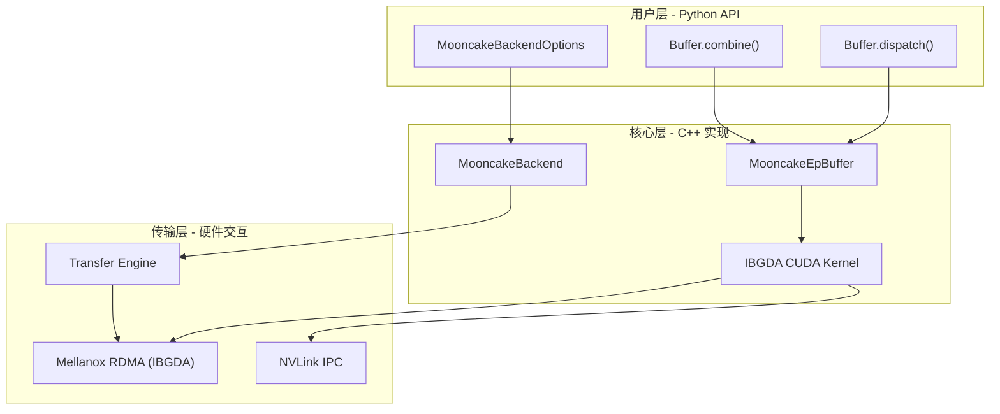
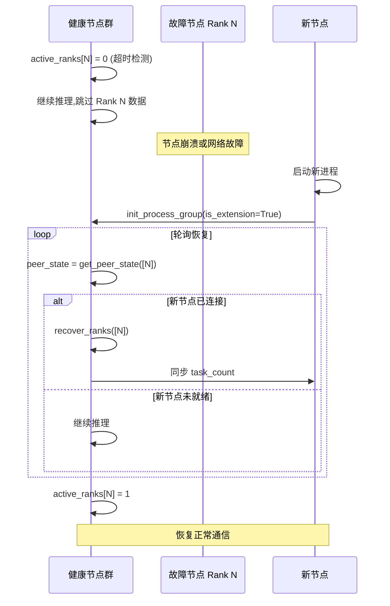

# Module 07 - Expert Parallelism 概览

## 1. MoE 背景与 Expert Parallelism 的挑战

### 1.1 Mixture of Experts (MoE) 基础

Mixture of Experts (MoE) 是一种稀疏激活的模型架构,在 Transformer 的 Feed-Forward Network (FFN) 层中部署多个"专家"(Expert)子网络。每个输入 token 通过一个 **Gate/Router** 网络选择 Top-K 个专家进行计算,而非激活所有参数。这种设计使得模型在保持巨大参数量的同时,每个 token 的实际计算量仅与被选中的少数专家相关。

典型的 MoE 推理流程如下:

```
输入 Tokens -> Gate/Router -> Top-K 专家选择 -> 专家计算 -> 加权合并输出
```

在 DeepSeek-V3/R1 等大规模模型中,MoE 层通常包含 256 个专家,每个 token 选择 8 个专家,模型参数量可达数百 B,而实际激活参数量仅为数十 B。

### 1.2 Expert Parallelism (EP) 通信瓶颈

在分布式推理场景下,不同的专家分布在不同的 GPU 节点上。Expert Parallelism 将专家均匀分配到各 rank(即各 GPU 设备),每个 rank 负责 `num_experts / num_ranks` 个本地专家。这带来了两个核心通信操作:

- **Dispatch(分发)**: 每个 rank 将自己的输入 token 根据 Top-K 路由结果发送到目标专家所在的 rank
- **Combine(合并)**: 专家计算完毕后,结果需要从各 rank 回送并加权合并

与传统 AllReduce/AllGather 等集合通信不同,EP 通信具有以下特殊性:

| 特性 | 传统集合通信 | EP 通信 |
|------|-------------|---------|
| 通信模式 | 对称,所有节点发送/接收相同大小的数据 | 非对称,每对 rank 之间的数据量取决于路由结果 |
| 数据量可预测性 | 固定已知 | 每轮推理动态变化 |
| 延迟敏感度 | 较高 | 极高(MoE 层在推理关键路径上) |
| 容错需求 | 通常不支持 | 大规模部署下节点故障是常态 |

### 1.3 为什么需要专门的 EP 通信方案

传统方案如 NCCL 的 AllToAll 可以实现 EP 通信,但存在以下问题:

1. **延迟过高**: NCCL 的 AllToAll 需要同步所有 rank,无法充分利用稀疏路由的特性
2. **缺乏容错**: NCCL 要求所有 rank 同时参与,单个 rank 故障会导致整个通信死锁
3. **无法流水线化**: 无法将发送阶段和接收阶段解耦,难以与计算重叠

Mooncake EP 正是为解决这些问题而设计的。

## 2. Mooncake EP 整体架构

### 2.1 架构总览

Mooncake EP 的设计目标是提供与 DeepEP API 完全兼容的低延迟 EP 通信方案,同时增加容错能力。其核心架构包含三个层次:



### 2.2 两大核心组件

Mooncake EP 模块由两个互补的核心组件构成:

**Mooncake EP Buffer** - 低延迟 dispatch/combine 通信引擎:
- 基于 IBGDA (In-Band GPU Direct Access) 技术,GPU 直接发起 RDMA 操作
- 支持 FP8 量化传输,减少带宽消耗
- 双缓冲(Double Buffering)机制,实现流水线化
- 支持 NVLink 同节点快速传输

**Mooncake Backend** - PyTorch c10d 后端,替代 NCCL/Gloo:
- 提供标准 PyTorch 集合通信接口(broadcast, allreduce, allgather 等)
- 基于 Transfer Engine 实现跨节点数据传输
- 内置容错机制,支持 active ranks 追踪和故障恢复

## 3. Mooncake EP 与 DeepEP 兼容性

### 3.1 API 兼容设计

Mooncake EP 的 API 设计目标是与 DeepEP 完全兼容,仅增加容错相关的参数:

| API | DeepEP | Mooncake EP | 差异 |
|-----|--------|-------------|------|
| `dispatch()` | `low_latency_dispatch(x, topk_idx, ...)` | `dispatch(x, topk_idx, active_ranks, ..., timeout_us)` | 新增 `active_ranks` 和 `timeout_us` |
| `combine()` | `low_latency_combine(x, topk_idx, ...)` | `combine(x, topk_idx, ..., active_ranks, timeout_us)` | 新增 `active_ranks` 和 `timeout_us` |
| `Buffer` 初始化 | 基于 NCCL group | 基于 Mooncake Backend group | 后端不同 |

### 3.2 关键差异

当前 Mooncake EP 仅支持 **低延迟传输模式**(Low-Latency Mode),这与 DeepEP 的低延迟模式对应。关键的技术差异包括:

- **传输后端**: DeepEP 使用 NCCL,Mooncake EP 使用 IBGDA + Transfer Engine
- **容错支持**: Mooncake EP 通过 `active_ranks` tensor 实时追踪节点状态
- **NVLink 优化**: Mooncake EP 在同节点内自动检测并使用 NVLink IPC 传输

## 4. 容错机制

### 4.1 Active Ranks 机制

容错是 Mooncake EP 相比 DeepEP 的核心增强。其实现基于 `active_ranks` tensor:

```cpp
// mooncake-ep/include/mooncake_worker.cuh
struct TransferGroupMeta {
    int rank;
    int size;
    bool* activeRanks;        // 主机端活跃 rank 标记
    bool* activeRanksDevice;  // 设备端活跃 rank 标记(GPU 可见)
    at::Tensor activeRanksTensor; // PyTorch tensor 形式,供上层使用
    // ...
};
```

`active_ranks` 是一个 `(num_ranks,)` 大小的 int32 tensor,值为 1 表示对应 rank 活跃,值为 0 表示该 rank 已被标记为故障。

### 4.2 超时检测

在 CUDA kernel 内部,通过 GPU 时钟周期进行超时检测:

```cpp
// mooncake-ep/src/mooncake_ep_kernel.cu - dispatch 接收阶段
unsigned long long start_time = clock64();
while ((num_recv_tokens = ld_acquire_sys_global(
    rdma_recv_signal_buffer + local_expert_idx * num_ranks + src_rank)) == 0) {
    unsigned long long end_time = clock64();
    if (timeout_ticks != -1 && end_time - start_time > timeout_ticks) {
        active_ranks[src_rank] = 0;  // 标记故障 rank
    }
    if (!active_ranks[src_rank]) {
        num_recv_tokens = -1;  // 跳过该 rank 的数据
        break;
    }
}
```

超时时间通过 `timeout_us` 参数设置,内部转换为 GPU 时钟 ticks:

```cpp
// mooncake-ep/src/mooncake_ep_buffer.cpp
int64_t timeout_ticks = timeout_us == -1 ? -1
    : (int64_t)clock_rate_khz * (int64_t)timeout_us / 1000;
```

### 4.3 故障恢复流程



恢复的关键代码路径:

```cpp
// mooncake-ep/src/mooncake_backend.cpp
void MooncakeBackend::recoverRanks(const std::vector<int>& ranks) {
    for (const int rank : ranks) {
        TORCH_CHECK(meta_.peerConnected[rank]);
        meta_.activeRanks[rank] = true;
        meta_.store->set(
            "extension_task_count_" + std::to_string(meta_.backendIndex) +
            "_" + std::to_string(rank),
            std::to_string(meta_.taskCount));
    }
}
```

### 4.4 与 EPLB 集成

Mooncake EP 的容错机制设计为与 EPLB (Expert-Level Load Balancing) 模块协同工作。当某个 rank 被标记为故障时:

1. EP 层通过 `active_ranks` 跳过故障 rank 的通信
2. EPLB 层感知到故障 rank 上的专家不可用,动态调整路由策略
3. 新节点恢复后,EP 层重新激活 rank,EPLB 层逐步恢复正常路由

## 5. Buffer-Based Dispatch/Combine 架构

### 5.1 双缓冲机制

Mooncake EP 采用双缓冲(Double Buffering)设计,使得当前轮次的通信和上一轮次的缓冲区清理可以重叠执行:

```cpp
// mooncake-ep/src/mooncake_ep_buffer.cpp - dispatch
auto buffer = layout.buffers[buffer_idx];
auto next_buffer = layout.buffers[buffer_idx ^= 1];  // 交替使用两个缓冲区
```

每个缓冲区包含四个区域:

```cpp
// mooncake-ep/include/mooncake_ep_buffer.h
struct BufferLayout {
    int* rdma_send_signal_buffer;   // 发送信号区
    int* rdma_recv_signal_buffer;   // 接收信号区
    void* rdma_send_data_buffer;    // 发送数据区
    void* rdma_recv_data_buffer;    // 接收数据区
};
```

### 5.2 Dispatch 数据流

Dispatch 操作将输入 token 根据 Top-K 路由结果分发到各专家所在的 rank:

1. **FP8 量化(可选)**: 将 BF16 输入转换为 FP8 格式,减少传输数据量
2. **打包**: 每个消息包含 `[src_token_idx | hidden_data | fp8_scales]`
3. **发送**: 通过 IBGDA 将数据写入目标 rank 的接收缓冲区
4. **信号**: 发送完成后通过原子操作通知目标 rank
5. **接收端打包**: 目标 rank 将接收到的数据按专家维度重排

### 5.3 Combine 数据流

Combine 操作将专家计算结果回送并加权合并:

1. **发送**: 各 rank 将本地专家的输出通过 IBGDA 回送到源 rank
2. **信号**: 通过原子操作通知源 rank 数据到达
3. **加权合并**: 源 rank 根据 Top-K 权重对所有专家输出进行加权求和

### 5.4 发送/接收阶段解耦

dispatch 和 combine 操作均支持将发送阶段和接收阶段解耦,通过 `phases` 参数控制:

```cpp
// mooncake-ep/include/mooncake_ep_configs.cuh
#define LOW_LATENCY_SEND_PHASE 1
#define LOW_LATENCY_RECV_PHASE 2
```

这使得用户可以通过 `return_recv_hook=True` 先执行发送阶段,在合适的时机再触发接收阶段,实现通信与计算的重叠:

```cpp
// mooncake-ep/src/mooncake_ep_buffer.cpp
launcher(return_recv_hook
    ? LOW_LATENCY_SEND_PHASE
    : (LOW_LATENCY_SEND_PHASE | LOW_LATENCY_RECV_PHASE));

// 接收回调
std::optional<std::function<void()>> recv_hook = std::nullopt;
if (return_recv_hook)
    recv_hook = [=]() { launcher(LOW_LATENCY_RECV_PHASE); };
```

## 6. 核心数据结构

### 6.1 BufferPair - 双缓冲区布局

```cpp
// mooncake-ep/include/mooncake_ep_buffer.h
struct BufferPair {
    size_t total_bytes = 0;
    BufferLayout buffers[2];  // 两个交替使用的缓冲区

    BufferPair(void* rdma_buffer, int num_max_dispatch_tokens_per_rank,
               int hidden, int num_ranks, int num_experts) {
        // 信号缓冲区大小: num_experts * sizeof(int)
        size_t signaling_buffer_bytes = num_experts * sizeof(int);
        // 数据缓冲区大小: num_experts * max_tokens * (2 * int4 + hidden * bf16)
        size_t send_recv_buffer_bytes = num_experts *
            num_max_dispatch_tokens_per_rank *
            (2 * sizeof(int4) + hidden * sizeof(nv_bfloat16));
        // ...
    }
};
```

### 6.2 MooncakeEpBuffer - EP 缓冲区管理器

```cpp
// mooncake-ep/include/mooncake_ep_buffer.h
struct MooncakeEpBuffer {
    void* gdr_buffer = nullptr;    // GPU Direct RDMA 缓冲区
    void* ctrl_buf = nullptr;      // IBGDA 控制缓冲区 (1 GiB)
    ibv_mr* mr;                    // RDMA 内存注册
    std::vector<mlx5gda_qp*> qps;  // IBGDA 队列对
    void* raddrs = nullptr;        // 远程地址数组(GPU 上)
    void* rkeys = nullptr;         // 远程密钥数组(GPU 上)
    void* qp_devctxs = nullptr;    // QP 设备上下文(GPU 上)
    int32_t* nvlink_available;     // NVLink 可用性数组
    void** ipc_peer_ptrs;          // IPC 对等指针
    void* workspace = nullptr;     // 32 MiB 工作空间
};
```

## 7. 性能关键配置

源码中定义了多个影响性能的关键配置常量:

```cpp
// mooncake-ep/include/mooncake_ep_configs.cuh
#define NUM_WORKSPACE_BYTES (32 * 1024 * 1024)   // 32 MiB 工作空间
#define NUM_MAX_LOCAL_EXPERTS 1024                // 最大本地专家数
#define MAX_QP_COUNT 256                          // 最大 QP 数量

// mooncake-ep/include/mooncake_worker.cuh
static constexpr size_t kBufferSize = 1u << 24;   // 16 MiB 缓冲区
static constexpr size_t kMaxNumRanks = 64;         // 最大 rank 数

// 支持的 hidden 维度
// SWITCH_HIDDEN: 2560, 4096, 5120, 7168
```

## 8. 模块间关系

Mooncake EP 模块与 Mooncake 项目中的其他模块紧密关联:

- **Transfer Engine**: MooncakeBackend 使用 Transfer Engine 进行跨节点 RDMA 传输
- **EPLB**: 配合 EP 容错机制,在专家级别实现负载均衡
- **P2P Store**: 通过 PyTorch c10d Store 进行元数据同步和连接建立

---

> **下一篇**: [02-mooncake-backend.md](02-mooncake-backend.md) - 深入分析 MooncakeBackend 作为 PyTorch c10d 后端的实现细节
