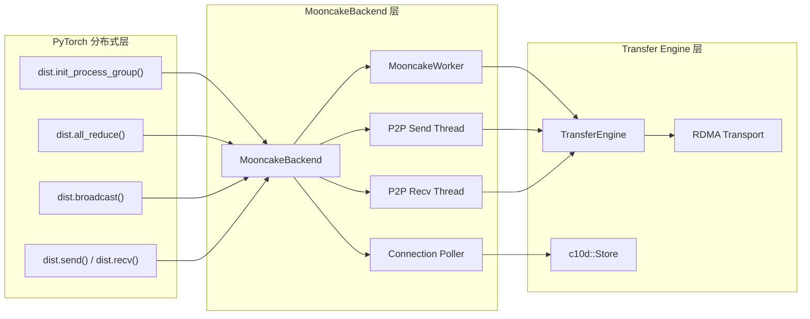
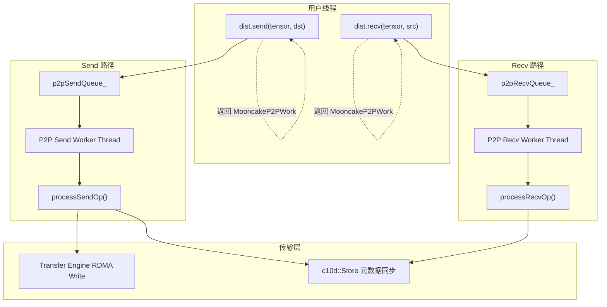

# Module 07 - MooncakeBackend 深度解析

## 1. 概述

MooncakeBackend 是一个完整的 PyTorch c10d 分布式通信后端实现,可以替代 NCCL 和 Gloo,为 MoE 推理场景提供容错集合通信能力。它基于 Mooncake Transfer Engine 构建,通过 RDMA 实现高效的跨节点数据传输,同时内置了节点故障检测与恢复机制。

### 1.1 核心设计目标

- **标准 PyTorch 集合通信接口**: 实现 `c10d::Backend` 的所有关键虚函数
- **容错通信**: 通信操作在部分 rank 故障时仍能继续执行
- **异步执行**: 所有操作通过 Worker 线程异步处理,返回 `c10d::Work` future
- **CPU/GPU 双模式**: 同时支持 CPU tensor 和 CUDA tensor 通信

### 1.2 类继承关系

```
c10d::Backend (PyTorch 标准接口)
    |
    +-- MooncakeBackend
            |
            +-- 使用 MooncakeWorker 执行集合操作
            +-- 使用 TransferEngine 进行数据传输
            +-- 使用 P2P Worker Threads 处理 send/recv
```

## 2. 架构设计

### 2.1 整体组件关系



### 2.2 静态成员与单例设计

MooncakeBackend 使用静态成员确保跨多个 Backend 实例共享关键资源:

```cpp
// mooncake-ep/src/mooncake_backend.cpp
std::string MooncakeBackend::hostIp_ = "127.0.0.1";
TransferEngine MooncakeBackend::engine_ = TransferEngine(true);
bool MooncakeBackend::engineInitialized_ = false;
int MooncakeBackend::backendIndex_ = 0;
MooncakeWorker MooncakeBackend::worker_;
```

- `engine_`: 全局唯一的 Transfer Engine 实例,负责所有 RDMA 传输
- `worker_`: 全局唯一的 Worker,处理集合操作的批量传输
- `backendIndex_`: 自增索引,支持创建多个 Backend 实例(如 CPU + GPU 各一个)

## 3. 支持的集合通信操作

### 3.1 操作总览

| 操作 | CPU 支持 | GPU 支持 | 实现方式 |
|------|---------|---------|---------|
| `send` | 是 | 是 | P2P Worker Thread + Transfer Engine |
| `recv` | 是 | 是 | P2P Worker Thread + Transfer Engine |
| `broadcast` | 是 | 是 | MooncakeWorker 一对多传输 |
| `allreduce` | 是 | 是 | MooncakeWorker + Reduce Kernel |
| `allgather` | 是 | 是 | MooncakeWorker 汇聚 |
| `_allgather_base` | 是 | 是 | MooncakeWorker 连续缓冲区汇聚 |
| `_reduce_scatter_base` | 是 | 是 | MooncakeWorker + Reduce Kernel |
| `alltoall` | 是 | 是 | MooncakeWorker 全交换 |
| `barrier` | 是 | 否 | MooncakeWorker 同步 |

### 3.2 集合操作实现模式

所有集合操作(除 send/recv 外)都遵循统一的实现模式:通过 `MooncakeWorker` 的 `putTaskCpu` 或 `putTaskCuda` 提交异步任务。每个任务需要两个回调函数:

1. **tensorToBuffer**: 将本地 tensor 数据拷贝到传输缓冲区
2. **bufferToTensor**: 将从远程收集到的数据写回本地 tensor

以 `allreduce` 为例:

```cpp
// mooncake-ep/src/mooncake_backend.cpp
c10::intrusive_ptr<c10d::Work> MooncakeBackend::allreduce(
    std::vector<at::Tensor>& tensors, const c10d::AllreduceOptions& opts) {
    TORCH_CHECK(tensors.size() == 1, MULTI_DEVICE_ERROR_MSG);
    auto tensor = tensors.back();
    size_t tensorSize = tensor.numel() * tensor.element_size();

    if (isCpu_) {
        auto numRanks = meta_.size;
        return worker_.putTaskCpu(
            c10d::OpType::ALLREDUCE, tensorSize, 0, &meta_,
            // tensorToBuffer: 拷贝本地 tensor 到发送缓冲区
            [=](void* dst, size_t pos, size_t realSize) {
                memcpy(dst, (char*)tensor.data_ptr() + pos, realSize);
            },
            // bufferToTensor: 对收集到的数据执行 reduce 操作
            [=](void* src, size_t pos, size_t realSize) {
                memset((char*)tensor.data_ptr() + pos, 0, realSize);
                launchReduceCpu(tensor, pos, realSize, src, numRanks,
                                opts.reduceOp, meta_.activeRanks);
            });
    } else {
        auto stream = at::cuda::getCurrentCUDAStream(tensor.device().index());
        return worker_.putTaskCuda(
            c10d::OpType::ALLREDUCE, tensorSize, 0, &meta_, stream,
            [=](void* dst, size_t pos, size_t realSize) {
                cudaMemcpyAsync(dst, (char*)tensor.data_ptr() + pos,
                                realSize, cudaMemcpyHostToDevice, stream);
            },
            [=](void* src, size_t pos, size_t realSize) {
                cudaMemsetAsync((char*)tensor.data_ptr() + pos, 0,
                                realSize, stream);
                launchReduceKernel(tensor, pos, realSize, src, meta_.size,
                                   opts.reduceOp, meta_.activeRanksDevice,
                                   stream);
            });
    }
}
```

注意: `launchReduceKernel` 在 GPU 模式下使用 `meta_.activeRanksDevice` 感知哪些 rank 是活跃的,跳过故障 rank 的数据。

### 3.3 Broadcast 实现

Broadcast 操作使用 root rank 将数据分发到所有 rank:

```cpp
// mooncake-ep/src/mooncake_backend.cpp
c10::intrusive_ptr<c10d::Work> MooncakeBackend::broadcast(
    std::vector<at::Tensor>& tensors, const c10d::BroadcastOptions& opts) {
    auto tensor = tensors.back();
    size_t tensorSize = tensor.numel() * tensor.element_size();
    int64_t root = opts.rootRank + opts.rootTensor;
    bool isRoot = (root == rank_);
    // ...
    // 仅 root rank 在 tensorToBuffer 中写入数据
    // 所有 rank 在 bufferToTensor 中读取数据
}
```

### 3.4 AllToAll 实现

AllToAll 实现了完整的全交换通信,每个 rank 向每个 rank 发送一份独立的数据:

```cpp
// mooncake-ep/src/mooncake_backend.cpp
c10::intrusive_ptr<c10d::Work> MooncakeBackend::alltoall(
    std::vector<at::Tensor>& outputTensors,
    std::vector<at::Tensor>& inputTensors, const c10d::AllToAllOptions& opts) {
    size_t tensorSize = inputTensors[0].numel() * inputTensors[0].element_size();
    // tensorToBuffer: 将所有 rank 的数据打包
    // bufferToTensor: 从接收缓冲区分发到各输出 tensor
}
```

## 4. P2P Send/Recv 实现

### 4.1 异步 P2P 架构

点对点操作(send/recv)使用独立的 Worker 线程实现,与集合操作的 Worker 解耦:



### 4.2 MooncakeP2PWork - 异步完成追踪

```cpp
// mooncake-ep/src/mooncake_backend.cpp
class MooncakeP2PWork : public ::c10d::Work {
    std::shared_ptr<std::atomic<bool>> completed_;
    std::shared_ptr<std::string> errorMsg_;

    bool isCompleted() override {
        return completed_->load(std::memory_order_acquire);
    }

    bool wait(std::chrono::milliseconds timeout) override {
        // 自旋等待,每 10 微秒检查一次
        while (!completed_->load(std::memory_order_acquire)) {
            // 支持超时
            std::this_thread::sleep_for(std::chrono::microseconds(10));
        }
        // 检查错误
        if (errorMsg_ && !errorMsg_->empty()) {
            TORCH_CHECK(false, "P2P operation failed: ", *errorMsg_);
        }
        return true;
    }
};
```

### 4.3 Send 操作流程

Send 操作通过以下步骤完成数据发送:

1. **入队**: 用户调用 `send()`,操作被序列化并放入 `p2pSendQueue_`
2. **Slot 协商**: 发送端通过 Store 请求接收端分配缓冲区 slot
3. **数据拷贝**: 将 tensor 数据拷贝到发送缓冲区
4. **RDMA Write**: 通过 Transfer Engine 执行 RDMA 写入
5. **完成通知**: 通过 Store 设置控制消息通知接收端

```cpp
// mooncake-ep/src/mooncake_backend.cpp - processSendOp 核心逻辑
void MooncakeBackend::processSendOp(const P2POp& op) {
    // 1. 通过 Store 请求 slot
    const std::string slotRequestKey = makeP2PSlotKey(...);
    meta_.store->set(slotRequestKey, c10::str(numSlotsNeeded, "_", numBytes));

    // 2. 等待接收端分配 slot
    // ... 轮询等待 ...

    // 3. 拷贝到发送缓冲区
    if (isCpu_) {
        std::memcpy(sendBuf, tensor.data_ptr(), numBytes);
    } else {
        cudaMemcpyAsync(sendBuf, tensor.data_ptr(), numBytes,
                        cudaMemcpyDeviceToDevice, stream);
    }

    // 4. RDMA Write
    entries.push_back(TransferRequest{
        .opcode = TransferRequest::WRITE,
        .source = sendBuf,
        .target_id = meta_.segmentIDs[dstRank],
        .target_offset = remoteRecvAddr,
        .length = numBytes,
    });
    auto batchID = meta_.engine->allocateBatchID(entries.size());
    meta_.engine->submitTransfer(batchID, entries);

    // 5. 等待完成并通知
    meta_.store->set(ctrlKey, c10::str(baseSlot, "_", allocatedSlots, "_", numBytes));
}
```

### 4.4 P2P Slot 管理

P2P 操作使用循环缓冲区(Circular Buffer)管理数据传输的 slot:

```cpp
// mooncake-ep/include/mooncake_worker.cuh
static constexpr size_t kBufferSize = 1u << 24;   // 16 MiB 总缓冲区
static constexpr size_t kP2PNumSlots = 256;        // 256 个 slot
static constexpr size_t kP2PSlotSize = kBufferSize / kP2PNumSlots;  // 64 KiB/slot
```

接收端根据序列号分配 slot,防止并发传输间的内存冲突。发送端通过 Store 协商获得具体的 slot 位置,确保数据写入正确的偏移地址。

### 4.5 序列号排序

Recv Worker 线程维护每个源 rank 的期望序列号,确保消息按序处理:

```cpp
// mooncake-ep/src/mooncake_backend.cpp
void MooncakeBackend::p2PRecvWorkerThread() {
    while (p2pRecvWorkerRunning_.load()) {
        // 从队列中找到序列号匹配的操作
        if (candidate.seq == meta_.p2pRecvNextExpected[candidate.peerRank]) {
            op = candidate;
            foundReady = true;
        }
        // 处理完成后递增期望序列号
        meta_.p2pRecvNextExpected[op.peerRank] = op.seq + 1;
    }
}
```

## 5. Transfer Engine 集成

### 5.1 初始化流程

MooncakeBackend 在构造函数中完成与 Transfer Engine 的集成:

```cpp
// mooncake-ep/src/mooncake_backend.cpp
MooncakeBackend::MooncakeBackend(...) : Backend(rank, size), isCpu_(isCpu) {
    // 1. 初始化 Transfer Engine(全局唯一)
    if (!engineInitialized_) {
        engine_.init(P2PHANDSHAKE, hostIp_);
        engineInitialized_ = true;
    }

    // 2. 分配并注册双缓冲区(CPU 或 GPU)
    for (size_t i = 0; i < 2; i++) {
        cudaError err = cudaMalloc(&send_buffer_[i], kBufferSize);
        int rc = engine_.registerLocalMemory(send_buffer_[i], kBufferSize,
                                             kWildcardLocation);
    }

    // 3. 注册 CPU 同步区域
    for (size_t i = 0; i < 2; i++) {
        cpu_sync_send_region_[i] = new int32_t[kMaxNumRanks];
        engine_.registerLocalMemory(cpu_sync_send_region_[i],
                                    kMaxNumRanks * sizeof(int32_t),
                                    kWildcardLocation);
    }

    // 4. 通过 Store 同步服务端元数据
    store->set("server_name_" + std::to_string(backendIndex_) + "_" +
               std::to_string(rank_), localServerName);

    // 5. 启动连接轮询线程
    std::thread([this, store, backendIndex] {
        connectionPoller(store, backendIndex);
    }).detach();
}
```

### 5.2 连接建立 - Connection Poller

`connectionPoller` 在后台线程中持续尝试建立与其他 rank 的连接:

```cpp
// mooncake-ep/src/mooncake_backend.cpp
void MooncakeBackend::connectionPoller(
    c10::intrusive_ptr<::c10d::Store> store, int backendIndex) {
    while (!isShutdown_) {
        for (int pollingRank = 0; pollingRank <= nextRankForConnection_;
             ++pollingRank) {
            if (meta_.peerConnected[pollingRank]) continue;

            // 从 Store 获取对端服务名
            auto peerServerName = store->get_to_str(serverNameKey);

            // 打开对端 segment
            auto segment_id = engine_.openSegment(peerServerName);
            meta_.segmentIDs[pollingRank] = segment_id;

            // 执行 warmup 请求(仅 backendIndex == 0 时)
            // 确保 RDMA 连接真正建立
            if (backendIndex == 0 && pollingRank <= rank_) {
                engine_.submitTransfer(batchID, {TransferRequest{
                    .opcode = TransferRequest::WRITE,
                    .source = warmup_send_region_,
                    .target_id = meta_.segmentIDs[pollingRank],
                    .target_offset = ...,
                    .length = sizeof(int32_t),
                }});
            }

            meta_.peerConnected[pollingRank] = true;
        }
        std::this_thread::sleep_for(std::chrono::milliseconds(50));
    }
}
```

连接建立采用渐进式策略:
- Rank 0 首先连接自身,然后连接 Rank 1,依次类推
- 每个 rank 通过 `warmup_send_region_` 发送测试数据确认连接可用
- `nextRankForConnection_` 记录当前已完成连接的最高 rank

## 6. 故障检测与 Rank 恢复

### 6.1 Active Ranks 感知

所有集合操作都通过 `meta_.activeRanks` 感知哪些 rank 是活跃的:

```cpp
// mooncake-ep/include/mooncake_worker.cuh
struct TransferGroupMeta {
    bool* activeRanks;          // 主机端,Worker 线程使用
    bool* activeRanksDevice;    // 设备端,GPU kernel 使用
    at::Tensor activeRanksTensor; // PyTorch tensor,供 Python 层使用
};
```

在 GPU 模式下,`activeRanks` 通过 `cudaHostAllocMapped` 分配,使得 CPU 和 GPU 可以通过同一内存地址访问:

```cpp
// mooncake-ep/src/mooncake_backend.cpp
cudaHostAlloc(&meta_.activeRanks, kMaxNumRanks * sizeof(bool),
              cudaHostAllocMapped);
cudaHostGetDevicePointer(&meta_.activeRanksDevice, meta_.activeRanks, 0);
```

### 6.2 getPeerState - 对等连接状态检查

```cpp
// mooncake-ep/src/mooncake_backend.cpp
std::vector<bool> MooncakeBackend::getPeerState(const std::vector<int>& ranks) {
    // 收集每个 rank 对指定 peer 的连接状态
    std::vector<int> input;
    for (const int rank : ranks) {
        input.push_back(meta_.peerConnected[rank]);
    }

    // 通过 allreduce(MIN) 取所有 rank 中的最小值
    // 只有当所有 rank 都已连接时,结果才为非零
    c10d::AllreduceOptions opts{.reduceOp = c10d::ReduceOp::MIN};
    auto work = allreduce(tensors, opts);
    work->wait();

    // 如果 activeRanks 在操作过程中发生变化,重试
    // 确保结果的一致性
}
```

### 6.3 recoverRanks - 故障 Rank 恢复

```cpp
// mooncake-ep/src/mooncake_backend.cpp
void MooncakeBackend::recoverRanks(const std::vector<int>& ranks) {
    for (const int rank : ranks) {
        TORCH_CHECK(meta_.peerConnected[rank]);  // 确保已连接
        meta_.activeRanks[rank] = true;           // 重新激活

        // 同步 taskCount,确保新加入的 rank 与现有 rank 状态一致
        meta_.store->set(
            "extension_task_count_" + std::to_string(meta_.backendIndex) +
            "_" + std::to_string(rank),
            std::to_string(meta_.taskCount));
    }
}
```

### 6.4 弹性扩展

MooncakeBackend 支持动态扩展 group size:

```cpp
// mooncake-ep/src/mooncake_backend.cpp
void MooncakeBackend::extendGroupSizeTo(int size) {
    meta_.size = size;
    meta_.taskCount = 0;
    meta_.activeRanksTensor =
        at::ones({size}, torch::dtype(torch::kInt32)
                             .device(isCpu_ ? torch::kCPU : torch::kCUDA));
}
```

新加入的 rank 通过 `is_extension=True` 选项初始化:

```cpp
// mooncake-ep/src/mooncake_backend.cpp
if (options && options->isExtension_) {
    auto key = "extension_task_count_" + std::to_string(backendIndex_) +
               "_" + std::to_string(rank_);
    while (true) {
        if (store->check({key})) {
            meta_.taskCount = std::atoi((char*)store->get(key).data());
            break;
        }
        std::this_thread::sleep_for(std::chrono::milliseconds(50));
    }
}
```

## 7. Python API

### 7.1 初始化

```python
import torch
import torch.distributed as dist
from mooncake import ep

# 创建 active_ranks tensor
active_ranks = torch.ones((world_size,), dtype=torch.int32, device="cuda")

# 初始化 process group
dist.init_process_group(
    backend="mooncake",        # 使用 mooncake 后端
    rank=rank,
    world_size=world_size,
    pg_options=ep.MooncakeBackendOptions(active_ranks),
)

# 标准 PyTorch 分布式 API
dist.all_reduce(tensor)
dist.broadcast(tensor, src=0)
dist.all_gather(output_list, input_tensor)
```

### 7.2 容错恢复

```python
# 健康节点执行恢复
broken_rank = 2
backend = dist.group.WORLD._get_backend(torch.device("cpu"))

while True:
    (peer_state,) = ep.get_peer_state(backend, [broken_rank])
    if peer_state:
        ep.recover_ranks(backend, [broken_rank])
        break
    else:
        # 继续正常推理
        pass

# 新节点加入
dist.init_process_group(
    backend="mooncake-cpu",
    rank=broken_rank,
    world_size=num_processes,
    pg_options=ep.MooncakeBackendOptions(
        torch.ones((num_processes,), dtype=torch.int32),
        is_extension=True,
    ),
)
```

### 7.3 配置选项

```python
# 设置主机 IP
ep.set_host_ip("192.168.1.100")

# 设置设备过滤器
ep.set_device_filter(["mlx5_0", "mlx5_1"])

# 获取首选 HCA
backend.getPreferredHca("gpu:0")
```

## 8. 内存管理

### 8.1 缓冲区布局

每个 MooncakeBackend 实例管理以下内存区域:

| 缓冲区 | 数量 | 大小 | 用途 |
|--------|------|------|------|
| `send_buffer_` | 2 | 16 MiB 每个 | 双缓冲发送区 |
| `recv_buffer_` | 2 | 16 MiB 每个 | 双缓冲接收区 |
| `cpu_sync_send_region_` | 2 | kMaxNumRanks * 4B | CPU 同步信号发送 |
| `cpu_sync_recv_region_` | 2 | kMaxNumRanks * 4B | CPU 同步信号接收 |
| `warmup_send_region_` | 1 | kMaxNumRanks * 4B | 连接预热 |
| `warmup_recv_region_` | 1 | kMaxNumRanks * 4B | 连接预热 |

所有缓冲区都通过 `engine_.registerLocalMemory()` 注册到 Transfer Engine,使其可被 RDMA 访问。

### 8.2 资源清理

`shutdown()` 方法负责按序释放所有注册的内存:

```cpp
// mooncake-ep/src/mooncake_backend.cpp
void MooncakeBackend::shutdown() {
    isShutdown_ = true;
    // 1. 注销并释放 warmup 区域
    engine_.unregisterLocalMemory(warmup_send_region_);
    engine_.unregisterLocalMemory(warmup_recv_region_);

    // 2. 注销并释放同步区域和数据缓冲区
    for (size_t i = 0; i < 2; i++) {
        engine_.unregisterLocalMemory(cpu_sync_send_region_[i]);
        engine_.unregisterLocalMemory(send_buffer_[i]);
        // ... 释放对应内存 ...
    }
}
```

## 9. 关键源码文件索引

| 文件 | 路径 | 说明 |
|------|------|------|
| Backend 实现 | `mooncake-ep/src/mooncake_backend.cpp` | 集合操作、P2P、连接管理的完整实现 |
| Backend 头文件 | `mooncake-ep/include/mooncake_backend.h` | 类声明、P2P 操作结构体、成员变量 |
| Worker 定义 | `mooncake-ep/include/mooncake_worker.cuh` | MooncakeWorker、TransferGroupMeta、Task |
| Python API 参考 | `docs/source/python-api-reference/ep-backend.md` | 用户面向的 API 文档 |

---

> **上一篇**: [01-overview.md](01-overview.md) - Expert Parallelism 模块概览
>
> **下一篇**: [03-ibgda-kernel.md](03-ibgda-kernel.md) - IBGDA CUDA Kernel 深度解析
