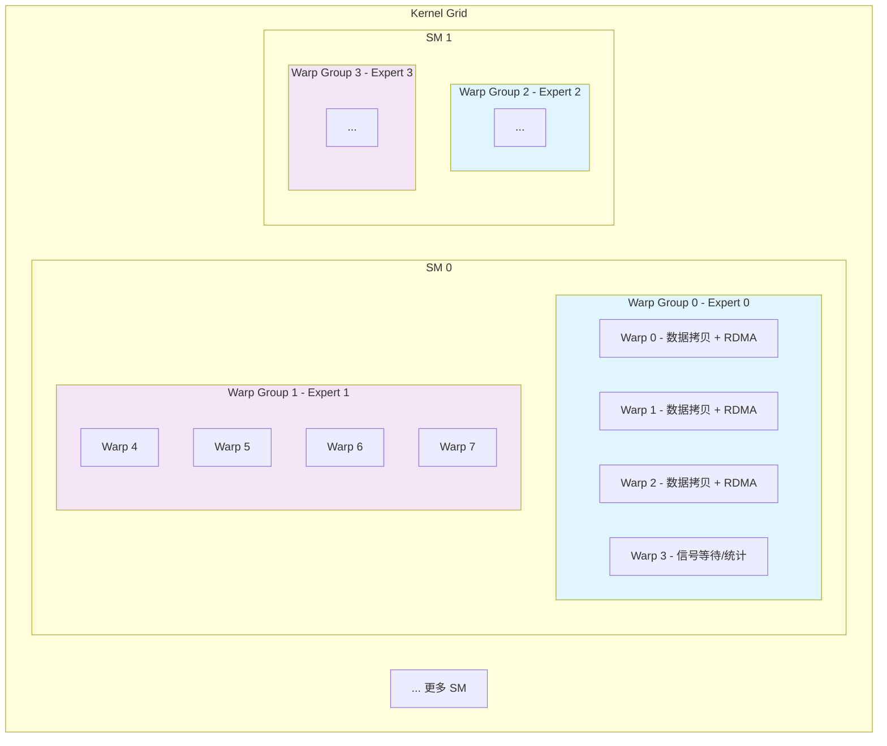
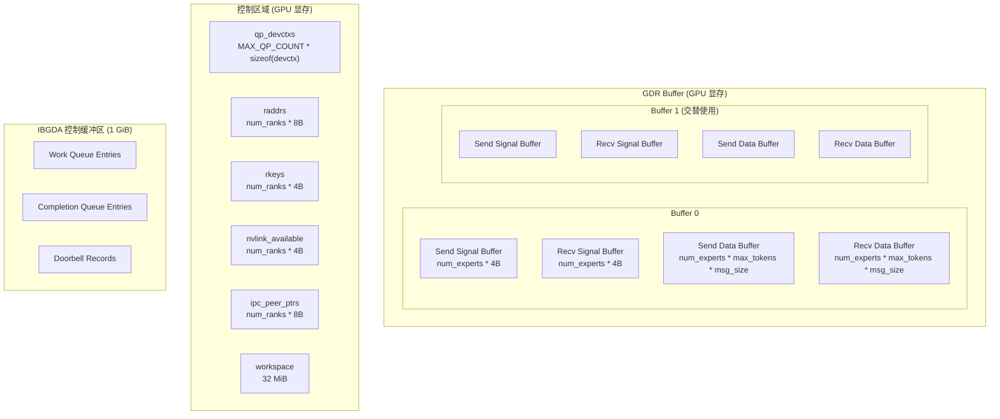
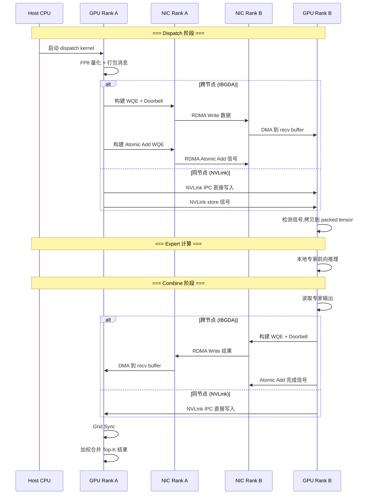

# Module 07 - IBGDA CUDA Kernel 深度解析

## 1. IBGDA 技术原理

### 1.1 什么是 IBGDA

IBGDA (In-Band GPU Direct Access) 是 Mellanox/NVIDIA ConnectX 系列网卡支持的一项高级特性,允许 **GPU 线程直接操作网卡的 Work Queue(WQ)发起 RDMA 请求**,完全绕过 CPU 的参与。

在传统 RDMA 编程模型中,数据传输流程为:

```
CPU 构建 WQE -> CPU 写入 Doorbell -> NIC 执行传输 -> NIC 写入 CQE -> CPU 轮询 CQ
```

而 IBGDA 模型中:

```
GPU 构建 WQE -> GPU 写入 Doorbell -> NIC 执行传输 -> NIC 写入 CQE -> GPU 轮询 CQ
```

这带来了显著的延迟优势:
- **消除 CPU-GPU 同步**: 无需 CPU 参与传输决策,GPU 可自主发起 RDMA
- **减少 PCIe 往返**: 避免 GPU->CPU->NIC 的双跳路径
- **天然适配 GPU 并行**: GPU 的大量线程可以并行构建和提交 WQE

### 1.2 IBGDA 在 Mooncake EP 中的定位

Mooncake EP 使用 IBGDA 实现了 dispatch 和 combine 的 CUDA kernel,使得:

- **Dispatch**: GPU 在执行 FP8 量化的同时,直接将数据通过 RDMA 写入远程 GPU 内存
- **Combine**: GPU 读取本地专家输出后,直接通过 RDMA 回送到源 rank

同时,对于同节点内的 GPU,优先使用 **NVLink IPC** 进行数据传输,IBGDA 仅用于跨节点通信。

### 1.3 核心硬件数据结构

Mooncake EP 使用以下 MLX5 硬件结构与 NIC 交互:

```cpp
// mooncake-ep/include/mooncake_ibgda/mlx5gda.h
struct mlx5gda_qp_devctx {
    uint32_t qpn;         // QP 编号
    uint32_t wqeid_mask;  // = num_wqebb - 1 (环形缓冲区掩码)
    uint32_t mutex;        // GPU 端互斥锁
    struct mlx5gda_wqebb *wq;    // Work Queue 入口(GPU 可见)
    struct mlx5_cqe64 *cq;       // Completion Queue 入口(GPU 可见)
    struct mlx5gda_wq_dbr *dbr;  // Doorbell Record
    char *bf;              // BlueFlame 寄存器地址
    uint32_t bf_offset;    // BlueFlame 偏移(每次 post 后切换)
    uint16_t wq_head;      // 下一个空闲 WQE ID
    uint16_t wq_tail;      // 最后一个未完成的 WQE ID
};
```

## 2. CUDA Kernel 架构

### 2.1 Kernel 线程模型

dispatch 和 combine kernel 使用相同的线程分组策略:



关键配置参数:

```cpp
// mooncake-ep/src/mooncake_ep_kernel.cu
constexpr int kNumWarpsPerGroup = 4;   // 每个 Warp Group 4 个 Warp
constexpr int kNumWarpGroups = 8;       // 每个 SM 8 个 Warp Group
// 总线程数 = 8 * 4 * 32 = 1024 threads per SM
// SM 数量 = ceil(num_experts / kNumWarpGroups)
```

每个 Warp Group 负责一个专家的通信:
- `responsible_expert_idx = sm_id * kNumWarpGroups + warp_group_id`
- 每个 Warp Group 内的 `sub_warp_id = warp_id % kNumWarpsPerGroup`

### 2.2 消息格式

Dispatch 传输的每条消息包含:

```
+------------------+-------------------+------------------+
|   src_token_idx  |   hidden_data     |   fp8_scales     |
|   (16 bytes,     |   (kHidden bytes  |   (仅 FP8 模式,  |
|    int4 对齐)    |    BF16/FP8)      |    num_scales *  |
|                  |                   |    sizeof(float)) |
+------------------+-------------------+------------------+
```

```cpp
// mooncake-ep/src/mooncake_ep_kernel.cu
// 消息大小计算
const size_t num_bytes_per_msg = sizeof(int4) +
    (kUseFP8 ? (kHidden + num_scales * sizeof(float))
             : (kHidden * sizeof(nv_bfloat16)));
```

Combine 传输使用更简单的格式,仅包含 hidden 数据:

```cpp
// combine kernel
constexpr size_t num_bytes_per_slot = kHidden * sizeof(nv_bfloat16);
```

## 3. Dispatch Kernel 详解

### 3.1 发送阶段

Dispatch 的发送阶段分为两种角色的 Warp:

**数据 Warp (warp_id < num_warps - 1)**: 负责 FP8 量化和发起 RDMA

```cpp
// mooncake-ep/src/mooncake_ep_kernel.cu - dispatch 发送阶段
for (int token_idx = sm_id; token_idx < num_tokens; token_idx += num_sms) {
    // 1. 读取 Top-K 路由信息
    auto dst_expert_idx = warp_id < num_topk ?
        static_cast<int>(__ldg(topk_idx + token_idx * num_topk + warp_id)) : -1;

    // 2. 写入源 token 索引
    thread_id == 0 ? (*rdma_x_src_idx = token_idx) : 0;

    // 3. FP8 量化(如启用)
    if (kUseFP8) {
        // 计算局部 amax
        float amax = kFP8Margin;
        for (int j = 0; j < kNumElemsPerRead; ++j)
            amax = fmaxf(amax, fabsf(fp32_values[j]));

        // Half-warp reduce 获取 per-channel amax
        amax = half_warp_reduce_max(amax);
        scale = kFP8Amax / amax;

        // 转换为 FP8 并写入发送缓冲区
        fp8x2_values[j / 2] = __nv_cvt_float2_to_fp8x2(fp32x2,
            __NV_SATFINITE, __NV_E4M3);
    }

    // 4. 根据目标 rank 选择传输方式
    if (dst_expert_idx >= 0) {
        int slot_idx = lane_id == 0 ?
            atomicAdd(atomic_counter_per_expert + dst_expert_idx, 1) : 0;

        if (dst_rank != rank) {
            bool use_nvlink = nvlink_available[dst_rank] != 0;
            if (use_nvlink) {
                // NVLink IPC: 直接内存拷贝
                UNROLLED_WARP_COPY(8, lane_id, num_int4_per_msg,
                    dst_int4_ptr, src_int4_ptr, ld_nc_global, st_na_global);
            } else {
                // IBGDA: 构建 RDMA Write WQE 并发送
                if (lane_id == 0) {
                    device_mutex_lock_system(&ctx->mutex);
                    __mlx5gda_device_write_rdma_write_wqe(ctx,
                        src_ptr, device_byteswap(rkey_array[rank]),
                        req_rptr_actual, device_byteswap(rkey_array[dst_rank]),
                        num_bytes_per_msg);
                    __mlx5gda_device_post_send_db(ctx);
                    device_mutex_unlock_system(&ctx->mutex);
                }
            }
        } else {
            // 本地传输: GPU 内存直接拷贝
            UNROLLED_WARP_COPY(8, lane_id, num_int4_per_msg,
                dst_int4_ptr, src_int4_ptr, ld_nc_global, st_na_global);
        }
    }
}
```

**统计 Warp (warp_id == num_warps - 1)**: 负责统计 per-expert token 数量并发送计数信号

```cpp
// mooncake-ep/src/mooncake_ep_kernel.cu
} else if (warp_id == num_warps - 1) {
    // 统计每个专家的 token 数量
    int expert_count[kNumWarpGroups] = {0};
    for (int i = lane_id; i < num_tokens * num_topk; i += 32) {
        auto idx = static_cast<int>(__ldg(topk_idx + i));
        if (idx >= expert_begin_idx and idx < expert_end_idx)
            expert_count[idx - expert_begin_idx]++;
    }

    // Warp reduce 汇总
    auto sum = warp_reduce_sum(expert_count[i - expert_begin_idx]);

    // 等待所有数据发送完成,然后发送计数信号
    while (ld_acquire_global(
        atomic_finish_counter_per_expert + responsible_expert_idx)
        != FINISHED_SUM_TAG * 2);

    // 发送 token 数量(编码为负数: -count - 1)
    if (use_nvlink) {
        st_na_release(peer_signal_ptr, -num_tokens_sent - 1);
    } else {
        // 使用 IBGDA 原子加操作
        __mlx5gda_device_write_rdma_atomic_add_wqe(ctx,
            -num_tokens_sent - 1, ...);
    }
}
```

### 3.2 接收阶段

接收阶段等待数据到达并将其重排到连续的 packed tensor 中:

```cpp
// mooncake-ep/src/mooncake_ep_kernel.cu - dispatch 接收阶段
if (responsible_expert_idx < num_experts) {
    // 1. 等待 token 到达(带超时检测)
    if (sub_warp_id == 1 and lane_id == 0) {
        unsigned long long start_time = clock64();
        while ((num_recv_tokens = ld_acquire_sys_global(
            rdma_recv_signal_buffer + ...)) == 0) {
            // 超时检测
            if (timeout_ticks != -1 &&
                clock64() - start_time > timeout_ticks) {
                active_ranks[src_rank] = 0;  // 标记故障
            }
            if (!active_ranks[src_rank]) {
                num_recv_tokens = -1;
                break;
            }
        }
        num_recv_tokens = -num_recv_tokens - 1;  // 解码实际数量
        recv_token_begin_idx = atomicAdd(
            packed_recv_count + local_expert_idx, num_recv_tokens);
    }

    // 2. 同步所有 sub-warp
    // 使用 bar.sync 确保 num_recv_tokens 在共享内存中可见

    // 3. 拷贝 token 数据到 packed tensor
    for (int i = sub_warp_id; i < num_recv_tokens; i += kNumWarpsPerGroup) {
        // 拷贝源索引
        recv_src_info[recv_token_begin_idx + i] = ld_nc_global(src_src_idx);

        // 拷贝 hidden 数据(向量化)
        UNROLLED_WARP_COPY(7, lane_id, hidden_int4,
            dst_data, src_data, ld_nc_global, st_na_global);

        // 拷贝 FP8 scales(如有)
        if (kUseFP8) {
            // 转置存储: 从行优先到列优先
        }
    }
}
```

### 3.3 Dispatch 阶段信号编码

Token 计数通过一种特殊的编码方式传递:发送端发送 `-count - 1`,接收端解码为 `count = -signal - 1`。使用负数编码是因为信号缓冲区初始值为 0,需要区分"尚未收到信号"(值为 0)和"收到了 0 个 token"的情况。

## 4. Combine Kernel 详解

### 4.1 发送阶段

Combine 的发送阶段将专家计算结果回送到源 rank:

```cpp
// mooncake-ep/src/mooncake_ep_kernel.cu - combine 发送
if (responsible_expert_idx < num_experts) {
    // 获取布局信息
    const auto layout = __ldg(layout_range +
        local_expert_idx * num_ranks + dst_rank);
    int offset, num_tokens_to_send;
    unpack2(layout, num_tokens_to_send, offset);

    // 发送每个 token 的结果
    for (int token_idx = offset + sub_warp_id;
         token_idx < offset + num_tokens_to_send;
         token_idx += kNumWarpsPerGroup) {

        auto src_idx = __ldg(local_src_info + token_idx);

        if (dst_rank == rank) {
            // 本地: 直接拷贝
            UNROLLED_WARP_COPY(7, lane_id, hidden_bf16_int4,
                dst_int4_ptr, x_int4, ld_nc_global, st_na_global);
        } else if (use_nvlink) {
            // NVLink: IPC 内存拷贝
            UNROLLED_WARP_COPY(7, lane_id, hidden_bf16_int4,
                dst_int4_ptr, x_int4, ld_nc_global, st_na_global);
        } else {
            // IBGDA: 先拷到缓冲区,再 RDMA 写入
            if (not zero_copy)
                UNROLLED_WARP_COPY(7, lane_id, hidden_bf16_int4,
                    buf_int4_ptr, x_int4, ld_nc_global, st_na_global);
            if (lane_id == 0) {
                device_mutex_lock_system(&ctx->mutex);
                __mlx5gda_device_write_rdma_write_wqe(ctx, ...);
                __mlx5gda_device_post_send_db(ctx);
                device_mutex_unlock_system(&ctx->mutex);
            }
        }
    }

    // 所有 token 发送完成后,发送完成信号
    if (sub_warp_id == 1 and lane_id == 0) {
        // 使用 IBGDA 原子加或 NVLink store 发送信号
        st_na_release(rdma_recv_signal_buffer + global_expert_idx, 1);
    }
}
```

### 4.2 接收与加权合并阶段

```cpp
// mooncake-ep/src/mooncake_ep_kernel.cu - combine 接收
// 1. 等待所有 rank 的数据到达
if (sub_warp_id == 0 and lane_id == 0) {
    unsigned long long start_time = clock64();
    while (ld_acquire_sys_global(
        rdma_recv_signal_buffer + responsible_expert_idx) == 0) {
        // 超时检测
        if (timeout_ticks != -1 && clock64() - start_time > timeout_ticks) {
            active_ranks[src_rank] = 0;
        }
    }
}

// 2. Grid 同步: 确保所有数据到达
cooperative_groups::this_grid().sync();

// 3. 加权合并
if (thread_id < hidden_bf16_int4) {
    for (int token_idx = sm_id; token_idx < num_combined_tokens;
         token_idx += num_sms) {
        // 读取 Top-K 索引和权重
        int reg_topk_idx[kNumMaxTopk];
        float reg_topk_weights[kNumMaxTopk];

        // 加权求和
        float combined_values[kNumElemsPerInt4] = {0.0f};
        for (int i = 0; i < num_topk; ++i) {
            if (reg_topk_idx[i] >= 0) {
                auto x_vec = ld_nc_global(rdma_buffer_row + thread_id);
                auto x_bf16 = reinterpret_cast<nv_bfloat16*>(&x_vec);
                for (int j = 0; j < kNumElemsPerInt4; ++j)
                    combined_values[j] +=
                        __bfloat162float(x_bf16[j]) * reg_topk_weights[i];
            }
        }

        // 写回 BF16 结果
        auto combined_bf16 = reinterpret_cast<nv_bfloat16*>(&combined_values);
        for (int j = 0; j < kNumElemsPerInt4; ++j)
            combined_bf16[j] = __float2bfloat16(combined_values[j]);
        (reinterpret_cast<int4*>(combined_x) +
            token_idx * hidden_bf16_int4)[thread_id] = combined_int4;
    }
}
```

## 5. EP Buffer 管理

### 5.1 MooncakeEpBuffer 初始化

```cpp
// mooncake-ep/src/mooncake_ep_buffer.cpp
MooncakeEpBuffer::MooncakeEpBuffer(int rank, int num_ranks,
                                   int64_t num_ep_buffer_bytes,
                                   std::string device_name)
    : rank(rank), num_ranks(num_ranks),
      num_ep_buffer_bytes(num_ep_buffer_bytes),
      comm_stream(at::cuda::getStreamFromPool(true)) {

    // 1. GPU 内存分配
    CUDA_CHECK(cudaMalloc(&gdr_buffer, num_ep_buffer_bytes));
    CUDA_CHECK(cudaMalloc(&raddrs, num_ranks * sizeof(uint64_t)));
    CUDA_CHECK(cudaMalloc(&rkeys, num_ranks * sizeof(uint32_t)));
    CUDA_CHECK(cudaMalloc(&qp_devctxs,
        MAX_QP_COUNT * sizeof(mlx5gda_qp_devctx)));

    // 2. NVLink P2P 资源分配
    CUDA_CHECK(cudaMalloc(&nvlink_available,
        num_ranks * sizeof(int32_t)));
    CUDA_CHECK(cudaMallocHost(&ipc_peer_ptrs_host,
        num_ranks * sizeof(void*)));
    CUDA_CHECK(cudaMalloc(&ipc_peer_ptrs,
        num_ranks * sizeof(void*)));

    // 3. IBGDA 初始化
    int ret = init_ibgda();
    if (ret != 0) {
        LOG(WARNING) << "Failed to initialize IBGDA. "
                     << "Using fallback implementation.";
        ibgda_disabled_ = true;
    }

    // 4. 工作空间
    CUDA_CHECK(cudaMalloc(&workspace, NUM_WORKSPACE_BYTES));  // 32 MiB
}
```

### 5.2 GPU 内存池布局



### 5.3 IBGDA 初始化流程

```cpp
// mooncake-ep/src/mooncake_ep_buffer.cpp
int MooncakeEpBuffer::init_ibgda() {
    // 1. 查找指定名称的 IB 设备
    ibv_device** dev_list = ibv_get_device_list(&num_devices);
    // 匹配 device_name ...

    // 2. 打开设备,注册内存区域
    ibv_context* ctx = ibv_open_device(dev_list[nic_id]);
    ibv_pd* pd = ibv_alloc_pd(ctx);
    mr = ibv_reg_mr(pd, gdr_buffer, num_ep_buffer_bytes,
        IBV_ACCESS_LOCAL_WRITE | IBV_ACCESS_REMOTE_READ |
        IBV_ACCESS_REMOTE_WRITE | IBV_ACCESS_REMOTE_ATOMIC);

    // 3. 分配 GPU 上的控制缓冲区并注册为 UMEM
    CUDA_CHECK(cudaMalloc(&ctrl_buf, CTRL_BUF_SIZE));  // 1 GiB
    mlx5dv_devx_umem* ctrl_buf_umem = mlx5dv_devx_umem_reg(
        ctx, ctrl_buf, CTRL_BUF_SIZE, IBV_ACCESS_LOCAL_WRITE);

    // 4. 创建 MAX_QP_COUNT (256) 个 QP
    for (int i = 0; i < MAX_QP_COUNT; ++i) {
        mlx5gda_qp* qp = mlx5gda_create_rc_qp(
            mpd, ctrl_buf, ctrl_buf_umem, ctrl_buf_heap, pd, 16384, 1);

        // 将 QP 的初始状态设为 INIT
        mlx5gda_modify_rc_qp_rst2init(qp, 0);

        // 构建 GPU 可见的 QP 设备上下文
        mlx5gda_qp_devctx qp_devctx = {
            .qpn = qp->qpn,
            .wqeid_mask = qp->num_wqebb - 1,
            .wq = (mlx5gda_wqebb*)(ctrl_buf + qp->wq_offset),
            .cq = (mlx5_cqe64*)(ctrl_buf + qp->send_cq->cq_offset),
            .dbr = (mlx5gda_wq_dbr*)(ctrl_buf + qp->dbr_offset),
            .bf = (char*)qp->uar->reg_addr,
        };

        // 拷贝到 GPU 显存
        cudaMemcpy(qp_devctxs + i * sizeof(mlx5gda_qp_devctx),
                   &qp_devctx, sizeof(mlx5gda_qp_devctx),
                   cudaMemcpyHostToDevice);
    }
    return 0;
}
```

### 5.4 QP 连接建立

远程 QP 信息通过 `sync_ib` (InfiniBand) 或 `sync_roce` (RoCE) 同步:

```cpp
// mooncake-ep/src/mooncake_ep_buffer.cpp
void MooncakeEpBuffer::sync_ib(
    const std::vector<int64_t>& remote_addrs,
    const std::vector<int32_t>& remote_keys,
    const std::vector<int32_t>& remote_qpns,
    const std::vector<int32_t>& remote_lids) {
    // 将所有 QP 从 INIT -> RTR -> RTS
    for (int i = 0; i < MAX_QP_COUNT; ++i) {
        mlx5gda_modify_rc_qp_init2rtr(qps[i], ah_attr,
            remote_qpns[i], IBV_MTU_4096);
        mlx5gda_modify_rc_qp_rtr2rts(qps[i]);
    }

    // 将远程地址和密钥拷贝到 GPU
    for (int i = 0; i < num_ranks; ++i) {
        uint64_t raddr = i == rank ?
            (uint64_t)mr->addr : (uint64_t)remote_addrs[i];
        cudaMemcpy(raddrs + i * sizeof(uint64_t), &raddr, ...);
        uint32_t rkey = i == rank ? mr->lkey : remote_keys[i];
        cudaMemcpy(rkeys + i * sizeof(uint32_t), &rkey, ...);
    }
}
```

### 5.5 NVLink IPC 同步

同节点内的 GPU 通过 CUDA IPC 共享 GDR 缓冲区:

```cpp
// mooncake-ep/src/mooncake_ep_buffer.cpp
void MooncakeEpBuffer::sync_nvlink_ipc_handles(
    const std::vector<std::vector<int32_t>>& remote_handles) {
    int device_count;
    cudaGetDeviceCount(&device_count);

    // 对同节点内的每个 GPU 检查 NVLink 可达性
    for (int dst_rank = group_start; dst_rank < group_end; ++dst_rank) {
        if (dst_rank == rank) {
            ipc_peer_ptrs_host[dst_rank] = gdr_buffer;  // 本地指针
            continue;
        }
        int can_access_peer = 0;
        cudaDeviceCanAccessPeer(&can_access_peer, device_id, dst_device);
        if (can_access_peer) {
            cudaDeviceEnablePeerAccess(dst_device, 0);
            nvlink_array[dst_rank] = 1;

            // 打开 IPC 内存句柄
            cudaIpcOpenMemHandle(&peer_ptr, remote_handle,
                cudaIpcMemLazyEnablePeerAccess);
            ipc_peer_ptrs_host[dst_rank] = peer_ptr;
        }
    }

    // 如果所有 rank 都通过 NVLink 可达,可以禁用 IBGDA
    if (std::all_of(nvlink_array.begin(), nvlink_array.end(),
                    [](int32_t v) { return v == 1; })) {
        ibgda_disabled_ = false;
    }

    // 将 NVLink 可用性和 IPC 指针拷贝到 GPU
    cudaMemcpy(nvlink_available, nvlink_array.data(), ...);
    cudaMemcpy(ipc_peer_ptrs, ipc_peer_ptrs_host, ...);
}
```

## 6. IBGDA WQE 构建细节

### 6.1 RDMA Write WQE

GPU 线程直接构建 RDMA Write WQE 并写入 NIC 的 Work Queue:

```cpp
// mooncake-ep/src/mooncake_ep_kernel.cu
static __device__ void __mlx5gda_device_write_rdma_write_wqe(
    struct mlx5gda_qp_devctx *ctx, uint64_t laddr, __be32 lkey,
    uint64_t raddr, __be32 rkey, uint32_t bytes) {
    // 获取 WQ 中下一个空闲 WQE 的位置
    struct mlx5gda_rdma_write_wqe *wqe =
        (mlx5gda_rdma_write_wqe*)(ctx->wq +
            (ctx->wq_head & ctx->wqeid_mask));

    // 构建控制段
    ctrl_seg.qpn_ds = device_byteswap((ctx->qpn << 8) | 3);
    ctrl_seg.fm_ce_se = MLX5_WQE_CTRL_CQ_UPDATE;
    ctrl_seg.opmod_idx_opcode = device_byteswap(
        ((uint32_t)ctx->wq_head << 8) | MLX5_OPCODE_RDMA_WRITE);

    // 构建远程地址段
    raddr_seg.raddr = device_byteswap(raddr);
    raddr_seg.rkey = rkey;

    // 构建数据段
    data_seg.byte_count = device_byteswap(bytes);
    data_seg.lkey = lkey;
    data_seg.addr = device_byteswap(laddr);

    ++ctx->wq_head;
}
```

### 6.2 RDMA Atomic Add WQE

用于发送信号计数(token 数量通知):

```cpp
// mooncake-ep/src/mooncake_ep_kernel.cu
static __device__ void __mlx5gda_device_write_rdma_atomic_add_wqe(
    struct mlx5gda_qp_devctx *ctx, const int& value,
    uint64_t laddr, __be32 lkey, uint64_t raddr, __be32 rkey) {
    // 控制段: opcode = ATOMIC_MASKED_FA (Fetch-and-Add)
    ctrl_seg.opmod_idx_opcode = device_byteswap(
        MLX5_OPCODE_ATOMIC_MASKED_FA |
        ((uint32_t)ctx->wq_head << 8) | 0x08000000);

    // 原子操作段: 32-bit add
    atomic_add_32_seg->add_data = device_byteswap((uint32_t)value);

    ++ctx->wq_head;
}
```

### 6.3 Doorbell 提交

```cpp
// mooncake-ep/src/mooncake_ep_kernel.cu
static __device__ void __mlx5gda_device_post_send_db(
    struct mlx5gda_qp_devctx *ctx) {
    // 1. 更新 Doorbell Record
    ptx_st32_rel_sys_na(&ctx->dbr->send_counter,
        device_byteswap((uint32_t)ctx->wq_head));

    // 2. 通过 BlueFlame 寄存器触发 NIC
    struct mlx5gda_wqebb *last_wqe =
        ctx->wq + ((ctx->wq_head - 1) & ctx->wqeid_mask);
    ptx_st64_rel_sys_na(
        (uint64_t*)(ctx->bf + ctx->bf_offset),
        *(uint64_t*)last_wqe);

    // 3. 切换 BlueFlame 偏移
    ctx->bf_offset ^= MLX5GDA_BF_SIZE;
}
```

### 6.4 GPU 互斥锁

由于多个 Warp 可能同时访问同一个 QP,需要 GPU 端的互斥锁:

```cpp
// mooncake-ep/src/mooncake_ep_kernel.cu
static __device__ void device_mutex_lock_system(uint32_t *mutex) {
    cuda::atomic_ref<uint32_t, cuda::thread_scope_system> lock(*mutex);
    while (lock.exchange(1, cuda::memory_order_acquire) != 0);
}

static __device__ void device_mutex_unlock_system(uint32_t *mutex) {
    cuda::atomic_ref<uint32_t, cuda::thread_scope_system> lock(*mutex);
    lock.store(0, cuda::memory_order_release);
}
```

使用 `thread_scope_system` 确保跨 GPU SM 和 NIC 之间的内存可见性。

## 7. 低延迟 Dispatch/Combine 完整流程



## 8. 性能优化技术

### 8.1 向量化内存访问

使用 `int4` (128-bit) 向量化加载/存储,并结合循环展开:

```cpp
// mooncake-ep/include/mooncake_ep_utils.cuh
#define UNROLLED_WARP_COPY(UNROLL_FACTOR, LANE_ID, N, DST, SRC, LD_FUNC, ST_FUNC) \
    for (int __i = (LANE_ID); __i < ((N) / kLoopStride) * kLoopStride; \
         __i += kLoopStride) { \
        for (int __j = 0; __j < (UNROLL_FACTOR); ++__j) \
            unrolled_values[__j] = LD_FUNC(__src + __i + __j * 32); \
        for (int __j = 0; __j < (UNROLL_FACTOR); ++__j) \
            ST_FUNC(__dst + __i + __j * 32, unrolled_values[__j]); \
    }
```

对于 7168 hidden 维度 (DeepSeek-V3),每个 warp 仅需约 2 次循环迭代即可完成一个 token 的拷贝。

### 8.2 Non-Allocating Cache 策略

使用 `L1::no_allocate` 修饰符避免通信数据污染 L1 Cache:

```cpp
// ld.global.nc.L1::no_allocate -> SASS: LDG.E.NA.CONSTANT
template <>
__device__ __forceinline__ int4 ld_nc_global(const int4 *ptr) {
    int4 ret;
    asm volatile(LD_NC_FUNC ".v4.s32 {%0, %1, %2, %3}, [%4];"
                 : "=r"(ret.x), "=r"(ret.y), "=r"(ret.z), "=r"(ret.w)
                 : "l"(ptr));
    return ret;
}
```

### 8.3 QP 分散策略

每个目标 rank 有 `MAX_QP_COUNT / num_ranks` 个 QP,不同专家映射到不同 QP 以减少锁竞争:

```cpp
// mooncake-ep/src/mooncake_ep_kernel.cu
const size_t num_qp_per_rank = MAX_QP_COUNT / num_ranks;
auto ctx = ctx_array + dst_rank * num_qp_per_rank +
    dst_expert_local_idx % num_qp_per_rank;
```

### 8.4 Cooperative Launch

Kernel 使用 Cooperative Launch 支持 grid 级别的同步:

```cpp
// mooncake-ep/include/mooncake_ep_launch.cuh
#define SETUP_LAUNCH_CONFIG(num_sms, num_threads, stream) \
    cudaLaunchConfig_t cfg = { \
        (num_sms), (num_threads), 0, stream, nullptr, 0}; \
    cudaLaunchAttribute attr[1]; \
    attr[0].id = cudaLaunchAttributeCooperative; \
    attr[0].val.cooperative = 1; \
    cfg.attrs = attr; \
    cfg.numAttrs = 1
```

这使得 combine 的接收阶段可以在所有 SM 间执行 `cooperative_groups::this_grid().sync()`,确保所有数据到达后再开始合并。

## 9. 关键源码文件索引

| 文件 | 路径 | 说明 |
|------|------|------|
| CUDA Kernel | `mooncake-ep/src/mooncake_ep_kernel.cu` | dispatch/combine 完整 kernel 实现 |
| EP Buffer | `mooncake-ep/src/mooncake_ep_buffer.cpp` | 缓冲区管理、IBGDA 初始化、NVLink IPC |
| EP Buffer 头文件 | `mooncake-ep/include/mooncake_ep_buffer.h` | BufferPair、BufferLayout、MooncakeEpBuffer |
| Kernel API | `mooncake-ep/include/mooncake_ep_api.cuh` | dispatch/combine host 函数声明 |
| MLX5 GDA 接口 | `mooncake-ep/include/mooncake_ibgda/mlx5gda.h` | QP 结构体、WQE 定义、QP 操作函数 |
| 配置常量 | `mooncake-ep/include/mooncake_ep_configs.cuh` | 缓冲区大小、超时时间、phase 定义 |
| PTX 工具函数 | `mooncake-ep/include/mooncake_ep_utils.cuh` | 内存屏障、原子操作、向量化拷贝宏 |
| Launch 配置 | `mooncake-ep/include/mooncake_ep_launch.cuh` | Cooperative Launch、SWITCH_HIDDEN 宏 |

---

> **上一篇**: [02-mooncake-backend.md](02-mooncake-backend.md) - MooncakeBackend 深度解析
