# vLLM 集成深度解析

[上一篇](../07-expert-parallelism/03-ibgda-kernel.md) | [目录](../README.md) | [下一篇](02-sglang-integration.md)

---

## 概述

Mooncake 与 vLLM 的集成是整个项目最核心的应用场景之一。通过实现 vLLM 的 `KVConnectorBase_V1` 接口，Mooncake 将其高性能 RDMA 传输能力无缝嵌入 vLLM 的 Prefill-Decode 分离式推理架构中，实现跨节点 KVCache 的高效传输。本文将深入解析 `MooncakeConnector` 的架构设计、传输协议、侧信道通信机制以及部署方式。

---

## 1. MooncakeConnector 架构

`MooncakeConnector` 是 Mooncake 与 vLLM v1 后端集成的核心类，位于 `mooncake-wheel/mooncake/mooncake_connector_v1.py`。它实现了 vLLM 的 `KVConnectorBase_V1` 接口，将 vLLM 的 KVCache 传输抽象层与 Mooncake TransferEngine 的底层 RDMA 传输能力桥接起来。

### 1.1 核心类层次结构

```
KVConnectorBase_V1 (vLLM 定义的抽象基类)
  └── MooncakeConnector (入口类，角色分发)
        ├── MooncakeConnectorScheduler (Scheduler 侧逻辑)
        └── MooncakeConnectorWorker   (Worker 侧逻辑)
```

`MooncakeConnector` 根据初始化时传入的 `KVConnectorRole` 参数，内部创建对应的子组件：

- **`KVConnectorRole.SCHEDULER`** - 创建 `MooncakeConnectorScheduler`，负责请求调度、元数据管理
- **`KVConnectorRole.WORKER`** - 创建 `MooncakeConnectorWorker`，负责实际的 KVCache 数据传输

### 1.2 整体集成架构


### 1.3 关键配置参数

通过 vLLM 的 `--kv-transfer-config` JSON 字符串配置：

| 参数 | 说明 | 可选值 |
|------|------|--------|
| `kv_connector` | 连接器类名 | `"MooncakeConnector"` |
| `kv_role` | 实例角色 | `"kv_producer"` / `"kv_consumer"` / `"kv_both"` |
| `kv_connector_module_path` | 模块路径 (v0.3 需要) | `"mooncake.mooncake_connector_v1"` |
| `num_workers` | 每个 Worker 的发送线程池大小 | 默认 10 |

---

## 2. Producer (Prefill) 角色

Prefill 实例扮演 `kv_producer` 角色，负责执行 Prefill 计算并将生成的 KVCache Block 发送给 Decode 实例。

### 2.1 Scheduler 侧流程

`MooncakeConnectorScheduler` 在 Scheduler 侧执行以下关键操作：

1. **`update_state_after_alloc()`** - 当请求设置了 `do_remote_decode` 标志时，将请求 ID 加入 `_reqs_need_send` 队列
2. **`build_connector_meta()`** - 构建 `MooncakeConnectorMetadata`，将待发送的请求信息封装并传递给 Worker
3. **`request_finished()`** - 请求完成时，判断是否需要延迟释放 Block（因为 KVCache 还需要发送给 Decode 端），若需要发送则设置 `delay_free_blocks = True`，同时携带 `kv_transfer_params` 供 Decode 端回连

### 2.2 Worker 侧流程

`MooncakeConnectorWorker` 在 Worker 侧处理实际的数据传输：

1. **注册 KVCache 内存** - `register_kv_caches()` 将 GPU KVCache 张量注册到 TransferEngine，获取基地址列表 `kv_caches_base_addr`
2. **启动握手监听** - 在 Producer 侧启动 ZMQ ROUTER Socket 监听 Decode 端的拉取请求
3. **处理握手请求** - `_handle_handshake()` 解码 Decode 端发来的 `MooncakeAgentMetadata`，调用 `send_kv_to_decode()` 执行实际传输
4. **批量传输** - `_send_blocks()` 通过 `engine.batch_transfer_sync_write()` 将 KVCache Block 通过 RDMA 写入 Decode 端的远程内存

---

## 3. Consumer (Decode) 角色

Decode 实例扮演 `kv_consumer` 角色，负责从远程 Prefill 实例拉取 KVCache 并执行 Decode 生成。

### 3.1 Scheduler 侧流程

1. **`get_num_new_matched_tokens()`** - 当请求携带 `do_remote_prefill` 参数时，返回需要从远程加载的 token 数量（即 prompt 长度减去已计算的 token 数）
2. **`update_state_after_alloc()`** - 分配本地 Block 后，将请求加入 `_reqs_need_recv` 队列，记录本地 Block ID 和远程主机信息
3. **`build_connector_meta()`** - 将待接收的请求封装为 `RecvReqMeta`，传递给 Worker

### 3.2 Worker 侧流程

1. **`start_load_kv()`** - 遍历所有需要接收的请求，按远程主机分组后为每个目标启动独立线程执行 `receive_kv()`
2. **`receive_kv()`** - 通过 ZMQ REQ Socket 向 Prefill 端发送 `MooncakeAgentMetadata`（包含本地 Block ID 和基地址），等待 Prefill 端完成 RDMA Write 后收到 `TRANS_DONE` 确认

---

## 4. KVCache Block 级传输协议

### 4.1 Block 映射机制

KVCache 传输以 Block 为粒度进行。每个 Block 对应固定数量的 token 的 KV 数据。核心数据结构包括：

```python
@dataclass
class MooncakeAgentMetadata:
    remote_hostname: str          # Decode 端主机名
    remote_port: int              # Decode 端 TransferEngine RPC 端口
    request_ids: list[ReqId]      # 请求 ID 列表
    kv_caches_base_addr: list[int]  # 各层 KVCache 的基地址
    block_ids: list[list[int]]    # 每个请求对应的 Block ID 列表
```

### 4.2 远程内存寻址

传输时通过基地址加偏移量计算每个 Block 的实际内存地址：

```
block_address = layer_base_addr + block_id * block_len
```

其中 `block_len = tensor_size_bytes / num_blocks`，即每个 Block 的字节大小。

### 4.3 连续 Block 合并

为提升传输效率，`group_concurrent_contiguous()` 函数利用 NumPy 向量化操作，将源和目标上连续的 Block 合并为一次大批量传输：

```python
def group_concurrent_contiguous(src_indices, dst_indices):
    """将连续的 Block 分组合并，减少 RDMA 操作次数"""
    brk = np.where((np.diff(src_indices) != 1) |
                   (np.diff(dst_indices) != 1))[0] + 1
    src_groups = np.split(src_indices, brk)
    dst_groups = np.split(dst_indices, brk)
    return src_groups, dst_groups
```

### 4.4 KVCache 传输流程

```mermaid
sequenceDiagram
    participant Proxy as Proxy Server
    participant P_Sched as Prefill Scheduler
    participant P_Worker as Prefill Worker
    participant D_Sched as Decode Scheduler
    participant D_Worker as Decode Worker

    Proxy->>P_Sched: 1. 发送 Prefill 请求 (max_tokens=1)
    P_Sched->>P_Worker: 2. build_connector_meta (reqs_to_send)
    P_Worker->>P_Worker: 3. register_kv_caches / 启动 ZMQ 监听
    P_Sched-->>Proxy: 4. 返回 kv_transfer_params (host, port)

    Proxy->>D_Sched: 5. 发送 Decode 请求 (携带 kv_transfer_params)
    D_Sched->>D_Sched: 6. get_num_new_matched_tokens
    D_Sched->>D_Sched: 7. update_state_after_alloc (分配本地 Block)
    D_Sched->>D_Worker: 8. build_connector_meta (reqs_to_recv)
    D_Worker->>P_Worker: 9. ZMQ 发送 MooncakeAgentMetadata
    P_Worker->>D_Worker: 10. RDMA Write KVCache Blocks
    P_Worker->>D_Worker: 11. ZMQ 返回 TRANS_DONE
    D_Worker->>D_Sched: 12. get_finished (接收完成)
    D_Sched-->>Proxy: 13. 流式返回生成结果
```



---

## 5. 侧信道通信 (ZMQ)

Mooncake 使用 ZeroMQ 作为控制平面的侧信道通信机制，用于在 Prefill 和 Decode 实例之间交换传输元数据。

### 5.1 通信模式

| 组件 | Socket 类型 | 角色 | 说明 |
|------|-------------|------|------|
| Prefill Worker | `zmq.ROUTER` | 监听方 (Bind) | 接受多个 Decode 端的连接 |
| Decode Worker | `zmq.REQ` | 请求方 (Connect) | 向指定 Prefill 端发起拉取请求 |

### 5.2 端口分配

侧信道端口基于 `VLLM_MOONCAKE_SIDE_CHANNEL_PORT`（默认 6557）计算：

```python
side_channel_port = VLLM_MOONCAKE_SIDE_CHANNEL_PORT + dp_rank * tp_size
```

Worker 线程的实际监听端口为：

```python
listen_port = side_channel_port + tp_rank
```

### 5.3 握手流程

1. **Decode 端** 构造 `MooncakeAgentMetadata`，通过 msgspec 序列化后发送给 Prefill 端
2. **Prefill 端** 接收并反序列化元数据，提交至 `_handshake_executor` 线程池处理
3. **Prefill 端** 调用 `send_kv_to_decode()` 通过 RDMA 写入数据
4. **Prefill 端** 传输完成后，通过 `mooncake_handshake_ack_queue` 发送 `TRANS_DONE` 确认

---

## 6. 配置与环境变量

### 6.1 核心环境变量

| 环境变量 | 默认值 | 说明 |
|----------|--------|------|
| `VLLM_MOONCAKE_SIDE_CHANNEL_PORT` | `6557` | ZMQ 侧信道基础端口 |
| `VLLM_MOONCAKE_ABORT_REQUEST_TIMEOUT` | `120` | 请求超时自动释放 KVCache 的秒数 |
| `VLLM_MOONCAKE_BOOTSTRAP_PORT` | `8998` | Mooncake Bootstrap Server 端口 |

### 6.2 TransferEngine 初始化

`MooncakeConnectorWorker` 在初始化时创建 `TransferEngine` 实例：

```python
self.engine = TransferEngine()
ret_value = self.engine.initialize(
    self.hostname,        # 本机 IP
    "P2PHANDSHAKE",       # 元数据服务模式 (P2P 握手)
    "rdma",               # 传输协议
    ""                    # 设备名 (空为自动检测)
)
```

在 v1.0 版本中，TransferEngine 默认使用 `P2PHANDSHAKE` 模式，不再依赖外部 etcd 等元数据服务。

### 6.3 Attention Backend 兼容性

`MooncakeConnectorWorker` 自动检测 vLLM 的注意力后端，支持以下布局：

- **FlashInfer** - 统一 KV 缓存张量
- **FlashAttention** - 分离 K/V 缓存张量
- **Pallas** (TPU) - 统一 KV 缓存张量
- **MLA** (Multi-Layer Attention) - 统一 KV 缓存张量

---

## 7. 部署步骤

### 7.1 安装依赖

```bash
# 安装 Mooncake Transfer Engine
pip install mooncake-transfer-engine

# 安装 vLLM (参考官方文档)
pip install vllm
```

### 7.2 启动 Prefill 实例

```bash
vllm serve Qwen/Qwen2.5-7B-Instruct \
  --port 8010 \
  --kv-transfer-config \
  '{"kv_connector":"MooncakeConnector","kv_role":"kv_producer"}'
```

### 7.3 启动 Decode 实例

```bash
vllm serve Qwen/Qwen2.5-7B-Instruct \
  --port 8020 \
  --kv-transfer-config \
  '{"kv_connector":"MooncakeConnector","kv_role":"kv_consumer"}'
```

### 7.4 启动 Proxy Server

```bash
python -m mooncake.vllm_v1_proxy_server \
  --prefiller-host 192.168.0.2 --prefiller-port 8010 \
  --decoder-host 192.168.0.3 --decoder-port 8020
```

### 7.5 使用 Tensor Parallelism

```bash
# Prefill (8 GPU)
CUDA_VISIBLE_DEVICES=0,1,2,3,4,5,6,7 \
vllm serve Qwen/Qwen2.5-7B-Instruct \
  --port 8010 --tensor-parallel-size 8 \
  --kv-transfer-config '{"kv_connector":"MooncakeConnector","kv_role":"kv_producer"}'

# Decode (8 GPU)
CUDA_VISIBLE_DEVICES=0,1,2,3,4,5,6,7 \
vllm serve Qwen/Qwen2.5-7B-Instruct \
  --port 8020 --tensor-parallel-size 8 \
  --kv-transfer-config '{"kv_connector":"MooncakeConnector","kv_role":"kv_consumer"}'
```

### 7.6 测试请求

```bash
curl http://127.0.0.1:8000/v1/chat/completions \
  -H "Content-Type: application/json" \
  -d '{
    "model": "Qwen/Qwen2.5-7B-Instruct",
    "messages": [
      {"role": "user", "content": "请详细介绍人工智能的发展历程。"}
    ]
  }'
```

---

## 8. 版本演进

### 8.1 MooncakeConnector 方法调用链


### 8.2 v0.2 版本 (vLLM V0 后端)

- **连接器名称**: `MooncakeConnector`（V0 版本）
- **元数据服务**: 依赖外部 etcd/redis 服务
- **配置方式**: 通过 `mooncake.json` 配置文件，设置 `MOONCAKE_CONFIG_PATH` 环境变量
- **限制**: 仅支持 1P1D（1 Prefill + 1 Decode）部署模式
- **KV 参数**: 需要手动设置 `kv_rank`, `kv_parallel_size`, `kv_buffer_size`

### 8.3 v0.3 版本 (vLLM V0 后端，MooncakeStore)

- **连接器名称**: `MooncakeStoreConnector`
- **元数据服务**: 引入 `mooncake_master` 守护进程
- **XpYd 支持**: 支持多 Prefill 对多 Decode 的灵活部署
- **动态扩缩容**: 支持运行时动态增减 Prefill/Decode 实例
- **容错性**: 单个 vLLM 实例崩溃不影响其他实例运行
- **配置简化**: 统一配置文件，所有实例可共享同一份 `mooncake.json`

### 8.4 v1.0 版本 (vLLM V1 后端)

- **连接器名称**: `MooncakeConnector`（V1 版本，全新实现）
- **接口变更**: 实现 `KVConnectorBase_V1` 接口，区分 Scheduler/Worker 角色
- **P2P 握手**: 使用 `P2PHANDSHAKE` 模式，无需外部元数据服务
- **配置简化**: 无需 `mooncake.json` 配置文件和 `MOONCAKE_CONFIG_PATH`
- **侧信道**: 使用 ZMQ 进行 Prefill/Decode 间的元数据交换
- **MLA 支持**: 自动检测 MLA 模型并优化 KVCache 布局
- **多后端兼容**: 支持 FlashInfer、FlashAttention、Pallas 等注意力后端
- **版本兼容**: 适配 vLLM 0.11.0 / 0.11.1 / 0.11.2 版本

### 8.5 版本对比

| 特性 | v0.2 | v0.3 | v1.0 |
|------|------|------|------|
| vLLM 后端 | V0 | V0 | V1 |
| 部署模式 | 1P1D | XpYd | XpYd |
| 外部依赖 | etcd/redis | etcd/redis + mooncake_master | 无 |
| 配置文件 | 需要 | 需要 | 不需要 |
| 动态扩缩容 | 不支持 | 支持 | 支持 |
| MLA 模型支持 | 不支持 | 不支持 | 支持 |
| Connector 接口 | `KVConnectorBase` (V0) | `KVConnectorBase` (V0) | `KVConnectorBase_V1` |

---

## 参考资源

- 源代码: [`mooncake-wheel/mooncake/mooncake_connector_v1.py`](https://github.com/kvcache-ai/Mooncake/blob/main/mooncake-wheel/mooncake/mooncake_connector_v1.py)
- Proxy Server: [`mooncake-wheel/mooncake/vllm_v1_proxy_server.py`](https://github.com/kvcache-ai/Mooncake/blob/main/mooncake-wheel/mooncake/vllm_v1_proxy_server.py)
- vLLM v1.0 集成文档: [vllm-integration-v1.0](https://kvcache-ai.github.io/Mooncake/getting_started/examples/vllm-integration/vllm-integration-v1.0.html)
- vLLM v0.3 集成文档: [vllm-integration-v0.3](https://kvcache-ai.github.io/Mooncake/getting_started/examples/vllm-integration/vllm-integration-v0.3.html)

---

[上一篇](../07-expert-parallelism/03-ibgda-kernel.md) | [目录](../README.md) | [下一篇](02-sglang-integration.md)
