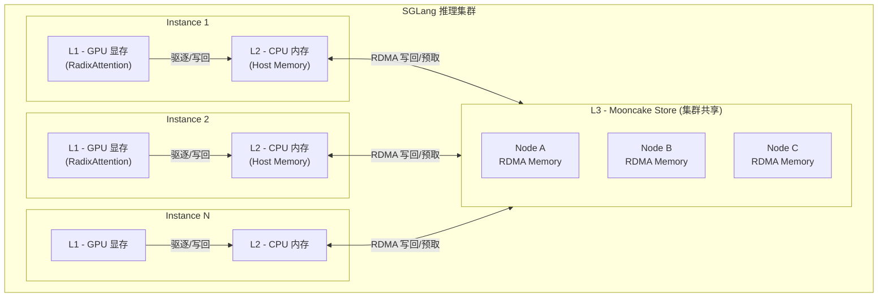
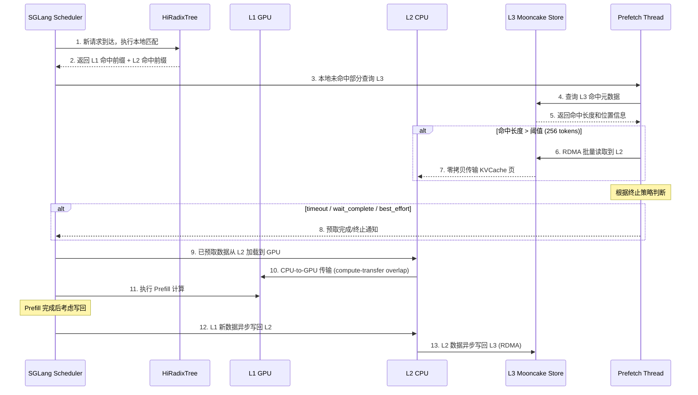

# SGLang 集成深度解析

[上一篇](01-vllm-integration.md) | [目录](../README.md) | [下一篇](03-python-api-overview.md)

---

## 概述

SGLang 是一个高性能的 LLM 推理引擎，其核心特性之一是 **RadixAttention** -- 一种基于 Radix Tree 的 KVCache 复用机制。Mooncake 通过 **HiCache** 架构与 SGLang 深度集成，将 RadixAttention 从单节点 GPU 内存扩展到跨节点分布式存储，构建了 Device (GPU) -> Host (CPU) -> Remote (Mooncake Store) 的多层缓存体系。本文将深入解析 HiCache 的设计原理、多层存储架构以及 Mooncake 在其中的关键角色。

---

## 1. SGLang HiCache 概述

### 1.1 背景与动机

随着 Agentic Coding、多轮对话等任务的发展，请求上下文长度持续增长。提高 KVCache 的容量和命中率对提升推理吞吐量和降低 TTFT (Time To First Token) 越来越重要。SGLang 原有的 RadixAttention 仅限于 GPU 内存中进行 KVCache 复用，容量受限于单机显存大小。

**HiCache** 在 RadixAttention 基础上引入了层次化缓存支持，类似于现代 CPU 的三级缓存设计：

| 缓存层级 | 存储介质 | 对应 CPU 缓存 | 作用域 | 特点 |
|----------|----------|---------------|--------|------|
| L1 | GPU 显存 | L1/L2 Cache | 实例私有 | 速度最快，容量最小 |
| L2 | CPU 内存 | L2 Cache | 实例私有 | 速度较快，容量较大 |
| L3 | Mooncake Store (远程) | L3 Cache (共享) | 集群共享 | 容量最大，跨实例共享 |

### 1.2 核心设计思想

HiCache 的设计灵感来源于现代 CPU 缓存架构：

- **L1/L2 私有**: 类似 CPU 核心私有的 L1/L2 缓存，每个推理实例拥有私有的 GPU (L1) 和 CPU (L2) KVCache
- **L3 共享**: 类似 CPU 多核共享的 L3 缓存，Mooncake Store 作为 L3 层在集群内所有实例间共享
- **逐级淘汰**: 热数据在 L1，温数据在 L2，冷数据写回 L3 共享存储

---

## 2. 多层存储架构

### 2.1 HiCache 多层存储架构



### 2.2 HiRadixTree 元数据组织

HiCache 在 RadixAttention 的 RadixTree 基础上提出了 **HiRadixTree**，每个节点记录 KVCache 数据的存储位置信息：

- **本地存储**: 记录精确的存储地址（GPU 显存或 CPU 内存中的位置）
- **远程存储**: 不持续同步 L3 元数据，而是在访问时实时查询 Mooncake Store 后端获取位置信息

这种设计权衡了元数据同步开销与访问延迟：对高频访问的本地数据维护精确索引，对低频访问的远程数据采用按需查询策略。

### 2.3 数据布局优化

HiCache 支持多种数据布局以优化传输效率：

| 布局方式 | 说明 | L2 到 L3 传输 | L2 到 GPU 传输 |
|----------|------|---------------|----------------|
| `layer_first` | 按层组织，GPU 原生布局 | 需要多次小传输 | 直接使用 |
| `page_first` | 按页组织，同页数据连续 | 零拷贝批量传输 | 需按 token-layer 粒度拆分 |
| `page_first_direct` | 按页组织，层内 token 连续 | 零拷贝批量传输 | 可按 page-layer 粒度聚合 |

`page_first_direct` 布局在 L2-L3 和 L2-GPU 传输之间取得了较好的平衡。

---

## 3. 集成架构

### 3.1 Mooncake Store 在 HiCache 中的角色

Mooncake Store 作为 HiCache 的 L3 后端，提供以下关键能力：

1. **分布式存储**: KVCache 数据分布在集群多个节点的 RDMA 可访问内存中
2. **零拷贝传输**: 通过 RDMA 直接在 L2 内存和远程存储之间传输数据，无需额外拷贝
3. **并行多 NIC 传输**: 利用多块网卡并行传输到多个远程节点，最大化带宽利用率
4. **批量操作**: 支持高效的批量读写操作，当前经验值上限为 128 页/批次

### 3.2 三大核心操作

HiCache 的工作流程围绕三个核心操作展开：

#### 本地匹配 (Local Match)

- 在 HiRadixTree 中遍历匹配请求 token 前缀
- 以 `page_size` 为粒度进行匹配
- 返回连续前缀：前段在 L1，后段在 L2
- 仅遍历本地树结构，无数据拷贝，极快

#### 远程预取 (Prefetch from L3)

- 本地未命中的部分查询 L3 获取元数据
- L3 命中长度超过阈值（默认 256 tokens）时触发预取
- 保证前缀完整性：已缓存部分为连续前缀，重计算部分为连续后缀
- 使用 RDMA 从多个远程节点并行读取数据到 L2

#### 数据写回 (Write-back)

- 三种写回策略：`write_through`（即时写回）、`write_through_selective`（热数据写回）、`write_back`（驱逐时写回）
- 异步并行执行，不阻塞主调度流程
- 仅写入 Mooncake Store 中不存在的数据，避免冗余传输

### 3.3 预取终止策略

预取操作面临时序不确定性挑战，HiCache 提供三种终止策略：

| 策略 | 行为 | 适用场景 |
|------|------|----------|
| `best_effort` | GPU 可执行 Prefill 时立即终止 | 对延迟极度敏感 |
| `wait_complete` | 等待所有预取完成 | 需要高缓存命中率 |
| `timeout` | 超时或完成后终止 | 平衡延迟与命中率 |

动态超时计算公式：

```
timeout = prefetch_timeout_base + prefetch_timeout_per_ki_token * num_token_to_fetch / 1024
```

### 3.4 Cache Miss 远程预取流程



---

## 4. 部署指南

### 4.1 环境准备

```bash
# 安装 Mooncake Transfer Engine
pip3 install mooncake-transfer-engine

# 安装 SGLang (从源码)
git clone git@github.com:sgl-project/sglang.git
cd sglang
pip install --upgrade pip
pip install -e "python[all]" \
  --find-links https://flashinfer.ai/whl/cu124/torch2.5/flashinfer-python
```

### 4.2 跨节点部署

#### Prefill 实例

```bash
python -m sglang.launch_server \
  --model-path Qwen/Qwen2.5-7B-Instruct-GPTQ-Int4 \
  --disaggregation-mode prefill \
  --port 30000 \
  --host 192.168.0.137 \
  --tp-size 2
```

#### Decode 实例

```bash
python -m sglang.launch_server \
  --model-path Qwen/Qwen2.5-7B-Instruct-GPTQ-Int4 \
  --disaggregation-mode decode \
  --port 30001 \
  --host 192.168.0.140 \
  --tp-size 2
```

#### Proxy (Mini Load Balancer)

```bash
python3 -m sglang.srt.disaggregation.mini_lb \
  --prefill http://192.168.0.137:30000 \
  --decode http://192.168.0.140:30001 \
  --host 0.0.0.0 \
  --port 8000
```

### 4.3 同节点部署

```bash
# Prefill
python -m sglang.launch_server \
  --model-path Qwen/Qwen2.5-7B-Instruct-GPTQ-Int4 \
  --disaggregation-mode prefill \
  --port 30000 --host 192.168.0.137 --tp-size 2

# Decode (使用 --base-gpu-id 避免 GPU 冲突)
python -m sglang.launch_server \
  --model-path Qwen/Qwen2.5-7B-Instruct-GPTQ-Int4 \
  --disaggregation-mode decode \
  --port 30001 --host 192.168.0.137 --tp-size 2 \
  --base-gpu-id 2
```

### 4.4 关键配置参数

| 参数 | 说明 |
|------|------|
| `--disaggregation-mode` | 节点角色: `prefill` 或 `decode` |
| `--disaggregation-ib-device` | RDMA 设备名 (可选，自动检测) |
| `--tp-size` | Tensor Parallelism 大小 |
| `--base-gpu-id` | 起始 GPU 编号 (同节点多实例时使用) |

### 4.5 启用 Mooncake EP Backend

对于 DeepSeek-V3 等 MoE 模型，可启用 Mooncake EP Backend：

```bash
# Prefill
python -m sglang.launch_server \
  --model-path deepseek-ai/DeepSeek-V3-0324 \
  --disaggregation-mode prefill \
  --port 30000 --host 192.168.0.137 \
  --tp-size 8 --dp-size 8 \
  --elastic-ep-backend mooncake \
  --moe-a2a-backend mooncake
```

### 4.6 测试请求

```bash
curl -X POST http://127.0.0.1:8000/generate \
  -H "Content-Type: application/json" \
  -d '{
    "text": "Let me tell you a long story ",
    "sampling_params": {
      "temperature": 0
    }
  }'
```

---

## 5. 性能对比

### 5.1 核心优化技术

HiCache 与 Mooncake Store 集成后的关键性能优化包括：

| 优化技术 | 说明 |
|----------|------|
| 零拷贝 RDMA 传输 | L2 内存与 Mooncake Store 之间直接 RDMA 读写，无中间拷贝 |
| 批量并行传输 | 多 NIC 并行传输到多远程节点，经验上限 128 页/批次 |
| 计算-传输重叠 | Prefill 时 CPU-to-GPU 传输与计算流水线化 (layer N+1 传输 + layer N 计算) |
| GPU 辅助 I/O 内核 | 优化的 CPU-GPU 传输内核，比 `cudaMemcpyAsync` 快 3x |
| MLA 写回优化 | MLA 模型下仅一个 rank 执行写回，避免数据冗余 |
| 多 rank 同步 | 使用 `all_reduce(op=min)` 保证多 GPU 并行时状态一致 |
| 动态超时预取 | 基于 token 数量动态计算预取超时，平衡延迟与命中率 |

### 5.2 适用场景

HiCache + Mooncake Store 在以下场景中表现优异：

- **多轮 QA 对话**: 大量前缀共享，L3 共享缓存显著提升命中率
- **长上下文推理**: KVCache 容量扩展至 PB 级别
- **Agentic Coding**: 频繁的上下文切换与复用
- **PD 分离部署**: Prefill 节点启用 HiCache 优化 Prefill 性能，Decode 节点写回计算结果至 L3

详细的基准测试结果请参考 [SGLang HiCache Benchmark Results](https://kvcache-ai.github.io/Mooncake/performance/sglang-hicache-benchmark-results-v1.html)。

---

## 参考资源

- HiCache 设计文档: [`docs/source/design/hicache-design.md`](https://github.com/kvcache-ai/Mooncake/blob/main/docs/source/design/hicache-design.md)
- SGLang 集成文档: [`docs/source/getting_started/examples/sglang-integration-v1.md`](https://github.com/kvcache-ai/Mooncake/blob/main/docs/source/getting_started/examples/sglang-integration-v1.md)
- SGLang PD 分离文档: [SGLang PD Disaggregation](https://docs.sglang.ai/advanced_features/pd_disaggregation.html)
- HiCache 博客: [HiCache Overview (LMSYS)](https://lmsys.org/images/blog/hicache/hicache_overview.png)

---

[上一篇](01-vllm-integration.md) | [目录](../README.md) | [下一篇](03-python-api-overview.md)
