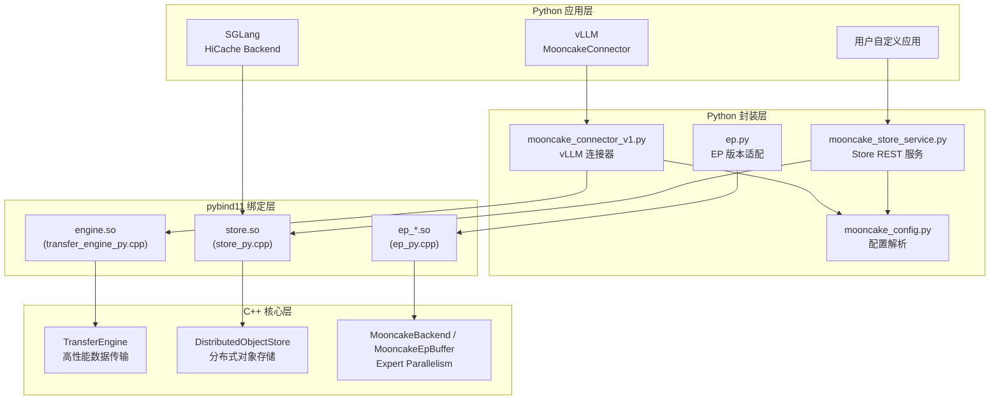
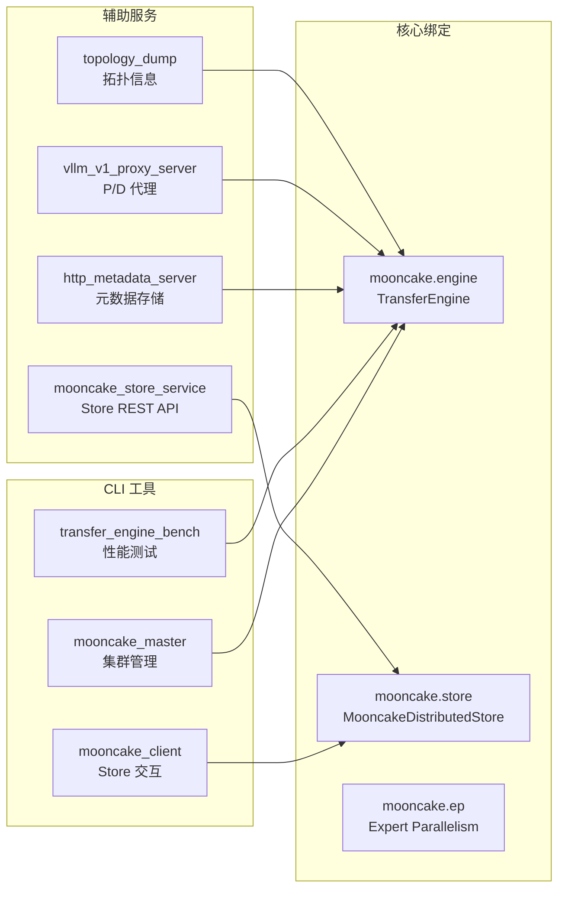

# Python API 与工具概览

[上一篇](02-sglang-integration.md) | [目录](../README.md) | [下一篇](../09-performance/01-benchmarking.md)

---

## 概述

Mooncake 通过 `mooncake-transfer-engine` Python 包（即 `mooncake-wheel`）为上层推理框架提供 Python API。该包封装了三大核心 C++ 模块的 pybind11 绑定，并附带若干 CLI 工具和辅助服务。本文将深入解析 Python 包的结构、各层绑定接口、关键 Python 类以及运维工具链。

---

## 1. Python 包结构

`mooncake-wheel/mooncake/` 目录的完整文件布局如下：

```
mooncake-wheel/mooncake/
├── __init__.py                        # 包入口 (向后兼容导入)
├── engine.so                          # [编译产物] TransferEngine pybind11 模块
├── store.so                           # [编译产物] MooncakeDistributedStore pybind11 模块
├── ep_<torch_version>.so              # [编译产物] Expert Parallelism pybind11 模块
├── ep.py                              # EP 模块版本适配加载器
├── mooncake_config.py                 # MooncakeConfig 配置解析
├── mooncake_connector_v1.py           # vLLM v1 KVConnector 实现
├── mooncake_ep_buffer.py              # EP Buffer 管理
├── mooncake_store_service.py          # Store REST API 服务
├── http_metadata_server.py            # HTTP 元数据服务器
├── vllm_v1_proxy_server.py            # vLLM v1 Proxy Server
├── transfer_engine_topology_dump.py   # 拓扑信息转储工具
├── cli.py                             # mooncake_master CLI 入口
├── cli_client.py                      # mooncake_client CLI 入口
├── cli_bench.py                       # transfer_engine_bench CLI 入口
└── README.md                          # 使用说明
```

### 1.1 Python 绑定架构



---

## 2. Pybind11 绑定架构

Mooncake 的三大核心 C++ 模块通过 pybind11 暴露给 Python，源码位于 `mooncake-integration/` 目录下。

### 2.1 TransferEngine 绑定 (engine.so)

**源文件**: `mooncake-integration/transfer_engine/transfer_engine_py.cpp` / `transfer_engine_py.h`

`TransferEngine` 是最底层的数据传输引擎，提供 RDMA/TCP 内存注册与远程读写能力。

#### 核心类 - `TransferEngine`

```python
from mooncake.engine import TransferEngine

engine = TransferEngine()
engine.initialize(local_hostname, metadata_server, protocol, device_name)
```

#### 主要方法

| 方法 | 说明 |
|------|------|
| `initialize(hostname, metadata_server, protocol, device_name)` | 初始化引擎，支持 P2PHANDSHAKE/etcd/redis/http 元数据模式 |
| `initialize_ext(hostname, metadata_server, protocol, device_name, metadata_type)` | 扩展初始化，显式指定元数据类型 |
| `get_rpc_port()` | 获取 RPC 通信端口 |
| `allocate_managed_buffer(length)` | 分配受管理的 RDMA 注册内存 |
| `free_managed_buffer(ptr, length)` | 释放受管理内存 |
| `register_memory(buffer_addr, capacity)` | 注册已有内存区域用于 RDMA 操作 |
| `batch_register_memory(addresses, capacities)` | 批量注册内存 |
| `unregister_memory(buffer_addr)` | 取消注册内存 |
| `transfer_sync_write(target, buffer, peer_addr, length)` | 同步远程写入 |
| `transfer_sync_read(target, buffer, peer_addr, length)` | 同步远程读取 |
| `batch_transfer_sync_write(target, buffers, peer_addrs, lengths)` | 批量同步写入 |
| `batch_transfer_sync_read(target, buffers, peer_addrs, lengths)` | 批量同步读取 |
| `batch_transfer_async_write(target, buffers, peer_addrs, lengths)` | 批量异步写入，返回 batch_id |
| `batch_transfer_async_read(target, buffers, peer_addrs, lengths)` | 批量异步读取，返回 batch_id |
| `get_batch_transfer_status(batch_ids)` | 查询异步传输状态 |
| `get_local_topology(device_name)` | 获取本地设备拓扑信息 |
| `get_notifies()` | 获取传输通知列表 |

#### 辅助类型

- **`TransferOpcode`** - 传输操作码枚举：`Read`, `Write`
- **`TransferNotify`** - 传输通知结构：`name`, `msg`

### 2.2 Store 绑定 (store.so)

**源文件**: `mooncake-integration/store/store_py.cpp`

`MooncakeDistributedStore` 是分布式对象存储的 Python 接口，支持原始字节和 PyTorch Tensor 的存取。

#### 核心类 - `MooncakeDistributedStore`

```python
from mooncake.store import MooncakeDistributedStore

store = MooncakeDistributedStore()
store.setup(
    local_hostname="192.168.0.1",
    metadata_server="192.168.0.1:2379",
    global_segment_size=3355443200,  # 3.125 GiB
    local_buffer_size=1073741824,    # 1 GiB
    protocol="rdma",
    rdma_devices="erdma_0",
    master_server_addr="192.168.0.1:50051"
)
```

#### 主要方法

**基础 KV 操作**

| 方法 | 说明 |
|------|------|
| `setup(...)` | 初始化 Store 连接 |
| `setup_dummy(mem_pool_size, local_buffer_size, server_address)` | 初始化本地模拟 Store (测试用) |
| `put(key, value, config=ReplicateConfig())` | 存储键值对 |
| `put_batch(keys, values, config)` | 批量存储 |
| `get(key)` | 获取值 (返回 bytes) |
| `get_batch(keys)` | 批量获取 |
| `remove(key)` | 删除键 |
| `remove_all()` | 删除所有键 |
| `remove_by_regex(pattern)` | 正则匹配删除 |
| `is_exist(key)` | 检查键是否存在 |
| `batch_is_exist(keys)` | 批量检查 |
| `get_size(key)` | 获取值的大小 |
| `close()` | 关闭连接 |

**Tensor 操作**

| 方法 | 说明 |
|------|------|
| `put_tensor(key, tensor)` | 存储 PyTorch Tensor |
| `get_tensor(key)` | 获取 PyTorch Tensor |
| `batch_put_tensor(keys, tensors)` | 批量存储 Tensor |
| `batch_get_tensor(keys)` | 批量获取 Tensor |
| `pub_tensor(key, tensor, config)` | 发布 Tensor (支持副本配置) |
| `batch_pub_tensor(keys, tensors, config)` | 批量发布 Tensor |

**Tensor Parallelism 支持**

| 方法 | 说明 |
|------|------|
| `put_tensor_with_tp(key, tensor, tp_rank, tp_size, split_dim)` | 按 TP 分片存储 |
| `get_tensor_with_tp(key, tp_rank, tp_size, split_dim)` | 按 TP 分片获取 |
| `batch_put_tensor_with_tp(keys, tensors, tp_rank, tp_size, split_dim)` | 批量 TP 分片存储 |
| `batch_get_tensor_with_tp(keys, tp_rank, tp_size)` | 批量 TP 分片获取 |

**零拷贝直接访问**

| 方法 | 说明 |
|------|------|
| `register_buffer(buffer_ptr, size)` | 注册内存用于直接访问 |
| `unregister_buffer(buffer_ptr)` | 取消注册 |
| `put_from(key, buffer_ptr, size, config)` | 从预分配缓冲区直接写入 |
| `get_into(key, buffer_ptr, size)` | 直接读取到预分配缓冲区 |
| `batch_put_from(keys, buffer_ptrs, sizes, config)` | 批量直接写入 |
| `batch_get_into(keys, buffer_ptrs, sizes)` | 批量直接读取 |
| `batch_put_from_multi_buffers(keys, all_ptrs, all_sizes, config)` | 多缓冲区批量写入 |
| `batch_get_into_multi_buffers(keys, all_ptrs, all_sizes)` | 多缓冲区批量读取 |

#### 辅助类型

- **`ReplicateConfig`** - 副本配置：`replica_num`, `with_soft_pin`, `preferred_segments`, `prefer_alloc_in_same_node`
- **`ReplicaStatus`** - 副本状态枚举：`UNDEFINED`, `INITIALIZED`, `PROCESSING`, `COMPLETE`, `REMOVED`, `FAILED`
- **`BufferHandle`** - 缓冲区句柄：`ptr()`, `size()`, 支持 Python Buffer Protocol
- **`MooncakeHostMemAllocator`** - 主机内存分配器：`alloc(size)`, `free(ptr)`

### 2.3 Expert Parallelism 绑定 (ep.so)

**源文件**: `mooncake-integration/ep/ep_py.cpp`

EP 模块提供 MoE 模型的 Expert Parallelism 通信后端，作为 `torch.distributed` 的自定义 Backend 注册。

#### 版本适配机制

`ep.py` 根据当前 PyTorch 版本动态加载对应的编译产物：

```python
# ep.py 核心逻辑
import importlib
torch_version = re.match(r"\d+(?:\.\d+)*", torch.__version__).group()
version_suffix = "_" + torch_version.replace(".", "_")
backend_module = importlib.import_module("mooncake.ep" + version_suffix)
```

例如 PyTorch 2.5.0 会加载 `mooncake.ep_2_5_0` 模块。

#### 核心类与函数

| 名称 | 类型 | 说明 |
|------|------|------|
| `createMooncakeBackend` | 函数 | 创建 CUDA 后端 |
| `createMooncakeCpuBackend` | 函数 | 创建 CPU 后端 |
| `MooncakeBackendOptions` | 类 | 后端选项 (active_ranks, is_extension) |
| `Buffer` | 类 | EP 缓冲区管理 |
| `EventHandle` | 类 | CUDA 事件句柄 |
| `set_host_ip` | 函数 | 设置主机 IP |
| `set_device_filter` | 函数 | 设置设备过滤器 |
| `get_preferred_hca` | 函数 | 获取首选 HCA 设备 |
| `get_active_ranks` | 函数 | 获取活跃的 rank 列表 |
| `get_num_synced_ranks` | 函数 | 获取已同步的 rank 数量 |
| `extend_group_size_to` | 函数 | 扩展 group 大小 |
| `get_peer_state` | 函数 | 获取对端状态 |
| `recover_ranks` | 函数 | 恢复指定 rank |
| `get_ep_buffer_size_hint` | 函数 | 获取 EP 缓冲区大小建议 |

#### Buffer 类方法

| 方法 | 说明 |
|------|------|
| `ibgda_disabled()` | 检查 IBGDA 是否禁用 |
| `is_roce()` | 检查是否使用 RoCE |
| `sync_ib()` / `sync_roce()` | 同步 IB/RoCE 连接信息 |
| `get_mr_info()` | 获取 Memory Region 信息 |
| `get_gid()` | 获取 GID |
| `get_local_qpns()` / `get_local_lids()` | 获取本地 QPN/LID |
| `get_ipc_handle()` | 获取 IPC 句柄 |
| `sync_nvlink_ipc_handles()` | 同步 NVLink IPC 句柄 |
| `dispatch(...)` | 执行 Expert Dispatch |
| `combine(...)` | 执行 Expert Combine |
| `get_next_combine_buffer()` | 获取下一个 Combine 缓冲区 |

---

## 3. 关键 Python 类

### 3.1 MooncakeConfig

**源文件**: `mooncake-wheel/mooncake/mooncake_config.py`

配置类，支持从 JSON 文件和环境变量加载：

```python
@dataclass
class MooncakeConfig:
    local_hostname: str            # 本机主机名/IP
    metadata_server: str           # 元数据服务地址
    global_segment_size: int       # 全局段大小 (默认 3.125 GiB)
    local_buffer_size: int         # 本地缓冲区大小 (默认 1 GiB)
    protocol: str                  # 传输协议 (rdma/tcp)
    device_name: Optional[str]     # RDMA 设备名
    master_server_address: str     # Master Server 地址
```

加载方式：

| 方式 | 方法 | 说明 |
|------|------|------|
| JSON 文件 | `MooncakeConfig.from_file(path)` | 从 JSON 配置文件加载 |
| 环境变量 | `MooncakeConfig.load_from_env()` | 优先尝试 `MOONCAKE_CONFIG_PATH`，回退到独立环境变量 |

相关环境变量：

| 环境变量 | 说明 |
|----------|------|
| `MOONCAKE_CONFIG_PATH` | JSON 配置文件路径 |
| `MOONCAKE_MASTER` | Master Server 地址 |
| `MOONCAKE_PROTOCOL` | 传输协议 (默认 tcp) |
| `MOONCAKE_DEVICE` | RDMA 设备名 |
| `MOONCAKE_TE_META_DATA_SERVER` | 元数据服务地址 (默认 P2PHANDSHAKE) |
| `MOONCAKE_LOCAL_HOSTNAME` | 本地主机名 (默认 localhost) |
| `MOONCAKE_GLOBAL_SEGMENT_SIZE` | 全局段大小 |
| `MOONCAKE_LOCAL_BUFFER_SIZE` | 本地缓冲区大小 |

### 3.2 MooncakeStoreService

**源文件**: `mooncake-wheel/mooncake/mooncake_store_service.py`

提供 REST API 封装的 Store 服务，基于 aiohttp：

```python
service = MooncakeStoreService(config_path="mooncake.json")
await service.start_store_service()
await service.start_http_service(port=8080)
```

REST API 端点：

| 方法 | 路径 | 说明 |
|------|------|------|
| PUT | `/api/put` | 存储键值对 |
| GET | `/api/get/{key}` | 获取值 |
| GET | `/api/exist/{key}` | 检查键是否存在 |
| DELETE | `/api/remove/{key}` | 删除键 |
| DELETE | `/api/remove_all` | 删除所有键 |

### 3.3 KVBootstrapServer

**源文件**: `mooncake-wheel/mooncake/http_metadata_server.py`

轻量级 HTTP 元数据服务器，可替代 etcd 用于存储 TransferEngine 的连接元数据：

```python
server = KVBootstrapServer(port=8080, host="0.0.0.0")
server.run()  # 后台线程启动
```

支持的操作：`GET /metadata?key=xxx`, `PUT /metadata?key=xxx`, `DELETE /metadata?key=xxx`

---

## 4. CLI 工具

Mooncake 提供三个 CLI 工具，通过 `setup.py` 的 `console_scripts` 入口点注册。

### 4.1 mooncake_master

**入口**: `mooncake-wheel/mooncake/cli.py`

Master 守护进程，负责 Store 服务的集群管理与协调。

```bash
mooncake_master --port 50051
```

内部实际调用打包在 wheel 中的预编译二进制文件 `mooncake_master`。

### 4.2 mooncake_client

**入口**: `mooncake-wheel/mooncake/cli_client.py`

Store 客户端工具，用于与 Store 服务交互。

```bash
mooncake_client [options]
```

### 4.3 transfer_engine_bench (mooncake_bench)

**入口**: `mooncake-wheel/mooncake/cli_bench.py`

TransferEngine 性能基准测试工具。

```bash
transfer_engine_bench [options]
```

### 4.4 工具链概览



---

## 5. HTTP 元数据服务器

### 5.1 概述

`http_metadata_server.py` 实现了一个轻量级的 HTTP 元数据存储服务，用于替代 etcd/redis 作为 TransferEngine 的元数据后端。它特别适合快速部署和测试场景，无需安装和维护外部依赖。

### 5.2 架构设计

```python
class KVBootstrapServer:
    """
    基于 aiohttp 的 HTTP 元数据服务器
    - 线程安全的内存 KV 存储
    - 支持 GET/PUT/DELETE 操作
    - 后台线程运行，不阻塞主程序
    """
```

### 5.3 服务状态枚举

```python
class KVPoll(Enum):
    Failed = 0           # 服务失败
    Bootstrapping = 1    # 启动中
    WaitingForInput = 2  # 等待输入
    Transferring = 3     # 传输中
    Success = 4          # 运行正常
```

### 5.4 使用方式

**独立启动**：

```bash
python -m mooncake.http_metadata_server --port 8080 --host 0.0.0.0
```

**编程使用**：

```python
from mooncake.http_metadata_server import KVBootstrapServer

server = KVBootstrapServer(port=8080)
server.run()

# 检查服务状态
status = server.poll()  # KVPoll.Success

# 优雅关闭
server.close()
```

### 5.5 元数据后端选择指南

| 后端 | 适用场景 | 依赖 | 高可用 |
|------|----------|------|--------|
| `P2PHANDSHAKE` | vLLM v1.0 集成 (默认) | 无 | 不支持 |
| `http` | 快速测试、单节点部署 | 无 | 不支持 |
| `etcd` | 生产环境、多节点集群 | etcd 服务 | 支持 |
| `redis` | 生产环境、已有 Redis 基础设施 | Redis 服务 | 支持 |

---

## 参考资源

- 包源码: [`mooncake-wheel/mooncake/`](https://github.com/kvcache-ai/Mooncake/tree/main/mooncake-wheel/mooncake/)
- TransferEngine 绑定: [`mooncake-integration/transfer_engine/transfer_engine_py.cpp`](https://github.com/kvcache-ai/Mooncake/blob/main/mooncake-integration/transfer_engine/transfer_engine_py.cpp)
- Store 绑定: [`mooncake-integration/store/store_py.cpp`](https://github.com/kvcache-ai/Mooncake/blob/main/mooncake-integration/store/store_py.cpp)
- EP 绑定: [`mooncake-integration/ep/ep_py.cpp`](https://github.com/kvcache-ai/Mooncake/blob/main/mooncake-integration/ep/ep_py.cpp)
- 配置说明: [`mooncake-wheel/mooncake/mooncake_config.py`](https://github.com/kvcache-ai/Mooncake/blob/main/mooncake-wheel/mooncake/mooncake_config.py)

---

[上一篇](02-sglang-integration.md) | [目录](../README.md) | [下一篇](../09-performance/01-benchmarking.md)
