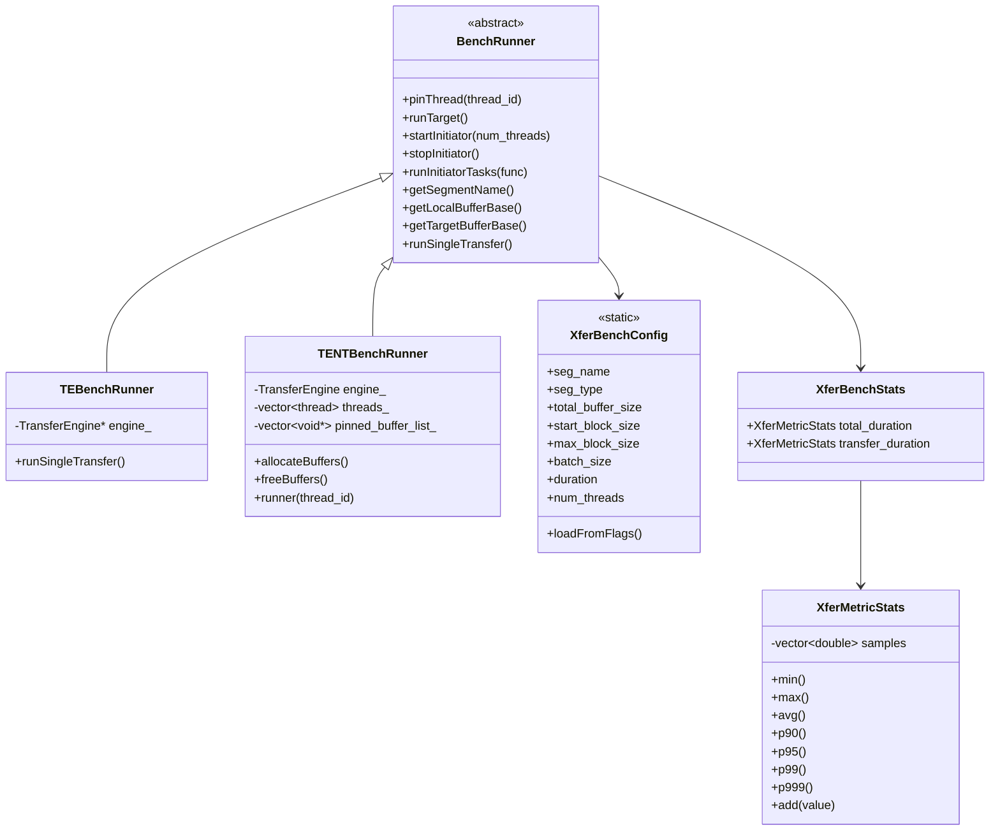
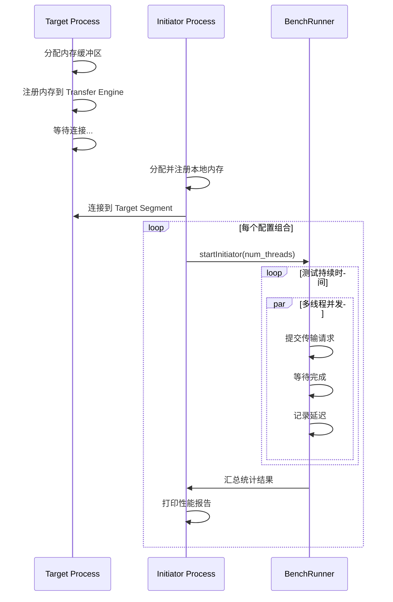
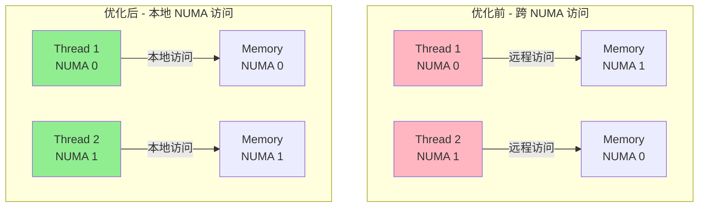
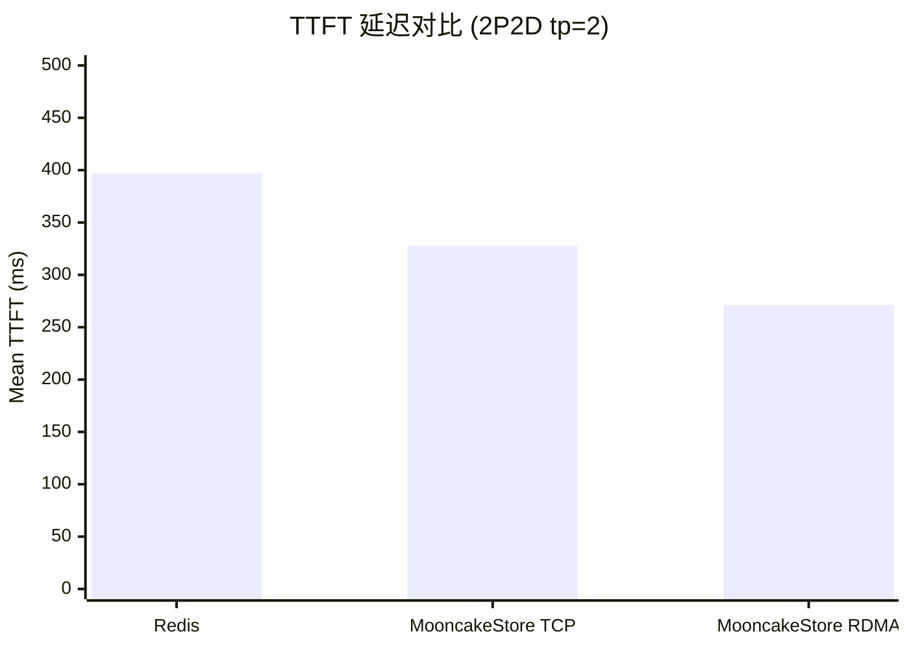
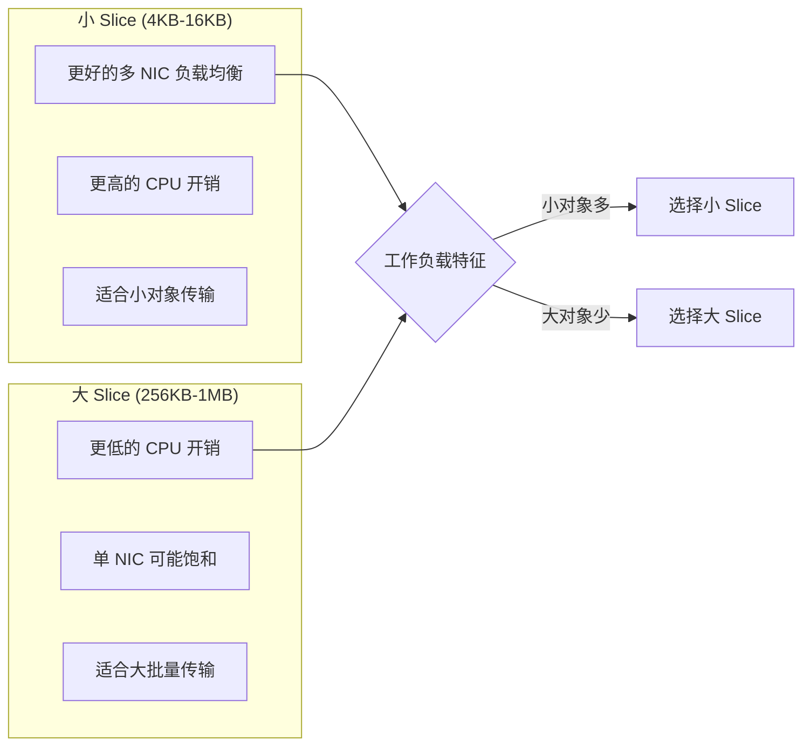
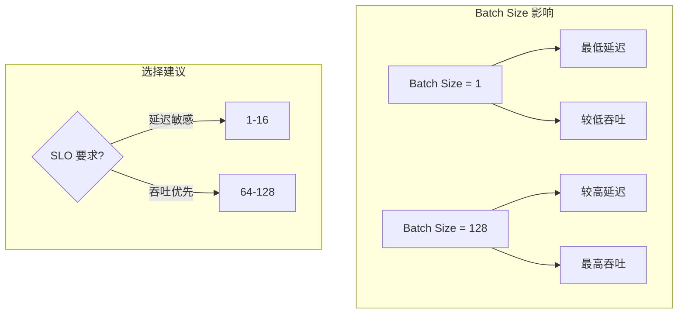

[上一篇](../08-integration/) | [目录](../README.md) | [下一篇](02-monitoring.md)

# 性能基准测试与调优

## 11.1 性能测试框架概述

Mooncake 提供了完善的性能测试框架，用于验证系统性能、评估优化效果和进行回归测试。测试框架位于 `mooncake-transfer-engine/benchmark` 目录下。

### 11.1.1 测试架构设计



### 11.1.2 配置参数说明

```cpp
// mooncake-transfer-engine/benchmark/utils.cpp
DEFINE_string(seg_type, "DRAM",
              "Memory segment type: DRAM|VRAM");
DEFINE_uint64(total_buffer_size, 1UL << 30,
              "Total buffer size (in bytes).");
DEFINE_uint64(start_block_size, 4096, "Start block size (in bytes).");
DEFINE_uint64(max_block_size, 1UL << 26, "Maximum block size (in bytes).");
DEFINE_uint64(start_batch_size, 1, "Start batch size.");
DEFINE_uint64(max_batch_size, 1, "Maximum batch size.");
DEFINE_int32(duration, 5, "Duration per test case (seconds).");
DEFINE_int32(max_num_threads, 1, "Maximum number of worker threads.");
DEFINE_string(op_type, "read", "Operation type: read|write|mix");
DEFINE_bool(check_consistency, false, "Enable data consistency check.");
```

关键参数说明：

| 参数 | 含义 | 推荐值 |
|------|------|--------|
| `total_buffer_size` | 测试缓冲区总大小 | 1GB-4GB |
| `block_size` | 单次传输块大小 | 64KB-64MB |
| `batch_size` | 批处理请求数量 | 1-128 |
| `num_threads` | 并发工作线程数 | 4-12 |
| `duration` | 每个测试用例持续时间 | 5-30秒 |

### 11.1.3 Benchmark 工作流程



### 11.1.4 统计指标计算

```cpp
// mooncake-transfer-engine/benchmark/utils.cpp
double XferMetricStats::percentile(double p) {
    if (samples.empty()) return 0.0;
    if (p <= 0) return min();
    if (p >= 100) return max();

    std::vector<double> sorted = samples;
    std::sort(sorted.begin(), sorted.end());

    double rank = (p / 100.0) * (sorted.size() - 1);
    size_t idx = static_cast<size_t>(rank);
    double frac = rank - idx;

    // 线性插值计算精确百分位
    if (idx + 1 < sorted.size()) {
        return sorted[idx] * (1.0 - frac) + sorted[idx + 1] * frac;
    } else {
        return sorted[idx];
    }
}

void printStats(size_t block_size, size_t batch_size,
                XferBenchStats& stats, int num_threads) {
    auto num_ops = stats.transfer_duration.count();
    double total_duration = stats.total_duration.avg();

    // 计算总传输数据量
    size_t total_data = (block_size * batch_size) * num_ops;

    // 计算平均延迟
    double avg_latency = (total_duration * num_threads / num_ops);

    // 计算吞吐量 (GB/s)
    double throughput_gb = ((double)total_data / (1e9)) /
                          (total_duration / 1e6);

    std::cout << std::setw(14) << block_size
              << std::setw(8)  << batch_size
              << std::setw(14) << throughput_gb
              << std::setw(14) << avg_latency
              << std::setw(14) << stats.transfer_duration.p99()
              << std::setw(14) << stats.transfer_duration.p999()
              << std::endl;
}
```

### 11.1.5 运行 Benchmark

**启动 Target 端**：
```bash
./tebench --backend=tent --seg_type=DRAM
# 输出:
# To start initiators, run
#   ./tebench --target_seg_name=hostname:15428 ...
```

**启动 Initiator 端**：
```bash
./tebench --backend=tent \
    --target_seg_name=hostname:15428 \
    --op_type=read \
    --start_block_size=4096 \
    --max_block_size=67108864 \
    --start_batch_size=1 \
    --max_batch_size=128 \
    --max_num_threads=8 \
    --duration=10
```

**输出示例**：
```
BlkSize (B)   Batch   BW (GB/S)     Avg Lat (us)  Avg Tx (us)   P99 Tx (us)   P999 Tx (us)
------------------------------------------------------------------------------------------------
4096          1       0.312456      13.1          12.8          15.2          18.7
4096          16      4.982134      12.9          12.6          14.8          17.3
65536         1       5.123456      12.8          12.5          14.5          16.9
65536         128     23.456789     356.2         354.1         412.3         489.6
1048576       1       22.345678     47.0          46.3          52.1          61.8
67108864      1       24.123456     2780.5        2778.2        2812.4        2845.1
```

## 11.2 TENT 后端测试实现

### 11.2.1 内存分配与注册

```cpp
// mooncake-transfer-engine/benchmark/tent_backend.cpp
int TENTBenchRunner::allocateBuffers() {
    auto total_buffer_size = XferBenchConfig::total_buffer_size;

    if (XferBenchConfig::seg_type == "DRAM") {
        int num_buffers = numa_num_configured_nodes();
        pinned_buffer_list_.resize(num_buffers, nullptr);

        auto start_ts = getCurrentTimeInNano();

        // 每个 NUMA 节点分配一个缓冲区
        for (int i = 0; i < num_buffers; ++i) {
            auto location = "cpu:" + std::to_string(i);
            CHECK_FAIL(engine_->allocateLocalMemory(
                &pinned_buffer_list_[i], total_buffer_size, location));
        }

        auto allocated_ts = getCurrentTimeInNano();

        // 批量注册内存
        std::vector<size_t> buffers_size(
            pinned_buffer_list_.size(), total_buffer_size);
        CHECK_FAIL(engine_->registerLocalMemory(
            pinned_buffer_list_, buffers_size));

        auto registered_ts = getCurrentTimeInNano();

        LOG(INFO) << "Allocated " << total_buffer_size * num_buffers
                  << " bytes in " << (allocated_ts - start_ts) / 1e6
                  << " ms, registered in "
                  << (registered_ts - allocated_ts) / 1e6 << " ms";

    } else if (XferBenchConfig::seg_type == "VRAM") {
        int num_buffers = 0;
        cudaGetDeviceCount(&num_buffers);
        pinned_buffer_list_.resize(num_buffers, nullptr);

        for (int i = 0; i < num_buffers; ++i) {
            auto location = "cuda:" + std::to_string(i);
            CHECK_FAIL(engine_->allocateLocalMemory(
                &pinned_buffer_list_[i], total_buffer_size, location));
            CHECK_FAIL(engine_->registerLocalMemory(
                pinned_buffer_list_[i], total_buffer_size));
        }
    }

    return 0;
}
```

### 11.2.2 线程绑定策略

```cpp
// mooncake-transfer-engine/benchmark/tent_backend.cpp
void TENTBenchRunner::pinThread(int thread_id) {
    // 获取线程使用的缓冲区位置
    uint64_t addr = (uint64_t)pinned_buffer_list_[
        thread_id % pinned_buffer_list_.size()];

    // 查询内存所在位置
    auto result = Platform::getLoader().getLocation((void*)addr, 1);
    LocationParser location(result[0].location);

    if (location.type() == "cpu") {
        // 绑定到对应 NUMA Socket
        auto socket_id = location.index();
        bindToSocket(socket_id);
    } else if (location.type() == "cuda") {
        // GPU 内存，绑定到 GPU 所在的 NUMA 节点
        auto device_id = location.index();
        auto socket_id = getCudaDeviceNumaID(device_id);
        bindToSocket(socket_id);
    }
}

static inline int getCudaDeviceNumaID(int cuda_id) {
    char pci_bus_id[20];
    auto err = cudaDeviceGetPCIBusId(pci_bus_id, sizeof(pci_bus_id), cuda_id);
    if (err != cudaSuccess) {
        LOG(WARNING) << "cudaDeviceGetPCIBusId: " << cudaGetErrorString(err);
        return 0;
    }

    // 转为小写格式
    for (char* ch = pci_bus_id; (*ch = tolower(*ch)); ch++);

    // 从 sysfs 获取 NUMA 节点
    return getNumaNodeFromPciDevice(pci_bus_id);
}
```

线程绑定的重要性：



### 11.2.3 单次传输执行

```cpp
// mooncake-transfer-engine/benchmark/tent_backend.cpp
double TENTBenchRunner::runSingleTransfer(
    uint64_t local_addr, uint64_t target_addr,
    uint64_t block_size, uint64_t batch_size, OpCode opcode) {

    // 分配批次
    auto batch_id = engine_->allocateBatch(batch_size);

    // 构建请求列表
    std::vector<Request> requests;
    for (uint64_t i = 0; i < batch_size; ++i) {
        Request entry;
        entry.opcode = opcode == READ ? Request::READ : Request::WRITE;
        entry.length = block_size;
        entry.source = (void*)(local_addr + block_size * i);
        entry.target_id = handle_;
        entry.target_offset = target_addr + block_size * i;
        requests.emplace_back(entry);
    }

    // 计时开始
    XferBenchTimer timer;

    // 提交传输
    CHECK_FAIL(engine_->submitTransfer(batch_id, requests));

    // 等待完成
    while (true) {
        TransferStatus overall_status;
        CHECK_FAIL(engine_->getTransferStatus(batch_id, overall_status));

        if (overall_status.s == TransferStatusEnum::COMPLETED) {
            break;
        } else if (overall_status.s == TransferStatusEnum::FAILED) {
            LOG(ERROR) << "Failed transfer detected";
            exit(EXIT_FAILURE);
        }
    }

    auto duration = timer.lap_us();

    // 释放批次
    CHECK_FAIL(engine_->freeBatch(batch_id));

    return duration;
}
```

## 11.3 Mooncake Store 性能测试

### 11.3.1 Master Service 基准测试

```cpp
// mooncake-store/benchmarks/master_bench.cpp
class BenchClient {
public:
    void BenchFn(std::shared_ptr<std::latch> barrier,
                 BenchOperation operation,
                 uint64_t batch_size, uint64_t value_size,
                 uint64_t num_keys) {

        // 解绑 CPU 亲和性，让系统自动调度
        unset_cpu_affinity();

        uint64_t key_id = 0;
        const mooncake::ReplicateConfig config;

        // 预分配 slice_lengths
        std::vector<std::vector<uint64_t>> slice_lengths;
        slice_lengths.reserve(batch_size);
        for (size_t i = 0; i < batch_size; i++) {
            slice_lengths.push_back({value_size});
        }

        // Get 操作需要预填充数据
        if (operation == BenchOperation::GET ||
            operation == BenchOperation::BATCH_GET) {
            PrefillKeys(key_id, batch_size, value_size, num_keys);
        }

        // 同步所有线程开始
        barrier->arrive_and_wait();

        // 主测试循环
        while (running_.load()) {
            switch (operation) {
                case BenchOperation::PUT:
                    keys = GeneratePutKeys(key_id, 1);
                    if (Put(keys[0], slice_lengths[0], config)) {
                        gCompletedOperations.fetch_add(1);
                    }
                    break;

                case BenchOperation::BATCH_PUT:
                    keys = GeneratePutKeys(key_id, batch_size);
                    gCompletedOperations.fetch_add(
                        BatchPut(keys, slice_lengths, config));
                    break;

                case BenchOperation::GET:
                    keys = GenerateGetKeys(key_id, 1);
                    if (Get(keys[0])) {
                        gCompletedOperations.fetch_add(1);
                    }
                    break;

                case BenchOperation::BATCH_GET:
                    keys = GenerateGetKeys(key_id, batch_size);
                    gCompletedOperations.fetch_add(BatchGet(keys));
                    break;
            }
        }
    }
};
```

运行 Master Benchmark：
```bash
./master_bench \
    --master_server=127.0.0.1:50051 \
    --num_segments=128 \
    --segment_size=68719476736 \
    --num_clients=4 \
    --num_threads=4 \
    --operation=BatchPut \
    --batch_size=128 \
    --value_size=4096 \
    --duration=60
```

### 11.3.2 性能测试结果分析

基于 NVIDIA A10 的实测结果：

| 配置 | Backend | Output Throughput | Mean TTFT | P99 TTFT | Mean ITL | P99 ITL |
|------|---------|-------------------|-----------|----------|----------|---------|
| 2P2D tp=1 | Redis | 12.06 tok/s | 844.28ms | 2270.91ms | 16.88ms | 104.83ms |
| 2P2D tp=1 | MooncakeStore (TCP) | 12.07 tok/s | 817.43ms | 1969.89ms | 12.49ms | 45.52ms |
| 2P2D tp=1 | MooncakeStore (RDMA) | 12.08 tok/s | 763.58ms | 2030.34ms | 12.43ms | 43.02ms |
| 2P2D tp=2 | Redis | 12.13 tok/s | 397.20ms | 782.44ms | 9.00ms | 36.06ms |
| 2P2D tp=2 | MooncakeStore (RDMA) | 12.15 tok/s | 271.25ms | 532.00ms | 8.34ms | 14.70ms |



### 11.3.3 P/D 分离性能优势

SGLang 集成测试结果（Traffic Rate = 4.0）：

| 配置 | Output Throughput | Mean ITL | P99 ITL |
|------|-------------------|----------|---------|
| 1P1D | 1215.17 tok/s | 17.06ms | 19.72ms |
| 2 Regular | 1223.03 tok/s | 25.74ms | 294.89ms |

**关键发现**：
- P/D 分离配置下 ITL 降低约 30%
- P99 尾延迟显著改善（19.72ms vs 294.89ms）
- 在保持相似吞吐量的同时大幅降低延迟抖动

## 11.4 性能调优指南

### 11.4.1 关键环境变量

```bash
# Slice 粒度控制
export MC_SLICE_SIZE=65536  # 默认 64KB

# 传输引擎参数
export MC_NUM_CQ_POLL_THREADS=2
export MC_MAX_BATCH_SIZE=128
export MC_ASYNC_TRANSFER_LIMIT=1000

# RDMA 调优
export MC_RDMA_MAX_WR_DEPTH=128
export MC_RDMA_MAX_SGE=1
export MC_RDMA_QP_COUNT=4
```

### 11.4.2 Slice 大小调优



推荐配置：

| 场景 | Slice 大小 | 理由 |
|------|------------|------|
| KVCache 传输 | 64KB | 平衡延迟和吞吐 |
| 模型权重加载 | 256KB-1MB | 最大化带宽利用 |
| 小批量推理 | 16KB-32KB | 降低尾延迟 |

### 11.4.3 线程数调优

```cpp
// 推荐：前端线程数 = NUMA 节点数 × 2-4
int optimal_threads = numa_num_configured_nodes() * 3;

// 每线程处理能力约 10-15 GB/s
// 总带宽需求 / 单线程能力 = 最小线程数
```

线程数与带宽关系（实测）：

| 线程数 | 带宽利用率 | CPU 开销 |
|--------|------------|----------|
| 1 | ~20% | 低 |
| 4 | ~60% | 中 |
| 8 | ~85% | 中高 |
| 12 | ~95% | 高 |

### 11.4.4 批处理大小调优



---

[上一篇](../08-integration/) | [目录](../README.md) | [下一篇](02-monitoring.md)
