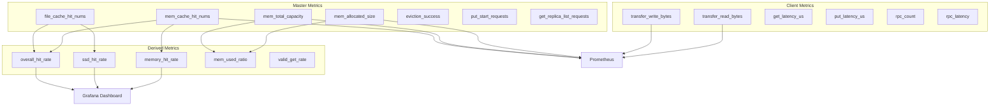
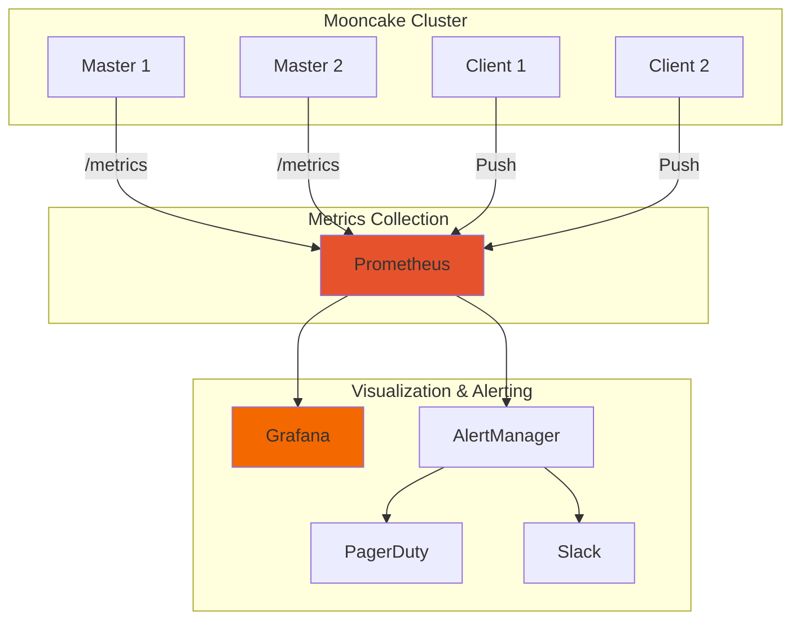

[上一篇](01-benchmarking.md) | [目录](../README.md) | [下一篇](../10-deployment/01-deployment-guide.md)

# 监控与可观测性

## 12.1 指标体系设计

### 12.1.1 客户端指标

```cpp
// mooncake-store/include/client_metric.h

// 延迟分桶配置（微秒）
// 针对 RDMA 优化：亚毫秒到秒级别的精细粒度
const std::vector<double> kLatencyBucket = {
    // 亚毫秒到 1ms 区间
    125, 150, 200, 250, 300, 400, 500, 750, 1000,
    // 毫秒级尾部
    1500, 2000, 3000, 5000, 7000, 15000, 20000,
    // 长尾保护
    50000, 100000, 200000, 500000, 1000000
};

struct TransferMetric {
    TransferMetric(std::map<std::string, std::string> labels = {})
        : total_read_bytes("mooncake_transfer_read_bytes",
                          "Total bytes read", labels),
          total_write_bytes("mooncake_transfer_write_bytes",
                           "Total bytes written", labels),
          batch_put_latency_us("mooncake_transfer_batch_put_latency",
                              "Batch Put transfer latency (us)",
                              kLatencyBucket, labels),
          batch_get_latency_us("mooncake_transfer_batch_get_latency",
                              "Batch Get transfer latency (us)",
                              kLatencyBucket, labels),
          get_latency_us("mooncake_transfer_get_latency",
                        "Get transfer latency (us)",
                        kLatencyBucket, labels),
          put_latency_us("mooncake_transfer_put_latency",
                        "Put transfer latency (us)",
                        kLatencyBucket, labels) {}

    ylt::metric::counter_t total_read_bytes;
    ylt::metric::counter_t total_write_bytes;
    ylt::metric::histogram_t batch_put_latency_us;
    ylt::metric::histogram_t batch_get_latency_us;
    ylt::metric::histogram_t get_latency_us;
    ylt::metric::histogram_t put_latency_us;
};

struct MasterClientMetric {
    std::array<std::string, 1> rpc_names = {"rpc_name"};

    MasterClientMetric(std::map<std::string, std::string> labels = {})
        : rpc_count("mooncake_client_rpc_count",
                   "Total number of RPC calls", labels, rpc_names),
          rpc_latency("mooncake_client_rpc_latency",
                     "Latency of RPC calls (us)",
                     kLatencyBucket, labels, rpc_names) {}

    ylt::metric::hybrid_counter_1t rpc_count;
    ylt::metric::hybrid_histogram_1t rpc_latency;
};
```

### 12.1.2 服务端指标

```cpp
// mooncake-store/include/master_metric_manager.h

class MasterMetricManager {
public:
    static MasterMetricManager& instance();

    // ===== 内存存储指标 =====
    void inc_allocated_mem_size(const std::string& segment, int64_t val = 1);
    void dec_allocated_mem_size(const std::string& segment, int64_t val = 1);
    void inc_total_mem_capacity(const std::string& segment, int64_t val = 1);
    void dec_total_mem_capacity(const std::string& segment, int64_t val = 1);
    double get_global_mem_used_ratio();
    double get_segment_mem_used_ratio(const std::string& segment);

    // ===== 缓存命中统计 =====
    void inc_mem_cache_hit_nums(int64_t val = 1);
    void inc_file_cache_hit_nums(int64_t val = 1);
    void inc_mem_cache_nums(int64_t val = 1);
    void inc_file_cache_nums(int64_t val = 1);
    void inc_valid_get_nums(int64_t val = 1);
    void inc_total_get_nums(int64_t val = 1);

    enum class CacheHitStat {
        MEMORY_HITS,
        SSD_HITS,
        MEMORY_TOTAL,
        SSD_TOTAL,
        MEMORY_HIT_RATE,
        SSD_HIT_RATE,
        OVERALL_HIT_RATE,
        VALID_GET_RATE
    };
    CacheHitStatDict calculate_cache_stats();

    // ===== 操作统计 =====
    void inc_put_start_requests(int64_t val = 1);
    void inc_put_start_failures(int64_t val = 1);
    void inc_get_replica_list_requests(int64_t val = 1);
    void inc_get_replica_list_failures(int64_t val = 1);
    // ... 更多操作指标

    // ===== 批量操作统计 =====
    void inc_batch_put_start_requests(int64_t items);
    void inc_batch_put_start_failures(int64_t failed_items);
    void inc_batch_put_start_partial_success(int64_t failed_items);

    // ===== 驱逐指标 =====
    void inc_eviction_success(int64_t key_count, int64_t size);
    void inc_eviction_fail();

    // ===== 序列化 =====
    std::string serialize_metrics();  // Prometheus 格式
    std::string get_summary_string(); // 人类可读格式

private:
    // 内存指标
    ylt::metric::gauge_t mem_allocated_size_;
    ylt::metric::gauge_t mem_total_capacity_;
    ylt::metric::dynamic_gauge_1t mem_allocated_size_per_segment_;
    ylt::metric::dynamic_gauge_1t mem_total_capacity_per_segment_;

    // 文件存储指标
    ylt::metric::gauge_t file_allocated_size_;
    ylt::metric::gauge_t file_total_capacity_;

    // 缓存命中指标
    ylt::metric::counter_t mem_cache_hit_nums_;
    ylt::metric::counter_t file_cache_hit_nums_;
    ylt::metric::gauge_t mem_cache_nums_;
    ylt::metric::gauge_t file_cache_nums_;

    // 操作计数器
    ylt::metric::counter_t put_start_requests_;
    ylt::metric::counter_t put_start_failures_;
    ylt::metric::counter_t get_replica_list_requests_;
    ylt::metric::counter_t get_replica_list_failures_;
    // ...
};
```

### 12.1.3 指标体系全景



## 12.2 指标收集实现

### 12.2.1 客户端指标收集

```cpp
// 客户端指标创建
std::unique_ptr<ClientMetric> ClientMetric::Create(
    std::map<std::string, std::string> labels) {

    // 检查是否启用指标收集
    const char* env_enabled = getenv("MC_STORE_CLIENT_METRIC");
    if (env_enabled && (strcmp(env_enabled, "0") == 0 ||
                        strcmp(env_enabled, "false") == 0)) {
        return nullptr;
    }

    // 获取报告间隔
    uint64_t interval = 0;
    const char* env_interval = getenv("MC_STORE_CLIENT_METRIC_INTERVAL");
    if (env_interval) {
        interval = std::stoull(env_interval);
    }

    // 合并静态标签
    auto merged_labels = merge_labels(labels);

    return std::make_unique<ClientMetric>(interval, merged_labels);
}

// 使用示例
void RealClient::Get(const std::string& key, ...) {
    auto start_time = std::chrono::high_resolution_clock::now();

    // ... 执行 Get 操作

    auto end_time = std::chrono::high_resolution_clock::now();
    auto duration_us = std::chrono::duration_cast<
        std::chrono::microseconds>(end_time - start_time).count();

    if (metric_) {
        metric_->transfer_metric.get_latency_us.observe(duration_us);
        metric_->transfer_metric.total_read_bytes.inc(total_bytes);
    }
}
```

### 12.2.2 Prometheus 指标格式

```cpp
std::string MasterMetricManager::serialize_metrics() {
    std::string str;

    // 内存指标
    mem_allocated_size_.serialize(str);
    mem_total_capacity_.serialize(str);
    mem_allocated_size_per_segment_.serialize(str);
    mem_total_capacity_per_segment_.serialize(str);

    // 文件存储指标
    file_allocated_size_.serialize(str);
    file_total_capacity_.serialize(str);

    // 缓存命中指标
    mem_cache_hit_nums_.serialize(str);
    file_cache_hit_nums_.serialize(str);

    // 操作统计
    put_start_requests_.serialize(str);
    put_start_failures_.serialize(str);
    // ...

    return str;
}
```

输出示例：
```prometheus
# HELP mooncake_master_mem_allocated_size Currently allocated memory size
# TYPE mooncake_master_mem_allocated_size gauge
mooncake_master_mem_allocated_size{cluster_id="prod-1"} 1073741824

# HELP mooncake_master_mem_cache_hit_nums Memory cache hit count
# TYPE mooncake_master_mem_cache_hit_nums counter
mooncake_master_mem_cache_hit_nums{cluster_id="prod-1"} 12345678

# HELP mooncake_transfer_get_latency Get transfer latency in microseconds
# TYPE mooncake_transfer_get_latency histogram
mooncake_transfer_get_latency_bucket{le="125"} 1000
mooncake_transfer_get_latency_bucket{le="250"} 5000
mooncake_transfer_get_latency_bucket{le="500"} 9500
mooncake_transfer_get_latency_bucket{le="1000"} 9900
mooncake_transfer_get_latency_bucket{le="+Inf"} 10000
mooncake_transfer_get_latency_sum 2500000
mooncake_transfer_get_latency_count 10000
```

### 12.2.3 人类可读摘要

```cpp
std::string TransferMetric::summary_metrics() {
    std::stringstream ss;
    ss << "=== Transfer Metrics Summary ===\n";

    // 传输字节数
    auto read_bytes = total_read_bytes.value();
    auto write_bytes = total_write_bytes.value();
    ss << "Total Read: " << byte_size_to_string(read_bytes) << "\n";
    ss << "Total Write: " << byte_size_to_string(write_bytes) << "\n";

    // 延迟摘要
    ss << "\n=== Latency Summary (microseconds) ===\n";
    ss << "Get: " << format_latency_summary(get_latency_us) << "\n";
    ss << "Put: " << format_latency_summary(put_latency_us) << "\n";
    ss << "Batch Get: " << format_latency_summary(batch_get_latency_us) << "\n";
    ss << "Batch Put: " << format_latency_summary(batch_put_latency_us) << "\n";

    return ss.str();
}
```

输出示例：
```
=== Transfer Metrics Summary ===
Total Read: 1.23 TB
Total Write: 456.78 GB

=== Latency Summary (microseconds) ===
Get: count=1000000, p95<500μs, max<2000μs
Put: count=500000, p95<750μs, max<3000μs
Batch Get: count=50000, p95<1500μs, max<5000μs
Batch Put: count=25000, p95<2000μs, max<7000μs
```

## 12.3 可视化与告警

### 12.3.1 Grafana Dashboard 配置

```json
{
  "dashboard": {
    "title": "Mooncake Store Metrics",
    "panels": [
      {
        "title": "Memory Utilization",
        "type": "gauge",
        "targets": [{
          "expr": "mooncake_master_mem_allocated_size / mooncake_master_mem_total_capacity * 100"
        }],
        "thresholds": [
          {"value": 70, "color": "green"},
          {"value": 85, "color": "yellow"},
          {"value": 95, "color": "red"}
        ]
      },
      {
        "title": "Cache Hit Rate",
        "type": "graph",
        "targets": [
          {
            "expr": "rate(mooncake_master_mem_cache_hit_nums[5m]) / rate(mooncake_master_total_get_nums[5m]) * 100",
            "legendFormat": "Memory Hit Rate"
          },
          {
            "expr": "rate(mooncake_master_file_cache_hit_nums[5m]) / rate(mooncake_master_total_get_nums[5m]) * 100",
            "legendFormat": "SSD Hit Rate"
          }
        ]
      },
      {
        "title": "Transfer Latency (P99)",
        "type": "graph",
        "targets": [{
          "expr": "histogram_quantile(0.99, rate(mooncake_transfer_get_latency_bucket[5m]))",
          "legendFormat": "Get P99"
        }]
      }
    ]
  }
}
```

### 12.3.2 告警规则

```yaml
# Prometheus AlertManager 规则
groups:
  - name: mooncake_alerts
    rules:
      # 内存使用率告警
      - alert: HighMemoryUsage
        expr: |
          mooncake_master_mem_allocated_size /
          mooncake_master_mem_total_capacity > 0.9
        for: 5m
        labels:
          severity: warning
        annotations:
          summary: "High memory usage detected"
          description: "Memory usage is above 90% for 5 minutes"

      # 缓存命中率告警
      - alert: LowCacheHitRate
        expr: |
          rate(mooncake_master_mem_cache_hit_nums[5m]) /
          rate(mooncake_master_total_get_nums[5m]) < 0.5
        for: 10m
        labels:
          severity: warning
        annotations:
          summary: "Low cache hit rate"
          description: "Memory cache hit rate below 50%"

      # 高延迟告警
      - alert: HighTransferLatency
        expr: |
          histogram_quantile(0.99,
            rate(mooncake_transfer_get_latency_bucket[5m])) > 10000
        for: 5m
        labels:
          severity: critical
        annotations:
          summary: "High transfer latency"
          description: "P99 latency exceeds 10ms"

      # 驱逐失败告警
      - alert: EvictionFailures
        expr: |
          rate(mooncake_master_eviction_attempts[5m]) -
          rate(mooncake_master_eviction_success[5m]) > 10
        for: 5m
        labels:
          severity: warning
        annotations:
          summary: "High eviction failure rate"
```

### 12.3.3 监控架构



---

[上一篇](01-benchmarking.md) | [目录](../README.md) | [下一篇](../10-deployment/01-deployment-guide.md)
