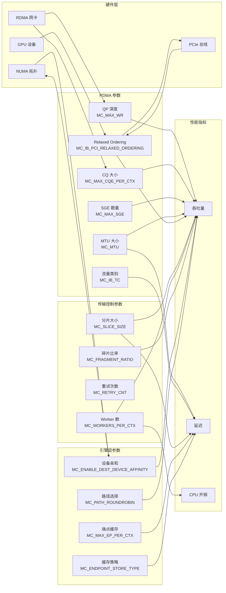

[上一篇](02-monitoring.md) | [目录](../README.md)

# 性能调优指南

本章系统性地介绍 Mooncake 的性能调优方法论，覆盖环境变量、RDMA 参数、TENT 引擎以及 NUMA 亲和性等关键维度。调优的目标是在给定的硬件条件下最大化数据传输吞吐量、最小化尾延迟。

## 12.3 调优参数影响关系

在开始具体调优之前，需要理解各参数之间的相互影响关系。下面的流程图展示了关键调优参数如何影响最终的传输性能。



---

## 12.4 环境变量调优参考

### 12.4.1 MC_* 环境变量分类速查

Mooncake 的环境变量按功能划分为以下几大类。每个变量的详细说明和默认值请参考 [配置参考手册](../10-deployment/02-configuration-reference.md)。

#### RDMA 设备参数

| 环境变量 | 默认值 | 调优方向 | 影响 |
|----------|--------|----------|------|
| `MC_NUM_CQ_PER_CTX` | 1 | 增大以提升并发 CQ 处理能力 | 吞吐量 |
| `MC_NUM_COMP_CHANNELS_PER_CTX` | 1 | 事件驱动场景下增大 | 延迟 |
| `MC_IB_PORT` | 1 | 多端口绑定场景需调整 | 连通性 |
| `MC_GID_INDEX` | -1（自动） | RoCE 环境下需显式指定 | 连通性 |
| `MC_MAX_CQE_PER_CTX` | 4096 | 高并发场景下增大 | 吞吐量 |
| `MC_MAX_EP_PER_CTX` | 65536 | 大规模集群增大 | 连接数 |
| `MC_NUM_QP_PER_EP` | 2 | 增大以提升每连接并行度 | 吞吐量 |

#### 传输性能参数

| 环境变量 | 默认值 | 调优方向 | 影响 |
|----------|--------|----------|------|
| `MC_SLICE_SIZE` | 65536 | 大数据传输场景增大至 128K-1M | 吞吐量/延迟 |
| `MC_WORKERS_PER_CTX` | 2 | 增大到 4-8 以提升处理并行度 | 吞吐量/CPU |
| `MC_MAX_WR` | 256 | 高并发写入场景增大 | 吞吐量 |
| `MC_MAX_SGE` | 4 | 离散内存场景增大 | 吞吐量 |
| `MC_MAX_INLINE` | 64 | 小消息场景可适当增大 | 小消息延迟 |
| `MC_MTU` | 4096 | 保持 4096，低质量网络降至 1024 | 吞吐量 |
| `MC_RETRY_CNT` | 9 | 不稳定网络增大 | 可靠性 |
| `MC_FRAGMENT_RATIO` | 4 | 影响碎片管理粒度 | 内存效率 |

#### 高级调优参数

| 环境变量 | 默认值 | 调优方向 | 影响 |
|----------|--------|----------|------|
| `MC_IB_TC` | -1 | 多租户 QoS 场景设置流量优先级 | QoS |
| `MC_IB_PCI_RELAXED_ORDERING` | 0 | GPU Direct 场景设置为 1 或 2 | GPU 传输吞吐 |
| `MC_ENDPOINT_STORE_TYPE` | `SIEVE` | FIFO 适用于访问均匀场景 | 连接复用效率 |
| `MC_ENABLE_DEST_DEVICE_AFFINITY` | 未设置 | NUMA 感知传输场景启用 | 跨 NUMA 效率 |
| `MC_PATH_ROUNDROBIN` | 未设置 | 大块数据传输场景启用 | 带宽均衡 |
| `MC_ENABLE_PARALLEL_REG_MR` | -1 | 大内存注册场景设为 1 | 注册速度 |

---

## 12.5 分片大小调优 (Slice Size)

### 12.5.1 分片大小的影响

`MC_SLICE_SIZE`（对应 TENT 中的 `workers/block_size`）是影响传输性能的最关键参数之一。它决定了每次 RDMA WRITE 操作的数据粒度。

**核心权衡**:
- **较小的 slice_size**（如 16KB-64KB）：适合小对象传输，延迟敏感型场景，降低单次操作的尾延迟
- **较大的 slice_size**（如 128KB-1MB）：适合大块数据传输，最大化带宽利用率，减少 WR 提交开销

### 12.5.2 推荐配置

| 场景 | 推荐 slice_size | 说明 |
|------|-----------------|------|
| KVCache 传输（典型） | 64KB（默认） | 平衡延迟和吞吐 |
| 大模型权重加载 | 256KB - 1MB | 最大化带宽利用 |
| 小 Tensor 频繁传输 | 16KB - 32KB | 降低传输延迟 |
| 混合负载 | 64KB - 128KB | 折中选择 |

### 12.5.3 碎片控制

`MC_FRAGMENT_RATIO` 与 `MC_SLICE_SIZE` 配合使用，控制传输碎片的粒度：

```
fragment_limit = slice_size / fragment_ratio
```

默认 `fragment_ratio=4`，即 `fragment_limit = 65536 / 4 = 16384` 字节。当传输数据末尾不足一个完整 slice 时，系统以 `fragment_limit` 为粒度进行碎片处理。增大 `fragment_ratio` 会使碎片更细，减少带宽浪费但增加 WR 提交开销。

---

## 12.6 线程数调优 (Thread Count)

### 12.6.1 Worker 线程

**Transfer Engine** 使用 `MC_WORKERS_PER_CTX`，**TENT** 使用 `transports/rdma/workers/num_workers`。

Worker 线程负责：
1. 提交 RDMA WR 到发送队列
2. 轮询完成队列（CQ）获取完成事件
3. 处理重试和错误恢复

| 配置 | 传统 TE 默认值 | TENT 默认值 | 推荐值 |
|------|---------------|-------------|--------|
| Worker 线程数 | 2 | 6 | 与 RDMA 网卡数匹配 |

> **最佳实践**: TENT 建议将 `num_workers`、`num_cq_list`、`qp_mul_factor` 三者设为相同值，以实现最佳的 CQ 分配和 QP 负载均衡。

### 12.6.2 RPC 线程

MasterService 的 `rpc_thread_num` 控制 RPC 服务的并发处理能力：

| 集群规模 | 推荐 rpc_thread_num | 说明 |
|----------|---------------------|------|
| 小规模（< 10 节点） | 4（默认） | 足够处理元数据请求 |
| 中规模（10-100 节点） | 8-16 | 增加并发处理能力 |
| 大规模（> 100 节点） | 16-32 | 防止 RPC 成为瓶颈 |

---

## 12.7 批量大小调优 (Batch Size)

### 12.7.1 Batch 机制概述

Transfer Engine 通过 `allocateBatchID(batch_size)` 或 TENT 的 `allocateBatch(batch_size)` 分配批次，将多个传输请求打包处理。

**batch_size 的影响**:
- **小 batch**（1-4）：适合延迟敏感场景，快速启动传输
- **大 batch**（16-128）：适合吞吐优先场景，减少调度开销，提升带宽利用

### 12.7.2 推荐配置

| 场景 | 推荐 batch_size | 说明 |
|------|-----------------|------|
| 在线推理（低延迟） | 1-4 | 最小化排队延迟 |
| 离线批处理 | 32-128 | 最大化吞吐 |
| KVCache Prefill-Decode 传输 | 8-32 | 平衡延迟与吞吐 |

---

## 12.8 RDMA 参数深度调优

### 12.8.1 QP 深度 (Queue Pair Depth)

QP 深度通过 `MC_MAX_WR`（传统 TE）或 `endpoint/max_qp_wr`（TENT）控制，决定了发送队列中可以容纳的最大 Work Request 数量。

**调优原则**:
- QP 深度过小会导致发送队列满而阻塞，降低吞吐
- QP 深度过大会消耗更多的 HCA 资源，可能触及设备限制

```cpp
// 系统会自动调整为设备支持的最大值
// mooncake-transfer-engine/src/config.cpp
if (config.max_wr > (size_t)device_attr.max_qp_wr)
    config.max_wr = device_attr.max_qp_wr;
```

| 场景 | 推荐 max_wr | 说明 |
|------|-------------|------|
| 通用场景 | 256（默认） | 满足大多数需求 |
| 高并发小消息 | 512-1024 | 防止发送队列满 |
| 大块顺序传输 | 128-256 | 减少资源占用 |

### 12.8.2 CQ 大小 (Completion Queue Size)

`MC_MAX_CQE_PER_CTX` 控制完成队列的深度。CQ 溢出会导致严重的性能问题甚至连接断开。

**调优原则**:
- CQ 大小应至少为所有关联 QP 的 `max_wr` 之和
- 生产环境建议 4096 或更大

### 12.8.3 PCIe Relaxed Ordering

`MC_IB_PCI_RELAXED_ORDERING` 是 GPU Direct RDMA 场景下的关键优化参数：

| 模式 | 值 | 说明 |
|------|-----|------|
| 关闭 | 0 | 严格 PCIe 顺序，兼容性最好 |
| 开启 | 1 | 若硬件支持则启用，提升 GPU Direct 吞吐 |
| 自动 | 2 | 系统自动检测硬件能力并决定 |

> **注意**: Relaxed Ordering 需要 GPU 和 RDMA NIC 同时支持。NVIDIA A100/H100 + ConnectX-6/7 的组合通常可以安全启用。启用后 GPU Direct RDMA 的吞吐量可提升 20%-50%。

### 12.8.4 流量类别 (Traffic Class)

`MC_IB_TC` 用于 InfiniBand QoS 配置，在多租户或混合流量的环境中非常重要：

```bash
# 设置高优先级流量类别
export MC_IB_TC=106

# 交换机侧需要配置匹配的 QoS 策略
# 例如将 TC=106 映射到高优先级队列
```

### 12.8.5 MTU 调优

MTU 大小影响每个 RDMA 数据包的有效载荷：

| MTU | 适用场景 | 说明 |
|-----|----------|------|
| 4096（默认） | 大多数场景 | 最大化每包数据量 |
| 2048 | 拥塞环境 | 降低拥塞时的重传开销 |
| 1024 | 不稳定链路 | 提高传输成功率 |
| 512 | 低带宽链路 | 最小化单包延迟 |

> **最佳实践**: 保持 MTU=4096 作为默认值。仅在确认网络存在拥塞或丢包问题时才降低 MTU。

---

## 12.9 TENT 引擎专项调优

### 12.9.1 TENT vs 传统 TE 参数对照

TENT 重新设计了参数体系，以下是关键差异：

| 功能 | 传统 TE 环境变量 | TENT JSON 配置路径 | TENT 默认值 |
|------|-----------------|-------------------|-------------|
| Worker 数 | `MC_WORKERS_PER_CTX` (2) | `transports/rdma/workers/num_workers` | 6 |
| CQ 数 | `MC_NUM_CQ_PER_CTX` (1) | `transports/rdma/device/num_cq_list` | 6 |
| QP 倍数 | `MC_NUM_QP_PER_EP` (2) | `transports/rdma/endpoint/qp_mul_factor` | 6 |
| 块大小 | `MC_SLICE_SIZE` (64KB) | `transports/rdma/workers/block_size` | 64KB |
| 端点容量 | `MC_MAX_EP_PER_CTX` (65536) | `transports/rdma/endpoint/endpoint_store_cap` | 65536 |
| 发送超时 | 配置中固定 | `transports/rdma/endpoint/send_timeout` | 14 |
| 重试次数 | `MC_RETRY_CNT` (9) | `transports/rdma/workers/max_retry_count` | 8 |

### 12.9.2 TENT Worker 参数调优

TENT 的核心调优三元组为：`num_workers` = `num_cq_list` = `qp_mul_factor`。

```json
{
    "transports": {
        "rdma": {
            "device": {
                "num_cq_list": 8
            },
            "endpoint": {
                "qp_mul_factor": 8
            },
            "workers": {
                "num_workers": 8
            }
        }
    }
}
```

**推荐配置方案**:

| 网卡配置 | 推荐值 | 说明 |
|----------|--------|------|
| 单 200Gbps NIC | 4-6 | 每 Worker 约 33-50 Gbps |
| 单 400Gbps NIC | 6-8 | 每 Worker 约 50-67 Gbps |
| 双 200Gbps NIC (bond) | 6-8 | 充分利用 bond 带宽 |
| 8x 200Gbps NIC | 8-16 | 每 NIC 1-2 个 Worker |

### 12.9.3 TENT Grace Period 调优

`workers/grace_period_ns` 控制 Worker 在没有新请求时的空闲等待时间：

| 配置 | 值 | 适用场景 |
|------|-----|----------|
| 低延迟 | 1000-5000 ns (1-5us) | 延迟敏感型推理服务 |
| 默认 | 5000000 ns (5ms) | 通用场景 |
| 低 CPU | 10000000-50000000 ns (10-50ms) | CPU 资源受限环境 |

> **权衡**: 较小的 grace period 可以降低请求等待延迟，但会增加 CPU 轮询开销。生产环境建议从 5ms 开始，根据实际延迟需求逐步调低。

### 12.9.4 TENT 共享配额

`shared_quota_shm_path` 启用跨进程的带宽配额共享：

```json
{
    "transports": {
        "rdma": {
            "shared_quota_shm_path": "mooncake_quota_shm"
        }
    }
}
```

当同一节点上运行多个使用 TENT 的进程时，共享配额可以防止带宽争抢，确保各进程公平分享网卡带宽。

### 12.9.5 TENT 拓扑感知

通过 `cluster-topology.json` 和 `workers/rail_topo_path` 配置，TENT 可以基于实际测量的带宽和延迟数据进行智能路径选择：

```json
{
    "transports": {
        "rdma": {
            "workers": {
                "rail_topo_path": "/opt/mooncake/rail_topo.json"
            }
        }
    }
}
```

使用 `mooncake-transfer-engine/tent/tools/` 中的拓扑发现工具生成拓扑文件：

```bash
# 运行拓扑发现工具
python3 -m mooncake.transfer_engine_topology_dump
```

---

## 12.10 NUMA 绑定建议

### 12.10.1 NUMA 拓扑对传输性能的影响

在多 Socket 服务器上，GPU、RDMA NIC 和 CPU 分别挂载在不同的 NUMA 节点上。跨 NUMA 的数据访问会增加延迟并降低带宽。

**常见的 8 GPU 服务器拓扑**:
- NUMA 0: CPU 0, GPU 0-3, mlx5_bond_4 ~ mlx5_bond_8
- NUMA 1: CPU 1, GPU 4-7, mlx5_bond_0 ~ mlx5_bond_3

### 12.10.2 进程级 NUMA 绑定

使用 `numactl` 将 Mooncake 进程绑定到特定 NUMA 节点：

```bash
# 绑定到 NUMA 0
numactl --cpunodebind=0 --membind=0 python3 your_inference_server.py

# 绑定到 GPU 对应的 NUMA 节点
# 首先查看 GPU 的 NUMA 节点
nvidia-smi topo -m
cat /sys/bus/pci/devices/0000:XX:00.0/numa_node
```

### 12.10.3 设备亲和性配置

启用 `MC_ENABLE_DEST_DEVICE_AFFINITY` 后，Transfer Engine 会优先选择与目标内存所在 NUMA 节点关联的 RDMA 设备：

```bash
export MC_ENABLE_DEST_DEVICE_AFFINITY=1
```

在 TENT 的 `cluster-topology.json` 中，`partition_matchings` 字段提供了基于 NUMA 节点对的最优路径配置。系统会根据源和目标的 NUMA 节点 ID 自动选择最佳的 RDMA 设备对：

```json
{
    "partition_matchings": {
        "0-0": [
            {
                "src_dev": "mlx5_bond_4",
                "dst_dev": "mlx5_bond_3",
                "src_numa": 0,
                "dst_numa": 0,
                "bandwidth": 21926.19,
                "latency": 7.95
            }
        ],
        "0-1": [
            {
                "src_dev": "mlx5_bond_4",
                "dst_dev": "mlx5_bond_7",
                "src_numa": 0,
                "dst_numa": 1,
                "bandwidth": 21931.28,
                "latency": 5.65
            }
        ]
    }
}
```

### 12.10.4 大页内存

在 Mooncake Store 中使用大页内存可以减少 TLB 缺失，提升内存访问性能：

```bash
# 启用大页
export MC_STORE_USE_HUGEPAGE=1

# 可选：指定大页大小（字节）
export MC_STORE_HUGEPAGE_SIZE=2097152  # 2MB 大页

# 系统级配置大页
echo 2048 > /proc/sys/vm/nr_hugepages
```

---

## 12.11 协议特定调优

### 12.11.1 RDMA (InfiniBand / RoCE) 调优

**InfiniBand 环境**:

```bash
# 基本配置
export MC_GID_INDEX=0
export MC_IB_PORT=1
export MC_MTU=4096

# 性能优化
export MC_SLICE_SIZE=131072      # 128KB slice
export MC_WORKERS_PER_CTX=4
export MC_IB_PCI_RELAXED_ORDERING=1  # GPU Direct 优化
export MC_PATH_ROUNDROBIN=1      # 多路径负载均衡
```

**RoCE v2 环境**:

```bash
# RoCE 需要显式指定 GID 索引
# 通常 RoCEv2 使用 GID 索引 3（IPv4）或更高
export MC_GID_INDEX=3

# RoCE 建议配置
export MC_MTU=4096
export MC_IB_TC=106              # DSCP 映射到高优先级 ECN 队列

# 网卡侧推荐开启
# PFC (Priority Flow Control) 以防止丢包
# ECN (Explicit Congestion Notification) 以进行拥塞控制
```

### 12.11.2 TCP 传输调优

当使用 TCP 传输（无 RDMA 环境或通过 `MC_FORCE_TCP` 强制）时：

```bash
# 指定 TCP 绑定地址
export MC_TCP_BIND_ADDRESS=192.168.1.100

# RPC 端口范围
export MC_MIN_PRC_PORT=15000
export MC_MAX_PRC_PORT=17000

# 系统级 TCP 调优（需要 root 权限）
sysctl -w net.core.rmem_max=16777216
sysctl -w net.core.wmem_max=16777216
sysctl -w net.ipv4.tcp_rmem="4096 87380 16777216"
sysctl -w net.ipv4.tcp_wmem="4096 65536 16777216"
```

### 12.11.3 共享内存传输调优

同节点内通过共享内存传输（SHM Transport）：

```json
{
    "transports": {
        "shm": {
            "enable": true,
            "async_memcpy_threshold": 4
        }
    }
}
```

`async_memcpy_threshold` 控制使用异步 memcpy 的阈值（单位取决于实现），较大的值会使更多传输走同步路径。

### 12.11.4 CXL 传输调优

CXL 设备提供缓存一致的跨节点内存访问：

```bash
# 指定 CXL 设备路径和大小
export MC_CXL_DEV_PATH=/dev/dax0.0
export MC_CXL_DEV_SIZE=68719476736  # 64GB
```

---

## 12.12 生产环境调优检查清单

### 12.12.1 基础配置验证

```bash
# 1. 验证 RDMA 网卡状态
ibstat
ibv_devinfo

# 2. 验证 GID 索引
show_gids

# 3. 验证 NUMA 拓扑
numactl -H
nvidia-smi topo -m

# 4. 验证大页配置
cat /proc/meminfo | grep HugePages
```

### 12.12.2 推荐配置模板

**高吞吐 KVCache 传输场景**:

```bash
# Transfer Engine 配置
export MC_SLICE_SIZE=131072
export MC_WORKERS_PER_CTX=4
export MC_MAX_WR=512
export MC_MAX_CQE_PER_CTX=8192
export MC_IB_PCI_RELAXED_ORDERING=1
export MC_ENABLE_DEST_DEVICE_AFFINITY=1
export MC_PATH_ROUNDROBIN=1
export MC_LOG_LEVEL=WARNING

# Store 配置
export MC_STORE_USE_HUGEPAGE=1
export MC_STORE_MEMCPY=0
export MC_TE_METRIC=1
```

**低延迟在线推理场景**:

```bash
# Transfer Engine 配置
export MC_SLICE_SIZE=65536
export MC_WORKERS_PER_CTX=2
export MC_MAX_WR=256
export MC_RETRY_CNT=5
export MC_LOG_LEVEL=WARNING

# Store 配置
export MC_STORE_USE_HUGEPAGE=1
```

**TENT 引擎高性能配置**:

```json
{
    "log_level": "warning",
    "transports": {
        "rdma": {
            "enable": true,
            "shared_quota_shm_path": "mooncake_quota_shm",
            "max_timeout_ns": 5000000000,
            "device": {
                "num_cq_list": 8,
                "port": 1,
                "gid_index": 0,
                "max_cqe": 8192
            },
            "endpoint": {
                "endpoint_store_cap": 65536,
                "qp_mul_factor": 8,
                "max_sge": 4,
                "max_qp_wr": 512,
                "max_inline_bytes": 64,
                "path_mtu": 4096
            },
            "workers": {
                "num_workers": 8,
                "max_retry_count": 8,
                "block_size": 131072,
                "grace_period_ns": 1000000,
                "rail_topo_path": "/opt/mooncake/rail_topo.json"
            }
        }
    }
}
```

### 12.12.3 常见性能问题排查

| 现象 | 可能原因 | 排查方向 |
|------|----------|----------|
| 吞吐远低于线速 | 分片过小 / Worker 不足 | 增大 `MC_SLICE_SIZE`，增加 `MC_WORKERS_PER_CTX` |
| 尾延迟异常高 | 跨 NUMA 访问 / CQ 溢出 | 检查 NUMA 绑定，增大 `MC_MAX_CQE_PER_CTX` |
| GPU Direct 吞吐低 | Relaxed Ordering 未启用 | 设置 `MC_IB_PCI_RELAXED_ORDERING=1` |
| 连接建立慢 | 元数据缓存未启用 | 确认未设置 `MC_DISABLE_METACACHE` |
| 传输频繁超时 | 重试不足 / 网络问题 | 增大 `MC_RETRY_CNT`，检查网络状态 |
| CPU 使用率过高 | Worker 轮询开销大 | TENT 场景增大 `grace_period_ns` |
| 端点缓存命中率低 | 端点缓存容量不足 | 增大 `MC_MAX_EP_PER_CTX` 或 `endpoint_store_cap` |
