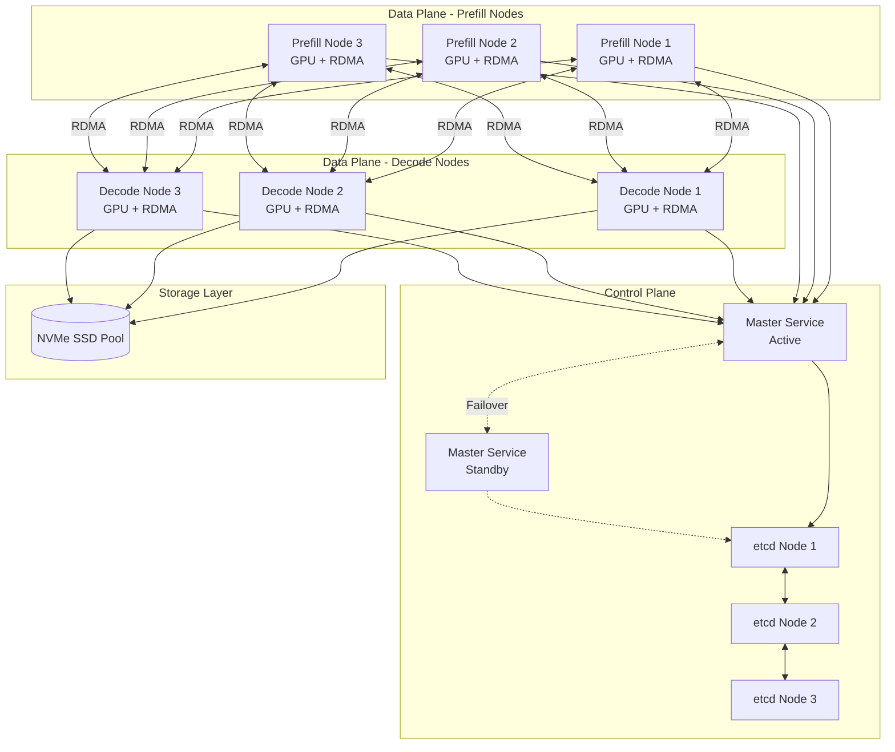
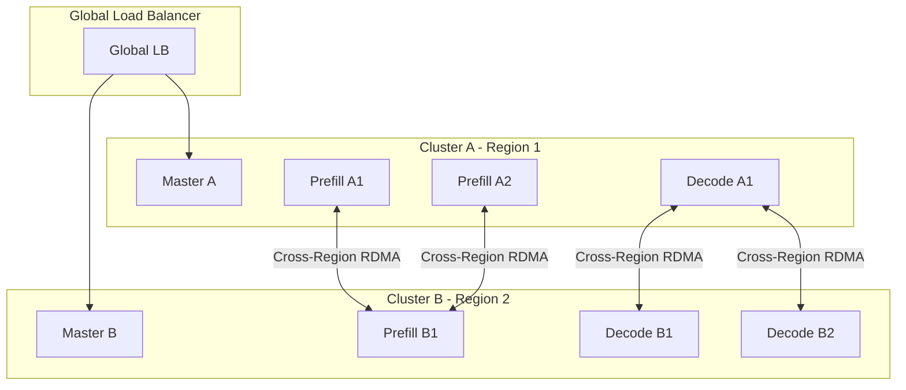
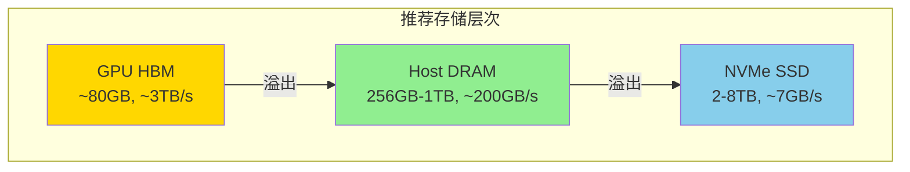
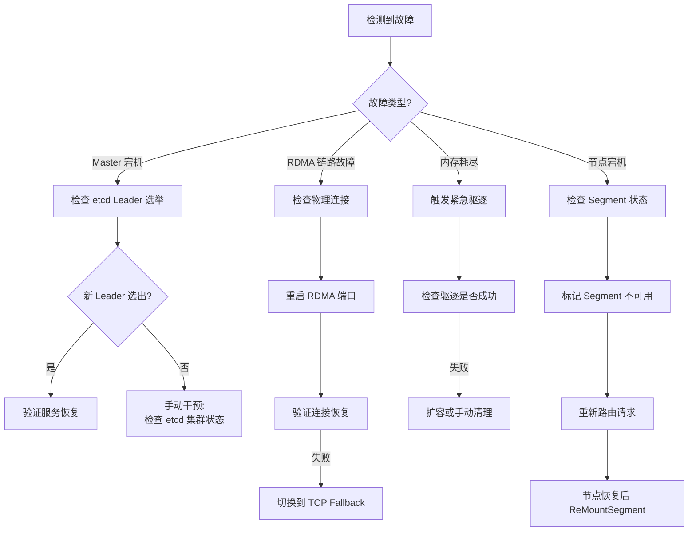

[上一篇](../09-performance/02-monitoring.md) | [目录](../README.md) | [下一篇](../11-summary/01-summary-and-future.md)

# 生产环境部署指南

## 13.1 部署架构

### 13.1.1 单集群部署



### 13.1.2 多集群联邦部署



## 13.2 硬件配置建议

### 13.2.1 网络配置

| 组件 | 推荐配置 | 最低配置 |
|------|----------|----------|
| RDMA NIC | Mellanox ConnectX-7 200Gbps | ConnectX-6 100Gbps |
| 交换机 | InfiniBand HDR 200Gbps | RoCE 100Gbps |
| 网络拓扑 | Fat-tree, 全对分带宽 | 3:1 收敛比 |
| MTU | 4096+ (RDMA) | 1500 (TCP fallback) |

### 13.2.2 存储配置



### 13.2.3 NUMA 配置

```bash
# 检查 NUMA 拓扑
numactl --hardware

# 推荐配置：每个 NUMA 节点运行独立的服务实例
# Node 0: Master Service + Client for GPU 0-3
# Node 1: Client for GPU 4-7

# 绑定进程到特定 NUMA 节点
numactl --cpunodebind=0 --membind=0 ./mooncake_master
numactl --cpunodebind=1 --membind=1 ./client_instance
```

## 13.3 配置文件示例

### 13.3.1 Master Service 配置

```yaml
# master_config.yaml
server:
  address: "0.0.0.0:50051"
  max_connections: 1000
  request_timeout_ms: 30000

metadata:
  type: "etcd"
  endpoints:
    - "etcd1:2379"
    - "etcd2:2379"
    - "etcd3:2379"
  ttl_seconds: 30

storage:
  allocator_type: "offset"  # "cachelib" or "offset"
  eviction_policy: "lru"
  eviction_threshold: 0.85
  eviction_target: 0.75

high_availability:
  enabled: true
  lease_ttl_seconds: 10
  anti_split_brain_wait_ms: 15000

metrics:
  enabled: true
  prometheus_port: 9090
  report_interval_seconds: 10
```

### 13.3.2 Transfer Engine 配置

```yaml
# transfer_engine_config.yaml
segment:
  name: "node001"
  type: "DRAM"  # "DRAM" or "VRAM"
  size_bytes: 68719476736  # 64GB

transport:
  type: "rdma"
  devices:
    - "mlx5_0"
    - "mlx5_1"
  max_qp_depth: 128
  max_sge: 1
  relaxed_ordering: true

metadata:
  type: "etcd"
  endpoints:
    - "etcd1:2379"
    - "etcd2:2379"

slice:
  size_bytes: 65536  # 64KB

async:
  max_pending_transfers: 1000
  completion_poll_threads: 2
```

### 13.3.3 客户端配置

```yaml
# client_config.yaml
master:
  endpoints:
    - "master1:50051"
    - "master2:50051"
  connect_timeout_ms: 5000
  request_timeout_ms: 10000

transfer:
  batch_size: 128
  prefetch_enabled: true
  prefetch_threshold: 0.7

metrics:
  enabled: true
  cluster_id: "prod-cluster-1"
  report_interval_seconds: 30

retry:
  max_attempts: 3
  initial_backoff_ms: 100
  max_backoff_ms: 5000
```

## 13.4 运维操作手册

### 13.4.1 健康检查

```bash
#!/bin/bash
# health_check.sh

# 检查 Master 服务
check_master() {
    response=$(curl -s -o /dev/null -w "%{http_code}" \
        http://localhost:9090/health)
    if [ "$response" != "200" ]; then
        echo "ERROR: Master service unhealthy"
        return 1
    fi
    echo "OK: Master service healthy"
}

# 检查 etcd 集群
check_etcd() {
    etcdctl endpoint health --endpoints=etcd1:2379,etcd2:2379,etcd3:2379
}

# 检查 RDMA 连接
check_rdma() {
    ibstat | grep -E "State:|Physical state:"
    if ! ibstat | grep -q "Active"; then
        echo "WARNING: RDMA port not active"
        return 1
    fi
}

# 检查内存使用
check_memory() {
    usage=$(curl -s http://localhost:9090/metrics | \
        grep "mooncake_master_mem_allocated_size" | \
        awk '{print $2}')
    capacity=$(curl -s http://localhost:9090/metrics | \
        grep "mooncake_master_mem_total_capacity" | \
        awk '{print $2}')
    ratio=$(echo "scale=2; $usage / $capacity" | bc)
    echo "Memory usage: $ratio"
    if (( $(echo "$ratio > 0.95" | bc -l) )); then
        echo "WARNING: Memory usage above 95%"
        return 1
    fi
}

# 运行所有检查
check_master && check_etcd && check_rdma && check_memory
```

### 13.4.2 故障恢复



### 13.4.3 扩容操作

```bash
#!/bin/bash
# scale_out.sh - 添加新节点

NEW_NODE=$1
MASTER_ADDR=$2

# 1. 验证新节点 RDMA 连通性
echo "Testing RDMA connectivity..."
ibping -S -C mlx5_0 &
sleep 2
ssh $NEW_NODE "ibping -c 1000 -C mlx5_0 $(hostname)"

# 2. 在新节点上启动服务
echo "Starting services on new node..."
ssh $NEW_NODE << 'EOF'
    # 设置环境变量
    export MC_MASTER_ADDR=$MASTER_ADDR
    export MC_SEGMENT_SIZE=68719476736

    # 启动 Transfer Engine
    ./mooncake_client --config=/etc/mooncake/client.yaml &

    # 等待服务就绪
    sleep 5

    # 挂载 Segment
    ./mc_admin mount_segment \
        --name="$(hostname)" \
        --size=$MC_SEGMENT_SIZE \
        --master=$MC_MASTER_ADDR
EOF

# 3. 验证新节点已注册
echo "Verifying node registration..."
./mc_admin list_segments --master=$MASTER_ADDR | grep $NEW_NODE

echo "Scale-out complete!"
```

### 13.4.4 滚动升级

```bash
#!/bin/bash
# rolling_upgrade.sh

NODES="node1 node2 node3 node4"
NEW_VERSION=$1

for node in $NODES; do
    echo "Upgrading $node to $NEW_VERSION..."

    # 1. 标记节点进入维护模式
    ./mc_admin set_node_status $node MAINTENANCE

    # 2. 等待现有请求完成
    echo "Draining connections..."
    sleep 30

    # 3. 停止服务
    ssh $node "systemctl stop mooncake"

    # 4. 更新二进制
    scp mooncake-$NEW_VERSION.tar.gz $node:/tmp/
    ssh $node << EOF
        cd /opt/mooncake
        tar -xzf /tmp/mooncake-$NEW_VERSION.tar.gz
        ln -sf mooncake-$NEW_VERSION current
EOF

    # 5. 启动服务
    ssh $node "systemctl start mooncake"

    # 6. 健康检查
    echo "Waiting for health check..."
    for i in {1..30}; do
        if ssh $node "curl -s localhost:9090/health" | grep -q "ok"; then
            echo "$node healthy"
            break
        fi
        sleep 2
    done

    # 7. 恢复节点
    ./mc_admin set_node_status $node ACTIVE

    echo "$node upgraded successfully"
    sleep 10  # 冷却时间
done

echo "Rolling upgrade complete!"
```

## 13.5 本章小结

本章涵盖了 Mooncake 生产环境部署的关键方面：

1. **部署架构**：单集群和多集群联邦部署模式
2. **硬件配置**：网络、存储和 NUMA 的最佳实践
3. **配置管理**：Master、Transfer Engine 和客户端配置
4. **运维操作**：健康检查、故障恢复、扩容和升级流程

这些指南基于实际生产环境经验，帮助运维团队快速部署和管理 Mooncake 集群。

---

[上一篇](../09-performance/02-monitoring.md) | [目录](../README.md) | [下一篇](../11-summary/01-summary-and-future.md)
