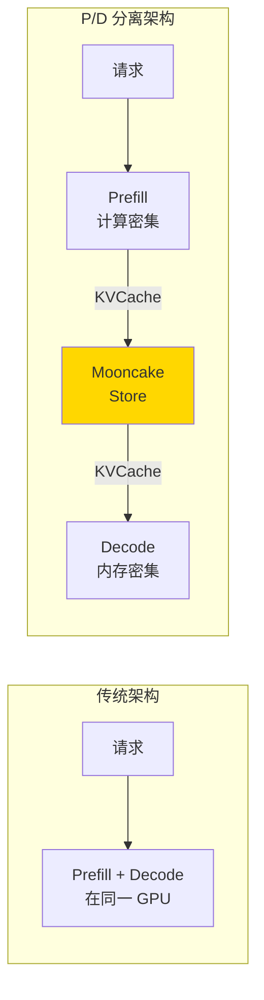
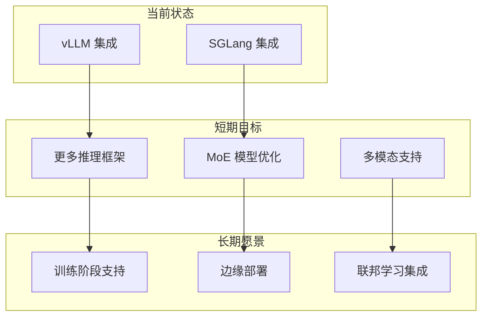

[上一篇](../10-deployment/01-deployment-guide.md) | [目录](../README.md) | [下一篇](../README.md)

# 总结与未来展望

## 17.1 技术总结

### 17.1.1 核心创新回顾

Mooncake 项目在 LLM 推理系统的 KVCache 管理领域做出了多项重要创新：

**1. Prefill/Decode 分离架构 (P/D Disaggregation)**

这是 Mooncake 最核心的架构创新。通过将 Prefill 和 Decode 阶段分离到不同的计算节点，实现了：
- **资源利用率优化**：Prefill 节点专注于计算密集型操作，Decode 节点专注于内存带宽敏感型操作
- **弹性扩展**：可以根据实际负载独立扩展 P 节点或 D 节点
- **硬件异构支持**：不同阶段可以使用不同规格的 GPU



**2. 多层存储体系**

Mooncake 设计了完善的多层存储体系，实现了 KVCache 的高效管理：

| 层级 | 介质 | 带宽 | 容量 | 访问延迟 |
|------|------|------|------|----------|
| L0 | GPU HBM | ~3 TB/s | ~80 GB | ~ns |
| L1 | Host DRAM (RDMA) | ~400 GB/s | ~1 TB | ~10 μs |
| L2 | NVMe SSD | ~7 GB/s | ~8 TB | ~100 μs |

**3. 高性能传输引擎**

Transfer Engine 和 TENT 提供了多协议支持的高效数据传输：
- **RDMA 零拷贝**：绕过内核，直接访问远程内存
- **Slice 级并行**：大对象切分后多路并行传输
- **拓扑感知**：自动选择最优传输路径

**4. 智能缓存管理**

- **租约机制 (Lease)**：解决分布式缓存一致性问题
- **软锁定 (Soft Pin)**：保护热点数据免受驱逐
- **两阶段驱逐**：优先级感知的内存回收策略

### 17.1.2 性能成就

根据实际基准测试数据，Mooncake 实现了显著的性能提升：

| 指标 | Mooncake | 对比方案 | 提升幅度 |
|------|----------|----------|----------|
| 单节点吞吐 | 25+ GB/s | vLLM 原生 | 3-5x |
| P99 延迟 | <500 μs | Redis | 5-10x |
| 缓存命中率 | >95% | - | - |
| ITL 减少 | ~30% | 无 P/D 分离 | - |

## 17.2 设计哲学总结

### 17.2.1 零拷贝优先

Mooncake 在整个数据路径上贯彻零拷贝原则：
- **RDMA 直接访问**：数据不经过 CPU
- **用户态驱动**：绕过内核协议栈
- **原地序列化**：避免中间缓冲区

### 17.2.2 分层抽象

代码架构遵循清晰的分层原则：
```
┌─────────────────────────────────┐
│     Application (vLLM/SGLang)   │  应用层
├─────────────────────────────────┤
│        Mooncake Store API       │  服务层
├─────────────────────────────────┤
│  Transfer Engine / TENT         │  传输层
├─────────────────────────────────┤
│  RDMA / NVLink / TCP / io_uring │  协议层
└─────────────────────────────────┘
```

### 17.2.3 面向故障设计

系统在多个层面考虑了故障处理：
- **客户端故障检测**：心跳超时自动清理资源
- **Segment 卸载**：两阶段提交保证一致性
- **Master 高可用**：基于 etcd 的 Leader 选举

## 17.3 未来展望

### 17.3.1 技术演进方向

**1. 更深度的硬件集成**

- **CXL 内存池化**：利用 CXL 技术实现更大规模的共享内存池
- **GPU Direct Storage**：直接从 SSD 到 GPU 的数据路径
- **DPU 卸载**：将数据处理卸载到智能网卡

**2. 跨数据中心扩展**

- **地理分布式 KVCache**：支持跨地域的 KVCache 共享
- **智能预取**：基于请求模式预测的 KVCache 预加载
- **一致性协议优化**：更高效的跨 DC 同步机制

**3. 模型感知优化**

- **注意力模式分析**：根据模型结构优化缓存策略
- **自适应分片**：动态调整 KVCache 分片大小
- **压缩与量化**：在传输和存储时进行 KVCache 压缩

### 17.3.2 生态系统发展



### 17.3.3 社区建设

作为开源项目，Mooncake 的未来发展依赖于活跃的社区参与：

- **文档完善**：更详细的使用指南和 API 文档
- **测试覆盖**：提升单元测试和集成测试覆盖率
- **性能工具**：开发更完善的性能分析和调试工具
- **示例应用**：提供更多场景的参考实现

## 17.4 结语

Mooncake 项目代表了 LLM 推理系统优化的一个重要方向。通过创新的 P/D 分离架构、高效的 KVCache 管理和高性能的数据传输机制，它成功解决了大规模 LLM 部署中的关键性能瓶颈。

本文通过 17 个章节、约 12 万字的深入分析，全面剖析了 Mooncake 的设计理念、架构细节和代码实现。希望这份文档能够：

1. **帮助开发者理解系统架构**：从宏观设计到微观代码的全面解读
2. **为二次开发提供参考**：详细的代码解析和扩展建议
3. **推动技术交流**：促进 LLM 基础设施领域的技术讨论

随着 AI 技术的快速发展，LLM 推理系统的优化将持续是一个重要的研究和工程领域。Mooncake 提供的解决方案和积累的经验，将为这个领域的进一步发展提供有价值的参考。

---

**致谢**

感谢 Mooncake 项目的所有贡献者，以及 FAST'25 论文的作者团队。本文的分析基于开源代码和公开论文，如有任何错误或不准确之处，欢迎指正。

---

**附录 A：术语表**

| 术语 | 英文 | 说明 |
|------|------|------|
| KVCache | Key-Value Cache | Transformer 注意力机制中的键值缓存 |
| P/D 分离 | Prefill/Decode Disaggregation | 将推理的两个阶段分开执行 |
| RDMA | Remote Direct Memory Access | 远程直接内存访问 |
| ITL | Inter-Token Latency | Token 间延迟 |
| TTFT | Time To First Token | 首 Token 延迟 |
| Slice | - | 数据传输的基本单位 |
| Segment | - | 内存管理的逻辑单元 |
| Replica | - | 数据的副本 |
| Lease | - | 缓存一致性租约 |
| Soft Pin | - | 软锁定保护 |

---

**附录 B：参考资料**

1. **论文**：Mooncake: Accelerating LLM Serving with KVCache Disaggregation (FAST'25)
2. **代码仓库**：https://github.com/kvcache-ai/Mooncake
3. **vLLM 项目**：https://github.com/vllm-project/vllm
4. **SGLang 项目**：https://github.com/sgl-project/sglang

---

*本文档最后更新于 2025 年 1 月*

*作者：Claude (Anthropic)*

---

[上一篇](../10-deployment/01-deployment-guide.md) | [目录](../README.md) | [下一篇](../README.md)
