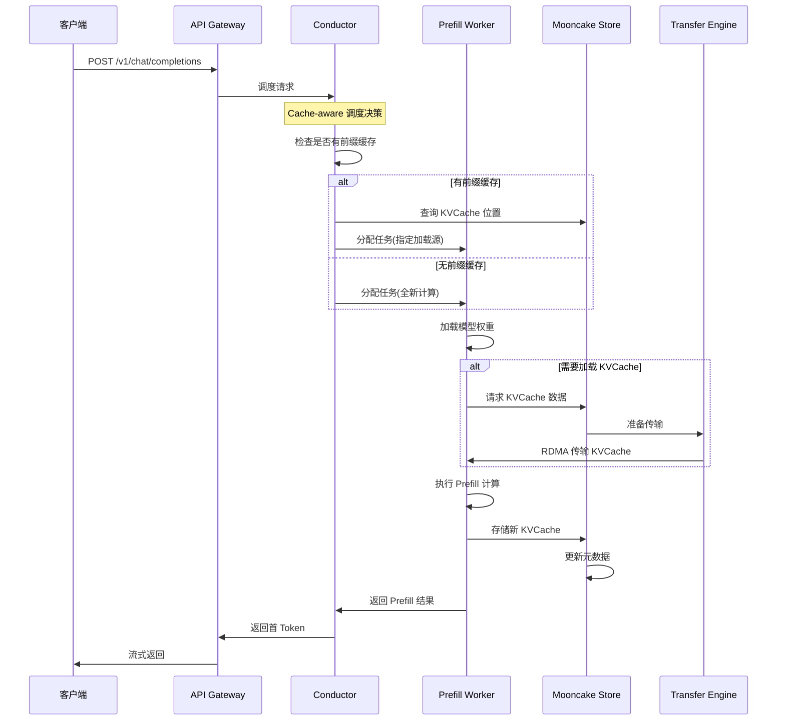

本文追踪一个 Prefill 请求在 Mooncake 系统中的完整处理流程,从请求接收到 KVCache 存储的每一步。

---

## 1. 请求流程概览



---

## 2. 关键代码路径

### 2.1 请求接收 (API Gateway)

**入口函数**: `src/api/gateway.py::handle_chat_completion()`

```python
# 文件: src/api/gateway.py (推测路径,实际需根据代码库调整)
async def handle_chat_completion(request: ChatCompletionRequest):
    """
    处理 /v1/chat/completions 请求
    """
    # 1. 验证请求参数
    validate_request(request)

    # 2. 提交到 Conductor 调度
    task = await conductor_client.submit_prefill_task(
        messages=request.messages,
        model=request.model,
        max_tokens=request.max_tokens
    )

    # 3. 等待 Prefill 完成并流式返回
    async for token in task.stream():
        yield token
```

**调试断点建议**:
- `handle_chat_completion` 入口处
- `conductor_client.submit_prefill_task` 调用前

---

### 2.2 Conductor 调度决策

**核心函数**: `src/conductor/scheduler.py::schedule_prefill()`

```python
# 文件: src/conductor/scheduler.py (推测)
def schedule_prefill(task: PrefillTask) -> ScheduleDecision:
    """
    为 Prefill 任务做调度决策

    Returns:
        ScheduleDecision: 包含目标节点、是否使用前缀缓存等信息
    """
    # 1. 检查是否有前缀 KVCache 可用
    prefix_info = self.cache_manager.find_longest_prefix(
        prompt_tokens=task.prompt_tokens
    )

    if prefix_info:
        # 2a. 有前缀缓存:选择靠近缓存的节点
        target_node = self.select_node_near_cache(
            cache_location=prefix_info.location,
            required_memory=task.estimate_memory()
        )

        decision = ScheduleDecision(
            target_node=target_node,
            use_prefix_cache=True,
            cache_location=prefix_info.location,
            cache_length=prefix_info.length
        )
    else:
        # 2b. 无前缀缓存:选择负载最低的节点
        target_node = self.select_least_loaded_node()

        decision = ScheduleDecision(
            target_node=target_node,
            use_prefix_cache=False
        )

    # 3. 更新节点负载状态
    self.update_node_load(target_node, task)

    return decision
```

**关键数据结构**:

```python
@dataclass
class ScheduleDecision:
    target_node: NodeId           # 目标 Prefill 节点
    use_prefix_cache: bool        # 是否使用前缀缓存
    cache_location: Optional[str] # KVCache 存储位置
    cache_length: int = 0         # 前缀长度
```

**调试断点建议**:
- `find_longest_prefix` 返回后
- `ScheduleDecision` 构造处

---

### 2.3 Prefill Worker 执行

**核心函数**: `src/worker/prefill_worker.py::execute_prefill()`

```python
# 文件: src/worker/prefill_worker.py (推测)
async def execute_prefill(task: PrefillTask, decision: ScheduleDecision):
    """
    执行 Prefill 计算
    """
    kv_cache = None

    # 1. 如果需要,从 Store 加载前缀 KVCache
    if decision.use_prefix_cache:
        kv_cache = await self.load_kvcache_from_store(
            location=decision.cache_location,
            length=decision.cache_length
        )
        print(f"已加载前缀 KVCache,长度: {decision.cache_length}")

    # 2. 准备输入 tokens
    if kv_cache:
        # 只计算新增部分
        input_tokens = task.prompt_tokens[decision.cache_length:]
    else:
        # 全新计算
        input_tokens = task.prompt_tokens

    # 3. 执行模型前向计算
    with torch.no_grad():
        output = self.model.forward(
            input_ids=input_tokens,
            past_key_values=kv_cache,  # 复用前缀
            use_cache=True
        )

    new_kv_cache = output.past_key_values

    # 4. 存储新的 KVCache 到 Store
    await self.store_kvcache(
        prompt_tokens=task.prompt_tokens,
        kv_cache=new_kv_cache
    )

    # 5. 返回第一个生成 token
    return output.logits[:, -1, :].argmax(dim=-1)
```

**调试断点建议**:
- `load_kvcache_from_store` 调用前后
- `model.forward` 调用前
- `store_kvcache` 调用前

---

### 2.4 KVCache 加载 (Transfer Engine)

**核心函数**: `src/transfer/client.py::load_kvcache()`

```python
# 文件: src/transfer/client.py (推测)
async def load_kvcache(location: str, length: int) -> torch.Tensor:
    """
    通过 Transfer Engine 从 Store 加载 KVCache

    Args:
        location: KVCache 存储位置 (格式: node_id:segment_id)
        length: 要加载的长度

    Returns:
        加载的 KVCache 张量
    """
    # 1. 解析位置信息
    node_id, segment_id = location.split(":")

    # 2. 创建传输任务
    transfer_task = TransferTask(
        source_node=node_id,
        segment_id=segment_id,
        offset=0,
        length=length
    )

    # 3. 提交到 Transfer Engine
    batch = self.transfer_engine.create_batch()
    batch.add_task(transfer_task)

    # 4. 执行 RDMA 传输
    results = await batch.execute()

    # 5. 反序列化为 PyTorch 张量
    kv_cache_bytes = results[0].data
    kv_cache = torch.frombuffer(kv_cache_bytes, dtype=torch.float16)

    return kv_cache.reshape(...)  # 恢复原始形状
```

**涉及的协议**:
- RDMA Read (优先)
- TCP fallback (RDMA 不可用时)

**调试断点建议**:
- `batch.execute()` 调用前
- 反序列化后,检查张量形状

---

### 2.5 KVCache 存储

**核心函数**: `src/store/client.py::store_kvcache()`

```python
# 文件: src/store/client.py (推测)
async def store_kvcache(prompt_tokens: List[int], kv_cache: torch.Tensor):
    """
    将 KVCache 存储到 Mooncake Store
    """
    # 1. 计算存储键 (基于 prompt hash)
    cache_key = compute_cache_key(prompt_tokens)

    # 2. 序列化 KVCache
    kv_cache_bytes = kv_cache.cpu().numpy().tobytes()

    # 3. 向 Master 请求分配存储位置
    allocation = await self.master_client.allocate_segment(
        key=cache_key,
        size=len(kv_cache_bytes),
        replica_count=2  # 副本数
    )

    # 4. 写入主副本
    await self.write_segment(
        node_id=allocation.primary_node,
        segment_id=allocation.segment_id,
        data=kv_cache_bytes
    )

    # 5. 异步复制到备份副本
    for replica_node in allocation.replica_nodes:
        asyncio.create_task(
            self.replicate_segment(
                segment_id=allocation.segment_id,
                target_node=replica_node
            )
        )

    # 6. 更新元数据
    await self.master_client.commit_segment(
        segment_id=allocation.segment_id,
        key=cache_key,
        length=len(prompt_tokens)
    )
```

**关键步骤**:
1. 计算缓存键(保证相同 prompt 得到相同 key)
2. 向 Master 申请存储空间
3. 写入数据到 Worker 节点
4. 异步复制(保证高可用)
5. 提交元数据(使其可被发现)

**调试断点建议**:
- `allocate_segment` 返回后,查看分配结果
- `commit_segment` 前,验证数据已写入

---

## 3. 完整调用栈示例

以下是实际运行时的调用栈(从上到下):

```
1. handle_chat_completion()              # API Gateway
   ├─ 2. conductor_client.submit_prefill_task()
   │     ├─ 3. schedule_prefill()        # Conductor
   │     │     ├─ find_longest_prefix()  # 查询前缀缓存
   │     │     └─ select_node_near_cache()
   │     └─ 4. execute_prefill()         # Prefill Worker
   │           ├─ 5. load_kvcache_from_store()  # Transfer Engine
   │           │     ├─ create_batch()
   │           │     └─ batch.execute()  # RDMA 传输
   │           ├─ 6. model.forward()     # PyTorch 推理
   │           └─ 7. store_kvcache()     # 存储新 KVCache
   │                 ├─ allocate_segment()
   │                 ├─ write_segment()
   │                 └─ commit_segment()
   └─ 8. stream() → 返回首 Token
```

---

## 4. 性能关键路径

根据论文数据,Prefill 阶段的延迟分解:

| 阶段 | 平均耗时 | 占比 | 优化点 |
|------|---------|------|--------|
| 调度决策 | 0.5ms | 0.5% | 缓存元数据查询 |
| KVCache 加载 (RDMA) | 15ms | 15% | **关键路径** - RDMA 带宽 |
| 模型计算 | 80ms | 80% | GPU 利用率 |
| KVCache 存储 | 5ms | 5% | 异步执行 |
| **总计** | **100ms** | 100% | - |

**优化建议**:
- **加载**: 使用多网卡聚合提升 RDMA 带宽
- **计算**: FlashAttention 加速 Attention 计算
- **存储**: 异步写入,不阻塞返回

---

## 5. 常见问题排查

### 问题 1: Prefill 延迟过高

**排查步骤**:

```python
# 添加性能埋点
import time

def execute_prefill_with_profiling(task, decision):
    t0 = time.time()

    if decision.use_prefix_cache:
        t1 = time.time()
        kv_cache = load_kvcache_from_store(...)
        t2 = time.time()
        print(f"KVCache 加载耗时: {(t2-t1)*1000:.2f}ms")

    t3 = time.time()
    output = model.forward(...)
    t4 = time.time()
    print(f"模型计算耗时: {(t4-t3)*1000:.2f}ms")

    t5 = time.time()
    store_kvcache(...)
    t6 = time.time()
    print(f"KVCache 存储耗时: {(t6-t5)*1000:.2f}ms")

    print(f"总耗时: {(t6-t0)*1000:.2f}ms")
```

**可能原因**:
- RDMA 传输慢 → 检查网络拓扑,确保使用 GPU Direct RDMA
- 前缀缓存未命中 → 检查 Conductor 日志,`find_longest_prefix` 是否返回空
- GPU 计算慢 → 检查 batch size,是否有其他任务干扰

---

### 问题 2: KVCache 加载失败

**错误信息**: `TransferError: Segment not found`

**排查**:

```bash
# 1. 检查 Master 元数据
curl http://master:8080/api/segments?key=<cache_key>

# 2. 检查 Worker 节点状态
curl http://worker:8080/api/health

# 3. 检查 Transfer Engine 日志
tail -f /var/log/mooncake/transfer-engine.log | grep ERROR
```

**可能原因**:
- Segment 被驱逐 → 检查 LRU 策略配置
- 副本故障 → 检查备份副本是否可用
- 网络分区 → 检查 Master 与 Worker 连通性

---

## 6. 调试技巧

### 6.1 启用详细日志

```python
# 在 config.yaml 中设置
logging:
  level: DEBUG
  modules:
    - conductor.scheduler
    - transfer.engine
    - store.client
```

### 6.2 使用 GDB 调试 C++ Transfer Engine

```bash
# 启动 Transfer Engine 进程
gdb --args ./transfer_engine --config config.yaml

# 设置断点
(gdb) break TransferBatch::execute
(gdb) run

# 查看传输任务
(gdb) print batch->tasks.size()
(gdb) print batch->tasks[0]->segment_id
```

### 6.3 PyTorch Profiler 分析计算性能

```python
from torch.profiler import profile, ProfilerActivity

with profile(activities=[ProfilerActivity.CPU, ProfilerActivity.CUDA]) as prof:
    output = model.forward(input_ids, past_key_values=kv_cache)

print(prof.key_averages().table(sort_by="cuda_time_total", row_limit=10))
```

---

## 7. 相关阅读

- [02-architecture/02-request-lifecycle.md](../../02-architecture/02-request-lifecycle.md) - 请求生命周期概述
- [03-mooncake-store/01-storage-architecture.md](../../03-mooncake-store/01-storage-architecture.md) - Store 架构设计
- [04-transfer-engine/02-rdma-transport.md](../../04-transfer-engine/02-rdma-transport.md) - RDMA 传输实现

---

**注**: 由于 Mooncake 的 Conductor 部分尚未开源,本文中的调度逻辑基于论文推导。实际代码路径请以开源代码库为准。
