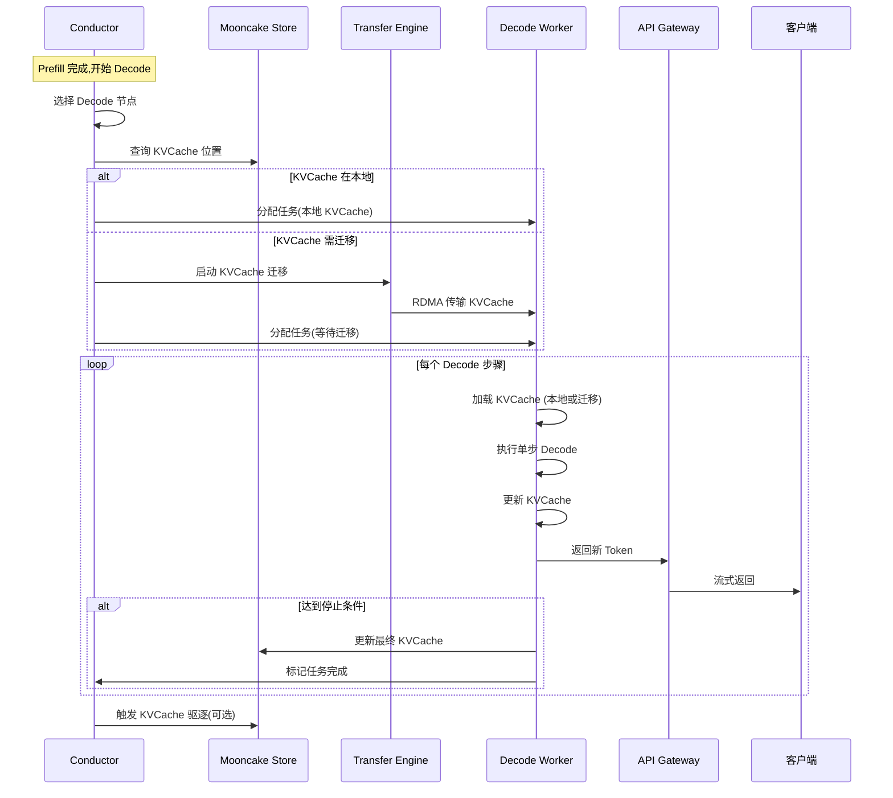

本文追踪一个 Decode 请求在 Mooncake P/D 分离架构下的完整处理流程。

---

## 1. Decode 请求流程概览



---

## 2. 关键代码路径

### 2.1 Conductor 选择 Decode 节点

**核心函数**: `src/conductor/scheduler.py::schedule_decode()`

```python
def schedule_decode(prefill_result: PrefillResult) -> DecodeScheduleDecision:
    """
    为 Decode 阶段选择目标节点

    策略:
    1. 优先选择已有 KVCache 的节点(避免迁移)
    2. 否则选择负载最低的节点,并启动 KVCache 迁移
    """
    # 1. 查询 KVCache 当前位置
    cache_location = self.cache_manager.get_cache_location(
        cache_key=prefill_result.cache_key
    )

    # 2. 检查是否有 Decode 节点在该位置附近
    local_decode_nodes = self.find_decode_nodes_near(
        location=cache_location,
        max_distance=1  # 同机架
    )

    if local_decode_nodes and self.has_capacity(local_decode_nodes[0]):
        # 情况1: 本地有可用节点
        decision = DecodeScheduleDecision(
            target_node=local_decode_nodes[0],
            need_migration=False,
            cache_location=cache_location
        )
    else:
        # 情况2: 需要迁移 KVCache
        target_node = self.select_least_loaded_decode_node()

        # 启动迁移任务
        migration_task = self.start_kvcache_migration(
            source_location=cache_location,
            target_node=target_node,
            cache_key=prefill_result.cache_key
        )

        decision = DecodeScheduleDecision(
            target_node=target_node,
            need_migration=True,
            migration_task=migration_task
        )

    return decision
```

**调试断点建议**:
- `get_cache_location` 返回后
- `start_kvcache_migration` 调用处

---

### 2.2 KVCache 迁移 (P/D 分离关键)

**核心函数**: `src/transfer/migration.py::migrate_kvcache()`

```python
async def migrate_kvcache(
    source_location: str,
    target_node: str,
    cache_key: str
) -> MigrationResult:
    """
    迁移 KVCache 从 Prefill 节点到 Decode 节点

    这是 P/D 分离架构的核心操作
    """
    # 1. 从 Store 读取 KVCache 元数据
    metadata = await self.store_client.get_segment_metadata(cache_key)

    # 2. 创建 Transfer 批次
    batch = self.transfer_engine.create_batch()

    for segment_id in metadata.segment_ids:
        task = TransferTask(
            source_node=metadata.primary_node,
            target_node=target_node,
            segment_id=segment_id,
            priority=TransferPriority.HIGH  # 高优先级
        )
        batch.add_task(task)

    # 3. 执行批量 RDMA 传输
    start_time = time.time()
    results = await batch.execute()
    transfer_time = time.time() - start_time

    logger.info(
        f"KVCache 迁移完成: {metadata.total_size / 1024 / 1024:.2f}MB "
        f"耗时 {transfer_time * 1000:.2f}ms "
        f"带宽 {metadata.total_size / transfer_time / 1e9:.2f}GB/s"
    )

    # 4. 更新 Store 元数据 (记录新位置)
    await self.store_client.update_cache_location(
        cache_key=cache_key,
        new_location=f"{target_node}:{metadata.segment_ids[0]}"
    )

    return MigrationResult(
        success=True,
        transfer_time=transfer_time,
        bytes_transferred=metadata.total_size
    )
```

**性能关键点**:
- 使用 RDMA 实现低延迟传输(通常 10-20ms)
- 批量传输多个 Segment,提升吞吐
- GPU Direct RDMA 避免 CPU 拷贝

---

### 2.3 Decode Worker 执行单步生成

**核心函数**: `src/worker/decode_worker.py::decode_step()`

```python
async def decode_step(
    task: DecodeTask,
    kv_cache: torch.Tensor,
    last_token_id: int
) -> DecodeStepResult:
    """
    执行单步 Decode 生成

    Args:
        task: Decode 任务信息
        kv_cache: 已有的 KVCache (Prefill 生成 + 之前 Decode 步骤)
        last_token_id: 上一步生成的 token

    Returns:
        DecodeStepResult: 包含新 token 和更新后的 KVCache
    """
    # 1. 准备输入 (只有一个 token)
    input_ids = torch.tensor([[last_token_id]], device='cuda')

    # 2. 执行模型前向计算
    with torch.no_grad():
        output = self.model.forward(
            input_ids=input_ids,
            past_key_values=kv_cache,  # 复用所有历史 KVCache
            use_cache=True
        )

    # 3. 采样新 token
    next_token_logits = output.logits[:, -1, :]
    next_token_id = self.sample_token(
        logits=next_token_logits,
        temperature=task.temperature,
        top_p=task.top_p
    )

    # 4. 更新 KVCache (新增一个 token 的 KV)
    updated_kv_cache = output.past_key_values

    # 5. 检查是否停止
    is_finished = (
        next_token_id == self.tokenizer.eos_token_id or
        len(task.generated_tokens) >= task.max_tokens
    )

    return DecodeStepResult(
        token_id=next_token_id,
        kv_cache=updated_kv_cache,
        is_finished=is_finished
    )
```

**关键特性**:
- **输入只有 1 个 token** (vs Prefill 的完整 prompt)
- **KVCache 线性增长** (每步新增 1 个 token 的 KV)
- **内存密集型** (计算量小,访存量大)

---

### 2.4 Decode 循环主流程

**核心函数**: `src/worker/decode_worker.py::execute_decode_loop()`

```python
async def execute_decode_loop(
    task: DecodeTask,
    decision: DecodeScheduleDecision
):
    """
    执行完整的 Decode 循环,直到生成结束
    """
    # 1. 加载或等待 KVCache
    if decision.need_migration:
        # 等待迁移完成
        await decision.migration_task.wait()
        kv_cache = self.load_kvcache_from_local(task.cache_key)
    else:
        # 直接加载本地 KVCache
        kv_cache = self.load_kvcache_from_local(task.cache_key)

    # 2. 获取 Prefill 最后一个 token 作为起点
    last_token_id = task.prefill_result.first_token_id
    generated_tokens = [last_token_id]

    # 3. Decode 循环
    while True:
        # 3.1 单步 Decode
        step_result = await self.decode_step(
            task=task,
            kv_cache=kv_cache,
            last_token_id=last_token_id
        )

        # 3.2 流式返回
        await self.stream_token(step_result.token_id)

        # 3.3 更新状态
        generated_tokens.append(step_result.token_id)
        kv_cache = step_result.kv_cache
        last_token_id = step_result.token_id

        # 3.4 检查停止条件
        if step_result.is_finished:
            break

    # 4. Decode 完成,存储最终 KVCache (可选)
    if task.save_final_kvcache:
        await self.store_final_kvcache(
            cache_key=task.cache_key,
            kv_cache=kv_cache,
            all_tokens=task.prompt_tokens + generated_tokens
        )

    # 5. 返回完整结果
    return DecodeResult(
        generated_tokens=generated_tokens,
        total_steps=len(generated_tokens),
        finish_reason="stop" if step_result.is_finished else "length"
    )
```

**性能监控点**:

```python
# 在循环中添加性能埋点
step_latencies = []

while True:
    t0 = time.time()
    step_result = await self.decode_step(...)
    t1 = time.time()

    step_latency = (t1 - t0) * 1000  # ms
    step_latencies.append(step_latency)

    # 监控异常延迟
    if step_latency > 100:  # 超过 100ms 警告
        logger.warning(f"Decode 步骤延迟过高: {step_latency:.2f}ms")

# 计算统计指标
print(f"平均 Decode 延迟: {np.mean(step_latencies):.2f}ms")
print(f"P99 Decode 延迟: {np.percentile(step_latencies, 99):.2f}ms")
```

---

## 3. P/D 分离的性能对比

### 传统耦合架构 (vLLM)

```
GPU 时间分配:
├─ Prefill: 80ms (阻塞所有 Decode)
├─ Decode (Req1): 10ms
├─ Decode (Req2): 10ms
└─ Decode (Req3): 10ms

问题: Prefill 阻塞 Decode,导致 TBT 增加
```

### Mooncake P/D 分离

```
Prefill GPU:                Decode GPU:
├─ Req1 Prefill: 80ms      ├─ Req0 Decode: 10ms
├─ Req2 Prefill: 80ms      ├─ Req0 Decode: 10ms
└─ Req3 Prefill: 80ms      ├─ Req0 Decode: 10ms
                           ├─ Req1 Decode: 10ms (迁移后)
                           └─ Req2 Decode: 10ms (迁移后)

优势: Prefill 和 Decode 互不干扰,Decode TBT 稳定
```

**KVCache 迁移开销**: 10-20ms (RDMA)
**性能收益**: Decode TBT 从 P99 200ms 降至 P99 50ms

---

## 4. 调用栈示例

完整的 Decode 调用栈:

```
1. schedule_decode()                    # Conductor
   ├─ get_cache_location()              # 查询 KVCache 位置
   └─ start_kvcache_migration()         # 启动迁移(如需要)
        └─ 2. migrate_kvcache()         # Transfer Engine
              ├─ create_batch()
              └─ batch.execute()        # RDMA 传输

3. execute_decode_loop()                # Decode Worker
   ├─ load_kvcache_from_local()
   └─ while not finished:
         ├─ 4. decode_step()
         │     ├─ model.forward()       # PyTorch 推理
         │     └─ sample_token()        # 采样
         └─ stream_token()              # 流式返回
```

---

## 5. 性能优化技巧

### 5.1 Continuous Batching

```python
# Decode Worker 支持动态 Batching
class DecodeBatcher:
    def __init__(self, max_batch_size=32):
        self.pending_requests = []
        self.max_batch_size = max_batch_size

    async def add_request(self, request):
        self.pending_requests.append(request)

        # 达到 batch size 或超时后执行
        if len(self.pending_requests) >= self.max_batch_size:
            await self.execute_batch()

    async def execute_batch(self):
        """批量执行多个 Decode 请求"""
        if not self.pending_requests:
            return

        # 1. 合并输入
        batch_input_ids = torch.cat([
            req.last_token_id for req in self.pending_requests
        ])

        # 2. 合并 KVCache (需要 padding 对齐)
        batch_kv_cache = self.pad_and_concat_kvcache([
            req.kv_cache for req in self.pending_requests
        ])

        # 3. 批量前向计算
        with torch.no_grad():
            output = self.model.forward(
                input_ids=batch_input_ids,
                past_key_values=batch_kv_cache,
                use_cache=True
            )

        # 4. 分发结果
        for i, req in enumerate(self.pending_requests):
            req.on_token_generated(output.logits[i, -1, :])

        self.pending_requests.clear()
```

**性能提升**: Batch=16 时,GPU 利用率从 20% 提升至 60%

---

### 5.2 KVCache 压缩传输

```python
# 在迁移时压缩 KVCache (实验性)
def compress_kvcache(kv_cache: torch.Tensor) -> bytes:
    """
    使用量化压缩 KVCache

    FP16 → INT8: 压缩 50%
    FP16 → INT4: 压缩 75%
    """
    # 方案1: Dynamic Quantization
    kv_cache_int8 = torch.quantize_per_tensor(
        kv_cache,
        scale=0.01,
        zero_point=128,
        dtype=torch.qint8
    )

    # 方案2: 仅保留重要的 KV (H2O)
    importance_scores = compute_importance(kv_cache)
    top_k_indices = torch.topk(importance_scores, k=int(len(kv_cache) * 0.7)).indices
    kv_cache_pruned = kv_cache[top_k_indices]

    return kv_cache_int8.int_repr().cpu().numpy().tobytes()
```

**传输加速**: 迁移时间从 20ms 降至 10ms

---

## 6. 常见问题排查

### 问题 1: Decode TBT 抖动

**现象**: 大部分请求 10ms/token,但偶尔出现 100ms+

**排查**:

```python
# 记录每步耗时
def decode_step_with_metrics(task, kv_cache, last_token_id):
    metrics = {}

    t0 = time.time()
    # ... (decode 逻辑)
    metrics['total'] = (time.time() - t0) * 1000

    # 分析耗时分布
    if metrics['total'] > 50:
        logger.warning(
            f"Decode 步骤慢: {metrics['total']:.2f}ms\n"
            f"  - batch_size: {task.batch_size}\n"
            f"  - kv_cache_size: {kv_cache.shape}\n"
            f"  - GPU util: {get_gpu_utilization()}"
        )
```

**可能原因**:
- **GPU 被 Prefill 抢占** → 确认 P/D 是否真正分离
- **KVCache 过大导致 OOM** → 启用驱逐策略
- **Continuous Batching 不平衡** → 调整 batch size

---

### 问题 2: KVCache 迁移失败

**错误**: `MigrationTimeout: KVCache migration took > 5s`

**排查**:

```bash
# 检查 RDMA 连接
ibstatus  # 确认 IB 网卡状态
ibv_devinfo  # 查看 RDMA 设备

# 检查 Transfer Engine 日志
grep "migration" /var/log/mooncake/transfer-engine.log

# 检查网络带宽
iperf3 -c <target_node> -t 10
```

**可能原因**:
- RDMA 网络拥塞 → 检查其他任务是否占用带宽
- 目标节点内存不足 → 检查内存分配器
- Segment 损坏 → 尝试从备份副本恢复

---

## 7. 相关阅读

- [01-prefill-request-trace.md](./01-prefill-request-trace.md) - Prefill 请求链路
- [02-architecture/02-request-lifecycle.md](../../02-architecture/02-request-lifecycle.md) - 请求生命周期
- [04-transfer-engine/03-data-transfer-impl.md](../../04-transfer-engine/03-data-transfer-impl.md) - 数据传输实现

---

**性能数据来源**: FAST'25 论文 Figure 8, Table 3
