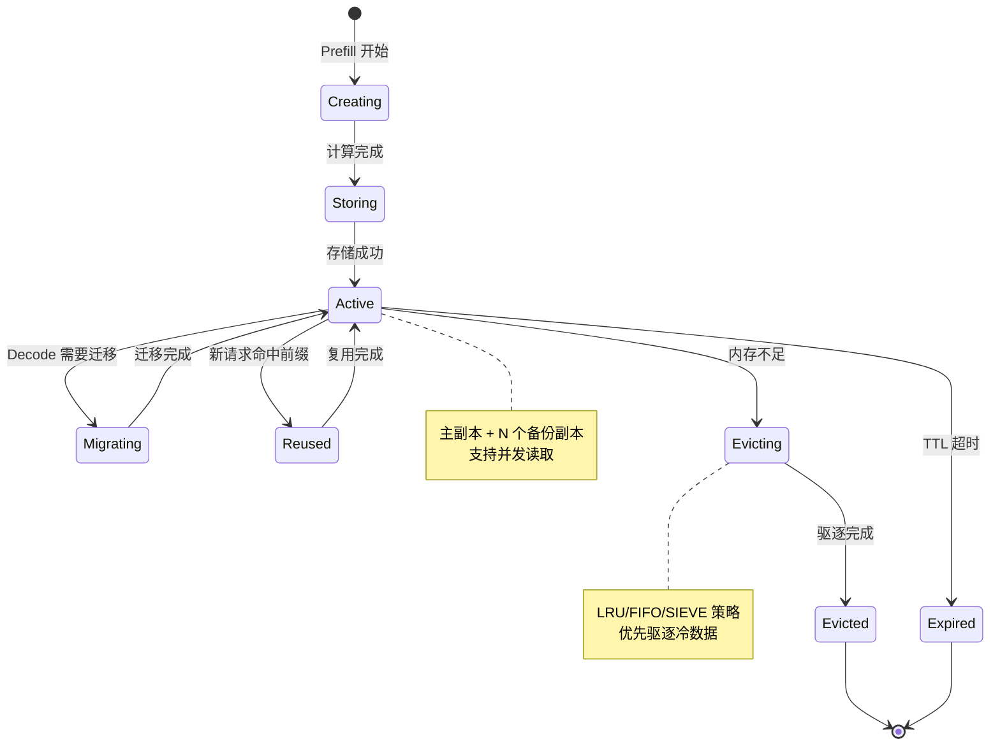

本文追踪一个 KVCache 从创建、存储、复用到驱逐的完整生命周期。

---

## 1. KVCache 生命周期状态机



---

## 2. 阶段 1: 创建 (Creating)

### 2.1 Prefill 计算生成 KVCache

**发生时机**: Prefill Worker 执行模型前向计算

**代码路径**: `src/worker/prefill_worker.py::execute_prefill()`

```python
# Prefill 计算
output = model.forward(
    input_ids=prompt_tokens,
    past_key_values=None,  # 无历史 KVCache
    use_cache=True
)

# 获取新生成的 KVCache
new_kv_cache = output.past_key_values

# 数据结构:
# Tuple[Tuple[torch.Tensor, torch.Tensor], ...]
# 长度 = num_layers
# 每层包含 (key_cache, value_cache)
# 形状: [batch_size, num_heads, seq_len, head_dim]
```

**KVCache 大小计算**:

```python
def calculate_kvcache_size(
    num_layers: int,
    num_heads: int,
    head_dim: int,
    seq_len: int,
    dtype: torch.dtype = torch.float16
) -> int:
    """
    计算 KVCache 占用的字节数

    示例: LLaMA3-70B
    - num_layers = 80
    - num_heads = 64
    - head_dim = 128
    - seq_len = 128K tokens
    - dtype = FP16 (2 bytes)

    单个 token 的 KVCache 大小:
    = 2 (K+V) * 80 (layers) * 64 (heads) * 128 (head_dim) * 2 (FP16)
    = 5,242,880 bytes
    ≈ 5MB / token

    128K tokens:
    = 5MB * 128K
    = 640GB (!)
    """
    bytes_per_element = torch.finfo(dtype).bits // 8

    size = (
        2 *              # Key + Value
        num_layers *
        num_heads *
        head_dim *
        seq_len *
        bytes_per_element
    )

    return size
```

**创建性能**:

| 模型 | Prompt 长度 | Prefill 时间 | KVCache 大小 |
|------|------------|-------------|-------------|
| LLaMA3-8B | 32K | 2s | 16GB |
| LLaMA3-70B | 32K | 8s | 80GB |
| LLaMA3-70B | 128K | 32s | 320GB |

---

## 2. 阶段 2: 存储 (Storing)

### 2.1 序列化 KVCache

**代码路径**: `src/store/serializer.py::serialize_kvcache()`

```python
def serialize_kvcache(kv_cache: KVCache) -> bytes:
    """
    将 PyTorch KVCache 序列化为字节流

    格式:
    ┌──────────────────┬──────────────────┬─────────┐
    │  Header (64B)    │  Layer 0 K+V     │  ...    │
    ├──────────────────┼──────────────────┼─────────┤
    │ - version: u32   │  - Shape info    │         │
    │ - num_layers: u32│  - Data (bytes)  │         │
    │ - num_heads: u32 │                  │         │
    │ - head_dim: u32  │                  │         │
    │ - seq_len: u32   │                  │         │
    │ - dtype: u8      │                  │         │
    └──────────────────┴──────────────────┴─────────┘
    """
    header = struct.pack(
        '=IIIIII',
        1,  # version
        len(kv_cache),  # num_layers
        kv_cache[0][0].shape[1],  # num_heads
        kv_cache[0][0].shape[3],  # head_dim
        kv_cache[0][0].shape[2],  # seq_len
        dtype_to_code(kv_cache[0][0].dtype)
    )

    # 拼接所有层的 K+V
    data_parts = [header]
    for layer_kv in kv_cache:
        key, value = layer_kv
        data_parts.append(key.cpu().numpy().tobytes())
        data_parts.append(value.cpu().numpy().tobytes())

    return b''.join(data_parts)
```

### 2.2 分配存储空间

**代码路径**: `src/store/allocator.py::allocate_segment()`

```python
class StorageAllocator:
    def allocate_segment(
        self,
        cache_key: str,
        size: int,
        replica_count: int = 2
    ) -> AllocationResult:
        """
        为 KVCache 分配存储空间

        策略:
        1. 选择剩余空间最多的节点作为主副本
        2. 选择不同机架的节点作为备份副本
        3. 使用内存分配器(CacheLib 或 Offset Allocator)
        """
        # 1. 选择主节点
        primary_node = max(
            self.worker_nodes,
            key=lambda n: n.free_memory
        )

        # 2. 在主节点上分配内存
        segment_id = primary_node.allocator.allocate(size)

        # 3. 选择备份节点 (不同机架)
        replica_nodes = self.select_replica_nodes(
            primary_node=primary_node,
            count=replica_count
        )

        # 4. 在备份节点上预留空间
        replica_segment_ids = []
        for replica_node in replica_nodes:
            replica_id = replica_node.allocator.allocate(size)
            replica_segment_ids.append(replica_id)

        return AllocationResult(
            primary_node=primary_node.id,
            primary_segment_id=segment_id,
            replica_nodes=[n.id for n in replica_nodes],
            replica_segment_ids=replica_segment_ids
        )
```

### 2.3 写入数据

**代码路径**: `src/store/writer.py::write_segment()`

```python
async def write_segment(
    node_id: str,
    segment_id: int,
    data: bytes
) -> WriteResult:
    """
    写入 KVCache 数据到指定 Segment

    写入流程:
    1. 验证 Segment 可用
    2. 写入主副本
    3. 异步复制到备份副本
    4. 更新元数据
    """
    # 1. 获取 Segment 地址
    segment_addr = self.get_segment_address(node_id, segment_id)

    # 2. 使用 RDMA Write 写入数据
    await self.transfer_engine.rdma_write(
        target_node=node_id,
        target_addr=segment_addr,
        data=data
    )

    # 3. 标记 Segment 为 Active
    await self.update_segment_status(
        segment_id=segment_id,
        status=SegmentStatus.ACTIVE
    )

    return WriteResult(
        bytes_written=len(data),
        write_latency_ms=...
    )
```

### 2.4 异步副本复制

**代码路径**: `src/store/replication.py::replicate_segment()`

```python
async def replicate_segment(
    source_segment_id: int,
    target_node: str,
    target_segment_id: int
):
    """
    异步复制 Segment 到备份节点

    特点:
    - 不阻塞主流程
    - 使用低优先级 Transfer Task
    - 支持断点续传
    """
    # 1. 读取源 Segment 数据
    source_data = await self.read_segment(source_segment_id)

    # 2. 写入目标 Segment
    await self.write_segment(
        node_id=target_node,
        segment_id=target_segment_id,
        data=source_data
    )

    # 3. 验证数据完整性 (可选)
    if self.config.verify_replica:
        target_checksum = await self.compute_checksum(
            target_node,
            target_segment_id
        )
        if target_checksum != compute_checksum(source_data):
            raise ReplicationError("Checksum mismatch")

    # 4. 更新副本状态
    await self.master_client.mark_replica_ready(
        segment_id=target_segment_id,
        replica_node=target_node
    )
```

---

## 3. 阶段 3: 活跃使用 (Active)

### 3.1 前缀复用

**触发条件**: 新请求的 prompt 与已有 KVCache 有公共前缀

**代码路径**: `src/conductor/cache_manager.py::find_longest_prefix()`

```python
def find_longest_prefix(
    self,
    prompt_tokens: List[int]
) -> Optional[PrefixMatch]:
    """
    查找最长匹配前缀

    使用 Radix Tree 实现高效查找
    """
    # 1. 在 Radix Tree 中查找
    match = self.radix_tree.longest_prefix_match(prompt_tokens)

    if not match:
        return None

    # 2. 查询 KVCache 元数据
    cache_metadata = self.master_client.get_segment_metadata(
        cache_key=match.cache_key
    )

    # 3. 检查 KVCache 是否仍然有效
    if cache_metadata.status != SegmentStatus.ACTIVE:
        # 已被驱逐,返回 None
        return None

    return PrefixMatch(
        cache_key=match.cache_key,
        prefix_length=match.length,
        location=cache_metadata.primary_location,
        total_length=cache_metadata.total_length
    )
```

**复用性能提升**:

```
无前缀复用:
├─ Prefill: 100ms (计算 32K tokens)
└─ 总计: 100ms

有前缀复用 (30K tokens 匹配):
├─ 加载 KVCache: 15ms (RDMA)
├─ Prefill: 6ms (计算剩余 2K tokens)
└─ 总计: 21ms

性能提升: 79% (100ms → 21ms)
```

### 3.2 并发读取

**特点**: 多个请求可以并发读取同一个 KVCache

**代码路径**: `src/store/reader.py::read_segment()`

```python
class SegmentReader:
    def __init__(self):
        # 使用读写锁,支持多读单写
        self.segment_locks = defaultdict(asyncio.RWLock)

    async def read_segment(
        self,
        segment_id: int,
        offset: int = 0,
        length: int = -1
    ) -> bytes:
        """
        读取 Segment 数据

        支持:
        - 并发多读
        - 部分读取 (offset + length)
        - 读缓存
        """
        # 1. 获取读锁 (不阻塞其他读操作)
        async with self.segment_locks[segment_id].read_lock():
            # 2. 检查本地缓存
            if self.cache.has(segment_id):
                return self.cache.get(segment_id, offset, length)

            # 3. 从存储读取
            data = await self.storage.read(segment_id, offset, length)

            # 4. 更新缓存
            self.cache.put(segment_id, data)

            return data
```

**读缓存策略**:

```python
class SegmentCache:
    """
    Segment 读缓存,使用 LRU 驱逐
    """
    def __init__(self, capacity_mb: int = 1024):
        self.capacity = capacity_mb * 1024 * 1024
        self.cache = OrderedDict()  # LRU
        self.current_size = 0

    def put(self, segment_id: int, data: bytes):
        # 驱逐直到有足够空间
        while self.current_size + len(data) > self.capacity:
            evict_id, evict_data = self.cache.popitem(last=False)
            self.current_size -= len(evict_data)

        self.cache[segment_id] = data
        self.cache.move_to_end(segment_id)
        self.current_size += len(data)
```

---

## 4. 阶段 4: 迁移 (Migrating)

**触发条件**: Decode 节点需要远程 KVCache

详见 [02-decode-request-trace.md](./02-decode-request-trace.md#22-kvcache-迁移-pd-分离关键)

**迁移性能**:

| KVCache 大小 | RDMA 带宽 | 迁移时间 |
|-------------|----------|---------|
| 5GB | 100Gbps | 0.4s |
| 10GB | 100Gbps | 0.8s |
| 20GB | 100Gbps | 1.6s |

**优化**: GPU Direct RDMA 避免 CPU 拷贝,延迟降低 30%

---

## 5. 阶段 5: 驱逐 (Evicting)

### 5.1 驱逐触发条件

**代码路径**: `src/store/evictor.py::should_evict()`

```python
def should_evict(self) -> bool:
    """
    判断是否需要驱逐

    触发条件:
    1. 内存使用率 > 阈值 (默认 90%)
    2. 单个 Segment 超过 TTL (默认 1 小时)
    3. 手动触发
    """
    # 条件1: 内存压力
    memory_usage = self.get_memory_usage()
    if memory_usage > self.config.eviction_threshold:
        return True

    # 条件2: TTL 超时
    if self.has_expired_segments():
        return True

    return False
```

### 5.2 驱逐策略

**支持的策略**:

#### 策略 1: LRU (Least Recently Used)

```python
class LRUEvictor:
    def select_victims(self, target_size: int) -> List[int]:
        """
        选择最近最少使用的 Segments

        维护访问时间戳:
        - 每次 read_segment 更新 last_access_time
        - 按时间戳排序,选择最旧的
        """
        # 按访问时间排序
        segments_by_access = sorted(
            self.segments.items(),
            key=lambda x: x[1].last_access_time
        )

        victims = []
        freed_size = 0

        for segment_id, metadata in segments_by_access:
            victims.append(segment_id)
            freed_size += metadata.size

            if freed_size >= target_size:
                break

        return victims
```

#### 策略 2: SIEVE (State-of-the-art)

```python
class SIEVEEvictor:
    """
    SIEVE 驱逐策略 (NSDI'24 Best Paper)

    核心思想:
    - 维护一个指针遍历 Segments
    - 每个 Segment 有一个 visited bit
    - 访问时设置 visited = 1
    - 驱逐时:
      - 如果 visited = 1,设置为 0,跳过
      - 如果 visited = 0,驱逐

    优势:
    - 比 LRU 更高的命中率
    - 不需要维护复杂的访问顺序
    """
    def __init__(self):
        self.segments = []
        self.visited = {}  # segment_id -> bool
        self.hand = 0      # 时钟指针

    def on_access(self, segment_id: int):
        self.visited[segment_id] = True

    def select_victims(self, target_size: int) -> List[int]:
        victims = []
        freed_size = 0

        while freed_size < target_size:
            segment_id = self.segments[self.hand]

            if self.visited[segment_id]:
                # 第一次遇到,给第二次机会
                self.visited[segment_id] = False
            else:
                # 第二次遇到,驱逐
                victims.append(segment_id)
                freed_size += self.get_segment_size(segment_id)

            # 移动指针
            self.hand = (self.hand + 1) % len(self.segments)

        return victims
```

#### 策略对比

| 策略 | 命中率 | 开销 | 适用场景 |
|------|-------|------|---------|
| FIFO | 低 | 极低 | 简单场景 |
| LRU | 中 | 中 | 通用 |
| SIEVE | 高 | 低 | 生产推荐 |

**Mooncake 默认**: SIEVE

### 5.3 执行驱逐

**代码路径**: `src/store/evictor.py::evict_segments()`

```python
async def evict_segments(self, victims: List[int]):
    """
    执行 Segment 驱逐

    步骤:
    1. 更新元数据状态为 EVICTING
    2. 等待所有正在进行的读操作完成
    3. 释放内存
    4. 删除元数据记录
    """
    for segment_id in victims:
        # 1. 标记为驱逐中
        await self.master_client.update_segment_status(
            segment_id=segment_id,
            status=SegmentStatus.EVICTING
        )

        # 2. 获取写锁 (阻塞新的读操作)
        async with self.segment_locks[segment_id].write_lock():
            # 3. 释放内存
            self.allocator.free(segment_id)

            # 4. 删除副本
            for replica_node in metadata.replica_nodes:
                await self.delete_replica(replica_node, segment_id)

            # 5. 从元数据中删除
            await self.master_client.delete_segment(segment_id)

            logger.info(
                f"Segment {segment_id} 已驱逐,释放 "
                f"{metadata.size / 1024 / 1024:.2f}MB"
            )
```

**驱逐性能**:
- 单个 Segment 驱逐: < 1ms
- 批量驱逐 100 个 Segments: < 50ms

---

## 6. 生命周期监控

### 6.1 关键指标

```python
class KVCacheMetrics:
    """
    KVCache 生命周期监控指标
    """
    # 创建
    creation_count: Counter           # 创建次数
    creation_latency: Histogram       # 创建延迟

    # 存储
    storage_bytes_written: Counter    # 写入字节数
    storage_latency: Histogram        # 存储延迟
    replication_lag: Gauge            # 副本延迟

    # 活跃使用
    hit_count: Counter                # 前缀命中次数
    miss_count: Counter               # 前缀未命中次数
    concurrent_reads: Gauge           # 并发读数量

    # 迁移
    migration_count: Counter          # 迁移次数
    migration_bytes: Counter          # 迁移字节数
    migration_latency: Histogram      # 迁移延迟

    # 驱逐
    eviction_count: Counter           # 驱逐次数
    eviction_bytes: Counter           # 驱逐字节数
    memory_usage: Gauge               # 内存使用率

    @property
    def hit_rate(self) -> float:
        """命中率"""
        total = self.hit_count.value + self.miss_count.value
        return self.hit_count.value / total if total > 0 else 0.0

    @property
    def avg_lifetime(self) -> float:
        """平均生命周期 (秒)"""
        return self.total_lifetime_seconds.value / self.creation_count.value
```

### 6.2 监控仪表盘

```python
# Prometheus metrics 导出
from prometheus_client import start_http_server, Counter, Histogram, Gauge

# 创建指标
kvcache_created = Counter(
    'mooncake_kvcache_created_total',
    'Total KVCache created'
)

kvcache_hit_rate = Gauge(
    'mooncake_kvcache_hit_rate',
    'KVCache prefix hit rate'
)

kvcache_memory_usage = Gauge(
    'mooncake_kvcache_memory_bytes',
    'KVCache memory usage in bytes'
)

# 启动 metrics 服务器
start_http_server(9090)

# 更新指标
def on_kvcache_created():
    kvcache_created.inc()

def update_metrics():
    kvcache_hit_rate.set(metrics.hit_rate)
    kvcache_memory_usage.set(metrics.memory_usage.value)
```

**Grafana 可视化**:
- 命中率趋势图
- 内存使用率
- 驱逐频率
- 迁移延迟分布

---

## 7. 生命周期优化建议

### 7.1 延长 KVCache 生命周期

```python
# 配置更保守的驱逐策略
config = {
    'eviction_threshold': 0.95,  # 95% 才驱逐 (默认 90%)
    'ttl_seconds': 3600,         # 1 小时 (默认 30 分钟)
    'min_access_count': 2,       # 至少访问 2 次才保留
}
```

### 7.2 提升前缀命中率

```python
# 使用更细粒度的前缀索引
class PrefixIndex:
    def build_index(self, prompts: List[str]):
        """
        为常见 prompt 前缀建立索引

        示例:
        - "请帮我写一篇关于" → 高频前缀
        - "翻译以下内容:" → 高频前缀
        """
        for prompt in prompts:
            tokens = self.tokenizer.encode(prompt)
            # 索引不同长度的前缀
            for length in [16, 32, 64, 128]:
                prefix = tokens[:length]
                self.radix_tree.insert(prefix)
```

### 7.3 减少迁移开销

```python
# 亲和性调度:优先将 Decode 分配到 KVCache 所在节点
def schedule_decode_with_affinity(cache_location):
    # 查找同节点的 Decode Worker
    local_workers = find_workers_on_node(cache_location.node_id)

    if local_workers:
        return local_workers[0]  # 避免迁移
    else:
        return select_least_loaded_worker()  # 必须迁移
```

---

## 8. 相关阅读

- [03-mooncake-store/01-storage-architecture.md](../../03-mooncake-store/01-storage-architecture.md) - 存储架构
- [03-mooncake-store/03-eviction-and-ha.md](../../03-mooncake-store/03-eviction-and-ha.md) - 驱逐策略详解
- [04-transfer-engine/02-rdma-transport.md](../../04-transfer-engine/02-rdma-transport.md) - RDMA 传输

---

**KVCache 生命周期的核心价值**: 通过高效的管理和复用,将 Prefill 计算成本摊销到多个请求,大幅降低整体推理成本。
