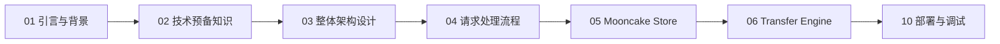
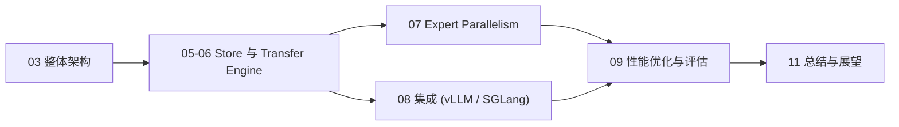
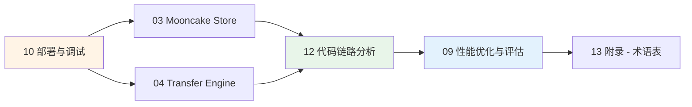

# Mooncake 深度原理解析

> **FAST 2025 Best Paper** | Trading More Storage for Less Computation
>
> 基于 FAST'25 论文及 [Mooncake 开源代码库](https://github.com/kvcache-ai/Mooncake) 的深度技术解析文档集。

---

## 项目简介

Mooncake 是由 Moonshot AI (Kimi) 团队研发的 **KVCache-centric 分离式 LLM 推理服务系统**。其核心思想是将 Prefill 与 Decode 阶段解耦，利用集群中所有节点的 CPU 内存和 NVMe SSD 构建 PB 级分布式 KVCache 缓存池（Mooncake Store），并通过高性能 Transfer Engine 与拓扑感知调度实现跨节点 KVCache 高效共享，从而在严格 SLO 约束下大幅提升推理吞吐量。

在实际生产环境（Kimi 服务，数千节点）中，Mooncake 相比 vLLM 基准系统在 100ms TBT SLO 下实现了 **+498%** 的有效请求容量提升。

---

## 阅读路径

本文档集提供两条推荐阅读路径，适合不同背景的读者。

### 路径一 - 初学者路径

从基础概念入手，循序渐进理解 Mooncake 的设计与实现。

### 路径二 - 进阶路径

适合已有 LLM 推理系统和 RDMA 网络背景的读者，直接进入核心模块与调度算法。

### 路径三 - 运维路径

适合负责 Mooncake 系统部署、监控与故障排查的运维工程师。

**推荐学习顺序**:
1. **快速上手**: [10-deployment](./10-deployment/) - 完成基础部署,熟悉系统架构
2. **深入模块**: [03-mooncake-store](./03-mooncake-store/) 和 [04-transfer-engine](./04-transfer-engine/) - 理解核心组件工作原理
3. **链路调试**: [12-code-walkthrough](./12-code-walkthrough/) - 掌握请求处理流程,学习调试方法
4. **性能调优**: [09-performance](./09-performance/) - 监控关键指标,优化系统性能
5. **故障排查**: 结合 [13-appendix](./13-appendix/) 术语表和各模块的调试章节

---

## 场景化导航

根据实际应用场景,快速找到相关文档:

| 场景 | 关注点 | 推荐阅读顺序 | 预计时间 |
|------|--------|-------------|---------|
| **首次部署** | 快速搭建可用系统 | [00-beginner-guide](./00-beginner-guide/) → [10-deployment](./10-deployment/) → [08-integration](./08-integration/) | 2-3 天 |
| **性能调优** | 提升吞吐量,降低延迟 | [09-performance](./09-performance/) → [04-transfer-engine](./04-transfer-engine/) → [12-code-walkthrough/04-rdma-transfer-trace](./12-code-walkthrough/04-rdma-transfer-trace.md) | 1-2 周 |
| **故障排查** | 解决线上问题 | [12-code-walkthrough](./12-code-walkthrough/) → [03-mooncake-store](./03-mooncake-store/) → [10-deployment/调试章节](./10-deployment/) | 按需 |
| **架构理解** | 深入理解设计原理 | [01-overview](./01-overview/) → [02-architecture](./02-architecture/) → [05-tent](./05-tent/) → [11-summary](./11-summary/) | 1 周 |
| **集成开发** | 与现有框架集成 | [08-integration](./08-integration/) → [02-architecture](./02-architecture/) → [06-p2p-store](./06-p2p-store/) | 3-5 天 |
| **MoE 支持** | 部署混合专家模型 | [07-expert-parallelism](./07-expert-parallelism/) → [04-transfer-engine](./04-transfer-engine/) → [09-performance](./09-performance/) | 5-7 天 |

**提示**: 遇到术语不理解时,随时查阅 [13-appendix/01-glossary.md](./13-appendix/01-glossary.md) 术语表。

---

## 模块目录

| 编号 | 模块 | 说明 |
|------|------|------|
| [00-beginner-guide](./00-beginner-guide/) | 初学者指南 | 面向新手的快速入门教程与概念导览 |
| [01-overview](./01-overview/) | 概述与背景 | 项目背景、核心理念、技术预备知识 |
| [02-architecture](./02-architecture/) | 系统架构 | 整体架构设计与请求处理流程 |
| [03-mooncake-store](./03-mooncake-store/) | Mooncake Store | 分布式 KVCache 存储引擎设计 |
| [04-transfer-engine](./04-transfer-engine/) | Transfer Engine | 高性能数据传输引擎核心实现 |
| [05-tent](./05-tent/) | TENT | Topology-aware Engine for Network Transfer |
| [06-p2p-store](./06-p2p-store/) | P2P Store | 点对点对象存储与 checkpoint 支持 |
| [07-expert-parallelism](./07-expert-parallelism/) | Expert Parallelism | MoE 模型 Expert Parallelism 支持 |
| [08-integration](./08-integration/) | 框架集成 | 与 vLLM、SGLang 等推理框架的集成方案 |
| [09-performance](./09-performance/) | 性能优化 | 关键性能优化技术与实验评估 |
| [10-deployment](./10-deployment/) | 部署与调试 | 生产环境部署指南与调试方法 |
| [11-summary](./11-summary/) | 总结与展望 | 贡献回顾与未来发展方向 |
| [12-code-walkthrough](./12-code-walkthrough/) | 代码链路分析 | 关键代码执行路径追踪与调试技巧 |
| [13-appendix](./13-appendix/) | 附录 | 术语表、参考资料与扩展阅读 |

---

## 阅读前提检查

在开始阅读之前，建议确认以下基础知识储备：

- [ ] 了解 Transformer 架构与 Self-Attention 机制
- [ ] 了解 LLM 自回归生成流程 (Prefill / Decode)
- [ ] 了解 KVCache 的基本概念与作用
- [ ] 具备 C++ 和 Python 基本阅读能力
- [ ] (进阶) 了解 RDMA 网络基本概念 (QP、MR、CQ)
- [ ] (进阶) 了解 GPU 显存管理与 CUDA 编程基础

> 如果对上述概念不熟悉，建议先阅读 [01-overview/02-prerequisites.md](./01-overview/02-prerequisites.md) 技术预备知识章节。

---

## 参考资源

- 论文: [Mooncake: Trading More Storage for Less Computation (FAST'25)](https://www.usenix.org/conference/fast25/presentation/qin)
- 代码: [https://github.com/kvcache-ai/Mooncake](https://github.com/kvcache-ai/Mooncake)
- Kimi: [https://kimi.ai](https://kimi.ai)
