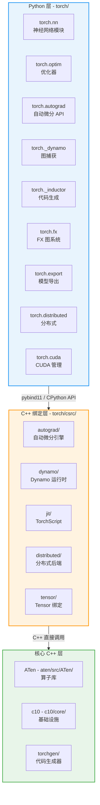
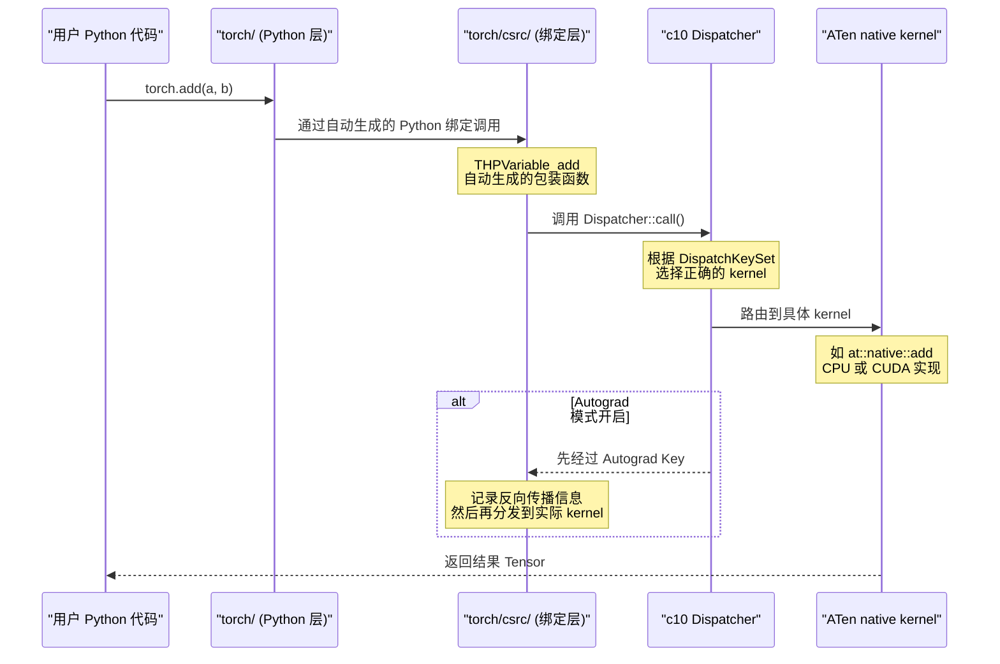
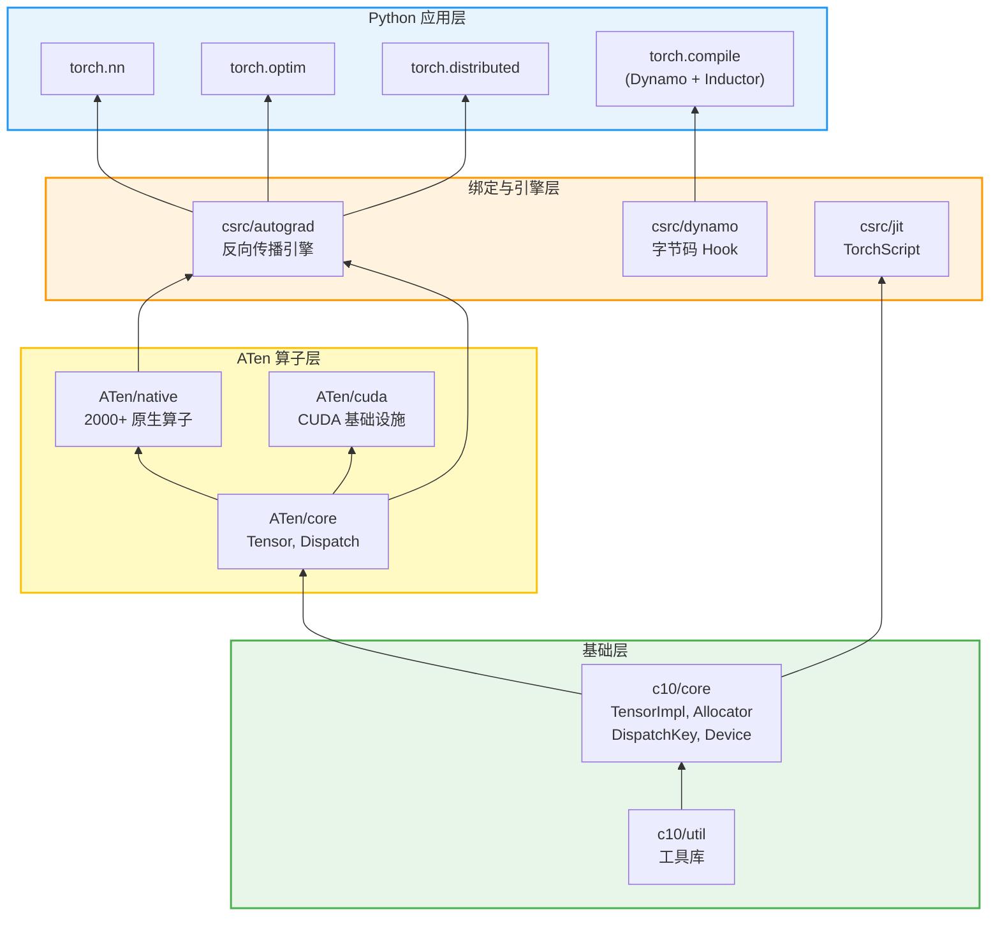
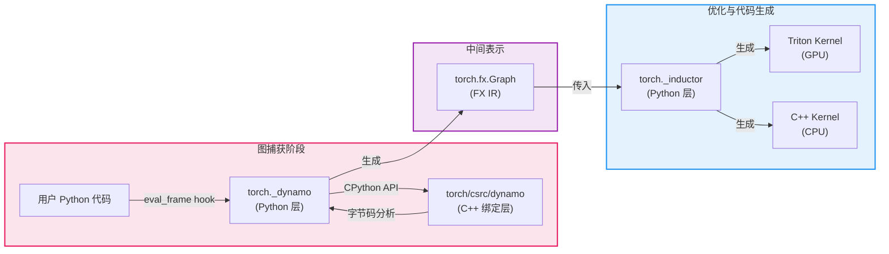

## 概述

PyTorch 作为当前最主流的深度学习框架之一，其源码规模庞大、模块繁多。要系统地理解它，首先需要建立一个清晰的架构心智模型。本篇将从最高层的视角出发，解析 PyTorch 的三层架构设计 —— Python 层、C++ 绑定层、核心 C++ 层 —— 并梳理各层之间的通信机制与依赖关系，帮助读者在后续深入阅读各模块源码前建立全局认知。

本篇是整个源码分析系列的第一篇，也是最重要的一篇。后续所有模块分析都建立在这里的架构认知之上。

## 前置知识

- 具备 PyTorch 基本使用经验（能编写简单的训练循环）
- 了解 Python 与 C/C++ 的基本交互概念（如 CPython Extension）
- 对深度学习基本概念有所了解（张量、梯度、反向传播）

## 核心概念 - PyTorch 三层架构

PyTorch 的源码可以划分为三个清晰的层次，每一层有明确的职责边界。理解这三层的分工与协作，是理解整个代码库的基础。



### 设计哲学 - 为什么要分三层

PyTorch 采用三层架构并非偶然，其背后有几个关键的设计考量：

1. **易用性与性能的平衡** - Python 层提供直观的 API，C++ 层保证计算性能。用户几乎不需要接触 C++ 代码，但底层运算全部在 C++ 中完成。
2. **关注点分离** - 绑定层将 Python 的动态特性（引用计数、GIL）与 C++ 的高性能运算隔离开来，两侧可以独立演进。
3. **多语言复用** - 核心 C++ 层（ATen、c10）不依赖 Python，可被 C++ Frontend（LibTorch）、移动端推理等场景直接复用。
4. **代码生成驱动** - 通过 `torchgen/` 自动从算子定义文件生成大量胶水代码，减少人工维护成本并保证一致性。

## 源码目录结构总览

下面的表格列出了 PyTorch 仓库中最重要的顶层目录及其职责：

| 目录 | 层次 | 核心职责 |
|------|------|----------|
| `torch/` | Python 层 | 用户直接使用的 Python API，包括 nn、optim、autograd 等 |
| `torch/csrc/` | C++ 绑定层 | Python-C++ 桥梁，包含 autograd 引擎、JIT、Dynamo 运行时 |
| `aten/src/ATen/` | 核心 C++ 层 | ATen 算子库，包含所有原生张量运算的实现 |
| `c10/core/` | 核心 C++ 层 | 最底层基础设施 - TensorImpl、Allocator、Dispatcher、Device |
| `torchgen/` | 代码生成 | 从 `native_functions.yaml` 生成 C++ 算子注册和 Python 绑定代码 |

### 第一层 - Python 层详解（`torch/`）

Python 层是用户直接接触的部分，也是 PyTorch "Pythonic" 体验的核心。以下是其主要子模块：

| 子目录 | 职责 | 典型入口 |
|--------|------|----------|
| `torch/nn/` | 神经网络模块定义，包含 `Module`、各种 Layer | `nn.Linear`, `nn.Conv2d` |
| `torch/optim/` | 优化器实现，包含 SGD、Adam 等 | `optim.Adam`, `optim.lr_scheduler` |
| `torch/autograd/` | 自动微分的 Python 端 API | `autograd.grad()`, `backward()` |
| `torch/cuda/` | CUDA 设备管理、Stream、Event | `torch.cuda.synchronize()` |
| `torch/distributed/` | 分布式训练相关 API | `DDP`, `FSDP`, `DeviceMesh` |
| `torch/_dynamo/` | TorchDynamo - Python 字节码级图捕获 | `torch.compile()` 的入口 |
| `torch/_inductor/` | TorchInductor - 从 FX 图生成优化代码 | Triton / C++ kernel 代码生成 |
| `torch/fx/` | FX 图 IR 系统 | `Graph`, `Node`, `GraphModule` |
| `torch/export/` | 模型导出，生成可部署的 ExportedProgram | `torch.export.export()` |
| `torch/_decomp/` | 算子分解，将复合算子拆解为基本算子 | decomposition 注册表 |
| `torch/library.py` | 自定义算子注册 API | `torch.library.custom_op` |

### 第二层 - C++ 绑定层详解（`torch/csrc/`）

绑定层是 PyTorch 中最"精密"的部分之一。它不仅仅是简单的 Python-C++ 桥梁，还承载了一些关键的运行时逻辑：

| 子目录 | 职责 |
|--------|------|
| `torch/csrc/autograd/` | Autograd 引擎核心实现 - 包括反向传播线程池、`Engine`、`Node`（旧称 `Function`） |
| `torch/csrc/dynamo/` | TorchDynamo 的 C++ 运行时部分 - `eval_frame` 的 C 扩展实现 |
| `torch/csrc/jit/` | TorchScript 编译器和运行时 - IR、Pass、Interpreter |
| `torch/csrc/distributed/` | 分布式 C++ 后端 - c10d ProcessGroup 的具体实现 |
| `torch/csrc/api/` | C++ Frontend（LibTorch）API |
| `torch/csrc/tensor/` | Python Tensor 对象的 C++ 绑定 |
| `torch/csrc/inductor/` | Inductor C++ 运行时辅助代码 |
| `torch/csrc/functorch/` | functorch（vmap、grad）的 C++ 实现 |

### 第三层 - 核心 C++ 层详解

核心 C++ 层分为两个主要部分 - ATen 和 c10，它们之间有明确的职责划分：

#### c10 - 基础设施层（`c10/core/`）

c10（取义 Caffe2 + PyTorch "ten" 合并）提供最底层、最核心的数据结构：

| 文件 | 职责 |
|------|------|
| `TensorImpl.h` | Tensor 的 C++ 实际实现，持有数据指针、形状、步长、设备信息 |
| `StorageImpl.h` | 底层存储 - 管理实际的内存块 |
| `Allocator.h` | 内存分配器抽象接口，CPU / CUDA 各有实现 |
| `DispatchKey.h` | 定义所有的 Dispatch Key（CPU、CUDA、Autograd 等） |
| `DispatchKeySet.h` | DispatchKey 的集合操作，用于分发决策 |
| `Device.h` | 设备抽象（CPU、CUDA:0 等） |
| `ScalarType.h` | 数据类型定义（float32、int64 等） |
| `Stream.h` | 设备流抽象，用于异步执行 |

#### ATen - 算子库（`aten/src/ATen/`）

ATen（A TENsor library）是 PyTorch 的算子核心：

| 子目录/文件 | 职责 |
|-------------|------|
| `native/` | 所有原生算子的 C++ 实现（超过 2000 个算子） |
| `native/cpu/` | CPU 特化的算子 kernel（含 SIMD 向量化） |
| `native/cuda/` | CUDA 特化的算子 kernel |
| `core/` | ATen 核心 - Tensor 类定义、Dispatch 系统集成 |
| `cuda/` | CUDA 设备相关基础设施 |
| `Tensor.h` | 用户直接使用的 Tensor 类，是 TensorImpl 的智能指针包装 |
| `TensorIterator.h` | 高性能逐元素运算框架 |
| `Dispatch.h` | 算子分发宏 |

#### torchgen - 代码生成器（`torchgen/`）

PyTorch 的一个重要特色是大量使用代码生成。`torchgen/` 读取 `aten/src/ATen/native/native_functions.yaml` 中的算子声明，自动生成：

- C++ 算子注册代码
- Python 绑定代码（`torch/_C/` 下的 `.pyi` 文件）
- 分发表注册
- 算子的 schema 信息

## 三层之间的通信机制

理解三层架构不仅要知道每层做什么，还要理解它们如何协作。以下通过一个具体例子 —— `torch.add(a, b)` 的调用链 —— 来展示这个过程。



### 通信机制的关键细节

**Python 到 C++ 的桥梁** - PyTorch 使用两种方式连接 Python 与 C++：

1. **CPython C API** - `torch/csrc/` 中大量使用原生 CPython API（`PyObject*`、`PyArg_ParseTuple` 等）来实现高性能绑定。这是 Tensor 方法和大部分算子的绑定方式。
2. **pybind11** - 部分较新的模块（如 `torch/csrc/distributed/`）使用 pybind11 简化绑定代码。

**Dispatcher 是枢纽** - 几乎所有的算子调用最终都通过 `c10::Dispatcher` 路由。Dispatcher 维护一张表，根据 Tensor 携带的 `DispatchKeySet`（包含设备类型、是否需要 Autograd 等信息）选择正确的 kernel。这是 PyTorch 实现"同一 API 适用不同设备和功能"的核心机制。

**代码生成串联全链路** - `torchgen/` 生成的代码是三层之间的粘合剂：它为每个算子同时生成 Python 绑定（连接第一层和第二层）和 Dispatcher 注册（连接第二层和第三层），确保算子声明、Python API、C++ 实现三者保持同步。

## 模块依赖关系

PyTorch 的各模块之间存在复杂但有规律的依赖关系。下图展示了主要模块的依赖层次：



**依赖规则：**

- 箭头方向表示"被依赖"关系（A → B 表示 B 依赖 A）
- 底层不依赖上层 —— `c10` 完全不知道 `ATen` 的存在，`ATen` 不依赖 `torch/csrc/`
- 同层模块之间尽量减少耦合
- Python 层可以自由调用绑定层和核心层（通过绑定），但核心层不依赖 Python

## 实战示例 - 追踪一个简单操作的完整链路

以一个最简单的操作为例，帮助读者建立从用户代码到底层执行的完整直觉：

```python
import torch

# 1. 创建 Tensor（Python 层）
a = torch.tensor([1.0, 2.0, 3.0])
b = torch.tensor([4.0, 5.0, 6.0])

# 2. 执行加法（三层协作）
c = a + b  # 等价于 torch.add(a, b)

# 3. 查看结果
print(c)  # tensor([5., 7., 9.])
```

这个看似简单的 `a + b` 在源码层面经历了以下关键步骤：

```
用户代码: a + b
    │
    ▼
Python 层: torch/
    Tensor.__add__ 被调用
    转发到 torch.add()
    │
    ▼
C++ 绑定层: torch/csrc/
    自动生成的 THPVariable_add 函数
    解析 Python 参数，转为 C++ 类型
    │
    ▼
Dispatcher: c10/core/
    Dispatcher::call() 被调用
    从 a 和 b 的 DispatchKeySet 计算目标 key
    查表找到对应的 kernel
    │
    ▼
ATen Kernel: aten/src/ATen/native/
    BinaryOps.cpp -> at::native::add
    调用 TensorIterator 执行逐元素加法
    │
    ▼
底层计算:
    CPU: 使用 SIMD 向量化加速
    CUDA: 启动 GPU kernel
```

下面通过代码定位关键源文件，帮助读者亲自验证这条链路：

**Python 层入口** - Tensor 的 `__add__` 方法：
```
torch/_C/_VariableFunctions.pyi  # 自动生成的类型声明
```

**C++ 绑定** - 自动生成的包装函数：
```
torch/csrc/autograd/generated/  # 由 torchgen 自动生成
```

**Dispatcher 分发逻辑**：
```
c10/core/impl/LocalDispatchKeySet.h  # 线程局部的 DispatchKeySet
aten/src/ATen/core/dispatch/Dispatcher.h  # Dispatcher 核心实现
```

**ATen 原生算子**：
```
aten/src/ATen/native/BinaryOps.cpp  # add 算子的高层实现
aten/src/ATen/TensorIterator.h      # 逐元素运算框架
```

### 如何自己追踪调用链

在实际调试时，可以使用以下方式追踪完整调用链：

```python
import torch

# 方法 1: 使用 torch.overrides 查看分发信息
print(torch.overrides.get_overridable_functions())

# 方法 2: 使用 TORCH_SHOW_DISPATCH_TRACE 环境变量
# 设置后运行代码可以看到完整的 dispatch 路径
# TORCH_SHOW_DISPATCH_TRACE=1 python your_script.py

# 方法 3: 使用 torch._C._dispatch_get_registrations_for_dispatch_key
# 查看特定 dispatch key 下注册了哪些算子
print(torch._C._dispatch_get_registrations_for_dispatch_key("CPU")[:5])
```

## torch.compile 编译器栈的架构位置

PyTorch 2.0 引入的 `torch.compile()` 是一个横跨三层的重要特性，其架构位置如下：



`torch.compile()` 的流程串联了多个层次：
- **Dynamo** 在 Python 层通过 CPython 的 `eval_frame` hook 截获字节码，在 C++ 绑定层实现高性能的 frame evaluation
- **FX** 在 Python 层提供图 IR 表示
- **Inductor** 在 Python 层将 FX 图编译为 Triton（GPU）或 C++（CPU）代码

## 小结

PyTorch 的三层架构是理解其源码的钥匙。回顾要点：

| 层次 | 目录 | 核心职责 | 语言 |
|------|------|----------|------|
| Python 层 | `torch/` | 用户 API、模型定义、编译器前端 | Python |
| C++ 绑定层 | `torch/csrc/` | Python-C++ 桥梁、Autograd 引擎、Dynamo 运行时 | C++（含 CPython API） |
| 核心 C++ 层 | `aten/`, `c10/` | 算子实现、TensorImpl、Dispatcher、内存管理 | C++ |

**关键设计原则：**

1. **向下依赖，不向上反转** - 底层不依赖上层，保证核心库的独立性
2. **Dispatcher 是中枢** - 所有算子通过统一的分发机制路由，实现设备无关的 API
3. **代码生成驱动一致性** - `torchgen/` 从单一声明源（`native_functions.yaml`）生成跨层代码
4. **Python 负责灵活性，C++ 负责性能** - 两种语言各取所长

掌握这个架构全景后，读者可以进入后续模块的深度分析。建议先阅读 [Module 1 - Tensor 与 Storage](../module-01-tensor-storage/) 了解最底层的数据结构，或者跳到 [Module 3 - NN Module](../module-03-nn-module/) 从最熟悉的用户 API 开始深入。

## 延伸阅读

- **本系列下一篇**: [01-build-and-dev-setup.md](01-build-and-dev-setup.md) - 环境搭建与开发工作流
- **Module 1**: [Tensor 与 Storage 系统](../module-01-tensor-storage/) - 深入 TensorImpl 和内存管理
- **Module 5**: [算子分发系统](../module-05-dispatch/) - Dispatcher 的完整工作机制
- **Module 6**: [TorchDynamo](../module-06-dynamo/) - torch.compile 的图捕获原理
- **PyTorch 官方设计文档**: PyTorch RFC 和 dev-discuss 论坛中有大量架构讨论
- **PyTorch 官方 C++ 文档**: https://pytorch.org/cppdocs/ - LibTorch API 参考
