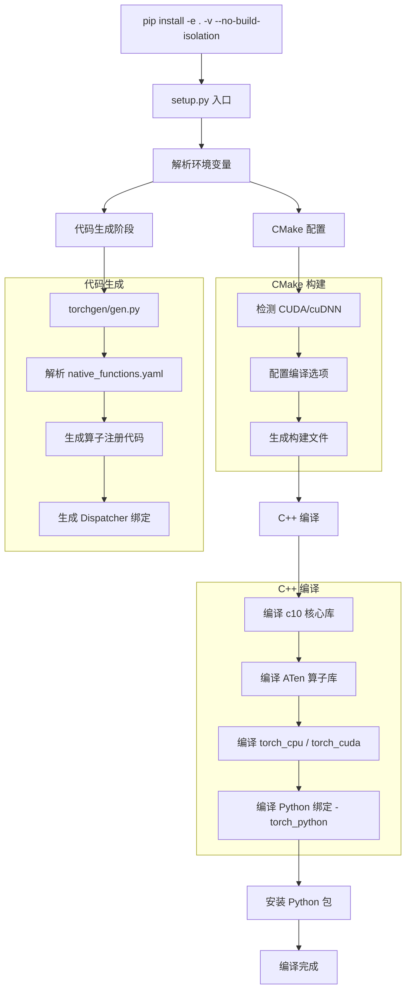
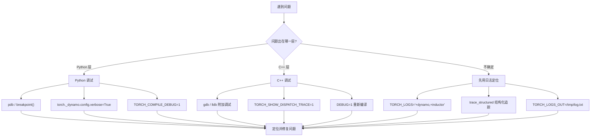

## 概述

PyTorch 是一个由 Python 前端和 C++/CUDA 后端深度融合的混合工程。想要深入理解 PyTorch 内部机制，第一步就是能够从源码编译、运行并调试它。本文将系统性地介绍从零搭建 PyTorch 源码开发环境的完整流程，涵盖编译构建、调试工具链、环境变量配置以及代码生成系统等核心内容。

掌握这些基础设施知识，是后续深入分析 Dispatcher、Autograd、TorchDynamo、TorchInductor 等核心模块的前提。

## 前置知识

在开始源码编译之前，你需要准备以下工具链：

**Python 环境**
- Python 3.9+（推荐使用 conda 或 pyenv 管理虚拟环境）
- pip 21.0+（需支持 `--no-build-isolation` 选项）

**C++ 工具链**
- GCC 9+ 或 Clang 12+（macOS 使用 Xcode Command Line Tools）
- CMake 3.18+
- Ninja（可选，但强烈推荐，可显著加速编译）

**GPU 支持（可选）**
- CUDA Toolkit 11.8+（构建 GPU 版本时必需）
- cuDNN 8.0+
- NCCL（分布式训练场景）

**其他依赖**
- numpy、pyyaml、typing_extensions 等 Python 包
- MKL 或 OpenBLAS（线性代数运算后端）

```bash
# 推荐使用 conda 创建隔离环境
conda create -n pytorch-dev python=3.11 -y
conda activate pytorch-dev
conda install cmake ninja mkl mkl-include -y

# 克隆源码（含子模块）
git clone --recursive https://github.com/pytorch/pytorch.git
cd pytorch
git submodule sync
git submodule update --init --recursive
```

## 编译指南

### 构建命令

PyTorch 的标准编译命令只有一条：

```bash
pip install -e . -v --no-build-isolation
```

各参数含义：
- `-e`：以 editable（开发）模式安装，修改 Python 代码后无需重新编译
- `-v`：verbose 模式，输出完整的编译日志
- `--no-build-isolation`：不创建隔离的构建环境，直接使用当前环境的依赖

> **注意**：这是构建 PyTorch 的唯一推荐方式。不要尝试直接运行 `python setup.py install` 或其他变体。

### 构建流程

整个构建过程涉及 Python 打包、代码生成、CMake 配置和 C++ 编译等多个阶段。以下是完整的构建流程：



### 编译配置变量

`setup.py` 文件头部（见 `setup.py` 第 1-179 行）详细列出了所有支持的编译环境变量。以下是最常用的几个：

| 环境变量 | 说明 | 示例 |
|---------|------|------|
| `DEBUG=1` | 以 `-O0 -g` 编译，生成调试符号 | `DEBUG=1 pip install -e . -v --no-build-isolation` |
| `REL_WITH_DEB_INFO=1` | 保留优化的同时生成调试符号 | 推荐用于日常开发 |
| `USE_CUDA=0` | 禁用 CUDA 构建 | 仅需 CPU 版本时使用 |
| `MAX_JOBS=N` | 限制并行编译任务数 | 内存不足时降低此值 |
| `CMAKE_FRESH=1` | 强制重新运行 CMake 配置 | 修改 CMake 文件后使用 |
| `TORCH_CUDA_ARCH_LIST` | 指定目标 CUDA 架构 | `"7.0;8.0"` |
| `USE_DISTRIBUTED=0` | 禁用分布式组件 | 不需要分布式时加速编译 |
| `USE_MKLDNN=0` | 禁用 MKL-DNN | 减少编译时间 |
| `CFLAGS` | 自定义 C/C++ 编译标志 | 见下文 dispatch trace 说明 |

### 增量编译技巧

全量编译 PyTorch 可能耗时 30 分钟以上。以下策略可以显著缩短开发周期：

1. **纯 Python 修改**：editable 模式下直接生效，无需重新编译
2. **C++ 修改**：再次执行 `pip install -e . -v --no-build-isolation`，CMake 会自动检测变更文件并增量编译
3. **缩减编译范围**：通过 `USE_CUDA=0 USE_DISTRIBUTED=0 USE_MKLDNN=0` 等变量禁用不需要的组件
4. **使用 Ninja**：安装 ninja 后构建系统会自动使用，比 make 更快

## 调试工具链

PyTorch 的调试分为 Python 层和 C++ 层两个维度。选择合适的调试工具取决于你要调查的问题所在的层级。



### Python 层调试

**pdb 调试器**

最直接的 Python 调试方式。在代码中插入断点：

```python
import pdb; pdb.set_trace()
# 或使用 Python 3.7+ 的内置语法
breakpoint()
```

**TorchDynamo 详细输出**

当调试 `torch.compile` 相关问题时，启用 verbose 模式可以看到详细的图捕获信息：

```python
import torch._dynamo.config
torch._dynamo.config.verbose = True

# 或使用 config.patch 装饰器（推荐）
@torch._dynamo.config.patch(verbose=True)
def test_my_function():
    ...
```

**TORCH_COMPILE_DEBUG**

设置此环境变量后（见 `torch/_dynamo/utils.py` 第 949 行），PyTorch 会将编译过程中的 FX 图、生成代码等信息转储到文件：

```bash
TORCH_COMPILE_DEBUG=1 python my_script.py
```

输出目录默认为当前工作目录下的 `torch_compile_debug/`，可通过 `TORCH_COMPILE_DEBUG_DIR` 自定义（见 `torch/_dynamo/config.py` 第 586 行）。

### C++ 层调试

**gdb / lldb 调试**

调试 C++ 层代码需要先用 `DEBUG=1` 编译以生成调试符号：

```bash
DEBUG=1 pip install -e . -v --no-build-isolation
```

然后使用 gdb 或 lldb 附加到 Python 进程：

```bash
# 使用 gdb
gdb --args python my_script.py

# 使用 lldb（macOS）
lldb -- python my_script.py
```

常用 gdb 操作：

```
# 在 C++ 函数设置断点
(gdb) break at::native::add
# 查看 Tensor 内容
(gdb) call ((at::Tensor*)ptr)->print()
# 查看调用栈
(gdb) bt
```

**Dispatch Trace**

当你需要追踪算子的分发路径时，`TORCH_SHOW_DISPATCH_TRACE` 是最有力的工具。使用前需要在编译时启用支持：

```bash
CFLAGS="-DHAS_TORCH_SHOW_DISPATCH_TRACE" pip install -e . -v --no-build-isolation
```

运行时启用：

```bash
TORCH_SHOW_DISPATCH_TRACE=1 python my_script.py
```

这会输出每个算子经过 Dispatcher 各层（Autograd、Autocast、CPU/CUDA kernel 等）的完整分发链路，对理解 PyTorch 的算子分发机制非常有价值。

### 日志系统

PyTorch 拥有一套完善的日志基础设施（定义在 `torch/_logging/__init__.py` 和 `torch/_logging/_internal.py` 中），通过 `TORCH_LOGS` 环境变量统一控制。

**基本用法**

```bash
# 启用 TorchDynamo 的 DEBUG 级别日志
TORCH_LOGS="+dynamo" python my_script.py

# 同时启用多个模块
TORCH_LOGS="+dynamo,+inductor,aot_graphs" python my_script.py

# 降低某个模块的日志级别（设为 ERROR）
TORCH_LOGS="-dynamo,+inductor" python my_script.py

# 将日志输出到文件
TORCH_LOGS="+dynamo" TORCH_LOGS_OUT=/tmp/torch_debug.txt python my_script.py
```

日志级别前缀规则（见 `torch/_logging/_internal.py` 第 700-717 行）：
- `+module`：设为 `DEBUG` 级别
- `module`（无前缀）：设为 `INFO` 级别
- `-module`：设为 `ERROR` 级别

常用的日志名称包括：`dynamo`、`inductor`、`aot`、`schedule`、`output_code`、`aot_graphs` 等。运行 `TORCH_LOGS="help"` 可以查看完整列表。

**编程式控制**

```python
import logging
import torch._logging

# 使用 set_logs API 设置日志级别
torch._logging.set_logs(dynamo=logging.DEBUG, aot=logging.INFO)

# 获取特定 artifact 的 logger
from torch._logging import getArtifactLogger
logger = getArtifactLogger(__name__, "my_artifact")
```

### trace_structured - 生产环境调试

对于生产环境中的问题排查，PyTorch 提供了 `trace_structured` 机制（定义在 `torch/_logging/_internal.py` 第 1385 行），它以结构化的 JSON 格式记录编译过程中的关键信息，可通过 `tlparse` 工具解析。

```python
from torch._logging import trace_structured

# 记录一个调试产物
trace_structured(
    "artifact",
    metadata_fn=lambda: {
        "name": "my_debug_graph",
        "encoding": "string",
    },
    payload_fn=lambda: graph_string_repr,
)
```

启用结构化追踪：

```bash
TORCH_TRACE=/tmp/trace_dir python my_script.py
```

核心设计原则：
- `metadata_fn` 和 `payload_fn` 使用延迟求值（lambda），未启用追踪时零运行时开销
- metadata 应为简短的 JSON 结构（< 1MB），payload 可以是任意长度的字符串
- 生产环境通过 `tlparse` 工具提取和分析追踪数据

判断结构化追踪是否已启用：

```python
from torch._logging._internal import trace_log

if trace_log.handlers:
    # 结构化追踪已启用，可以在错误信息中提示用户使用 tlparse
    msg += "[使用 tlparse 提取调试产物]"
```

## 环境变量速查

以下汇总了 PyTorch 开发中最常用的环境变量，按用途分类：

### 编译相关

| 环境变量 | 默认值 | 说明 |
|---------|--------|------|
| `DEBUG` | 未设置 | 启用调试符号，关闭优化 |
| `REL_WITH_DEB_INFO` | 未设置 | 优化 + 调试符号 |
| `MAX_JOBS` | CPU 核数 | 最大并行编译任务数 |
| `USE_CUDA` | 自动检测 | 是否构建 CUDA 支持 |
| `USE_DISTRIBUTED` | 1 | 是否构建分布式组件 |
| `CUDA_HOME` | `/usr/local/cuda` | CUDA 工具包路径 |
| `TORCH_CUDA_ARCH_LIST` | 未设置 | 目标 CUDA 计算能力 |
| `CMAKE_FRESH` | 未设置 | 强制重新配置 CMake |
| `USE_FLASH_ATTENTION` | 1 | 是否构建 Flash Attention |
| `CFLAGS` | 未设置 | 自定义编译标志 |

### 运行时调试

| 环境变量 | 说明 |
|---------|------|
| `TORCH_LOGS` | 控制日志模块和级别 |
| `TORCH_LOGS_OUT` | 日志输出文件路径 |
| `TORCH_LOGS_FORMAT` | 日志格式字符串 |
| `TORCH_COMPILE_DEBUG` | 启用编译调试信息转储 |
| `TORCH_COMPILE_DEBUG_DIR` | 编译调试信息输出目录 |
| `TORCH_SHOW_DISPATCH_TRACE` | 启用算子分发链路追踪 |
| `TORCH_TRACE` | 结构化追踪输出目录 |
| `TORCH_DTRACE` | 启用 dtrace 结构化追踪 |

## 代码生成系统

PyTorch 的一个独特之处在于大量代码是自动生成的。在阅读源码时，如果发现某个函数或文件找不到手写的实现，它很可能是由代码生成系统产生的。

### torchgen 概览

代码生成系统的入口位于 `torchgen/gen.py`（第 105 行注释描述了其职责）。它的核心输入是算子定义文件：

```
aten/src/ATen/native/native_functions.yaml
```

这个 YAML 文件定义了 PyTorch 全部原生算子的函数签名、分发规则和后端实现映射。`torchgen` 读取这些定义后，自动生成以下内容：

- **Dispatcher 注册代码**：将算子绑定到不同的分发键（CPU、CUDA、Autograd 等）
- **C++ 函数签名**：`NativeSignature`、`DispatcherSignature`、`CppSignatureGroup` 等（见 `torchgen/api/types.py`）
- **Python 绑定**：使 Python 层能够调用 C++ 算子
- **函数化支持**：`gen_functionalization_definition` 等
- **vmap 支持**：`gen_all_vmap_plumbing`

### 识别生成代码

编译完成后，生成的代码通常位于 `build/` 目录下。以下是常见的生成文件模式：

- `torch/csrc/autograd/generated/` - Autograd 相关代码
- `build/aten/src/ATen/` - ATen 算子注册和内核
- `RegisterDispatchKey_*.cpp` - 各分发键的注册代码

当你在调试时遇到这些文件，应该意识到修改它们是无效的（下次编译会被覆盖）。正确的做法是修改 `native_functions.yaml` 中的算子定义或 `torchgen/` 中的生成逻辑。

## 小结

本文覆盖了 PyTorch 源码开发的完整工具链：

1. **编译构建**：使用 `pip install -e . -v --no-build-isolation` 是唯一推荐的构建方式，通过环境变量灵活控制编译选项
2. **Python 调试**：pdb 断点、`torch._dynamo.config.verbose`、`TORCH_COMPILE_DEBUG` 用于追踪编译器行为
3. **C++ 调试**：`DEBUG=1` 编译后配合 gdb/lldb，`TORCH_SHOW_DISPATCH_TRACE` 追踪算子分发
4. **日志系统**：`TORCH_LOGS` 提供统一的日志控制，`trace_structured` 支持生产环境结构化追踪
5. **代码生成**：`torchgen` 从 `native_functions.yaml` 自动生成大量 C++ 和 Python 绑定代码

建立起这套开发环境后，你就具备了深入 PyTorch 各核心模块的基础能力。

## 延伸阅读

- [PyTorch 官方贡献指南](https://github.com/pytorch/pytorch/blob/main/CONTRIBUTING.md) - 开发规范和流程
- [PyTorch 日志文档](https://docs.pytorch.org/docs/stable/logging.html) - `TORCH_LOGS` 完整参考
- [torchgen README](https://github.com/pytorch/pytorch/tree/main/torchgen) - 代码生成系统设计文档
- [native_functions.yaml 格式说明](https://github.com/pytorch/pytorch/blob/main/aten/src/ATen/native/README.md) - 算子定义文件格式
- [PyTorch C++ 调试技巧](https://github.com/pytorch/pytorch/wiki/Debugging-PyTorch-with-GDB) - GDB 调试实战

### 关键源文件索引

| 文件路径 | 说明 |
|---------|------|
| `setup.py` | 构建配置入口，定义所有编译环境变量 |
| `torchgen/gen.py` | 代码生成系统入口 |
| `aten/src/ATen/native/native_functions.yaml` | 全部原生算子定义 |
| `torch/_logging/__init__.py` | 日志系统公开 API |
| `torch/_logging/_internal.py` | 日志系统内部实现，含 trace_structured |
| `torch/_dynamo/config.py` | TorchDynamo 配置项 |
| `torch/_dynamo/utils.py` | TORCH_COMPILE_DEBUG 处理逻辑 |
