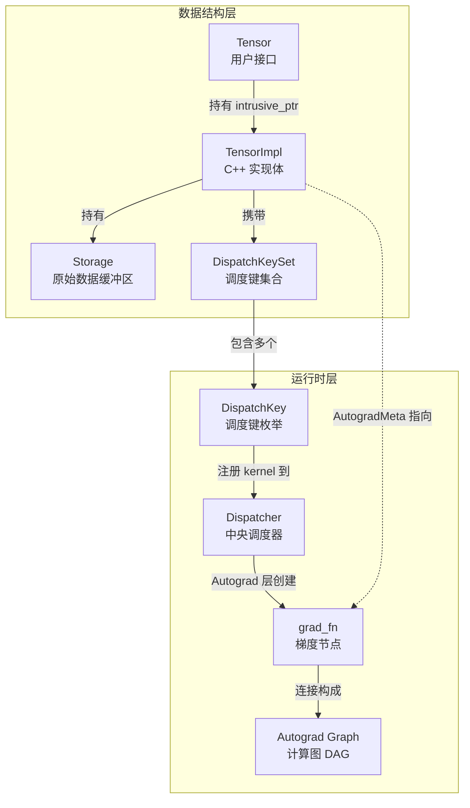
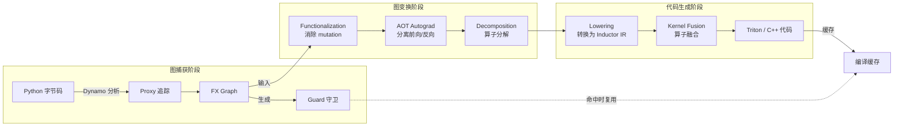
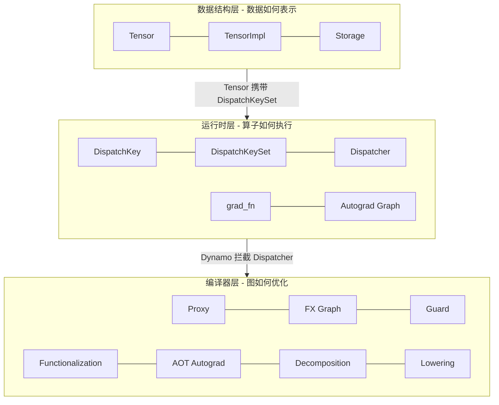

> 难度：入门 | 前置知识：基本的 PyTorch 使用经验

本文是 PyTorch 源码分析的"概念速查手册"。每个概念给出一句话定义、所属源码位置、核心作用以及与其他概念的关联。阅读完本文后，你将建立起对 PyTorch 内部术语的统一认知框架，为后续模块的深入分析做好准备。

---

## 概述

PyTorch 的内部概念可以按职责划分为三层：

| 层次 | 关注点 | 核心概念 |
|------|--------|----------|
| 数据结构层 | 数据如何表示与存储 | Tensor、Storage、TensorImpl |
| 运行时层 | 算子如何调度与求导 | DispatchKey、Dispatcher、Autograd Graph、grad_fn |
| 编译器层 | 图如何捕获、变换与生成代码 | FX Graph、Guard、Decomposition、Lowering、Proxy、AOT Autograd、Functionalization |

后续各节按此分层逐一展开。

---

## 数据结构层概念

### 1. Tensor - 多维数组

| 属性 | 说明 |
|------|------|
| 一句话 | 面向用户的多维数组对象，是 PyTorch 中一切计算的基本单元 |
| 所属文件 | Python 层 `torch/` ; C++ 层 `c10/core/TensorImpl.h`、`aten/src/ATen/core/Tensor.h` |
| 核心作用 | 封装数据、形状、步长、设备、数据类型等元信息，并作为算子的输入与输出 |
| 关联概念 | 内部持有 **TensorImpl** 指针；数据存放在 **Storage** 中；附带 **DispatchKeySet** 用于路由算子 |

Python 中 `torch.Tensor` 是一个轻量包装，真正的实现在 C++ 侧的 `TensorImpl`。多个 Tensor 可以共享同一份 Storage（如 `view` 操作），这是理解 PyTorch 内存模型的关键。

> 详见 [Module 1 - Tensor 与 Storage 系统](../module-01-tensor-storage/)

### 2. Storage - 原始数据缓冲区

| 属性 | 说明 |
|------|------|
| 一句话 | 一段连续的、类型无关的原始内存，是 Tensor 数据的实际载体 |
| 所属文件 | `c10/core/StorageImpl.h`、`c10/core/Allocator.h` |
| 核心作用 | 管理内存的分配与释放；同一 Storage 可被多个 Tensor 共享 |
| 关联概念 | 被 **TensorImpl** 持有；通过 `Allocator` 接口对接不同设备（CPU / CUDA）的内存分配器 |

Storage 与 Tensor 的分离设计使得 `view`、`reshape`、`slice` 等操作无需拷贝数据 -- 它们只是创建了一个指向同一 Storage 的新 TensorImpl，但拥有不同的 offset、size 和 stride。

> 详见 [Module 1 - Tensor 与 Storage 系统](../module-01-tensor-storage/)

### 3. TensorImpl - Tensor 的 C++ 实现

| 属性 | 说明 |
|------|------|
| 一句话 | 存储 Tensor 全部元信息（shape、stride、dtype、device、dispatch keys）的 C++ 对象 |
| 所属文件 | `c10/core/TensorImpl.h` |
| 核心作用 | 作为 Tensor 的唯一实体，被 Python `torch.Tensor` 通过 `intrusive_ptr` 引用计数管理 |
| 关联概念 | 内部持有 **Storage**；携带 **DispatchKeySet**；Autograd 相关信息存放在 `AutogradMetaInterface` 中，关联到 **grad_fn** |

TensorImpl 是一个可继承的类，`OpaqueTensorImpl`、`SparseTensorImpl` 等子类分别处理不同的 Tensor 表示。

> 详见 [Module 1 - Tensor 与 Storage 系统](../module-01-tensor-storage/)

---

## 运行时层概念

### 4. DispatchKey - 调度键

| 属性 | 说明 |
|------|------|
| 一句话 | 一个枚举值，标识算子实现的某种"功能层"（如 CPU 计算、CUDA 计算、Autograd 包装） |
| 所属文件 | `c10/core/DispatchKey.h` |
| 核心作用 | 每个 DispatchKey 对应一组 kernel 注册，**Dispatcher** 根据 Tensor 携带的 key 决定调用哪个 kernel |
| 关联概念 | 组成 **DispatchKeySet**；被 **Dispatcher** 消费；常见 key 包括 `CPU`、`CUDA`、`AutogradCPU`、`FuncTorchBatched`、`Python` 等 |

DispatchKey 的设计使得 PyTorch 可以通过"洋葱层"模式在同一个算子上叠加多种功能：最外层是 Autograd，中间可能经过 Functionalization，最内层才是真正的 CPU/CUDA kernel。

> 详见 [Module 5 - 算子分发系统](../module-05-dispatch/)

### 5. DispatchKeySet - 调度键集合

| 属性 | 说明 |
|------|------|
| 一句话 | 一个 64-bit 位集合（bitset），记录 Tensor 当前激活的所有 DispatchKey |
| 所属文件 | `c10/core/DispatchKeySet.h` |
| 核心作用 | Dispatcher 遍历集合中优先级最高的 key 来决定下一步调用哪个 kernel |
| 关联概念 | 存储在 **TensorImpl** 中；被 **Dispatcher** 读取；`exclude` 操作用于"剥洋葱"，避免重入 |

当一层 dispatch 处理完毕后，会将自己的 key 从集合中排除，再调用 `redispatch` 进入下一层。这个递归下降过程就是所谓的"dispatch 洋葱模型"。

> 详见 [Module 5 - 算子分发系统](../module-05-dispatch/)

### 6. Dispatcher - 中央调度器

| 属性 | 说明 |
|------|------|
| 一句话 | PyTorch 的全局算子路由中心，将每次算子调用分发到对应的 kernel 实现 |
| 所属文件 | `aten/src/ATen/core/dispatch/Dispatcher.h` |
| 核心作用 | 维护"算子 schema → dispatch key → kernel"的注册表；每次 op 调用时根据输入 Tensor 的 DispatchKeySet 选择 kernel |
| 关联概念 | 读取 **DispatchKeySet**；消费 **DispatchKey**；算子通过 `TORCH_LIBRARY` 宏注册到 Dispatcher |

Dispatcher 是 PyTorch 可扩展性的核心 -- 无论是后端扩展（XLA、MPS）、功能扩展（Autograd、Functionalization）还是编译器集成（Dynamo、FX Tracing），都通过向 Dispatcher 注册 kernel 来实现。

> 详见 [Module 5 - 算子分发系统](../module-05-dispatch/)

### 7. Autograd Graph - 自动微分计算图

| 属性 | 说明 |
|------|------|
| 一句话 | 一个有向无环图（DAG），记录前向计算的操作历史，用于反向传播求梯度 |
| 所属文件 | `torch/csrc/autograd/function.h`、`torch/csrc/autograd/engine.cpp` |
| 核心作用 | 每个需要梯度的算子执行时，都会在图中创建一个 **grad_fn** 节点，反向传播时 Engine 按拓扑序遍历该图 |
| 关联概念 | 由 **grad_fn** 节点构成；**AOT Autograd** 在编译期预先生成该图；Autograd Engine 在 `torch/csrc/autograd/engine.cpp` 中执行遍历 |

Autograd Graph 在 eager 模式下是动态构建的（define-by-run），每次前向计算都会生成新图。这也是 PyTorch 区别于静态图框架的核心特征。

> 详见 [Module 2 - Autograd 系统](../module-02-autograd/)

### 8. grad_fn - 梯度函数节点

| 属性 | 说明 |
|------|------|
| 一句话 | Autograd Graph 中的一个节点，记录了产生当前 Tensor 的操作及其反向传播逻辑 |
| 所属文件 | `torch/csrc/autograd/function.h`（基类 `Node`）、`torch/csrc/autograd/generated/` (自动生成的派生类) |
| 核心作用 | 存储前向操作的上下文（saved tensors），并定义 `apply()` 方法实现反向传播 |
| 关联概念 | 挂载在 **TensorImpl** 的 `AutogradMeta` 中；通过 `next_edges` 连接形成 **Autograd Graph**；由 Dispatcher 的 Autograd key 层自动创建 |

用户通过 `tensor.grad_fn` 即可访问该节点。`grad_fn` 为 `None` 表示该 Tensor 是叶节点（如模型参数），其梯度将累积到 `.grad` 属性中。

> 详见 [Module 2 - Autograd 系统](../module-02-autograd/)

---

## 编译器层概念

### 9. FX Graph - 函数式中间表示

| 属性 | 说明 |
|------|------|
| 一句话 | 基于 Python 的图中间表示（IR），以 `call_function`、`placeholder`、`output` 等节点描述计算 |
| 所属文件 | `torch/fx/graph.py`、`torch/fx/node.py`、`torch/fx/graph_module.py` |
| 核心作用 | 作为 TorchDynamo 捕获结果和 TorchInductor 输入的统一 IR，支持图变换（graph pass） |
| 关联概念 | 由 **Proxy** 追踪生成；被 **Decomposition** 和 **Lowering** 消费；封装为 `GraphModule` 后可直接执行 |

FX Graph 的节点（`torch.fx.Node`）记录了操作类型、目标函数和参数。它本质上是一个 SSA 形式的计算图，非常适合做编译优化。

> 详见 [Module 7 - FX 图系统](../module-07-fx/)

### 10. Guard - 运行时守卫

| 属性 | 说明 |
|------|------|
| 一句话 | 一组运行时条件检查，用于判断已编译代码是否仍然适用于当前输入 |
| 所属文件 | `torch/_dynamo/guards.py` |
| 核心作用 | Dynamo 编译图时记录假设（如 tensor shape、dtype、Python 变量值），后续调用时若 Guard 通过则复用编译结果，否则触发重编译 |
| 关联概念 | 由 **TorchDynamo** 生成；保护已编译的 **FX Graph** 不被错误复用 |

Guard 是 `torch.compile` 性能的关键 -- Guard 过宽会导致错误结果，过窄会导致频繁重编译。Dynamo 会为 shape、dtype、stride、Python 全局变量等生成不同类型的 Guard。

> 详见 [Module 6 - TorchDynamo](../module-06-dynamo/)

### 11. Decomposition - 算子分解

| 属性 | 说明 |
|------|------|
| 一句话 | 将复杂的高层算子拆解为更简单的原语算子的过程 |
| 所属文件 | `torch/_decomp/decompositions.py` |
| 核心作用 | 减少后端需要实现的算子数量 -- Inductor 只需支持约 250 个 "core ATen" 原语，而非全部 2000+ 个 ATen 算子 |
| 关联概念 | 在 **AOT Autograd** 流程中执行；产出的简化图交给 **Lowering** 处理；通常将 ATen 算子分解为 `prims` 或 `core aten` 算子 |

例如，`torch.addmm` 可以分解为 `torch.mm` + `torch.add`。分解表（decomposition table）是可注册的，不同后端可以选择性地覆盖。

> 详见 [Module 8 - TorchInductor](../module-08-inductor/)

### 12. Lowering - 图下降

| 属性 | 说明 |
|------|------|
| 一句话 | 将 FX Graph 中的 ATen 算子转换为 Inductor 内部 IR 节点的过程 |
| 所属文件 | `torch/_inductor/lowering.py` |
| 核心作用 | 建立 ATen 算子到 Inductor IR（如 `Pointwise`、`Reduction`、`TensorBox`）的映射，为后续调度和代码生成做准备 |
| 关联概念 | 消费 **Decomposition** 后的 **FX Graph**；产出 Inductor IR 交给 Scheduler 做 kernel fusion 和代码生成 |

Lowering 是编译管线中承上启下的环节：上游是平台无关的 FX 图变换，下游是特定后端的代码生成（Triton / C++）。

> 详见 [Module 8 - TorchInductor](../module-08-inductor/)

### 13. Functionalization - 函数化

| 属性 | 说明 |
|------|------|
| 一句话 | 将 in-place 操作和 view 操作转换为纯函数式（无副作用）操作的过程 |
| 所属文件 | `torch/_subclasses/functional_tensor.py`、`aten/src/ATen/FunctionalTensorWrapper.h` |
| 核心作用 | 编译器需要纯函数式语义才能安全地进行图变换和优化，Functionalization 消除了 mutation 和 aliasing |
| 关联概念 | 通过 Dispatcher 的 `Functionalize` **DispatchKey** 层实现；在 **AOT Autograd** 流程中使用；确保 **FX Graph** 不含 mutation |

例如 `x.add_(1)` 会被转换为 `x = x.add(1)`，同时更新所有引用到 `x` 的别名视图。

> 详见 [Module 8 - TorchInductor](../module-08-inductor/)

### 14. AOT Autograd - 提前自动微分

| 属性 | 说明 |
|------|------|
| 一句话 | 在编译期（ahead-of-time）同时 trace 出前向和反向计算图，使两者都能被 Inductor 优化 |
| 所属文件 | `torch/_functorch/aot_autograd.py` |
| 核心作用 | 将 Autograd 的动态图构建提前到编译期完成，让反向传播也能享受 kernel fusion 等编译优化 |
| 关联概念 | 在 **Functionalization** 之后执行；调用 **Decomposition** 简化算子；产出的前向/反向 **FX Graph** 分别交给 **Lowering** |

在 eager 模式下，反向图是运行时按需构建的，无法提前优化。AOT Autograd 解决了这个问题 -- 它利用 `make_fx` 追踪前向计算，同时记录反向图，最终产出两张可独立优化的 FX Graph。

> 详见 [Module 8 - TorchInductor](../module-08-inductor/)

### 15. Proxy - 符号追踪代理

| 属性 | 说明 |
|------|------|
| 一句话 | FX tracing 时用于替代真实 Tensor 的符号对象，记录操作而不执行实际计算 |
| 所属文件 | `torch/fx/proxy.py` |
| 核心作用 | 拦截 Python 运算符和函数调用，将其记录为 **FX Graph** 中的节点 |
| 关联概念 | 由 `Tracer` 创建；每个 Proxy 对应一个 **FX Graph** 的 `Node`；Dynamo 内部也使用类似机制（`VariableTracker`）进行追踪 |

当你调用 `torch.fx.symbolic_trace(model)` 时，模型的输入会被替换为 Proxy 对象。后续所有运算都在 Proxy 上进行，不会触发真实计算，但会在 FX Graph 中记录完整的操作序列。

> 详见 [Module 7 - FX 图系统](../module-07-fx/)

---

## 概念关系总览

### 数据结构与运行时关系

下图展示了数据结构层和运行时层的核心概念如何协作：

### torch.compile 编译管线

下图展示了当用户调用 `torch.compile(model)` 后，一次前向计算的完整编译流程：

### 概念分层速查表

---

## 延伸阅读

| 概念 | 深入模块 | 建议阅读顺序 |
|------|----------|--------------|
| Tensor / Storage / TensorImpl | [Module 1 - Tensor 与 Storage 系统](../module-01-tensor-storage/) | 初学者路线第 5 步 |
| DispatchKey / Dispatcher | [Module 5 - 算子分发系统](../module-05-dispatch/) | 初学者路线第 6 步 |
| Autograd Graph / grad_fn | [Module 2 - Autograd 系统](../module-02-autograd/) | 初学者路线第 4 步 |
| FX Graph / Proxy | [Module 7 - FX 图系统](../module-07-fx/) | 编译器路线第 1 步 |
| Guard | [Module 6 - TorchDynamo](../module-06-dynamo/) | 编译器路线第 2 步 |
| Decomposition / Lowering / AOT Autograd / Functionalization | [Module 8 - TorchInductor](../module-08-inductor/) | 编译器路线第 3 步 |

> **下一篇**：[03-architecture-overview.md](./03-architecture-overview.md) - PyTorch 三层架构全景图
