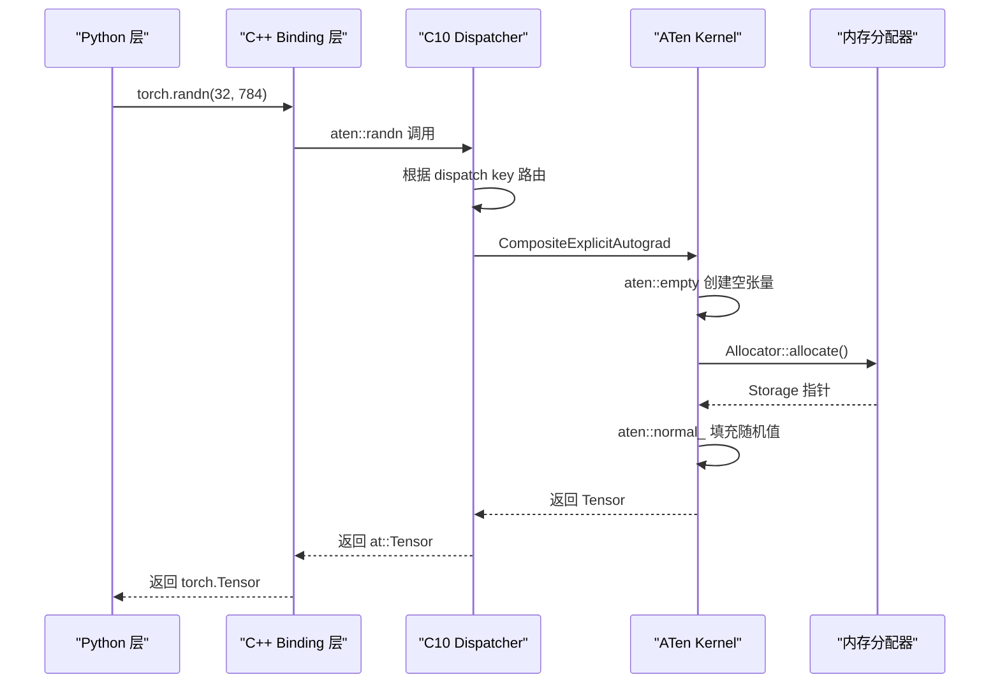
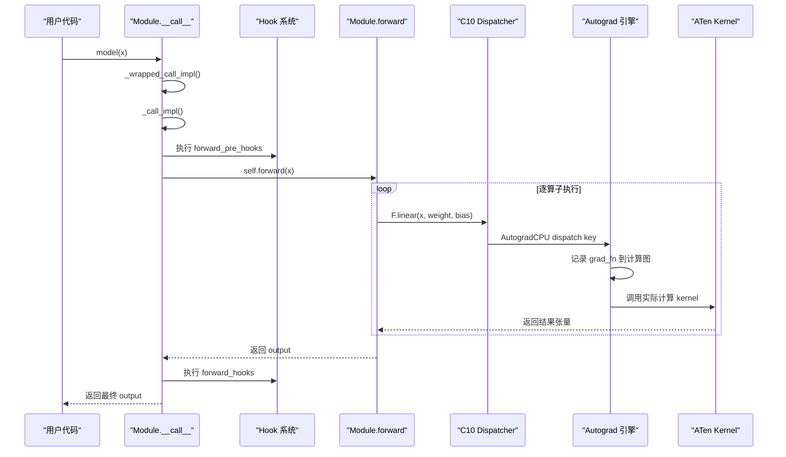
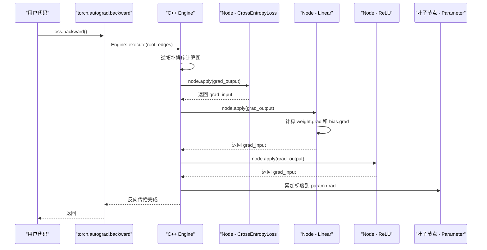
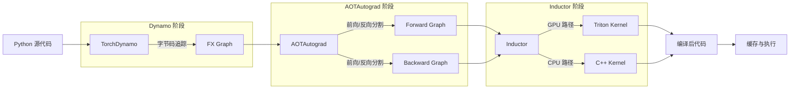
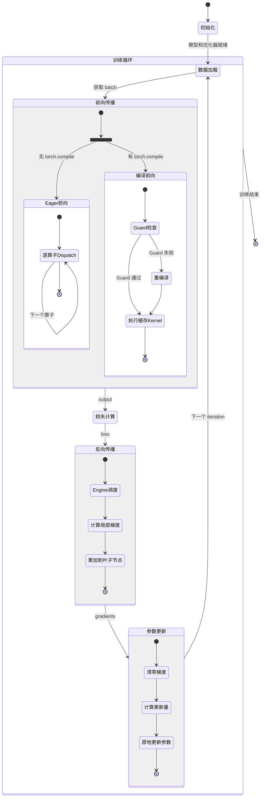

> 本文从一个标准训练循环出发，逐层拆解 PyTorch 在 **Eager Mode** 和 **torch.compile Mode** 下的端到端执行流程，帮助读者建立对整个框架运行时行为的全局认知。

---

## 1. Eager Mode 端到端执行流程

一个最简单的 PyTorch 训练循环通常包含四步：

```python
x = torch.randn(32, 784)           # 1. 创建张量
output = model(x)                   # 2. 前向传播
loss = criterion(output, target)
loss.backward()                     # 3. 反向传播
optimizer.step()                    # 4. 参数更新
```

这四步看似简单，实际上每一步都涉及从 Python 层到 C++ 层的深层调用链。我们逐一拆解。

### 1.1 张量创建 - `torch.randn()` 的完整路径

当调用 `torch.randn(32, 784)` 时，执行流程如下：

1. **Python 入口**：`torch.randn` 定义在 `torch/__init__.py` 中，实际是一个从 C++ 绑定层导出的函数。其类型签名可在 `torch/_C/_VariableFunctions.pyi` 中找到。

2. **C++ 绑定层**：通过 pybind11 桥接，调用进入 `torch/csrc/autograd/generated/python_torch_functions_*.cpp`（由 torchgen 自动生成）。

3. **Dispatcher 分发**：进入 C10 Dispatcher（`aten/src/ATen/core/dispatch/Dispatcher.h`），根据 dispatch key（CPU、CUDA、AutogradCPU 等）路由到具体 kernel。

4. **Kernel 执行**：`aten::randn` 的定义在 `aten/src/ATen/native/native_functions.yaml` 第 4925 行附近。其 dispatch 策略是 `CompositeExplicitAutograd`，意味着它由更基础的算子组合而成 —— 内部实际调用 `aten::empty` 分配内存，然后调用 `aten::normal_` 填充随机数。

5. **TensorImpl 分配**：`aten::empty` 最终创建一个 `c10::TensorImpl` 对象（`c10/core/TensorImpl.h`），其中包含 `Storage`（持有实际内存指针）、`dtype`、`device`、`strides` 等元信息。



### 1.2 前向传播 - `model(x)` 的调用链

当调用 `model(x)` 时，触发的是 `nn.Module.__call__`，定义在 `torch/nn/modules/module.py` 中：

1. **`__call__` 入口**：Python 的 `__call__` 被重载为 `_wrapped_call_impl`（约第 1775 行）。该方法会检查是否有 `_compiled_call_impl`（`torch.compile` 编译后的入口），如果没有则走 `_call_impl`。

2. **`_call_impl` 执行**（第 1783 行）：
   - 如果没有任何 hook（`_forward_hooks`, `_backward_hooks` 等），直接调用 `self.forward(*args, **kwargs)`，这是最快路径。
   - 如果存在 hook，按顺序执行：forward_pre_hook → forward → forward_hook → 注册 backward_hook。

3. **算子调度**：`forward()` 中的每个 PyTorch 操作（如 `F.linear`、`torch.relu`）都会独立经过 Dispatcher 分发到对应设备的 kernel。这就是 **Eager Mode** 的核心特征 —— **逐算子执行**，每个操作立即计算并返回结果。

4. **Autograd 记录**：在 Dispatcher 的 `Autograd*` dispatch key 层，每个需要求导的操作会记录一个 `autograd::Node`（也称 `Function`）到计算图中。每个 Node 保存了反向传播所需的 saved tensors 和 grad_fn。



### 1.3 反向传播 - `loss.backward()` 的执行过程

`loss.backward()` 触发自动微分引擎执行反向传播：

1. **Python 入口**：`torch.Tensor.backward()` 调用 `torch.autograd.backward()`（`torch/autograd/__init__.py` 第 253 行），最终调用 `_engine_run_backward`。

2. **C++ Engine 执行**：`torch::autograd::Engine`（`torch/csrc/autograd/engine.h` 第 130 行）是反向传播的核心调度器。`Engine::execute()` 方法执行以下操作：
   - 从 loss 的 `grad_fn` 开始，**逆拓扑序遍历**计算图。
   - 对每个 `Node`，调用其 `apply()` 方法计算局部梯度。
   - 将梯度沿边传播给输入节点。
   - 对于叶子节点（`requires_grad=True` 的参数），将梯度累加到 `.grad` 属性中。

3. **多线程执行**：Engine 使用线程池来并行执行独立的反向节点。每个设备（CPU/CUDA）有各自的工作线程。CUDA 设备上的操作通过 CUDA stream 异步执行。

4. **梯度累加**：对于叶子张量，梯度默认是**累加**而非替换的。这就是为什么需要在每次迭代前调用 `optimizer.zero_grad()`。



### 1.4 参数更新 - `optimizer.step()` 的流程

优化器的更新步骤相对直接：

1. **`zero_grad()`**：遍历所有管理的参数，将 `.grad` 清零（或设为 `None`，取决于 `set_to_none` 参数）。

2. **`step()`**：每个优化器（SGD、Adam 等）实现自己的 `step()` 方法（位于 `torch/optim/` 目录）。以 Adam 为例：
   - 读取每个参数的 `.grad`。
   - 更新 state 中的一阶矩估计（`exp_avg`）和二阶矩估计（`exp_avg_sq`）。
   - 根据 Adam 公式计算更新量并 **in-place** 修改参数值。
   - 多数优化器内部会根据设备类型调用融合 kernel（`torch/optim/_multi_tensor/` 或直接通过 `foreach` 算子）以提升性能。

---

## 2. torch.compile 执行流程

`torch.compile` 是 PyTorch 2.0 引入的编译模式，通过 **TorchDynamo + AOTAutograd + Inductor** 三级流水线将 Python 代码转换为优化后的机器码。

### 2.1 编译触发 - Dynamo 拦截帧执行

```python
model = torch.compile(model)  # 包装模型
output = model(x)              # 首次调用触发编译
```

当 `torch.compile(model)` 被调用时：

1. **包装阶段**：`torch._dynamo.eval_frame.optimize()`（`torch/_dynamo/eval_frame.py` 第 1463 行）返回一个 `OptimizeContext` 上下文管理器。它通过 `set_eval_frame()` 注册一个自定义的 **CPython 帧求值函数**（通过 C 扩展 `torch/_C/_dynamo/eval_frame` 实现）。

2. **帧拦截**：当 Python 执行到被编译的函数时，CPython 的帧求值机制被拦截。TorchDynamo 获得当前帧的字节码（bytecode），开始进行符号化追踪。

3. **符号执行**：`InstructionTranslator`（`torch/_dynamo/symbolic_convert.py`）逐条解释 Python 字节码，将 PyTorch 操作记录到一个 `OutputGraph`（`torch/_dynamo/output_graph.py`）中，生成 **FX Graph**。

4. **Graph Break**：当遇到无法符号化追踪的操作（如数据依赖的控制流、不支持的 Python 特性），Dynamo 会执行 **graph break** —— 将已收集的部分编译为一个子图，剩余部分回退到 Eager 模式执行。

### 2.2 AOTAutograd - 前向/反向图分离

FX Graph 生成后，进入 AOTAutograd 阶段（`torch/_functorch/aot_autograd.py`）：

1. **功能化（Functionalization）**：将所有 in-place 操作和 view 操作转化为 out-of-place 的函数式操作，消除 aliasing。

2. **联合追踪**：使用 `make_fx` 同时追踪前向计算和反向计算，生成一个联合图。

3. **前向/反向分割**：通过 `min-cut partitioning` 算法，将联合图分割为独立的 **前向图** 和 **反向图**。分割点的选择旨在最小化前向图需要保存（saved for backward）的中间张量数量。

4. **分别编译**：前向图和反向图各自作为独立的 FX Graph 被传递给下游后端（默认是 Inductor）。

### 2.3 Inductor 后端 - 代码生成

Inductor（`torch/_inductor/compile_fx.py`）是 `torch.compile` 的默认后端编译器：

1. **图降级**：将 ATen 级别的操作降级为更底层的原语（prims），便于融合优化。

2. **融合（Fusion）决策**：分析数据依赖关系，决定哪些操作可以融合到同一个 kernel 中执行。关键策略包括：
   - Pointwise 操作融合（element-wise 操作链合并为单个 kernel）。
   - Reduction 操作的内外循环优化。
   - 调度策略选择（`torch/_inductor/scheduler.py`）。

3. **代码生成**：
   - **GPU**：生成 Triton kernel 代码（`torch/_inductor/codegen/triton.py`），Triton 是一种 Python-like 的 GPU 编程语言，由编译器自动处理 tiling、内存合并等优化。
   - **CPU**：生成 C++/OpenMP kernel 代码（`torch/_inductor/codegen/cpp.py`），利用向量化指令（AVX2/AVX-512）和多线程并行。

4. **编译与缓存**：生成的代码被编译为可执行的 kernel，并缓存到磁盘（默认在 `~/.cache/torch_inductor/`）以加速后续运行。



### 2.4 Guard 机制 - 编译有效性守卫

编译后的代码不是在所有情况下都有效的。Dynamo 会为每段编译代码生成一组 **Guards**（守卫条件），例如：

- 输入张量的 `dtype`、`device`、`requires_grad` 是否与编译时一致。
- 输入张量的 `shape` 是否匹配（或满足 dynamic shape 约束）。
- 闭包中捕获的 Python 变量值是否发生变化。
- 全局配置状态是否改变。

每次调用编译后的函数时，Guard 会首先被检查。如果所有 Guard 通过，直接执行缓存的编译代码；如果任何 Guard 失败，触发 **重编译（recompilation）**，Dynamo 重新追踪并编译新的版本。

---

## 3. 训练循环状态机

整个训练过程可以用一个状态机来描述，涵盖 Eager 和 Compiled 两种模式的差异：



---

## 4. Eager vs Compiled - 关键差异对比

理解两种模式的差异对于源码阅读至关重要：

### 4.1 执行粒度

| 维度 | Eager Mode | Compiled Mode |
|------|-----------|---------------|
| **执行单元** | 单个算子 | 融合后的子图（多算子 kernel） |
| **调度频率** | 每个算子都经过 Dispatcher | 整个子图一次调度 |
| **Python 开销** | 每个算子都有 Python ↔ C++ 切换 | 仅在子图边界有 Python 交互 |
| **内存分配** | 每个算子独立分配中间结果 | 融合 kernel 内部复用寄存器/共享内存 |

### 4.2 Autograd 行为

| 维度 | Eager Mode | Compiled Mode |
|------|-----------|---------------|
| **计算图构建** | 运行时动态构建 | AOTAutograd 静态追踪 |
| **反向图** | 隐式存在于 grad_fn 链中 | 显式 FX Graph，可独立优化 |
| **中间值保存** | 由各 autograd::Node 决定 | min-cut 算法全局优化 |

### 4.3 性能特征

| 维度 | Eager Mode | Compiled Mode |
|------|-----------|---------------|
| **首次执行** | 无额外开销 | 编译开销（秒级） |
| **稳态性能** | 受限于算子调用开销 | 接近硬件峰值 |
| **内存效率** | 中间结果多次分配释放 | 融合减少内存分配 |
| **调试友好性** | 可逐行 pdb 调试 | 需要专用工具（TORCH_COMPILE_DEBUG） |

### 4.4 关键源码文件对照

下表将两种模式下的关键流程映射到具体源码文件：

| 流程阶段 | Eager Mode | Compiled Mode |
|---------|-----------|---------------|
| **入口** | `Module.__call__` | `torch._dynamo.eval_frame.optimize` |
| **图表示** | 无显式图 | `torch.fx.Graph` |
| **算子执行** | `aten/src/ATen/core/dispatch/Dispatcher.h` | `torch/_inductor/codegen/` |
| **反向传播** | `torch/csrc/autograd/engine.h` | AOTAutograd 生成的反向图 |
| **优化策略** | 算子级优化（cuBLAS、cuDNN） | 图级融合 + 算子级优化 |

---

## 5. 执行流程中的核心数据结构

在整个执行流程中，有几个核心数据结构贯穿始终：

### 5.1 Tensor 与 TensorImpl

`torch.Tensor` 是 Python 层面的张量对象，底层持有一个 `c10::TensorImpl` 指针（`c10/core/TensorImpl.h`）。`TensorImpl` 包含：

- **Storage**：实际数据的内存持有者，包含 `data_ptr`、`allocator`、`size` 信息。
- **sizes / strides**：维度信息和内存布局。
- **AutogradMeta**：自动微分元信息，包含 `grad_fn`（指向计算图中的 Node）和 `grad`（累积梯度）。

### 5.2 FX Graph

`torch.fx.Graph`（`torch/fx/graph.py`）是编译模式下的核心 IR（中间表示）：

- 由 `Node` 组成的有向无环图，每个 Node 表示一个操作。
- Node 类型包括：`placeholder`（输入）、`call_function`（函数调用）、`call_method`（方法调用）、`output`（输出）。
- FX Graph 在 Dynamo、AOTAutograd、Inductor 三个阶段之间传递和变换。

### 5.3 Autograd Graph

Eager 模式下的计算图由 `autograd::Node`（`torch/csrc/autograd/function.h`）构成：

- 每个 Node 实现 `apply()` 方法，计算局部雅可比 - 向量积。
- Node 之间通过 `Edge`（`next_functions`）连接，形成反向计算图。
- 叶子节点的 `grad_fn` 为 `AccumulateGrad`，负责将梯度累加到 `Tensor.grad`。

---

## 6. 总结

PyTorch 的执行流程可以简明概括为两条路径：

- **Eager 路径**：Python → C++ Binding → Dispatcher → Kernel，每个算子独立执行，动态构建 Autograd 图，灵活但有性能开销。

- **Compiled 路径**：Python → Dynamo 追踪 → FX Graph → AOTAutograd 分割 → Inductor 代码生成 → 优化 Kernel，以子图为单位执行，首次有编译开销但稳态性能更优。

理解这两条路径的差异和交互点，是深入 PyTorch 源码分析的基础。后续模块文档将分别深入每个子系统的实现细节。
