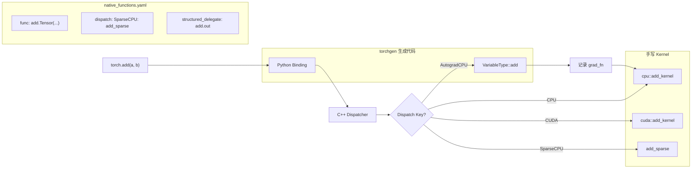
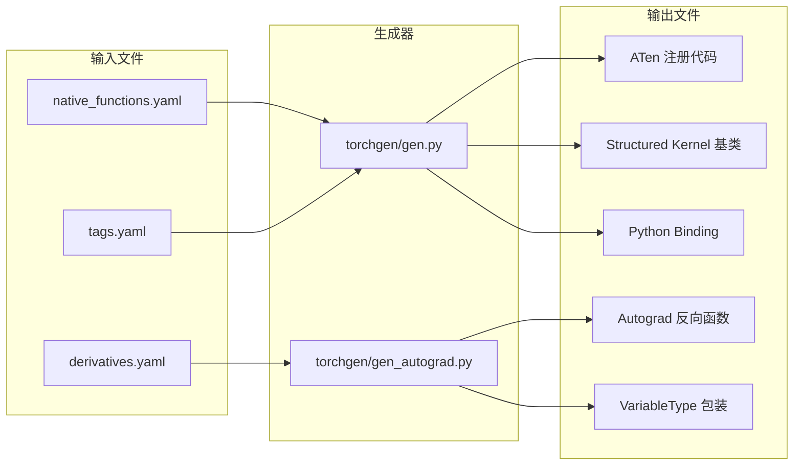

> 本文提供 PyTorch 源码阅读中最实用的导航技巧，包括如何追踪一个算子的完整实现路径、理解代码生成系统、掌握调试工具，以及识别代码库中的常见设计模式。

---

## 1. 如何追踪一个算子 - 以 `torch.add()` 为例

PyTorch 的算子从 Python API 到实际执行经过多层抽象。以 `torch.add(a, b)` 为例，完整的追踪路径如下：

### 1.1 Python 类型签名

第一站是类型签名文件 `torch/_C/_VariableFunctions.pyi`，这是一个自动生成的 `.pyi` 存根文件，包含所有从 C++ 导出到 Python 的函数签名。在其中可以找到：

```python
def add(input: Tensor, other: Tensor, *, alpha: Number = 1, out: Optional[Tensor] = None) -> Tensor: ...
```

这只是类型标注，实际调度逻辑在 C++ 层。

### 1.2 native_functions.yaml - 算子的唯一真相来源

**这是整个追踪过程中最关键的文件**。`aten/src/ATen/native/native_functions.yaml` 是 PyTorch 中所有原生算子的声明注册表。`add` 相关的定义在第 554 行附近：

```yaml
- func: add.Tensor(Tensor self, Tensor other, *, Scalar alpha=1) -> Tensor
  device_check: NoCheck
  structured_delegate: add.out
  variants: function, method
  dispatch:
    SparseCPU, SparseCUDA, SparseMPS, SparseMeta: add_sparse
```

关键字段解读：

| 字段 | 含义 |
|------|------|
| `func` | 算子的完整签名，包含重载名（`add.Tensor`） |
| `structured_delegate: add.out` | 表示该算子委托给 out= 变体实现 |
| `variants: function, method` | 同时注册为 `torch.add()` 和 `tensor.add()` |
| `dispatch` | 按 dispatch key 指定不同后端的 kernel 函数名 |

### 1.3 C++ Kernel 实现

对于 `add.out` 变体（第 577 行），声明了 `structured: True` 和 `ufunc_inner_loop`，这意味着它使用结构化 kernel 框架。对于密集张量（Dense），实际的计算核心是 TensorIterator 驱动的 element-wise 循环：

- **CPU 实现**：`aten/src/ATen/native/cpu/BinaryOpsKernel.cpp` 中注册了 `add_kernel`。
- **CUDA 实现**：`aten/src/ATen/native/cuda/BinaryMiscOpsKernels.cu` 或通过 ufunc 机制自动生成。
- **Sparse 实现**：由 `dispatch` 字段中的 `add_sparse` 指向 `aten/src/ATen/native/sparse/SparseTensor.cpp`。

### 1.4 生成的胶水代码

torchgen 会根据 `native_functions.yaml` 自动生成以下代码：

- `build/aten/src/ATen/Operators_*.cpp`：Dispatcher 注册代码。
- `build/aten/src/ATen/RegisterCPU.cpp` / `RegisterCUDA.cpp`：按设备的 kernel 注册。
- `torch/csrc/autograd/generated/VariableType_*.cpp`：Autograd 包装层（记录反向图）。
- `torch/csrc/autograd/generated/python_torch_functions_*.cpp`：Python 绑定。



---

## 2. 理解 torchgen 代码生成系统

PyTorch 大量使用代码生成来减少样板代码。理解 torchgen 是高效阅读源码的前提。

### 2.1 生成流水线



### 2.2 核心输入文件

| 文件 | 作用 |
|------|------|
| `aten/src/ATen/native/native_functions.yaml` | 所有原生算子的声明（签名、dispatch 规则、变体） |
| `tools/autograd/derivatives.yaml` | 每个算子的反向求导公式 |
| `aten/src/ATen/native/tags.yaml` | 算子标签（core、pointwise、reduction 等） |

### 2.3 核心生成器

| 文件 | 生成内容 |
|------|---------|
| `torchgen/gen.py` | ATen 层的算子注册、Structured Kernel 抽象基类 |
| `tools/autograd/gen_autograd.py` | `VariableType`（Autograd dispatch key）、`python_torch_functions` |
| `torchgen/gen_functionalization_type.py` | Functionalization dispatch key 的注册代码 |

### 2.4 实用提示

- **不要直接阅读生成代码**：生成代码在 `build/` 目录中，通常冗长且缺乏注释。应该先理解 YAML 声明和生成模板。
- **找到模板文件**：`torchgen/` 和 `tools/autograd/templates/` 目录中包含 Jinja 模板，理解模板比阅读生成结果更有效。
- **构建后查看**：如果确实需要查看生成代码，执行一次完整构建后在 `build/` 目录搜索。

---

## 3. 调试技巧

### 3.1 Dispatcher 追踪

设置环境变量查看每个算子的 dispatch 过程：

```bash
TORCH_SHOW_DISPATCH_TRACE=1 python your_script.py
```

输出会显示每个操作经过的 dispatch key 栈，例如：

```
[call] op=[aten::add.Tensor], dispatch_key=[AutogradCPU]
  [redispatch] op=[aten::add.Tensor], dispatch_key=[CPU]
```

相关实现在 `aten/src/ATen/core/dispatch/Dispatcher.cpp` 中。

### 3.2 Dynamo 编译调试

开启 Dynamo 的详细日志输出：

```python
import torch._dynamo
torch._dynamo.config.verbose = True

# 或者使用更精细的 logging 控制
import torch._logging
torch._logging.set_logs(
    dynamo=logging.DEBUG,       # Dynamo 追踪过程
    graph=True,                 # 输出 FX Graph
    guards=True,                # 输出 Guard 条件
    graph_breaks=True,          # 输出 graph break 原因
    recompiles=True,            # 输出重编译信息
)
```

`torch._logging.set_logs()` 定义在 `torch/_logging/__init__.py` 中，它基于 Python 标准库的 logging 模块，但增加了 PyTorch 特有的日志 artifact 类型。

### 3.3 Inductor 调试输出

启用 Inductor 的完整调试输出：

```bash
TORCH_COMPILE_DEBUG=1 python your_script.py
```

这会在当前目录生成一个 `torch_compile_debug/` 文件夹，包含：

| 文件 | 内容 |
|------|------|
| `fx_graph_readable.py` | 可读的 FX Graph 表示 |
| `fx_graph_runnable.py` | 可独立运行的 FX Graph |
| `output_code.py` | Inductor 生成的最终 Triton/C++ 代码 |
| `ir_pre_fusion.txt` | 融合优化前的 IR |
| `ir_post_fusion.txt` | 融合优化后的 IR |

相关逻辑在 `torch/_inductor/debug.py` 和 `torch/_inductor/config.py` 中。

### 3.4 Autograd 异常检测

```python
with torch.autograd.detect_anomaly():
    output = model(x)
    loss = criterion(output, target)
    loss.backward()
```

开启后，Autograd 引擎会在以下情况给出更详细的报错信息：
- 反向传播中产生 NaN 或 Inf。
- 前向计算的堆栈跟踪（用于定位问题算子）。

### 3.5 Structured Tracing

对于生产环境的问题诊断，可以使用 `trace_structured` 输出结构化日志：

```python
from torch._logging import trace_structured

trace_structured(
    "artifact",
    metadata_fn=lambda: {
        "name": "debug_info",
        "encoding": "string",
    },
    payload_fn=lambda: "调试信息内容",
)
```

配合 `tlparse` 工具可以从结构化日志中提取 artifact，适用于无法直接访问文件系统的远程作业环境。

---

## 4. 代码库中的常见模式

### 4.1 装饰器模式

PyTorch 大量使用装饰器来控制执行上下文：

```python
# 禁用梯度计算 - torch/autograd/grad_mode.py
@torch.no_grad()
def inference_function(x):
    return model(x)

# 编译装饰器 - torch/_dynamo/eval_frame.py
@torch.compile
def train_step(model, x, y):
    output = model(x)
    loss = F.cross_entropy(output, y)
    loss.backward()
    return loss

# 配置覆盖装饰器 - torch/_dynamo/config.py
@torch._dynamo.config.patch(suppress_errors=True)
def test_with_fallback():
    ...
```

这些装饰器底层通常通过上下文管理器（`__enter__` / `__exit__`）实现，在进入时修改全局状态，退出时恢复。

### 4.2 注册模式

PyTorch 使用注册模式将 kernel 与 dispatch key 关联：

**C++ 侧** - 使用宏注册：

```cpp
// aten/src/ATen/native/ 中的典型模式
TORCH_LIBRARY_IMPL(aten, CPU, m) {
    m.impl("add.Tensor", cpu::add_kernel);
}

// 或者在自定义库中
TORCH_LIBRARY(my_ops, m) {
    m.def("custom_op(Tensor x) -> Tensor");
}
TORCH_LIBRARY_IMPL(my_ops, CPU, m) {
    m.impl("custom_op", my_cpu_implementation);
}
```

**Python 侧** - 使用 `torch.library`：

```python
# torch/library.py - Python 层的算子注册 API
@torch.library.custom_op("mylib::custom_op", mutates_args=())
def custom_op(x: torch.Tensor) -> torch.Tensor:
    return x + 1

@custom_op.register_fake
def custom_op_fake(x: torch.Tensor) -> torch.Tensor:
    return torch.empty_like(x)
```

这种分层注册设计使得同一个算子可以为不同设备、不同 dispatch key 提供不同的实现。

### 4.3 Config 模式

PyTorch 子系统广泛使用配置对象来控制行为：

```python
# Dynamo 配置 - torch/_dynamo/config.py
torch._dynamo.config.cache_size_limit = 64  # 持久修改

# 临时修改 - 推荐方式
with torch._dynamo.config.patch(cache_size_limit=8):
    model = torch.compile(model)
    output = model(x)

# 作为测试装饰器
@torch._dynamo.config.patch(force_compile_during_fx_trace=True)
def test_feature(self):
    ...

# Inductor 配置 - torch/_inductor/config.py
torch._inductor.config.max_autotune = True   # 开启自动调优
torch._inductor.config.triton.cudagraphs = True  # 开启 CUDA Graphs
```

`config.patch` 是一个既可以作为上下文管理器、也可以作为装饰器使用的工具，它在退出时自动恢复原始配置，避免测试之间的状态污染。

### 4.4 分发模式 - Dispatcher Key 栈

理解 Dispatcher 的 key 栈顺序是理解 PyTorch 内部行为的关键。一个典型的 dispatch 过程：

```
AutogradCPU → FuncTorch → Functionalize → CPU
```

每一层 dispatch key 可以选择：
- **处理并返回**：该层完成全部工作。
- **处理后 redispatch**：做一些装饰工作（如 Autograd 记录 grad_fn），然后将实际计算转发给下一层。
- **直接 fallthrough**：该层无需处理，直接传递给下一层。

---

## 5. 高效阅读源码的实用建议

### 5.1 从 YAML 入手

阅读任何算子的实现，第一步永远是在 `native_functions.yaml` 中搜索。它能告诉你：
- 算子的精确签名。
- 它的 dispatch 策略（CompositeImplicitAutograd、CompositeExplicitAutograd、或显式指定 per-backend）。
- 是否使用 structured kernel。
- 支持哪些变体（function、method、inplace）。

### 5.2 善用 grep 追踪调用链

```bash
# 找到某个 kernel 函数的注册位置
grep -rn "add_kernel" aten/src/ATen/native/cpu/

# 找到自动生成的 Python 绑定
grep -rn "\"add.Tensor\"" torch/csrc/autograd/generated/

# 找到 derivatives.yaml 中的反向公式
grep -A5 "name: add.Tensor" tools/autograd/derivatives.yaml
```

### 5.3 阅读顺序建议

对于一个新接触的子系统，建议按以下顺序阅读：

1. **目录级 README**：大多数子目录包含 `README.md`，提供架构概述。
2. **YAML / Config 声明**：理解声明式定义比直接读实现更高效。
3. **入口函数**：找到用户调用的 Python API，向下追踪。
4. **核心数据结构**：理解 `TensorImpl`、`Node`、`Graph` 等核心类型。
5. **生成模板**：在 `torchgen/` 中阅读 Jinja 模板，理解生成逻辑。

### 5.4 利用类型标注

PyTorch 近年来在逐步添加类型标注。`.pyi` 存根文件（如 `torch/_C/_VariableFunctions.pyi`、`torch/_C/__init__.pyi`）是理解 C++ 导出 API 的快速参考。

---

## 6. 总结

PyTorch 源码阅读的核心挑战在于跨语言（Python/C++）、跨层次（API/Dispatch/Kernel）的复杂调用链。本文提供的导航路径可以概括为：

1. **从 `native_functions.yaml` 出发**找到算子声明。
2. **通过 dispatch 字段**定位具体设备的 kernel 实现。
3. **利用调试工具**（`TORCH_SHOW_DISPATCH_TRACE`、`TORCH_COMPILE_DEBUG`）验证运行时行为。
4. **识别代码模式**（装饰器、注册、Config）加速对新代码的理解。

掌握这些技巧后，即使面对 PyTorch 百万行级的代码库，也能快速定位到关注的实现细节。
