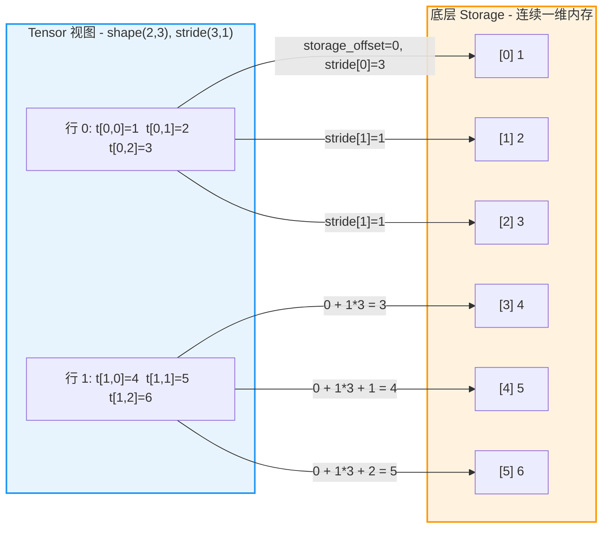
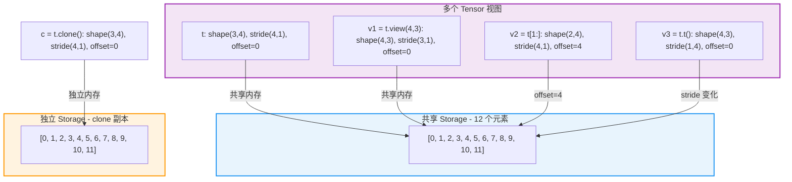

> 本文面向 PyTorch 初学者，从零开始介绍 Tensor 的核心概念、创建方式、关键属性以及内存布局原理。

---

## 1. 什么是 Tensor

Tensor（张量）是 PyTorch 中最基本的数据结构，本质上是一个**多维数组**。如果你熟悉 NumPy 的 `ndarray`，那么 Tensor 可以理解为它的 GPU 加速版本，同时还内置了自动微分（Autograd）能力。

从数学角度看：

| 维度 | 数学名称 | PyTorch 示例 |
|------|----------|-------------|
| 0维 | 标量（Scalar） | `torch.tensor(3.14)` |
| 1维 | 向量（Vector） | `torch.tensor([1, 2, 3])` |
| 2维 | 矩阵（Matrix） | `torch.tensor([[1, 2], [3, 4]])` |
| N维 | N阶张量（N-d Tensor） | `torch.randn(2, 3, 4, 5)` |

在深度学习中，Tensor 承载了模型的所有数据：输入数据、权重参数、梯度值、中间激活值等，都以 Tensor 形式存在。

---

## 2. Tensor 的创建方式

PyTorch 提供了多种创建 Tensor 的方法，下面介绍最常用的几种。

### 2.1 从数值直接创建

```python
import torch

# 从 Python 列表创建
a = torch.tensor([1, 2, 3])
print(a)          # tensor([1, 2, 3])
print(a.dtype)    # torch.int64

# 指定数据类型
b = torch.tensor([1.0, 2.0, 3.0], dtype=torch.float32)
print(b.dtype)    # torch.float32
```

### 2.2 使用工厂函数创建

```python
# 全零张量
zeros = torch.zeros(3, 4)          # shape: (3, 4)

# 全一张量
ones = torch.ones(2, 3, 4)         # shape: (2, 3, 4)

# 标准正态分布随机张量
randn = torch.randn(2, 3)          # shape: (2, 3)

# 均匀分布随机张量 [0, 1)
rand = torch.rand(5, 5)            # shape: (5, 5)

# 单位矩阵
eye = torch.eye(3)                 # shape: (3, 3)

# 等差序列
arange = torch.arange(0, 10, 2)    # tensor([0, 2, 4, 6, 8])
```

### 2.3 从 NumPy 转换

```python
import numpy as np

np_array = np.array([[1, 2], [3, 4]])

# 方式 1: torch.from_numpy()  -- 共享内存，零拷贝
t1 = torch.from_numpy(np_array)

# 方式 2: torch.tensor()  -- 复制数据，不共享内存
t2 = torch.tensor(np_array)

# 验证内存共享
np_array[0, 0] = 99
print(t1[0, 0])  # tensor(99)  -- t1 受影响
print(t2[0, 0])  # tensor(1)   -- t2 不受影响
```

### 2.4 在指定设备上创建

```python
# 直接在 GPU 上创建（如果可用）
if torch.cuda.is_available():
    gpu_tensor = torch.randn(3, 4, device='cuda:0')

# CPU -> GPU
cpu_tensor = torch.randn(3, 4)
gpu_tensor = cpu_tensor.to('cuda')

# GPU -> CPU
back_to_cpu = gpu_tensor.cpu()
```

---

## 3. Tensor 的关键属性

每个 Tensor 都携带以下关键属性：

```python
t = torch.randn(2, 3, 4, requires_grad=True)

print(t.shape)          # torch.Size([2, 3, 4])  -- 形状
print(t.size())         # torch.Size([2, 3, 4])  -- 等价于 shape
print(t.dtype)          # torch.float32           -- 数据类型
print(t.device)         # cpu                     -- 所在设备
print(t.layout)         # torch.strided           -- 内存布局
print(t.requires_grad)  # True                    -- 是否追踪梯度
print(t.ndim)           # 3                       -- 维度数量
print(t.numel())        # 24                      -- 元素总数 (2*3*4)
```

| 属性 | 说明 | 常见取值 |
|------|------|---------|
| `shape` / `size()` | 张量在每个维度上的大小 | `torch.Size([2, 3, 4])` |
| `dtype` | 数据类型 | `float32`, `float64`, `int64`, `bool` 等 |
| `device` | 张量存储的设备 | `cpu`, `cuda:0`, `mps` 等 |
| `layout` | 内存布局方式 | `torch.strided`（默认）, `torch.sparse_coo` |
| `requires_grad` | 是否需要计算梯度 | `True` / `False` |

---

## 4. 内存布局核心概念

理解 Tensor 的内存布局是深入 PyTorch 源码的基础。三个关键概念是 **Storage**、**Stride** 和 **Storage Offset**。

### 4.1 Storage - 底层存储

每个 Tensor 的数据都保存在一块连续的一维内存区域中，称为 **Storage**。Tensor 本身只是这块内存上的一个"视图"（View），通过 `shape`、`stride`、`storage_offset` 三个元数据来描述如何将一维内存解释为多维数组。

```python
t = torch.tensor([[1, 2, 3],
                   [4, 5, 6]])

# 查看底层存储
print(t.storage())          # [1, 2, 3, 4, 5, 6]
print(t.storage().size())   # 6
print(t.data_ptr())         # 内存地址（整数）
```

### 4.2 Stride - 步幅

**Stride** 定义了在每个维度上前进一个元素所需要在底层存储中跳过的元素个数。

```python
t = torch.tensor([[1, 2, 3],
                   [4, 5, 6]])  # shape: (2, 3)

print(t.stride())  # (3, 1)
# stride[0] = 3: 沿第0维（行方向）移动一步，需要跳过 3 个元素
# stride[1] = 1: 沿第1维（列方向）移动一步，需要跳过 1 个元素
```

对于一个 `shape = (2, 3)` 的张量，访问元素 `t[i, j]` 对应的内存位置是：

```
内存位置 = storage_offset + i * stride[0] + j * stride[1]
         = 0 + i * 3 + j * 1
```

例如 `t[1, 2]` = `storage[0 + 1*3 + 2*1]` = `storage[5]` = `6`。

### 4.3 Contiguous - 连续存储

当 Tensor 的元素在内存中按照**行优先（Row-major）**顺序存储时，称之为 **contiguous**（连续的）。默认创建的张量都是 contiguous 的。

行优先意味着最后一个维度的元素在内存中是相邻的。对于一个 contiguous 的张量，stride 满足：

```
stride[i] = stride[i+1] * size[i+1]  （最后一维 stride = 1）
```

```python
t = torch.tensor([[1, 2, 3],
                   [4, 5, 6]])

print(t.is_contiguous())  # True
print(t.stride())         # (3, 1)  -- 满足连续性条件: 3 == 1 * 3

# 转置后不再连续
t_T = t.t()
print(t_T.stride())          # (1, 3)  -- 不满足连续性
print(t_T.is_contiguous())   # False

# 调用 contiguous() 强制生成连续副本
t_T_contig = t_T.contiguous()
print(t_T_contig.is_contiguous())  # True
print(t_T_contig.stride())        # (2, 1)  -- 新的连续 stride
```

### 4.4 Storage Offset - 存储偏移

**Storage Offset** 表示 Tensor 的第一个元素相对于底层 Storage 起始位置的偏移量。当我们对 Tensor 做切片操作时，新的 Tensor 会共享同一块 Storage，但拥有不同的 `storage_offset`。

```python
t = torch.tensor([10, 20, 30, 40, 50])

# 切片创建视图
s = t[2:]  # tensor([30, 40, 50])

print(s.storage_offset())  # 2  -- 从 storage 的第2个位置开始
print(t.data_ptr() == s.storage().data_ptr())  # True -- 共享同一块内存
```

---

## 5. Tensor 内存布局图

下面的图展示了一个 `shape=(2, 3)` 的二维 Tensor 如何映射到一维的底层 Storage 上：



> 地址计算公式: `address(t[i][j]) = storage_offset + i * stride[0] + j * stride[1]`

---

## 6. View 与 Copy

PyTorch 中很多操作会返回原始 Tensor 的 **View**（视图），而不是创建数据的副本。View 与原始 Tensor 共享同一块底层 Storage，只是 shape、stride、storage_offset 不同。

### 6.1 创建 View 的操作

以下操作返回视图（不复制数据）：

```python
t = torch.arange(12).reshape(3, 4)

# reshape / view -- 改变形状
v1 = t.view(4, 3)
v2 = t.reshape(2, 6)

# transpose / permute -- 转置
v3 = t.t()
v4 = t.permute(1, 0)

# 切片 / 索引
v5 = t[0:2]       # 前两行
v6 = t[:, 1]      # 第1列

# expand -- 广播扩展
v7 = t[0].expand(3, 4)

# 所有 view 共享底层存储
print(v1.data_ptr() == t.data_ptr())  # True
```

### 6.2 创建 Copy 的操作

以下操作会复制数据到新的 Storage：

```python
t = torch.arange(12).reshape(3, 4)

# clone() -- 显式复制
c1 = t.clone()

# contiguous() -- 对非连续张量生成连续副本
t_T = t.t()
c2 = t_T.contiguous()

# 高级索引 (fancy indexing)
c3 = t[[0, 2]]  # 用列表索引

# 运算结果
c4 = t + 1
c5 = t * 2

print(c1.data_ptr() == t.data_ptr())  # False -- 不同的内存
```

### 6.3 View 共享关系图

下面的图展示了多个 Tensor 视图如何共享同一块底层 Storage：



---

## 7. 实战 - Stride 与 Contiguous 深入理解

通过以下完整示例来加深理解：

```python
import torch

# 创建一个 2x3 的张量
t = torch.tensor([[1, 2, 3],
                   [4, 5, 6]])

print("=== 原始张量 ===")
print(f"shape: {t.shape}")                    # torch.Size([2, 3])
print(f"stride: {t.stride()}")                # (3, 1)
print(f"storage_offset: {t.storage_offset()}") # 0
print(f"is_contiguous: {t.is_contiguous()}")  # True

# 转置操作 - 不复制数据，只改变 stride
t_T = t.t()
print("\n=== 转置后 ===")
print(f"shape: {t_T.shape}")                    # torch.Size([3, 2])
print(f"stride: {t_T.stride()}")                # (1, 3)
print(f"storage_offset: {t_T.storage_offset()}") # 0
print(f"is_contiguous: {t_T.is_contiguous()}")  # False
# 底层存储依然是 [1, 2, 3, 4, 5, 6]
# t_T[0, 0] = storage[0*1 + 0*3] = storage[0] = 1
# t_T[1, 0] = storage[1*1 + 0*3] = storage[1] = 2
# t_T[0, 1] = storage[0*1 + 1*3] = storage[3] = 4

# 切片操作 - 改变 offset 和 shape
s = t[1:]  # 第二行
print("\n=== 切片后 ===")
print(f"shape: {s.shape}")                    # torch.Size([1, 3])
print(f"stride: {s.stride()}")                # (3, 1)
print(f"storage_offset: {s.storage_offset()}") # 3
print(f"is_contiguous: {s.is_contiguous()}")  # True
# s[0, 0] = storage[3 + 0*3 + 0*1] = storage[3] = 4

# 验证修改会互相影响（因为共享 Storage）
t[1, 0] = 99
print(f"\n修改 t[1,0]=99 后, s[0,0] = {s[0, 0]}")  # tensor(99)
```

---

## 8. 小结

| 概念 | 含义 | 关键要点 |
|------|------|---------|
| Tensor | 多维数组 | PyTorch 最基础的数据结构 |
| Storage | 底层一维连续内存 | 多个 Tensor 可以共享同一个 Storage |
| Shape | 各维度大小 | 定义 Tensor 的"外形" |
| Stride | 各维度步幅 | 决定如何将多维索引映射到一维内存 |
| Storage Offset | 存储偏移量 | Tensor 第一个元素在 Storage 中的位置 |
| Contiguous | 连续存储 | 行优先排列，stride 满足递减关系 |
| View | 视图 | 共享 Storage，不同的 shape/stride/offset |
| Copy | 副本 | 独立的 Storage，数据互不影响 |

理解了这些基础概念之后，你就具备了阅读 PyTorch C++ 源码（TensorImpl、StorageImpl 等）的前置知识。在下一篇文章中，我们将深入 `TensorImpl` 的 C++ 实现，看看这些概念在底层是如何表达的。

---

> **下一篇**: [TensorImpl 深度解析 - Tensor 的 C++ 实现](./01-tensorimpl-deep-dive.md)
