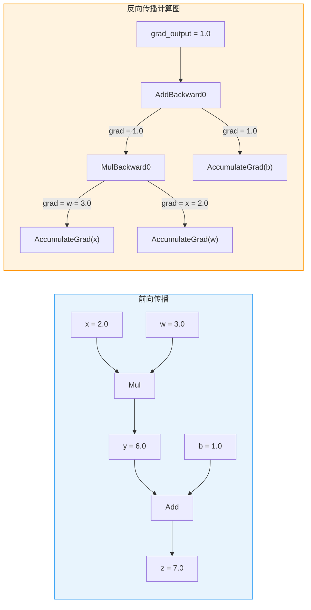
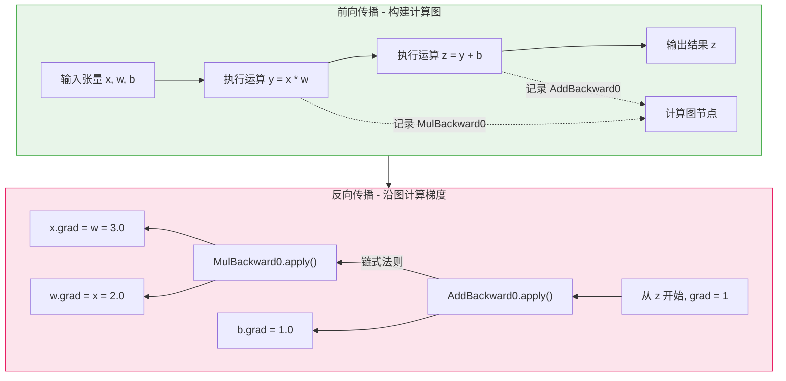

## 1. 什么是 Autograd

Autograd 是 PyTorch 的**自动微分引擎**，它能够自动计算神经网络中所有可学习参数的梯度。在深度学习训练过程中，梯度计算是反向传播算法的核心步骤，而 Autograd 将这一过程完全自动化，开发者只需定义前向计算逻辑，PyTorch 就能自动推导出对应的梯度计算过程。

从数学角度看，Autograd 实现的是**反向模式自动微分** (Reverse-mode Automatic Differentiation)。与符号微分（对数学表达式做符号化求导）和数值微分（用有限差分近似导数）不同，自动微分通过分解复杂函数为基本操作的组合，然后利用链式法则逐步计算梯度，既精确又高效。

对于一个标量损失函数 $L$ 和参数 $\theta$，Autograd 能够高效地计算出 $\frac{\partial L}{\partial \theta}$，使得梯度下降优化成为可能。

## 2. 核心概念

### 2.1 requires_grad - 梯度追踪开关

`requires_grad` 是张量上的一个布尔属性，决定了 Autograd 是否需要追踪该张量上的操作，以便后续计算梯度。

```python
import torch

# 默认情况下，用户创建的张量不追踪梯度
x = torch.tensor([1.0, 2.0, 3.0])
print(x.requires_grad)  # False

# 显式开启梯度追踪
w = torch.tensor([0.5, 0.5, 0.5], requires_grad=True)
print(w.requires_grad)  # True

# 也可以在创建后修改（仅限浮点类型）
x.requires_grad_(True)
```

只要一个运算的任意输入张量的 `requires_grad=True`，那么该运算的输出张量也会自动设置 `requires_grad=True`。这种传播机制确保了梯度信息能够沿着计算链自动流动。

### 2.2 叶子张量与非叶子张量

Autograd 中有两类重要的张量角色：

- **叶子张量 (Leaf Tensor)**：由用户直接创建、不是任何运算结果的张量。通常是模型的可学习参数（如权重和偏置）。叶子张量的 `is_leaf` 属性为 `True`，其 `grad_fn` 为 `None`。
- **非叶子张量 (Non-leaf Tensor)**：由运算产生的中间结果张量。它们的 `is_leaf` 为 `False`，并且拥有一个 `grad_fn` 属性指向创建它们的反向函数节点。

```python
w = torch.tensor([1.0, 2.0], requires_grad=True)  # 叶子张量
b = torch.tensor([0.1], requires_grad=True)         # 叶子张量

y = w.sum() + b  # 非叶子张量
print(w.is_leaf)    # True
print(y.is_leaf)    # False
print(y.grad_fn)    # <AddBackward0 object at 0x...>
```

**默认情况下，只有叶子张量的 `.grad` 属性会在 `backward()` 调用后被填充。** 如果需要保留非叶子张量的梯度，必须显式调用 `tensor.retain_grad()`。

### 2.3 计算图 - 动态构建

PyTorch 采用**动态计算图** (Define-by-Run) 策略：计算图在每次前向传播时动态构建，在反向传播后（默认）被释放。这与 TensorFlow 1.x 的静态图模式截然不同，为调试和动态控制流提供了极大的灵活性。

每次对 `requires_grad=True` 的张量执行运算时，PyTorch 都会：

1. 创建一个新的 `Node`（反向函数节点），如 `MulBackward0`、`AddBackward0` 等
2. 将该节点设为输出张量的 `grad_fn`
3. 通过 `Edge` 连接到输入张量的 `grad_fn`（或 `AccumulateGrad` 节点）
4. 保存反向计算所需的中间变量

## 3. 计算图可视化

下面通过一个简单的线性运算 `z = x * w + b` 来理解计算图的结构。

```python
x = torch.tensor(2.0, requires_grad=True)
w = torch.tensor(3.0, requires_grad=True)
b = torch.tensor(1.0, requires_grad=True)

y = x * w       # y = 6.0
z = y + b       # z = 7.0
```



### 前向与反向传播对比



## 4. 反向传播基本用法

### 4.1 标量反向传播

当损失值为标量（单个数字）时，直接调用 `.backward()` 即可：

```python
x = torch.tensor(2.0, requires_grad=True)
w = torch.tensor(3.0, requires_grad=True)
b = torch.tensor(1.0, requires_grad=True)

z = x * w + b
z.backward()

print(x.grad)  # tensor(3.)  即 dz/dx = w = 3.0
print(w.grad)  # tensor(2.)  即 dz/dw = x = 2.0
print(b.grad)  # tensor(1.)  即 dz/db = 1.0
```

### 4.2 非标量反向传播

当输出不是标量时，必须提供 `gradient` 参数（也称为 `grad_output`），它的形状必须与输出张量相同：

```python
x = torch.tensor([1.0, 2.0, 3.0], requires_grad=True)
y = x ** 2  # y = [1, 4, 9]

# 提供与 y 同形状的 grad_output
grad_output = torch.tensor([1.0, 1.0, 1.0])
y.backward(gradient=grad_output)

print(x.grad)  # tensor([2., 4., 6.])  即 dy/dx = 2x
```

`grad_output` 的含义是：假设存在一个下游标量损失 $L$，`grad_output` 就是 $\frac{\partial L}{\partial y}$。通过链式法则，最终计算得到的是 $\frac{\partial L}{\partial x} = \frac{\partial L}{\partial y} \cdot \frac{\partial y}{\partial x}$。

### 4.3 torch.autograd.grad() 函数式接口

`torch.autograd.grad()` 提供了更灵活的梯度计算方式，它不会将梯度累加到 `.grad` 属性，而是直接返回梯度张量：

```python
x = torch.tensor(2.0, requires_grad=True)
y = x ** 3

# 返回 dy/dx，而不是累加到 x.grad
grad_x, = torch.autograd.grad(outputs=y, inputs=x)
print(grad_x)    # tensor(12.)  即 3 * x^2 = 12
print(x.grad)    # None（grad() 不修改 .grad 属性）
```

**`tensor.backward()` 与 `torch.autograd.grad()` 的关键区别：**

| 特性 | `tensor.backward()` | `torch.autograd.grad()` |
|------|---------------------|------------------------|
| 梯度存储 | 累加到叶子张量的 `.grad` | 直接返回梯度元组 |
| 适用场景 | 常规训练循环 | 高阶梯度、元学习、自定义优化 |
| 是否修改张量 | 是（修改 `.grad`） | 否 |
| 返回值 | `None` | 梯度张量元组 |

## 5. 进阶选项

### 5.1 retain_graph - 保留计算图

默认情况下，`.backward()` 执行完后会释放计算图以节省内存。如果需要对同一个计算图进行多次反向传播，需要设置 `retain_graph=True`：

```python
x = torch.tensor(2.0, requires_grad=True)
y = x ** 2

# 第一次反向传播，保留图
y.backward(retain_graph=True)
print(x.grad)  # tensor(4.)

# 如果不 retain_graph，第二次调用会报错
# 注意：梯度是累加的，需要手动清零
x.grad.zero_()
y.backward()
print(x.grad)  # tensor(4.)
```

**注意**：梯度默认是**累加**的。在多次 `backward()` 之间，必须手动调用 `tensor.grad.zero_()` 或优化器的 `optimizer.zero_grad()` 来清零梯度。

### 5.2 create_graph - 创建高阶梯度图

设置 `create_graph=True` 会为梯度计算本身也构建计算图，从而支持高阶导数的计算：

```python
x = torch.tensor(2.0, requires_grad=True)
y = x ** 3  # y = 8

# 计算一阶导数，并保留梯度的计算图
dy_dx, = torch.autograd.grad(y, x, create_graph=True)
print(dy_dx)  # tensor(12.)  即 3x^2

# 计算二阶导数
d2y_dx2, = torch.autograd.grad(dy_dx, x)
print(d2y_dx2)  # tensor(12.)  即 6x = 12
```

`create_graph=True` 在以下场景中常用：

- **高阶优化**：如 L-BFGS 等需要 Hessian 信息的优化器
- **元学习**：如 MAML 算法中需要对梯度再求梯度
- **正则化**：如梯度惩罚（Gradient Penalty）

## 6. 梯度累加与清零

理解梯度累加机制对正确使用 Autograd 至关重要：

```python
x = torch.tensor(3.0, requires_grad=True)

# 第一次前向 + 反向
y1 = x * 2
y1.backward()
print(x.grad)  # tensor(2.)

# 第二次前向 + 反向（梯度累加！）
y2 = x * 3
y2.backward()
print(x.grad)  # tensor(5.)  = 2 + 3，而不是 3

# 正确做法：在每次迭代前清零梯度
x.grad.zero_()
y3 = x * 4
y3.backward()
print(x.grad)  # tensor(4.)
```

梯度累加的设计是有意为之的。在某些场景中（如梯度累加以模拟更大 batch size），这一特性非常有用。但在标准训练循环中，务必在每个迭代开始时清零梯度。

## 7. 禁用梯度追踪

在推理（inference）或不需要梯度的计算中，可以通过以下方式禁用梯度追踪以节省内存和加速计算：

```python
# 方式一：上下文管理器
with torch.no_grad():
    y = x * 2  # 不会构建计算图

# 方式二：装饰器
@torch.no_grad()
def inference(model, data):
    return model(data)

# 方式三：detach() 创建不追踪梯度的副本
y = x.detach()  # y 与 x 共享数据，但不追踪梯度
```

## 8. 小结

| 概念 | 说明 |
|------|------|
| `requires_grad` | 控制是否追踪张量上的运算 |
| `grad_fn` | 指向创建该张量的反向函数节点 |
| `backward()` | 执行反向传播，将梯度累加到叶子张量的 `.grad` |
| `torch.autograd.grad()` | 函数式接口，直接返回梯度 |
| `retain_graph` | 保留计算图以支持多次反向传播 |
| `create_graph` | 构建梯度图以支持高阶微分 |
| 叶子张量 | 用户创建、`is_leaf=True`、梯度存储在 `.grad` |
| 非叶子张量 | 运算产生、有 `grad_fn`、默认不保留梯度 |

Autograd 是 PyTorch 深度学习框架的基石。理解这些基础概念后，可以继续深入学习计算图的内部结构（Node、Edge）、引擎执行机制以及自定义 autograd.Function 等进阶主题。
