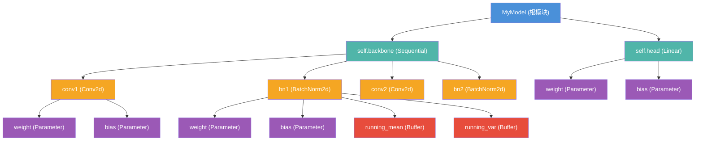

## 1. 什么是 nn.Module

`torch.nn.Module` 是 PyTorch 中所有神经网络模块的基类。无论是简单的全连接层，还是包含数十亿参数的大语言模型，它们的基石都是 `nn.Module`。理解 `nn.Module` 的使用方法，是掌握 PyTorch 的第一步。

`nn.Module` 提供了以下核心能力：

- **参数管理**：自动追踪模型中所有可学习参数（`Parameter`）
- **子模块组织**：以树形结构组织复杂的网络架构
- **设备迁移**：一键将模型迁移到 GPU 或其他设备
- **模式切换**：在训练模式与推理模式之间切换
- **序列化**：保存和加载模型状态

## 2. 自定义 Module

### 2.1 最简单的自定义模块

自定义模块只需继承 `nn.Module` 并实现 `forward()` 方法：

```python
import torch
import torch.nn as nn
import torch.nn.functional as F

class SimpleNet(nn.Module):
    def __init__(self, in_features, hidden_features, out_features):
        super().__init__()  # 必须调用父类的 __init__
        self.fc1 = nn.Linear(in_features, hidden_features)
        self.fc2 = nn.Linear(hidden_features, out_features)

    def forward(self, x):
        x = F.relu(self.fc1(x))
        x = self.fc2(x)
        return x

# 使用
model = SimpleNet(784, 256, 10)
x = torch.randn(32, 784)  # batch_size=32
output = model(x)          # 自动调用 forward()
print(output.shape)        # torch.Size([32, 10])
```

关键规则：

1. **必须调用 `super().__init__()`**：这会初始化内部状态字典（`_parameters`、`_modules`、`_buffers` 等）
2. **在 `__init__` 中定义子模块和参数**：赋值给 `self` 的属性会被自动注册
3. **在 `forward()` 中定义前向传播逻辑**：调用 `model(x)` 时实际执行的是 `forward(x)`

### 2.2 forward() 方法

`forward()` 是模型的核心计算逻辑。**不要直接调用 `model.forward(x)`**，而应通过 `model(x)` 调用。原因在于 `model(x)` 会触发 `__call__()` 方法，其中包含了 Hook 机制的执行、JIT 追踪等重要逻辑。

```python
# 正确用法
output = model(x)

# 不推荐（会跳过 Hook 等机制）
output = model.forward(x)
```

### 2.3 带有 Buffer 的模块

有时模型需要维护一些不参与梯度计算的状态，例如 BatchNorm 中的运行均值。这类状态通过 `register_buffer()` 注册：

```python
class RunningMeanModule(nn.Module):
    def __init__(self, num_features):
        super().__init__()
        self.register_buffer('running_mean', torch.zeros(num_features))
        self.register_buffer('count', torch.tensor(0, dtype=torch.long))

    def forward(self, x):
        if self.training:
            mean = x.mean(dim=0)
            self.count += 1
            self.running_mean = (
                self.running_mean * (self.count - 1) + mean
            ) / self.count
        return x - self.running_mean
```

Buffer 与 Parameter 的区别：

| 特性 | Parameter | Buffer |
|------|-----------|--------|
| `requires_grad` | 默认 `True` | 默认 `False` |
| 出现在 `parameters()` 中 | 是 | 否 |
| 出现在 `state_dict()` 中 | 是 | 是（persistent=True 时） |
| `model.to(device)` 迁移 | 是 | 是 |

## 3. 模型组合方式

PyTorch 提供了三种容器模块来组合子模块：`Sequential`、`ModuleList` 和 `ModuleDict`。

### 3.1 nn.Sequential

`Sequential` 按照模块添加的顺序依次执行前向传播，适用于层与层之间串行连接的简单网络：

```python
model = nn.Sequential(
    nn.Linear(784, 256),
    nn.ReLU(),
    nn.Dropout(0.2),
    nn.Linear(256, 128),
    nn.ReLU(),
    nn.Linear(128, 10),
)

# 等价于依次调用每个子模块
output = model(x)
```

也可以使用 `OrderedDict` 为每一层命名：

```python
from collections import OrderedDict

model = nn.Sequential(OrderedDict([
    ('flatten', nn.Flatten()),
    ('fc1', nn.Linear(784, 256)),
    ('relu1', nn.ReLU()),
    ('fc2', nn.Linear(256, 10)),
]))

# 通过名称访问子模块
print(model.fc1)  # Linear(in_features=784, out_features=256, bias=True)
```

### 3.2 nn.ModuleList

`ModuleList` 以列表形式存储子模块，适用于需要动态索引或循环调用模块的场景。**它不实现 `forward()` 方法**，需要在自定义的 `forward()` 中手动调用各模块：

```python
class ResidualStack(nn.Module):
    def __init__(self, num_layers, hidden_dim):
        super().__init__()
        self.layers = nn.ModuleList([
            nn.Linear(hidden_dim, hidden_dim)
            for _ in range(num_layers)
        ])
        self.norms = nn.ModuleList([
            nn.LayerNorm(hidden_dim)
            for _ in range(num_layers)
        ])

    def forward(self, x):
        for layer, norm in zip(self.layers, self.norms):
            x = x + F.relu(norm(layer(x)))  # 残差连接
        return x
```

> **注意**：使用普通 Python `list` 存储子模块不会被自动注册，导致参数不会出现在 `model.parameters()` 中，也不会随 `model.to(device)` 迁移。必须使用 `nn.ModuleList`。

### 3.3 nn.ModuleDict

`ModuleDict` 以字典形式存储子模块，适用于需要按名称动态选择模块的场景：

```python
class MultiTaskModel(nn.Module):
    def __init__(self, input_dim, task_dims):
        super().__init__()
        self.shared = nn.Linear(input_dim, 128)
        self.heads = nn.ModuleDict({
            task_name: nn.Linear(128, dim)
            for task_name, dim in task_dims.items()
        })

    def forward(self, x, task_name):
        shared_feat = F.relu(self.shared(x))
        return self.heads[task_name](shared_feat)

model = MultiTaskModel(784, {'classify': 10, 'regress': 1})
cls_out = model(x, 'classify')   # 分类头输出
reg_out = model(x, 'regress')    # 回归头输出
```

## 4. Module 树形结构

一个典型的模型本质上是一棵 Module 树。根节点是最外层的 Module，每个子模块是树的子节点，而参数和 Buffer 是叶节点上的数据。



> 图中紫色节点为可学习参数（Parameter），红色节点为不可学习的状态缓冲区（Buffer）。

## 5. 常用方法速查

### 5.1 参数与模块遍历

```python
# 遍历所有参数
for name, param in model.named_parameters():
    print(f"{name}: shape={param.shape}, requires_grad={param.requires_grad}")

# 遍历所有子模块
for name, module in model.named_modules():
    print(f"{name}: {module.__class__.__name__}")

# 遍历直接子模块（不递归）
for name, child in model.named_children():
    print(f"{name}: {child.__class__.__name__}")
```

### 5.2 设备与精度管理

```python
# 移动到 GPU
model = model.to('cuda')
model = model.cuda()  # 等价

# 转换精度
model = model.to(torch.float16)
model = model.half()  # 等价

# 同时指定设备和精度
model = model.to(device='cuda', dtype=torch.bfloat16)
```

### 5.3 训练与推理模式

```python
model.train()    # 训练模式（Dropout 生效，BatchNorm 使用 batch 统计量）
model.eval()     # 推理模式（Dropout 关闭，BatchNorm 使用 running 统计量）

# 推理时通常配合 torch.no_grad()
with torch.no_grad():
    model.eval()
    predictions = model(test_data)
```

### 5.4 参数冻结

```python
# 冻结 backbone 参数（迁移学习常用）
for param in model.backbone.parameters():
    param.requires_grad = False

# 或使用 requires_grad_()
model.backbone.requires_grad_(False)
```

## 6. 完整实战示例 - 图像分类 CNN

```python
class ImageClassifier(nn.Module):
    def __init__(self, num_classes=10):
        super().__init__()
        self.features = nn.Sequential(
            nn.Conv2d(3, 32, 3, padding=1),
            nn.BatchNorm2d(32),
            nn.ReLU(),
            nn.MaxPool2d(2),
            nn.Conv2d(32, 64, 3, padding=1),
            nn.BatchNorm2d(64),
            nn.ReLU(),
            nn.MaxPool2d(2),
        )
        self.classifier = nn.Sequential(
            nn.Flatten(),
            nn.Linear(64 * 8 * 8, 256),
            nn.ReLU(),
            nn.Dropout(0.5),
            nn.Linear(256, num_classes),
        )

    def forward(self, x):
        x = self.features(x)
        x = self.classifier(x)
        return x

# 初始化模型
model = ImageClassifier(num_classes=10)

# 查看模型结构
print(model)

# 统计参数量
total_params = sum(p.numel() for p in model.parameters())
trainable_params = sum(p.numel() for p in model.parameters() if p.requires_grad)
print(f"Total: {total_params:,}  Trainable: {trainable_params:,}")
```

## 7. 小结

| 概念 | 说明 |
|------|------|
| `nn.Module` | 所有网络模块的基类 |
| `forward()` | 定义前向传播计算逻辑 |
| `Parameter` | 可学习参数，`requires_grad=True` |
| `Buffer` | 非学习状态，通过 `register_buffer` 注册 |
| `Sequential` | 顺序执行的模块容器 |
| `ModuleList` | 列表形式的模块容器 |
| `ModuleDict` | 字典形式的模块容器 |
| `to(device)` | 递归迁移参数和 Buffer 到指定设备 |
| `train() / eval()` | 切换训练/推理模式 |

掌握了这些基础用法后，下一篇文章将深入 `nn.Module` 的源码，揭示 `__setattr__` 自动注册、参数递归遍历等核心机制的实现原理。
