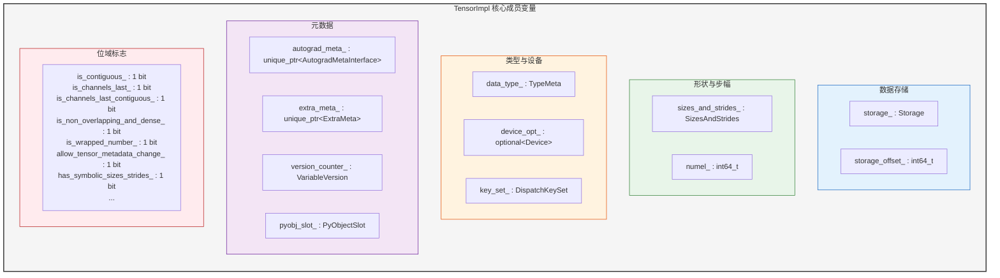
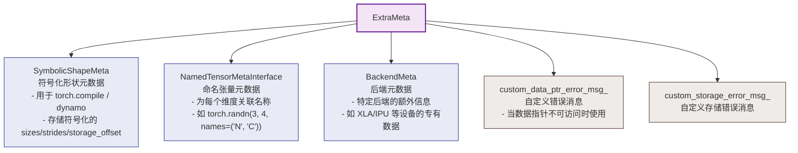
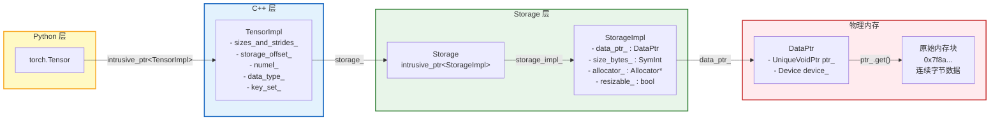

> 本文面向有一定 C++ 基础的读者，深入分析 PyTorch 中每个 Python `Tensor` 背后的 C++ 实现核心 -- `TensorImpl`。
> 源码位置: `c10/core/TensorImpl.h`

---

## 1. 概述

在 PyTorch 中，当你在 Python 层面执行 `torch.randn(3, 4)` 时，底层实际创建的是一个 `c10::TensorImpl` 对象。`TensorImpl` 是所有 Tensor 的底层表示，它存储了数据指针、形状、步幅、数据类型、设备信息、自动求导元数据等一切信息。

`TensorImpl` 定义在 `c10` 命名空间下（c10 是 Caffe2 + PyTorch 的合并核心库），继承自 `c10::intrusive_ptr_target`，采用**侵入式引用计数**来管理生命周期。

```cpp
// c10/core/TensorImpl.h
struct C10_API TensorImpl : public c10::intrusive_ptr_target {
    // ...
};
```

Python 层的 `torch.Tensor` 持有一个 `c10::intrusive_ptr<TensorImpl>`，当 Python 对象被回收时，引用计数减少；当引用计数归零时，`TensorImpl` 及其关联的 Storage 被释放。

---

## 2. TensorImpl 类结构总览

下面的图展示了 `TensorImpl` 的核心成员变量及其分类：



---

## 3. 核心成员变量详解

### 3.1 Storage storage_ (数据存储)

```cpp
protected:
  Storage storage_;
```

`storage_` 是 `TensorImpl` 最重要的成员，它封装了指向实际数据的指针。`Storage` 内部持有一个 `c10::intrusive_ptr<StorageImpl>`，而 `StorageImpl` 则包含了实际的内存指针（`DataPtr`）、内存大小（`size_bytes_`）和分配器（`allocator_`）。

多个 `TensorImpl` 可以共享同一个 `Storage`，这是 PyTorch View 机制的基础。当你执行 `t.view(...)` 或 `t.t()` 时，新 Tensor 的 `TensorImpl` 会指向相同的 `Storage`，只是 `sizes_and_strides_` 和 `storage_offset_` 不同。

源码注释明确说明了这一设计意图：

> It contains a pointer to a storage struct (Storage/StorageImpl) which contains the pointer to the actual data and records the data type and device of the view. This allows multiple tensors to alias the same underlying data.

### 3.2 sizes_and_strides_ (形状与步幅)

```cpp
c10::impl::SizesAndStrides sizes_and_strides_;
```

`SizesAndStrides` 是一个高度优化的数据结构，用于同时存储 Tensor 的 `sizes`（形状）和 `strides`（步幅）。它使用了 **Small Buffer Optimization (SBO)** 策略：当维度数 <= 5 时，数据直接内联存储在对象内部（避免堆分配）；当维度数 > 5 时，会在堆上分配数组。

这个设计基于一个实际观察：绝大多数深度学习中的 Tensor 维度不超过 5（批量维、通道维、空间维等），因此内联存储可以显著减少内存分配的开销。

通过 `sizes_and_strides_`，TensorImpl 提供了以下接口：

```cpp
IntArrayRef sizes() const;           // 返回 sizes 的只读视图
IntArrayRef strides() const;         // 返回 strides 的只读视图
int64_t size(int64_t d) const;       // 指定维度的大小
int64_t stride(int64_t d) const;     // 指定维度的步幅
int64_t dim() const;                 // 维度数量
```

### 3.3 storage_offset_ (存储偏移)

```cpp
int64_t storage_offset_ = 0;
```

`storage_offset_` 记录了 Tensor 第一个元素在底层 Storage 中的偏移量（以元素为单位，不是字节）。切片操作是其最典型的应用场景：

```python
t = torch.arange(10)  # storage: [0,1,2,...,9], offset=0
s = t[3:7]            # storage: [0,1,2,...,9], offset=3, size=[4]
```

在 C++ 层面，元素的内存地址计算公式为：

```
element_ptr = storage_.data<T>() + storage_offset_ + sum(index[i] * stride[i])
```

### 3.4 numel_ (元素总数)

```cpp
int64_t numel_ = 1;
```

`numel_` 缓存了 Tensor 中元素的总数，等价于 `sizes` 各维度的乘积。之所以单独存储而不是每次动态计算，是出于性能考虑 -- 这个值在很多地方会被频繁访问。当 Tensor 的 shape 发生变化时（例如 `resize_`），`numel_` 会通过 `compute_numel()` 重新计算：

```cpp
int64_t compute_numel() const {
    return c10::multiply_integers(sizes_and_strides_.sizes_arrayref());
}
```

### 3.5 data_type_ (数据类型)

```cpp
caffe2::TypeMeta data_type_;
```

`TypeMeta` 是一个类型擦除的类型描述符（来自 Caffe2 遗产代码），记录了 Tensor 元素的数据类型。它包含类型 ID、元素大小（`itemsize()`）以及用于构造/析构的函数指针。

在 Python 层面对应 `tensor.dtype`，常见取值如 `torch.float32`、`torch.int64`、`torch.bool` 等。`TypeMeta` 的大小仅为 2 字节，非常紧凑。

### 3.6 device_opt_ (设备信息)

```cpp
std::optional<c10::Device> device_opt_;
```

记录 Tensor 所在的设备。`c10::Device` 包含设备类型（`DeviceType`，如 CPU、CUDA、XLA、MPS 等）和设备索引（如 `cuda:0` 中的 `0`）。

`device_opt_` 使用 `std::optional` 包装，仅在 `undefined tensor`（未定义张量）时为 `nullopt`。对于正常张量，这个值始终有效。大小仅为 3 字节。

源码中还提供了一系列便利的设备检测方法：

```cpp
bool is_cpu() const { return device_opt_.has_value() && device_opt_->type() == kCPU; }
bool is_cuda() const { return device_opt_.has_value() && device_opt_->type() == kCUDA; }
bool is_mps() const { return device_opt_.has_value() && device_opt_->type() == kMPS; }
// ... 等等
```

### 3.7 key_set_ (分发键集合)

```cpp
DispatchKeySet key_set_;
```

`DispatchKeySet` 是 PyTorch **Dispatcher 机制** 的核心数据结构。它是一个 64-bit 的位集合，每个 bit 代表一个 `DispatchKey`。当你对 Tensor 执行一个操作（如 `torch.add`）时，Dispatcher 会根据输入 Tensor 的 `key_set_` 来决定调用哪个具体实现（CPU kernel、CUDA kernel、Autograd wrapper 等）。

常见的 DispatchKey 包括：

| DispatchKey | 含义 |
|-------------|------|
| `CPU` | CPU 后端 |
| `CUDA` | CUDA GPU 后端 |
| `AutogradCPU` | CPU 上的自动求导 |
| `AutogradCUDA` | CUDA 上的自动求导 |
| `Functionalize` | 函数化 |
| `Named` | 命名张量 |
| `Conjugate` | 共轭视图 |
| `Negative` | 取负视图 |

---

## 4. 自动求导元数据 - AutogradMetaInterface

```cpp
std::unique_ptr<c10::AutogradMetaInterface> autograd_meta_ = nullptr;
```

`autograd_meta_` 存储了与自动求导相关的所有信息。它被设计为 `std::unique_ptr`，当 Tensor 不需要梯度时（`requires_grad=False`），这个指针为 `nullptr`，避免了不必要的内存开销。

`AutogradMetaInterface` 是在 `c10` 层面定义的抽象接口，真正的实现 `AutogradMeta` 位于 `torch/csrc/autograd/variable.h`（libtorch.so 中），通过工厂模式间接创建：

```cpp
struct C10_API AutogradMetaInterface {
    virtual void set_requires_grad(bool requires_grad, at::TensorImpl* self_impl) = 0;
    virtual bool requires_grad() const = 0;
    virtual at::Tensor& mutable_grad() = 0;
    virtual const at::Tensor& grad() const = 0;
    virtual const at::Tensor& fw_grad(uint64_t level, const at::TensorBase& self) const = 0;
    virtual void set_fw_grad(
        const at::TensorBase& new_grad,
        const at::TensorBase& self,
        uint64_t level,
        bool is_inplace_op) = 0;
    virtual ~AutogradMetaInterface();
};
```

这种接口/实现分离的设计是因为 `TensorImpl` 位于 `libc10.so`，而 `AutogradMeta` 的完整实现位于 `libtorch.so`，两者处于不同的编译单元。通过接口和工厂模式解耦了编译依赖。

关键接口说明：

| 方法 | 说明 |
|------|------|
| `set_requires_grad()` | 设置是否需要计算梯度 |
| `requires_grad()` | 查询是否需要梯度 |
| `grad()` / `mutable_grad()` | 访问存储的梯度张量 |
| `fw_grad()` / `set_fw_grad()` | 前向模式自动微分的梯度 |

---

## 5. 版本计数器 - VariableVersion

```cpp
c10::VariableVersion version_counter_;
```

`VariableVersion` 用于追踪 Tensor 的**就地修改（in-place operations）**次数。每次就地操作（如 `tensor.add_(1)`）都会调用 `version_counter_.bump()` 递增版本号。

其核心实现是通过 `intrusive_ptr` 共享一个包含 `std::atomic<uint32_t>` 的 `VersionCounter`：

```cpp
struct C10_API VariableVersion {
 private:
    struct VersionCounter : intrusive_ptr_target {
        VersionCounter(uint32_t version) : version_(version) {}
        std::atomic<uint32_t> version_;
    };
    c10::intrusive_ptr<VersionCounter> version_counter_;
    // ...
};
```

**为什么版本计数器如此重要？** 主要用于两个场景：

1. **检测反向传播中的数据篡改**: 在计算图中保存用于反向传播的 Tensor（saved tensor）时，会记录当时的版本号。如果在反向传播之前有人做了就地修改，版本号不匹配，PyTorch 会抛出运行时错误。

2. **版本号在 View 之间共享**: 一个 View 的就地修改会影响所有共享同一 Storage 的 Tensor。View 机制要求 View 与 base tensor 共享同一个 `version_counter_`。

**为什么放在 TensorImpl 而不是 AutogradMeta 中？** 源码注释给出了详细解释：即使 `requires_grad=False` 的 Tensor 也可能被保存用于反向传播（例如作为某个需要梯度的运算的输入），此时需要版本追踪但不需要 `AutogradMeta`。将 `version_counter_` 独立出来避免了为不需要梯度的 Tensor 初始化 `AutogradMeta`，同时也避免了在多线程前向传播中延迟初始化带来的竞争条件。

---

## 6. ExtraMeta - 扩展元数据

```cpp
std::unique_ptr<c10::ExtraMeta> extra_meta_ = nullptr;
```

`ExtraMeta` 是一个可选的"杂物箱"，存放了不是每个 Tensor 都需要的额外元数据。其定义如下：

```cpp
struct C10_API ExtraMeta {
    std::unique_ptr<c10::SymbolicShapeMeta> symbolic_shape_meta_ = nullptr;
    std::unique_ptr<c10::NamedTensorMetaInterface> named_tensor_meta_ = nullptr;
    intrusive_ptr<c10::BackendMeta> backend_meta_ = nullptr;
    std::optional<std::string> custom_data_ptr_error_msg_ = std::nullopt;
    std::optional<std::string> custom_storage_error_msg_ = std::nullopt;
};
```



各组件的详细说明：

| 组件 | 用途 | 何时存在 |
|------|------|---------|
| `SymbolicShapeMeta` | 存储符号化的 sizes、strides、storage_offset，支持 `torch.compile` 等动态编译场景 | 当 Tensor 拥有符号化形状时 |
| `NamedTensorMetaInterface` | 为 Tensor 的每个维度关联一个名称（Named Tensors 功能） | 当 Tensor 有命名维度时 |
| `BackendMeta` | 存储特定后端（XLA、IPU 等）的额外信息 | 当后端需要存储额外元数据时 |

将这些低频使用的元数据隔离到 `ExtraMeta` 中，可以保持 `TensorImpl` 的基础大小紧凑，大多数 Tensor 不需要分配这些额外内存。

### 6.1 PyObjectSlot

```cpp
impl::PyObjectSlot pyobj_slot_;
```

`pyobj_slot_` 管理 `TensorImpl` 与 Python 层 `torch.Tensor` 对象之间的双向引用。当 C++ 侧的 `TensorImpl` 需要找到对应的 Python 对象时（例如在分发过程中需要回调 Python 自定义方法），会通过 `pyobj_slot_` 获取 Python 对象的引用。

---

## 7. 位域标志 (Bitfields)

为了尽可能压缩 `TensorImpl` 的内存占用，大量的布尔标志被实现为位域（bit fields）：

```cpp
bool is_contiguous_ : 1;                     // 是否行优先连续
bool storage_access_should_throw_ : 1;        // 是否禁止 storage 访问
bool is_channels_last_ : 1;                   // 是否 channels-last (NHWC)
bool is_channels_last_contiguous_ : 1;        // channels-last 且连续
bool is_channels_last_3d_ : 1;               // 3D channels-last (NDHWC)
bool is_channels_last_3d_contiguous_ : 1;    // 3D channels-last 且连续
bool is_non_overlapping_and_dense_ : 1;       // 非重叠且稠密
bool is_wrapped_number_ : 1;                  // 是否为包装的标量数字
bool allow_tensor_metadata_change_ : 1;       // 是否允许修改元数据
bool reserved_ : 1;                          // Resize 是否保留多余内存
uint8_t sizes_strides_policy_ : 2;           // sizes/strides 的调度策略
bool has_symbolic_sizes_strides_ : 1;         // 是否含有符号化 sizes/strides
uint8_t custom_sizes_strides_ : 2;           // 自定义 sizes/strides 策略
bool device_policy_ : 1;                     // 是否有自定义 device 策略
bool layout_policy_ : 1;                     // 是否有自定义 layout 策略
bool custom_device_ : 1;                     // 使用自定义 device()
bool custom_layout_ : 1;                     // 使用自定义 layout()
uint8_t python_custom_sizes_strides_ : 2;    // Python 自定义 sizes/strides
bool python_custom_device_ : 1;              // Python 自定义 device
bool python_custom_layout_ : 1;              // Python 自定义 layout
```

其中最重要的几个标志：

- **`is_contiguous_`**: 缓存了 Tensor 是否行优先连续的结果。由于 `is_contiguous()` 调用极其频繁（几乎每个运算都会检查），将其缓存为 1 bit 可以避免每次重新计算。

- **`is_channels_last_`** 和 **`is_channels_last_contiguous_`**: 支持 channels-last 内存格式（NHWC），这是 CNN 在某些硬件上的高效布局。

- **`has_symbolic_sizes_strides_`**: 当 `torch.compile` / Dynamo 追踪时，Tensor 的 shape 可能是符号化的（`SymInt`），此标志用于在运行时决定是否需要走符号化的代码路径。

---

## 8. TensorImpl 到原始数据的内存布局

下面的图展示了从 `TensorImpl` 到实际原始数据的完整引用链路：



数据访问的调用链路：

```
Python: tensor.data_ptr()
  -> C++: TensorImpl::data()
    -> storage_.data()
      -> storage_impl_->data()
        -> data_ptr_.get()   // 返回 void* 原始指针
```

带偏移的元素访问：

```
Python: tensor[i, j]
  -> C++: storage_.data<float>() + storage_offset_ + i * stride(0) + j * stride(1)
```

---

## 9. 引用计数与生命周期管理

`TensorImpl` 继承自 `c10::intrusive_ptr_target`，使用侵入式引用计数管理生命周期。与 `std::shared_ptr` 的非侵入式引用计数不同，侵入式方案将引用计数直接嵌入到对象内部，避免了额外的控制块分配。

```cpp
// 使用 intrusive_ptr 管理 TensorImpl
c10::intrusive_ptr<TensorImpl> tensor_ptr = c10::make_intrusive<TensorImpl>(...);

// 拷贝指针 -> 引用计数 +1
auto another_ref = tensor_ptr;

// 指针离开作用域 -> 引用计数 -1
// 当引用计数归零 -> 调用 ~TensorImpl() -> 释放 storage_ 等资源
```

这种设计的好处：

1. **内存局部性更好**: 引用计数和对象数据在同一块内存上，减少 cache miss。
2. **可以从裸指针构造**: 在 C++/Python 跨语言边界传递时，可以直接从裸指针重建 `intrusive_ptr`。
3. **更好的内存效率**: 不需要额外分配控制块。

---

## 10. 构造函数

`TensorImpl` 提供了三种主要的构造方式：

```cpp
// 1. 带 Storage 的标准构造
TensorImpl(Storage&& storage, DispatchKeySet key_set, const caffe2::TypeMeta data_type);

// 2. View 语义的构造 (共享 version_counter)
TensorImpl(ImplType::VIEW, Storage&& storage, DispatchKeySet key_set, const caffe2::TypeMeta data_type);

// 3. 无 Storage 的轻量构造 (如 Meta tensor、NestedTensor)
TensorImpl(DispatchKeySet key_set, const caffe2::TypeMeta data_type, std::optional<c10::Device> device_opt);
```

注意：`TensorImpl` 禁用了拷贝构造和移动构造（`= delete`），这意味着一旦创建就不能拷贝或移动。所有的传递都通过 `intrusive_ptr` 进行。

---

## 11. TensorImpl 的内存大小

PyTorch 对 `TensorImpl` 的内存大小有严格的编译期检查。源码尾部有一个 `C10_TensorImpl_Size_Check_Dummy_Class`，会在编译时验证各成员变量的大小。在 64 位系统上，各成员的典型大小为：

| 成员变量 | 大小 (字节) |
|----------|------------|
| `storage_` | 通过 `intrusive_ptr` 管理 |
| `autograd_meta_` | 8 (指针) |
| `extra_meta_` | 8 (指针) |
| `version_counter_` | 8 (intrusive_ptr) |
| `pyobj_slot_` | 16 |
| `sizes_and_strides_` | 88 (SBO 内联存储) |
| `storage_offset_` | 8 |
| `numel_` | 8 |
| `data_type_` | 2 |
| `device_opt_` | 3 |
| `key_set_` | 8 |
| 位域标志 | 约 3-4 字节 |

整个 `TensorImpl` 的大小被严格控制在一个合理的范围内，这对于需要同时存在大量小 Tensor 的场景（如 NLP 中的 token embedding 列表）非常重要。

---

## 12. 小结

`TensorImpl` 是 PyTorch 整个张量系统的心脏。它的设计体现了以下几个核心理念：

1. **View 语义**: 通过 Storage 共享和独立的 shape/stride/offset 元数据，实现零拷贝的 View 操作。

2. **按需分配**: `autograd_meta_` 和 `extra_meta_` 使用 `unique_ptr`，不需要时为 `nullptr`，避免浪费。

3. **极致的空间优化**: 位域标志、SBO 策略、`TypeMeta` 仅 2 字节、`Device` 仅 3 字节。

4. **分发能力**: `key_set_` 让 Dispatcher 可以根据 Tensor 自身的属性选择正确的算子实现。

5. **编译单元隔离**: 通过接口（`AutogradMetaInterface`）和工厂模式，让 `c10` 库不依赖 `torch` 库的具体实现。

理解了 `TensorImpl` 之后，下一步就是深入它最重要的成员 -- `Storage` 和底层的内存分配器体系。

---

> **上一篇**: [Tensor 基础教程](./00-tensor-basics-tutorial.md)
> **下一篇**: [Storage 与 Allocator 体系解析](./02-storage-and-allocator.md)
