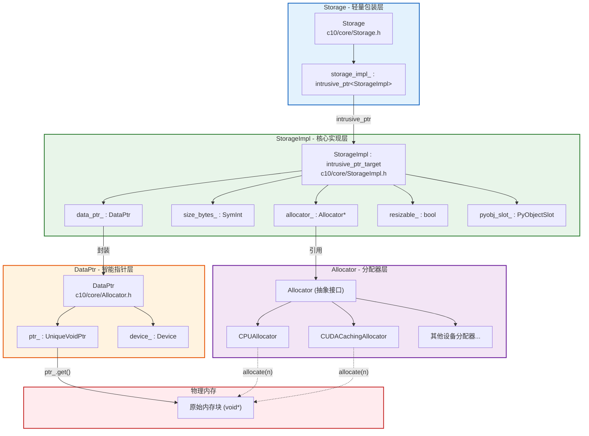
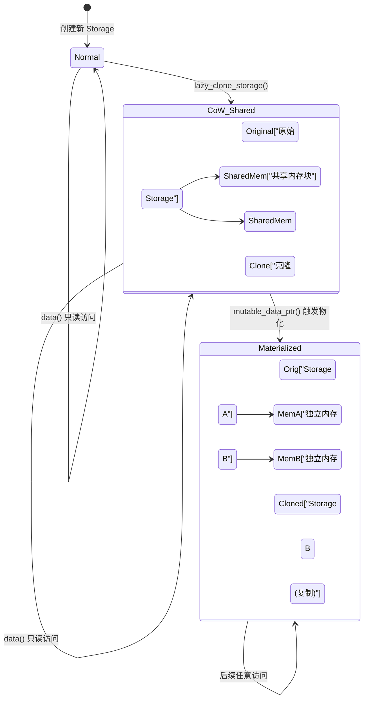

> 本文深入分析 PyTorch 的 Storage、StorageImpl、DataPtr 以及 Allocator 体系，涵盖从 Storage 封装层到底层内存分配的完整链路，并解析 Copy-on-Write (CoW) 机制。
> 核心源码位置:
> - `c10/core/Storage.h`
> - `c10/core/StorageImpl.h`
> - `c10/core/Allocator.h`
> - `c10/core/impl/COW.h`

---

## 1. 概述

在上一篇文章中，我们了解到 `TensorImpl` 通过 `storage_` 成员指向底层数据。本文将沿着这条链路继续向下探索，完整梳理 `Storage -> StorageImpl -> DataPtr -> Allocator` 的层次关系。

PyTorch 的内存管理体系层次清晰：

- **Storage**: 轻量级包装类，持有 `intrusive_ptr<StorageImpl>`
- **StorageImpl**: 实际的存储实现，持有 `DataPtr`、大小、分配器等信息
- **DataPtr**: 智能指针 + 设备信息，持有实际内存指针和自定义删除器
- **Allocator**: 抽象的内存分配器接口，不同设备有不同实现

---

## 2. Storage 与 StorageImpl 层级关系



---

## 3. Storage - 轻量包装层

`Storage` 是一个轻量级的值类型包装器，内部只持有一个 `intrusive_ptr<StorageImpl>`。它的存在是为了提供一个方便的 API 表面，同时利用引用计数实现 Storage 的共享语义。

### 3.1 核心定义

```cpp
// c10/core/Storage.h
struct C10_API Storage {
    struct use_byte_size_t {};

    Storage() = default;

    // 从已有的 StorageImpl 构造
    Storage(c10::intrusive_ptr<StorageImpl> ptr)
        : storage_impl_(std::move(ptr)) {}

    // 使用分配器分配内存
    Storage(
        use_byte_size_t,
        const SymInt& size_bytes,
        Allocator* allocator = nullptr,
        bool resizable = false)
        : storage_impl_(c10::make_intrusive<StorageImpl>(
              StorageImpl::use_byte_size_t(),
              size_bytes,
              allocator,
              resizable)) {}

    // 使用预分配的 DataPtr
    Storage(
        use_byte_size_t,
        size_t size_bytes,
        at::DataPtr data_ptr,
        at::Allocator* allocator = nullptr,
        bool resizable = false)
        : storage_impl_(c10::make_intrusive<StorageImpl>(
              StorageImpl::use_byte_size_t(),
              size_bytes,
              std::move(data_ptr),
              allocator,
              resizable)) {}

private:
    c10::intrusive_ptr<StorageImpl> storage_impl_;
};
```

### 3.2 构造方式

Storage 提供了三种主要的构造方式：

| 构造方式 | 场景 | 说明 |
|----------|------|------|
| 分配器构造 | `Storage(use_byte_size_t{}, size, allocator, resizable)` | 最常见，让分配器自动分配指定大小的内存 |
| DataPtr 构造 | `Storage(use_byte_size_t{}, size, data_ptr, allocator, resizable)` | 用于包装外部内存（如 `from_blob`） |
| `create_legacy()` | 兼容 Caffe2 的旧式创建 | 创建大小为 0 的可调整大小的存储 |

`create_legacy()` 是一个静态工厂方法，专门用于 Caffe2 遗留代码的兼容：

```cpp
static Storage create_legacy(at::Device device) {
    auto allocator = GetAllocator(device.type());
    return Storage(c10::make_intrusive<StorageImpl>(
        StorageImpl::use_byte_size_t(),
        0,
        allocator->allocate(0),
        allocator,
        true));  // resizable = true
}
```

### 3.3 常用操作

```cpp
// 获取字节大小
size_t nbytes = storage.nbytes();

// 获取数据指针
const void* data = storage.data();
void* mutable_data = storage.mutable_data();

// 设备信息
Device device = storage.device();
DeviceType type = storage.device_type();

// 引用计数
size_t count = storage.use_count();
bool unique = storage.unique();

// Storage 别名检测
bool is_alias = storage1.is_alias_of(storage2);
```

`is_alias_of` 方法用于检测两个 Storage 是否指向同一块内存，这在 View 检测和优化中非常重要。

---

## 4. StorageImpl - 核心实现层

`StorageImpl` 是真正保存存储状态的类，继承自 `c10::intrusive_ptr_target` 以支持引用计数。

### 4.1 成员变量

```cpp
// c10/core/StorageImpl.h
struct C10_API StorageImpl : public c10::intrusive_ptr_target {
private:
    DataPtr data_ptr_;                                 // 实际数据指针
    SymInt size_bytes_;                                // 存储大小（字节）
    bool size_bytes_is_heap_allocated_;                // size_bytes_ 是否是堆分配的 SymInt
    bool resizable_;                                   // 是否可调整大小
    bool received_cuda_;                               // 是否从其他进程接收的 CUDA 内存
    bool has_mutable_data_ptr_check_ = false;          // 可变数据指针的检查守卫
    bool throw_on_mutable_data_ptr_ = false;           // 访问可变指针时是否抛异常
    bool throw_on_immutable_data_ptr_ = false;         // 访问不可变指针时是否抛异常
    bool warn_deprecated_on_mutable_data_ptr_ = false; // 访问可变指针时是否发出弃用警告
    Allocator* allocator_;                             // 分配器指针
    impl::PyObjectSlot pyobj_slot_;                    // Python 对象引用
    std::unique_ptr<StorageExtraMeta> extra_meta_;     // 额外元数据
};
```

各成员的职责：

| 成员变量 | 职责 |
|----------|------|
| `data_ptr_` | 持有实际内存指针、设备信息和自定义删除器 |
| `size_bytes_` | 存储的总字节数，使用 `SymInt` 支持符号化大小 |
| `resizable_` | 标记是否允许 `resize` 操作，可调大小的存储必须有分配器 |
| `allocator_` | 指向内存分配器，用于后续的 `resize` 或重新分配 |
| `pyobj_slot_` | 管理与 Python 层 Storage 对象的双向引用 |

### 4.2 构造函数

StorageImpl 有两个构造函数，分别对应"自动分配"和"预分配"两种场景：

```cpp
// 构造函数 1: 预分配内存
StorageImpl(
    use_byte_size_t,
    SymInt size_bytes,
    at::DataPtr data_ptr,
    at::Allocator* allocator,
    bool resizable)
    : data_ptr_(std::move(data_ptr)),
      size_bytes_(std::move(size_bytes)),
      size_bytes_is_heap_allocated_(size_bytes_.is_heap_allocated()),
      resizable_(resizable),
      received_cuda_(false),
      allocator_(allocator) {
    if (resizable) {
        TORCH_INTERNAL_ASSERT(allocator_, "For resizable storage, allocator must be provided");
    }
}

// 构造函数 2: 由分配器自动分配
StorageImpl(
    use_byte_size_t,
    const SymInt& size_bytes,
    at::Allocator* allocator,
    bool resizable)
    : StorageImpl(
          use_byte_size_t(),
          size_bytes,
          size_bytes.is_heap_allocated()
              ? allocator->allocate(0)                          // 符号化大小时延迟分配
              : allocator->allocate(size_bytes.as_int_unchecked()),  // 具体大小时立即分配
          allocator,
          resizable) {}
```

注意：`StorageImpl` 禁用了拷贝和移动操作，确保每个实例的唯一性。

### 4.3 数据访问与 CoW 保护

StorageImpl 的数据访问方法设计得非常精巧，区分了可变和不可变两种访问模式：

```cpp
// 不可变访问 - 只读
const at::DataPtr& data_ptr() const {
    if (C10_UNLIKELY(throw_on_immutable_data_ptr_)) {
        throw_data_ptr_access_error();
    }
    return data_ptr_;
}

// 可变访问 - 可能触发 CoW 复制
at::DataPtr& mutable_data_ptr() {
    if (C10_UNLIKELY(has_mutable_data_ptr_check_)) {
        if (throw_on_immutable_data_ptr_) throw_data_ptr_access_error();
        if (throw_on_mutable_data_ptr_) throwNullDataPtrError();
        if (warn_deprecated_on_mutable_data_ptr_) warnDeprecatedDataPtr();
        maybe_materialize_cow();  // 关键：触发 CoW 物化
    }
    return data_ptr_;
}
```

`C10_UNLIKELY` 宏标记了这些检查在大多数情况下不会被命中，帮助编译器进行分支预测优化。`has_mutable_data_ptr_check_` 是一个聚合标志，将多个检查条件合并为一个快速路径判断，避免在热路径上做多次条件检查。

---

## 5. DataPtr - 智能指针层

`DataPtr` 是 PyTorch 自定义的智能指针，组合了 `UniqueVoidPtr`（带自定义删除器的 `void*`）和 `Device`（设备信息）。

### 5.1 核心定义

```cpp
// c10/core/Allocator.h
class C10_API DataPtr {
private:
    c10::detail::UniqueVoidPtr ptr_;  // void* + context + deleter
    Device device_;                    // 设备信息

public:
    DataPtr() : device_(DeviceType::CPU) {}

    DataPtr(void* data, Device device)
        : ptr_(data), device_(device) {}

    // data: 用户看到的数据指针
    // ctx:  传递给删除器的上下文（可以和 data 不同）
    // ctx_deleter: 删除器函数指针
    DataPtr(void* data, void* ctx, DeleterFnPtr ctx_deleter, Device device)
        : ptr_(data, ctx, ctx_deleter), device_(device) {}
};
```

### 5.2 Data 与 Context 分离

`DataPtr` 的一个巧妙设计是 **data 指针和 context 指针的分离**。`data` 是用户实际访问的数据地址，而 `ctx`（context）是传递给删除器的指针。

在大多数简单情况下，`data == ctx`（例如 CPU 分配器直接分配一块内存）。但在某些场景中两者不同：

- **CUDA 缓存分配器**: `ctx` 可能指向分配器内部的管理结构，而 `data` 指向实际的 GPU 内存。
- **`from_blob` 外部内存**: `ctx` 可能指向一个包含自定义删除逻辑的上下文对象。
- **内存映射文件**: `ctx` 可能包含文件映射的元数据。

```cpp
void* get() const { return ptr_.get(); }           // 获取 data 指针
void* get_context() const { return ptr_.get_context(); } // 获取 context 指针
DeleterFnPtr get_deleter() const { return ptr_.get_deleter(); } // 获取删除器
Device device() const { return device_; }           // 获取设备
```

### 5.3 删除器机制

当 `DataPtr` 被销毁时，会调用 `ctx_deleter(ctx)` 来释放资源。`DeleterFnPtr` 是一个简单的函数指针类型 `void (*)(void*)`，而不是 `std::function`，这是出于性能考虑（避免堆分配和虚函数调用）。

对于需要更复杂删除逻辑的场景，PyTorch 提供了 `InefficientStdFunctionContext`：

```cpp
struct C10_API InefficientStdFunctionContext {
    void* ptr_{nullptr};
    std::function<void(void*)> deleter_;

    static DataPtr makeDataPtr(
        void* ptr,
        std::function<void(void*)> deleter,
        Device device);
};
```

名字中的 "Inefficient" 是一个有意的提醒：使用 `std::function` 会引入额外的堆分配，应尽量避免在性能敏感路径使用。

---

## 6. Allocator - 内存分配器接口

`Allocator` 是一个抽象基类，定义了 PyTorch 所有内存分配器的统一接口。

### 6.1 接口定义

```cpp
// c10/core/Allocator.h
struct C10_API Allocator {
    virtual ~Allocator() = default;

    // 核心分配方法：分配 n 字节，返回 DataPtr
    virtual DataPtr allocate(size_t n) = 0;

    // 克隆一段已分配的内存
    DataPtr clone(const void* data, std::size_t n);

    // 检查 DataPtr 是否有简单上下文
    virtual bool is_simple_data_ptr(const DataPtr& data_ptr) const;

    // 返回原始删除器（如果支持 raw_allocate/raw_deallocate）
    virtual DeleterFnPtr raw_deleter() const { return nullptr; }

    // 原始分配和释放（需要 raw_deleter() 返回非空）
    void* raw_allocate(size_t n);
    void raw_deallocate(void* ptr);

    // 数据复制（纯虚函数）
    virtual void copy_data(void* dest, const void* src, std::size_t count) const = 0;
};
```

### 6.2 分配器注册机制

PyTorch 使用全局注册表来管理不同设备类型的分配器：

```cpp
// 注册分配器
C10_API void SetAllocator(DeviceType t, Allocator* alloc, uint8_t priority = 0);

// 获取分配器
C10_API Allocator* GetAllocator(const DeviceType& t);

// 宏便利注册
#define REGISTER_ALLOCATOR(t, f) \
    namespace { static c10::AllocatorRegisterer<t> g_##t##_allocator(f); }
```

`priority` 参数允许高优先级的分配器覆盖低优先级的注册。这在需要替换默认分配器（例如使用自定义内存池）时非常有用。

### 6.3 典型分配器实现

| 分配器 | 设备类型 | 位置 | 特点 |
|--------|---------|------|------|
| `CPUAllocator` | CPU | `c10/core/CPUAllocator.cpp` | 使用 `posix_memalign` 进行对齐分配 |
| `CUDACachingAllocator` | CUDA | `c10/cuda/CUDACachingAllocator.cpp` | CUDA 内存池，避免频繁的 `cudaMalloc/cudaFree` |
| `DefaultMobileCPUAllocator` | CPU (Mobile) | `c10/core/impl/alloc_cpu.cpp` | 移动端优化的 CPU 分配器 |

---

## 7. 内存分配时序

下面的时序图展示了创建一个 CPU Tensor 时的内存分配完整流程：

```mermaid
sequenceDiagram
    participant User as Python 用户
    participant Tensor as torch.Tensor
    participant TI as TensorImpl
    participant ST as Storage
    participant SI as StorageImpl
    participant AL as CPUAllocator
    participant MEM as 系统内存

    User->>Tensor: torch.randn(3, 4)
    Tensor->>AL: GetAllocator(CPU)
    AL-->>Tensor: CPUAllocator*

    Tensor->>SI: new StorageImpl(size=48bytes, allocator)
    SI->>AL: allocate(48)
    AL->>MEM: posix_memalign(48, 64)
    MEM-->>AL: void* ptr
    AL-->>SI: DataPtr(ptr, CPU)
    SI-->>ST: intrusive_ptr&lt;StorageImpl&gt;

    Tensor->>TI: new TensorImpl(storage, key_set, dtype)
    Note over TI: 设置 sizes=[3,4]<br/>strides=[4,1]<br/>storage_offset=0<br/>numel=12

    TI-->>Tensor: intrusive_ptr&lt;TensorImpl&gt;
    Tensor-->>User: tensor([...])
```

计算过程：3 x 4 个 float32 元素 = 12 x 4 字节 = 48 字节。CPU 分配器通常会按 64 字节对齐分配。

---

## 8. Copy-on-Write (CoW) 机制

PyTorch 实现了 Copy-on-Write 机制，允许多个 StorageImpl 在只读模式下共享同一块内存，仅在需要写入时才触发数据复制。

### 8.1 CoW 接口

```cpp
// c10/core/impl/COW.h
namespace c10::impl::cow {

// 创建 CoW 克隆，同时将原 storage 转换为 CoW 模式
c10::intrusive_ptr<StorageImpl> lazy_clone_storage(StorageImpl& storage);

// 检查 storage 是否有简单的 DataPtr
bool has_simple_data_ptr(const c10::StorageImpl& storage);

// 检查 DataPtr 是否处于 CoW 模式
bool is_cow_data_ptr(const c10::DataPtr& data_ptr);

// 物化 CoW storage - 实际执行数据复制
void materialize_cow_storage(StorageImpl& storage);

}
```

### 8.2 CoW 工作原理

CoW 的核心思想是"延迟复制" -- 只有在真正需要修改数据时才执行复制操作。

**创建 CoW 克隆时**：`lazy_clone_storage` 会将原始 Storage 的 `DataPtr` 替换为一个特殊的 CoW `DataPtr`（带有 CoW 专用的删除器），然后创建一个新的 StorageImpl 共享同一个 CoW `DataPtr`。

**读取数据时**：通过 `data_ptr()` 或 `data()` 进行只读访问，不会触发任何复制。

**修改数据时**：通过 `mutable_data_ptr()` 或 `mutable_data()` 进行可变访问时，`StorageImpl` 会检测到 CoW 状态，调用 `materialize_cow_storage` 执行实际的数据复制，将当前 Storage 变为独立的非 CoW 存储。

### 8.3 CoW 状态转换



### 8.4 CoW 在 StorageImpl 中的集成

StorageImpl 通过以下方法集成 CoW 逻辑：

```cpp
// 检查当前 DataPtr 是否为 CoW 模式
inline bool is_cow() const {
    return c10::impl::cow::is_cow_data_ptr(data_ptr_);
}

// 如果是 CoW，则执行物化
void maybe_materialize_cow() {
    if (is_cow()) {
        impl::cow::materialize_cow_storage(*this);
    }
}
```

所有可变数据访问路径都会经过 `maybe_materialize_cow()` 检查。这个检查被放在 `C10_UNLIKELY` 守卫之后，确保在非 CoW 场景下不会有性能损耗：

```cpp
at::DataPtr& mutable_data_ptr() {
    if (C10_UNLIKELY(has_mutable_data_ptr_check_)) {
        // ... 各种检查 ...
        maybe_materialize_cow();
    }
    return data_ptr_;
}
```

### 8.5 CoW 的限制

`lazy_clone_storage` 不是总能成功。当 Storage 的 `DataPtr` 具有非平凡的 context（即 `DataPtr::get_context() != DataPtr::get()`）时，无法安全地转换为 CoW 模式，此时会返回 `nullptr`，调用方需要回退到普通的深拷贝。

---

## 9. StorageImpl 的创建工厂

除了直接构造 StorageImpl，PyTorch 还提供了基于设备类型的工厂函数：

```cpp
// 每种设备类型可以注册自定义的 StorageImpl 创建函数
using StorageImplCreateHelper = intrusive_ptr<StorageImpl> (*)(
    StorageImpl::use_byte_size_t,
    SymInt size_bytes,
    DataPtr data_ptr,
    Allocator* allocator,
    bool resizable);

void SetStorageImplCreate(DeviceType t, StorageImplCreateHelper fptr);
StorageImplCreateHelper GetStorageImplCreate(DeviceType t);

// 通用创建函数：先查找设备特定的创建器，找不到则使用默认构造
c10::intrusive_ptr<c10::StorageImpl> make_storage_impl(
    c10::StorageImpl::use_byte_size_t use_byte_size,
    c10::SymInt size_bytes,
    c10::DataPtr data_ptr,
    c10::Allocator* allocator,
    bool resizable,
    std::optional<at::Device> device_opt);
```

这种设计允许特定设备后端（如 CUDA）创建自定义的 StorageImpl 子类型或进行特殊的初始化逻辑。

---

## 10. 完整的内存管理示例

下面通过一个具体场景来串联所有组件：

```python
import torch

# 1. 创建 Tensor -- 触发分配
t = torch.randn(1000, 1000)  # 1M floats = 4MB

# 2. 创建 View -- 共享 Storage，无新分配
v = t[100:200, :]  # view: offset=100*1000, shape=(100, 1000)

# 3. clone 操作 -- 分配新 Storage，复制数据
c = t.clone()

# 验证
print(t.storage().data_ptr() == v.storage().data_ptr())  # True  -- 共享
print(t.storage().data_ptr() == c.storage().data_ptr())  # False -- 独立
```

对应的 C++ 层面发生了以下事情：

```
步骤 1 - torch.randn(1000, 1000):
  CPUAllocator::allocate(4,000,000)
    -> posix_memalign(&ptr, 64, 4000000)
    -> DataPtr(ptr, ptr, &free, CPU)
  StorageImpl(data_ptr, 4000000, CPUAllocator, resizable=false)
  Storage(intrusive_ptr<StorageImpl>)
  TensorImpl(storage, sizes=[1000,1000], strides=[1000,1], offset=0)

步骤 2 - t[100:200, :]:
  new TensorImpl(same_storage, sizes=[100,1000], strides=[1000,1], offset=100000)
  // Storage 引用计数 +1，无内存分配

步骤 3 - t.clone():
  CPUAllocator::allocate(4,000,000)  // 新分配
  memcpy(new_ptr, old_ptr, 4000000)  // 复制数据
  new StorageImpl(new_data_ptr, 4000000, CPUAllocator, ...)
  new TensorImpl(new_storage, sizes=[1000,1000], strides=[1000,1], offset=0)
```

---

## 11. 小结

PyTorch 的 Storage/Allocator 体系呈现出清晰的分层设计：

| 层次 | 组件 | 职责 |
|------|------|------|
| 包装层 | `Storage` | 提供便利 API，管理 `StorageImpl` 的引用 |
| 实现层 | `StorageImpl` | 持有数据指针、大小、分配器，实现 CoW 逻辑 |
| 指针层 | `DataPtr` | 封装原始指针 + 设备 + 自定义删除器 |
| 分配层 | `Allocator` | 抽象接口，各设备提供具体实现 |
| 物理层 | 系统内存 / GPU 显存 | 实际的内存资源 |

这种设计的核心优势：

1. **设备无关性**: 上层代码通过 `Storage` / `DataPtr` 统一操作不同设备的内存。
2. **高效共享**: 多个 Tensor 通过引用计数共享 Storage，View 操作零拷贝。
3. **灵活的内存管理**: 自定义删除器机制支持多种内存来源（分配、映射、外部指针等）。
4. **CoW 优化**: 在某些场景下延迟数据复制，减少不必要的内存分配和数据搬运。
5. **可扩展**: 新设备只需实现 `Allocator` 接口并注册即可接入。

---

> **上一篇**: [TensorImpl 深度解析](./01-tensorimpl-deep-dive.md)
