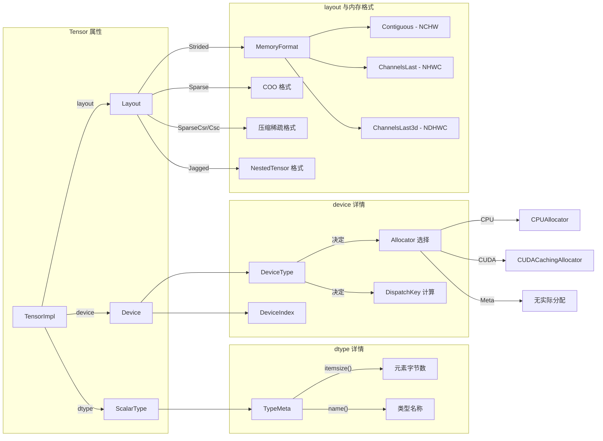

> 难度：中级 | 前置知识：了解 TensorImpl 基本结构、C++ 枚举类型

每个 PyTorch Tensor 除了数据和形状之外，还必须回答三个基本问题：**数据是什么类型（dtype）**、**数据放在哪里（device）**、**数据按什么方式组织（layout）**。本文深入 `c10/core/` 层的源码，逐一解析 `ScalarType`、`Device`、`Layout` 和 `MemoryFormat` 的定义与设计思路。

---

## 1. ScalarType - 数据类型枚举

### 1.1 定义与枚举值

`ScalarType` 是 PyTorch 支持的所有元素级数据类型的枚举，定义在 `torch/headeronly/core/ScalarType.h` 中：

```cpp
// torch/headeronly/core/ScalarType.h
enum class ScalarType : int8_t {
    Byte,           // 0  - uint8_t
    Char,           // 1  - int8_t
    Short,          // 2  - int16_t
    Int,            // 3  - int
    Long,           // 4  - int64_t
    Half,           // 5  - c10::Half (float16)
    Float,          // 6  - float
    Double,         // 7  - double
    ComplexHalf,    // 8  - complex<Half>
    ComplexFloat,   // 9  - complex<float>
    ComplexDouble,  // 10 - complex<double>
    Bool,           // 11 - bool
    QInt8,          // 12 - 量化 int8
    QUInt8,         // 13 - 量化 uint8
    QInt32,         // 14 - 量化 int32
    BFloat16,       // 15 - Brain Float16
    // ... Bits 类型、Float8 类型、UInt 扩展类型
    Undefined,
    NumOptions
};
```

枚举值的顺序在序列化格式和类型提升查找表（`_promoteTypesLookup`）中被依赖，因此不能随意调整。

### 1.2 类型分类全景

下图展示了 `ScalarType` 的完整分类树：

```mermaid
graph TD
    ROOT["ScalarType"]

    ROOT --> FP["浮点类型"]
    ROOT --> INT["整数类型"]
    ROOT --> CX["复数类型"]
    ROOT --> QT["量化类型"]
    ROOT --> BT["Bits 类型"]
    ROOT --> BOOL["Bool"]

    FP --> STD_FP["标准浮点"]
    FP --> REDUCED["低精度浮点"]
    FP --> FP8["Float8 族"]
    FP --> FP4["Float4 族"]

    STD_FP --> Float["Float - 32bit"]
    STD_FP --> Double["Double - 64bit"]

    REDUCED --> Half["Half - 16bit"]
    REDUCED --> BF16["BFloat16 - 16bit"]

    FP8 --> E5M2["Float8_e5m2"]
    FP8 --> E4M3FN["Float8_e4m3fn"]
    FP8 --> E5M2FNUZ["Float8_e5m2fnuz"]
    FP8 --> E4M3FNUZ["Float8_e4m3fnuz"]
    FP8 --> E8M0FNU["Float8_e8m0fnu"]

    FP4 --> E2M1FN["Float4_e2m1fn_x2"]

    INT --> SIGNED["有符号"]
    INT --> UNSIGNED["无符号"]

    SIGNED --> Char["Char - int8"]
    SIGNED --> Short["Short - int16"]
    SIGNED --> Int["Int - int32"]
    SIGNED --> Long["Long - int64"]
    SIGNED --> INT1_7["Int1 - Int7"]

    UNSIGNED --> Byte["Byte - uint8"]
    UNSIGNED --> UInt16["UInt16"]
    UNSIGNED --> UInt32["UInt32"]
    UNSIGNED --> UInt64["UInt64"]
    UNSIGNED --> UINT1_7["UInt1 - UInt7"]

    CX --> CH["ComplexHalf"]
    CX --> CF["ComplexFloat"]
    CX --> CD["ComplexDouble"]

    QT --> QI8["QInt8"]
    QT --> QU8["QUInt8"]
    QT --> QI32["QInt32"]
    QT --> QU4X2["QUInt4x2"]
    QT --> QU2X4["QUInt2x4"]

    BT --> B1X8["Bits1x8"]
    BT --> B2X4["Bits2x4"]
    BT --> B4X2["Bits4x2"]
    BT --> B8["Bits8"]
    BT --> B16["Bits16"]
```



### 1.3 关键辅助函数

`c10/core/ScalarType.h` 中定义了一系列判断和转换函数，它们在整个代码库中被广泛使用：

| 函数 | 作用 | 源文件 |
|------|------|--------|
| `isFloatingType(t)` | 判断是否为任意浮点类型（含 Half、BFloat16、Float8） | `c10/core/ScalarType.h` |
| `isIntegralType(t, includeBool)` | 判断是否为整数类型，可选择是否包含 Bool | 同上 |
| `isComplexType(t)` | 判断是否为复数类型 | 同上 |
| `isFloat8Type(t)` | 判断是否为 Float8 族类型 | 同上 |
| `isReducedFloatingType(t)` | 判断是否为低精度浮点（Half、BFloat16、Float8、Float4） | 同上 |
| `isQIntType(t)` | 判断是否为量化类型 | `torch/headeronly/core/ScalarType.h` |
| `elementSize(t)` | 返回该类型单个元素的字节数 | `c10/core/ScalarType.h` |
| `canCast(from, to)` | 判断从 `from` 到 `to` 的隐式转换是否安全 | 同上 |
| `promoteTypes(a, b)` | 返回两个类型的提升结果 | 同上（声明）|
| `toComplexType(t)` | 将实数类型映射为对应的复数类型 | 同上 |
| `toRealValueType(t)` | 将复数类型映射为对应的实数类型 | 同上 |

其中 `isFloatingType` 的判断逻辑是层层嵌套的：

```cpp
inline bool isFloatingType(ScalarType t) {
  return t == ScalarType::Double || t == ScalarType::Float ||
      isReducedFloatingType(t);
}

inline bool isReducedFloatingType(ScalarType t) {
  return t == ScalarType::Half || t == ScalarType::BFloat16 ||
      isFloat8Type(t) || t == ScalarType::Float4_e2m1fn_x2;
}
```

### 1.4 CppType 与 ScalarType 的双向映射

PyTorch 使用模板元编程建立了 C++ 类型与 `ScalarType` 枚举之间的双向映射：

- **C++ 类型 -> ScalarType**：通过 `CppTypeToScalarType<T>` 特化实现
- **ScalarType -> C++ 类型**：通过 `ScalarTypeToCPPTypeT<N>` 实现

这两套映射由宏 `AT_FORALL_SCALAR_TYPES_WITH_COMPLEX_AND_QINTS` 统一生成，确保不会出现遗漏。

### 1.5 TypeMeta - 运行时类型元数据

`caffe2::TypeMeta`（定义在 `c10/util/typeid.h`）是一个更通用的运行时类型描述符。它持有一个 16-bit 的 id，记录了：

- 元素大小（itemsize）
- 构造 / 析构函数指针
- 类型名称

`TensorImpl` 内部同时存储了 `TypeMeta` 和 `ScalarType`，两者可以互相转换：
- `scalarTypeToTypeMeta(ScalarType)` - 枚举转 TypeMeta
- `typeMetaToScalarType(TypeMeta)` - TypeMeta 转枚举

`TypeMeta` 的存在是历史原因（来自 Caffe2 的合并），在新代码中一般优先使用 `ScalarType`。

### 1.6 Float8 类型详解

Float8 是为 LLM 训练和推理而引入的 8-bit 浮点格式。PyTorch 目前支持以下变体：

| 类型 | 格式 | 用途 |
|------|------|------|
| `Float8_e5m2` | 5 位指数 + 2 位尾数 | 对应 IEEE FP8 E5M2，范围更大 |
| `Float8_e4m3fn` | 4 位指数 + 3 位尾数 | 精度更高，适合权重存储 |
| `Float8_e5m2fnuz` | 无 NaN、无负零变体 | 用于 AMD MI300 等平台 |
| `Float8_e4m3fnuz` | 同上的 e4m3 版本 | 同上 |
| `Float8_e8m0fnu` | MX (Microscaling) 格式的 scale 因子 | 仅存指数，用于 MX 块级缩放 |

---

## 2. Device - 设备描述

### 2.1 DeviceType 枚举

`DeviceType` 定义在 `torch/headeronly/core/DeviceType.h` 中，标识硬件平台类型：

```cpp
enum class DeviceType : int8_t {
  CPU = 0,
  CUDA = 1,        // NVIDIA GPU
  MKLDNN = 2,      // Intel MKL-DNN（保留）
  OPENGL = 3,      // OpenGL（保留）
  OPENCL = 4,      // OpenCL（保留）
  IDEEP = 5,       // Intel IDEEP（保留）
  HIP = 6,         // AMD ROCm
  FPGA = 7,        // FPGA（保留）
  MAIA = 8,        // ONNX Runtime / Microsoft
  XLA = 9,         // Google TPU (via XLA)
  Vulkan = 10,     // Vulkan（移动端 GPU）
  Metal = 11,      // Apple Metal
  XPU = 12,        // Intel GPU
  MPS = 13,        // Apple Metal Performance Shaders
  Meta = 14,       // Meta 设备（无实际数据）
  HPU = 15,        // Habana Gaudi
  VE = 16,         // NEC SX-Aurora
  Lazy = 17,       // Lazy Tensor（延迟执行）
  IPU = 18,        // Graphcore IPU
  MTIA = 19,       // Meta 训练推理加速器
  PrivateUse1 = 20 // 第三方自定义设备
};
```

值得关注的特殊设备：

- **Meta** - 只有形状和 dtype 信息，不分配实际内存。常用于 shape inference（形状推断）和 `torch.compile` 的 tracing 过程
- **Lazy** - 代表延迟计算模式。不立即执行算子，而是构建计算图，最终一次性编译执行（XLA / LazyTensor 使用此模式）
- **PrivateUse1** - 为第三方硬件厂商预留的扩展点。通过 `register_privateuse1_backend()` 注册后，该设备可以像内置设备一样使用

### 2.2 Device 结构体

`Device` 结构体（`c10/core/Device.h`）由 `DeviceType` + `DeviceIndex` 组成：

```cpp
struct Device final {
  DeviceType type_;
  DeviceIndex index_;  // int8_t, -1 表示"当前设备"
};
```

约束条件：
- `index_` 为 -1 时表示"当前活跃设备"（未指定具体编号）
- 对于 CPU 设备，`index_` 必须为 0 或 -1
- `Device` 可以从字符串构造，例如 `"cuda:0"` 或 `"cpu"`

`Device` 结构体提供了一系列便捷的查询方法：

```cpp
device.is_cuda()           // 是否为 CUDA 设备
device.is_cpu()            // 是否为 CPU 设备
device.is_meta()           // 是否为 Meta 设备
device.has_index()         // 是否指定了具体设备编号
device.supports_as_strided() // 是否支持任意 stride 操作
```

`supports_as_strided()` 值得注意 -- IPU、XLA、Lazy 设备返回 false，这意味着这些设备上的 Tensor 不支持 `as_strided` 操作，因为它们的内存模型与 CPU/CUDA 不同。

---

## 3. Layout - 内存布局

### 3.1 Layout 枚举

`Layout` 定义在 `torch/headeronly/core/Layout.h`，描述 Tensor 数据在内存中的组织方式：

```cpp
enum class Layout : int8_t {
  Strided,    // 默认密集布局
  Sparse,     // COO 稀疏格式
  SparseCsr,  // CSR 压缩稀疏行
  Mkldnn,     // Intel MKL-DNN 优化布局
  SparseCsc,  // CSC 压缩稀疏列
  SparseBsr,  // BSR 块稀疏行
  SparseBsc,  // BSC 块稀疏列
  Jagged,     // 嵌套张量 (NestedTensor) 使用
  NumOptions
};
```

各布局的核心特征：

| Layout | 数据结构 | 典型场景 |
|--------|----------|----------|
| **Strided** | 连续内存 + size/stride 元数据 | 所有常规张量操作 |
| **Sparse (COO)** | indices + values 两个 Tensor | 大规模稀疏矩阵（如图神经网络邻接矩阵） |
| **SparseCsr** | crow_indices + col_indices + values | 高效的稀疏矩阵-向量乘法 |
| **SparseCsc** | ccol_indices + row_indices + values | 按列访问优化的稀疏格式 |
| **SparseBsr/Bsc** | 块稀疏变体 | 结构化稀疏性（如分块对角矩阵） |
| **Mkldnn** | Intel 内部优化格式 | CPU 上的高性能卷积等操作 |
| **Jagged** | 不等长序列打包 | NestedTensor 中处理变长序列 |

Layout 影响了 Tensor 内部使用哪个 `TensorImpl` 子类：`Strided` 使用基类 `TensorImpl`，`Sparse` 使用 `SparseTensorImpl`，稀疏压缩格式使用 `SparseCsrTensorImpl`。

### 3.2 Layout 与 Backend 的映射

`layout_from_backend()` 函数（`c10/core/Layout.h`）将 Backend 枚举映射到 Layout。这在从旧式 Backend API 过渡时使用：

```cpp
inline Layout layout_from_backend(Backend backend) {
  switch (backend) {
    case Backend::SparseCPU:
    case Backend::SparseCUDA:
      return Layout::Sparse;
    case Backend::MkldnnCPU:
      return Layout::Mkldnn;
    default:
      return Layout::Strided;
  }
}
```

---

## 4. MemoryFormat - 内存格式

### 4.1 枚举定义

`MemoryFormat` 定义在 `torch/headeronly/core/MemoryFormat.h` 中，注意它与 `Layout` 是不同层面的概念：

```cpp
enum class MemoryFormat : int8_t {
  Contiguous,     // 行优先 (Row-major, NCHW)
  Preserve,       // 保留输入的格式
  ChannelsLast,   // 通道在最后 (NHWC) - 4D
  ChannelsLast3d, // 通道在最后 (NDHWC) - 5D
  NumOptions
};
```

源码注释中明确指出：**MemoryFormat 不是 Tensor 的属性，而是告诉算子输出应该如何组织内存的提示。**

### 4.2 各格式对比

| 格式 | 内存排列 | stride 模式（4D） | 典型用途 |
|------|----------|-------------------|----------|
| **Contiguous** | NCHW | `[C*H*W, H*W, W, 1]` | 默认格式，大多数算子使用 |
| **ChannelsLast** | NHWC | `[H*W*C, 1, W*C, C]` | CNN 推理优化（尤其是在 CPU/MPS 上） |
| **ChannelsLast3d** | NDHWC | `[D*H*W*C, 1, H*W*C, W*C, C]` | 3D 卷积场景 |
| **Preserve** | 保持不变 | 取决于输入 | 避免不必要的格式转换 |

ChannelsLast 格式在深度学习推理中非常重要，因为：
1. Intel CPU 的 AVX-512 指令集对 NHWC 布局有专门优化
2. ARM CPU（Apple M 系列等）的 NEON 指令同样偏好 NHWC
3. 某些量化推理引擎要求输入为 NHWC 格式

### 4.3 ChannelsLast 的 stride 检测

PyTorch 通过 stride 模式来推断一个 Tensor 是否是 ChannelsLast 格式。这个逻辑在 `c10/core/MemoryFormat.h` 的 `is_channels_last_strides_2d_s4` 函数中实现：

```cpp
template <typename T>
inline bool is_channels_last_strides_2d_s4(
    const ArrayRef<T> sizes,
    const ArrayRef<T> strides) {
  T min = 0;
  if (strides[1] == 0) return false;
  // 检查 stride 顺序: C=1, W=C, H=W*C, N=H*W*C
  for (auto& d : {1, 3, 2, 0}) {
    if (sizes[d] == 0) return false;
    if (strides[d] < min) return false;
    if (d == 0 && min == strides[1]) return false;
    min = strides[d];
    if (sizes[d] > 1) min *= sizes[d];
  }
  return true;
}
```

源码注释中坦率地指出了这种基于 stride 推断 MemoryFormat 的局限性：对于维度为 1 的情况（如 `N111` 形状），stride 无法区分是 Contiguous 还是 ChannelsLast。

---

## 5. 四大属性的关系图



当创建一个 Tensor 时，这些属性共同决定了：

1. **ScalarType** -> 决定元素大小、数学运算的精度和范围
2. **Device** -> 决定使用哪个 `Allocator` 分配内存、使用哪个 `DispatchKey` 路由算子
3. **Layout** -> 决定使用哪个 `TensorImpl` 子类、支持哪些算子
4. **MemoryFormat**（仅 Strided Layout）-> 决定 stride 的排列方式

---

## 6. TensorOptions - 统一的属性容器

在实际的 Tensor 创建 API 中，上述四个属性通过 `TensorOptions`（`c10/core/TensorOptions.h`）统一传递：

```cpp
TensorOptions options = TensorOptions()
    .dtype(kFloat)
    .device(kCUDA, 0)
    .layout(kStrided)
    .memory_format(MemoryFormat::ChannelsLast);
```

Python 中也经过了同样的封装：

```python
x = torch.randn(1, 3, 224, 224,
                 dtype=torch.float32,
                 device='cuda:0',
                 layout=torch.strided)
x = x.to(memory_format=torch.channels_last)
```

`TensorOptions` 内部使用了紧凑的位域存储，在 64-bit 内完成所有属性的打包，确保传递和比较操作的高效性。

---

## 7. 小结

| 概念 | 核心文件 | 职责 |
|------|----------|------|
| **ScalarType** | `torch/headeronly/core/ScalarType.h`、`c10/core/ScalarType.h` | 定义数据类型枚举和分类查询函数 |
| **Device** | `c10/core/Device.h`、`torch/headeronly/core/DeviceType.h` | 描述计算设备（type + index） |
| **Layout** | `torch/headeronly/core/Layout.h`、`c10/core/Layout.h` | 描述内存组织方式（dense / sparse / jagged） |
| **MemoryFormat** | `torch/headeronly/core/MemoryFormat.h`、`c10/core/MemoryFormat.h` | 指定 Strided Tensor 的维度排列（NCHW / NHWC） |
| **TensorOptions** | `c10/core/TensorOptions.h` | 将上述属性打包成一个统一的参数对象 |

这四个属性从不同维度完整定义了"一个 Tensor 应该长什么样"。理解它们是阅读 PyTorch 算子实现和性能优化代码的基础。在下一篇文章中，我们将跟踪 `torch.randn(3, 4)` 的完整调用链路，观察这些属性如何在 Tensor 创建过程中被组装和使用。
