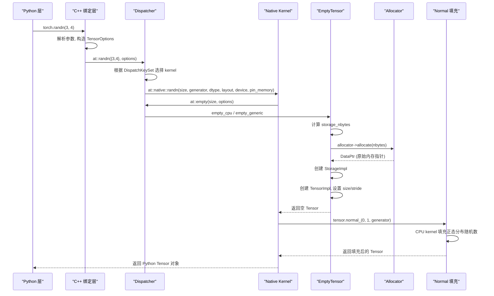
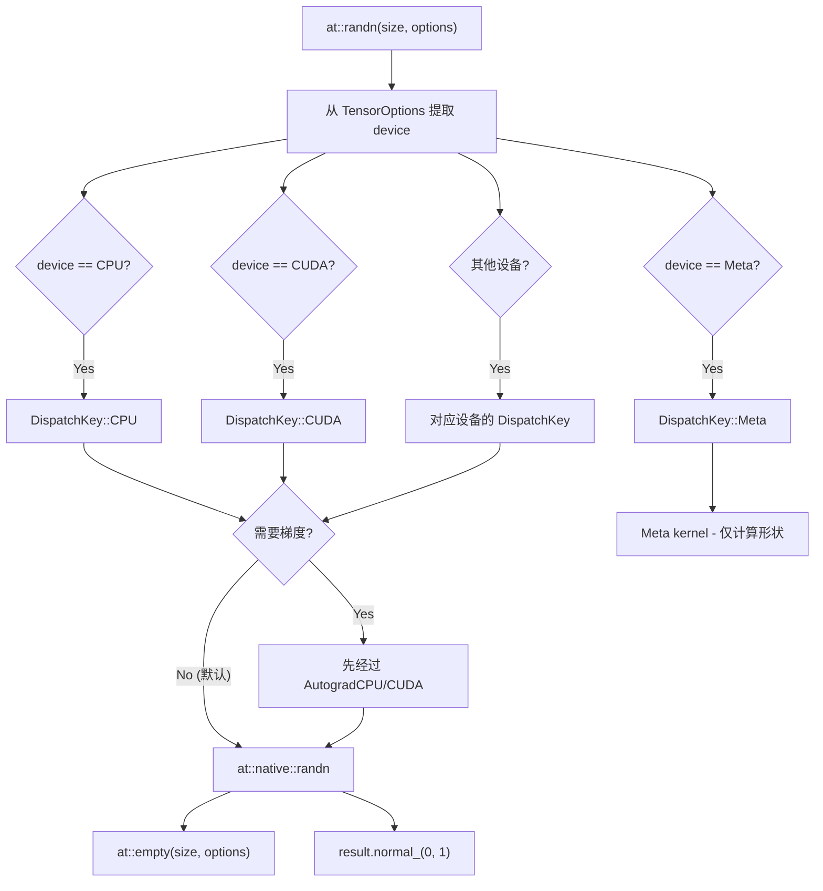

> 难度：高级 | 前置知识：熟悉 TensorImpl、Storage、ScalarType/Device/Layout、Dispatcher 基本概念

本文是一篇代码链路 debug 分析文章。我们以最简单的 `torch.randn(3, 4)` 为例，完整追踪从 Python 函数调用到 C++ 内存分配再到随机数填充的全过程。通过这条链路，你将看到 PyTorch 的 Python 绑定、代码生成、算子分发、内存分配器等核心机制是如何协作的。

---

## 0. 调用全景

在深入细节之前，先通过一张序列图了解完整的调用链：



---

## 1. Python 入口 - torch.randn()

### 1.1 函数调度

当用户在 Python 中调用 `torch.randn(3, 4)` 时，实际调用的是通过代码生成绑定到 Python 的 C++ 函数。在 `torch/__init__.py` 中，`randn` 被导入自 `torch._C._VariableFunctions`：

```python
# torch/__init__.py (简化)
from torch._C._VariableFunctions import randn
```

`_VariableFunctions` 是在编译时自动生成的 Python C 扩展模块，其中的 `randn` 函数是一个 CPython 函数对象，直接桥接到 C++ 绑定代码。

### 1.2 C++ 绑定层

C++ 绑定代码由 `torchgen` 代码生成器根据 `aten/src/ATen/native/native_functions.yaml` 中的算子定义自动生成。对于 `randn`，生成的绑定代码位于 `torch/csrc/autograd/generated/` 目录下。

绑定代码的主要工作：

1. 解析 Python 参数（size、dtype、layout、device、pin_memory 等）
2. 将 Python 对象转换为 C++ 类型
3. 调用 `at::randn()` 进入 ATen 层

```cpp
// torch/csrc/autograd/generated/python_torch_functions_*.cpp (生成代码，简化)
static PyObject* THPVariable_randn(PyObject* self, PyObject* args, PyObject* kwargs) {
    // 解析 Python 参数
    auto size = parse_intarray(args[0]);
    auto options = parse_tensor_options(kwargs);  // dtype, layout, device, pin_memory

    // 进入 ATen 分发
    auto result = torch::randn(size, options);

    // 包装为 Python Tensor 并返回
    return wrap(std::move(result));
}
```

---

## 2. ATen 分发层

### 2.1 at::randn() 与 Dispatcher

`at::randn()` 是由代码生成器生成的分发入口函数。它会：

1. 构造 `DispatchKeySet` -- 对于没有现有 Tensor 输入的工厂函数，key 主要来自 `TensorOptions` 中的 device 信息
2. 通过 `Dispatcher::call()` 将调用路由到注册的 kernel

```cpp
// at::randn() 的简化逻辑
Tensor randn(IntArrayRef size,
             std::optional<ScalarType> dtype,
             std::optional<Layout> layout,
             std::optional<Device> device,
             std::optional<bool> pin_memory) {
    // 由 Dispatcher 路由到正确的 kernel
    // 对于 CPU + Strided：路由到 at::native::randn
    // 对于 CUDA：路由到对应的 CUDA kernel
    ...
}
```

### 2.2 DispatchKey 选择决策

对于工厂函数（如 `randn`、`zeros`、`ones` 等），由于没有输入 Tensor 来提供 DispatchKey，系统需要从 `TensorOptions` 推导：



对于默认的 `torch.randn(3, 4)`，没有指定 `requires_grad=True`，因此不会经过 Autograd 层。最终路由到 CPU 设备的 native kernel。

---

## 3. Native Kernel 实现

### 3.1 at::native::randn()

Native 实现位于 `aten/src/ATen/native/TensorFactories.cpp`。`randn` 的实现非常简洁 -- 分为两步：

```cpp
// aten/src/ATen/native/TensorFactories.cpp
Tensor randn(
    IntArrayRef size,
    std::optional<Generator> generator,
    std::optional<ScalarType> dtype,
    std::optional<Layout> layout,
    std::optional<Device> device,
    std::optional<bool> pin_memory) {
  TensorOptions options =
      TensorOptions().dtype(dtype).layout(layout).device(device).pinned_memory(pin_memory);

  auto result = at::empty(size, options);    // 第一步：创建空 Tensor
  return result.normal_(0, 1, std::move(generator));  // 第二步：填充正态随机数
}
```

这段代码揭示了 `randn` 的本质：**它就是 `empty` + `normal_` 的组合**。

---

## 4. 空 Tensor 创建 - at::empty() 深入

### 4.1 路由到设备特定实现

`at::empty()` 同样经过 Dispatcher。对于 CPU 设备，最终调用 `at::detail::empty_cpu()`，但在此之前会经过 `at::detail::empty_generic()` 这一通用路径。

核心实现位于 `aten/src/ATen/EmptyTensor.cpp`：

```cpp
// aten/src/ATen/EmptyTensor.cpp
template <typename T>
static TensorBase _empty_generic(
    ArrayRef<T> size,
    c10::Allocator* allocator,
    c10::DispatchKeySet ks,
    ScalarType scalar_type,
    std::optional<c10::MemoryFormat> memory_format_opt) {

  // [步骤 1] 检查尺寸非负
  at::detail::check_size_nonnegative(size);

  // [步骤 2] 将 ScalarType 转为 TypeMeta 以获取 itemsize
  caffe2::TypeMeta dtype = scalarTypeToTypeMeta(scalar_type);

  // [步骤 3] 计算需要分配的字节数
  auto size_bytes = computeStorageNbytesContiguous(size, dtype.itemsize());

  // [步骤 4] 创建 StorageImpl（触发内存分配）
  auto storage_impl = c10::make_intrusive<StorageImpl>(
      c10::StorageImpl::use_byte_size_t(),
      size_bytes,
      allocator,
      /*resizeable=*/true);

  // [步骤 5] 创建 TensorImpl
  auto tensor = detail::make_tensor_base<TensorImpl>(
      std::move(storage_impl), ks, dtype);

  // [步骤 6] 设置 size 和 stride
  if (ks.has(c10::DispatchKey::Meta) || size.size() != 1 || size[0] != 0) {
    tensor.unsafeGetTensorImpl()->generic_set_sizes_contiguous(size);
  }

  // [步骤 7] 处理 MemoryFormat（如果不是默认的 Contiguous，需要重新排列 stride）
  if (memory_format_opt.has_value()) {
    if (*memory_format_opt != MemoryFormat::Contiguous) {
      tensor.unsafeGetTensorImpl()->empty_tensor_restride(*memory_format_opt);
    }
  }

  return tensor;
}
```

让我们逐步分析每个关键步骤。

### 4.2 字节数计算

对于 contiguous 布局的 Tensor，存储字节数的计算非常直接：

```cpp
size_t computeStorageNbytesContiguous(
    IntArrayRef sizes, size_t itemsize_bytes, size_t storage_offset) {
  uint64_t size = 1;
  bool overflowed = c10::safe_multiplies_u64(sizes, &size);  // numel = prod(sizes)
  overflowed |= c10::add_overflows(size, storage_offset, &size);
  overflowed |= c10::mul_overflows(size, itemsize_bytes, &size);
  overflowed |= size > storage_max();
  TORCH_CHECK(!overflowed, "Storage size calculation overflowed with sizes=", sizes);
  return static_cast<size_t>(size);
}
```

对于 `torch.randn(3, 4)`（默认 float32）：
- `numel = 3 * 4 = 12`
- `itemsize = sizeof(float) = 4`
- `storage_offset = 0`
- **总字节数 = 12 * 4 = 48 bytes**

### 4.3 StorageImpl 创建与内存分配

`StorageImpl` 的构造函数会调用 `allocator->allocate(size_bytes)` 进行实际内存分配：

```cpp
// c10/core/StorageImpl.h (简化)
StorageImpl(use_byte_size_t, size_t size_bytes, Allocator* allocator, bool resizable)
    : data_ptr_(allocator->allocate(size_bytes)),
      size_bytes_(size_bytes),
      size_bytes_is_heap_allocated_(false),
      resizable_(resizable),
      allocator_(allocator) {}
```

对于 CPU 设备，`allocator` 是 `c10::GetCPUAllocator()` 返回的 CPU 分配器。底层使用 `posix_memalign` 或 `_aligned_malloc`（取决于操作系统），保证 64 字节对齐以优化 SIMD 操作。

分配器返回一个 `DataPtr`，其中包含：
- 原始内存指针
- 上下文指针（用于自定义 deleter）
- 释放函数（`DeleteContext`）
- 设备信息

### 4.4 TensorImpl 创建

`make_tensor_base<TensorImpl>()` 创建 `TensorImpl` 对象并初始化：

1. 接管 `StorageImpl` 的所有权（通过 `intrusive_ptr`）
2. 设置 `DispatchKeySet`（对于 CPU + Float：包含 `DispatchKey::CPU`）
3. 设置 `TypeMeta`（对应 float32）
4. 默认 size 为 `[0]`，随后被 `generic_set_sizes_contiguous` 更新

### 4.5 设置 sizes 和 strides

`generic_set_sizes_contiguous(size)` 设置 size 为 `{3, 4}` 并计算对应的 contiguous stride：

```
size    = [3, 4]
stride  = [4, 1]   // stride[i] = product(size[i+1:])
numel   = 12
```

---

## 5. 随机数填充 - normal_()

### 5.1 in-place 正态分布填充

`randn` 的第二步是 `result.normal_(0, 1, generator)`，这是一个 in-place 操作，将 Tensor 中的每个元素替换为标准正态分布 N(0, 1) 的随机样本。

对于 CPU Tensor，这会路由到 `aten/src/ATen/native/Distributions.cpp` 中的 CPU kernel。核心逻辑：

1. 获取或创建默认的 CPU `Generator`（基于 Mersenne Twister 引擎）
2. 对 Tensor 的每个元素生成一个正态分布随机数
3. 使用 Box-Muller 变换或 Ziggurat 算法将均匀分布转换为正态分布

### 5.2 Generator 机制

`Generator`（`c10/core/GeneratorImpl.h`）是 PyTorch 随机数生成器的抽象：

- `CPUGeneratorImpl` 使用 `mt19937` 作为引擎
- `CUDAGeneratorImpl` 使用 Philox 算法（支持 GPU 并行）
- 全局默认 Generator 通过 `at::detail::getDefaultCPUGenerator()` 获取

每次调用 `normal_` 后，Generator 的内部状态会更新，确保下次调用产生不同的随机数。

---

## 6. 返回到 Python

### 6.1 C++ Tensor 包装为 Python 对象

当 C++ 侧的 `at::Tensor`（实际上持有 `TensorImpl` 的 intrusive_ptr）返回到 Python 绑定层时：

1. `THPVariable_Wrap()` 被调用
2. 创建一个 Python `THPVariable` 对象（即 `torch.Tensor` 的 C 扩展类型）
3. 将 `TensorImpl` 的 intrusive_ptr 存入 Python 对象
4. 引用计数从 C++ 侧转移到 Python 侧

至此，用户得到了一个 shape 为 `[3, 4]`、dtype 为 `float32`、device 为 CPU、填充了标准正态随机数的 `torch.Tensor` 对象。

---

## 7. 关键代码位置索引

| 阶段 | 源文件 | 关键函数/类 |
|------|--------|------------|
| Python 入口 | `torch/__init__.py` | `randn` 导入自 `_C._VariableFunctions` |
| C++ 绑定 | `torch/csrc/autograd/generated/python_torch_functions_*.cpp` | `THPVariable_randn`（生成代码） |
| ATen 分发 | `build/aten/src/ATen/Operators_*.cpp`（生成代码） | `at::randn()` |
| Dispatcher | `c10/core/DispatchKey.h`、`aten/src/ATen/core/dispatch/Dispatcher.h` | `Dispatcher::call()` |
| Native kernel | `aten/src/ATen/native/TensorFactories.cpp` | `at::native::randn()` |
| 空 Tensor 创建 | `aten/src/ATen/EmptyTensor.cpp` | `_empty_generic()`, `empty_generic()` |
| 字节数计算 | `aten/src/ATen/EmptyTensor.cpp` | `computeStorageNbytesContiguous()` |
| StorageImpl | `c10/core/StorageImpl.h` | `StorageImpl::StorageImpl()` |
| CPU 分配器 | `c10/core/CPUAllocator.cpp` | `DefaultCPUAllocator::allocate()` |
| TensorImpl | `c10/core/TensorImpl.h` | `generic_set_sizes_contiguous()` |
| 正态填充 | `aten/src/ATen/native/Distributions.cpp` | `normal_` kernel |
| Generator | `c10/core/GeneratorImpl.h`、`ATen/CPUGeneratorImpl.h` | `CPUGeneratorImpl` |
| Python 返回 | `torch/csrc/autograd/python_variable.cpp` | `THPVariable_Wrap()` |

---

## 8. 用 GDB/LLDB 实际追踪

如果你想在本地验证上述链路，可以设置以下断点：

```bash
# 在 native::randn 处断点
b at::native::randn

# 在 empty_generic 处断点
b at::detail::_empty_generic

# 在 CPUAllocator::allocate 处断点
b c10::DefaultCPUAllocator::allocate

# 在 StorageImpl 构造处断点
b c10::StorageImpl::StorageImpl

# 在 TensorImpl 设置 size 处断点
b c10::TensorImpl::generic_set_sizes_contiguous
```

运行：
```bash
gdb --args python -c "import torch; x = torch.randn(3, 4); print(x)"
```

你将看到调用栈从 Python 一路穿越到 C++ 底层，与本文描述的链路完全一致。

---

## 9. 其他工厂函数的对比

了解了 `randn` 之后，其他工厂函数的模式也就清楚了：

| 函数 | 本质 | 第一步 | 第二步 |
|------|------|--------|--------|
| `torch.randn(3, 4)` | empty + normal_ | `at::empty(size, options)` | `result.normal_(0, 1)` |
| `torch.zeros(3, 4)` | empty + zero_ | `at::empty(size, options)` | `result.zero_()` |
| `torch.ones(3, 4)` | empty + fill_ | `at::empty(size, options)` | `result.fill_(1)` |
| `torch.rand(3, 4)` | empty + uniform_ | `at::empty(size, options)` | `result.uniform_(0, 1)` |
| `torch.full(s, v)` | empty + fill_ | `at::empty(size, options)` | `result.fill_(v)` |
| `torch.empty(3, 4)` | 仅 empty | `at::empty(size, options)` | 无（未初始化内存） |

所有这些工厂函数都共享同一个 `empty` 底座，区别仅在于第二步的填充方式。这种设计保持了代码的正交性 -- 内存分配逻辑只需在 `empty` 中维护一份。

---

## 10. 性能相关观察

### 10.1 内存分配的实际开销

对于小 Tensor（如 `randn(3, 4)` 的 48 bytes），CPU 分配器的 `posix_memalign` 调用耗时约为数百纳秒。而对于大 Tensor（如 `randn(1000, 1000)` 的约 4MB），分配耗时可能达到微秒级。

### 10.2 CUDA 与 CPU 的差异

如果是 `torch.randn(3, 4, device='cuda')`，关键区别在于：
- 分配器变为 `CUDACachingAllocator`（使用缓存池，避免频繁的 `cudaMalloc`）
- 正态分布生成使用 GPU 端的 `curand` 库
- DispatchKey 为 `CUDA` 而非 `CPU`

### 10.3 为什么 empty 不初始化

`torch.empty()` 故意不初始化内存。这是因为后续的 `normal_`、`zero_` 等操作会覆盖所有元素。如果 `empty` 先做一次 memset 再被 `normal_` 覆盖，就浪费了一次内存写入的带宽。

---

## 11. 小结

`torch.randn(3, 4)` 这一行代码，在底层经历了至少 7 个主要步骤：

1. **Python 层**：解析参数，调用 C++ 绑定函数
2. **绑定层**：Python 对象转 C++ 类型，构造 TensorOptions
3. **Dispatcher**：根据 device/layout 计算 DispatchKey，路由到 native kernel
4. **Native kernel**：拆分为 `empty` + `normal_` 两步
5. **Empty**：计算字节数 -> 分配内存 -> 创建 StorageImpl -> 创建 TensorImpl -> 设置 size/stride
6. **Normal**：获取 Generator -> 生成标准正态随机数填充
7. **返回**：C++ Tensor 包装为 Python 对象

这条完整的代码路径涉及了 Python 绑定、代码生成、算子分发、内存分配、设备抽象等 PyTorch 的多个核心子系统。掌握这条链路，将为你阅读和调试其他 PyTorch 算子打下坚实的基础。
