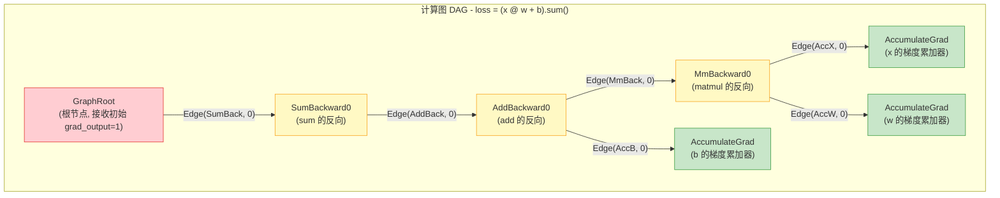
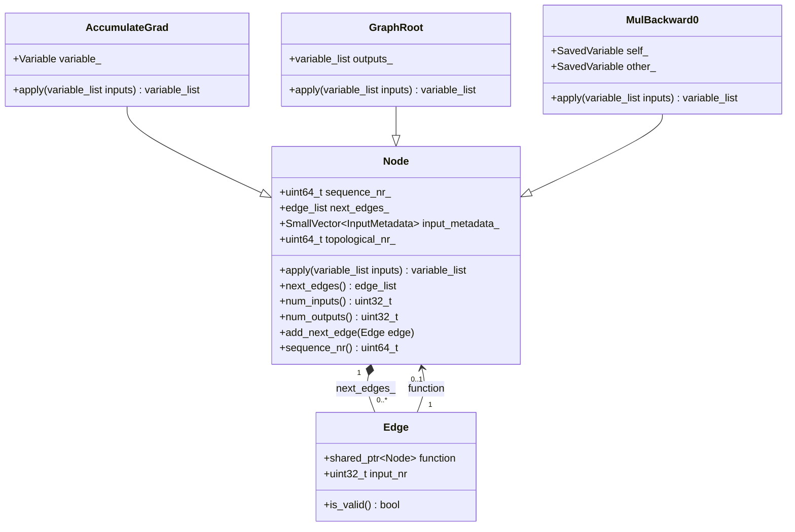
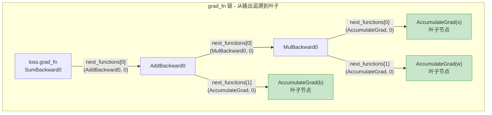

## 1. 概述

PyTorch 的自动微分系统的核心是一个**有向无环图 (Directed Acyclic Graph, DAG)**。在前向传播过程中，每一个涉及 `requires_grad=True` 张量的运算都会在后台构建对应的计算图节点和边，形成一张记录了完整计算历史的 DAG。在反向传播时，引擎沿着这张图的逆序执行梯度计算。

本文将深入 PyTorch C++ 源代码，详细分析计算图的两大核心数据结构 —— **Node** 和 **Edge**，以及它们如何协作构建出完整的自动微分计算图。

## 2. DAG 结构总览

在 Autograd 计算图中：

- **节点 (Node)** 代表一个运算的**反向函数**，如 `MulBackward0`、`AddBackward0`、`AccumulateGrad` 等
- **边 (Edge)** 代表节点之间的连接关系，指明梯度从一个节点流向另一个节点的哪个输入
- 图的方向是从输出指向输入（与前向计算方向相反），因此反向传播时是沿着边的方向遍历

以 `loss = (x @ w + b).sum()` 为例：



图中的关键特征：

- **GraphRoot** 是人工构建的根节点，负责向图中注入初始梯度
- **黄色节点** 是中间运算的反向函数，每一个对应前向传播中的一个操作
- **绿色节点** 是 `AccumulateGrad`，位于叶子张量处，负责将计算出的梯度累加到张量的 `.grad` 属性
- 每条边携带目标节点的指针和输入编号 `input_nr`

## 3. Node - 计算图的节点

### 3.1 Node 类定义

`Node` 是 Autograd 计算图中所有节点的基类，定义在 `torch/csrc/autograd/function.h` 中。尽管文件名叫 `function.h`，但核心类名是 `Node`（历史上曾称为 `Function`）。

```cpp
// torch/csrc/autograd/function.h
struct TORCH_API Node : std::enable_shared_from_this<Node> {
public:
    explicit Node(uint64_t sequence_nr, edge_list&& next_edges = edge_list())
        : sequence_nr_(sequence_nr), next_edges_(std::move(next_edges)) {
        for (const Edge& edge : next_edges_) {
            update_topological_nr(edge);
        }
        thread_id_ = at::RecordFunction::currentThreadId();
    }

    // 核心方法：执行反向计算
    virtual variable_list apply(variable_list&& inputs) = 0;

    // 调用运算符，内部调用 apply()
    variable_list operator()(variable_list&& inputs);

    // ... 其他方法
};
```

### 3.2 关键成员变量

| 成员变量 | 类型 | 作用 |
|---------|------|------|
| `sequence_nr_` | `uint64_t` | 序列号，决定节点在引擎中的执行优先级 |
| `next_edges_` | `edge_list` | 出边列表，指向下游节点 |
| `input_metadata_` | `SmallVector<InputMetadata>` | 输入的元数据（形状、设备、数据类型等） |
| `topological_nr_` | `uint64_t` | 拓扑序号，用于快速剪枝 |
| `thread_id_` | `uint64_t` | 创建该节点的线程 ID，用于 profiler 关联 |

#### sequence_nr_ - 序列号

序列号在节点构造时通过全局原子计数器 `at::sequence_number::get_and_increment()` 获取，确保每个节点有唯一的递增编号。它有两个用途：

1. **引擎调度优先级**：序列号越大的节点优先执行。因为后创建的节点对应后执行的前向操作，在反向传播中应该先被处理（逆拓扑序）
2. **Profiler 关联**：与 `thread_id_` 配合，用于将反向节点与前向操作配对

```cpp
// torch/csrc/autograd/function.h
// NOTE [ Sequence Number ]
// 序列号用途:
// 1) 决定引擎中的执行优先级，序列号越大优先级越高
// 2) 与 thread_id 配合作为 profiler 中事件的唯一标识
uint64_t sequence_nr() const noexcept {
    return sequence_nr_;
}
```

#### next_edges_ - 出边列表

`next_edges_` 存储了该节点的所有出边（`Edge` 对象），每条边指向一个下游节点。反向传播时，节点计算完梯度后，通过这些边将结果传递给下游节点。

```cpp
const edge_list& next_edges() const noexcept {
    return next_edges_;
}

uint32_t num_outputs() const noexcept {
    return next_edges_.size();
}
```

注意区分"输入"和"输出"的视角：在前向传播中，运算的输入张量对应反向节点的**输出**（`next_edges_`），而运算的输出张量对应反向节点的**输入**（`input_metadata_`）。

#### topological_nr_ - 拓扑序号

拓扑序号表示从该节点到任意叶子节点的最长路径长度。叶子节点（`AccumulateGrad`）的拓扑序号为 0。这个值用于 $O(1)$ 复杂度的路径存在性判断：如果 `topo_nr(X) <= topo_nr(Y)`，则一定不存在从 X 到 Y 的有向路径。

```cpp
// NOTE [ Topological Number ]
// 拓扑序号保证：对于 DAG 中的任意节点对 (X, Y)
// 若存在从 X 到 Y 的路径，则 topo_nr(X) > topo_nr(Y)
// 逆命题不一定成立
uint64_t topological_nr() const noexcept {
    has_parent_ = true;
    return topological_nr_;
}
```

### 3.3 apply() 方法

`apply()` 是 `Node` 的核心纯虚方法，每个具体的反向函数子类都必须实现它。它接收上游传来的梯度（`variable_list`），执行该运算的反向计算逻辑，返回传递给下游节点的梯度。

```cpp
// 纯虚函数，子类必须实现
virtual variable_list apply(variable_list&& inputs) = 0;
```

实际的调用通过 `operator()` 完成，它在 `apply()` 之上添加了 profiling 记录等逻辑：

```cpp
variable_list operator()(variable_list&& inputs) {
    // 设置 profiler 记录等
    auto step_callbacks = at::getStepCallbacksUnlessEmpty(
        at::RecordScope::BACKWARD_FUNCTION);
    if (C10_UNLIKELY(step_callbacks.has_value())) {
        // ... profiler 逻辑
        return apply(std::move(inputs));
    } else {
        return apply(std::move(inputs));
    }
}
```

### 3.4 重要子类

PyTorch Autograd 系统中有几类关键的 `Node` 子类：

**运算反向节点** - 自动生成

大部分反向函数是由代码生成器从 `derivatives.yaml` 自动生成的。例如：

- `MulBackward0` - 乘法的反向
- `AddBackward0` - 加法的反向
- `MmBackward0` - 矩阵乘法的反向
- `SumBackward0` - 求和的反向

这些类定义在自动生成的文件 `torch/csrc/autograd/generated/Functions.h` 中。

**AccumulateGrad** - 梯度累加器

`AccumulateGrad` 是叶子张量（用户创建的、`requires_grad=True` 的张量）对应的特殊节点。它不执行任何数学运算，只是将上游传来的梯度累加到张量的 `.grad` 属性上：

```python
x = torch.tensor([1.0, 2.0], requires_grad=True)
y = x * 2
print(y.grad_fn)                           # <MulBackward0>
print(y.grad_fn.next_functions[0][0])       # <AccumulateGrad>
```

**GraphRoot** - 图的根节点

`GraphRoot` 是反向传播的起点。当调用 `loss.backward()` 时，引擎创建一个 `GraphRoot` 节点来注入初始梯度。对于标量 loss，初始梯度为 `tensor(1.0)`。

## 4. Edge - 计算图的边

### 4.1 Edge 结构体定义

`Edge` 定义在 `torch/csrc/autograd/edge.h` 中，是一个轻量级结构体：

```cpp
// torch/csrc/autograd/edge.h
struct Edge {
    Edge() noexcept : function(nullptr), input_nr(0) {}

    Edge(std::shared_ptr<Node> function_, uint32_t input_nr_) noexcept
        : function(std::move(function_)), input_nr(input_nr_) {}

    bool is_valid() const noexcept {
        return function != nullptr;
    }

    // 指向目标节点
    std::shared_ptr<Node> function;
    // 目标节点的第几个输入
    uint32_t input_nr;
};
```

每条 `Edge` 包含两个字段：

- **`function`** - `std::shared_ptr<Node>`，指向下游目标节点
- **`input_nr`** - `uint32_t`，指定梯度应该送到目标节点的第几个输入位置

`input_nr` 的存在是因为一个节点可能有多个输入（例如加法有两个输入），不同的上游节点需要将梯度送到正确的输入槽位。

### 4.2 Node 与 Edge 的类关系



## 5. grad_fn 链 - 从输出追溯到输入

每个非叶子张量都有一个 `grad_fn` 属性，指向创建它的反向函数节点。通过 `grad_fn` 和 `next_edges()`（在 Python 中暴露为 `next_functions`）可以遍历整个计算图。

```python
x = torch.tensor([1.0, 2.0], requires_grad=True)
w = torch.tensor([3.0, 4.0], requires_grad=True)
b = torch.tensor([0.1, 0.2], requires_grad=True)

y = x * w          # MulBackward0
z = y + b          # AddBackward0
loss = z.sum()     # SumBackward0

# 遍历 grad_fn 链
print(loss.grad_fn)  # <SumBackward0>
print(loss.grad_fn.next_functions)
# ((AddBackward0, 0),)

add_back = loss.grad_fn.next_functions[0][0]
print(add_back.next_functions)
# ((MulBackward0, 0), (AccumulateGrad, 0))

mul_back = add_back.next_functions[0][0]
print(mul_back.next_functions)
# ((AccumulateGrad, 0), (AccumulateGrad, 0))
```

上面的输出揭示了完整的 grad_fn 链结构：



### Python 侧的 `next_functions`

在 Python 中，`grad_fn.next_functions` 返回的是 `((Node, input_nr), ...)` 元组，对应 C++ 中的 `next_edges_`。每个元素是一个 `(function, input_nr)` 对，与 `Edge` 的两个字段一一对应。

## 6. 叶子张量与 AccumulateGrad

### 6.1 叶子张量的特征

叶子张量是 Autograd 图的终端（在反向传播方向上的终点）。它们具有以下特征：

```python
x = torch.tensor([1.0], requires_grad=True)
print(x.is_leaf)     # True
print(x.grad_fn)     # None（叶子张量没有 grad_fn）

y = x * 2
print(y.is_leaf)     # False
print(y.grad_fn)     # <MulBackward0>
```

叶子张量的 `grad_fn` 为 `None`，但在计算图中，它们的"虚拟反向节点"是 `AccumulateGrad`。当其他节点的 `next_edges_` 指向叶子张量时，实际指向的是对应的 `AccumulateGrad` 实例。

### 6.2 AccumulateGrad 的行为

`AccumulateGrad` 的 `apply()` 方法实现了梯度累加逻辑：

1. 如果叶子张量的 `.grad` 为 `None`，直接赋值（或在可能时 steal 输入以避免拷贝）
2. 如果 `.grad` 已有值，将新梯度累加上去（in-place add）

这就是为什么多次 `backward()` 调用后梯度会累加的原因。

### 6.3 requires_grad=False 的张量

对于 `requires_grad=False` 的张量参与的运算，其对应的 `next_edge` 中 `function` 为 `nullptr`（即 `Edge` 无效），引擎会跳过这些边。

## 7. 版本计数 - VariableVersion

### 7.1 原地操作检测

PyTorch 使用版本计数机制来检测张量是否被原地 (in-place) 修改过。每个张量都有一个版本号 (`_version`)，每次原地操作都会递增该版本号：

```python
x = torch.tensor([1.0, 2.0], requires_grad=True)
print(x._version)  # 0

y = x * 2
print(x._version)  # 0（非原地操作不影响版本号）

# 假设进行原地操作
# x.add_(1)  # 这会将 x._version 增加到 1
```

### 7.2 为什么需要版本计数

反向函数通常需要使用前向传播时保存的张量值。如果这些张量在前向传播和反向传播之间被原地修改了，计算出的梯度将是错误的。版本计数机制在 `saved_tensors` 被访问时检查版本号是否与保存时一致，不一致则抛出错误：

```python
x = torch.tensor([1.0], requires_grad=True).clone()
y = x * x

# 在 backward() 之前原地修改 x
x.data.add_(1)

try:
    y.backward()
except RuntimeError as e:
    print(e)
    # "one of the variables needed for gradient computation has been
    #  modified by an inplace operation"
```

版本计数在 C++ 层面由 `VariableVersion` 类实现，它维护一个原子计数器 `version_counter_`，每次原地操作通过 `bump()` 递增。`SavedVariable` 在保存时记录当前版本号，在反向传播时通过 `unpack()` 检查版本是否匹配。

## 8. 计算图的生命周期

### 8.1 图的创建

计算图在前向传播过程中逐步构建。每当对 `requires_grad=True` 的张量执行一个运算：

1. 运算的 C++ dispatch 逻辑（在 `VariableType_*.cpp` 中）检测到需要构建梯度信息
2. 创建对应的反向函数节点（如 `MulBackward0`）
3. 将前向运算的输入张量的 `grad_fn`（或 `AccumulateGrad`）作为新节点的 `next_edges`
4. 将需要在反向传播中使用的张量通过 `SavedVariable` 保存
5. 将新节点设为输出张量的 `grad_fn`

### 8.2 图的消费

调用 `backward()` 或 `grad()` 时，Autograd 引擎从根节点（通常是 loss 的 `grad_fn`）开始，沿着 `next_edges` 遍历图，依次执行每个节点的 `apply()` 方法。

### 8.3 图的释放

默认情况下（`retain_graph=False`），引擎在执行完一个节点后会调用 `release_variables()` 释放该节点保存的张量引用。执行完成后，由于计算图节点通过 `shared_ptr` 管理，当所有对节点的引用（包括张量的 `grad_fn`）消失后，图会被自动回收。

如果设置了 `retain_graph=True`，则不会调用 `release_variables()`，图中的节点和保存的张量会被保留，允许再次反向传播。

## 9. 计算图中的特殊情况

### 9.1 张量复用

当一个张量在计算中被使用多次时，多条边会指向同一个节点的不同输入：

```python
x = torch.tensor(2.0, requires_grad=True)
y = x * x  # x 同时作为 Mul 的两个输入

y.backward()
print(x.grad)  # tensor(4.)  即 d(x*x)/dx = 2x = 4
```

在计算图中，`MulBackward0` 的两条出边都指向同一个 `AccumulateGrad(x)` 节点。引擎通过 `InputBuffer` 自动将来自两条边的梯度累加。

### 9.2 多输出分支

一个节点的输出被多个后续操作使用时，会产生分支：

```python
x = torch.tensor(2.0, requires_grad=True)
y = x * 2  # 分支点
z1 = y + 1
z2 = y * 3
loss = z1 + z2
```

此时 `MulBackward0`（对应 `y = x * 2`）的 `AccumulateGrad(x)` 会收到来自两条路径的梯度，引擎自动求和。

### 9.3 detach() 的效果

`detach()` 创建一个与原张量共享数据但与计算图断开连接的新张量：

```python
x = torch.tensor(2.0, requires_grad=True)
y = x * 2
z = y.detach()  # z 不再与计算图关联
w = z * 3       # w 的 grad_fn 不会追溯到 x
```

在内部，`detach()` 创建的新张量没有 `grad_fn`，也没有 `requires_grad`，从而切断了梯度流。

## 10. 小结

PyTorch Autograd 计算图的核心设计：

| 组件 | C++ 位置 | 作用 |
|------|---------|------|
| `Node` | `torch/csrc/autograd/function.h` | 反向函数基类，定义 `apply()` 接口 |
| `Edge` | `torch/csrc/autograd/edge.h` | 连接节点，`(shared_ptr<Node>, input_nr)` |
| `AccumulateGrad` | `torch/csrc/autograd/functions/accumulate_grad.h` | 叶子张量梯度累加器 |
| `GraphRoot` | `torch/csrc/autograd/functions/basic_ops.h` | 反向传播根节点 |
| `SavedVariable` | `torch/csrc/autograd/saved_variable.h` | 安全保存前向张量 |
| `VariableVersion` | `c10/core/TensorImpl.h` | 原地操作版本检测 |

计算图是 Autograd 系统的骨架。理解了 Node 和 Edge 的结构后，下一步就是深入 Autograd 引擎 (Engine)，了解它如何调度和执行这些节点来完成反向传播。
