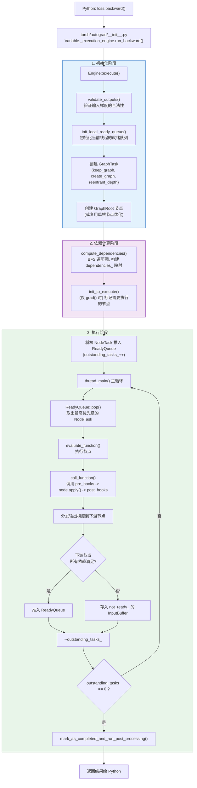
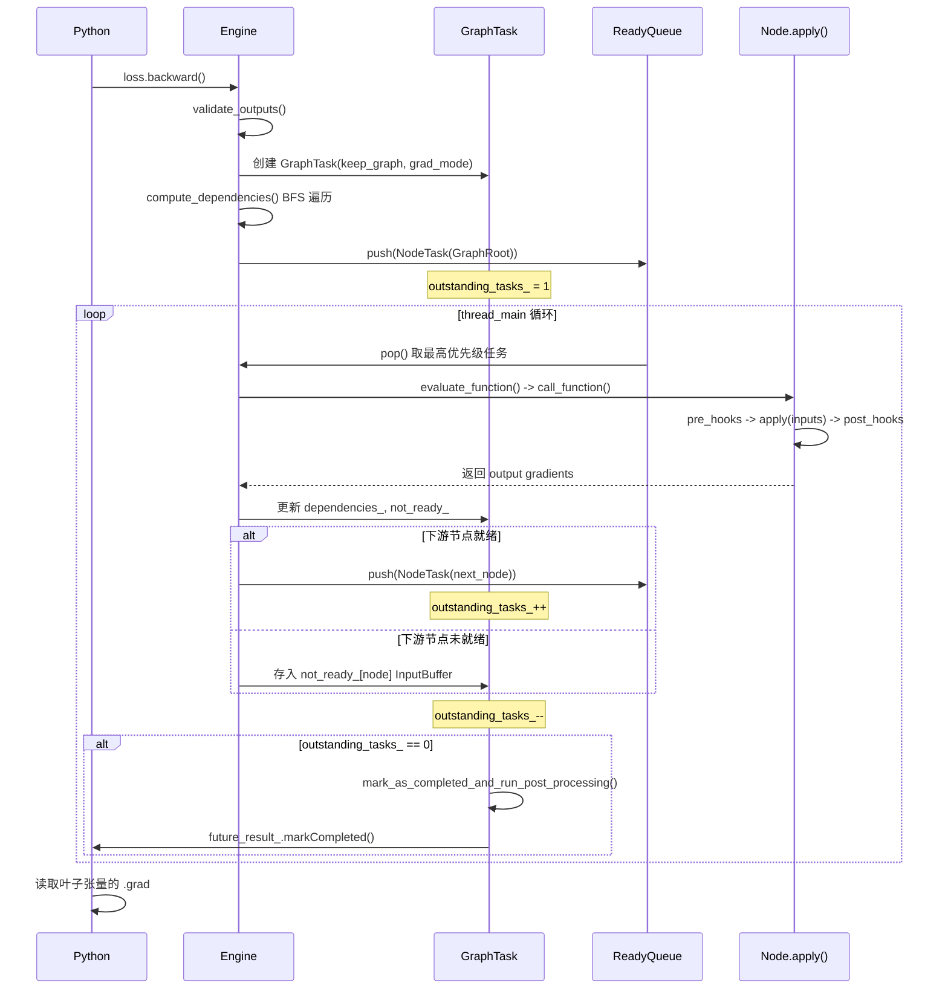
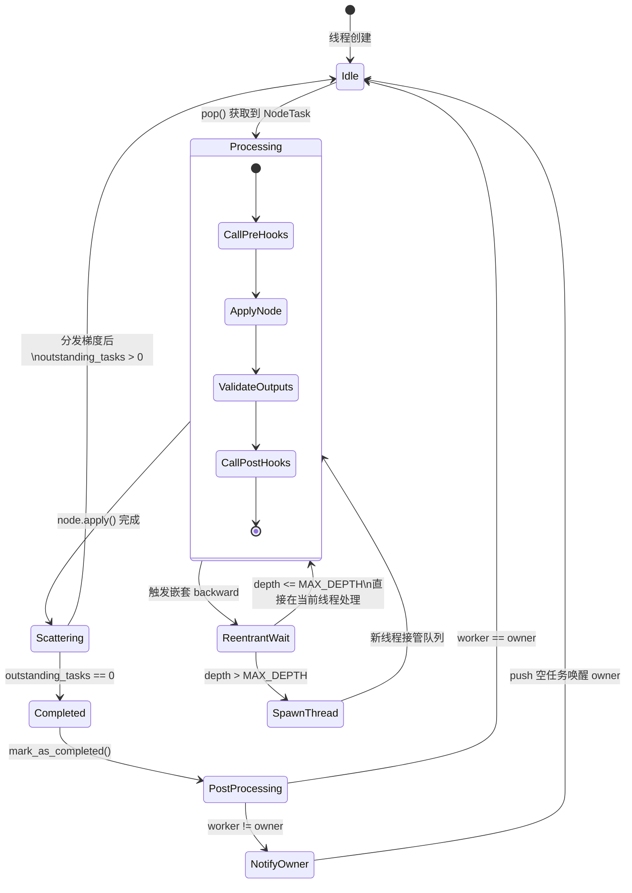

## 1. 概述

Autograd Engine 是 PyTorch 自动微分系统的执行核心。当用户调用 `loss.backward()` 或 `torch.autograd.grad()` 时，真正驱动梯度计算的就是这个 C++ 引擎。它负责遍历计算图、调度节点执行、管理多线程以及处理梯度的累加和分发。

Engine 的核心源码位于：
- `torch/csrc/autograd/engine.h` - 引擎头文件
- `torch/csrc/autograd/engine.cpp` - 引擎实现
- `torch/csrc/autograd/graph_task.h` - 图任务定义

本文将从整体架构到执行细节，深入剖析 Engine 的工作原理。

## 2. 核心数据结构全景

在深入执行流程之前，先认识四个核心数据结构：

| 数据结构 | 职责 |
|---------|------|
| **Engine** | 单例引擎，管理线程池和任务调度 |
| **GraphTask** | 一次 `backward()` 调用的完整上下文 |
| **NodeTask** | 单个待执行节点及其输入 |
| **ReadyQueue** | 按优先级排序的就绪任务队列 |

它们之间的关系可以用一个类比来理解：Engine 是工厂，GraphTask 是一张生产订单，NodeTask 是订单中的一道工序，ReadyQueue 是各工位前的待加工队列。

## 3. Engine 类 - 全局单例引擎

### 3.1 基本结构

Engine 采用单例模式，整个进程中只有一个实例：

```cpp
// torch/csrc/autograd/engine.h
struct TORCH_API Engine {
    static Engine& get_default_engine();
    static Engine& get_base_engine();

    // 禁止拷贝和移动
    Engine(const Engine&) = delete;
    Engine(Engine&&) = delete;

    // 主入口：执行反向传播
    virtual variable_list execute(
        const edge_list& roots,
        const variable_list& inputs,
        bool keep_graph,
        bool create_graph,
        bool accumulate_grad,
        const edge_list& outputs = {});

    // 工作线程的主循环
    virtual void thread_main(const std::shared_ptr<GraphTask>& task);

    // 执行单个节点
    void evaluate_function(
        std::shared_ptr<GraphTask>& graph_task,
        Node* func,
        InputBuffer& inputs,
        const std::shared_ptr<ReadyQueue>& cpu_ready_queue);

protected:
    Engine();

    // 计算依赖关系
    void compute_dependencies(Node* root, GraphTask& task, uint64_t min_topo_nr);

    // 设备就绪队列（每个 GPU 一个）
    std::vector<std::shared_ptr<ReadyQueue>> device_ready_queues_;

    // 最大重入深度
    int max_recursion_depth_{MAX_DEPTH};  // MAX_DEPTH = 60

    // 线程池（处理重入反向传播）
    std::shared_ptr<ThreadPoolShared> thread_pool_shared_;
};
```

### 3.2 线程模型

Engine 采用**混合线程模型**：

- **CPU 线程**：调用 `backward()` 的线程本身会作为 CPU 工作线程，处理 CPU 设备上的 NodeTask
- **设备线程**：每个 GPU/XLA 设备有一个专属的常驻工作线程，处理该设备上的 NodeTask
- **重入线程池**：当发生重入反向传播（backward 中又调用 backward）时，从线程池中获取额外线程

```cpp
// engine.cpp 中的线程局部变量
static thread_local int worker_device = NO_DEVICE;  // 当前线程负责的设备
static thread_local int current_depth = 0;           // 当前重入深度
static thread_local int total_depth = 0;             // 总重入深度
```

### 3.3 MAX_DEPTH 与重入限制

```cpp
// torch/csrc/autograd/engine.h
static constexpr int MAX_DEPTH = 60;
```

`MAX_DEPTH = 60` 限制了同一线程上的重入 backward 嵌套深度。这个值的来源是 ThreadSanitizer (TSAN) 的死锁检测器限制 - 一个线程同时持有超过 65 个锁时 TSAN 会报错。由于每个自定义 C++ autograd Node 都持有一个 mutex，需要限制嵌套深度。超过此限制时，Engine 会启动新线程来处理。

## 4. GraphTask - 反向传播任务

### 4.1 核心定义

每次 `backward()` 或 `grad()` 调用都会创建一个 `GraphTask`，它封装了一次反向传播的完整状态：

```cpp
// torch/csrc/autograd/graph_task.h
struct GraphTask : std::enable_shared_from_this<GraphTask> {
    // 未完成的任务数量（原子计数器）
    std::atomic<uint64_t> outstanding_tasks_{0};

    // 是否发生了错误
    std::atomic_bool has_error_{false};

    // 是否保留计算图
    bool keep_graph_;

    // 还未就绪的节点 -> 其输入缓冲区
    std::unordered_map<Node*, InputBuffer> not_ready_;

    // 节点 -> 剩余依赖计数
    std::unordered_map<Node*, int> dependencies_;

    // 图中的所有节点集合
    std::unordered_set<Node*> nodes_in_graph_;

    // 执行信息（用于选择性执行）
    std::unordered_map<Node*, ExecInfo> exec_info_;

    // 捕获的梯度变量（用于 grad() 返回值）
    std::vector<Variable> captured_vars_;

    // CPU 就绪队列（调用者线程的队列）
    std::shared_ptr<ReadyQueue> cpu_ready_queue_;

    // Future 对象，表示任务完成
    c10::intrusive_ptr<at::ivalue::Future> future_result_;

    // 重入深度
    const int reentrant_depth_;

    // 拥有者设备（调用 backward 的线程所在设备）
    int owner_{NO_DEVICE};
};
```

### 4.2 outstanding_tasks_ - 任务计数器

`outstanding_tasks_` 是一个原子计数器，追踪当前 GraphTask 中尚未完成的 NodeTask 数量。每当一个 NodeTask 被推入 ReadyQueue 时计数器加一，每当一个 NodeTask 被执行完成后计数器减一。当它归零时，表示整个反向传播已完成：

```cpp
bool GraphTask::completed() {
    return outstanding_tasks_.load() == 0 ||
        (exit_on_error_ && has_error_.load());
}
```

### 4.3 not_ready_ - 未就绪节点映射

`not_ready_` 是一个从 `Node*` 到 `InputBuffer` 的映射。当一个节点还有未收到的输入梯度时，已收到的梯度被暂存在该节点对应的 `InputBuffer` 中。只有当节点的所有依赖都满足后（`dependencies_` 计数归零），它才会从 `not_ready_` 中移出并推入 ReadyQueue。

### 4.4 dependencies_ - 依赖计数映射

`dependencies_` 记录了每个节点还需要等待多少个上游节点完成。它在反向传播开始前由 `compute_dependencies()` 方法通过 BFS 遍历计算图建立。每当一个上游节点完成并向下游分发梯度时，对应的依赖计数减一。

### 4.5 exec_info_ - 选择性执行

`exec_info_` 用于支持 `torch.autograd.grad()` 的选择性执行。当用户指定了 `inputs` 参数时，不是图中所有节点都需要执行，只有从输出到指定输入路径上的节点才需要。`exec_info_` 通过 `init_to_execute()` 方法填充，标记哪些节点 `needed_` 为 `True`。

```cpp
struct ExecInfo {
    bool needed_ = false;                              // 是否需要执行
    std::unique_ptr<std::vector<Capture>> captures_;   // 需要捕获的梯度
    bool should_execute() const {
        return needed_ || captures_;
    }
};
```

当 `exec_info_` 非空时，引擎只执行被标记的节点，其余节点被跳过，从而节省不必要的计算。

## 5. NodeTask - 节点执行任务

`NodeTask` 是引擎调度的最小执行单元，封装了一个待执行的节点及其输入：

```cpp
// torch/csrc/autograd/engine.h
struct NodeTask {
    std::weak_ptr<GraphTask> base_;  // 所属的 GraphTask（弱引用）
    std::shared_ptr<Node> fn_;       // 要执行的节点
    InputBuffer inputs_;             // 累积的输入梯度
    bool isShutdownTask_;            // 是否为关闭信号
};
```

使用 `weak_ptr<GraphTask>` 是因为 NodeTask 的生命周期由 ReadyQueue 管理，可能在 GraphTask 已经完成后仍存活，弱引用避免了循环引用。

## 6. ReadyQueue - 优先级就绪队列

### 6.1 结构定义

ReadyQueue 是一个线程安全的优先级队列，存放已就绪可执行的 NodeTask：

```cpp
struct ReadyQueue {
private:
    struct CompareNodeTaskTime {
        bool operator()(NodeTask const& t1, NodeTask const& t2) {
            if (t2.isShutdownTask_) {
                return true;
            } else if (!t1.fn_ || t1.isShutdownTask_) {
                return false;
            } else if (!t2.fn_) {
                return true;
            } else if (t1.getReentrantDepth() == t2.getReentrantDepth()) {
                return t1.fn_->sequence_nr() < t2.fn_->sequence_nr();
            } else {
                return t1.getReentrantDepth() < t2.getReentrantDepth();
            }
        }
    };

    std::condition_variable not_empty_;
    mutable std::mutex mutex_;
    std::priority_queue<NodeTask, std::vector<NodeTask>, CompareNodeTaskTime> heap_;

public:
    void push(NodeTask item, bool incrementOutstandingTasks = true);
    NodeTask pop();  // 阻塞等待
    bool empty() const;
};
```

### 6.2 排序规则 - CompareNodeTaskTime

ReadyQueue 中的任务按以下规则排序（优先级从高到低）：

1. **ShutdownTask** 最优先（用于优雅关闭工作线程）
2. **空节点任务** 次之（用于唤醒阻塞的线程）
3. **更高重入深度**的任务优先（让内层 backward 先完成，避免死锁）
4. **相同重入深度时，`sequence_nr` 更大的优先**（逆创建顺序，即先执行后创建的节点）

```cpp
// 关键比较逻辑：相同重入深度时，按 sequence_nr 从大到小
if (t1.getReentrantDepth() == t2.getReentrantDepth()) {
    return t1.fn_->sequence_nr() < t2.fn_->sequence_nr();
}
```

`sequence_nr` 较大意味着该节点在前向传播中后被创建，对应的操作在前向中后执行，因此在反向传播中应该先被处理。这保证了反向传播按逆拓扑顺序执行。

### 6.3 线程安全机制

ReadyQueue 通过 `mutex_` 保护内部堆结构，通过 `not_empty_` 条件变量实现阻塞等待：

```cpp
auto ReadyQueue::pop() -> NodeTask {
    std::unique_lock<std::mutex> lock(mutex_);
    not_empty_.wait(lock, [this] { return !heap_.empty(); });
    auto task = std::move(const_cast<NodeTask&>(heap_.top()));
    heap_.pop();
    return task;
}

void ReadyQueue::push(NodeTask item, bool incrementOutstandingTasks) {
    {
        std::lock_guard<std::mutex> lock(mutex_);
        if (incrementOutstandingTasks) {
            std::shared_ptr<GraphTask> graph_task = item.base_.lock();
            ++graph_task->outstanding_tasks_;
        }
        heap_.push(std::move(item));
    }
    not_empty_.notify_one();
}
```

## 7. InputBuffer - 梯度累积缓冲区

InputBuffer 为每个节点的每个输入位置维护一个累积缓冲区。当多条边指向同一个节点的同一个输入时，梯度会被自动累加：

```cpp
// torch/csrc/autograd/input_buffer.h
struct InputBuffer {
    explicit InputBuffer(size_t size)
        : buffer(size), opt_accum_streams(size),
          ready_events(size), ready_streams(size) {}

    // 在指定位置累加梯度
    void add(size_t pos, Variable&& var,
             const std::optional<c10::Stream>& opt_producer_stream,
             const std::optional<c10::Stream>& opt_consumer_stream,
             Node* fn);

    std::vector<Variable> buffer;
    std::vector<std::optional<c10::Stream>> opt_accum_streams;
    std::vector<std::optional<c10::Event>> ready_events;
    std::vector<std::optional<c10::Stream>> ready_streams;
};
```

`add()` 方法在向 buffer 中添加梯度时处理了流同步：当 producer 和 consumer 位于不同的 CUDA stream 上时，通过 Event 机制确保正确的顺序。

## 8. 完整执行流程

### 8.1 总体流程图



### 8.2 阶段一 - 初始化

当 Python 侧调用 `loss.backward()` 时，经过 Python 绑定层最终到达 `Engine::execute()`：

```cpp
auto Engine::execute(
    const edge_list& root_edges,      // 根边（loss 的 grad_fn 对应的边）
    const variable_list& inputs,       // 初始梯度（标量 loss 默认为 1.0）
    bool keep_graph,                   // 是否保留图
    bool create_graph,                 // 是否构建梯度的图
    bool accumulate_grad,              // 是否累加梯度（backward=true, grad=false）
    const edge_list& outputs           // 输出边（grad() 的 inputs 参数）
) -> variable_list {
```

初始化步骤：

1. **验证输入**：`validate_outputs()` 检查初始梯度的形状、类型、设备是否与根边匹配
2. **初始化就绪队列**：`init_local_ready_queue()` 为调用线程创建或复用一个 ReadyQueue
3. **创建 GraphTask**：封装本次反向传播的所有状态
4. **创建 GraphRoot**：当有多个根边时，创建 `GraphRoot` 节点作为统一入口。如果只有一个根边且未使用 compiled autograd，则跳过 GraphRoot 直接使用该边的函数节点

```cpp
bool skip_dummy_node = root_edges.size() == 1 && compiled_autograd == nullptr;
auto graph_root = skip_dummy_node
    ? root_edges.at(0).function
    : std::make_shared<GraphRoot>(root_edges, inputs);
```

### 8.3 阶段二 - 依赖计算

`compute_dependencies()` 通过 BFS 遍历计算图，统计每个节点的入度（被多少上游节点依赖）：

```cpp
void Engine::compute_dependencies(Node* root, GraphTask& task, uint64_t min_topo_nr) {
    std::vector<Node*> queue{root};
    auto& dependencies = task.dependencies_;

    while (!queue.empty()) {
        auto fn = queue.back();
        queue.pop_back();

        // 拓扑序号剪枝：跳过不可能到达目标节点的分支
        if (fn->topological_nr() < min_topo_nr) {
            continue;
        }

        for (const auto& edge : fn->next_edges()) {
            if (auto next_ptr = edge.function.get()) {
                dependencies[next_ptr] += 1;
                const bool was_inserted = task.nodes_in_graph_.insert(next_ptr).second;
                if (was_inserted)
                    queue.push_back(next_ptr);
            }
        }
    }
}
```

关键优化：`min_topo_nr` 利用拓扑序号进行剪枝。如果目标输出节点的最小拓扑序号为 $T$，则所有拓扑序号小于 $T$ 的节点一定不在从根到目标的路径上，可以安全跳过。

### 8.4 阶段三 - 执行

执行阶段由 `thread_main()` 驱动，它是工作线程的主循环：

```cpp
auto Engine::thread_main(const std::shared_ptr<GraphTask>& graph_task) -> void {
    while (graph_task == nullptr || !graph_task->future_result_->completed()) {
        NodeTask task = local_ready_queue->pop();  // 阻塞等待

        if (task.isShutdownTask_) break;

        auto local_graph_task = task.base_.lock();
        if (!local_graph_task) continue;

        if (task.fn_ && !local_graph_task->has_error_.load()) {
            GraphTaskGuard guard(local_graph_task);
            NodeGuard ndguard(task.fn_);
            evaluate_function(local_graph_task, task.fn_.get(),
                            task.inputs_, local_graph_task->cpu_ready_queue_);
        }

        --local_graph_task->outstanding_tasks_;

        if (local_graph_task->completed()) {
            local_graph_task->mark_as_completed_and_run_post_processing();
            // 唤醒可能在等待的拥有者线程
            if (worker_device != local_graph_task->owner_) {
                ready_queue_by_index(local_graph_task->cpu_ready_queue_,
                                   local_graph_task->owner_)
                    ->push(NodeTask(local_graph_task, nullptr, InputBuffer(0)));
            }
        }
    }
}
```

`evaluate_function()` 是单个节点的执行逻辑，它完成三件事：

**a) 调用节点的反向计算**

```cpp
// call_function 内部：
auto inputs = call_tensor_pre_hooks(fn, InputBuffer::variables(std::move(inputBuffer)));
inputs = call_pre_hooks(fn, std::move(inputs));
variable_list outputs = fn(std::move(inputs));  // 调用 Node::apply()
validate_outputs(fn.next_edges(), outputs, ...);
return call_post_hooks(fn, std::move(outputs), inputs, had_post_hooks);
```

**b) 释放已用资源**

```cpp
if (!graph_task->keep_graph_) {
    fn.release_variables();  // 释放保存的张量
}
```

**c) 分发输出梯度到下游节点**

```cpp
for (const auto i : c10::irange(num_outputs)) {
    auto& output = outputs[i];
    const auto& next = fn.next_edge(i);

    if (!next.is_valid()) continue;

    // 更新依赖计数
    auto it = dependencies.find(next.function.get());
    bool is_ready = (--it->second == 0);

    auto not_ready_it = not_ready.find(next.function.get());
    if (not_ready_it == not_ready.end()) {
        // 首次收到该节点的梯度，创建 InputBuffer
        InputBuffer input_buffer(next.function->num_inputs());
        input_buffer.add(next.input_nr, std::move(output), ...);

        if (is_ready) {
            queue->push(NodeTask(graph_task, next.function, std::move(input_buffer)));
        } else {
            not_ready.emplace(next.function.get(), std::move(input_buffer));
        }
    } else {
        // 已有 InputBuffer，直接累加
        not_ready_it->second.add(next.input_nr, std::move(output), ...);
        if (is_ready) {
            queue->push(NodeTask(graph_task, next.function,
                                std::move(not_ready_it->second)));
            not_ready.erase(not_ready_it);
        }
    }
}
```

这段逻辑的关键在于 `is_ready` 判断：只有当节点的所有上游依赖都已完成时，才将其推入 ReadyQueue。

### 8.5 反向传播序列图



## 9. 重入反向传播 (Reentrant Backward)

### 9.1 问题场景

重入反向传播发生在 backward 过程中又触发了一次 backward 调用的场景，例如在自定义 autograd.Function 的 backward 方法中调用了另一个需要梯度的操作的 backward。

### 9.2 死锁风险

Engine 的线程模型中，每个设备有一个专属工作线程。如果工作线程在执行某个节点时触发了嵌套的 backward，按照设计它需要阻塞等待嵌套 backward 完成。但该工作线程同时也是处理该设备上所有任务的唯一线程 - 如果嵌套 backward 也需要在同一设备上执行任务，就会死锁。

### 9.3 解决方案

Engine 通过线程池机制解决这个问题：

```cpp
void Engine::reentrant_thread_init() {
    auto tp_shared = thread_pool_shared_;
    while (true) {
        std::unique_lock<std::mutex> lk(tp_shared->mutex_);
        ++tp_shared->num_workers_;
        tp_shared->work_.wait(lk, [&] {
            return !tp_shared->graphtasks_queue_.empty();
        });
        --tp_shared->num_workers_;

        auto task = tp_shared->graphtasks_queue_.front();
        tp_shared->graphtasks_queue_.pop();
        lk.unlock();

        auto graph_task = task.lock();
        if (!graph_task) continue;

        set_device(graph_task->owner_);
        local_ready_queue = ready_queue_by_index(
            graph_task->cpu_ready_queue_, graph_task->owner_);
        total_depth = graph_task->reentrant_depth_;
        thread_main(graph_task);
    }
}
```

当重入深度超过 `MAX_DEPTH` 时：
1. 当前线程将 GraphTask 加入 `thread_pool_shared_->graphtasks_queue_`
2. 如果线程池中有空闲线程，唤醒一个来接管
3. 如果没有空闲线程，创建一个新线程
4. 新线程复用父任务的 ReadyQueue，从而接管处理工作

### 9.4 线程调度状态图



## 10. 流同步与多设备支持

### 10.1 CUDA 流同步

对于涉及 GPU 的反向传播，Engine 需要处理 CUDA 流之间的同步。核心原则是：**反向操作在与前向操作相同的 CUDA 流上执行**。

InputBuffer 的 `add()` 方法在累积梯度时处理流同步：当 producer stream 与 consumer stream 不同时，通过 CUDA Event 确保数据可用性。

### 10.2 GraphTask 的流管理

```cpp
// GraphTask 在创建时记录当前所有活跃设备的流
void GraphTask::stash_current_streams();

// 执行后同步叶子流与调用者流
void GraphTask::exec_post_processing() {
    if (!leaf_streams.empty()) {
        for (const auto& leaf_stream : leaf_streams) {
            const auto& caller_stream = caller_current_streams_[leaf_stream.device_index()];
            if (caller_stream.has_value() && caller_stream != leaf_stream) {
                auto event = c10::Event{leaf_stream.device_type()};
                event.record(leaf_stream);
                caller_stream->wait(event);
            }
        }
    }
    // 在调用者流上执行 final callbacks
}
```

## 11. 错误处理

### 11.1 异常传播

当某个节点执行出错时，Engine 的处理策略：

```cpp
void Engine::thread_on_exception(
    const std::shared_ptr<GraphTask>& graph_task,
    const std::shared_ptr<Node>& fn,
    std::exception& e) {
    graph_task->set_exception(std::current_exception(), fn);
}
```

`set_exception()` 设置 `has_error_` 标志并将异常存入 `future_result_`。其他线程看到 `has_error_` 为 true 后会跳过后续节点的执行。最终，异常通过 Future 机制回传给调用者线程。

### 11.2 异常检测模式

当启用 `torch.autograd.set_detect_anomaly(True)` 时，Engine 在每个节点执行后检查输出是否包含 NaN：

```cpp
if (AnomalyMode::is_enabled() && AnomalyMode::should_check_nan()) {
    for (const auto i : c10::irange(num_outputs)) {
        auto& output = outputs[i];
        TORCH_CHECK(!output.defined() || !isnan(output)._is_any_true().item<bool>(),
            "Function '", fn.name(), "' returned nan values in its ", i, "th output.");
    }
}
```

## 12. 性能优化

Engine 中的关键性能优化策略：

1. **拓扑序号剪枝**：`compute_dependencies()` 中利用 `topological_nr_` 跳过不可达节点
2. **单根优化**：当只有一个根边时跳过 GraphRoot 节点的创建
3. **选择性执行**：`exec_info_` 允许跳过不需要的节点
4. **就绪队列分设备**：CPU 和每个 GPU 有独立的 ReadyQueue，避免竞争
5. **InputBuffer 原地累加**：当引用计数允许时直接原地修改梯度张量
6. **梯度窃取**：在 `AccumulateGrad` 中，当输入梯度的引用计数为 1 时直接 steal 而非拷贝

## 13. 小结

| 组件 | 文件 | 核心职责 |
|------|------|---------|
| `Engine` | `engine.h/cpp` | 全局单例，管理线程池和任务调度 |
| `GraphTask` | `graph_task.h` | 单次 backward 的完整状态 |
| `NodeTask` | `engine.h` | 单个待执行节点任务 |
| `ReadyQueue` | `engine.h` | 按 sequence_nr 排序的就绪队列 |
| `InputBuffer` | `input_buffer.h` | 梯度累积缓冲区 |

Engine 的设计体现了几个工程上的精妙之处：用优先级队列代替严格拓扑排序来实现近似逆序执行；用依赖计数和 not_ready 映射来处理图的汇聚；用线程池和重入深度限制来解决嵌套 backward 的死锁问题；用设备分队列和 CUDA Event 来实现高效的多 GPU 支持。理解这些机制，对于调试复杂的梯度问题、优化训练性能、以及实现自定义 autograd 扩展都有重要帮助。
