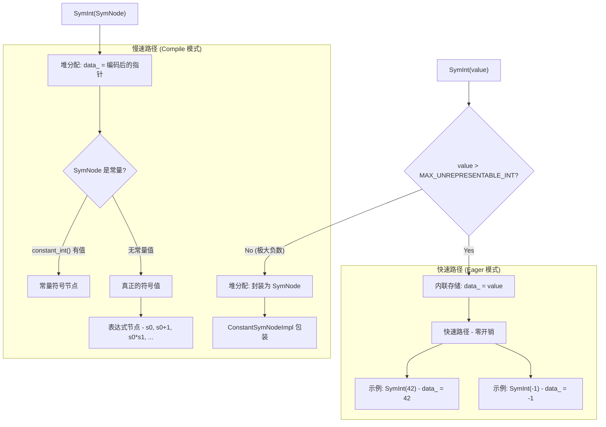
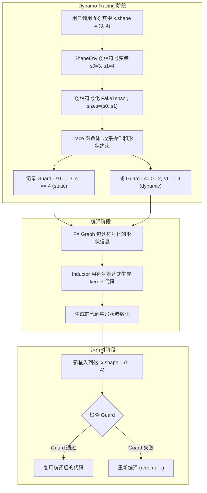

> 难度：高级 | 前置知识：了解 TensorImpl 结构、torch.compile 基本概念、Guard 机制

在传统的 eager 执行模式下，Tensor 的形状总是具体的整数值。但当进入 `torch.compile` 的编译模式时，形状可能变成**符号化的** -- 它们不再是确定的数字，而是可以表示一组形状约束的符号表达式。本文深入分析 `SymInt`、`SymNode`、`SymbolicShapeMeta` 这三个核心组件，以及它们如何支撑 PyTorch 的动态形状编译。

---

## 1. 为什么需要符号化形状

### 1.1 问题背景

考虑一个简单的函数和它的编译过程：

```python
@torch.compile
def f(x):
    return x.sum(dim=0)
```

当 `f(torch.randn(3, 4))` 首次被调用时，Dynamo 会 trace 这个函数，记录下所有操作。此时 `x.shape == (3, 4)` 是具体值。

但如果我们希望编译后的代码也能处理 `f(torch.randn(5, 4))` 或 `f(torch.randn(7, 4))`（第一维动态），就不能把形状硬编码为 `(3, 4)`。我们需要一种方式表示"第一维是某个正整数，第二维固定为 4"。

这就是符号化形状的核心需求：**在编译期用符号变量替代具体的维度大小，生成对一组形状都有效的代码，并在运行时通过 Guard 验证输入是否满足约束。**

### 1.2 设计目标

符号化形状系统需要满足几个关键要求：

1. **零开销原则** -- 在 eager 模式下，SymInt 应该和普通 int64_t 一样快
2. **透明替换** -- SymInt 的 API 应该与 int64_t 兼容，让大量使用 size/stride 的 C++ 代码无需修改
3. **表达式追踪** -- 对 SymInt 进行算术运算应该自动构建表达式树
4. **Guard 生成** -- 能够从符号表达式中生成运行时检查条件

---

## 2. SymInt - 核心值类型

### 2.1 定义与内存布局

`SymInt`（`c10/core/SymInt.h`）是 PyTorch 中最重要的符号化类型。它在概念上是 `int64_t` 和 `SymNode`（符号表达式节点指针）的联合体，但实际上只占用一个 `int64_t` 的空间（8 字节）。

```cpp
// c10/core/SymInt.h
class SymInt {
 private:
  int64_t data_;
  // data_ 的高位编码了它的类型：
  // - 正数和小负数：直接作为 int64_t 使用
  // - 特殊位模式：data_ 实际上是一个指向 SymNodeImpl 的指针
};
```

这种紧凑的表示通过**位标记（tagged pointer）**实现。核心的判断逻辑如下：

```cpp
// 位掩码定义
static constexpr uint64_t MASK = 1ULL << 63 | 1ULL << 62 | 1ULL << 61;
static constexpr uint64_t IS_SYM = 1ULL << 63 | 1ULL << 61;

// 判断是否为堆上分配的 SymNode（即符号值或大负数）
bool is_heap_allocated() const {
    return !check_range(data_);
}

// 范围检查：正数和小负数可以直接表示
static bool check_range(int64_t i) {
    return i > MAX_UNREPRESENTABLE_INT;  // MAX_UNREPRESENTABLE_INT ≈ -2^62
}
```

### 2.2 决策树 - SymInt 的取值路径



### 2.3 快速路径与慢速路径

SymInt 的每个算术运算都有快速路径和慢速路径。以加法为例：

```cpp
SymInt operator+(const SymInt& sci) const {
    if (auto ma = maybe_as_int()) {       // 尝试快速路径
        if (auto mb = sci.maybe_as_int()) {
            return SymInt(*ma + *mb);       // 两个都是具体值：直接整数加法
        }
    }
    return operator_add_slow_path(sci);    // 至少一个是符号值：构建表达式
}
```

`maybe_as_int()` 是关键的分支判断：

```cpp
std::optional<int64_t> maybe_as_int() const {
    if (!is_heap_allocated()) {
        return data_;            // 内联值，直接返回
    }
    return maybe_as_int_slow_path();  // 堆上值，可能是常量 SymNode
}
```

在 eager 模式下，所有 SymInt 都是内联的具体值，`maybe_as_int()` 总是返回有值的 optional，走快速路径。编译器可以将这个分支完全优化掉，实现真正的零开销。

### 2.4 SymFloat 和 SymBool

除了 `SymInt`，PyTorch 还有 `SymFloat` 和 `SymBool`，它们使用相同的设计模式：

- `SymFloat`：用于符号化的浮点值（较少使用）
- `SymBool`：用于符号化的布尔值，在形状比较（如 `s0 > 0`）中产生

SymBool 在 Guard 生成中尤为重要。当编译期对比两个 SymInt 时：

```cpp
SymBool sym_eq(const SymInt& sci) const {
    // 如果两个都是具体值，返回具体的 SymBool
    // 否则返回一个符号化的 SymBool，记录了这个比较操作
}
```

---

## 3. SymNode - 符号表达式节点

### 3.1 接口定义

`SymNodeImpl`（`c10/core/SymNodeImpl.h`）是符号表达式树的节点接口：

```cpp
class SymNodeImpl : public c10::intrusive_ptr_target {
 public:
  virtual bool is_int() { TORCH_CHECK(false, "NYI"); }
  virtual bool is_bool() { TORCH_CHECK(false, "NYI"); }
  virtual bool is_float() { TORCH_CHECK(false, "NYI"); }

  // 算术操作 -- 返回新的 SymNode（构建表达式树）
  virtual SymNode add(const SymNode& other);
  virtual SymNode sub(const SymNode& other);
  virtual SymNode mul(const SymNode& other);
  virtual SymNode int_floordiv(const SymNode& other);
  virtual SymNode mod(const SymNode& other);

  // 比较操作 -- 返回的 SymNode 是 bool 类型
  virtual SymNode eq(const SymNode& other);
  virtual SymNode lt(const SymNode& other);
  virtual SymNode le(const SymNode& other);
  virtual SymNode gt(const SymNode& other);
  virtual SymNode ge(const SymNode& other);

  // Guard 相关
  virtual int64_t guard_int(const char* file, int64_t line);
  virtual bool guard_bool(const char* file, int64_t line);

  // 类型查询
  virtual std::optional<int64_t> constant_int();
  virtual bool is_symbolic();

  virtual std::string str();
};
```

### 3.2 核心实现 - PythonSymNodeImpl

在 `torch.compile` 的 Python 侧，`SymNode` 的实际实现是 `PythonSymNodeImpl`，它将所有操作委托给 Python 层的 `torch.fx.experimental.symbolic_shapes` 模块：

- 每个 `SymNode` 对应 `sympy` 中的一个符号表达式
- 算术操作会在 `sympy` 表达式树上构建新的节点
- `guard_int()` 会在 `ShapeEnv` 中注册一个 Guard

### 3.3 ConstantSymNodeImpl

对于需要堆分配但实际上是常量的情况（例如极大的负数），使用 `ConstantSymNodeImpl`（`c10/core/ConstantSymNodeImpl.h`）：

```cpp
class ConstantSymNodeImpl : public SymNodeImpl {
  // 持有一个具体的 int64_t / double / bool 值
  // 所有算术操作直接在具体值上计算
  // constant_int() 返回具体值（这是 SymInt::is_symbolic() 判断的依据）
};
```

---

## 4. SymbolicShapeMeta - TensorImpl 中的符号形状存储

### 4.1 在 TensorImpl 中的位置

`TensorImpl` 通过 `ExtraMeta` 结构体持有可选的 `SymbolicShapeMeta`：

```cpp
// c10/core/TensorImpl.h (简化)
struct ExtraMeta {
  std::unique_ptr<SymbolicShapeMeta> symbolic_shape_meta_ = nullptr;
  // ... 其他 extra metadata
};

class TensorImpl {
  // 普通 Tensor 不分配 extra_meta_
  // 当 Tensor 需要符号化形状时，extra_meta_->symbolic_shape_meta_ 被创建
  std::unique_ptr<ExtraMeta> extra_meta_ = nullptr;
};
```

只有在 `torch.compile` 的 tracing 过程中，Tensor 才会拥有非空的 `symbolic_shape_meta_`。在 eager 模式下，形状信息存储在 `TensorImpl` 内部的 `SizesAndStrides` 结构体中（纯 int64_t），不涉及 SymInt。

### 4.2 SymbolicShapeMeta 详解

`SymbolicShapeMeta`（`c10/core/SymbolicShapeMeta.h`）存储了 Tensor 的完整符号化元信息：

```cpp
class SymbolicShapeMeta {
 public:
  // 核心元数据
  SymDimVector sizes_ = {0};      // 符号化的形状
  SymDimVector strides_ = {1};    // 符号化的步长
  SymInt storage_offset_ = 0;     // 符号化的存储偏移
  bool strides_valid_ = true;     // 部分布局（如 Sparse）没有 stride

  // 惰性计算的派生属性（带缓存）
  mutable SymInt numel_ = 1;
  mutable SymBool is_contiguous_{true};
  mutable SymBool is_channels_last_contiguous_{false};
  mutable SymBool is_channels_last_{false};
  mutable SymBool is_non_overlapping_and_dense_{true};
  // ...
};
```

派生属性使用位标记 + 惰性初始化模式：

```cpp
const SymInt& numel() const {
    if (C10_UNLIKELY(!has_numel())) {
        init_numel();  // 第一次访问时计算 numel = prod(sizes_)
    }
    return numel_;
}
```

这种设计避免了每次修改 size 时都重新计算所有派生属性。只有在实际访问时才触发计算，且计算结果会被缓存直到下次 size 变更。

### 4.3 TensorImpl 中的分支逻辑

`TensorImpl` 的形状访问方法根据是否有符号化形状进行分支：

```cpp
// c10/core/TensorImpl.h (简化)
SymIntArrayRef sym_sizes() const {
    if (C10_UNLIKELY(has_symbolic_sizes_strides_)) {
        return symbolic_shape_meta().sizes_;      // 返回 SymInt 形状
    }
    // 将 int64_t 的 size 重新解释为 SymInt（零开销，因为 SymInt 和 int64_t 同构）
    return SymIntArrayRef(
        reinterpret_cast<const SymInt*>(sizes_and_strides_.sizes_data()),
        sizes_and_strides_.size());
}
```

`has_symbolic_sizes_strides_` 是 `TensorImpl` 上的一个 bool flag，标记是否使用符号化路径。这个标记在 Dynamo tracing 时被设置。

---

## 5. 与 torch.compile / Dynamo 的集成

### 5.1 ShapeEnv - 形状环境

`ShapeEnv`（`torch/fx/experimental/symbolic_shapes.py`）是符号化形状系统的中枢：

```python
class ShapeEnv:
    """维护符号变量和约束的全局环境"""

    def __init__(self):
        self.guards = []           # 收集的 Guard 列表
        self.var_to_val = {}       # 符号变量 -> 当前具体值的映射
        self.var_to_range = {}     # 符号变量 -> 值域范围
        self.replacements = {}     # 符号变量之间的等价替换
        # ...
```

### 5.2 符号化形状的生命周期



### 5.3 Dynamic 模式下的形状处理

当用 `torch.compile(dynamic=True)` 时，Dynamo 对形状采取更宽松的策略：

1. **首次 trace**：为每个维度创建符号变量（如 `s0`、`s1`）
2. **约束推导**：根据操作自动推导约束（如 `s0 >= 1`）
3. **Guard 生成**：只生成必要的 Guard（如 `s1 == 4`，对静态维度），而动态维度只检查范围

这意味着编译后的 kernel 能够处理任意的 `s0` 值，只要它满足推导出的约束。

### 5.4 Guard 的生成

当 SymInt 被"具体化"（即需要知道其实际值）时，会触发 Guard 的生成：

```cpp
// SymInt::guard_int() - 在编译期注册 Guard
int64_t guard_int(const char* file, int64_t line) const;
```

调用 `guard_int` 意味着"我需要这个值在运行时等于当前的具体值"。这会在 `ShapeEnv` 中注册一个等式 Guard。

更精细的 Guard API：
- `guard_int(file, line)` -- 精确匹配
- `guard_bool(file, line)` -- 布尔条件固定
- `guard_size_oblivious(file, line)` -- 忽略大小为 0 或 1 的特殊情况
- `expect_true(file, line)` -- 期望为真但不硬性约束

---

## 6. 实际影响 - 当形状变为 dynamic

### 6.1 对算子实现的影响

当形状为符号化时，C++ 算子中的形状相关逻辑会发生变化：

```cpp
// Eager 模式（具体值）
int64_t numel = x.numel();           // 返回具体的 int64_t
if (numel == 0) { return empty(); }  // 直接比较

// Compile 模式（符号值）
SymInt numel = x.sym_numel();        // 可能返回符号表达式
// if (numel == 0) 会触发 guard_bool，将条件固定
// 替代方案：使用 TORCH_GUARD_OR_FALSE 进行条件分支
```

### 6.2 expect_int 与 maybe_as_int

算子代码中处理 SymInt 有两种常见策略：

```cpp
// 策略 1：要求具体值，不支持符号化（会报错提示）
int64_t n = size.expect_int();
// 如果 size 是符号化的，抛出异常

// 策略 2：尝试获取具体值，失败时走符号化路径
if (auto n = size.maybe_as_int()) {
    // 具体值的快速路径
    do_something_concrete(*n);
} else {
    // 符号化的通用路径
    do_something_symbolic(size);
}
```

### 6.3 常见的 Guard 过度特化问题

如果算子代码不当地使用了 `guard_int` 或隐式地将 SymInt 转为 int64_t，会导致**过度特化（overspecialization）**：

```python
@torch.compile(dynamic=True)
def f(x):
    if x.shape[0] > 10:    # 这个比较会生成 Guard
        return x.sum()
    return x.mean()
```

对于输入 `shape=(15,)`，会生成 Guard `s0 > 10`。如果后续输入 `shape=(5,)`，Guard 失败，触发重编译。这是预期的行为。但如果算子内部不必要地调用了 `guard_int`（例如为了打印调试信息），就会生成精确等式 Guard，导致每次形状变化都重编译。

---

## 7. 小结

| 概念 | 核心文件 | 职责 |
|------|----------|------|
| **SymInt** | `c10/core/SymInt.h` | 统一表示具体整数或符号整数的值类型（8 字节，tagged union） |
| **SymNode / SymNodeImpl** | `c10/core/SymNodeImpl.h` | 符号表达式节点的接口，支持算术和比较操作 |
| **SymbolicShapeMeta** | `c10/core/SymbolicShapeMeta.h` | 存储 Tensor 的符号化 sizes/strides/storage_offset 及惰性派生属性 |
| **ShapeEnv** | `torch/fx/experimental/symbolic_shapes.py` | 维护符号变量、约束、Guard 的全局环境 |
| **SymBool** | `c10/core/SymBool.h` | 符号化布尔值，用于表示形状比较的结果 |
| **SymFloat** | `c10/core/SymFloat.h` | 符号化浮点值（使用场景较少） |

符号化形状是 `torch.compile` 能够处理动态形状输入的基石。它的设计在两个看似矛盾的目标之间取得了精妙的平衡：

1. **Eager 模式下零开销** -- 通过 tagged pointer 和内联存储，SymInt 在 eager 模式下与 int64_t 性能完全相同
2. **Compile 模式下完整追踪** -- 通过 SymNode 的虚函数分发，所有形状相关的计算都能被追踪并生成等价的符号表达式

理解这套机制，是深入 Dynamo/Inductor 编译器内部的必备知识。
