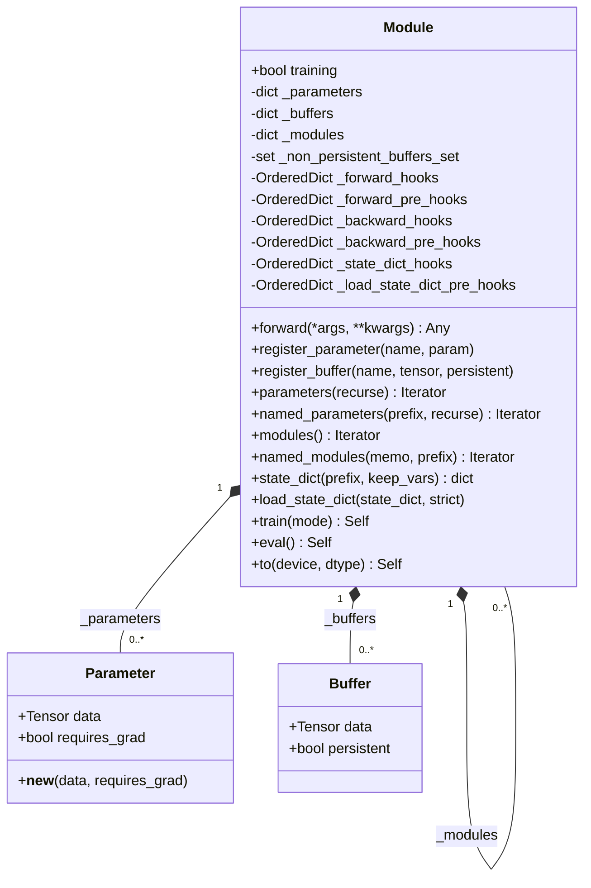
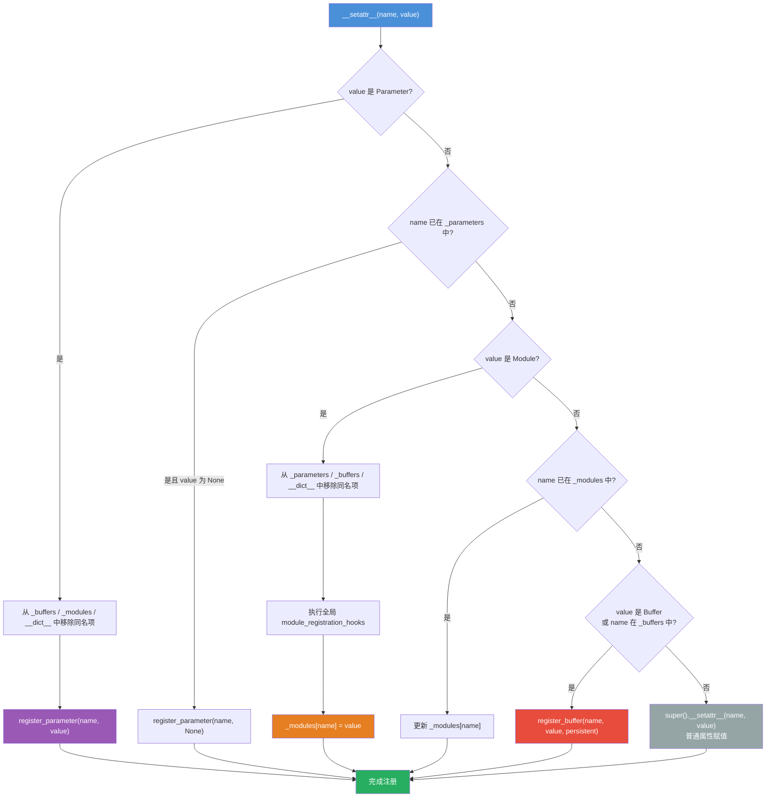
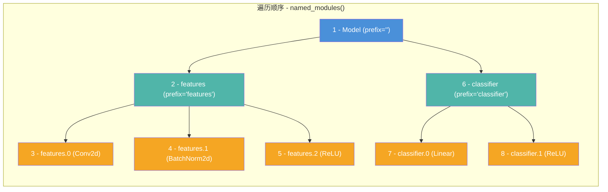

## 1. 概述

`torch.nn.Module` 是 PyTorch 神经网络的基石类，定义在 `torch/nn/modules/module.py` 中。本文将从源码层面深入分析 Module 的核心机制：初始化体系、属性拦截与自动注册、Parameter 类的设计、Buffer 系统、递归遍历算法、以及模式切换与设备迁移。

源码文件定位：
- Module 主体：`torch/nn/modules/module.py`
- Parameter 类：`torch/nn/parameter.py`

## 2. `__init__` 初始化体系

### 2.1 源码分析

Module 的 `__init__` 通过 `super().__setattr__` 直接在实例字典中设置初始属性，以绕开 `Module.__setattr__` 的拦截逻辑（后者会尝试注册 Parameter 和子模块，而此时注册所需的容器字典还不存在）：

```python
# torch/nn/modules/module.py
class Module:
    training: bool
    _parameters: dict[str, Parameter | None]
    _buffers: dict[str, Tensor | None]
    _non_persistent_buffers_set: set[str]
    _modules: dict[str, Optional["Module"]]

    def __init__(self, *args, **kwargs) -> None:
        """Initialize internal Module state."""
        torch._C._log_api_usage_once("python.nn_module")

        super().__setattr__("training", True)
        super().__setattr__("_parameters", {})
        super().__setattr__("_buffers", {})
        super().__setattr__("_non_persistent_buffers_set", set())
        super().__setattr__("_backward_pre_hooks", OrderedDict())
        super().__setattr__("_backward_hooks", OrderedDict())
        super().__setattr__("_is_full_backward_hook", None)
        super().__setattr__("_forward_hooks", OrderedDict())
        super().__setattr__("_forward_hooks_with_kwargs", OrderedDict())
        super().__setattr__("_forward_hooks_always_called", OrderedDict())
        super().__setattr__("_forward_pre_hooks", OrderedDict())
        super().__setattr__("_forward_pre_hooks_with_kwargs", OrderedDict())
        super().__setattr__("_state_dict_hooks", OrderedDict())
        super().__setattr__("_state_dict_pre_hooks", OrderedDict())
        super().__setattr__("_load_state_dict_pre_hooks", OrderedDict())
        super().__setattr__("_load_state_dict_post_hooks", OrderedDict())
        super().__setattr__("_modules", {})
```

### 2.2 初始化的核心数据结构

| 属性名 | 类型 | 作用 |
|--------|------|------|
| `_parameters` | `dict[str, Parameter \| None]` | 存储所有注册的参数 |
| `_buffers` | `dict[str, Tensor \| None]` | 存储所有注册的缓冲区 |
| `_modules` | `dict[str, Module \| None]` | 存储所有注册的子模块 |
| `_non_persistent_buffers_set` | `set[str]` | 标记不持久化的 Buffer 名称 |
| `training` | `bool` | 训练模式标志，默认 `True` |
| `_forward_hooks` | `OrderedDict` | 前向传播后置钩子 |
| `_forward_pre_hooks` | `OrderedDict` | 前向传播前置钩子 |
| `_backward_hooks` | `OrderedDict` | 反向传播后置钩子 |
| `_backward_pre_hooks` | `OrderedDict` | 反向传播前置钩子 |
| `_state_dict_hooks` | `OrderedDict` | 状态字典导出钩子 |

使用 `super().__setattr__` 而非 `self.xxx = xxx` 是一个关键的工程决策。由于 Module 重写了 `__setattr__`（见下文），直接赋值会触发类型检测逻辑，而此时 `_parameters` 等字典尚未创建，会导致 `AttributeError`。



## 3. `__setattr__` - 属性拦截与自动注册

### 3.1 核心机制

`__setattr__` 是 Module 最精妙的设计之一。当开发者在 `__init__` 中写 `self.conv = nn.Conv2d(...)` 或 `self.weight = nn.Parameter(...)` 时，这些赋值操作会被 `__setattr__` 拦截，并根据值的类型自动注册到对应的容器中：

```python
def __setattr__(self, name: str, value: Union[Tensor, "Module"]) -> None:
    def remove_from(*dicts_or_sets) -> None:
        for d in dicts_or_sets:
            if name in d:
                if isinstance(d, dict):
                    del d[name]
                else:
                    d.discard(name)

    params = self.__dict__.get("_parameters")
    if isinstance(value, Parameter):
        if params is None:
            raise AttributeError(
                "cannot assign parameters before Module.__init__() call"
            )
        remove_from(
            self.__dict__,
            self._buffers,
            self._modules,
            self._non_persistent_buffers_set,
        )
        self.register_parameter(name, value)
    elif params is not None and name in params:
        if value is not None:
            raise TypeError(...)
        self.register_parameter(name, value)
    else:
        modules = self.__dict__.get("_modules")
        if isinstance(value, Module):
            if modules is None:
                raise AttributeError(
                    "cannot assign module before Module.__init__() call"
                )
            remove_from(
                self.__dict__,
                self._parameters,
                self._buffers,
                self._non_persistent_buffers_set,
            )
            for hook in _global_module_registration_hooks.values():
                output = hook(self, name, value)
                if output is not None:
                    value = output
            modules[name] = value
        elif modules is not None and name in modules:
            if value is not None:
                raise TypeError(...)
            for hook in _global_module_registration_hooks.values():
                output = hook(self, name, value)
                if output is not None:
                    value = output
            modules[name] = value
        else:
            buffers = self.__dict__.get("_buffers")
            if isinstance(value, Buffer) or buffers is not None and name in buffers:
                # 注册为 Buffer
                ...
            else:
                super().__setattr__(name, value)
```

### 3.2 决策流程图



### 3.3 `remove_from` 的互斥保证

在注册新属性前，`remove_from` 会清除其他容器中的同名条目。这保证了一个名称在 `_parameters`、`_modules`、`_buffers`、`__dict__` 中最多只存在于一个容器中。例如先定义 `self.fc = nn.Linear(10, 5)`（注册为子模块），后来改为 `self.fc = nn.Parameter(torch.randn(10))`，则 `fc` 会从 `_modules` 中移除并注册到 `_parameters`。

## 4. Parameter 类

### 4.1 源码分析

`Parameter` 定义在 `torch/nn/parameter.py` 中，是 `torch.Tensor` 的子类：

```python
class _ParameterMeta(torch._C._TensorMeta):
    def __instancecheck__(self, instance) -> bool:
        if self is Parameter:
            if isinstance(instance, torch.Tensor) and getattr(
                instance, "_is_param", False
            ):
                return True
        return super().__instancecheck__(instance)


class Parameter(torch.Tensor, metaclass=_ParameterMeta):
    def __new__(cls, data=None, requires_grad=True):
        if data is None:
            data = torch.empty(0)
        if type(data) is torch.Tensor or type(data) is Parameter:
            return torch.Tensor._make_subclass(cls, data, requires_grad)

        # 自定义 Tensor 子类的路径
        t = data.detach().requires_grad_(requires_grad)
        t._is_param = True
        return t
```

关键设计要点：

1. **`requires_grad` 默认 `True`**：这是 Parameter 与普通 Tensor 的核心区别，使其天然参与梯度计算
2. **`_ParameterMeta` 元类**：通过重写 `__instancecheck__`，让设置了 `_is_param=True` 标志的自定义 Tensor 子类也能通过 `isinstance(t, Parameter)` 检查
3. **`_make_subclass`**：对于标准 Tensor，使用 C++ 层面的子类化机制创建 Parameter 实例，避免数据拷贝

### 4.2 Parameter 与普通 Tensor 的行为差异

```python
import torch
import torch.nn as nn

module = nn.Module()

# Parameter 自动注册
module.weight = nn.Parameter(torch.randn(3, 4))
print(list(module.parameters()))   # [Parameter containing: tensor(...)]

# 普通 Tensor 不会注册为参数
module.cache = torch.randn(3, 4)
print(list(module.parameters()))   # [Parameter containing: tensor(...)]
# cache 只存在于 __dict__ 中，不会被 parameters() 返回
```

## 5. Buffer 系统

### 5.1 register_buffer

Buffer 用于存储不参与梯度计算但属于模型状态的张量，通过 `register_buffer` 方法注册：

```python
def register_buffer(
    self, name: str, tensor: Tensor | None, persistent: bool = True
) -> None:
    # 验证 name 合法性（非空、非 '.' 分隔、非已注册的属性等）
    ...
    if persistent is False and isinstance(self, torch.jit.ScriptModule):
        raise RuntimeError("ScriptModule does not support non-persistent buffers")

    if '_buffers' not in self.__dict__:
        raise AttributeError(
            "cannot assign buffer before Module.__init__() call"
        )
    elif not isinstance(name, str):
        raise TypeError(...)
    elif '.' in name:
        raise KeyError(...)
    elif name == '':
        raise KeyError(...)
    elif hasattr(self, name) and name not in self._buffers:
        raise KeyError(...)
    elif tensor is not None and not isinstance(tensor, torch.Tensor):
        raise TypeError(...)
    else:
        for hook in _global_buffer_registration_hooks.values():
            output = hook(self, name, tensor)
            if output is not None:
                tensor = output
        self._buffers[name] = tensor
        if persistent:
            self._non_persistent_buffers_set.discard(name)
        else:
            self._non_persistent_buffers_set.add(name)
```

### 5.2 persistent 参数

- `persistent=True`（默认）：Buffer 会出现在 `state_dict()` 中，随模型保存/加载
- `persistent=False`：Buffer 不会出现在 `state_dict()` 中，仅在内存中存在

典型用例：BatchNorm 的 `running_mean` 和 `running_var` 是 persistent Buffer，随模型保存；而某些临时缓存可以设为 non-persistent。

## 6. 递归遍历机制

### 6.1 `parameters()` 和 `named_parameters()`

`parameters()` 委托给 `named_parameters()`，后者通过 `_named_members` 实现递归遍历：

```python
def named_parameters(
    self, prefix: str = "", recurse: bool = True, remove_duplicate: bool = True
) -> Iterator[tuple[str, Parameter]]:
    gen = self._named_members(
        lambda module: module._parameters.items(),
        prefix=prefix,
        recurse=recurse,
        remove_duplicate=remove_duplicate,
    )
    yield from gen
```

`_named_members` 是通用的成员遍历方法，接受一个提取函数，递归遍历模块树，返回 `(name, member)` 对。`remove_duplicate=True` 时使用 `memo` 集合去重，防止共享参数被重复返回。

### 6.2 `modules()` 和 `named_modules()`

`named_modules()` 实现了模块树的遍历：

```python
def named_modules(
    self, memo: set["Module"] | None = None, prefix: str = "", remove_duplicate: bool = True
):
    if memo is None:
        memo = set()
    if self not in memo:
        if remove_duplicate:
            memo.add(self)
        yield prefix, self
        for name, module in self._modules.items():
            if module is None:
                continue
            submodule_prefix = prefix + ("." if prefix else "") + name
            yield from module.named_modules(memo, submodule_prefix, remove_duplicate)
```

遍历策略是**前序深度优先遍历（DFS）**：先返回当前模块，再递归遍历子模块。`memo` 集合用于处理参数共享（同一个模块被引用多次）的情况。

### 6.3 模块树遍历示例



### 6.4 children() vs modules()

- `children()`：只返回**直接子模块**（`_modules` 的值），不递归
- `modules()`：返回自身及**所有后代模块**，递归遍历整棵树

```python
# children() 只返回 features 和 classifier
for name, child in model.named_children():
    print(name)  # 'features', 'classifier'

# modules() 返回所有模块，包括嵌套
for name, mod in model.named_modules():
    print(name)  # '', 'features', 'features.0', 'features.1', ...
```

## 7. `train()` / `eval()` - 模式切换

### 7.1 源码实现

```python
def train(self, mode: bool = True) -> Self:
    if not isinstance(mode, bool):
        raise ValueError("training mode is expected to be boolean")
    self.training = mode
    for module in self.children():
        module.train(mode)
    return self

def eval(self) -> Self:
    return self.train(False)
```

实现极其简洁：递归地将自身和所有子模块的 `training` 属性设为 `mode`。`eval()` 本质上就是 `train(False)`。

### 7.2 training 标志的影响

`training` 标志本身不改变任何计算逻辑。它只是一个标志，由各子模块的 `forward()` 方法自行读取并决定行为：

- **Dropout**：`training=True` 时随机置零，`training=False` 时直接通过
- **BatchNorm**：`training=True` 时使用 batch 统计量并更新 running stats，`training=False` 时使用 running stats
- **自定义模块**：开发者可在 `forward()` 中通过 `if self.training:` 切换行为

## 8. `to()` - 设备与精度迁移

### 8.1 源码分析

`to()` 方法支持多种调用签名，核心逻辑是对模块树中的每个参数和 Buffer 执行转换：

```python
def to(self, *args, **kwargs):
    ...
    def convert(t):
        try:
            if convert_to_format is not None and t.dim() in (4, 5):
                return t.to(
                    device, dtype if t.is_floating_point() or t.is_complex() else None,
                    non_blocking, memory_format=convert_to_format,
                )
            return t.to(
                device, dtype if t.is_floating_point() or t.is_complex() else None,
                non_blocking,
            )
        except NotImplementedError as e:
            ...

    return self._apply(convert)
```

`_apply` 方法递归遍历模块树，对每个参数和 Buffer 应用转换函数：

```python
def _apply(self, fn, recurse=True):
    if recurse:
        for module in self.children():
            module._apply(fn)

    for key, param in self._parameters.items():
        if param is None:
            continue
        with torch.no_grad():
            param_applied = fn(param)
        ...
        self._parameters[key] = Parameter(param_applied, param.requires_grad)

    for key, buf in self._buffers.items():
        if buf is not None:
            self._buffers[key] = fn(buf)

    return self
```

### 8.2 设计要点

1. **只转换浮点和复数类型**：整型参数/Buffer 只迁移设备，不改变 dtype
2. **in-place 操作**：`to()` 修改模块自身并返回 `self`
3. **递归执行**：通过 `_apply` 递归遍历所有子模块
4. **参数重新包装**：转换后的数据会重新包装为 `Parameter`，保留 `requires_grad` 属性

## 9. `__getattr__` - 属性访问

Module 也重写了 `__getattr__`（注意不是 `__getattribute__`），用于从 `_parameters`、`_buffers`、`_modules` 中查找属性：

```python
def __getattr__(self, name: str) -> Any:
    _parameters = self.__dict__.get("_parameters")
    if _parameters is not None and name in _parameters:
        return _parameters[name]
    _buffers = self.__dict__.get("_buffers")
    if _buffers is not None and name in _buffers:
        return _buffers[name]
    _modules = self.__dict__.get("_modules")
    if _modules is not None and name in _modules:
        return _modules[name]
    raise AttributeError(
        f"'{type(self).__name__}' object has no attribute '{name}'"
    )
```

Python 的属性查找顺序：先查 `__getattribute__`（会查 `__dict__` 和类属性），找不到再调用 `__getattr__`。由于 `__setattr__` 将 Parameter/Module/Buffer 存入了专用字典而非 `__dict__`，所以需要 `__getattr__` 来完成属性访问。

## 10. 总结

Module 的核心机制可以概括为以下几个设计要点：

1. **三字典分离存储**：`_parameters`、`_buffers`、`_modules` 分别管理不同类型的数据，使参数遍历、序列化、设备迁移等操作可以针对性处理
2. **`__setattr__` 拦截**：透明地将赋值操作转换为注册操作，开发者无需手动调用 `register_parameter` 或 `register_module`
3. **递归树结构**：所有操作（参数遍历、模式切换、设备迁移）都递归地作用于整棵模块树
4. **Parameter 作为 Tensor 子类**：利用继承关系，Parameter 可以参与所有 Tensor 运算，同时通过类型标识被 `__setattr__` 识别并自动注册
5. **`_apply` 作为通用转换框架**：`to()`、`cpu()`、`cuda()`、`float()`、`half()` 等方法底层都委托给 `_apply`，实现了统一的递归转换机制

这些设计共同构成了一个简洁而强大的抽象层，让开发者只需关注网络结构和前向传播逻辑，而参数管理、序列化、设备迁移等工程问题由 Module 框架自动处理。
