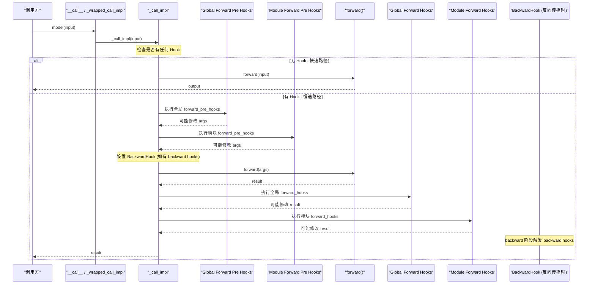
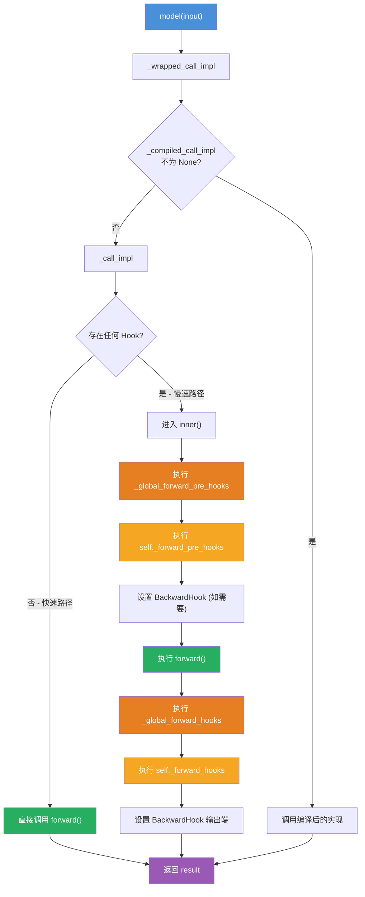

## 1. 概述

Hook（钩子）是 PyTorch Module 系统中的一项强大机制，允许开发者在不修改模型代码的前提下，在前向传播和反向传播的关键节点注入自定义逻辑。Hook 广泛应用于特征提取、梯度监控、梯度裁剪、权重冻结、模型调试等场景。

本文将从源码层面分析 `torch/nn/modules/module.py` 中的 Hook 系统，包括各类 Hook 的注册机制、执行顺序、全局 Hook 和状态字典 Hook。

## 2. Hook 类型总览

Module 支持以下 Hook 类型：

| Hook 类型 | 注册方法 | 触发时机 | 签名 |
|-----------|----------|----------|------|
| Forward Pre Hook | `register_forward_pre_hook` | `forward()` 执行前 | `hook(module, args) -> None \| modified_args` |
| Forward Hook | `register_forward_hook` | `forward()` 执行后 | `hook(module, args, output) -> None \| modified_output` |
| Full Backward Pre Hook | `register_full_backward_pre_hook` | 反向传播执行前 | `hook(module, grad_output) -> None \| modified_grad_output` |
| Full Backward Hook | `register_full_backward_hook` | 反向传播执行后 | `hook(module, grad_input, grad_output) -> None \| modified_grad_input` |
| Backward Hook（已弃用） | `register_backward_hook` | 反向传播时 | 同上 |
| State Dict Hook | `register_state_dict_post_hook` | `state_dict()` 导出后 | `hook(module, destination, prefix, local_metadata)` |
| State Dict Pre Hook | `register_state_dict_pre_hook` | `state_dict()` 导出前 | `hook(module, prefix, keep_vars)` |
| Load State Dict Pre Hook | `register_load_state_dict_pre_hook` | `load_state_dict()` 加载前 | `hook(module, state_dict, prefix, ...)` |
| Load State Dict Post Hook | `register_load_state_dict_post_hook` | `load_state_dict()` 加载后 | `hook(module, incompatible_keys)` |

## 3. 前向传播 Hook

### 3.1 register_forward_pre_hook

注册一个在 `forward()` 之前执行的钩子，可以修改输入：

```python
def register_forward_pre_hook(
    self,
    hook: Callable,
    *,
    prepend: bool = False,
    with_kwargs: bool = False,
) -> RemovableHandle:
    handle = RemovableHandle(
        self._forward_pre_hooks,
        extra_dict=self._forward_pre_hooks_with_kwargs,
    )
    self._forward_pre_hooks[handle.id] = hook
    if with_kwargs:
        self._forward_pre_hooks_with_kwargs[handle.id] = True
    if prepend:
        self._forward_pre_hooks.move_to_end(handle.id, last=False)
    return handle
```

使用示例：

```python
def input_logger_hook(module, args):
    print(f"[{module.__class__.__name__}] Input shape: {args[0].shape}")
    return None  # 返回 None 表示不修改输入

handle = model.register_forward_pre_hook(input_logger_hook)
output = model(x)  # 会在 forward() 前触发 hook
handle.remove()    # 移除 hook
```

参数说明：
- `prepend=True`：将 hook 插入到已有 hook 列表的最前面
- `with_kwargs=True`：hook 签名变为 `hook(module, args, kwargs) -> (args, kwargs) | None`

### 3.2 register_forward_hook

注册一个在 `forward()` 之后执行的钩子，可以修改输出：

```python
def register_forward_hook(
    self,
    hook: Callable,
    *,
    prepend: bool = False,
    with_kwargs: bool = False,
    always_call: bool = False,
) -> RemovableHandle:
    handle = RemovableHandle(
        self._forward_hooks,
        extra_dict=[
            self._forward_hooks_with_kwargs,
            self._forward_hooks_always_called,
        ],
    )
    self._forward_hooks[handle.id] = hook
    if with_kwargs:
        self._forward_hooks_with_kwargs[handle.id] = True
    if always_call:
        self._forward_hooks_always_called[handle.id] = True
    if prepend:
        self._forward_hooks.move_to_end(handle.id, last=False)
    return handle
```

`always_call=True` 使得即使 `forward()` 抛出异常，hook 也会被调用。这对于资源清理类的 hook 非常有用。

## 4. 反向传播 Hook

### 4.1 register_full_backward_pre_hook

在反向传播开始前触发，可以修改传入的梯度：

```python
def register_full_backward_pre_hook(
    self,
    hook: Callable[["Module", _grad_t], _grad_t | None],
    prepend: bool = False,
) -> RemovableHandle:
    handle = RemovableHandle(self._backward_pre_hooks)
    self._backward_pre_hooks[handle.id] = hook
    if prepend:
        self._backward_pre_hooks.move_to_end(handle.id, last=False)
    return handle
```

### 4.2 register_full_backward_hook

在反向传播完成后触发，可以获取并修改梯度：

```python
def register_full_backward_hook(
    self,
    hook: Callable[["Module", _grad_t, _grad_t], _grad_t | None],
    prepend: bool = False,
) -> RemovableHandle:
    ...
    self._is_full_backward_hook = True
    handle = RemovableHandle(self._backward_hooks)
    self._backward_hooks[handle.id] = hook
    ...
    return handle
```

Hook 签名为 `hook(module, grad_input, grad_output) -> tuple[Tensor, ...] | None`：
- `grad_input`：模块输入的梯度
- `grad_output`：模块输出的梯度
- 返回值若非 None，将替换 `grad_input`

### 4.3 register_backward_hook（已弃用）

此方法已弃用，被 `register_full_backward_hook` 替代。两者的区别在于旧 API 在某些场景下不能正确获取梯度（尤其是模块有多个输入时），新 API 通过 `BackwardHook` 辅助类解决了这个问题。

## 5. `__call__` 执行链 - Hook 的调度中枢

### 5.1 `_wrapped_call_impl` 和 `_call_impl`

当调用 `model(x)` 时，Python 的 `__call__` 协议会触发执行链。Module 的 `__call__` 被设置为 `_wrapped_call_impl`：

```python
__call__: Callable[..., Any] = _wrapped_call_impl

def _wrapped_call_impl(self, *args, **kwargs):
    if self._compiled_call_impl is not None:
        return self._compiled_call_impl(*args, **kwargs)
    else:
        return self._call_impl(*args, **kwargs)
```

`_call_impl` 是真正的调度中心：

```python
def _call_impl(self, *args, **kwargs):
    forward_call = (
        self._slow_forward if torch._C._get_tracing_state()
        else self.forward
    )

    # 快速路径：没有任何 Hook 时直接调用 forward
    if not (self._backward_hooks or self._backward_pre_hooks
            or self._forward_hooks or self._forward_pre_hooks
            or _global_backward_pre_hooks or _global_backward_hooks
            or _global_forward_hooks or _global_forward_pre_hooks):
        return forward_call(*args, **kwargs)

    # 慢速路径：有 Hook 时按顺序执行
    ...
```

### 5.2 完整执行流程



### 5.3 _call_impl 详细逻辑

`_call_impl` 内部的 `inner()` 函数包含完整的 Hook 执行逻辑：

```python
def inner():
    nonlocal result, args, kwargs

    # 1. 收集 backward hooks
    full_backward_hooks, non_full_backward_hooks = [], []
    backward_pre_hooks = []
    if self._backward_pre_hooks or _global_backward_pre_hooks:
        backward_pre_hooks = self._get_backward_pre_hooks()
    if self._backward_hooks or _global_backward_hooks:
        full_backward_hooks, non_full_backward_hooks = self._get_backward_hooks()

    # 2. 执行 forward pre hooks（全局优先）
    if _global_forward_pre_hooks or self._forward_pre_hooks:
        for hook_id, hook in (
            *_global_forward_pre_hooks.items(),
            *self._forward_pre_hooks.items(),
        ):
            if hook_id in self._forward_pre_hooks_with_kwargs:
                args_kwargs_result = hook(self, args, kwargs)
                if args_kwargs_result is not None:
                    args, kwargs = args_kwargs_result
            else:
                args_result = hook(self, args)
                if args_result is not None:
                    if not isinstance(args_result, tuple):
                        args_result = (args_result,)
                    args = args_result

    # 3. 设置 backward hook
    bw_hook = None
    if full_backward_hooks or backward_pre_hooks:
        bw_hook = BackwardHook(self, full_backward_hooks, backward_pre_hooks)
        args = bw_hook.setup_input_hook(args)

    # 4. 执行 forward
    result = forward_call(*args, **kwargs)

    # 5. 执行 forward hooks（全局优先）
    if _global_forward_hooks or self._forward_hooks:
        for hook_id, hook in (
            *_global_forward_hooks.items(),
            *self._forward_hooks.items(),
        ):
            if hook_id in self._forward_hooks_with_kwargs:
                hook_result = hook(self, args, kwargs, result)
            else:
                hook_result = hook(self, args, result)
            if hook_result is not None:
                result = hook_result

    # 6. 设置 backward hook 的输出端
    if bw_hook:
        result = bw_hook.setup_output_hook(result)
```

## 6. 全局 Hook

全局 Hook 作用于所有 Module 实例，定义在模块级别的全局变量中：

```python
_global_backward_pre_hooks: dict[int, Callable] = OrderedDict()
_global_backward_hooks: dict[int, Callable] = OrderedDict()
_global_forward_pre_hooks: dict[int, Callable] = OrderedDict()
_global_forward_hooks: dict[int, Callable] = OrderedDict()
```

注册函数：

```python
# 全局 forward pre hook
handle = torch.nn.modules.module.register_module_forward_pre_hook(hook)

# 全局 forward hook
handle = torch.nn.modules.module.register_module_forward_hook(hook)

# 全局 backward hook
handle = torch.nn.modules.module.register_module_full_backward_hook(hook)

# 全局 backward pre hook
handle = torch.nn.modules.module.register_module_full_backward_pre_hook(hook)
```

**执行优先级**：全局 Hook 在对应的模块级 Hook 之前执行。对于 forward pre hooks，顺序为：全局 pre hooks -> 模块 pre hooks -> forward -> 全局 post hooks -> 模块 post hooks。

### 6.1 全局 Hook 的完整调用流程



## 7. 状态字典 Hook

### 7.1 State Dict Pre Hook

在 `state_dict()` 生成之前触发：

```python
def register_state_dict_pre_hook(self, hook):
    """hook(module, prefix, keep_vars) -> None"""
    handle = RemovableHandle(self._state_dict_pre_hooks)
    self._state_dict_pre_hooks[handle.id] = hook
    return handle
```

### 7.2 State Dict Post Hook

在 `state_dict()` 生成之后触发：

```python
def register_state_dict_post_hook(self, hook):
    """hook(module, destination, prefix, local_metadata) -> None"""
    handle = RemovableHandle(self._state_dict_hooks)
    self._state_dict_hooks[handle.id] = hook
    return handle
```

### 7.3 Load State Dict Hooks

```python
# 加载前触发
def register_load_state_dict_pre_hook(self, hook):
    """hook(module, state_dict, prefix, local_metadata,
           strict, missing_keys, unexpected_keys, error_msgs) -> None"""
    return self._register_load_state_dict_pre_hook(hook, with_module=True)

# 加载后触发
def register_load_state_dict_post_hook(self, hook):
    """hook(module, incompatible_keys) -> None"""
    handle = RemovableHandle(self._load_state_dict_post_hooks)
    self._load_state_dict_post_hooks[handle.id] = hook
    return handle
```

## 8. 实战用例

### 8.1 特征提取

从预训练模型的中间层提取特征：

```python
features = {}

def get_features(name):
    def hook(module, input, output):
        features[name] = output.detach()
    return hook

model = torchvision.models.resnet50(pretrained=True)
model.layer3.register_forward_hook(get_features('layer3'))
model.layer4.register_forward_hook(get_features('layer4'))

output = model(input_tensor)
# features['layer3'] 和 features['layer4'] 现在包含中间特征
```

### 8.2 梯度裁剪

在反向传播时对梯度进行裁剪：

```python
def gradient_clipping_hook(module, grad_input, grad_output):
    return tuple(
        g.clamp(-1.0, 1.0) if g is not None else g
        for g in grad_input
    )

for module in model.modules():
    if isinstance(module, nn.Linear):
        module.register_full_backward_hook(gradient_clipping_hook)
```

### 8.3 权重冻结 / 梯度监控

使用 backward pre hook 实现选择性梯度清零（冻结效果）：

```python
def freeze_hook(module, grad_output):
    return tuple(torch.zeros_like(g) if g is not None else g for g in grad_output)

# 冻结特定层
model.backbone.register_full_backward_pre_hook(freeze_hook)
```

使用 forward hook 监控激活值：

```python
def activation_stats_hook(module, input, output):
    if isinstance(output, torch.Tensor):
        print(f"[{module.__class__.__name__}] "
              f"mean={output.mean():.4f}, std={output.std():.4f}, "
              f"max={output.max():.4f}, min={output.min():.4f}")

for name, module in model.named_modules():
    if isinstance(module, (nn.Conv2d, nn.Linear)):
        module.register_forward_hook(activation_stats_hook)
```

### 8.4 RemovableHandle

所有 `register_*_hook` 方法都返回 `RemovableHandle`，调用其 `remove()` 方法即可移除对应的 Hook：

```python
handle = model.register_forward_hook(my_hook)
# ... 使用 hook ...
handle.remove()  # 移除 hook
```

也可以作为上下文管理器使用：

```python
with model.register_forward_hook(my_hook):
    output = model(x)  # hook 生效
# hook 已自动移除
```

## 9. 性能考量

### 9.1 快速路径优化

`_call_impl` 的第一步检查是否存在任何 Hook。如果没有，直接调用 `forward()` 而跳过所有 Hook 相关逻辑。这保证了在不使用 Hook 的情况下，Hook 系统的性能开销接近零：

```python
if not (self._backward_hooks or self._backward_pre_hooks
        or self._forward_hooks or self._forward_pre_hooks
        or _global_backward_pre_hooks or _global_backward_hooks
        or _global_forward_hooks or _global_forward_pre_hooks):
    return forward_call(*args, **kwargs)
```

### 9.2 compiled_call_impl

`_wrapped_call_impl` 中检查 `_compiled_call_impl`，这是为 `torch.compile` 优化预留的路径。当模型经过编译优化后，会设置此属性以使用编译后的实现。

## 10. 总结

Hook 系统的设计遵循以下原则：

1. **零开销抽象**：无 Hook 时直接走快速路径，无额外开销
2. **分层优先级**：全局 Hook 先于模块级 Hook 执行
3. **可组合性**：同一模块可注册多个 Hook，按注册顺序执行
4. **可撤销性**：通过 `RemovableHandle.remove()` 移除 Hook
5. **非侵入性**：Hook 不需要修改模型代码，通过外部注册即可工作

理解 Hook 系统对于掌握 PyTorch 的调试、可视化和高级训练技巧至关重要。在下一篇文章中，我们将分析 PyTorch 内置的常用层（Linear、Conv2d、BatchNorm 等）的源码实现。
