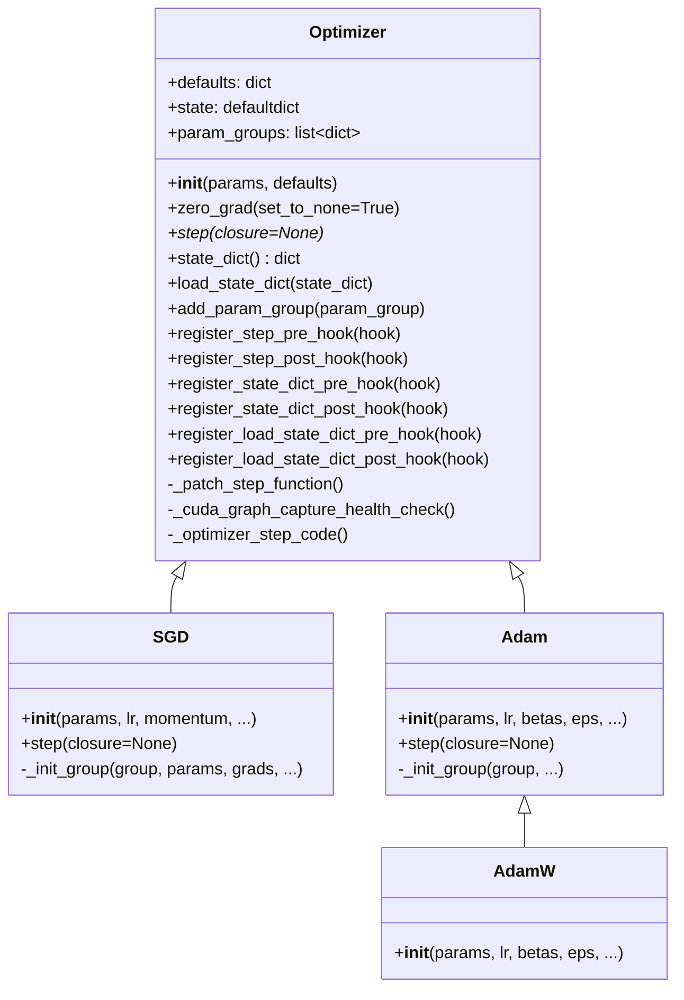
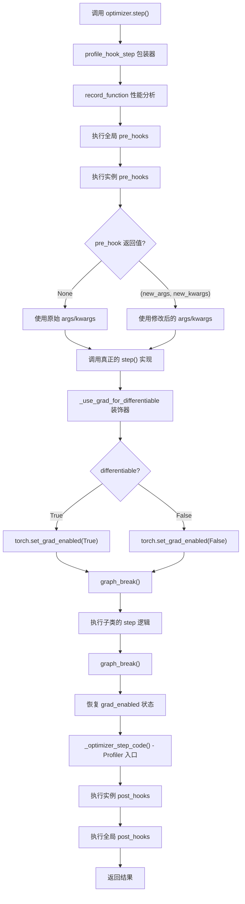

> 本文深入分析 `torch/optim/optimizer.py` 中 `Optimizer` 基类的实现，涵盖初始化流程、参数组管理、状态维护、序列化机制、Hook 系统以及性能优化策略。

## 1. 整体架构

`Optimizer` 是 PyTorch 所有优化器的基类，定义了优化器的通用接口和核心数据结构。所有具体的优化器（SGD、Adam 等）都继承自它。

### 1.1 类结构总览



源码文件：`torch/optim/optimizer.py`

## 2. `__init__` - 初始化流程

### 2.1 构造函数签名

```python
class Optimizer:
    def __init__(self, params: ParamsT, defaults: dict[str, Any]) -> None:
```

`params` 的类型 `ParamsT` 定义为：

```python
ParamsT: TypeAlias = (
    Iterable[torch.Tensor]
    | Iterable[dict[str, Any]]
    | Iterable[tuple[str, torch.Tensor]]
)
```

这意味着 `params` 可以接受三种形式：
- **张量可迭代对象**：最常见的 `model.parameters()`
- **字典列表**：每个字典定义一个参数组，用于差异化超参数
- **命名参数元组**：`model.named_parameters()` 的输出

### 2.2 初始化核心逻辑

```python
def __init__(self, params: ParamsT, defaults: dict[str, Any]) -> None:
    self.defaults = defaults
    # 六种 Hook 的有序字典
    self._optimizer_step_pre_hooks = OrderedDict()
    self._optimizer_step_post_hooks = OrderedDict()
    self._optimizer_state_dict_pre_hooks = OrderedDict()
    self._optimizer_state_dict_post_hooks = OrderedDict()
    self._optimizer_load_state_dict_pre_hooks = OrderedDict()
    self._optimizer_load_state_dict_post_hooks = OrderedDict()

    # 为 step() 方法注入 profiler 和 hook 的包装
    self._patch_step_function()

    # 核心数据结构初始化
    self.state: defaultdict[torch.Tensor, Any] = defaultdict(dict)
    self.param_groups: list[dict[str, Any]] = []

    # 将传入的参数整理为 param_groups
    param_groups = list(params)
    if len(param_groups) == 0:
        raise ValueError("optimizer got an empty parameter list")
    if not isinstance(param_groups[0], dict):
        param_groups = [{"params": param_groups}]

    for param_group in param_groups:
        self.add_param_group(cast(dict, param_group))
```

关键要点：

1. **`defaults`** 存储优化器的默认超参数（如 `lr`、`weight_decay`），由子类构造时传入。
2. **参数规范化**：如果传入的不是字典列表（例如直接传入 `model.parameters()`），自动包装为单元素字典列表 `[{"params": param_groups}]`。
3. **`add_param_group`** 负责校验参数有效性，并将子类中未指定的超参数用 `defaults` 填充。

### 2.3 `add_param_group` 的校验逻辑

`add_param_group` 执行以下验证：
- 参数必须是 `torch.Tensor`
- 非 differentiable 模式下，参数必须是叶节点或 `retains_grad` 的张量
- 集合类型不被接受（因为无序）
- 检查参数不重复出现在多个组中
- 对于命名参数，提取 `param_names` 到参数组中

## 3. 核心数据结构

### 3.1 `param_groups`

`param_groups` 是一个字典列表，每个字典代表一个参数组：

```python
[
    {
        "params": [tensor1, tensor2],       # 该组的参数张量
        "param_names": ["weight", "bias"],  # 可选，命名参数时存在
        "lr": 0.001,                        # 学习率
        "weight_decay": 0.01,               # 权重衰减
        "betas": (0.9, 0.999),              # Adam 特有
        # ... 其他超参数由 defaults 填充
    },
    {
        "params": [tensor3],
        "lr": 0.0001,
        # ...
    }
]
```

参数组的设计使得同一个优化器可以对不同参数使用不同的超参数。这在微调预训练模型时极为常用。

### 3.2 `state`

`state` 是一个 `defaultdict(dict)`，键为参数张量，值为该参数对应的优化器状态字典：

```python
# 以 Adam 为例
self.state = {
    param_tensor_0: {
        "step": tensor(100.),          # 当前步数
        "exp_avg": tensor(...),        # 一阶矩估计 m_t
        "exp_avg_sq": tensor(...),     # 二阶矩估计 v_t
        "max_exp_avg_sq": tensor(...), # amsgrad 时存在
    },
    param_tensor_1: {
        "step": tensor(100.),
        "exp_avg": tensor(...),
        "exp_avg_sq": tensor(...),
    },
    # ...
}
```

不同优化器的 state 内容不同。SGD 存储 `momentum_buffer`，Adam 存储 `exp_avg` 和 `exp_avg_sq`。

状态采用**惰性初始化**（Lazy Initialization）：在第一次调用 `step()` 时，每个优化器的 `_init_group` 方法检查 `len(state) == 0` 并执行初始化。

### 3.3 `defaults`

`defaults` 存储构造时的默认超参数。它在 `add_param_group` 中被用作新参数组的默认值来源：

```python
for name, default in self.defaults.items():
    if default is required and name not in param_group:
        raise ValueError(...)
    else:
        param_group.setdefault(name, default)
```

## 4. `zero_grad` - 梯度清零

```python
@torch._disable_dynamo
def zero_grad(self, set_to_none: bool = True) -> None:
```

`zero_grad` 负责在每次 `backward()` 之前清除之前积累的梯度。

### 4.1 `set_to_none` 参数

- **`set_to_none=True`（默认）**：将 `param.grad` 直接设为 `None`。内存占用更低，性能略好。
- **`set_to_none=False`**：将梯度张量填充为 0。某些需要访问 `.grad` 的场景需要这样做。

### 4.2 foreach 优化

当优化器使用 `foreach=True` 或 `fused=True` 时，`zero_grad` 会利用 `torch._foreach_zero_()` 批量清零，减少 kernel launch 开销：

```python
if foreach:
    per_device_and_dtype_grads = defaultdict(lambda: defaultdict(list))
    # ... 收集梯度
    for per_dtype_grads in per_device_and_dtype_grads.values():
        for grads in per_dtype_grads.values():
            torch._foreach_zero_(grads)
```

### 4.3 `@torch._disable_dynamo` 装饰器

`zero_grad` 被标记为不可被 Dynamo 追踪。这是因为 `zero_grad` 涉及对梯度的原地修改（set to None / zero），这种模式在编译图中不易安全处理。

## 5. `step` - 参数更新

### 5.1 基类定义

基类中 `step()` 是一个抽象方法：

```python
def step(self, closure: Callable[[], float] | None = None) -> float | None:
    raise NotImplementedError
```

每个具体优化器都覆写此方法，实现自己的参数更新逻辑。

### 5.2 `step()` 执行流程

实际运行时，`step()` 方法已经被 `_patch_step_function` 包装，真正的执行流程如下：



### 5.3 `_patch_step_function` 机制

```python
def _patch_step_function(self) -> None:
    self._zero_grad_profile_name = f"Optimizer.zero_grad#{self.__class__.__name__}.zero_grad"
    hooked = getattr(self.__class__.step, "hooked", None)
    if not hooked:
        self.__class__.step = self.profile_hook_step(self.__class__.step)
        self.__class__.step.hooked = True
```

这个方法在 `__init__` 中调用，它将 `step` 方法替换为 `profile_hook_step` 包装后的版本。`hooked` 标记确保同一个类只被包装一次。

### 5.4 `@_use_grad_for_differentiable` 装饰器

这个装饰器是理解 optimizer 与 autograd 交互的关键：

```python
def _use_grad_for_differentiable(func):
    def _use_grad(*args, **kwargs):
        self = cast(Optimizer, args[0])
        prev_grad = torch.is_grad_enabled()
        try:
            torch.set_grad_enabled(self.defaults["differentiable"])
            torch._dynamo.graph_break()
            ret = func(*args, **kwargs)
        finally:
            torch._dynamo.graph_break()
            torch.set_grad_enabled(prev_grad)
        return ret
    return _use_grad
```

**关键行为**：
- 当 `differentiable=False`（默认）时，`step()` 在 `no_grad` 上下文中执行，这是因为大多数情况下不需要对优化器步骤求导。
- 当 `differentiable=True` 时（用于 meta-learning），`step()` 在 `enable_grad` 上下文中执行，使得参数更新本身可以被 autograd 追踪。
- `graph_break()` 调用确保 `torch.compile` 在此处切断计算图。这对 Inductor 的性能优化至关重要（见注释中关于 functionalization 和 epilogue 的说明）。

## 6. `state_dict` / `load_state_dict` - 序列化

### 6.1 `state_dict()`

```python
@torch._disable_dynamo
def state_dict(self) -> StateDict:
```

`state_dict()` 返回一个包含两个键的字典：

```python
{
    "state": {
        0: {"momentum_buffer": tensor(...), ...},
        1: {"momentum_buffer": tensor(...), ...},
    },
    "param_groups": [
        {"lr": 0.01, "weight_decay": 0, ..., "params": [0]},
        {"lr": 0.001, ..., "params": [1, 2, 3]},
    ]
}
```

核心逻辑是将**参数张量**映射为**整数索引**（`param_mappings`），因为张量本身不可序列化。`pack_group` 函数为每个参数分配一个唯一的整数 ID，`state` 中的键也相应转换为整数。

### 6.2 `load_state_dict()`

```python
@torch._disable_dynamo
def load_state_dict(self, state_dict: StateDict) -> None:
```

加载流程：
1. 执行 `_optimizer_load_state_dict_pre_hooks`
2. 验证参数组数量和每组参数数量匹配
3. 建立保存的整数 ID 到当前参数张量的映射（`id_map`）
4. 通过 `_cast` 函数将状态张量转移到参数所在的设备和 dtype
5. 通过 `__setstate__` 恢复优化器状态
6. 执行 `_optimizer_load_state_dict_post_hooks`

`_process_value_according_to_param_policy` 方法处理类型和设备转换策略：
- `step` 状态在 `capturable` 或 `fused` 模式下转为 `float32` 并放到参数设备上
- 其他浮点状态张量跟随参数的 dtype 和 device
- 非浮点状态仅转移 device

## 7. Hook 系统

Optimizer 提供了六种 Hook，覆盖了 `step`、`state_dict`、`load_state_dict` 三个操作的前后：

| Hook 类型 | 注册方法 | 签名 |
|-----------|----------|------|
| step pre | `register_step_pre_hook` | `hook(optimizer, args, kwargs) -> None \| (args, kwargs)` |
| step post | `register_step_post_hook` | `hook(optimizer, args, kwargs) -> None` |
| state_dict pre | `register_state_dict_pre_hook` | `hook(optimizer) -> None` |
| state_dict post | `register_state_dict_post_hook` | `hook(optimizer, state_dict) -> state_dict \| None` |
| load_state_dict pre | `register_load_state_dict_pre_hook` | `hook(optimizer, state_dict) -> state_dict \| None` |
| load_state_dict post | `register_load_state_dict_post_hook` | `hook(optimizer) -> None` |

此外还有**全局 Hook**，通过模块级函数注册：

```python
_global_optimizer_pre_hooks: dict[int, GlobalOptimizerPreHook] = OrderedDict()
_global_optimizer_post_hooks: dict[int, GlobalOptimizerPostHook] = OrderedDict()

def register_optimizer_step_pre_hook(hook) -> RemovableHandle: ...
def register_optimizer_step_post_hook(hook) -> RemovableHandle: ...
```

全局 Hook 作用于所有优化器实例。在 `profile_hook_step` 中，执行顺序为：

```
全局 pre_hooks → 实例 pre_hooks → step() → 实例 post_hooks → 全局 post_hooks
```

所有 Hook 返回 `RemovableHandle`，调用 `handle.remove()` 即可注销。

## 8. `_single_tensor_xxx` vs `_multi_tensor_xxx` 实现策略

PyTorch 优化器的参数更新有三种实现路径，性能差异显著：

### 8.1 single_tensor（逐参数循环）

```python
def _single_tensor_adam(params, grads, exp_avgs, ...):
    for i, param in enumerate(params):
        grad = grads[i]
        exp_avg = exp_avgs[i]
        # 逐个参数执行更新操作
        exp_avg.lerp_(grad, 1 - beta1)
        exp_avg_sq.mul_(beta2).addcmul_(grad, grad, value=1 - beta2)
        # ...
        param.addcdiv_(exp_avg, denom, value=-step_size)
```

这是最朴素的实现，逐个参数执行多次 CUDA kernel。每个操作都是一次 kernel launch。

### 8.2 multi_tensor / foreach（批量操作）

```python
def _multi_tensor_adam(params, grads, exp_avgs, ...):
    # 按 device 和 dtype 分组
    grouped_tensors = Optimizer._group_tensors_by_device_and_dtype(
        [params, grads, exp_avgs, exp_avg_sqs, max_exp_avg_sqs, state_steps]
    )
    for (device_params, device_grads, ...), _ in grouped_tensors.values():
        # 使用 torch._foreach_* 批量操作
        torch._foreach_lerp_(device_exp_avgs, device_grads, 1 - beta1)
        torch._foreach_mul_(device_exp_avg_sqs, beta2)
        torch._foreach_addcmul_(device_exp_avg_sqs, device_grads, device_grads, value=1 - beta2)
        # ...
```

`foreach` 实现将同一设备和 dtype 的所有参数打包成列表，通过 `torch._foreach_*` 操作一次处理所有参数。这大幅减少了 kernel launch 次数。

### 8.3 fused（融合 kernel）

`fused=True` 将整个更新步骤融合为单个 CUDA kernel。这是性能最优的实现，同时实现了**垂直融合**（将一个参数的多个操作合并）和**水平融合**（将多个参数的同一操作合并）。

### 8.4 自动选择逻辑

```python
def _default_to_fused_or_foreach(params, differentiable, use_fused=False):
    if torch.jit.is_scripting() or differentiable:
        return False, False

    fused = use_fused and all(
        p is None or (
            type(p) in _foreach_supported_types
            and p.device.type in fused_supported_devices
            and torch.is_floating_point(p)
        )
        for p in params
    )
    foreach = not fused and all(
        p is None or (
            type(p) in _foreach_supported_types
            and p.device.type in foreach_supported_devices
        )
        for p in params
    )
    return fused, foreach
```

当用户未显式指定 `foreach` 和 `fused` 时，优化器会自动选择最优实现。优先级为：fused > foreach > single_tensor。但默认情况下不会自动选择 fused（因为较新，需要更多验证），而是默认选择 foreach。

## 9. CUDA Graph 支持

`_cuda_graph_capture_health_check` 方法用于检查优化器是否可以在 CUDA Graph 捕获模式下安全运行：

```python
def _cuda_graph_capture_health_check(self) -> None:
    if not torch.compiler.is_compiling() and torch.backends.cuda.is_built() and torch.cuda.is_available():
        capturing = torch.cuda.is_current_stream_capturing()
        if capturing and not all(group["capturable"] for group in self.param_groups):
            raise RuntimeError("Attempting CUDA graph capture but capturable is False.")
```

当 `torch.compile` 在追踪时，会自动设置 `capturable=True`（见 `OptimizerVariable._set_capturable`），无需用户手动配置。

## 10. `_group_tensors_by_device_and_dtype`

这是 `foreach` 和 `fused` 实现的基础设施：

```python
@staticmethod
def _group_tensors_by_device_and_dtype(tensorlistlist, with_indices=False):
    if torch.compiler.is_compiling():
        # 编译模式下跳过分组，交给 Inductor 处理
        return {(None, None): (tensorlistlist, list(range(len(tensorlistlist[0]))))}
    else:
        return _group_tensors_by_device_and_dtype(tensorlistlist, with_indices)
```

在编译模式下，设备/dtype 分组被跳过，因为 Inductor 在 lowering 阶段会自行处理。这是一个性能优化：避免在追踪时执行不必要的运行时逻辑。

## 11. 小结

`Optimizer` 基类的设计体现了几个核心原则：

1. **统一接口**：所有优化器共享 `zero_grad` / `step` / `state_dict` / `load_state_dict` 接口。
2. **灵活的参数组机制**：支持同一优化器对不同参数使用不同超参数。
3. **惰性状态初始化**：优化器状态在首次 `step()` 时才创建，节省内存。
4. **多级性能优化**：single_tensor → foreach → fused 三种实现，自动选择最优路径。
5. **丰富的 Hook 系统**：覆盖 step / state_dict / load_state_dict 的前后共六个 Hook 点。
6. **编译友好**：与 `torch.compile` 和 CUDA Graph 深度集成，通过 `graph_break()`、`@_disable_dynamo`、`capturable` 等机制协调。
