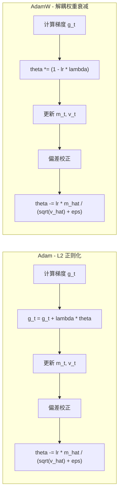
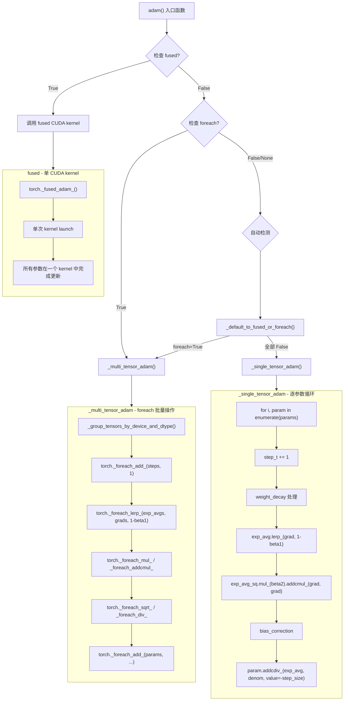
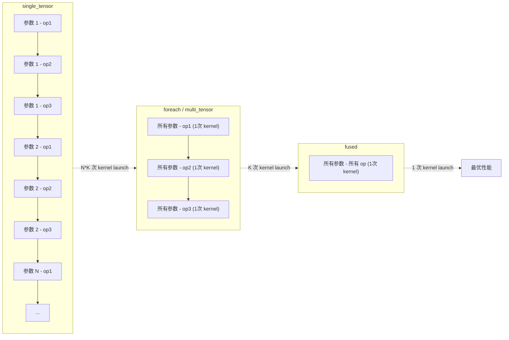

> 本文深入分析 `torch/optim/adam.py` 中 Adam 优化器的完整实现，包括数学推导、Adam vs AdamW 的区别、三种实现变体（single_tensor / multi_tensor / fused）的源码对比，以及 AMSGrad 和状态管理机制。

## 1. 算法数学基础

### 1.1 Adam 算法推导

Adam（Adaptive Moment Estimation）由 Kingma 和 Ba 在 2014 年提出，结合了 Momentum（一阶矩估计）和 RMSProp（二阶矩估计）两种思想。

**核心公式**：

给定参数 $\theta$、损失函数 $L(\theta)$、学习率 $\gamma$、衰减系数 $\beta_1, \beta_2$、数值稳定项 $\epsilon$：

**Step 1 - 计算梯度**：

$$g_t = \nabla_\theta L(\theta_{t-1})$$

**Step 2 - 更新一阶矩（均值的指数移动平均）**：

$$m_t = \beta_1 \cdot m_{t-1} + (1 - \beta_1) \cdot g_t$$

**Step 3 - 更新二阶矩（方差的指数移动平均）**：

$$v_t = \beta_2 \cdot v_{t-1} + (1 - \beta_2) \cdot g_t^2$$

**Step 4 - 偏差校正**：

由于 $m_0 = 0, v_0 = 0$，早期的矩估计会偏向零。偏差校正公式：

$$\hat{m}_t = \frac{m_t}{1 - \beta_1^t}, \quad \hat{v}_t = \frac{v_t}{1 - \beta_2^t}$$

**Step 5 - 参数更新**：

$$\theta_t = \theta_{t-1} - \gamma \cdot \frac{\hat{m}_t}{\sqrt{\hat{v}_t} + \epsilon}$$

### 1.2 为什么 Adam 有效

- **一阶矩 $m_t$** 提供了梯度方向的平滑估计，相当于 Momentum。
- **二阶矩 $v_t$** 估计了梯度各维度的方差，使得每个参数维度有独立的自适应学习率。梯度波动大的维度学习率较小，波动小的维度学习率较大。
- **偏差校正**确保了训练初期（$t$ 较小时）估计值不会过分偏向零。

### 1.3 默认超参数

在 PyTorch 源码中，Adam 的默认超参数为：

| 参数 | 默认值 | 含义 |
|------|--------|------|
| `lr` | 1e-3 | 学习率 $\gamma$ |
| `betas` | (0.9, 0.999) | $(\beta_1, \beta_2)$ |
| `eps` | 1e-8 | $\epsilon$，防止除零 |
| `weight_decay` | 0 | 权重衰减系数 $\lambda$ |
| `amsgrad` | False | 是否使用 AMSGrad 变体 |

## 2. Adam vs AdamW - 权重衰减的本质区别

### 2.1 Adam 中的 L2 正则化

标准 Adam 中，权重衰减是通过在**梯度**上添加 L2 惩罚实现的：

$$g_t = \nabla_\theta L(\theta_{t-1}) + \lambda \cdot \theta_{t-1}$$

然后将修改后的梯度送入 Adam 的矩估计和更新流程。这意味着权重衰减会被自适应学习率所缩放——大梯度参数的衰减被抑制，小梯度参数的衰减被放大。

### 2.2 AdamW 的解耦权重衰减

AdamW 将权重衰减从梯度更新中**解耦**出来，直接在参数上执行衰减：

$$\theta_t = \theta_{t-1} - \gamma \cdot \lambda \cdot \theta_{t-1} - \gamma \cdot \frac{\hat{m}_t}{\sqrt{\hat{v}_t} + \epsilon}$$

即先执行权重衰减 $\theta \leftarrow (1 - \gamma \lambda) \theta$，再执行 Adam 更新。



### 2.3 源码实现

在 `torch/optim/adamw.py` 中，`AdamW` 继承自 `Adam`，唯一的区别就是设置 `decoupled_weight_decay=True`：

```python
class AdamW(Adam):
    def __init__(self, params, lr=1e-3, betas=(0.9, 0.999), eps=1e-8,
                 weight_decay=1e-2, amsgrad=False, *, maximize=False,
                 foreach=None, capturable=False, differentiable=False, fused=None):
        super().__init__(
            params, lr, betas, eps, weight_decay, amsgrad,
            foreach=foreach, maximize=maximize, capturable=capturable,
            differentiable=differentiable, fused=fused,
            decoupled_weight_decay=True,  # 关键区别
        )
```

在 `_single_tensor_adam` 中，两种权重衰减的实现分支：

```python
if weight_decay != 0:
    if decoupled_weight_decay:
        # AdamW: 直接在参数上执行衰减
        param.mul_(1 - lr * weight_decay)
    else:
        # Adam: 将 L2 正则化加到梯度上
        grad = grad.add(param, alpha=weight_decay)
```

注意 AdamW 的默认 `weight_decay=1e-2`，而 Adam 的默认值为 0。

## 3. AMSGrad 变体

AMSGrad 由 Reddi 等人提出，旨在解决 Adam 在某些情况下不收敛的问题。核心思想是维护所有历史二阶矩的最大值：

$$\hat{v}_t^{max} = \max(\hat{v}_{t-1}^{max}, v_t)$$

然后用 $\hat{v}_t^{max}$ 代替 $\hat{v}_t$ 进行参数更新：

$$\theta_t = \theta_{t-1} - \gamma \cdot \frac{\hat{m}_t}{\sqrt{\hat{v}_t^{max}} + \epsilon}$$

源码中的实现：

```python
if amsgrad:
    # 维护所有 exp_avg_sq 的最大值
    torch.maximum(max_exp_avg_sqs[i], exp_avg_sq, out=max_exp_avg_sqs[i])
    # 使用最大值来归一化
    denom = (max_exp_avg_sqs[i].sqrt() / bias_correction2_sqrt).add_(eps)
else:
    denom = (exp_avg_sq.sqrt() / bias_correction2_sqrt).add_(eps)
```

## 4. Adam 源码结构

### 4.1 `Adam.__init__`

构造函数执行参数校验并调用基类：

```python
class Adam(Optimizer):
    def __init__(self, params, lr=1e-3, betas=(0.9, 0.999), eps=1e-8,
                 weight_decay=0, amsgrad=False, *, foreach=None, maximize=False,
                 capturable=False, differentiable=False, fused=None,
                 decoupled_weight_decay=False):
        # 参数合法性校验
        if not 0.0 <= lr: raise ValueError(...)
        if not 0.0 <= eps: raise ValueError(...)
        if not 0.0 <= betas[0] < 1.0: raise ValueError(...)
        if not 0.0 <= betas[1] < 1.0: raise ValueError(...)

        defaults = {
            "lr": lr, "betas": betas, "eps": eps, "weight_decay": weight_decay,
            "amsgrad": amsgrad, "maximize": maximize, "foreach": foreach,
            "capturable": capturable, "differentiable": differentiable,
            "fused": fused, "decoupled_weight_decay": decoupled_weight_decay,
        }
        super().__init__(params, defaults)

        if fused:
            if differentiable:
                raise RuntimeError("`fused` does not support `differentiable`")
            self._step_supports_amp_scaling = True
            if foreach:
                raise RuntimeError("`fused` and `foreach` cannot be `True` together.")
```

注意 `fused` 和 `foreach` 互斥，`fused` 和 `differentiable` 也互斥。

### 4.2 `_init_group` - 状态惰性初始化

```python
def _init_group(self, group, params_with_grad, grads, exp_avgs,
                exp_avg_sqs, max_exp_avg_sqs, state_steps):
    has_complex = False
    for p in group["params"]:
        if p.grad is not None:
            has_complex |= torch.is_complex(p)
            params_with_grad.append(p)
            grads.append(p.grad)

            state = self.state[p]
            if len(state) == 0:
                # 首次访问，初始化状态
                state["step"] = torch.zeros(()) if not (capturable or fused)
                                else torch.zeros((), device=p.device)
                state["exp_avg"] = torch.zeros_like(p, memory_format=torch.preserve_format)
                state["exp_avg_sq"] = torch.zeros_like(p, memory_format=torch.preserve_format)
                if group["amsgrad"]:
                    state["max_exp_avg_sq"] = torch.zeros_like(p, memory_format=torch.preserve_format)

            exp_avgs.append(state["exp_avg"])
            exp_avg_sqs.append(state["exp_avg_sq"])
            state_steps.append(state["step"])
    return has_complex
```

状态字典中的各字段：

| 字段 | 形状 | 含义 |
|------|------|------|
| `step` | 标量 | 当前步数计数器，用于偏差校正 |
| `exp_avg` | 与参数同形 | 一阶矩 $m_t$ |
| `exp_avg_sq` | 与参数同形 | 二阶矩 $v_t$ |
| `max_exp_avg_sq` | 与参数同形 | $v_t^{max}$（仅 amsgrad） |

`step` 的设备策略：当 `capturable=True` 或 `fused=True` 时，`step` 存储在参数设备上（GPU），以支持 CUDA Graph 捕获。否则存储在 CPU 上以避免不必要的 kernel launch 开销。

### 4.3 `step` 方法

```python
@_use_grad_for_differentiable
def step(self, closure=None):
    self._cuda_graph_capture_health_check()
    loss = None
    if closure is not None:
        with torch.enable_grad():
            loss = closure()

    for group in self.param_groups:
        params_with_grad, grads, exp_avgs = [], [], []
        exp_avg_sqs, max_exp_avg_sqs, state_steps = [], [], []
        beta1, beta2 = group["betas"]

        has_complex = self._init_group(
            group, params_with_grad, grads, exp_avgs,
            exp_avg_sqs, max_exp_avg_sqs, state_steps,
        )

        adam(
            params_with_grad, grads, exp_avgs, exp_avg_sqs,
            max_exp_avg_sqs, state_steps,
            amsgrad=group["amsgrad"], has_complex=has_complex,
            beta1=beta1, beta2=beta2, lr=group["lr"],
            weight_decay=group["weight_decay"], eps=group["eps"],
            maximize=group["maximize"], foreach=group["foreach"],
            capturable=group["capturable"], differentiable=group["differentiable"],
            fused=group["fused"], grad_scale=getattr(self, "grad_scale", None),
            found_inf=getattr(self, "found_inf", None),
            decoupled_weight_decay=group["decoupled_weight_decay"],
        )
    return loss
```

`step()` 遍历每个参数组，调用 `_init_group` 收集状态，然后将所有数据传入 `adam()` 函数。

## 5. 三种实现变体

### 5.1 算法流程图



### 5.2 `_single_tensor_adam` 核心实现

这是最易读的实现，忠实地反映了 Adam 算法的数学公式：

```python
for i, param in enumerate(params):
    grad = grads[i] if not maximize else -grads[i]
    exp_avg = exp_avgs[i]
    exp_avg_sq = exp_avg_sqs[i]
    step_t = state_steps[i]

    # 递增步数
    step_t += 1

    # 权重衰减
    if weight_decay != 0:
        if decoupled_weight_decay:
            param.mul_(1 - lr * weight_decay)       # AdamW
        else:
            grad = grad.add(param, alpha=weight_decay) # Adam L2

    # m_t = beta1 * m_{t-1} + (1 - beta1) * g_t
    exp_avg.lerp_(grad, 1 - beta1)

    # v_t = beta2 * v_{t-1} + (1 - beta2) * g_t^2
    exp_avg_sq.mul_(beta2).addcmul_(grad, grad, value=1 - beta2)

    # 偏差校正
    step = _get_value(step_t)
    bias_correction1 = 1 - beta1 ** step
    bias_correction2 = 1 - beta2 ** step
    step_size = lr / bias_correction1
    bias_correction2_sqrt = bias_correction2 ** 0.5

    # 计算分母
    if amsgrad:
        torch.maximum(max_exp_avg_sqs[i], exp_avg_sq, out=max_exp_avg_sqs[i])
        denom = (max_exp_avg_sqs[i].sqrt() / bias_correction2_sqrt).add_(eps)
    else:
        denom = (exp_avg_sq.sqrt() / bias_correction2_sqrt).add_(eps)

    # theta_t = theta_{t-1} - step_size * m_t / denom
    param.addcdiv_(exp_avg, denom, value=-step_size)
```

注意 `lerp_` 是 PyTorch 的线性插值原地操作：`exp_avg.lerp_(grad, weight)` 等价于 `exp_avg = exp_avg + weight * (grad - exp_avg) = (1-weight) * exp_avg + weight * grad`。

### 5.3 `_multi_tensor_adam` 核心实现

`foreach` 版本通过 `torch._foreach_*` 操作同时处理所有参数：

```python
def _multi_tensor_adam(params, grads, exp_avgs, exp_avg_sqs, ...):
    # 按设备和数据类型分组
    grouped_tensors = Optimizer._group_tensors_by_device_and_dtype(
        [params, grads, exp_avgs, exp_avg_sqs, max_exp_avg_sqs, state_steps]
    )

    for (device_params, device_grads, device_exp_avgs,
         device_exp_avg_sqs, device_max_exp_avg_sqs,
         device_state_steps), _ in grouped_tensors.values():

        # 所有步数 +1
        torch._foreach_add_(device_state_steps, 1)

        # 权重衰减（解耦）
        if weight_decay != 0 and decoupled_weight_decay:
            torch._foreach_mul_(device_params, 1 - lr * weight_decay)

        # 权重衰减（L2）
        if weight_decay != 0 and not decoupled_weight_decay:
            torch._foreach_add_(device_grads, device_params, alpha=weight_decay)

        # 更新一阶矩：m_t = beta1 * m_{t-1} + (1 - beta1) * g_t
        torch._foreach_lerp_(device_exp_avgs, device_grads, 1 - beta1)

        # 更新二阶矩：v_t = beta2 * v_{t-1} + (1 - beta2) * g_t^2
        torch._foreach_mul_(device_exp_avg_sqs, beta2)
        torch._foreach_addcmul_(device_exp_avg_sqs, device_grads, device_grads, value=1 - beta2)

        # 偏差校正和参数更新...
```

### 5.4 三种实现的性能对比



| 实现方式 | Kernel Launch 次数 | 内存开销 | 适用场景 |
|---------|-------------------|---------|---------|
| single_tensor | N * K（N 参数，K 操作） | 最小 | CPU / TorchScript / differentiable |
| foreach | K（K 操作） | 约 sizeof(params) 额外内存 | GPU 默认选择 |
| fused | 1 | 最小 | 需显式指定 `fused=True` |

## 6. `capturable` 和 `differentiable` 模式

### 6.1 `capturable=True`

当 `capturable=True` 时，所有中间计算（包括 `step` 计数器的偏差校正）都使用张量操作而非 Python 标量。这使得整个 `step()` 可以被 CUDA Graph 捕获：

```python
if capturable or differentiable:
    step = step_t  # 张量
    bias_correction1 = 1 - beta1 ** step  # 张量运算
    bias_correction2 = 1 - beta2 ** step
    step_size = lr / bias_correction1
    step_size_neg = step_size.neg()
    # ... 全部使用张量操作
else:
    step = _get_value(step_t)  # 提取为 Python 标量
    bias_correction1 = 1 - beta1 ** step  # Python 运算
    # ... 混合使用 Python 标量和张量操作
```

非 capturable 路径使用 `_get_value()` 将 `step` 提取为 Python 标量，这样可以避免不必要的 GPU 操作。但在 CUDA Graph 捕获时，Python 标量是不可变的，必须保持纯张量运算。

### 6.2 `differentiable=True`

当 `differentiable=True` 时，优化器的 `step()` 操作是可微的。这用于 meta-learning（如 MAML）场景，需要对"参数更新本身"求梯度。注意 `differentiable` 模式不支持 `foreach` 和 `fused`。

## 7. 复数参数支持

Adam 支持复数参数。处理方式是将复数参数转为实数视图进行计算，最后再转回：

```python
if torch.is_complex(param):
    grad = torch.view_as_real(grad)
    exp_avg = torch.view_as_real(exp_avg)
    exp_avg_sq = torch.view_as_real(exp_avg_sq)
    param = torch.view_as_real(param)
```

在 `foreach` 实现中，通过 `_view_as_real` 辅助函数批量处理：

```python
if has_complex:
    _view_as_real(device_params, device_grads, device_exp_avgs, device_exp_avg_sqs)
```

## 8. `grad_scale` 和 `found_inf` - AMP 集成

当使用混合精度训练（AMP）时，`fused` 实现可以直接接收 `GradScaler` 的 `grad_scale` 和 `found_inf` 参数：

```python
adam(
    ...,
    grad_scale=getattr(self, "grad_scale", None),
    found_inf=getattr(self, "found_inf", None),
)
```

`_step_supports_amp_scaling = True` 标志表明该优化器支持在融合 kernel 中直接处理梯度缩放和 inf 检测，避免了额外的梯度 unscale 步骤。

## 9. 完整的 Adam 更新调试路径

以一个简单的例子追踪完整的执行路径：

```python
model = nn.Linear(10, 2)
optimizer = Adam(model.parameters(), lr=1e-3)

output = model(input)
loss = criterion(output, target)
loss.backward()
optimizer.step()  # 追踪此处
```

执行路径：

1. `optimizer.step()` -> `profile_hook_step` 包装器
2. 执行 pre_hooks
3. `_use_grad_for_differentiable` 装饰器 -> `set_grad_enabled(False)` + `graph_break()`
4. `_cuda_graph_capture_health_check()` -> 检查 CUDA Graph 状态
5. `for group in self.param_groups:` -> 遍历参数组
6. `_init_group()` -> 收集有梯度的参数、惰性初始化状态
7. `adam()` -> 根据 `fused/foreach` 标志选择实现
8. `_default_to_fused_or_foreach()` -> 自动选择（GPU 上默认 foreach）
9. `_multi_tensor_adam()` -> 按设备/dtype 分组 -> foreach 批量更新
10. `graph_break()` + 恢复 grad_enabled

## 10. 小结

Adam 在 PyTorch 中的实现体现了多层次的工程优化：

1. **算法层面**：标准 Adam + AMSGrad + 解耦权重衰减（AdamW），通过 `decoupled_weight_decay` 标志统一在同一个代码路径中。
2. **性能层面**：single_tensor / foreach / fused 三种实现覆盖了从调试到极致性能的全部场景。
3. **硬件适配**：`capturable` 支持 CUDA Graph，`grad_scale/found_inf` 支持 AMP，`_group_tensors_by_device_and_dtype` 处理混合设备场景。
4. **编译集成**：通过 `_disable_dynamo_if_unsupported` 和 `graph_break()` 与 torch.compile 协调工作。
5. **数值稳定性**：复数参数通过 `view_as_real` 处理，偏差校正确保训练初期的稳定性。
