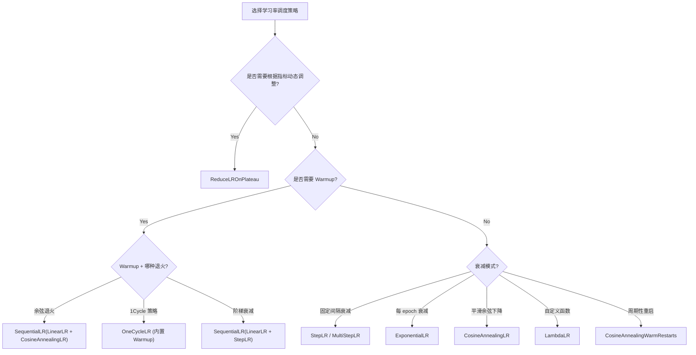

> 本文深入分析 `torch/optim/lr_scheduler.py` 中学习率调度器的实现，包括 `LRScheduler` 基类的设计、常用调度器的数学公式与源码实现，以及调度器链、Warmup 策略和 `ReduceLROnPlateau` 的特殊机制。

## 1. LRScheduler 基类

### 1.1 核心设计

`LRScheduler` 是所有学习率调度器的基类，职责是包装一个 `Optimizer` 实例，按照预定策略在每个 epoch（或 step）调整其 `param_groups` 中的学习率。

源码位于 `torch/optim/lr_scheduler.py`，导出的调度器类有 16 个之多，包括 `StepLR`、`ExponentialLR`、`CosineAnnealingLR`、`OneCycleLR`、`ReduceLROnPlateau` 等。

### 1.2 构造函数

```python
class LRScheduler:
    _get_lr_called_within_step: bool = False
    _is_initial: bool = False

    def __init__(self, optimizer: Optimizer, last_epoch: int = -1) -> None:
        if not isinstance(optimizer, Optimizer):
            raise TypeError(f"{type(optimizer).__name__} is not an Optimizer")
        self.optimizer = optimizer

        # 初始化 base_lrs
        if last_epoch == -1:
            for group in optimizer.param_groups:
                initial_lr = group["lr"]
                group.setdefault("initial_lr", initial_lr)
        else:
            for i, group in enumerate(optimizer.param_groups):
                if "initial_lr" not in group:
                    raise KeyError(...)

        self.base_lrs = _param_groups_val_list(optimizer, "initial_lr")
        self.last_epoch = last_epoch

        # 包装 optimizer.step() 以检测调用顺序
        patch_track_step_called(self.optimizer)
        self._initial_step()
```

关键要点：

1. **`base_lrs`**：存储每个参数组的初始学习率，作为调度计算的基准。通过在 `param_group` 中设置 `initial_lr` 字段保存。
2. **`last_epoch`**：当前的 epoch 计数。默认 `-1` 表示从头开始训练。
3. **`patch_track_step_called`**：包装 `optimizer.step()`，在其内部设置 `_opt_called` 标志，用于检测用户是否在 `scheduler.step()` 之前调用了 `optimizer.step()`。
4. **`_initial_step()`**：在构造函数末尾执行一次初始化步骤，设置初始学习率。

### 1.3 `_initial_step` 与 `_is_initial` 标志

```python
def _initial_step(self) -> None:
    self._step_count = 0
    with _initial_mode(self):
        self.step()
```

`_initial_mode` 上下文管理器设置 `self._is_initial = True`。许多调度器的 `get_lr()` 方法会检查此标志：

```python
# 以 ExponentialLR 为例
def get_lr(self):
    if self._is_initial:
        return _param_groups_val_list(self.optimizer, "lr")  # 保持当前 LR
    return [group["lr"] * self.gamma for group in self.optimizer.param_groups]
```

这确保了构造时的初始化步骤不会错误地修改学习率。

### 1.4 `step()` 方法

```python
def step(self, epoch: int | None = None) -> None:
    # 检测调用顺序：optimizer.step() 应在 scheduler.step() 之前
    if self._step_count == 1:
        if not hasattr(self.optimizer.step, "_wrapped_by_lr_sched"):
            warnings.warn("optimizer.step() has been overridden after scheduler init...")
        elif not getattr(self.optimizer, "_opt_called", False):
            warnings.warn("Detected call of lr_scheduler.step() before optimizer.step()...")

    self._step_count += 1
    if epoch is not None:
        warnings.warn(EPOCH_DEPRECATION_WARNING, ...)
    self._update_lr(epoch)
```

`_update_lr` 是核心更新逻辑：

```python
def _update_lr(self, epoch: int | None = None) -> None:
    with _enable_get_lr_call(self):
        if epoch is None:
            self.last_epoch += 1
            values = self.get_lr()
        else:
            self.last_epoch = epoch
            if hasattr(self, "_get_closed_form_lr"):
                values = self._get_closed_form_lr()
            else:
                values = self.get_lr()

    for param_group, lr in zip(self.optimizer.param_groups, values):
        _update_param_group_val(param_group, "lr", lr)

    self._last_lr = _param_groups_val_list(self.optimizer, "lr")
```

两个关键路径：
- **无 epoch 参数（推荐）**：递增 `last_epoch`，调用 `get_lr()` 计算新学习率。
- **有 epoch 参数（已废弃）**：直接设置 `last_epoch`，优先使用 `_get_closed_form_lr()`。

### 1.5 `get_lr()` vs `_get_closed_form_lr()`

| 方法 | 特点 | 使用场景 |
|------|------|---------|
| `get_lr()` | 递归计算，基于当前 LR | 正常训练时逐步调用 |
| `_get_closed_form_lr()` | 封闭式计算，基于 `base_lrs` | 恢复训练 / 跳到指定 epoch |

`_get_closed_form_lr()` 直接根据 `base_lrs` 和 `last_epoch` 计算目标学习率，不依赖中间状态。这在加载 checkpoint 后恢复到特定 epoch 时非常重要。

## 2. 常用调度器详解

### 2.1 StepLR - 阶梯衰减

每隔 `step_size` 个 epoch，学习率乘以 `gamma`。

**数学公式**：

$$\text{lr} = \text{initial\_lr} \times \gamma^{\lfloor \text{epoch} / \text{step\_size} \rfloor}$$

**源码实现**：

```python
class StepLR(LRScheduler):
    def __init__(self, optimizer, step_size, gamma=0.1, last_epoch=-1):
        self.step_size = step_size
        self.gamma = gamma
        super().__init__(optimizer, last_epoch)

    def get_lr(self):
        if (self.last_epoch == 0) or (self.last_epoch % self.step_size != 0):
            return _param_groups_val_list(self.optimizer, "lr")  # 保持不变
        return [group["lr"] * self.gamma for group in self.optimizer.param_groups]

    def _get_closed_form_lr(self):
        return [base_lr * self.gamma ** (self.last_epoch // self.step_size)
                for base_lr in self.base_lrs]
```

`get_lr()` 采用递推方式：仅在 `last_epoch` 是 `step_size` 的倍数时乘以 `gamma`。`_get_closed_form_lr()` 采用直接计算。

### 2.2 ExponentialLR - 指数衰减

每个 epoch 学习率乘以 `gamma`。

**数学公式**：

$$\text{lr} = \text{initial\_lr} \times \gamma^{\text{epoch}}$$

**源码实现**：

```python
class ExponentialLR(LRScheduler):
    def get_lr(self):
        if self._is_initial:
            return _param_groups_val_list(self.optimizer, "lr")
        return [group["lr"] * self.gamma for group in self.optimizer.param_groups]

    def _get_closed_form_lr(self):
        return [base_lr * self.gamma ** self.last_epoch for base_lr in self.base_lrs]
```

### 2.3 CosineAnnealingLR - 余弦退火

学习率按余弦函数从 $\eta_{max}$ 下降到 $\eta_{min}$。

**数学公式**：

$$\eta_t = \eta_{min} + \frac{1}{2}(\eta_{max} - \eta_{min})\left(1 + \cos\left(\frac{T_{cur} \cdot \pi}{T_{max}}\right)\right)$$

其中 $T_{cur}$ 是当前 epoch，$T_{max}$ 是半周期长度。

**源码实现（递推版本）**：

```python
class CosineAnnealingLR(LRScheduler):
    def get_lr(self):
        if self._is_initial:
            return _param_groups_val_list(self.optimizer, "lr")
        elif self._step_count == 1 and self.last_epoch > 0:
            # 从 checkpoint 恢复时的首次调用
            return [
                self.eta_min + (base_lr - self.eta_min)
                * (1 + math.cos(self.last_epoch * math.pi / self.T_max)) / 2
                for base_lr, group in zip(self.base_lrs, self.optimizer.param_groups)
            ]
        elif (self.last_epoch - 1 - self.T_max) % (2 * self.T_max) == 0:
            # 特殊点处理（周期边界）
            return [
                group["lr"] + (base_lr - self.eta_min)
                * (1 - math.cos(math.pi / self.T_max)) / 2
                for base_lr, group in zip(self.base_lrs, self.optimizer.param_groups)
            ]
        # 递推公式
        return [
            (1 + math.cos(math.pi * self.last_epoch / self.T_max))
            / (1 + math.cos(math.pi * (self.last_epoch - 1) / self.T_max))
            * (group["lr"] - self.eta_min) + self.eta_min
            for group in self.optimizer.param_groups
        ]
```

递推公式的核心是：

$$\eta_{t+1} = \eta_{min} + (\eta_t - \eta_{min}) \cdot \frac{1 + \cos\left(\frac{(T_{cur}+1)\pi}{T_{max}}\right)}{1 + \cos\left(\frac{T_{cur}\pi}{T_{max}}\right)}$$

这避免了每次都从 base_lr 重新计算，使得 CosineAnnealingLR 可以与其他调度器链式组合。

### 2.4 OneCycleLR - 1Cycle 策略

由 Leslie Smith 提出的超收敛策略。学习率先从 `initial_lr` 上升到 `max_lr`（warmup），再下降到 `min_lr`（annealing）。

**特点**：
- 按 **batch** 而非 epoch 调度（`step()` 在每个 batch 后调用）
- 支持 `cos` 和 `linear` 两种退火策略
- 可选三阶段模式（`three_phase=True`）

```python
class OneCycleLR(LRScheduler):
    def __init__(self, optimizer, max_lr, total_steps=None,
                 epochs=None, steps_per_epoch=None, pct_start=0.3,
                 anneal_strategy="cos", cycle_momentum=True, ...):
        # 计算 total_steps
        if total_steps is not None:
            self.total_steps = total_steps
        elif epochs is not None and steps_per_epoch is not None:
            self.total_steps = epochs * steps_per_epoch

        # 定义阶段
        if three_phase:
            self._schedule_phases = [
                {"end_step": pct_start * total_steps - 1,
                 "start_lr": "initial_lr", "end_lr": "max_lr", ...},
                {"end_step": 2 * pct_start * total_steps - 2,
                 "start_lr": "max_lr", "end_lr": "initial_lr", ...},
                {"end_step": total_steps - 1,
                 "start_lr": "initial_lr", "end_lr": "min_lr", ...},
            ]
        else:
            self._schedule_phases = [
                {"end_step": pct_start * total_steps - 1,
                 "start_lr": "initial_lr", "end_lr": "max_lr", ...},
                {"end_step": total_steps - 1,
                 "start_lr": "max_lr", "end_lr": "min_lr", ...},
            ]
```

关键参数：
- `initial_lr = max_lr / div_factor`（默认 div_factor=25）
- `min_lr = initial_lr / final_div_factor`（默认 final_div_factor=1e4）
- `pct_start=0.3` 表示前 30% 的步数用于 warmup

### 2.5 ReduceLROnPlateau - 自适应衰减

与其他调度器不同，`ReduceLROnPlateau` 不是基于 epoch 计数，而是基于验证指标的表现来调整学习率。

**核心逻辑**：

```python
class ReduceLROnPlateau(LRScheduler):
    def step(self, metrics, epoch=None):
        current = float(metrics)
        if self._is_better(current, self.best):
            self.best = current
            self.num_bad_epochs = 0
        else:
            self.num_bad_epochs += 1

        if self.in_cooldown:
            self.cooldown_counter -= 1
            self.num_bad_epochs = 0

        if self.num_bad_epochs > self.patience:
            self._reduce_lr(epoch)
            self.cooldown_counter = self.cooldown
            self.num_bad_epochs = 0

    def _reduce_lr(self, epoch):
        for i, param_group in enumerate(self.optimizer.param_groups):
            old_lr = float(param_group["lr"])
            new_lr = max(old_lr * self.factor, self.min_lrs[i])
            if old_lr - new_lr > self.eps:
                _update_param_group_val(param_group, "lr", new_lr)
```

重要参数：
- `mode="min"/"max"`：指标优化方向
- `patience`：允许的不改善 epoch 数
- `factor`：衰减系数（`new_lr = old_lr * factor`）
- `cooldown`：衰减后的冷却期
- `threshold` 和 `threshold_mode`：判断"改善"的阈值

注意 `ReduceLROnPlateau` 的 `step()` 方法签名与其他调度器不同，它要求传入指标值：

```python
scheduler.step(val_loss)  # 而非 scheduler.step()
```

## 3. 调度器链和组合

### 3.1 ChainedScheduler

`ChainedScheduler` 将多个调度器顺序串联，每次调用 `step()` 时依次执行所有子调度器的 `step()`：

```python
class ChainedScheduler(LRScheduler):
    def __init__(self, schedulers, optimizer=None):
        self._schedulers = list(schedulers)
        # 验证所有 scheduler 共享同一个 optimizer
        ...

    def step(self):
        for scheduler in self._schedulers:
            scheduler.step()
```

效果是**乘法组合**：如果两个调度器分别将 LR 乘以 0.5 和 0.8，最终效果是乘以 0.4。

### 3.2 SequentialLR

`SequentialLR` 在不同的训练阶段使用不同的调度器，通过 `milestones` 切换：

```python
# 前 10 epoch 使用 LinearLR warmup，之后使用 CosineAnnealingLR
warmup = LinearLR(optimizer, start_factor=0.1, total_iters=10)
cosine = CosineAnnealingLR(optimizer, T_max=90)
scheduler = SequentialLR(optimizer, schedulers=[warmup, cosine], milestones=[10])
```

### 3.3 Warmup 模式

Warmup 不是一个单独的类，而是通过组合实现的常见模式：

**线性 Warmup + 余弦退火**（最常用）：

```python
warmup = LinearLR(optimizer, start_factor=1/warmup_steps, total_iters=warmup_steps)
main = CosineAnnealingLR(optimizer, T_max=total_steps - warmup_steps)
scheduler = SequentialLR(optimizer, [warmup, main], milestones=[warmup_steps])
```

**恒定 Warmup + 阶梯衰减**：

```python
warmup = ConstantLR(optimizer, factor=0.1, total_iters=5)
main = StepLR(optimizer, step_size=30, gamma=0.1)
scheduler = SequentialLR(optimizer, [warmup, main], milestones=[5])
```

## 4. 调度器类型决策流程



## 5. 序列化与恢复

### 5.1 `state_dict` / `load_state_dict`

```python
def state_dict(self):
    return {key: value for key, value in self.__dict__.items() if key != "optimizer"}

def load_state_dict(self, state_dict):
    self.__dict__.update(state_dict)
```

基类的实现简单直接：保存除 `optimizer` 外的所有属性。`LambdaLR` 和 `MultiplicativeLR` 覆写了这些方法以处理不可序列化的 lambda 函数。

### 5.2 恢复训练的注意事项

恢复训练时的正确顺序：

```python
# 1. 创建模型和优化器
model = MyModel()
optimizer = Adam(model.parameters(), lr=1e-3)

# 2. 创建调度器（会覆写 optimizer 的 lr）
scheduler = CosineAnnealingLR(optimizer, T_max=100)

# 3. 加载调度器状态
scheduler.load_state_dict(checkpoint["scheduler"])

# 4. 最后加载优化器状态（恢复正确的 lr）
optimizer.load_state_dict(checkpoint["optimizer"])
```

必须先加载 scheduler 再加载 optimizer，因为 scheduler 初始化会覆写 `param_group["lr"]`，而 `optimizer.load_state_dict()` 会恢复正确的学习率值。

## 6. 辅助机制

### 6.1 `_warn_get_lr_called_within_step`

```python
def _warn_get_lr_called_within_step(lr_scheduler):
    if not lr_scheduler._get_lr_called_within_step:
        warnings.warn("To get the last learning rate, use `get_last_lr()`.")
```

这个机制防止用户在 `step()` 外部直接调用 `get_lr()`。正确的获取当前学习率的方式是 `get_last_lr()`。

### 6.2 `_update_param_group_val`

```python
def _update_param_group_val(param_group, key, val):
    if isinstance(param_group[key], Tensor):
        param_group[key].fill_(_to_scalar(val))  # 原地修改
    else:
        param_group[key] = val  # 直接赋值
```

当学习率是张量（用于 `capturable` 模式）时，使用 `fill_` 原地修改以保持张量引用不变。这对 CUDA Graph 至关重要。

## 7. 小结

PyTorch 的学习率调度器系统的设计特点：

1. **统一基类**：`LRScheduler` 提供了 `get_lr()` / `step()` / `state_dict()` 的统一接口。
2. **递推 + 封闭式双路径**：`get_lr()` 用于逐步递推，`_get_closed_form_lr()` 用于恢复到指定 epoch。
3. **灵活组合**：通过 `SequentialLR` 和 `ChainedScheduler` 可以构建任意复杂的学习率策略。
4. **安全检查**：自动检测 `optimizer.step()` 和 `scheduler.step()` 的调用顺序。
5. **特殊调度器**：`ReduceLROnPlateau` 和 `OneCycleLR` 各有独特的 `step()` 签名和行为。
