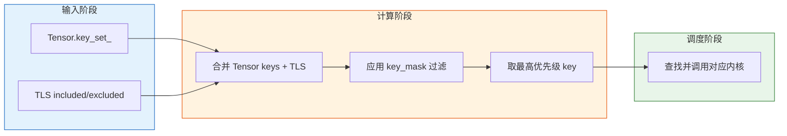
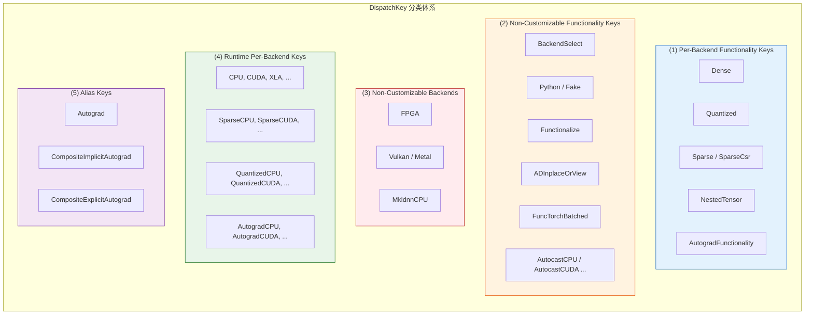
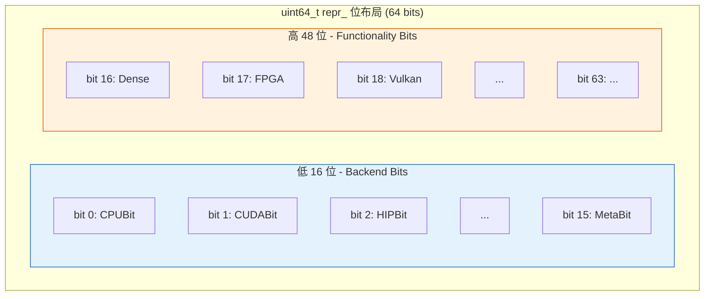
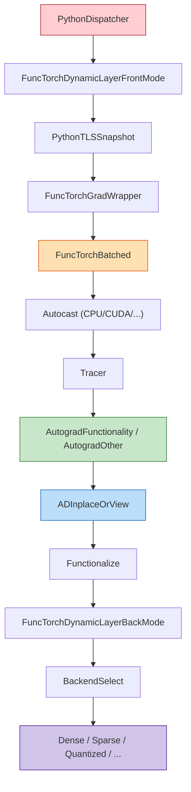

> 本文面向有一定 C++ 基础的中级读者，深入解析 PyTorch 调度系统的基石 -- DispatchKey 与 DispatchKeySet。
> 核心源码位置: `c10/core/DispatchKey.h`, `c10/core/DispatchKeySet.h`, `c10/core/impl/LocalDispatchKeySet.h`
> 难度: 中级

---

## 1. 概述

DispatchKey 是 PyTorch 调度系统中最基本的"路由标签"。每一个 Tensor 操作（如 `torch.add`、`torch.matmul`）在执行时，都需要经过调度器（Dispatcher）决定将操作路由到哪个具体的内核实现。DispatchKey 就是这个路由决策的核心标识。

例如，一个 CPU 上的普通浮点 Tensor 会携带 `Dense` + `CPUBit` 组合的调度键，而一个需要梯度的 CUDA Tensor 则还会额外携带 `AutogradFunctionality` + `CUDABit`。调度器通过读取 Tensor 上的 `DispatchKeySet`，结合线程局部状态（TLS），确定最终应该调用哪个内核。



DispatchKey 体系定义在 `c10/core/` 目录下，是 `c10` 核心库的组成部分，被 PyTorch 的所有 Tensor 操作所依赖。

---

## 2. 前置知识

阅读本文前，建议先了解以下内容：

| 前置模块 | 内容 | 关联点 |
|---------|------|--------|
| Module 0 - 架构总览 | PyTorch 整体架构与执行流程 | 理解调度器在整体架构中的位置 |
| Module 1 - TensorImpl | `TensorImpl` 的核心成员 `key_set_` | `DispatchKeySet` 存储在每个 Tensor 的 `TensorImpl` 中 |

在 `TensorImpl` 中，`key_set_` 成员变量存储了该 Tensor 对应的所有调度键：

```cpp
// c10/core/TensorImpl.h
struct C10_API TensorImpl : public c10::intrusive_ptr_target {
    // ...
    DispatchKeySet key_set_;  // 该 Tensor 的调度键集合
    // ...
};
```

---

## 3. BackendComponent - 后端组件

### 3.1 定义

`BackendComponent` 枚举定义了所有可能的后端标识位。每个后端组件在 `DispatchKeySet` 的低位区域占据一个比特位。

```cpp
// c10/core/DispatchKey.h (line 65-103)
enum class BackendComponent : uint8_t {
    InvalidBit = 0,
    CPUBit,
    CUDABit,
    HIPBit,
    XLABit,
    MPSBit,
    IPUBit,
    XPUBit,
    HPUBit,
    VEBit,
    LazyBit,
    MTIABit,
    MAIABit,
    PrivateUse1Bit,
    PrivateUse2Bit,
    PrivateUse3Bit,
    MetaBit,

    EndOfBackendKeys = MetaBit,
};
```

所有后端组件通过宏 `C10_FORALL_BACKEND_COMPONENTS` 统一管理，便于批量代码生成。

### 3.2 后端组件一览

| 后端组件 | 枚举值 | 说明 |
|---------|--------|------|
| `InvalidBit` | 0 | 无效占位符 |
| `CPUBit` | 1 | CPU 后端 |
| `CUDABit` | 2 | NVIDIA CUDA GPU |
| `HIPBit` | 3 | AMD ROCm HIP |
| `XLABit` | 4 | Google XLA (TPU 等) |
| `MPSBit` | 5 | Apple Metal Performance Shaders |
| `IPUBit` | 6 | Graphcore IPU |
| `XPUBit` | 7 | Intel XPU |
| `HPUBit` | 8 | Habana HPU |
| `VEBit` | 9 | NEC Vector Engine |
| `LazyBit` | 10 | Lazy Tensor (延迟执行) |
| `MTIABit` | 11 | Meta Training and Inference Accelerator |
| `MAIABit` | 12 | Microsoft MAIA |
| `PrivateUse1Bit` | 13 | 用户自定义后端 1 |
| `PrivateUse2Bit` | 14 | 用户自定义后端 2 |
| `PrivateUse3Bit` | 15 | 用户自定义后端 3 |
| `MetaBit` | 16 | Meta Tensor（无实际数据） |

> 注意: `MetaBit` 必须放在最后，确保 Meta key 在 TLS 中触发时优先级最低。后端组件的总数不超过 16 个，这是 `DispatchKeySet` 内部表示的一个硬约束。

```cpp
// c10/core/DispatchKey.h (line 567-570)
static_assert(
    static_cast<uint8_t>(BackendComponent::EndOfBackendKeys) <= 16,
    "BackendComponent currently only supports <= 16 backends.");
```

---

## 4. DispatchKey 枚举详解

### 4.1 整体分类

`DispatchKey` 是一个 `uint16_t` 枚举，定义在 `c10/core/DispatchKey.h` (line 136)。根据源码注释 `Note [DispatchKey Classification]`，可以将所有 key 分为五大类：



### 4.2 Per-Backend Functionality Keys（可按后端定制的功能键）

这些 key 在 `DispatchKeySet` 中只占一个功能位，但会与 `BackendComponent` 组合，在运行时操作符表中生成多个槽位。

```cpp
// c10/core/DispatchKey.h (line 57-63)
#define C10_FORALL_FUNCTIONALITY_KEYS(_) \
  _(Dense, )                             \
  _(Quantized, Quantized)                \
  _(Sparse, Sparse)                      \
  _(SparseCsr, SparseCsr)                \
  _(NestedTensor, NestedTensor)          \
  _(AutogradFunctionality, Autograd)
```

| 功能键 | 说明 | 运行时实例示例 |
|-------|------|--------------|
| `Dense` | 标准稠密 Tensor 操作 | CPU, CUDA, XLA, MPS, Meta ... |
| `Quantized` | 量化 Tensor 操作 | QuantizedCPU, QuantizedCUDA ... |
| `Sparse` | COO 稀疏 Tensor 操作 | SparseCPU, SparseCUDA ... |
| `SparseCsr` | CSR 稀疏 Tensor 操作 | SparseCsrCPU, SparseCsrCUDA ... |
| `NestedTensor` | 嵌套 Tensor 操作 | NestedTensorCPU, NestedTensorCUDA ... |
| `AutogradFunctionality` | 自动求导 | AutogradCPU, AutogradCUDA ... |

### 4.3 Non-Customizable Functionality Keys（不可按后端定制的功能键）

这些 key 只有唯一的处理函数，不与后端组合：

```cpp
// c10/core/DispatchKey.h (line 222-421) 摘选
BackendSelect,       // 在无 tensor 参数时选择正确后端
Python,              // Python 层调度
Fake,                // Fake Tensor 支持
Functionalize,       // 别名和变异消除
ADInplaceOrView,     // inplace/view 操作的自动求导准备
FuncTorchBatched,    // vmap 批处理
FuncTorchGradWrapper,// functorch 梯度
AutocastCPU,         // CPU 自动混合精度
AutocastCUDA,        // CUDA 自动混合精度
PythonDispatcher,    // 跳过 C++ 调度器
```

### 4.4 Alias Keys（别名键）

别名键不直接对应运行时的调度表槽位，而是映射到多个运行时 key。注册到别名键的内核会在调度表计算时被填充到对应的运行时 key 槽位中。

```cpp
// c10/core/DispatchKey.h (line 457-481)
Autograd,                                // 映射到所有 Autograd* 运行时 key
CompositeImplicitAutograd,               // 默认 autograd 公式
CompositeExplicitAutograd,               // 显式指定 autograd 的组合算子
CompositeExplicitAutogradNonFunctional,  // 非函数化版本
FuncTorchBatchedDecomposition,           // functorch 批处理分解
```

当运行时 key 和别名 key 都注册了内核时，运行时 key 始终拥有更高优先级。

---

## 5. DispatchKeySet - 位集合表示

### 5.1 内部表示

`DispatchKeySet` 使用一个 64 位无符号整数 `repr_` 来紧凑地表示一组调度键：

```cpp
// c10/core/DispatchKeySet.h (line 167, 516)
class DispatchKeySet final {
 private:
    uint64_t repr_ = 0;
};
```

### 5.2 位布局

64 位的 `repr_` 按如下方式划分：



具体来说：

- **低 `num_backends` 位**（约 16 位）: 存放 `BackendComponent` 位。每个后端对应一个比特。
- **高 `num_functionality_keys` 位**: 存放功能键位。每个功能键对应一个比特。

这种设计使得功能键和后端组件可以自由组合，而无需为每种 `(功能, 后端)` 组合分配独立的位。组合数量从 `O(F x B)` 降低到 `O(F + B)`，极大地节省了位空间。

### 5.3 构造函数

`DispatchKeySet` 有多种构造方式，核心逻辑分为三种情况：

```cpp
// c10/core/DispatchKeySet.h (line 206-250) 简化
constexpr explicit DispatchKeySet(DispatchKey k) {
    if (k == DispatchKey::Undefined) {
        // Case 1: 未定义 -> 空集合
        repr_ = 0;
    } else if (k <= DispatchKey::EndOfFunctionalityKeys) {
        // Case 2: 纯功能键 -> 只设置功能位
        repr_ = 1ULL << (num_backends + static_cast<uint8_t>(k) - 1);
    } else if (k <= DispatchKey::EndOfRuntimeBackendKeys) {
        // Case 3: 运行时 per-backend key -> 同时设置功能位和后端位
        auto functionality_k = toFunctionalityKey(k);
        uint64_t functionality_val = 1ULL << (num_backends + ...);
        auto backend_k = toBackendComponent(k);
        uint64_t backend_val = 1ULL << (static_cast<uint8_t>(backend_k) - 1);
        repr_ = functionality_val + backend_val;
    }
}
```

例如，构造 `DispatchKeySet(DispatchKey::CUDA)` 时，会同时设置 `Dense` 功能位和 `CUDABit` 后端位。

### 5.4 核心操作方法

| 方法 | 签名 | 说明 |
|-----|------|------|
| `has` | `bool has(DispatchKey) const` | 检测某个 key 是否在集合中 |
| `has_all` | `bool has_all(DispatchKeySet) const` | 检测是否包含给定集合的所有 key |
| `has_any` | `bool has_any(DispatchKeySet) const` | 检测是否与给定集合有交集 |
| `add` | `DispatchKeySet add(DispatchKey) const` | 返回添加了指定 key 的新集合（不可变） |
| `remove` | `DispatchKeySet remove(DispatchKey) const` | 返回移除了指定功能位的新集合 |
| `operator\|` | `DispatchKeySet operator\|(DispatchKeySet) const` | 集合并集 |
| `operator&` | `DispatchKeySet operator&(DispatchKeySet) const` | 集合交集 |
| `operator-` | `DispatchKeySet operator-(DispatchKeySet) const` | 集合差集（仅影响功能位） |

**关于 `operator-` 的重要细节**: 差集操作只移除功能位，不移除后端位。这是有意为之的设计：

```cpp
// c10/core/DispatchKeySet.h (line 338-339)
constexpr DispatchKeySet operator-(DispatchKeySet other) const {
    return DispatchKeySet(repr_ & (full_backend_mask | ~other.repr_));
}
```

这意味着 `DispatchKeySet(DispatchKey::AutogradCUDA) - DispatchKeySet(DispatchKey::AutogradCUDA)` 只移除 `AutogradFunctionality` 功能位，保留 `CUDABit` 后端位。

### 5.5 关键查询方法

```cpp
// c10/core/DispatchKeySet.h (line 407-441)

// 获取最高优先级的功能键
DispatchKey highestFunctionalityKey() const {
    auto functionality_idx = indexOfHighestBit();
    if (functionality_idx < num_backends)
        return DispatchKey::Undefined;
    return static_cast<DispatchKey>(functionality_idx - num_backends);
}

// 获取最高优先级的后端组件
BackendComponent highestBackendKey() const {
    auto backend_idx =
        DispatchKeySet(repr_ & full_backend_mask).indexOfHighestBit();
    if (backend_idx == 0)
        return BackendComponent::InvalidBit;
    return static_cast<BackendComponent>(backend_idx);
}

// 获取最高优先级的运行时 DispatchKey
DispatchKey highestPriorityTypeId() const {
    auto functionality_k = highestFunctionalityKey();
    if (isPerBackendFunctionalityKey(functionality_k)) {
        return toRuntimePerBackendFunctionalityKey(
            functionality_k, highestBackendKey());
    }
    return functionality_k;
}
```

`highestPriorityTypeId()` 是调度的核心，它结合了功能优先级和后端选择，返回最终应该调度到的运行时 key。

---

## 6. DispatchKey 优先级

### 6.1 优先级规则

功能键在 `DispatchKeySet` 中的位越高（即 `DispatchKey` 枚举值越大），优先级越高。调度器通过 "count leading zeros" 找到最高位的功能键来确定优先级。

### 6.2 调度顺序

从高优先级到低优先级的典型调度路径如下：



### 6.3 优先级示意

以 `torch.add(a, b)` 为例，假设 `a` 是一个 `requires_grad=True` 的 CUDA Tensor：

```
Tensor key_set = Dense | CUDABit | AutogradFunctionality | CUDABit
                       (后端位在 OR 时合并)

有效 key_set (合并 TLS 后) 包含:
  - AutogradFunctionality (高优先级, 先处理)
  - ADInplaceOrView       (来自 TLS included)
  - BackendSelect         (来自 TLS included)
  - Dense                 (最终的后端计算)

调度顺序: AutogradFunctionality -> ADInplaceOrView -> BackendSelect -> Dense
                                                                        |
                                                              结合 CUDABit -> CUDA kernel
```

每一层处理完自己的逻辑后，会将自身从 TLS excluded 中标记，然后重新调度到下一个优先级。

---

## 7. Thread Local State (TLS) 管理

### 7.1 PODLocalDispatchKeySet

TLS 管理定义在 `c10/core/impl/LocalDispatchKeySet.h` (line 31-51)。每个线程维护两个 `DispatchKeySet`：

```cpp
// c10/core/impl/LocalDispatchKeySet.h (line 31-51)
struct C10_API PODLocalDispatchKeySet {
    uint64_t included_;   // 额外包含的 key（XOR 编码）
    uint64_t excluded_;   // 额外排除的 key（XOR 编码）

    DispatchKeySet included() const {
        return DispatchKeySet(DispatchKeySet::RAW, included_) ^
            c10::default_included_set;
    }
    DispatchKeySet excluded() const {
        return DispatchKeySet(DispatchKeySet::RAW, excluded_) ^
            c10::default_excluded_set;
    }
};
```

### 7.2 XOR 编码技巧

`PODLocalDispatchKeySet` 是一个 POD 类型，TLS 要求零初始化。但默认状态下，某些 key 需要被包含（如 `BackendSelect`、`ADInplaceOrView`），某些 key 需要被排除（如各种 `Autocast` key）。

解决方案是使用 XOR 编码：内部存储值与默认集合做 XOR，这样零初始化后经过 XOR 解码就能得到正确的默认集合：

```
zero-initialized included_ = 0
actual included = 0 XOR default_included_set = default_included_set
                 = {BackendSelect, ADInplaceOrView}
```

### 7.3 有效 key 的计算公式

```
effective_keys = ((tensor_keys | tls_included) - tls_excluded) & key_mask
```

- `tensor_keys`: 从 Tensor 的 `key_set_` 获取
- `tls_included`: TLS 中额外包含的 key（默认包含 `BackendSelect` 和 `ADInplaceOrView`）
- `tls_excluded`: TLS 中排除的 key（默认排除各种 `Autocast` key）
- `key_mask`: 操作符级别的掩码，用于过滤 fallthrough key

### 7.4 RAII Guards

PyTorch 提供三种 RAII guard 来管理 TLS 状态：

```cpp
// 1. IncludeDispatchKeyGuard - 临时包含一个 key
{
    c10::impl::IncludeDispatchKeyGuard guard(DispatchKey::AutocastCUDA);
    // 在此范围内，AutocastCUDA 被包含在 TLS included 中
    // 退出时自动恢复
}

// 2. ExcludeDispatchKeyGuard - 临时排除一个 key（最常用）
{
    c10::impl::ExcludeDispatchKeyGuard guard(DispatchKey::AutogradCPU);
    // Autograd 处理完后用此 guard 排除自身，避免无限递归
    // 退出时自动恢复
}

// 3. ForceDispatchKeyGuard - 强制设置整个 TLS 状态
{
    c10::impl::ForceDispatchKeyGuard guard(include_set, exclude_set);
    // 完全覆盖当前 TLS，退出时恢复之前的状态
}
```

### 7.5 TLS 状态转换

```mermaid
stateDiagram-v2
    [*] --> Default: 线程创建

    Default --> AutogradActive: 操作触发调度
    note right of Default
        included = {BackendSelect, ADInplaceOrView}
        excluded = {各 Autocast keys}
    end note

    AutogradActive --> AutogradExcluded: ExcludeDispatchKeyGuard(Autograd)
    note right of AutogradActive
        Autograd 处理梯度记录
    end note

    AutogradExcluded --> BackendDispatch: 继续向下调度
    note right of AutogradExcluded
        excluded += AutogradFunctionality
        ADInplaceOrView 处理 version bump
    end note

    BackendDispatch --> KernelExec: 最终到达后端内核
    note right of BackendDispatch
        根据 BackendComponent 选择
        CPU/CUDA/XLA 等具体实现
    end note

    KernelExec --> [*]: RAII guard 析构, 恢复 TLS
```

---

## 8. Per-Backend Functionality 组合机制

### 8.1 组合原理

Per-Backend Functionality 是 PyTorch 调度系统的精髓设计之一。它将"做什么"（功能）和"在哪做"（后端）正交分离，通过位运算动态组合。

```
运行时 Key = 功能键 x 后端组件
```

例如：
- `AutogradFunctionality` x `CUDABit` = `AutogradCUDA`
- `Dense` x `CPUBit` = `CPU`
- `Sparse` x `CUDABit` = `SparseCUDA`

### 8.2 核心转换函数

**`toRuntimePerBackendFunctionalityKey`** - 从功能键和后端组件计算运行时 key：

```cpp
// c10/core/DispatchKey.h (line 687-722)
constexpr DispatchKey toRuntimePerBackendFunctionalityKey(
    DispatchKey functionality_k,
    BackendComponent backend_k) {
    if (functionality_k == DispatchKey::Dense) {
        return static_cast<DispatchKey>(
            static_cast<uint8_t>(DispatchKey::StartOfDenseBackends) +
            static_cast<uint8_t>(backend_k));
    }
    // Sparse, SparseCsr, Quantized, NestedTensor, AutogradFunctionality
    // 类似处理...
}
```

**`toBackendComponent`** - 从运行时 key 提取后端组件：

```cpp
// c10/core/DispatchKey.h (line 617-657)
constexpr BackendComponent toBackendComponent(DispatchKey k) {
    if (k >= DispatchKey::StartOfDenseBackends &&
        k <= DispatchKey::EndOfDenseBackends) {
        return static_cast<BackendComponent>(
            static_cast<uint8_t>(k) -
            static_cast<uint8_t>(DispatchKey::StartOfDenseBackends));
    }
    // 对 Quantized, Sparse, SparseCsr, NestedTensor,
    // AutogradFunctionality 各区间做相同处理...
}
```

**`toFunctionalityKey`** - 从运行时 key 提取功能键：

```cpp
// c10/core/DispatchKey.h (line 659-677)
constexpr DispatchKey toFunctionalityKey(DispatchKey k) {
    if (k <= DispatchKey::EndOfFunctionalityKeys) return k;
    else if (k <= DispatchKey::EndOfDenseBackends) return DispatchKey::Dense;
    else if (k <= DispatchKey::EndOfQuantizedBackends) return DispatchKey::Quantized;
    else if (k <= DispatchKey::EndOfSparseBackends) return DispatchKey::Sparse;
    // ...
}
```

### 8.3 运行时操作符表索引

调度表的槽位数计算如下：

```cpp
// c10/core/DispatchKey.h (line 585-586)
constexpr uint16_t num_runtime_entries = num_functionality_keys +
    (numPerBackendFunctionalityKeys() * (num_backends - 1));
```

即：所有功能键各占一个槽位，加上每个 per-backend 功能键额外的 `(num_backends - 1)` 个槽位（因为已在功能键中计过一次）。

`FunctionalityOffsetAndMask` 结构体存储每个功能键在操作符表中的起始偏移和后端掩码：

```cpp
// c10/core/DispatchKeySet.h (line 22-35)
struct FunctionalityOffsetAndMask {
    uint16_t offset;  // 在操作符表中的起始偏移
    uint16_t mask;    // 后端位掩码
};
```

---

## 9. computeDispatchKeySet 函数

### 9.1 函数定义

这是整个调度系统中最核心的函数之一，定义在 `aten/src/ATen/core/dispatch/DispatchKeyExtractor.h` (line 24-47):

```cpp
inline DispatchKeySet computeDispatchKeySet(
    DispatchKeySet ks,
    DispatchKeySet key_mask) {
  c10::impl::LocalDispatchKeySet local =
      c10::impl::tls_local_dispatch_key_set();
  return (((ks | local.included_) - local.excluded_) & key_mask);
}
```

### 9.2 逐步分解

以一个 `requires_grad=True` 的 CUDA Tensor 上的 `torch.add` 调用为例：

```
步骤 1: ks = tensor.key_set_
         = {Dense, CUDABit, AutogradFunctionality, CUDABit}
         repr_ = ...0001_0001_0000_0000_0000_0010  (功能位 Dense + Autograd, 后端位 CUDA)

步骤 2: ks | local.included_
         local.included_ = {BackendSelect, ADInplaceOrView}
         结果 = {Dense, BackendSelect, ADInplaceOrView, AutogradFunctionality, CUDABit}

步骤 3: result - local.excluded_
         local.excluded_ = {AutocastCPU, AutocastCUDA, ...}  (默认排除)
         结果 = 步骤 2 结果不变 (因为被排除的 key 原本就不在集合中)

步骤 4: result & key_mask
         key_mask 过滤掉该操作符上标记为 fallthrough 的 key
         最终结果 = 有效的待调度 key 集合

步骤 5: highestPriorityTypeId()
         取最高优先级 key -> AutogradCUDA
         (AutogradFunctionality 功能位 + CUDABit 后端位)
```

### 9.3 key_mask 的作用

`key_mask` 有两个用途：
1. **Fallthrough 过滤**: 如果某个操作符在特定 key 上注册了 fallthrough 内核，该 key 会从 mask 中移除
2. **Redispatch 跳过**: 当使用 `at::redispatch` 时，mask 用于跳过指定的 key

---

## 10. 实战示例

### 10.1 查看 Tensor 的 DispatchKeySet

```python
import torch

# CPU 普通 Tensor
t_cpu = torch.randn(3, 4)
print(t_cpu._dispatch_key_set())
# DispatchKeySet(CPU, Dense)

# CUDA Tensor
if torch.cuda.is_available():
    t_cuda = t_cpu.cuda()
    print(t_cuda._dispatch_key_set())
    # DispatchKeySet(CUDA, Dense)

# 需要梯度的 Tensor
t_grad = torch.randn(3, 4, requires_grad=True)
print(t_grad._dispatch_key_set())
# DispatchKeySet(CPU, AutogradCPU, Dense)

# 稀疏 Tensor
t_sparse = t_cpu.to_sparse()
print(t_sparse._dispatch_key_set())
# DispatchKeySet(CPU, SparseCPU, Sparse)
```

### 10.2 查看操作符的注册信息

```python
import torch

# 查看某个 dispatch key 下注册的所有操作
registrations = torch._C._dispatch_get_registrations_for_dispatch_key("CPU")
print(f"CPU 上注册了 {len(registrations)} 个操作")
for reg in list(registrations)[:5]:
    print(f"  {reg}")

# 检查特定操作是否在特定 key 上有内核
has_cpu = torch._C._dispatch_has_kernel_for_dispatch_key(
    "aten::add.Tensor", "CPU")
print(f"aten::add.Tensor 在 CPU 上有内核: {has_cpu}")

has_autograd = torch._C._dispatch_has_kernel_for_dispatch_key(
    "aten::add.Tensor", "AutogradCPU")
print(f"aten::add.Tensor 在 AutogradCPU 上有内核: {has_autograd}")
```

### 10.3 查看调度表

```python
import torch

# 打印 aten::add.Tensor 的完整调度表
print(torch._C._dispatch_dump("aten::add.Tensor"))
```

输出会显示每个 DispatchKey 对应的内核（或 fallthrough/undefined）。

---

## 11. 小结

| 概念 | 定义位置 | 核心作用 |
|-----|---------|---------|
| `BackendComponent` | `c10/core/DispatchKey.h` | 标识计算后端（CPU/CUDA/XLA 等），占据 `DispatchKeySet` 的低 16 位 |
| `DispatchKey` | `c10/core/DispatchKey.h` | 调度路由标签，分为功能键、运行时键和别名键三大类 |
| `DispatchKeySet` | `c10/core/DispatchKeySet.h` | 64 位位集合，紧凑表示多个调度键的组合 |
| Per-Backend Functionality | `c10/core/DispatchKey.h` | 功能键 x 后端组件的正交组合机制，生成运行时调度键 |
| `computeDispatchKeySet` | `aten/src/ATen/core/dispatch/DispatchKeyExtractor.h` | 合并 Tensor keys、TLS 状态和 key mask，计算有效调度键 |
| `PODLocalDispatchKeySet` | `c10/core/impl/LocalDispatchKeySet.h` | 线程局部的 included/excluded 键集合，使用 XOR 编码 |
| `ExcludeDispatchKeyGuard` | `c10/core/impl/LocalDispatchKeySet.h` | RAII guard，调度层处理完后排除自身避免无限递归 |
| `highestPriorityTypeId()` | `c10/core/DispatchKeySet.h` | 取集合中最高优先级的运行时 key，决定最终调度目标 |
| `toRuntimePerBackendFunctionalityKey` | `c10/core/DispatchKey.h` | 将 (功能键, 后端组件) 对转换为运行时 DispatchKey |
| Alias Keys | `c10/core/DispatchKey.h` | 映射到多个运行时 key 的别名，用于注册共享内核 |

---

## 延伸阅读

- [02-dispatcher-core.md](./02-dispatcher-core.md) - Dispatcher 核心机制，DispatchKey 如何驱动实际的调度流程
- [Module 1 - TensorImpl 深度解析](../module-01-tensor-storage/01-tensorimpl-deep-dive.md) - 了解 `key_set_` 在 TensorImpl 中的存储方式
- [Module 0 - 执行流程总览](../module-00-overview/03-execution-flow-overview.md) - 从更高层面理解调度在整个执行流程中的位置
- [Module 2 - Autograd](../module-02-autograd/01-computational-graph.md) - Autograd DispatchKey 如何触发梯度计算
- PyTorch 官方文档: [Dispatcher in C++](https://pytorch.org/tutorials/advanced/dispatcher.html)
