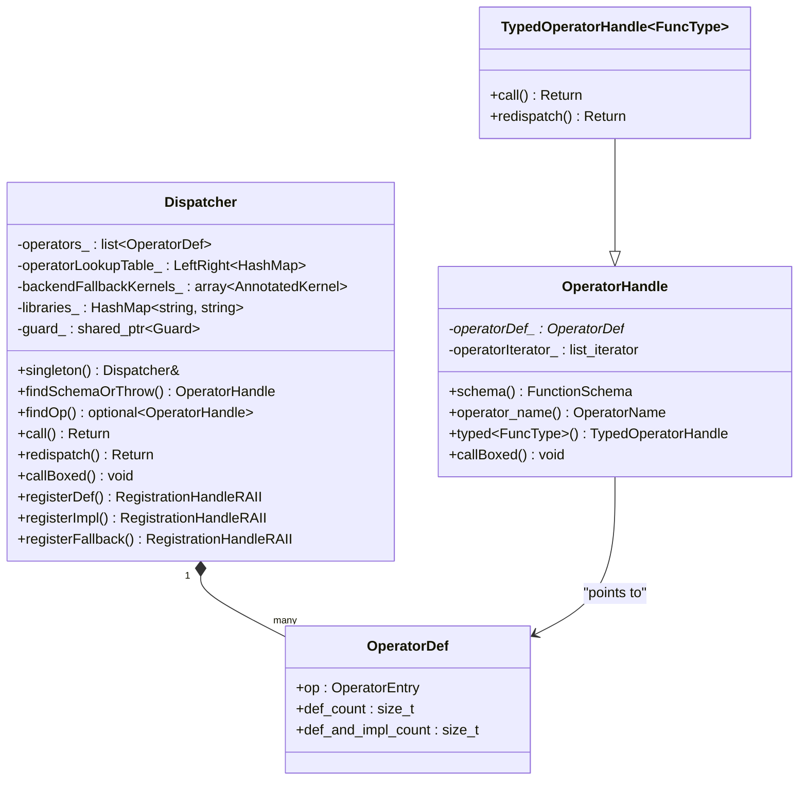
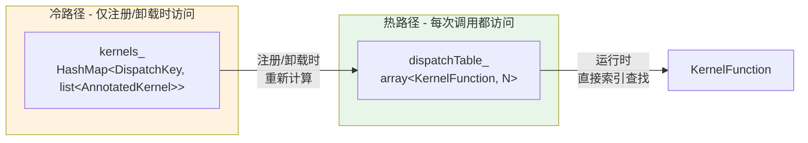
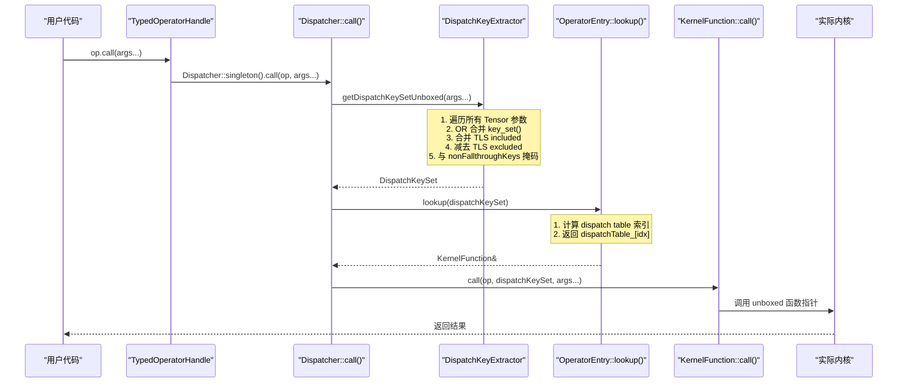
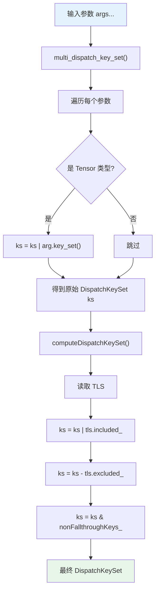
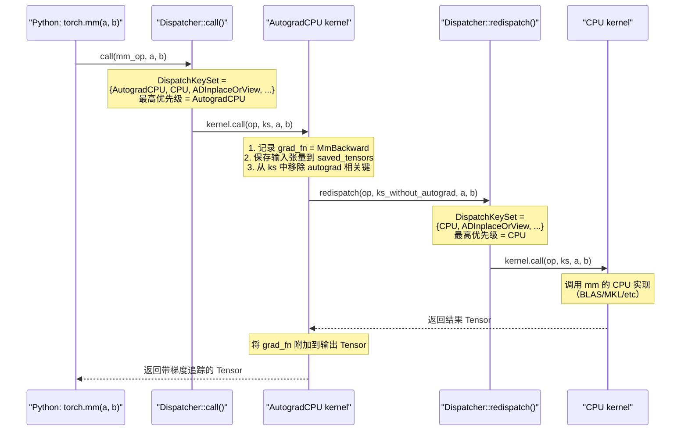
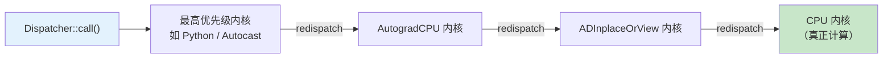

> Dispatcher 是 PyTorch 所有张量操作的中央路由引擎。每一次 `torch.add`、`torch.mm` 等算子调用，
> 都要经过 Dispatcher 的分发链路——从提取 DispatchKey、查找内核函数到最终执行。
> 本文深入剖析 Dispatcher 的单例架构、算子注册表、分发调用链以及 redispatch 机制。

---

## 1. 概述

PyTorch 的 Dispatcher 是一个全局单例对象，承担着**算子注册**与**运行时分发**两大核心职责。它维护着所有已注册算子的元数据（schema）、各 DispatchKey 对应的内核函数，并在每次算子调用时执行以下关键步骤：

1. 从输入 Tensor 的 `key_set()` 中提取 `DispatchKeySet`
2. 结合 TLS（线程局部状态）计算最终的分发键集合
3. 在算子的分发表中查找最高优先级键对应的 `KernelFunction`
4. 调用该内核函数

核心源码位于：

| 文件 | 职责 |
|------|------|
| `aten/src/ATen/core/dispatch/Dispatcher.h` | Dispatcher 类定义与内联调用路径 |
| `aten/src/ATen/core/dispatch/Dispatcher.cpp` | 单例初始化、注册逻辑、查找逻辑 |
| `aten/src/ATen/core/dispatch/OperatorEntry.h` | 单个算子的注册表与分发表 |
| `aten/src/ATen/core/dispatch/DispatchKeyExtractor.h` | 从参数中提取 DispatchKeySet |
| `c10/core/DispatchKeySet.h` | 分发表索引计算 |

---

## 2. 前置知识

阅读本文前，建议先掌握以下内容：

- **Module 5 - 01 DispatchKey 体系**：理解 DispatchKey 的分层结构（functionality key + backend bit），以及 `DispatchKeySet` 的位表示
- **Module 0 - 03 执行流程概览**：了解从 Python 调用到 C++ 内核的整体链路

关键概念回顾：

```
DispatchKeySet 内部位布局 (64-bit):
  [高位 ← functionality bits → | ← backend bits → 低位]

functionality bits: Dense, Sparse, Autograd, Python, ...
backend bits:      CPU, CUDA, XLA, MPS, ...
```

---

## 3. Dispatcher 单例架构

### 3.1 单例获取

Dispatcher 采用经典的函数局部静态变量实现线程安全的单例模式：

```cpp
// aten/src/ATen/core/dispatch/Dispatcher.h, 第 112 行
C10_ALWAYS_INLINE static Dispatcher& singleton() {
#if !defined C10_MOBILE
    static Dispatcher& s = realSingleton();
    return s;
#else
    return realSingleton();
#endif
}

// aten/src/ATen/core/dispatch/Dispatcher.cpp, 第 87 行
C10_EXPORT Dispatcher& Dispatcher::realSingleton() {
    static Dispatcher _singleton;
    return _singleton;
}
```

`singleton()` 被标记为 `C10_ALWAYS_INLINE`，确保热路径不产生函数调用开销。`realSingleton()` 则不内联，避免函数局部静态变量在多个 DSO（动态共享对象）中产生重复实例。

### 3.2 内部数据结构

```cpp
// aten/src/ATen/core/dispatch/Dispatcher.h, 第 400-435 行
class Dispatcher final {
    // 所有已注册算子的链表
    std::list<OperatorDef> operators_;

    // 算子名称 → OperatorHandle 的并发安全映射
    LeftRight<ska::flat_hash_map<OperatorName, OperatorHandle>>
        operatorLookupTable_;

    // 每个 DispatchKey 的后备内核
    std::array<impl::AnnotatedKernel, num_runtime_entries>
        backendFallbackKernels_;

    // 已注册的库命名空间
    ska::flat_hash_map<std::string, std::string> libraries_;

    // 注册监听器列表
    std::unique_ptr<detail::RegistrationListenerList> listeners_;

    // 多解释器同步用的条件变量
    std::condition_variable cond_var_;

    // 生命周期守卫
    std::shared_ptr<Guard> guard_;
};
```

其中 `OperatorDef` 是一个简单的包装结构：

```cpp
// aten/src/ATen/core/dispatch/Dispatcher.h, 第 76 行
struct OperatorDef final {
    impl::OperatorEntry op;   // 真正的算子注册表
    size_t def_count = 0;     // schema 注册计数
    size_t def_and_impl_count = 0;  // schema + impl 注册计数
};
```

### 3.3 整体类图



---

## 4. OperatorHandle - 算子句柄

### 4.1 设计目的

`OperatorHandle` 是一个轻量级句柄，指向 `Dispatcher::operators_` 链表中的某个 `OperatorDef` 节点。它是用户与 Dispatcher 交互的主要接口——通过它可以查询 schema、检查内核注册状态或发起调用。

### 4.2 内部结构

```cpp
// aten/src/ATen/core/dispatch/Dispatcher.h, 第 569-591 行
class OperatorHandle {
    // 直接指针，避免迭代器解引用的额外指令
    Dispatcher::OperatorDef* operatorDef_;

    // 保留迭代器，用于 cleanup() 时的快速删除
    std::list<Dispatcher::OperatorDef>::iterator operatorIterator_;
};
```

注意这里同时存储了**裸指针**和**迭代器**。裸指针用于热路径的快速访问（省去迭代器到指针的偏移计算），迭代器则用于程序退出时的链表清理。

### 4.3 核心方法

| 方法 | 说明 |
|------|------|
| `schema()` | 获取算子的 `FunctionSchema` |
| `operator_name()` | 获取 `OperatorName`（namespace + name + overload） |
| `hasKernelForDispatchKey(k)` | 检查某 DispatchKey 是否有注册内核 |
| `typed<FuncType>()` | 转换为类型安全的 `TypedOperatorHandle<FuncType>` |
| `callBoxed(stack)` | 通过 boxed 调用路径执行 |

### 4.4 TypedOperatorHandle - 类型安全版本

```cpp
// aten/src/ATen/core/dispatch/Dispatcher.h, 第 605-633 行
template <class Return, class... Args>
class TypedOperatorHandle<Return(Args...)> final : public OperatorHandle {
    C10_ALWAYS_INLINE Return call(Args... args) const {
        return c10::Dispatcher::singleton().call<Return, Args...>(
            *this, std::forward<Args>(args)...);
    }

    C10_ALWAYS_INLINE Return
    redispatch(DispatchKeySet currentDispatchKeySet, Args... args) const {
        return c10::Dispatcher::singleton().redispatch<Return, Args...>(
            *this, currentDispatchKeySet, std::forward<Args>(args)...);
    }
};
```

`TypedOperatorHandle` 携带了完整的函数签名信息。代码生成器为每个算子生成的 `at::` 命名空间函数，内部就是通过 `TypedOperatorHandle::call()` 发起调用的。

### 4.5 获取 OperatorHandle

```cpp
// 方式一：按名称查找，未找到则抛异常
OperatorHandle op = Dispatcher::singleton()
    .findSchemaOrThrow("aten::add", "Tensor");

// 方式二：按名称查找，返回 optional
auto op = Dispatcher::singleton()
    .findOp(OperatorName("aten::add", "Tensor"));
```

内部实现是在 `operatorLookupTable_`（基于 `LeftRight` 的并发安全哈希表）中查找。

---

## 5. OperatorEntry - 算子注册表

### 5.1 定位与职责

`OperatorEntry` 是每个算子的"注册中心"，存储该算子的所有注册信息和运行时分发表。源码位于 `aten/src/ATen/core/dispatch/OperatorEntry.h`。

### 5.2 关键成员

```cpp
// aten/src/ATen/core/dispatch/OperatorEntry.h, 第 232-283 行
class OperatorEntry final {
    OperatorName name_;                    // 算子名称
    std::optional<AnnotatedSchema> schema_; // 算子 schema（可能延迟注册）

    // === 热路径数据 ===
    std::array<KernelFunction, num_runtime_entries> dispatchTable_;
        // 分发表：DispatchKey 索引 → KernelFunction
    DispatchKeyExtractor dispatchKeyExtractor_;
        // 键提取器：从参数中提取 DispatchKeySet

    // === 冷路径数据 ===
    ska::flat_hash_map<DispatchKey, std::list<AnnotatedKernel>> kernels_;
        // 已注册内核的完整记录（支持覆盖与卸载）
    PyHandleCache py_cache_;
        // Python 端 torch.ops 对象的缓存
};
```

### 5.3 dispatchTable\_ vs kernels\_ 的分离设计

这是一个关键的性能优化设计：



- `dispatchTable_` 是一个**固定大小的数组**，可以通过索引在 O(1) 时间内查找内核，且对 CPU 缓存友好
- `kernels_` 是一个**哈希表嵌套链表**，记录了每个 DispatchKey 的所有注册历史（新注册排在链表前面），支持内核覆盖和卸载
- 注册或卸载内核时，系统会从 `kernels_` 重新计算 `dispatchTable_` 的对应条目

### 5.4 AnnotatedKernel

```cpp
// aten/src/ATen/core/dispatch/OperatorEntry.h, 第 37 行
struct AnnotatedKernel final {
    KernelFunction kernel;                              // 实际的内核函数
    std::unique_ptr<FunctionSchema> inferred_function_schema; // 推断的签名
    std::string debug;                                  // 调试信息（注册位置）
};
```

---

## 6. 分发调用链 - Dispatcher::call()

### 6.1 完整源码

这是整个 Dispatcher 最核心的热路径代码：

```cpp
// aten/src/ATen/core/dispatch/Dispatcher.h, 第 776 行
template <class Return, class... Args>
C10_ALWAYS_INLINE_UNLESS_MOBILE Return Dispatcher::call(
    const TypedOperatorHandle<Return(Args...)>& op,
    Args... args) const {
  // Step 1: 提取 DispatchKeySet
  auto dispatchKeySet =
      op.operatorDef_->op.dispatchKeyExtractor()
          .template getDispatchKeySetUnboxed<Args...>(args...);

  // Step 2: 在分发表中查找内核
  const KernelFunction& kernel = op.operatorDef_->op.lookup(dispatchKeySet);

  // Step 3: 调用内核
  return kernel.template call<Return, Args...>(
      op, dispatchKeySet, std::forward<Args>(args)...);
}
```

（省略了 profiling 和 dispatch trace 的分支代码，它们用 `C10_UNLIKELY` 标记，不影响正常执行路径。）

### 6.2 调用序列图



### 6.3 三步分解

**Step 1 - 提取 DispatchKeySet**

调用 `DispatchKeyExtractor::getDispatchKeySetUnboxed()`（详见第 7 节），从所有 Tensor 参数中收集 DispatchKey 并结合 TLS 状态。

**Step 2 - 查找内核**

调用 `OperatorEntry::lookup()`（详见第 8 节），通过位运算将 DispatchKeySet 转换为分发表索引，直接定位 `KernelFunction`。

**Step 3 - 执行内核**

`KernelFunction::call()` 通过函数指针直接调用实际的内核实现。`dispatchKeySet` 也会传递给内核，以支持 redispatch 场景。

---

## 7. DispatchKeyExtractor - 键提取器

### 7.1 设计思路

每个算子有不同数量和类型的参数，其中只有 Tensor 类型参数才携带 DispatchKey。`DispatchKeyExtractor` 在算子注册时预计算了哪些参数位置是 Tensor，避免运行时逐参数检查类型。

源码位于 `aten/src/ATen/core/dispatch/DispatchKeyExtractor.h`。

### 7.2 核心成员

```cpp
// aten/src/ATen/core/dispatch/DispatchKeyExtractor.h, 第 260-277 行
struct DispatchKeyExtractor final {
    // 位集合：标记哪些参数是 Tensor（反序存储，用于栈操作）
    c10::utils::bitset dispatch_arg_indices_reverse_;

    // 掩码：排除 fallthrough 的功能键
    DispatchKeySet nonFallthroughKeys_;

    // 每个后端独立的 fallthrough 掩码（慢路径）
    std::array<DispatchKeySet, num_backends> nonFallthroughKeysPerBackend_;

    // 是否需要使用 per-backend 掩码
    bool requiresBitsetPerBackend_{false};
};
```

### 7.3 Unboxed 提取流程

```cpp
// aten/src/ATen/core/dispatch/DispatchKeyExtractor.h, 第 186 行
template <class... Args>
DispatchKeySet getDispatchKeySetUnboxed(const Args&... args) const {
    // (1) 从所有 Tensor 参数中 OR 合并 key_set
    auto ks = detail::multi_dispatch_key_set(args...);
    // (2) 结合 TLS 并应用 fallthrough 掩码
    return impl::computeDispatchKeySet(ks, nonFallthroughKeys_);
}
```

其中 `multi_dispatch_key_set` 通过模板递归遍历每个参数：

```cpp
// aten/src/ATen/core/dispatch/DispatchKeyExtractor.h, 第 54 行
struct MultiDispatchKeySet : at::IterArgs<MultiDispatchKeySet> {
    DispatchKeySet ts;
    void operator()(const at::Tensor& x) {
        ts = ts | x.key_set();    // Tensor: 合并 key_set
    }
    void operator()(at::ArrayRef<at::Tensor> xs) {
        for (const auto& x : xs)  // TensorList: 遍历合并
            ts = ts | x.key_set();
    }
    template <typename T>
    void operator()(const T&) {}   // 非 Tensor: 忽略
};
```

`computeDispatchKeySet` 完成最终计算：

```cpp
// aten/src/ATen/core/dispatch/DispatchKeyExtractor.h, 第 24 行
inline DispatchKeySet computeDispatchKeySet(
    DispatchKeySet ks,
    DispatchKeySet key_mask) {
  LocalDispatchKeySet local = tls_local_dispatch_key_set();
  return (((ks | local.included_) - local.excluded_) & key_mask);
}
```

### 7.4 提取流程图



---

## 8. OperatorEntry::lookup() - 查表逻辑

### 8.1 源码

```cpp
// aten/src/ATen/core/dispatch/OperatorEntry.h, 第 182 行
const KernelFunction& lookup(DispatchKeySet ks) const {
    const auto idx = ks.getDispatchTableIndexForDispatchKeySet();
    if (C10_UNLIKELY(idx == -1)) {
        reportError(ks.highestPriorityTypeId());
    }
    const auto& kernel = dispatchTable_[idx];
    if (C10_UNLIKELY(!kernel.isValidUnboxed())) {
        if (!kernel.isValid()) {
            reportError(ks.highestPriorityTypeId());
        }
    }
    return kernel;
}
```

### 8.2 分发表索引计算

`getDispatchTableIndexForDispatchKeySet()` 是将 64-bit 的 `DispatchKeySet` 转换为分发表数组索引的核心方法：

```cpp
// c10/core/DispatchKeySet.h, 第 488 行
int getDispatchTableIndexForDispatchKeySet() const {
    // (1) 提取最高优先级的 functionality 索引
    auto functionality_idx =
        DispatchKeySet(repr_ >> num_backends).indexOfHighestBit();

    // (2) 从预计算表中获取 offset 和 mask
    auto offset_and_mask = offsetsAndMasks()[functionality_idx];

    // (3) 提取 backend 索引
    auto backend_idx =
        DispatchKeySet((repr_ & offset_and_mask.mask) >> 1)
            .indexOfHighestBit();

    // (4) 最终索引 = offset + backend_idx
    return offset_and_mask.offset + backend_idx;
}
```

计算过程可以用以下表格理解：

| 步骤 | 操作 | 示例（AutogradCPU） |
|------|------|---------------------|
| 1 | 右移 `num_backends` 位，取最高位 | functionality = `AutogradFunctionality` |
| 2 | 查 `offsetsAndMasks()` 表 | offset=X, mask=`full_backend_mask` |
| 3 | 用 mask 提取 backend 位 | backend_idx = CPU 的索引 |
| 4 | offset + backend_idx | 最终分发表索引 |

对于**非 per-backend** 的功能键（如 `BackendSelect`、`PythonDispatcher`），`mask` 为 0，`backend_idx` 为 0，所以索引就是 `offset` 本身。

对于 **per-backend** 的功能键（如 `Dense`、`Sparse`、`AutogradFunctionality`），索引需要加上后端的偏移。

### 8.3 内核未找到的处理

当 `idx == -1` 或 `kernel.isValid()` 为 false 时，调用 `reportError()`，它会生成一条包含所有已注册 DispatchKey 的详细错误信息：

```
Could not run 'aten::add.Tensor' with arguments from the 'PrivateUse1' backend.
This could be because the operator doesn't exist for this backend, ...
Available keys: [ CPU, CUDA, BackendSelect, ADInplaceOrView, AutogradCPU, ... ]
```

---

## 9. Redispatch 机制

### 9.1 什么是 Redispatch

许多 Dispatcher 中注册的内核并不是"终点"——它们是中间层处理器，完成自己的逻辑后需要继续分发到下一层。例如：

- `AutogradCPU` 内核保存前向信息后，需要 redispatch 到 `CPU` 内核执行实际计算
- `ADInplaceOrView` 内核设置版本计数后，需要 redispatch 到下一层

### 9.2 Redispatch 源码

```cpp
// aten/src/ATen/core/dispatch/Dispatcher.h, 第 835 行
template <class Return, class... Args>
inline Return Dispatcher::redispatch(
    const TypedOperatorHandle<Return(Args...)>& op,
    DispatchKeySet currentDispatchKeySet,
    Args... args) const {
  const KernelFunction& kernel =
      op.operatorDef_->op.lookup(currentDispatchKeySet);
  return kernel.template call<Return, Args...>(
      op, currentDispatchKeySet, std::forward<Args>(args)...);
}
```

与 `call()` 的关键区别：`redispatch()` **不重新提取 DispatchKeySet**，而是直接使用调用者传入的 `currentDispatchKeySet`（通常是原始键集合去掉已处理的键）。

### 9.3 Autograd 中的 Redispatch 实例

以 `torch.mm` 为例，当 `requires_grad=True` 时的完整分发链路：



Autograd 内核的伪代码结构如下：

```cpp
// 由 tools/autograd/gen_variable_type.py 代码生成
at::Tensor autograd_mm(
    c10::DispatchKeySet ks,
    const at::Tensor& self,
    const at::Tensor& mat2) {
  // 保存梯度信息
  auto grad_fn = std::make_shared<MmBackward>();
  grad_fn->self_ = self;
  grad_fn->mat2_ = mat2;

  // 移除 autograd 键，继续分发
  auto result = at::redispatch::mm(
      ks & c10::after_autograd_keyset,  // 排除 Autograd 系列键
      self, mat2);

  // 将 grad_fn 附加到输出
  set_history(result, grad_fn);
  return result;
}
```

### 9.4 Redispatch 链路的一般模式



每一层通过 `ks & after_XXX_keyset` 或 `ks.remove(key)` 来移除自己对应的键，确保 `lookup()` 在下一次调用时选中更低优先级的内核。

---

## 10. Boxed 调用路径

### 10.1 callBoxed

除了类型安全的 unboxed 调用路径，Dispatcher 还提供了基于 `IValue` 栈的 boxed 调用路径：

```cpp
// aten/src/ATen/core/dispatch/Dispatcher.h, 第 853 行
inline void Dispatcher::callBoxed(
    const OperatorHandle& op, Stack* stack) const {
  const auto& entry = op.operatorDef_->op;
  // 从栈上提取 DispatchKeySet
  auto dispatchKeySet =
      entry.dispatchKeyExtractor().getDispatchKeySetBoxed(stack);
  // 查找内核
  const auto& kernel = entry.lookup(dispatchKeySet);
  // 通过 boxed 接口调用内核
  kernel.callBoxed(op, dispatchKeySet, stack);
}
```

### 10.2 使用场景

Boxed 路径主要用于以下场景：

| 场景 | 说明 |
|------|------|
| Python fallback | Python 端的通用后备实现 |
| JIT 解释器 | TorchScript 的运行时执行 |
| FX tracing | 算子跟踪和符号执行 |
| 序列化 | 模型导出时的算子录制 |
| Functorch | 函数变换需要统一的调用接口 |

### 10.3 callBoxedForDispatchKey

`callBoxedForDispatchKey` 可以直接指定目标 DispatchKey，绕过正常的优先级计算：

```cpp
// aten/src/ATen/core/dispatch/Dispatcher.h, 第 898 行
inline void Dispatcher::callBoxedForDispatchKey(
    const OperatorHandle& op, DispatchKey dk, Stack* stack) const {
  const auto& entry = op.operatorDef_->op;
  auto dispatchKeySet =
      entry.dispatchKeyExtractor().getDispatchKeySetBoxed(stack);
  const auto& kernel = ([&]() {
    if (op.hasKernelForDispatchKey(dk)) {
      return entry.kernelForDispatchKey(dk);
    } else {
      auto idx = getDispatchTableIndexForDispatchKey(dk);
      return backendFallbackKernels_[idx].kernel;
    }
  })();
  kernel.callBoxed(op, dispatchKeySet, stack);
}
```

### 10.4 redispatchBoxed

```cpp
// aten/src/ATen/core/dispatch/Dispatcher.h, 第 921 行
inline void Dispatcher::redispatchBoxed(
    const OperatorHandle& op,
    DispatchKeySet dispatchKeySet,
    Stack* stack) const {
  const auto& entry = op.operatorDef_->op;
  const auto& kernel = entry.lookup(dispatchKeySet);
  kernel.callBoxed(op, dispatchKeySet, stack);
}
```

---

## 11. 实战 - 追踪 torch.add 的完整分发路径

### 11.1 启用 Dispatch Trace

PyTorch 提供了 `TORCH_SHOW_DISPATCH_TRACE` 环境变量，可以打印每次分发的详细路径。注意：需要使用以 `-DHAS_TORCH_SHOW_DISPATCH_TRACE` 编译的 debug 构建版本。

```python
import os
os.environ["TORCH_SHOW_DISPATCH_TRACE"] = "1"

import torch
a = torch.randn(3, 3, requires_grad=True)
b = torch.randn(3, 3, requires_grad=True)
c = a + b
```

### 11.2 预期输出

```
[call] op=[aten::add.Tensor], key=[AutogradCPU]
 [redispatch] op=[aten::add.Tensor], key=[CPU]
```

### 11.3 逐步解析

```
第 1 行 [call]:
  - Dispatcher::call() 被调用
  - 从 a 和 b 的 key_set 中提取 DispatchKeySet
  - a.key_set() = {CPU, AutogradCPU}
  - b.key_set() = {CPU, AutogradCPU}
  - OR 合并后 = {CPU, AutogradCPU}
  - 最高优先级键 = AutogradCPU

第 2 行 [redispatch]:
  - AutogradCPU 内核完成梯度记录后发起 redispatch
  - 从 DispatchKeySet 中移除了 AutogradCPU
  - 剩余最高优先级键 = CPU
  - 进入 CPU 内核执行实际的加法运算
```

### 11.4 不同场景下的分发路径对比

| 场景 | 分发路径 |
|------|---------|
| `requires_grad=False` | `[call] CPU` |
| `requires_grad=True` | `[call] AutogradCPU` -> `[redispatch] CPU` |
| CUDA 张量 | `[call] AutogradCUDA` -> `[redispatch] CUDA` |
| `torch.inference_mode()` 内 | `[call] CPU`（Autograd 被 TLS exclude） |
| autocast 开启 | `[call] AutocastCUDA` -> `[redispatch] AutogradCUDA` -> `[redispatch] CUDA` |

---

## 12. 小结

| 核心概念 | 要点 |
|---------|------|
| **Dispatcher** | 全局单例，维护 `operators_` 链表和 `operatorLookupTable_` 哈希表 |
| **OperatorHandle** | 轻量句柄，持有 `OperatorDef*` 直接指针以优化热路径 |
| **OperatorEntry** | 每个算子一个，包含热路径 `dispatchTable_` 和冷路径 `kernels_` |
| **DispatchKeyExtractor** | 预计算 Tensor 参数位置，运行时 OR 合并 + TLS 计算 |
| **lookup()** | 通过 `offsetsAndMasks()` 预计算表将 DispatchKeySet 转为数组索引 |
| **call()** | 完整链路：提取键 -> 查表 -> 调用内核 |
| **redispatch()** | 跳过键提取，直接使用修改后的 DispatchKeySet 继续分发 |
| **callBoxed()** | 基于 IValue 栈的通用调用路径，用于 Python/JIT/tracing |

整个 Dispatcher 的设计哲学是**零开销抽象**：热路径（`call` -> `lookup` -> `KernelFunction::call`）全部内联，查表只需几次位运算和一次数组访问，没有任何虚函数调用或哈希查找。

---

## 延伸阅读

- [Module 5 - 01 DispatchKey 体系](./01-dispatch-key-system.md) - DispatchKey 的分层设计与 DispatchKeySet 的位运算
- [Module 5 - 03 算子注册机制](./03-operator-registration.md) - `registerDef()`、`registerImpl()`、`TORCH_LIBRARY` 宏的工作原理
- [Module 2 - 02 Engine 执行](../module-02-autograd/02-engine-execution.md) - Autograd 内核 redispatch 后的反向传播引擎
- [Module 2 - 04 grad_mode 与推理模式](../module-02-autograd/04-grad-mode-and-inference.md) - TLS 如何影响 DispatchKeySet 的计算
- [PyTorch RFC: Dispatcher 设计](https://github.com/pytorch/rfcs/blob/main/RFC-0008-dispatcher.md) - 官方 RFC 文档
