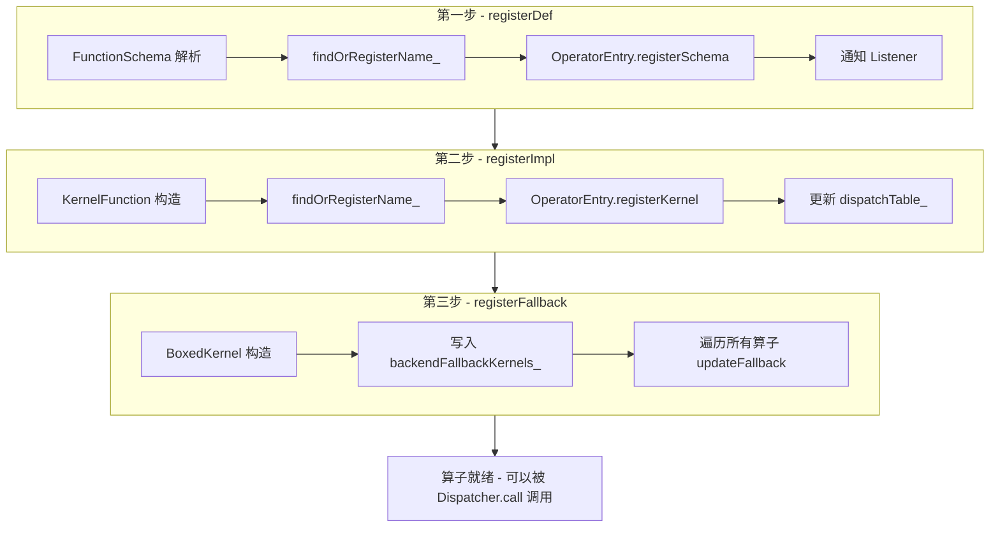
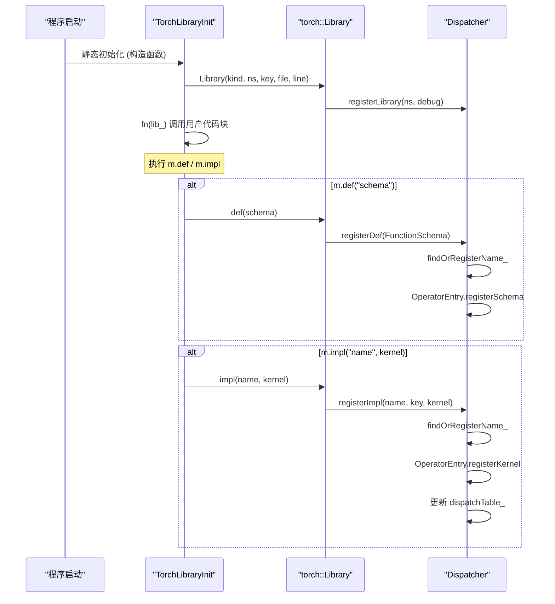
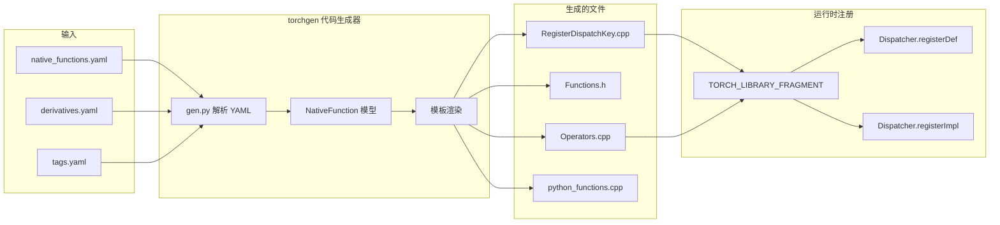

> 算子注册是连接算子定义与内核实现的桥梁。本篇深入分析 PyTorch Dispatcher 的注册子系统，涵盖 C++ 宏、Python API、代码生成三条注册路径，以及 `FunctionSchema`、`RegistrationHandleRAII` 等关键数据结构的内部机制。

---

## 1. 概述

PyTorch 中每一个算子（operator）在被调用之前，都必须经历两个阶段：**定义**（定义算子的签名和语义）和**绑定**（将具体的内核实现绑定到特定的 DispatchKey）。算子注册机制就是管理这两个阶段的核心子系统。

从架构上看，算子注册解决三个关键问题：

1. **算子发现** - Dispatcher 如何知道某个算子存在？
2. **内核绑定** - 某个 DispatchKey 下应该调用哪个内核函数？
3. **生命周期管理** - 注册信息何时创建、何时销毁？

所有注册最终都汇聚到 `Dispatcher` 单例上的三个核心方法：`registerDef`、`registerImpl`、`registerFallback`。

```
源码路径: aten/src/ATen/core/dispatch/Dispatcher.cpp
         aten/src/ATen/core/dispatch/Dispatcher.h
         torch/library.h
         torch/library.py
```

---

## 2. 前置知识

阅读本篇前，建议先熟悉以下内容：

| 前置篇目 | 核心概念 |
|---------|---------|
| [00-dispatch-tutorial.md](./00-dispatch-tutorial.md) | Dispatch 机制基本概念、整体架构 |
| [01-dispatch-key-system.md](./01-dispatch-key-system.md) | DispatchKey 枚举、DispatchKeySet 位运算、优先级排序 |
| [02-dispatcher-core.md](./02-dispatcher-core.md) | Dispatcher 单例、OperatorHandle、调度表查找、call/redispatch 流程 |

核心前置概念速查：

- **DispatchKey**: 标识不同后端（CPU/CUDA）或功能层（Autograd/FuncTorch）的枚举值
- **Dispatcher**: 全局单例，维护所有算子的注册信息和调度表
- **OperatorHandle**: 对已注册算子的轻量句柄，持有指向 `OperatorEntry` 的指针
- **KernelFunction**: 类型擦除后的内核函数包装，支持 boxed 和 unboxed 调用

---

## 3. 三层注册模型

Dispatcher 的注册接口分为三个层级，每个层级解决不同的问题：

### 3.1 registerDef - 注册算子定义

`registerDef` 向 Dispatcher 注册一个算子的 `FunctionSchema`（算子签名）。这一步告诉系统"存在这样一个算子"，但不提供任何实现。

```cpp
// 源码: aten/src/ATen/core/dispatch/Dispatcher.cpp:241-268
RegistrationHandleRAII Dispatcher::registerDef(
    FunctionSchema schema,
    std::string debug,
    std::vector<at::Tag> tags) {
  std::lock_guard<std::mutex> lock(guard_->mutex);

  OperatorName op_name = schema.operator_name();
  auto op = findOrRegisterName_(op_name);

  TORCH_CHECK(op.operatorDef_->def_count == 0,
    "Tried to register an operator (", schema,
    ") with the same name and overload name multiple times.");
  op.operatorDef_->op.registerSchema(
      std::move(schema), std::move(debug), std::move(tags));
  listeners_->callOnOperatorRegistered(op);

  ++op.operatorDef_->def_count;
  ++op.operatorDef_->def_and_impl_count;

  cond_var_.notify_all();
  return RegistrationHandleRAII([...] { deregisterDef_(...); });
}
```

要点：
- 通过 `findOrRegisterName_` 查找或创建 `OperatorEntry`
- 同名同 overload 的算子只允许注册一次（`def_count == 0` 校验）
- 注册后通知所有 `OpRegistrationListener`
- 返回 RAII 句柄，析构时自动反注册

### 3.2 registerImpl - 注册内核实现

`registerImpl` 将一个具体的 `KernelFunction` 绑定到特定算子的特定 `DispatchKey` 上。

```cpp
// 源码: aten/src/ATen/core/dispatch/Dispatcher.cpp:358-390
RegistrationHandleRAII Dispatcher::registerImpl(
  OperatorName op_name,
  std::optional<DispatchKey> dispatch_key,
  KernelFunction kernel,
  std::optional<impl::CppSignature> cpp_signature,
  std::unique_ptr<FunctionSchema> inferred_function_schema,
  std::string debug) {
  std::lock_guard<std::mutex> lock(guard_->mutex);

  auto op = findOrRegisterName_(op_name);
  auto handle = op.operatorDef_->op.registerKernel(
    *this, dispatch_key, std::move(kernel),
    std::move(cpp_signature),
    std::move(inferred_function_schema), std::move(debug));

  ++op.operatorDef_->def_and_impl_count;
  cond_var_.notify_all();
  return RegistrationHandleRAII([...] { deregisterImpl_(...); });
}
```

要点：
- `dispatch_key` 为 `std::nullopt` 时注册为 catch-all 内核
- impl 可以在 def 之前注册（"dangling impl"），静态初始化阶段顺序不确定
- `registerKernel` 内部会更新 `OperatorEntry` 的 `dispatchTable_`

### 3.3 registerFallback - 注册后备内核

`registerFallback` 为整个 DispatchKey 注册一个后备内核，当某算子没有为该 key 注册专门的内核时使用。

```cpp
// 源码: aten/src/ATen/core/dispatch/Dispatcher.cpp:440-471
RegistrationHandleRAII Dispatcher::registerFallback(
    DispatchKey dispatchKey,
    KernelFunction kernel,
    std::string debug) {
  std::lock_guard<std::mutex> lock(guard_->mutex);

  auto idx = getDispatchTableIndexForDispatchKey(dispatchKey);
  backendFallbackKernels_[idx] = impl::AnnotatedKernel(
      std::move(kernel), nullptr, std::move(debug));

  // 更新所有已注册算子的调度表
  for (auto& op : operators_) {
    op.op.updateFallback(*this, dispatchKey);
  }
  return RegistrationHandleRAII([...] { deregisterFallback_(...); });
}
```

要点：
- Fallback 存储在 Dispatcher 的 `backendFallbackKernels_` 数组中，而非单个 OperatorEntry
- 注册后需要遍历所有算子更新其调度表
- 每个 DispatchKey 只允许一个 fallback（`AutogradPrivateUse1` 除外）

### 3.4 三层注册流程图



---

## 4. C++ 端注册 - TORCH_LIBRARY 宏

C++ 端的算子注册主要通过两个宏完成：`TORCH_LIBRARY` 和 `TORCH_LIBRARY_IMPL`。

### 4.1 TORCH_LIBRARY - 定义算子

`TORCH_LIBRARY` 用于创建一个命名空间并在其中定义算子 schema。

```cpp
// 源码: torch/library.h:982-991
#define TORCH_LIBRARY(ns, m)                                                   \
  static void TORCH_LIBRARY_init_##ns(torch::Library&);                        \
  static const torch::detail::TorchLibraryInit TORCH_LIBRARY_static_init_##ns( \
      torch::Library::DEF,                                                     \
      &TORCH_LIBRARY_init_##ns,                                                \
      C10_STRINGIZE(ns),                                                       \
      std::nullopt,                                                            \
      __FILE__,                                                                \
      __LINE__);                                                               \
  void TORCH_LIBRARY_init_##ns(torch::Library& m)
```

宏展开后的效果：

```cpp
// 用户代码
TORCH_LIBRARY(myops, m) {
    m.def("add(Tensor self, Tensor other) -> Tensor");
    m.def("mul(Tensor self, Tensor other) -> Tensor");
}

// 展开后等价于:
static void TORCH_LIBRARY_init_myops(torch::Library&);
static const torch::detail::TorchLibraryInit TORCH_LIBRARY_static_init_myops(
    torch::Library::DEF,
    &TORCH_LIBRARY_init_myops,
    "myops",
    std::nullopt,       // 无特定 DispatchKey
    __FILE__, __LINE__);
void TORCH_LIBRARY_init_myops(torch::Library& m) {
    m.def("add(Tensor self, Tensor other) -> Tensor");
    m.def("mul(Tensor self, Tensor other) -> Tensor");
}
```

关键约束：每个命名空间只能有一个 `TORCH_LIBRARY` 块。如果需要分散注册，使用 `TORCH_LIBRARY_FRAGMENT`。

### 4.2 TORCH_LIBRARY_IMPL - 注册内核实现

`TORCH_LIBRARY_IMPL` 用于为已定义的算子提供特定 DispatchKey 下的实现。

```cpp
// 源码: torch/library.h:1064-1084
#define TORCH_LIBRARY_IMPL(ns, k, m) _TORCH_LIBRARY_IMPL(ns, k, m, C10_UID)

#define _TORCH_LIBRARY_IMPL(ns, k, m, uid)                                \
  static void C10_CONCATENATE(                                            \
      TORCH_LIBRARY_IMPL_init_##ns##_##k##_, uid)(torch::Library&);       \
  static const torch::detail::TorchLibraryInit C10_CONCATENATE(           \
      TORCH_LIBRARY_IMPL_static_init_##ns##_##k##_, uid)(                 \
      torch::Library::IMPL,                                               \
      &C10_CONCATENATE(TORCH_LIBRARY_IMPL_init_##ns##_##k##_, uid),       \
      C10_STRINGIZE(ns),                                                  \
      std::make_optional(c10::DispatchKey::k),                            \
      __FILE__, __LINE__);                                                 \
  void C10_CONCATENATE(                                                   \
      TORCH_LIBRARY_IMPL_init_##ns##_##k##_, uid)(torch::Library & m)
```

使用示例：

```cpp
// 为 myops::add 提供 CPU 实现
TORCH_LIBRARY_IMPL(myops, CPU, m) {
    m.impl("add", cpu_add_kernel);
}

// 为 myops::add 提供 CUDA 实现
TORCH_LIBRARY_IMPL(myops, CUDA, m) {
    m.impl("add", cuda_add_kernel);
}

// 注册 Autograd fallback
TORCH_LIBRARY_IMPL(_, AutogradCPU, m) {
    m.fallback(torch::CppFunction::makeFallthrough());
}
```

### 4.3 TorchLibraryInit 初始化序列



### 4.4 CppFunction - 类型擦除包装

`CppFunction` 是用户提供的内核函数的统一包装器。它接受函数指针、lambda、编译期函数指针等多种形式，并将它们统一转换为 `KernelFunction`。

```cpp
// 源码: torch/library.h:107-324
class TORCH_API CppFunction final {
  // 接受普通函数指针
  template <typename Func>
  explicit CppFunction(Func* f, ...);

  // 接受编译期函数指针 (TORCH_FN)
  template <typename FuncPtr>
  explicit CppFunction(FuncPtr f, ...);

  // 接受 lambda
  template <typename Lambda>
  explicit CppFunction(Lambda&& f, ...);

private:
  std::optional<c10::DispatchKey> dispatch_key_;
  c10::KernelFunction func_;
  std::optional<c10::impl::CppSignature> cpp_signature_;
  std::unique_ptr<c10::FunctionSchema> schema_;
};
```

---

## 5. Python 端注册 - torch.library

Python 端提供了两套注册 API：低级 `Library` 类和高级 `@custom_op` 装饰器。

### 5.1 Library 类

```python
# 源码: torch/library.py:68-128
class Library:
    """
    创建 library 实例来注册新算子或覆盖已有算子的实现。
    kind: "DEF" | "IMPL" | "FRAGMENT"
    """
    def __init__(self, ns, kind, dispatch_key=""):
        self.m = torch._C._dispatch_library(
            kind, ns, dispatch_key, filename, lineno)
```

基本用法：

```python
# 定义新算子
lib = torch.library.Library("myops", "DEF")
lib.define("add(Tensor self, Tensor other) -> Tensor")

# 注册 CPU 实现
cpu_lib = torch.library.Library("myops", "IMPL", "CPU")
cpu_lib.impl("add", lambda self, other: self + other)
```

`Library.define` 最终调用底层 C++ 的 `torch._C._dispatch_library` 和 `self.m.define`：

```python
# 源码: torch/library.py:129-178
def define(self, schema, alias_analysis="", *, tags=()):
    result = self.m.define(schema, alias_analysis, tuple(tags))
    qualname = self.ns + "::" + name
    self._op_defs.add(qualname)
    _defs.add(qualname)
    return result
```

### 5.2 @torch.library.custom_op 装饰器

这是推荐的现代 API，自动处理 schema 推断、注册和 fake/meta 实现。

```python
# 源码: torch/_library/custom_ops.py:51-60
@torch.library.custom_op("mylib::linear", mutates_args=())
def linear(x: torch.Tensor, weight: torch.Tensor,
           bias: torch.Tensor) -> torch.Tensor:
    return torch.nn.functional.linear(x, weight, bias)

# 注册 fake 实现 (用于 torch.compile/export)
@linear.register_fake
def linear_fake(x, weight, bias):
    return torch.empty(
        x.shape[:-1] + weight.shape[:1],
        dtype=x.dtype, device=x.device)
```

`custom_op` 的参数说明：

| 参数 | 类型 | 说明 |
|-----|------|------|
| `name` | `str` | `"namespace::op_name"` 格式的算子名 |
| `mutates_args` | `Iterable[str]` | 被函数修改的参数名列表 |
| `device_types` | `str/Sequence` | 该实现适用的设备类型 |
| `schema` | `str/None` | 手动指定 schema，None 时自动推断 |

### 5.3 完整的 Python 注册示例

```python
import torch
from torch.library import Library, custom_op

# ---- 方式一：Library 低级 API ----
lib = Library("myops", "DEF")
lib.define("my_relu(Tensor x) -> Tensor")

impl_lib = Library("myops", "IMPL", "CPU")
impl_lib.impl("my_relu", lambda x: x.clamp(min=0))

# ---- 方式二：custom_op 高级 API ----
@custom_op("myops::my_gelu", mutates_args=())
def my_gelu(x: torch.Tensor) -> torch.Tensor:
    return torch.nn.functional.gelu(x)

@my_gelu.register_fake
def my_gelu_fake(x: torch.Tensor) -> torch.Tensor:
    return torch.empty_like(x)

# 调用
x = torch.randn(3, 4)
result = torch.ops.myops.my_gelu(x)
```

---

## 6. 代码生成 - native_functions.yaml

PyTorch 内置的约 2000 个 aten 算子并非手写注册代码，而是通过代码生成系统自动完成。

### 6.1 native_functions.yaml 的结构

每个算子在 YAML 中是一个条目，包含签名、变体、调度映射等信息。

```yaml
# 源码: aten/src/ATen/native/native_functions.yaml (行 554 附近)
- func: add.Tensor(Tensor self, Tensor other, *, Scalar alpha=1) -> Tensor
  device_check: NoCheck
  structured_delegate: add.out
  variants: function, method
  dispatch:
    SparseCPU, SparseCUDA, SparseMPS, SparseMeta: add_sparse
    SparseCsrCPU, SparseCsrCUDA, SparseCsrMeta: add_sparse_csr
    MkldnnCPU: mkldnn_add
    ZeroTensor: add_zerotensor
```

YAML 条目关键字段说明：

| 字段 | 说明 |
|-----|------|
| `func` | 算子完整签名，格式为 `name.overload(args) -> returns` |
| `variants` | 生成的变体：`function`（自由函数）、`method`（Tensor 方法） |
| `dispatch` | DispatchKey 到内核函数名的映射 |
| `structured_delegate` | 结构化内核代理，指向 out 变体 |
| `device_check` | 设备检查策略 |

### 6.2 代码生成器 - torchgen

`torchgen/` 目录包含 PyTorch 的代码生成器，核心入口是 `torchgen/gen.py`。

```
源码路径: torchgen/gen.py
         torchgen/gen_backend_stubs.py
         torchgen/gen_functionalization_type.py
         torchgen/gen_vmap_plumbing.py
```

生成器读取 `native_functions.yaml` 后产生的关键文件：

| 生成文件 | 用途 |
|---------|------|
| `RegisterDispatchKey.cpp` | 每个后端的内核注册代码 |
| `Functions.h` | C++ 自由函数 API (`at::add`) |
| `Operators.h` / `Operators.cpp` | Dispatcher 算子句柄和注册 |
| `NativeFunctions.h` | native 函数声明 |
| `python_functions.cpp` | Python 绑定 |

### 6.3 代码生成流程



以 `aten::add.Tensor` 为例，生成的注册代码大致如下：

```cpp
// 生成文件: build/aten/src/ATen/RegisterCPU.cpp (简化)
TORCH_LIBRARY_IMPL(aten, CPU, m) {
    m.impl("add.Tensor",
        TORCH_FN(at::native::structured_add_out::call));
}
```

---

## 7. FunctionSchema - 算子签名

`FunctionSchema` 是算子签名的完整描述，是注册系统的核心数据结构。

### 7.1 Schema 格式

一个完整的 schema 字符串格式为：

```
aten::add.Tensor(Tensor self, Tensor other, *, Scalar alpha=1) -> Tensor
^^^^^  ^^^  ^^^^^^                             ^                   ^^^^^^
命名空间 名称 overload      位置参数              关键字参数分隔符      返回值
```

### 7.2 OperatorName 结构

```cpp
// 源码: aten/src/ATen/core/operator_name.h:16-35
struct OperatorName final {
  std::string name;           // "aten::add"
  std::string overload_name;  // "Tensor"

  // 提取命名空间
  std::optional<std::string_view> getNamespace() const {
    auto pos = name.find("::");
    if (pos == std::string::npos) return std::nullopt;
    return std::string_view(name.data(), pos);
  }
};
```

### 7.3 FunctionSchema 结构

```cpp
// 源码: aten/src/ATen/core/function_schema.h:229-259
struct TORCH_API FunctionSchema {
  FunctionSchema(
      std::string name,
      std::string overload_name,
      std::vector<Argument> arguments,
      std::vector<Argument> returns,
      bool is_vararg = false,
      bool is_varret = false);

private:
  OperatorName name_;
  std::vector<Argument> arguments_;
  std::vector<Argument> returns_;
  bool is_vararg_;
  bool is_varret_;
};
```

### 7.4 支持的参数类型

| Schema 类型 | C++ 类型 | 说明 |
|------------|---------|------|
| `Tensor` | `at::Tensor` | 张量 |
| `Tensor?` | `std::optional<at::Tensor>` | 可选张量 |
| `Tensor[]` | `at::TensorList` | 张量列表 |
| `Scalar` | `at::Scalar` | 标量值 |
| `int` | `int64_t` | 整数 |
| `int[]` | `at::IntArrayRef` | 整数数组 |
| `float` | `double` | 浮点数 |
| `bool` | `bool` | 布尔值 |
| `str` | `c10::string_view` | 字符串 |
| `ScalarType` | `at::ScalarType` | 数据类型枚举 |
| `Device` | `at::Device` | 设备描述 |
| `SymInt` | `c10::SymInt` | 符号整数 (torch.compile) |

### 7.5 Schema 推断

当用户传入函数指针或 lambda 而非字符串 schema 时，PyTorch 通过模板元编程自动推断 schema：

```cpp
// CppFunction 构造时自动推断
template <typename Func>
explicit CppFunction(Func* f, ...)
    : func_(KernelFunction::makeFromUnboxedRuntimeFunction(f)),
      cpp_signature_(CppSignature::make<Func>()),
      schema_(detail::inferFunctionSchemaFromFunctor<
              std::decay_t<Func>>())
      {}
```

Python 端则通过 `torch._library.infer_schema` 从函数的 type hints 推断。

---

## 8. 注册生命周期

### 8.1 RegistrationHandleRAII

所有注册方法返回的 `RegistrationHandleRAII` 对象是注册生命周期管理的核心。

```cpp
// 源码: aten/src/ATen/core/dispatch/RegistrationHandleRAII.h
class RegistrationHandleRAII final {
public:
  explicit RegistrationHandleRAII(std::function<void()> onDestruction)
      : onDestruction_(std::move(onDestruction)) {}

  ~RegistrationHandleRAII() {
    if (onDestruction_) {
      onDestruction_();
    }
  }

  // 禁止拷贝，允许移动
  RegistrationHandleRAII(const RegistrationHandleRAII&) = delete;
  RegistrationHandleRAII(RegistrationHandleRAII&& rhs) noexcept;

private:
  std::function<void()> onDestruction_;
};
```

当 RAII 句柄析构时，自动调用对应的反注册函数（`deregisterDef_`/`deregisterImpl_`/`deregisterFallback_`）。

### 8.2 引用计数与清理

`OperatorDef` 维护两个计数器来追踪注册状态：

```cpp
// 源码: aten/src/ATen/core/dispatch/Dispatcher.h:76-93
struct OperatorDef final {
  impl::OperatorEntry op;
  size_t def_count = 0;           // def() 注册次数
  size_t def_and_impl_count = 0;  // def() + impl() 总注册次数
};
```

生命周期规则：
- `def_count` 降为 0 时：触发 `callOnOperatorDeregistered`，清除 schema
- `def_and_impl_count` 降为 0 时：从 `operators_` 和 `operatorLookupTable_` 中彻底移除

```cpp
// 源码: aten/src/ATen/core/dispatch/Dispatcher.cpp:429-438
void Dispatcher::cleanup(const OperatorHandle& op,
                         const OperatorName& op_name) {
  if (0 == op.operatorDef_->def_and_impl_count) {
    operators_.erase(op.operatorIterator_);
    operatorLookupTable_.write([&](auto& table) {
      table.erase(op_name);
    });
  }
}
```

### 8.3 注册顺序与 Dangling Impl

由于 C++ 静态初始化顺序不确定，`impl` 可能在 `def` 之前注册。这种情况下：

1. `findOrRegisterName_` 创建一个无 schema 的 `OperatorEntry`
2. 内核被记录在 `OperatorEntry` 中，但 `hasSchema()` 返回 false
3. 当 `def` 注册到来时，schema 被关联到已有的 entry

可以通过 `Dispatcher::findDanglingImpls()` 检测这种状态：

```cpp
// 源码: aten/src/ATen/core/dispatch/Dispatcher.cpp:508-518
std::vector<OperatorHandle> Dispatcher::findDanglingImpls() const {
  // 返回所有有 impl 但无 schema 的算子
}
```

### 8.4 线程安全

Dispatcher 使用一把全局互斥锁 `guard_->mutex` 保护所有写操作。读操作（`call`/`redispatch`）通过 `LeftRight` 无锁数据结构实现免锁读取。

```cpp
// 源码: aten/src/ATen/core/dispatch/Dispatcher.h:400-436
std::list<OperatorDef> operators_;
LeftRight<ska::flat_hash_map<OperatorName, OperatorHandle>>
    operatorLookupTable_;
std::shared_ptr<Guard> guard_;
std::condition_variable cond_var_;  // 用于 torchdeploy 多解释器同步
```

---

## 9. 实战示例

### 9.1 C++ 自定义算子完整示例

```cpp
// my_custom_ops.cpp

#include <torch/library.h>
#include <ATen/ATen.h>

// 内核实现
at::Tensor my_add_cpu(const at::Tensor& self,
                      const at::Tensor& other) {
    return self + other;
}

at::Tensor my_add_cuda(const at::Tensor& self,
                       const at::Tensor& other) {
    return self + other;  // 实际应使用 CUDA kernel
}

// 注册算子定义
TORCH_LIBRARY(myops, m) {
    m.def("my_add(Tensor self, Tensor other) -> Tensor");
}

// 注册 CPU 实现
TORCH_LIBRARY_IMPL(myops, CPU, m) {
    m.impl("my_add", my_add_cpu);
}

// 注册 CUDA 实现
TORCH_LIBRARY_IMPL(myops, CUDA, m) {
    m.impl("my_add", my_add_cuda);
}
```

从 Python 调用：

```python
import torch

# 加载包含上述代码的共享库后:
x = torch.randn(3, 4)
y = torch.randn(3, 4)
result = torch.ops.myops.my_add(x, y)
```

### 9.2 torch.library.custom_op 完整示例

```python
import torch
from torch.library import custom_op

# 定义自定义算子
@custom_op("myops::weighted_sum", mutates_args=())
def weighted_sum(x: torch.Tensor, y: torch.Tensor,
                 alpha: float) -> torch.Tensor:
    return alpha * x + (1 - alpha) * y

# 注册 fake 实现 (torch.compile/export 需要)
@weighted_sum.register_fake
def weighted_sum_fake(x: torch.Tensor, y: torch.Tensor,
                      alpha: float) -> torch.Tensor:
    return torch.empty_like(x)

# 使用
x = torch.randn(3, 4)
y = torch.randn(3, 4)
result = torch.ops.myops.weighted_sum(x, y, 0.7)

# 与 torch.compile 兼容
@torch.compile
def f(x, y):
    return torch.ops.myops.weighted_sum(x, y, 0.5)

print(f(x, y))
```

### 9.3 检查注册状态

```python
import torch

# 查看算子是否存在
op = torch.ops.aten.add.Tensor
print(op)  # <OpOverload(op='aten.add', overload='Tensor')>

# 查看某个 DispatchKey 的所有算子
print(torch._C._dispatch_get_registrations_for_dispatch_key("CPU")[:5])

# 检查特定算子的调度表
print(torch._C._dispatch_dump("aten::add.Tensor"))

# 查看算子 schema
print(torch.ops.aten.add.Tensor._schema)
# add.Tensor(Tensor self, Tensor other, *, Scalar alpha=1) -> Tensor
```

---

## 10. 小结

| 维度 | 要点 |
|-----|------|
| **三层模型** | `registerDef` 注册签名、`registerImpl` 绑定内核、`registerFallback` 设置后备 |
| **C++ 注册** | `TORCH_LIBRARY` 定义算子、`TORCH_LIBRARY_IMPL` 提供实现、通过静态初始化自动执行 |
| **Python 注册** | `Library` 类对应底层 C++ API、`@custom_op` 是推荐的高级 API |
| **代码生成** | `native_functions.yaml` + `torchgen/` 自动生成 aten 算子的注册代码 |
| **FunctionSchema** | 描述算子签名的完整数据结构，支持字符串解析和 C++ 类型推断 |
| **生命周期** | `RegistrationHandleRAII` 管理注册/反注册、引用计数控制清理时机 |
| **线程安全** | 全局互斥锁保护写操作、`LeftRight` 无锁结构支持并发读 |
| **注册顺序** | def 和 impl 可以以任意顺序到达，通过 dangling impl 机制处理 |

---

## 延伸阅读

- [04 - 调度表计算与内核查找](./04-dispatch-table-computation.md) - 注册完成后 `dispatchTable_` 如何被计算和查询
- [05 - Autograd 与功能键调度](./05-autograd-dispatch.md) - Autograd 如何通过 Dispatcher 实现前向/反向分离
- [module-01 - Tensor 基础](../module-01-tensor/README.md) - Tensor 如何携带 DispatchKeySet
- [module-06 - torch.compile](../module-06-compile/README.md) - fake tensor 和 meta 实现在编译中的作用
- [PyTorch 官方文档 - Custom Operators](https://pytorch.org/docs/stable/library.html) - `torch.library` 的官方教程
- [PyTorch 官方文档 - Extending Dispatcher](https://pytorch.org/tutorials/advanced/extend_dispatcher.html) - 为自定义后端扩展调度器
