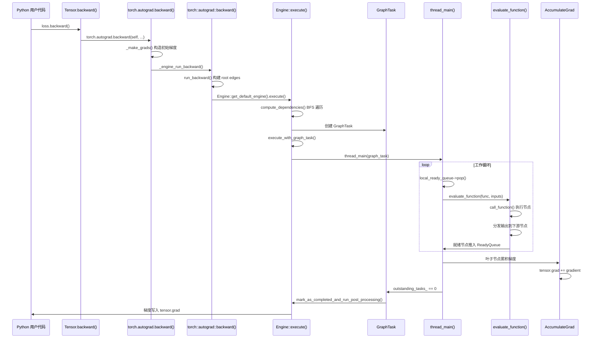
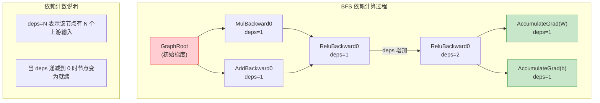
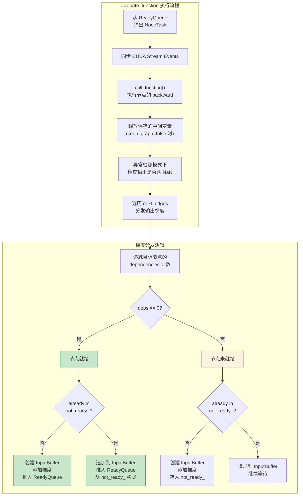

## 概述

当你调用 `loss.backward()` 时，PyTorch 内部发生了什么？本文将逐层剖析从 Python 入口到 C++ Engine 的完整调用链路，深入到引擎的依赖计算、任务调度、节点执行和梯度累积的每一个步骤。本文面向希望深入理解或调试 autograd 引擎的高级用户。

---

## 1. 全局调用链概览



---

## 2. Python 入口层

### 2.1 Tensor.backward()

调用的起点是 `torch.Tensor.backward()`，它是对 `torch.autograd.backward()` 的简单封装。当用户调用 `loss.backward()` 时，实际触发的代码位于 `torch/_tensor.py`：

```python
def backward(self, gradient=None, retain_graph=None, create_graph=False, inputs=None):
    torch.autograd.backward(self, gradient, retain_graph, create_graph, inputs=inputs)
```

### 2.2 torch.autograd.backward()

核心逻辑在 `torch/autograd/__init__.py` 中的 `backward()` 函数：

```python
# torch/autograd/__init__.py
def backward(
    tensors, grad_tensors=None, retain_graph=None,
    create_graph=False, grad_variables=None, inputs=None,
):
    # 1. 参数验证：检查 functorch transforms 是否活跃
    if torch._C._are_functorch_transforms_active():
        raise RuntimeError("backward() called inside a functorch transform.")

    # 2. 构造输入元组
    inputs_tuple = () if inputs is None else tuple(inputs)

    # 3. 将 tensors 统一为元组
    if is_tensor_like(tensors) or isinstance(tensors, graph.GradientEdge):
        tensors = (tensors,)

    # 4. 构造初始梯度（对标量 loss，默认为 ones_like）
    grad_tensors_ = _tensor_or_tensors_to_tuple(grad_tensors, len(tensors))
    grad_tensors_ = _make_grads(tensors, grad_tensors_, is_grads_batched=False)

    # 5. 调用 C++ 引擎
    _engine_run_backward(
        tensors, grad_tensors_, retain_graph, create_graph,
        inputs_tuple, allow_unreachable=True, accumulate_grad=True,
    )
```

**`_make_grads()` 的关键逻辑**：当 `grad_tensors` 为 `None` 时（最常见情况），对于标量输出会自动创建 `torch.ones_like(output)` 作为初始梯度。这就是为什么 `loss.backward()` 不需要手动传入梯度参数。

---

## 3. C++ 入口层

### 3.1 run_backward()

`_engine_run_backward` 最终调用 C++ 层的 `run_backward()` 函数（`torch/csrc/autograd/autograd.cpp`）：

```cpp
// torch/csrc/autograd/autograd.cpp
static variable_list run_backward(
    const variable_list& outputs,
    const variable_list& grad_outputs,
    bool keep_graph, bool create_graph,
    const variable_list& inputs,
    bool allow_unused, bool accumulate_grad) {

  // 1. 为每个输出张量获取 gradient_edge（指向其 grad_fn 的边）
  edge_list roots;
  for (const auto i : c10::irange(num_tensors)) {
    const Variable& output = outputs[i];
    auto gradient_edge = impl::gradient_edge(output);
    TORCH_CHECK(gradient_edge.function, "element does not require grad");
    roots.push_back(std::move(gradient_edge));
  }

  // 2. 如果指定了 inputs，构建 output_edges
  edge_list output_edges;
  if (!inputs.empty()) {
    for (const auto i : c10::irange(num_inputs)) {
      const Variable& input = inputs[i];
      auto grad_fn = input.grad_fn();
      if (!grad_fn)
        grad_fn = impl::try_get_grad_accumulator(input);
      output_edges.emplace_back(grad_fn, output_nr);
    }
  }

  // 3. 调用引擎执行
  variable_list grad_inputs = Engine::get_default_engine().execute(
      roots, grad_outputs, keep_graph, create_graph,
      accumulate_grad, output_edges);

  return grad_inputs;
}
```

这里的 `roots` 就是计算图反向传播的起始节点。每个 root 是一条 `Edge`，指向输出张量的 `grad_fn`。

---

## 4. Engine::execute() - 引擎执行入口

`Engine::execute()` 是反向传播的核心调度器（`torch/csrc/autograd/engine.cpp`）：

```cpp
// torch/csrc/autograd/engine.cpp
auto Engine::execute(
    const edge_list& root_edges, const variable_list& inputs,
    bool keep_graph, bool create_graph,
    bool accumulate_grad, const edge_list& outputs
) -> variable_list {

  // 1. 初始化本地就绪队列
  init_local_ready_queue();
  bool not_reentrant = worker_device == NO_DEVICE;

  // 2. 创建 GraphRoot 节点（多输出时包装为一个根节点）
  bool skip_dummy_node = root_edges.size() == 1;
  auto graph_root = skip_dummy_node
      ? root_edges.at(0).function
      : std::make_shared<GraphRoot>(root_edges, inputs);

  // 3. 创建 GraphTask
  auto graph_task = std::make_shared<GraphTask>(
      keep_graph, create_graph, reentrant_depth, local_ready_queue, ...);

  // 4. BFS 计算依赖
  auto min_topo_nr = compute_min_topological_nr(outputs);
  compute_dependencies(graph_root.get(), *graph_task, min_topo_nr);

  // 5. 初始化执行信息（如果指定了 outputs）
  if (!outputs.empty())
    graph_task->init_to_execute(*graph_root, outputs, accumulate_grad, min_topo_nr);

  // 6. 启动执行
  execute_with_graph_task(graph_task, graph_root, input_buffer);

  // 7. 等待完成
  auto& fut = graph_task->future_result_;
  fut->wait();
  return fut->value().toTensorVector();
}
```

---

## 5. 依赖计算 - compute_dependencies()

依赖计算是反向传播调度的基础，它使用 BFS 从根节点遍历整个计算图：

```cpp
// torch/csrc/autograd/engine.cpp
auto Engine::compute_dependencies(
    Node* root, GraphTask& task, uint64_t min_topo_nr) -> void {
  std::vector<Node*> queue{root};
  auto& dependencies = task.dependencies_;

  while (!queue.empty()) {
    auto fn = queue.back();
    queue.pop_back();

    // 剪枝：跳过拓扑序号低于最小目标的节点
    if (fn->topological_nr() < min_topo_nr)
      continue;

    for (const auto& edge : fn->next_edges()) {
      if (auto next_ptr = edge.function.get()) {
        dependencies[next_ptr] += 1;  // 增加依赖计数
        const bool was_inserted = task.nodes_in_graph_.insert(next_ptr).second;
        if (was_inserted)
          queue.push_back(next_ptr);  // 首次访问才入队
      }
    }
  }
}
```



`dependencies_` 映射记录了每个节点需要接收多少个上游梯度才能开始执行。当一个节点的依赖计数递减到 0 时，它就被推入就绪队列。

**拓扑序号剪枝**：`min_topo_nr` 是所有目标输出中最小的拓扑序号。如果一个节点的拓扑序号低于此值，说明它不可能到达任何目标输出，可以安全跳过。

---

## 6. GraphTask 数据结构

`GraphTask` 是单次 `backward()` 调用的核心状态容器（`torch/csrc/autograd/graph_task.h`）：

```cpp
// torch/csrc/autograd/graph_task.h
struct GraphTask : std::enable_shared_from_this<GraphTask> {
  std::atomic<uint64_t> outstanding_tasks_{0};  // 未完成的任务数
  std::atomic_bool has_error_{false};           // 是否发生错误

  bool keep_graph_;                              // 是否保留图

  std::unordered_map<Node*, InputBuffer> not_ready_;   // 未就绪节点及其缓冲区
  std::unordered_map<Node*, int> dependencies_;        // 依赖计数表
  std::unordered_set<Node*> nodes_in_graph_;           // 图中所有节点

  std::unordered_map<Node*, ExecInfo> exec_info_;      // 执行信息（用于 grad()）
  std::vector<Variable> captured_vars_;                 // 捕获的梯度变量

  std::shared_ptr<ReadyQueue> cpu_ready_queue_;         // CPU 就绪队列
  c10::intrusive_ptr<at::ivalue::Future> future_result_; // 完成信号

  int owner_{NO_DEVICE};                                // 拥有者线程的设备
  const int reentrant_depth_;                           // 重入深度
};
```

关键字段说明：

- **`outstanding_tasks_`**：原子计数器，每当一个 `NodeTask` 被推入就绪队列时加 1，执行完毕后减 1。当降为 0 时表示所有计算完成
- **`not_ready_`**：存储已收到部分输入但尚未就绪的节点及其 `InputBuffer`
- **`dependencies_`**：由 `compute_dependencies()` 填充的依赖计数表
- **`exec_info_`**：仅在使用 `torch.autograd.grad()` 或指定 `inputs` 参数时非空，用于过滤不需要执行的路径

---

## 7. 工作循环 - thread_main()

`thread_main()` 是引擎的核心工作循环。对于 CPU 反向传播，调用者线程本身就是工作线程：

```cpp
// torch/csrc/autograd/engine.cpp
auto Engine::thread_main(const std::shared_ptr<GraphTask>& graph_task) -> void {
  TORCH_INTERNAL_ASSERT(local_ready_queue != nullptr);

  // 循环直到 graph_task 完成
  while (graph_task == nullptr || !graph_task->future_result_->completed()) {
    std::shared_ptr<GraphTask> local_graph_task;
    {
      // 1. 从就绪队列弹出任务（阻塞等待）
      NodeTask task = local_ready_queue->pop();

      if (task.isShutdownTask_)
        break;

      local_graph_task = task.base_.lock();
      if (!local_graph_task)
        continue;  // GraphTask 已失效

      // 2. 设置线程局部状态
      set_device(worker_device);

      if (task.fn_ && !local_graph_task->has_error_.load()) {
        at::ThreadLocalStateGuard tls_guard(local_graph_task->thread_locals_);

        try {
          GraphTaskGuard guard(local_graph_task);
          // 3. 调用 evaluate_function 执行节点
          evaluate_function(
              local_graph_task, task.fn_.get(),
              task.inputs_, local_graph_task->cpu_ready_queue_);
        } catch (std::exception& e) {
          thread_on_exception(local_graph_task, task.fn_, e);
        }
      }
    }

    // 4. 递减未完成任务计数
    --local_graph_task->outstanding_tasks_;

    // 5. 检查是否完成
    if (local_graph_task->completed()) {
      local_graph_task->mark_as_completed_and_run_post_processing();
      // 通知拥有者线程
      if (worker_device != base_owner) {
        ready_queue_by_index(cpu_ready_queue, base_owner)
            ->push(NodeTask(local_graph_task, nullptr, InputBuffer(0)));
      }
    }
  }
}
```

### 7.1 ReadyQueue 的优先级机制

就绪队列是一个优先级队列，排序规则如下：

```cpp
struct CompareNodeTaskTime {
  bool operator()(NodeTask const& t1, NodeTask const& t2) {
    if (t2.isShutdownTask_) return true;          // 关闭任务最高优先级
    else if (!t1.fn_ || t1.isShutdownTask_) return false;
    else if (!t2.fn_) return true;
    else if (t1.getReentrantDepth() == t2.getReentrantDepth())
      return t1.fn_->sequence_nr() < t2.fn_->sequence_nr();  // 序列号大的优先
    else
      return t1.getReentrantDepth() < t2.getReentrantDepth(); // 重入深度大的优先
  }
};
```

**序列号优先**：序列号（`sequence_nr`）大的节点是在前向传播中后创建的，反向传播应先执行它们，保持拓扑顺序。

---

## 8. evaluate_function() - 节点执行与梯度分发

这是引擎最核心的函数，负责执行单个节点并将输出梯度分发给下游节点：

```cpp
// torch/csrc/autograd/engine.cpp
void Engine::evaluate_function(
    std::shared_ptr<GraphTask>& graph_task,
    Node* func, InputBuffer& inputs,
    const std::shared_ptr<ReadyQueue>& cpu_ready_queue) {

  // 1. 设置 CUDA 流（如果节点关联了特定流）
  auto opt_parent_stream = (*func).stream();
  c10::OptionalStreamGuard parent_stream_guard{opt_parent_stream};

  // 2. 同步输入梯度的 stream events
  for (size_t pos = 0; pos < inputs.ready_events.size(); ++pos) {
    // ... stream 同步逻辑
  }

  // 3. 执行节点的 backward 函数
  auto outputs = call_function(graph_task, func, inputs);

  // 4. 释放保存的变量（如果不需要保留图）
  if (!graph_task->keep_graph_)
    func->release_variables();

  // 5. 异常检测模式下检查 NaN
  if (AnomalyMode::is_enabled() && AnomalyMode::should_check_nan()) {
    for (auto& output : outputs) {
      TORCH_CHECK(!isnan(output)._is_any_true().item<bool>(),
                  "Function returned nan values");
    }
  }

  // 6. 分发输出梯度到下游节点
  std::lock_guard<std::mutex> lock(graph_task->mutex_);
  for (const auto i : c10::irange(num_outputs)) {
    auto& output = outputs[i];
    const auto& next = func->next_edge(i);
    if (!next.is_valid()) continue;

    // 递减下游节点的依赖计数
    bool is_ready = false;
    auto it = dependencies.find(next.function.get());
    if (--it->second == 0) {
      dependencies.erase(it);
      is_ready = true;  // 依赖全部满足
    }

    auto& not_ready = graph_task->not_ready_;
    auto not_ready_it = not_ready.find(next.function.get());

    if (not_ready_it == not_ready.end()) {
      // 首次收到该节点的输入，创建 InputBuffer
      InputBuffer input_buffer(next.function->num_inputs());
      input_buffer.add(next.input_nr, std::move(output), ...);

      if (is_ready) {
        // 已就绪，直接推入 ReadyQueue
        auto queue = ready_queue(cpu_ready_queue, next.function->device());
        queue->push(NodeTask(graph_task, next.function, std::move(input_buffer)));
      } else {
        // 未就绪，暂存到 not_ready_
        not_ready.emplace(next.function.get(), std::move(input_buffer));
      }
    } else {
      // 该节点已有部分输入，追加到现有 InputBuffer
      auto& input_buffer = not_ready_it->second;
      input_buffer.add(next.input_nr, std::move(output), ...);

      if (is_ready) {
        auto queue = ready_queue(cpu_ready_queue, next.function->device());
        queue->push(NodeTask(graph_task, next.function, std::move(input_buffer)));
        not_ready.erase(not_ready_it);  // 从 not_ready 中移除
      }
    }
  }
}
```



### 8.1 call_function() 内部

`call_function()` 负责实际调用节点的 backward 方法，包括 hooks 的执行：

```cpp
static variable_list call_function(
    std::shared_ptr<GraphTask>& graph_task, Node* func, InputBuffer& inputBuffer) {
  CheckpointValidGuard cpvguard(graph_task);
  auto& fn = *func;

  // 1. 执行 tensor pre-hooks 和 pre-hooks
  auto inputs = call_tensor_pre_hooks(fn, InputBuffer::variables(std::move(inputBuffer)));
  inputs = call_pre_hooks(fn, std::move(inputs));

  // 2. 通知节点可以释放变量
  if (!graph_task->keep_graph_)
    fn.will_release_variables();

  // 3. 调用节点的 operator()（即 backward 函数）
  variable_list outputs = fn(std::move(inputs));

  // 4. 验证输出的合法性
  validate_outputs(fn.next_edges(), outputs, ...);

  // 5. 执行 post-hooks
  return call_post_hooks(fn, std::move(outputs), inputs, has_post_hooks);
}
```

Hooks 的执行顺序为：`tensor_pre_hooks` -> `pre_hooks` -> `backward function` -> `post_hooks`。

---

## 9. AccumulateGrad - 叶子节点的梯度累积

当反向传播到达叶子节点（`requires_grad=True` 的用户创建张量）时，会执行 `AccumulateGrad` 节点。这个特殊节点不计算新的梯度，而是将传入的梯度累积到 `tensor.grad` 中：

```
AccumulateGrad::apply():
  1. 获取叶子张量的引用
  2. 如果 tensor.grad 未定义，直接赋值
  3. 如果 tensor.grad 已定义，执行 tensor.grad += incoming_grad
  4. 不产生输出（next_edges 为空）
```

`AccumulateGrad` 是计算图的终点节点，它的 `next_edges()` 返回空列表，因此不会将任何任务推入就绪队列。

---

## 10. 完成与返回

### 10.1 完成检测

当 `GraphTask::outstanding_tasks_` 原子计数器降为 0 时，`completed()` 返回 `true`：

```cpp
bool GraphTask::completed() {
  return outstanding_tasks_.load() == 0 ||
      (exit_on_error_ && has_error_.load());
}
```

### 10.2 后处理

`mark_as_completed_and_run_post_processing()` 执行以下步骤：

1. **CUDA 流同步**：将叶子流（leaf streams）与调用者的当前流同步
2. **执行 final callbacks**：用户通过 `queue_callback()` 注册的回调
3. **标记 Future 完成**：触发等待中的 `fut->wait()` 返回

```cpp
void GraphTask::mark_as_completed_and_run_post_processing() {
  if (future_completed_.exchange(true))
    return;  // 避免重复处理

  try {
    std::unique_lock<std::mutex> lock(mutex_);
    exec_post_processing();
    std::vector<Variable> vars = std::move(captured_vars_);
    lock.unlock();
    future_result_->markCompleted(vars);
  } catch (std::exception&) {
    future_result_->setErrorIfNeeded(std::current_exception());
  }
}
```

### 10.3 返回到 Python

`Engine::execute()` 中的 `fut->wait()` 返回后：

```cpp
// Engine::execute() 尾部
auto& fut = graph_task->future_result_;
fut->wait();
graph_task->warning_handler_.replay_warnings();
return fut->value().toTensorVector();
```

对于 `backward()` 调用，返回值被忽略（梯度已累积到 `.grad`）。对于 `grad()` 调用，返回值就是计算出的梯度。

---

## 11. 多设备与重入调度

### 11.1 多设备调度

Engine 为每个加速器设备维护一个独立的就绪队列（`device_ready_queues_`），CPU 操作由调用者线程直接处理：

```cpp
std::shared_ptr<ReadyQueue> Engine::ready_queue(
    std::shared_ptr<ReadyQueue> cpu_ready_queue, at::Device device) {
  if (should_run_in_cpu_ready_queue(device.type()))
    return cpu_ready_queue;
  return device_ready_queues_[device.index()];
}
```

当一个节点的 backward 产出需要在 GPU 上执行的下游节点时，任务会被推入对应 GPU 的就绪队列，由该设备的工作线程处理。

### 11.2 重入反向传播

当在 backward 计算过程中再次调用 `backward()`（如 gradient checkpointing 场景）时，会触发重入（reentrant）机制。Engine 维护了一个线程池来处理重入情况，避免死锁：

```cpp
// 最大重入深度为 60（避免 TSAN 死锁检测器报警）
static constexpr int MAX_DEPTH = 60;

void Engine::reentrant_thread_init() {
  while (true) {
    // 等待新的 GraphTask
    auto task = tp_shared->graphtasks_queue_.front();
    // 使用父 graph_task 的 ready_queue
    local_ready_queue = ready_queue_by_index(
        graph_task->cpu_ready_queue_, graph_task->owner_);
    thread_main(graph_task);
  }
}
```

---

## 12. 调试技巧

### 12.1 打印计算图结构

```python
# 查看 loss 的计算图
def print_graph(fn, indent=0):
    print(" " * indent + str(fn))
    for next_fn, _ in fn.next_functions:
        if next_fn is not None:
            print_graph(next_fn, indent + 2)

print_graph(loss.grad_fn)
```

### 12.2 使用异常检测模式

```python
with torch.autograd.detect_anomaly():
    output = model(input)
    loss = criterion(output, target)
    loss.backward()
    # 如果 backward 中出现 NaN，会打印前向传播的调用栈
```

### 12.3 注册 Node hooks 观测梯度流

```python
def hook_fn(grad_inputs, grad_outputs):
    print(f"grad_inputs: {[g.shape if g is not None else None for g in grad_inputs]}")
    print(f"grad_outputs: {[g.shape if g is not None else None for g in grad_outputs]}")

# 在特定节点注册 hook
loss.grad_fn.register_hook(hook_fn)
```

### 12.4 GDB 断点位置建议

| 断点位置 | 用途 |
|---------|------|
| `Engine::execute` | 观察引擎入口参数 |
| `Engine::compute_dependencies` | 检查依赖图构建 |
| `Engine::evaluate_function` | 跟踪每个节点的执行 |
| `call_function` | 观察节点的输入输出 |
| `GraphTask::mark_as_completed_and_run_post_processing` | 检查完成状态 |

---

## 总结

`loss.backward()` 的完整执行路径如下：

1. **Python 层**：参数验证、构造初始梯度、调用 C++ 引擎
2. **C++ 入口**：构建 root edges、创建 GraphTask
3. **依赖计算**：BFS 遍历图，计算每个节点的依赖计数
4. **工作循环**：从就绪队列弹出任务，执行节点，分发梯度
5. **梯度累积**：叶子节点的 `AccumulateGrad` 将梯度写入 `tensor.grad`
6. **完成处理**：流同步、回调执行、通知调用者

理解这条完整的代码路径，是调试复杂 autograd 问题（如梯度消失、内存泄漏、多设备同步异常）的基础。

**关键源码文件**：

| 文件路径 | 说明 |
|---------|------|
| `torch/autograd/__init__.py` | Python 层 backward/grad 入口 |
| `torch/csrc/autograd/autograd.cpp` | C++ 层 backward/grad 实现 |
| `torch/csrc/autograd/engine.h` | Engine、NodeTask、ReadyQueue 定义 |
| `torch/csrc/autograd/engine.cpp` | Engine 核心实现（execute、thread_main、evaluate_function） |
| `torch/csrc/autograd/graph_task.h` | GraphTask 数据结构定义 |
| `torch/csrc/autograd/functions/basic_ops.h` | GraphRoot、AccumulateGrad 节点 |
