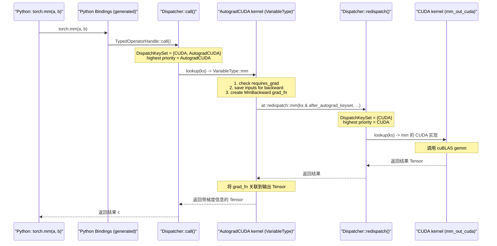
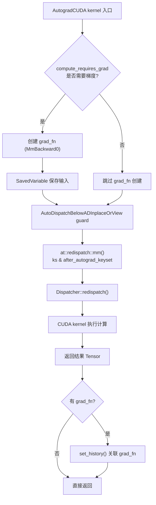
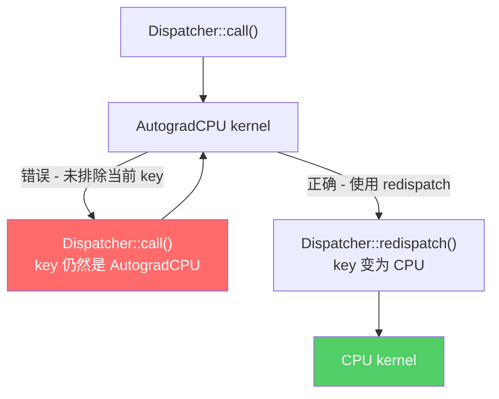

> 掌握理论只是第一步，真正理解 PyTorch 分发机制需要在实际代码中追踪执行路径。
> 本文提供一整套调试工具链——从环境变量、Python 内省 API 到 GDB/LLDB 断点，
> 帮助你端到端地追踪一个算子从 Python 调用到硬件内核的完整分发路径。

---

## 1. 概述

算子分发系统的复杂性在于其**多层嵌套的 redispatch 链**——一次 `torch.mm()` 调用可能依次经过 Autograd、AutoCast、ADInplaceOrView 等多个 dispatch key 的处理，最终才到达 CPU/CUDA 计算内核。仅靠阅读源码很难完整理解运行时的实际路径。

本文聚焦于**调试方法论**，提供以下工具的详细使用指南：

| 工具类别 | 代表工具 | 适用场景 |
|---------|---------|---------|
| 环境变量 | `TORCH_SHOW_DISPATCH_TRACE` | 快速查看分发链路 |
| Python API | `torch._C._dispatch_dump()` | 检查单个算子的分发表 |
| 原生调试器 | GDB/LLDB 断点 | 深入 C++ 层面逐步追踪 |
| 自定义算子 | `torch.library` + trace | 验证注册是否正确 |

---

## 2. 前置知识

阅读本文前，请确保已掌握以下内容：

- **00 算子分发入门教程**：理解分发的基本概念——什么是 DispatchKey、什么是内核注册
- **01 DispatchKey 体系**：掌握 DispatchKey 的分层结构（功能键 + 后端位）、优先级排序、TLS 机制
- **02 Dispatcher 核心机制**：理解 `Dispatcher::call()` 的查表调用流程、`OperatorEntry::lookup()` 的索引计算
- **03 算子注册与代码生成**：了解 `TORCH_LIBRARY` / `native_functions.yaml` 的注册机制

如果对以上内容还不熟悉，建议先阅读对应篇章。

---

## 3. 环境变量调试工具

### 3.1 TORCH_SHOW_DISPATCH_TRACE

这是最直接的分发路径追踪工具。设置此环境变量后，每次 `Dispatcher::call()` 和 `Dispatcher::redispatch()` 都会向 `stderr` 输出当前分发的算子名称和 dispatch key。

**实现位置**：`aten/src/ATen/core/dispatch/Dispatcher.cpp` 第 18-35 行

```cpp
// aten/src/ATen/core/dispatch/Dispatcher.cpp:18
bool show_dispatch_trace() {
  static auto envar = c10::utils::get_env("TORCH_SHOW_DISPATCH_TRACE");
  if (envar.has_value()) {
    if (envar == "0") return false;
    if (envar == "1") return true;
    TORCH_WARN("ignoring invalid value for TORCH_SHOW_DISPATCH_TRACE: ...");
  }
  return false;
}
```

**输出函数**：`aten/src/ATen/core/dispatch/Dispatcher.cpp` 第 70-74 行

```cpp
// aten/src/ATen/core/dispatch/Dispatcher.cpp:70
void _print_dispatch_trace(const std::string& label,
                           const std::string& op_name,
                           const DispatchKeySet& dispatchKeySet) {
  auto nesting_value = dispatch_trace_nesting_value();
  for (int64_t i = 0; i < nesting_value; ++i) std::cerr << ' ';
  std::cerr << label << " op=[" << op_name
            << "], key=[" << toString(dispatchKeySet.highestPriorityTypeId())
            << ']' << std::endl;
}
```

**调用点**：在 `Dispatcher::call()` 和 `Dispatcher::redispatch()` 模板中被调用（`aten/src/ATen/core/dispatch/Dispatcher.h` 第 782-787 行、第 840-845 行）。

### 3.2 使用方式与输出解读

```bash
TORCH_SHOW_DISPATCH_TRACE=1 python -c "
import torch
a = torch.randn(2, 3, requires_grad=True)
b = torch.randn(3, 4)
c = torch.mm(a, b)
"
```

典型输出（简化后）：

```
[call] op=[aten::mm], key=[AutogradCPU]
 [redispatch] op=[aten::mm], key=[CPU]
```

**输出格式解读**：

| 字段 | 含义 |
|------|------|
| `[call]` | 表示 `Dispatcher::call()` 的入口调用 |
| `[redispatch]` | 表示从某个内核发起的 `Dispatcher::redispatch()` |
| `op=[aten::mm]` | 当前正在分发的算子名称 |
| `key=[AutogradCPU]` | 当前 DispatchKeySet 中最高优先级的 key |
| 缩进空格 | 表示嵌套层级，每层 redispatch 增加一级缩进 |

嵌套缩进由 `DispatchTraceNestingGuard`（`Dispatcher.h` 第 32-38 行）通过 thread_local 计数器实现：

```cpp
// aten/src/ATen/core/dispatch/Dispatcher.h:32
struct DispatchTraceNestingGuard {
  DispatchTraceNestingGuard() { dispatch_trace_nesting_incr(); }
  ~DispatchTraceNestingGuard() { dispatch_trace_nesting_decr(); }
};
```

### 3.3 条件编译说明

dispatch trace 功能受条件编译宏 `HAS_TORCH_SHOW_DISPATCH_TRACE` 控制。在 release 构建中若未定义此宏且定义了 `NDEBUG`，trace 代码会被完全编译排除，不产生任何运行时开销。在 debug 构建或 PyTorch 官方 pip 包中此功能通常可用。

---

## 4. Python 内省 API

PyTorch 通过 `torch._C` 模块暴露了一组用于检查分发器内部状态的 Python API，它们定义在 `torch/csrc/utils/python_dispatch.cpp` 中。

### 4.1 查看某个 dispatch key 下注册的所有算子

```python
import torch

# 列出 CPU dispatch key 上注册的所有算子
cpu_ops = torch._C._dispatch_get_registrations_for_dispatch_key("CPU")
print(f"CPU 上注册了 {len(cpu_ops)} 个算子")
print(cpu_ops[:5])
# 输出示例:
# CPU 上注册了 1842 个算子
# ['aten::abs', 'aten::abs.out', 'aten::acos', 'aten::acos.out', 'aten::add.Tensor']
```

### 4.2 检查某个算子是否在特定 key 上注册了内核

```python
# 检查 aten::mm 是否有 CPU 内核
has_cpu = torch._C._dispatch_has_kernel_for_dispatch_key(
    "aten::mm", "CPU"
)
print(f"aten::mm 有 CPU 内核: {has_cpu}")  # True

# 检查 aten::mm 是否有 Meta 内核
has_meta = torch._C._dispatch_has_kernel_for_dispatch_key(
    "aten::mm", "Meta"
)
print(f"aten::mm 有 Meta 内核: {has_meta}")  # True
```

### 4.3 打印算子的完整分发表

```python
# 打印 aten::mm 的注册状态
print(torch._C._dispatch_dump("aten::mm"))
```

典型输出：

```
name: aten::mm
schema: aten::mm(Tensor self, Tensor mat2) -> Tensor
debug: registered at aten/src/ATen/RegisterSchema.cpp:6
alias analysis kind: FROM_SCHEMA

CPU: registered at aten/src/ATen/RegisterCPU.cpp:...
CUDA: registered at aten/src/ATen/RegisterCUDA.cpp:...
Meta: registered at aten/src/ATen/RegisterMeta.cpp:...
AutogradCPU: registered at torch/csrc/autograd/generated/VariableType_4.cpp:...
AutogradCUDA: registered at torch/csrc/autograd/generated/VariableType_4.cpp:...
CompositeImplicitAutograd: fallthrough registered at aten/src/ATen/RegisterCompositeImplicitAutograd.cpp:...
```

还可以查看**计算后的分发表**（包含 fallback 和 fallthrough 解析结果）：

```python
print(torch._C._dispatch_dump_table("aten::mm"))
```

### 4.4 查看 TLS 分发状态

```python
# 查看当前线程的 include/exclude dispatch key 集合
include_set = torch._C._dispatch_tls_local_include_set()
exclude_set = torch._C._dispatch_tls_local_exclude_set()
print(f"TLS include: {include_set}")
print(f"TLS exclude: {exclude_set}")

# 在 no_grad 上下文中观察 TLS 变化
with torch.no_grad():
    exclude_set_no_grad = torch._C._dispatch_tls_local_exclude_set()
    print(f"no_grad 下 TLS exclude: {exclude_set_no_grad}")
    # AutogradCPU, AutogradCUDA 等会被加入 exclude 集合
```

### 4.5 查看张量携带的 dispatch key

```python
a = torch.randn(2, 3)
print(torch._C._dispatch_keys(a))
# 输出: DispatchKeySet(CPU, AutogradCPU)

b = torch.randn(2, 3, device="cuda")
print(torch._C._dispatch_keys(b))
# 输出: DispatchKeySet(CUDA, AutogradCUDA)
```

---

## 5. 端到端追踪 - torch.mm 从 Python 到 CUDA kernel

下面以 `torch.mm(a, b)` 为例，追踪一个带有 `requires_grad=True` 的 CUDA 张量矩阵乘法的完整分发路径。

### 5.1 Python 层入口

```python
import torch
a = torch.randn(2, 3, device="cuda", requires_grad=True)
b = torch.randn(3, 4, device="cuda")
c = torch.mm(a, b)  # 调用入口
```

`torch.mm` 是通过代码生成的 Python binding 调用进入 C++ 层的。生成的绑定代码调用 `TypedOperatorHandle<...>::call()`。

### 5.2 完整分发链路



### 5.3 关键源码文件

| 阶段 | 源文件 | 说明 |
|------|--------|------|
| Dispatcher 入口 | `aten/src/ATen/core/dispatch/Dispatcher.h:776` | `Dispatcher::call()` 模板 |
| DispatchKey 查找 | `aten/src/ATen/core/dispatch/OperatorEntry.h:182` | `OperatorEntry::lookup()` |
| AutogradCUDA 内核 | `torch/csrc/autograd/generated/VariableType_*.cpp` | 代码生成的 autograd 包装 |
| Redispatch | `aten/src/ATen/core/dispatch/Dispatcher.h:835` | `Dispatcher::redispatch()` |
| CUDA 计算内核 | `aten/src/ATen/native/cuda/Blas.cpp` | 实际的 mm CUDA 实现 |

### 5.4 使用 TORCH_SHOW_DISPATCH_TRACE 验证

```bash
TORCH_SHOW_DISPATCH_TRACE=1 python -c "
import torch
a = torch.randn(2, 3, device='cuda', requires_grad=True)
b = torch.randn(3, 4, device='cuda')
c = torch.mm(a, b)
" 2>&1 | grep "aten::mm"
```

预期输出（省略其他算子的 trace）：

```
[call] op=[aten::mm], key=[AutogradCUDA]
 [redispatch] op=[aten::mm], key=[CUDA]
```

---

## 6. Autograd Dispatch Key 的 Redispatch 过程

### 6.1 VariableType 代码的生成

Autograd 的分发内核并非手写，而是由 `tools/autograd/gen_variable_type.py` 根据 `derivatives.yaml` 中的导数定义自动生成。生成结果位于 `torch/csrc/autograd/generated/VariableType_*.cpp`（按字母顺序分片为多个文件）。

核心生成逻辑在 `emit_body()` 函数中（`tools/autograd/gen_variable_type.py:1063`），它为每个需要 autograd 的算子生成一个包装函数。

### 6.2 生成的 autograd wrapper 结构

以 `aten::mm` 为例，生成的 AutogradCUDA 内核大致结构如下：

```cpp
// torch/csrc/autograd/generated/VariableType_4.cpp (生成代码，简化版)
at::Tensor mm(c10::DispatchKeySet ks, const at::Tensor & self, const at::Tensor & mat2) {
  // 1. 检查是否需要计算梯度
  auto _any_requires_grad = compute_requires_grad(self, mat2);

  // 2. 创建 grad_fn 并保存反向传播所需的输入
  std::shared_ptr<MmBackward0> grad_fn;
  if (_any_requires_grad) {
    grad_fn = std::shared_ptr<MmBackward0>(new MmBackward0(), deleteNode);
    grad_fn->self_ = SavedVariable(self, false);
    grad_fn->mat2_ = SavedVariable(mat2, false);
  }

  // 3. 排除 autograd key，redispatch 到下一层
  auto _tmp = ([&]() {
    at::AutoDispatchBelowADInplaceOrView guard;
    return at::redispatch::mm(ks & c10::after_autograd_keyset, self, mat2);
  })();

  auto result = std::move(_tmp);

  // 4. 将 grad_fn 关联到输出
  if (grad_fn) {
    set_history(flatten_tensor_args(result), grad_fn);
  }

  return result;
}
```

### 6.3 Autograd Key 处理流程



### 6.4 关键机制解析

**AutoDispatchBelowAutograd guard**（定义于 `aten/src/ATen/core/LegacyTypeDispatch.h:61`）：

```cpp
// aten/src/ATen/core/LegacyTypeDispatch.h:61
struct TORCH_API AutoDispatchBelowAutograd {
  AutoDispatchBelowAutograd() :
    autograd_guard_(c10::autograd_dispatch_keyset) {}
  c10::impl::ExcludeDispatchKeyGuard autograd_guard_;
};
```

它将所有 Autograd 相关的 dispatch key 加入 TLS 的 exclude 集合，确保 redispatch 不会再次进入 autograd 内核，避免无限递归。

**`after_autograd_keyset`**（定义于 `c10/core/DispatchKeySet.h:731`）：

```cpp
// c10/core/DispatchKeySet.h:731
constexpr DispatchKeySet after_autograd_keyset =
    DispatchKeySet(DispatchKeySet::FULL_AFTER, c10::DispatchKey::AutogradOther);
```

通过 `ks & after_autograd_keyset` 操作，把 AutogradCPU/AutogradCUDA 等 key 从 DispatchKeySet 中移除，使得 redispatch 可以正确找到下一个更低优先级的 key（如 CPU 或 CUDA）。

---

## 7. 自定义算子的分发追踪

### 7.1 注册自定义算子

```python
import torch
from torch.library import Library, impl

# 定义算子 schema
lib = Library("myops", "DEF")
lib.define("my_add(Tensor x, Tensor y) -> Tensor")

# 注册 CPU 内核
@impl(lib, "my_add", "CPU")
def my_add_cpu(x, y):
    print("  [my_add_cpu] 进入 CPU 内核")
    return x + y

# 注册 Autograd 内核（使用 CompositeImplicitAutograd 或 AutogradCPU）
@impl(lib, "my_add", "AutogradCPU")
def my_add_autograd(x, y):
    print("  [my_add_autograd] 进入 AutogradCPU 内核")
    # 必须 redispatch，否则会无限递归
    return torch.ops.myops.my_add(x, y)
```

### 7.2 使用 TORCH_SHOW_DISPATCH_TRACE 观察分发

```bash
TORCH_SHOW_DISPATCH_TRACE=1 python -c "
import torch
# ... (上述注册代码) ...
a = torch.randn(3, requires_grad=True)
b = torch.randn(3)
c = torch.ops.myops.my_add(a, b)
" 2>&1 | grep "myops"
```

预期输出：

```
[call] op=[myops::my_add], key=[AutogradCPU]
 [redispatch] op=[myops::my_add], key=[CPU]
```

### 7.3 使用 Python API 验证注册

```python
# 检查分发表
print(torch._C._dispatch_dump("myops::my_add"))

# 检查各 key 是否有内核
for key in ["CPU", "CUDA", "AutogradCPU", "AutogradCUDA", "Meta"]:
    has = torch._C._dispatch_has_kernel_for_dispatch_key("myops::my_add", key)
    print(f"  {key}: {'已注册' if has else '未注册'}")
```

### 7.4 调试常见问题

**问题 1：内核未注册**

```python
# 错误: 只注册了 CPU，但在 CUDA tensor 上调用
a_cuda = torch.randn(3, device="cuda")
b_cuda = torch.randn(3, device="cuda")
torch.ops.myops.my_add(a_cuda, b_cuda)
# RuntimeError: Could not run 'myops::my_add' with arguments from the 'CUDA' backend.
```

**排查步骤**：使用 `_dispatch_dump` 确认缺少哪个 key 的注册。

**问题 2：签名不匹配**

如果注册的 Python 函数签名与 `lib.define()` 中声明的 schema 不一致（参数个数、类型不匹配），会在注册时或首次调用时抛出错误。

---

## 8. 使用 GDB/LLDB 调试分发

### 8.1 编译 debug 版本

从源码编译 PyTorch 时，确保使用 debug 构建：

```bash
DEBUG=1 pip install -e . -v --no-build-isolation
```

### 8.2 关键断点位置

| 断点函数 | 文件位置 | 说明 |
|---------|---------|------|
| `c10::Dispatcher::call` | `Dispatcher.h:776` | 所有算子调用的统一入口 |
| `c10::impl::OperatorEntry::lookup` | `OperatorEntry.h:182` | 查表确定要调用的内核 |
| `c10::impl::OperatorEntry::reportError` | `OperatorEntry.h:180` | 找不到内核时的错误报告 |
| `c10::detail::_print_dispatch_trace` | `Dispatcher.cpp:70` | dispatch trace 输出点 |

### 8.3 GDB 调试示例

```bash
gdb --args python -c "
import torch
a = torch.randn(2, 3)
b = torch.randn(3, 4)
c = torch.mm(a, b)
"
```

设置断点和执行：

```gdb
# 在 dispatch trace 输出点设置断点
(gdb) break c10::detail::_print_dispatch_trace
(gdb) run

# 命中断点后查看参数
(gdb) print label
(gdb) print op_name
(gdb) print dispatchKeySet

# 在 OperatorEntry::lookup 上设条件断点（仅 mm 算子）
(gdb) break c10::impl::OperatorEntry::lookup
(gdb) condition 1 strcmp(name_.name_.c_str(), "mm") == 0
```

### 8.4 在 GDB 中查看 DispatchKeySet

`DispatchKeySet` 本质上是一个 64-bit 位图。在 GDB 中可以这样查看其内容：

```gdb
# 查看原始位表示
(gdb) print ks.repr_

# 调用 toString 方法获取可读表示（需要 PyTorch 符号可用）
(gdb) call c10::toString(ks.highestPriorityTypeId())
```

### 8.5 LLDB 等效命令

```lldb
# 设置断点
(lldb) breakpoint set --name c10::detail::_print_dispatch_trace

# 查看 DispatchKeySet
(lldb) expr ks.repr_
(lldb) expr c10::toString(ks.highestPriorityTypeId())
```

---

## 9. 常见分发问题与排查

### 9.1 "Could not run 'aten::xxx' with arguments from the 'YYY' backend"

**原因**：算子 `aten::xxx` 没有为 dispatch key `YYY` 注册内核。

**排查步骤**：

```python
# 第 1 步：确认算子名称
print(torch._C._dispatch_has_kernel("aten::xxx"))

# 第 2 步：查看已注册的 key
print(torch._C._dispatch_dump("aten::xxx"))

# 第 3 步：检查具体缺失的 key
torch._C._dispatch_has_kernel_for_dispatch_key("aten::xxx", "YYY")
```

### 9.2 无限递归（Stack Overflow）

**原因**：在自定义内核中调用了同一算子但忘记 redispatch，或者 redispatch 时没有正确排除当前 dispatch key。



**排查步骤**：

1. 使用 `TORCH_SHOW_DISPATCH_TRACE=1` 运行，观察 trace 输出是否出现同一 key 的无限重复
2. 检查自定义内核代码是否使用了正确的 guard（如 `AutoDispatchBelowAutograd`）
3. 确保 redispatch 时传入的 `DispatchKeySet` 已通过 `& after_autograd_keyset` 或类似操作移除了当前 key

### 9.3 分发到了错误的 key

**原因**：TLS 状态异常，通常由于手动修改了 include/exclude 集合但忘记恢复。

**排查步骤**：

```python
# 检查当前 TLS 状态
include = torch._C._dispatch_tls_local_include_set()
exclude = torch._C._dispatch_tls_local_exclude_set()
print(f"include: {include}")
print(f"exclude: {exclude}")

# 如果 exclude 集合中意外包含了某个 key，
# 说明可能有 RAII guard 没有正确释放
```

### 9.4 Autocast 不生效

**原因**：自定义算子未注册 AutocastCPU/AutocastCUDA 的内核，或者在 `torch.autocast` 上下文外调用。

```python
# 验证 autocast key 是否在分发链中
with torch.autocast(device_type="cuda"):
    include = torch._C._dispatch_tls_local_include_set()
    print(f"autocast 下 include: {include}")
    # 应该看到 AutocastCUDA 在 include 集合中
```

---

## 10. 小结

| 调试工具 | 使用方式 | 适用场景 | 侵入性 |
|---------|---------|---------|--------|
| `TORCH_SHOW_DISPATCH_TRACE=1` | 环境变量 | 快速查看完整分发链路 | 无需改代码 |
| `torch._C._dispatch_dump()` | Python API | 查看单个算子的注册状态和分发表 | 无需改代码 |
| `torch._C._dispatch_has_kernel_for_dispatch_key()` | Python API | 验证特定 key 是否有内核注册 | 无需改代码 |
| `torch._C._dispatch_tls_local_include/exclude_set()` | Python API | 检查 TLS 状态是否异常 | 无需改代码 |
| `torch._C._dispatch_keys(tensor)` | Python API | 查看张量携带的 dispatch key | 无需改代码 |
| GDB/LLDB 断点 | 原生调试器 | 深入 C++ 层逐步追踪 | 需 debug 构建 |
| `torch.library` + trace | 自定义算子 | 验证注册是否正确 | 需编写测试代码 |

调试分发问题的一般方法论：

1. **先用 `TORCH_SHOW_DISPATCH_TRACE`** 获取宏观分发路径
2. **用 `_dispatch_dump` 系列 API** 检查注册状态
3. **用 `_dispatch_tls_*` API** 排查 TLS 状态异常
4. **必要时上 GDB/LLDB** 做精确的 C++ 层调试

---

## 延伸阅读

- **Module 5 - 00 算子分发入门教程**：分发概念基础
- **Module 5 - 01 DispatchKey 体系**：DispatchKey 的分层与优先级
- **Module 5 - 02 Dispatcher 核心机制**：`Dispatcher::call()` 和 `OperatorEntry::lookup()` 的详细实现
- **Module 2 - Autograd 机制**：`grad_fn` 的创建与反向传播图的构建
- **Module 0 - 04 代码导航与调试技巧**：更多通用 PyTorch 调试方法
- **PyTorch 官方文档 - Dispatcher 深入解析**：[https://pytorch.org/tutorials/advanced/dispatcher.html](https://pytorch.org/tutorials/advanced/dispatcher.html)
